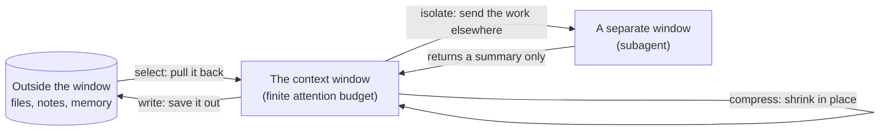

# Lesson 2: Four Levers on the Window

> Lesson objectives:
> - Sort any piece of context into write, select, compress, or isolate.
> - Rank the four by what they cost you, and reach for the cheapest one that fits.
> - Distinguish clearing a tool result from summarizing a conversation, and say why the difference matters.
> - Diagnose which lever a specific context problem needs, rather than defaulting to summarization.
>
> Prerequisites: Lesson 1's account of context rot and the four failure modes | Previous [<< 01](./01-context-rot-and-the-attention-budget.md) | Next [03 >>](./03-what-compaction-keeps.md)

## The reflex that costs you the most

Lesson 1 left you with a constraint and no procedure. Faced with a full window, almost everyone reaches for the same move: summarize the conversation and keep going. It is the most visible option, most tools put it behind a single command, and it works often enough to feel like the answer.

It is also the most expensive of your options, and it is frequently the wrong one. Summarizing rewrites your history through a model, which costs a call, discards detail on a judgment you did not make, and — the part almost nobody accounts for — throws away the cached prefix your session was reusing. Meanwhile the largest single occupant of most agent windows is usually a set of tool results that could have been dropped outright, no model call, no judgment, nothing lost that anyone would want back.

This lesson gives you the sorting step, so that "the window is filling up" turns into a specific choice rather than a reflex.

## Explanation

### Four things you can do with a piece of context

LangChain's Lance Martin proposed a four-way split that has since become common vocabulary. Each is defined in one line:[^S7]

- "**Writing** context means saving it outside the context window to help an agent perform a task."
- "**Selecting** context means pulling it into the context window to help an agent perform a task."
- "**Compressing** context involves retaining only the tokens required to perform a task."
- "**Isolating** context involves splitting it up to help an agent perform a task."

This taxonomy is one team's proposal rather than a standard, and other vendors carve the same territory differently — Anthropic names three techniques rather than four: "compaction, structured note-taking, and multi-agent architectures."[^S1] The two map onto each other cleanly enough (note-taking is write, compaction is compress, multi-agent is isolate), and the four-way version is worth adopting because it separates *saving something out* from *choosing what comes back in*, which are different decisions with different failure modes.



The diagram is worth one sentence of reading: write and select are a pair moving material across the window boundary in opposite directions, compress is the only lever that operates entirely inside the window, and isolate is the only one that creates a second window. Lessons 3 through 5 take compress, write, and isolate in turn; select is the lever this course touches least, because it is mostly retrieval engineering and belongs to a different topic.

### Sort by cost, not by visibility

The four levers are not equally priced, and the ordering is the practical content of this lesson. Ranked from cheapest to most expensive:

| Lever | What it costs | When it is the right call |
|---|---|---|
| Compress by **clearing** | Nothing but the cache prefix | Tool output already processed and never needed again |
| **Write** | A file write, and the discipline to keep it current | State that must survive a boundary or a session |
| **Isolate** | A separate window that cannot see yours | A noisy workstream whose detail you will never need |
| Compress by **summarizing** | A model call, the cached prefix, and lost detail you did not choose | The conversation itself is genuinely too long |

The ordering has a reason behind each step. Clearing is deterministic — you specify what goes and it goes, with no model judgment involved. Writing is cheap but adds a maintenance obligation, since a stale note is worse than none. Isolating is cheap in tokens and expensive in coupling, which Lesson 5 prices properly. Summarizing is last because it is the only one that loses information you never got to inspect.

That ranking is this course's synthesis rather than a claim any single source makes as a rule. The individual pieces are each sourced below.

### The cheapest lever, and why it usually wins

Anthropic names it directly: "An example of low-hanging superfluous content is clearing tool calls and results – once a tool has been called deep in the message history, why would the agent need to see the raw result again? One of the safest lightest touch forms of compaction is tool result clearing."[^S1]

The API-level version makes the mechanism concrete. The `clear_tool_uses_20250919` strategy "clears tool results when conversation context grows beyond your configured threshold," and the reasoning is stated plainly: "Older tool results (like file contents or search results) are no longer needed once Claude has processed them."[^S15] As of 2026-08-23 that strategy identifier is a dated version string and will change; the mechanism is the durable part.

Think about what this means for the session in Lesson 1. Two full test logs, one large, neither ever read again. Clearing them costs a model no judgment: the material is spent context, and provably so. Summarizing them costs a call and produces a paragraph nobody will read either. Deleting is strictly better than compressing something that has no future readers.

The one real cost is caching. "Tool result clearing: Invalidates cached prompt prefixes when content is cleared. To account for this, clear enough tokens to make the cache invalidation worthwhile."[^S15] Any change to the earlier part of a conversation invalidates the cache from that point forward, which is why clearing a handful of tokens repeatedly is worse than clearing a large block once.

### Write is not the same as compress

The confusion worth heading off: writing something to a file and summarizing the conversation both make the window smaller, and they are not substitutes.

A summary is lossy by construction and stays in the conversation. A written note is externalized and *recoverable* — the material still exists at full fidelity, and the agent can read it again when it needs it. Anthropic's term for the practice is **structured note-taking**: "a technique where the agent regularly writes notes persisted to memory outside of the context window. These notes get pulled back into the context window at later times."[^S1]

The distinction that decides between them is whether you will need the material again. If you will, write it out, because compressing it destroys the copy. If you provably will not, clear it. Summarizing is what remains when the material is conversation itself — a chain of reasoning and decisions that has no file form and cannot simply be dropped.

### Isolate moves work, not just text

The fourth lever is different in kind. Write, select, and compress all manipulate text relative to one window. Isolate creates a second window and puts a chunk of the *work* in it.

"One of the most popular ways to isolate context is to split it across sub-agents,"[^S7] and Anthropic describes the token shape: "Each subagent might explore extensively, using tens of thousands of tokens or more, but returns only a condensed, distilled summary of its work (often 1,000-2,000 tokens)."[^S1] That is a large asymmetry, and it is the entire reason the lever exists — the exploration happened, and your window paid for the conclusion rather than the search.

Note the shape of that trade before Lesson 5 examines it properly: the boundary is symmetric. Detail does not come back, and context does not go out. That second half is the cost, and it is the reason isolation sits below writing in the ranking rather than above it.

### Diagnosing which lever a problem needs

Two questions, in order, resolve most cases:

1. **Will this material be read again?** No → clear it. Yes → question 2.
2. **Does it need to be in the window right now?** No → write it out and select it back when needed. Yes → it stays, and if the window is still too full, the problem is the work rather than the context, which means isolating a piece of it or summarizing.

The failure this prevents is treating every context problem as a compression problem. Compression is the answer when your *conversation* is too long. It is the wrong answer when your window is full of spent tool output (clear it), or of state you keep re-deriving (write it), or of one noisy workstream (isolate it).

## Worked example: sorting one full window

The Lesson 1 session, at turn 22, sorted item by item. For each occupant: which lever, and why.

```text
OCCUPANT                              LEVER        REASONING
────────────────────────────────────────────────────────────────────────
Two test logs (turn 9)                clear        Already processed. The
                                                   agent extracted "3 tests
                                                   fail in auth.test.ts" and
                                                   will never re-read the raw
                                                   output. Deterministic
                                                   removal, no judgment call.

middleware.ts, read in full           clear        Read to check one import.
to check one import                                The finding survives in the
                                                   agent's reasoning; the 400
                                                   lines are spent.

"Don't touch middleware.ts"           write        Load-bearing, must outlive
(turn 1 constraint)                                any boundary. Belongs in the
                                                   project instructions file,
                                                   not in message history where
                                                   it competes for attention.

The abandoned approach (turn 15)      compress     No file form. It is
                                      (summarize)  conversation, and it is
                                                   actively harmful — it is
                                                   the clash from Lesson 1.
                                                   A summary that records
                                                   "tried X, rejected because
                                                   Y" keeps the lesson and
                                                   drops the competing plan.

auth.ts + tokens.ts (the files        keep         This is the actual task.
being edited)                                      Nothing to do here.

Twelve MCP tool schemas               isolate      Not needed for this task at
                                      or clear     all. If a later step needs
                                                   the database, that step is a
                                                   candidate for a subagent
                                                   that carries the schemas in
                                                   its own window.
```

Two things to take from this table.

First, the largest reclaimable block — the two logs plus the fully-read file — needed no model call and no judgment about importance. That is the ordering paying off: the biggest win came from the cheapest lever.

Second, the one item that genuinely needed summarizing was the abandoned approach, and it needed summarizing not because it was large but because it was *conflicting*. That is a different reason from "the window is full," and it is the reason worth learning to recognise: summarization's real job is resolving history, not shrinking it.

## Your turn: sort four occupants

Assign a lever to each, with one sentence of reasoning. Then answer the question at the end, which is the one that separates the rule from the reflex.

```text
1. A 2,000-line API response the agent fetched, from which it needed
   three fields. Fetched 30 turns ago.
   Lever: __________  Because: __________

2. A design decision you and the agent reached together in turn 8, which
   the next three days of work depend on.
   Lever: __________  Because: __________

3. Documentation for a library the agent is about to use for the next
   ten turns.
   Lever: __________  Because: __________

4. A dependency audit that will read 200 package manifests and report
   which have known issues. Not started yet.
   Lever: __________  Because: __________

Question: which of these four, if you got the lever wrong, would produce a
failure you would not notice until much later? __________
```

Reference answers:

```text
1. Clear. It has been read; the three fields are in the agent's reasoning.
   The other 1,997 lines have no future reader. Nothing is lost by removal,
   so nothing is gained by summarizing it.

2. Write. It must survive every boundary from here to the end of the task,
   and a summary is not a guarantee — it is a model's judgment about what
   mattered, made without knowing what the next three days need. Put it in
   a file the agent reads at session start.

3. Keep it, and if the window is tight, select rather than load: pull the
   sections needed for the current step. Loading whole documentation up
   front is the just-in-case habit that fills windows. If the whole thing
   is genuinely needed for ten straight turns, it is working context and
   belongs in the window.

4. Isolate. It is high-volume, low-coupling, read-only, and you want the
   report rather than the 200 manifests. This is the canonical shape for
   the isolate lever, and Lesson 5 gives it a proper name.

Question: number 2. Getting 1, 3, or 4 wrong costs you tokens and you find
out immediately — the window is fuller than you wanted, or a subagent came
back thin. Getting 2 wrong is silent: the decision gets summarized into a
sentence that loses the reason behind it, or drops out entirely, and you
discover it when work three days later contradicts it. Cheap levers fail
loudly. The write lever fails quietly, which is why Lesson 4 is about it.
```

```agentmentor-action
mode: reasoning_audit
label: Audit whether I reach for summarizing when clearing would do
description: Probes whether I actually apply the "will it be read again" test, or whether I classify by size and reach for compaction because it is the visible button.
purpose: I want to be caught choosing the expensive lever out of habit on cases where deterministic clearing or a written note is the correct call, before I build a context budget in Lesson 6 on top of that habit.
rules:
  - Give me one context occupant at a time from a realistic long agent run, and ask which lever I would use and why.
  - Do not tell me the answer first. Respond to my reasoning by naming the specific test I skipped, such as whether the material has a future reader.
  - Include at least one case where summarizing genuinely is correct, so I cannot pass by always answering "clear it".
  - Keep each exchange under six sentences.
```

<!-- exercises -->
## 💻 Exercises (point these at your own real environment)

### Level 1 (warm-up)

Take a session you are currently in, or start one on real work and run it until you have done ten or more turns. List every distinct thing that entered the window, then assign each one a lever using the two-question test. Total up what would be reclaimed by clearing alone.

How: work from your terminal scrollback or your tool's transcript. Every file read, every command output, every search result is one line on your list. Estimate sizes from the files themselves — you do not need exact token counts, since the ratios are what matter.

<!-- rubric -->
- Every item on your list has a lever assigned and one sentence of reasoning.
- Your reasoning cites the two-question test, not the item's size.
- You have a total for what clearing alone would reclaim, and it is expressed as a rough share of what entered the window.
- At least one item is assigned "write" and you can name where the file would live.
- You identify at least one item where you would previously have reached for summarization and the test says otherwise.
<!-- answer -->
On a typical coding session, spent tool output is the largest reclaimable category, and the biggest single item is often one file read in full to answer one question. A finished list has entries like: "Turn 6, `npm test` verbose output, roughly 8k tokens, CLEAR — the agent extracted the failing test names and the raw log has no future reader." The most common misassignment is marking a file the agent is actively editing as clearable because it is large; the two-question test catches it at question one, since it will be read again. A worked total often lands with spent tool output as the majority of everything that entered, which is the point of the exercise: the cheapest lever addresses the largest share. If your session was mostly conversation with few tool calls, that is a legitimate finding and means your window is genuinely a compression case, which is the minority shape.
<!-- hint -->
Start with the biggest items and ask only question one about them. Most large items are tool output, and most tool output answers "no."
<!-- hint -->
If an item is hard to classify, it is usually because it is doing two jobs — a file read both to answer a question and to be edited. Split it: the answer is spent, the file is live.

### Level 2 (advanced)

Find out what your tool actually offers for each of the four levers, and write down the gaps. Read its documentation for context management, then test one lever you have never used.

How: for each lever, name the concrete mechanism your tool gives you — a command, a config setting, a file convention, a flag — or write "none available." Then pick one you have not used and run it on real work. Note what it did and what it cost.

<!-- rubric -->
- All four levers have either a named mechanism or an explicit "none available."
- Each named mechanism is quoted or paraphrased from your tool's current documentation, not from memory.
- You ran one previously-unused lever on real work and recorded what happened.
- You identify which lever your tool makes easiest and whether that matches the cost ordering in this lesson.
- You name one lever where you would have to build the discipline yourself because the tool does not enforce it.
<!-- answer -->
A completed audit usually finds an asymmetry: compression by summarizing is a single command in most tools, clearing is either automatic or unavailable as an explicit action, writing is a file convention the tool loads but does not enforce, and isolating is available but under-used. That asymmetry is the finding — the tool's easiest lever is the most expensive one, which is exactly why the reflex forms. A common mistake in this exercise is writing the mechanism from memory; product surfaces change on a scale of weeks, and a lever you remember may have been renamed or replaced, which is why the rubric asks you to quote current documentation. The lever people most often discover they have never used is isolation, and running one read-only delegation is enough to see the asymmetry in Lesson 5 first-hand.
<!-- hint -->
Search your tool's docs for "context" as a category rather than for the lever names — vendors use their own vocabulary, and the four names in this lesson are not universal.
<!-- hint -->
If a lever has no mechanism, ask whether it can be done by convention instead. Writing has no enforcement in most tools and works fine as a habit.
<!-- /exercises -->

## Where each lever gets its own lesson

You can now sort a full window into four buckets and reach for the cheapest lever that fits. The two-question test — will this be read again, does it need to be here now — resolves most items without any judgment about importance.

What it does not resolve is what happens when compression is genuinely the answer. You will summarize eventually; every long task does. The question that decides whether the run survives it is what the summary keeps, and that is not up to you unless you make it so.

The next lesson takes that boundary apart: what crosses it, what does not, and why the losses are systematic rather than random.
