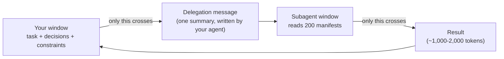

# Lesson 5: Putting Noise Behind a Boundary

> Lesson objectives:
> - Describe what crosses a subagent boundary in each direction, and what does not.
> - Identify the workstream shape that suits isolation, and the shape that does not.
> - State the two costs of the boundary and price them against the tokens saved.
> - Decide, for a specific piece of your own work, whether it belongs behind a boundary.
>
> Prerequisites: Lesson 2's four levers, and Lesson 4's note-writing habit | Previous [<< 04](./04-notes-outside-the-window.md) | Next [06 >>](./06-a-context-budget-for-one-task.md)

## The audit that ate the session

You are three hours into real work. You ask a side question — which of our dependencies have known advisories — and the agent starts reading package manifests. Two hundred of them, plus advisory pages, plus version histories. Ten minutes later you have your answer: four packages, here they are.

You also have a window in which the last thirty thousand tokens are manifest files nobody will read again, sitting on top of the actual task. The answer was five lines. The search that produced it is still in your context, and it will be in your context for the rest of the session, drawing on the same attention budget as the work you came here to do.[^S1]

Isolation is the lever for this. It is worth being precise about the claim: this lesson is not about running agents in parallel, dividing a task among workers, or synthesising results from several sources. That is a different subject with different problems, and it is not this one. Here, a subagent does one job — it keeps a loud workstream out of your window.

## Explanation

### What the boundary is

"Each subagent runs in its own context window with a custom system prompt, specific tool access, and independent permissions."[^S12] That is the whole mechanism. A second window, and a narrow channel between it and yours.

The channel is narrow in *both* directions, and the second half is the part people miss.

Outbound, detail does not return: "the subagent does that work in its own context and returns only the summary."[^S12] Anthropic's engineering write-up gives the shape of the asymmetry: "Each subagent might explore extensively, using tens of thousands of tokens or more, but returns only a condensed, distilled summary of its work (often 1,000-2,000 tokens)."[^S1] That ratio — tens of thousands spent, one to two thousand returned — is what makes the lever worth using.

Inbound, your context does not travel: "Each subagent starts with a fresh, isolated context window. It doesn't see your conversation history, the skills you've already invoked, or the files Claude has already read. Claude composes a delegation message that summarizes the task, and the subagent works from there."[^S12]

Read that twice. The subagent does not know what you decided in turn 14. It does not know the constraint you gave at the start. It knows a delegation message, written by your main agent, about a task — and that message is the entire inheritance.



The diagram is there to make one thing visible: both arrows crossing the boundary are narrow, and the left one is the one that costs you. Everything your session knows has to fit through a delegation message that your agent writes on the spot.

### The shape that suits isolation

Anthropic names the strongest case: "One of the most effective uses for subagents is isolating operations that produce large amounts of output. Running tests, fetching documentation, or processing log files can consume significant context. By delegating these to a subagent, the verbose output stays in the subagent's context while only the relevant summary returns to your main conversation."[^S12]

Three properties make a workstream a good candidate, and all three have to hold:

**High volume, low conclusion.** A workstream that is high volume, low conclusion reads a lot and concludes a little. Two hundred manifests in, four package names out. If the ratio is near one — the output is as large as the input — the boundary buys you nothing.

**Low coupling.** The work can be specified without your session's accumulated decisions. "Find dependencies with advisories" needs no knowledge of your architecture debate. "Refactor the auth module in line with what we agreed" needs all of it, and none of it will cross.

**Read-only, or close to it.** The subagent's conclusions come back as text; its judgment calls do not. Work that mostly reads and reports fits. Work that makes many small decisions along the way does not, because those decisions were made without your context and you will not see them.

That third property is the one worth being strict about, and the argument for strictness comes from a source that is skeptical of this whole approach.

### What the boundary costs

Cognition's engineering blog argues against splitting work across agents, and its objection is precise. Two of its principles: "Share context, and share full agent traces, not just individual messages," and "Actions carry implicit decisions, and conflicting decisions carry bad results."[^S13]

The mechanism behind that second line is the one to hold onto. Every action an agent takes embeds decisions it never announced. A subagent asked to survey error-handling patterns decides what counts as error handling, which layer to look at, whether to include the vendored code. Those choices shape its answer, and none of them arrive with it. You get four packages and no visibility into what "known advisory" meant to the thing that produced the list.

Cognition is arguing a position on a vendor blog rather than reporting a measurement, and the position is stronger than what this lesson recommends — they are largely against the pattern where this lesson says "use it for a narrow shape." But the mechanism they name is real, and it is why the read-only property matters: a subagent that only reports lets you inspect the conclusion, while a subagent that also acts has already applied its unstated decisions to your repository.

They also note that compressing a long trace into something a later agent can act on is "hard to get right," to the point that at Cognition it has meant fine-tuning a model for the job.[^S13] Every subagent result you receive is that compression, done in one pass with no tuning. Treat it as a lead rather than as a finding.

So the two costs, priced:

| Cost | What it means | When it bites |
|---|---|---|
| Inbound blindness | The subagent has your task, not your session | Work whose correctness depends on decisions you made earlier |
| Unstated decisions | Its judgment calls shaped the answer and did not come back | Anything you will act on without verifying |

Against the saving: tens of thousands of tokens that never enter your window.[^S1] That is a good trade for a dependency audit and a bad one for a refactor.

### The exception that proves the mechanism

There is a variant that trades the saving away to remove the first cost, and understanding it clarifies what the boundary actually is.

"A fork is a subagent that inherits the entire conversation so far instead of starting fresh. This drops the input isolation that subagents otherwise provide: a fork sees the same system prompt, tools, model, and message history as the main session... The fork's own tool calls still stay out of your conversation and only its final result comes back, so your main context window stays clean."[^S12] The documented use: "when any other subagent would need too much background to be useful."[^S12]

A fork keeps the outbound narrowing — noise stays out of your window — and gives up the inbound narrowing. That is the correct read of what these two directions are: separable, and each has its own price. Full isolation is cheap and blind. A fork is informed and copies your window's contents to start.

As of 2026-08-23 this is one tool's feature and the name will not be universal, so treat it as an illustration of the mechanism rather than a step to follow.

### When not to reach for it

The documentation names the alternative for a common confusion: "Consider Skills instead when you want reusable prompts or workflows that run in the main conversation context rather than isolated subagent context."[^S12] If what you want is a repeatable procedure, isolation is the wrong lever — you want the procedure available *in* your window, not behind a wall.

And the plainest test, which catches most bad delegations before they happen: **if writing the delegation message requires you to re-explain your session, the work is coupled and does not belong behind a boundary.** That difficulty is not a prompting problem to push through. It is the measurement of how much context the work needs, arriving before you pay for it.

```agentmentor-check
{
  "id": "context-engineering-isolate-coupling-test",
  "label": "Judge which task survives delegation",
  "prompt": "You are two hours into a session in which you and the agent agreed to keep the new billing code free of the legacy currency helper, for reasons you worked out together. Four side tasks come up. Which one is the safest to send behind a subagent boundary?",
  "whyHere": "Once readers see the token asymmetry, the temptation is to delegate anything large. The boundary is symmetric, and the inbound half is what makes a delegation unsafe. This forces a judgment about coupling rather than about size.",
  "copyPurpose": "Have the agent check whether I am choosing what to delegate by how many tokens it would save, rather than by whether the work depends on decisions my session made.",
  "mode": "single",
  "choices": [
    {
      "id": "audit",
      "text": "List every file in the repository that imports the legacy currency helper, with line numbers",
      "correct": true,
      "feedback": "High volume in, short list out, and the task is fully specified by its own wording — nothing about why the helper is being avoided changes which files import it. It is also read-only, so the subagent's unstated judgment calls produce a list you can verify rather than edits you would have to discover."
    },
    {
      "id": "refactor",
      "text": "Migrate the three worst offenders off the legacy helper",
      "correct": false,
      "feedback": "This is the reasoning you and the agent did together, applied by something that cannot see it. The subagent will decide what replaces the helper using its own judgment, and those decisions arrive already written into files rather than as a proposal you can reject."
    },
    {
      "id": "design",
      "text": "Propose the interface the new billing code should expose",
      "correct": false,
      "feedback": "Coupling is total: the proposal's whole value depends on the constraints your session accumulated, and none of them cross the boundary. It also fails the volume test in the other direction, since a design proposal is a small read and a large write."
    },
    {
      "id": "docs",
      "text": "Read the payment provider's API documentation and summarise the parts about currency rounding",
      "correct": false,
      "feedback": "Tempting, because it has the right volume shape and is read-only. What it lacks is a specification tight enough to survive the crossing: 'the parts about currency rounding' means something specific in light of the decision you made, and the subagent will apply its own reading of relevance. Delegate it only after you can name what makes a passage relevant without reference to your session."
    }
  ]
}
```

## Worked example: one delegation, written and priced

The dependency audit from the top of the lesson, done deliberately.

First, the three properties, checked before delegating:

```text
High volume, low conclusion?  Yes. ~200 manifests plus advisory lookups
                              in; a list of affected packages out.
                              Ratio is strongly favourable.

Low coupling?                 Yes. "Which dependencies have advisories"
                              is fully specified by its own words. It
                              does not depend on today's architecture
                              decision, the constraint from turn 1, or
                              anything else in the session.

Read-only?                    Yes, as specified. It reports; it does not
                              upgrade anything. This is a choice — the
                              task could have been "upgrade the affected
                              packages," and that version fails the test.
```

All three hold. Now the delegation message, which is the entire inheritance:

```text
Search this repository's dependency manifests for packages with known
security advisories.

Scope: package.json and package-lock.json at the repo root and in
packages/*. Do not read application source.

For each affected package report: name, current version, advisory
severity, and the lowest version that resolves it. If a package is a
transitive dependency, name the direct dependency that pulls it in.

Report packages with no advisories as a count only, not a list.

Do not modify any file. If you cannot determine a package's advisory
status, list it under "unknown" rather than assuming it is clean.
```

Four things in that message are doing work, and each corresponds to a boundary property.

*Scope* is explicit because the subagent has no idea what "the dependencies" means in a repository it has never seen. Without a scope it will decide, and that decision will not come back.

*The report format* is specified because the return channel is the only channel. A field you did not ask for is a field you will not get, and asking afterwards means running it again.

*The count-only clause* for clean packages exists because the return is your cost. A list of 196 clean packages would put the noise you were avoiding back in your window through the front door.

*The unknown category* is there because the failure mode of a summarizing subagent is confident omission. Without a named place to put uncertainty, uncertainty becomes silence, and silence reads as "clean."

What came back, and what to do with it:

```text
4 packages with advisories:
  - lodash 4.17.15 → 4.17.21 (high, prototype pollution)
  - minimist 1.2.0 → 1.2.6 (critical, prototype pollution),
    transitive via mkdirp
  - node-fetch 2.6.1 → 2.6.7 (high, information exposure)
  - tar 4.4.10 → 4.4.19 (high, path traversal)
187 packages checked, no advisories.
5 unknown (private registry, no advisory data reachable).
```

Roughly two hundred manifests were read and about eighty tokens came back. That is the lever working.

Now the part people skip. The five unknowns are the most valuable line in the report, and they are the line a subagent without the explicit instruction would have folded into "no advisories." And every number here is a claim from something whose search process you did not see — you do not know what it counted as an advisory, or whether "no advisory data reachable" meant it tried twice or once. Before acting, verify at least one entry against the source directly.

That is not distrust of the model. It is the unstated-decisions cost being paid rather than ignored: the boundary that kept the noise out also kept out everything that would let you audit the conclusion.[^S13]

## Your turn: price a delegation

A session where you are refactoring a payment module. Four candidate side tasks. For each, mark DELEGATE or KEEP and give the property that decides it.

```text
1. Find every place in the codebase where a currency amount is stored
   as a float rather than an integer.
   ____________  Deciding property: ____________

2. Read the last 5,000 lines of the production error log and identify
   which errors relate to payments.
   ____________  Deciding property: ____________

3. Rename the internal PaymentIntent type to Charge across the module,
   in line with the naming we settled on an hour ago.
   ____________  Deciding property: ____________

4. Check whether the approach we just chose conflicts with anything in
   the payment provider's terms of service.
   ____________  Deciding property: ____________
```

Reference answers:

```text
1. DELEGATE. All three properties hold: a whole-codebase search in, a
   list of locations out; fully specified without session context;
   read-only. The canonical shape.

2. DELEGATE, with a tightened spec. Volume and read-only are clearly
   right. Coupling is the risk — "relate to payments" is a judgment,
   and the subagent will make it its own way. Name the criteria in the
   delegation: which modules, which error classes, which time window.
   The general move: when a task is nearly delegable, the fix is a
   tighter specification, not a longer delegation message about your
   session.

3. KEEP. It fails two properties at once. It writes rather than reads,
   so the subagent's decisions land in files rather than in a report.
   And "in line with the naming we settled on" is exactly the material
   that does not cross — the subagent gets a delegation message about
   a rename, not the hour of discussion that decided it.

4. KEEP, and this one is the instructive case. It looks delegable:
   external material, read-only, bounded. But "the approach we just
   chose" is the entire content of the question, and it lives in your
   session. To delegate it you would have to explain the approach in
   the delegation message — and the moment you find yourself writing
   that explanation, the coupling test has already returned its answer.
```

Item 4 is the test in its purest form. **The effort of writing the delegation message is the measurement.** When it is one paragraph you could have written before the session started, delegate. When it requires you to reconstruct your session's reasoning, the work is coupled, and the boundary would cost you more than the tokens it saves.

<!-- exercises -->
## 💻 Exercises (point these at your own real environment)

### Level 1 (warm-up)

Find a real high-volume, low-conclusion task in your own current work and delegate it. Write the delegation message before running it, applying the four elements from the worked example: scope, report format, what to omit, and where uncertainty goes.

How: candidates are anything that reads much more than it concludes — a search across a repository, a log scan, a documentation lookup, a survey of how a pattern is used. Write the message, run it, and record roughly what the subagent read against what came back.

<!-- rubric -->
- The task passes all three properties, and you can state each one before running it.
- Your delegation message names a scope, a report format, what to leave out, and where to put uncertainty.
- You recorded the approximate volume read against the volume returned.
- You verified at least one claim in the result against the source directly.
- You can name one unstated decision the subagent must have made to produce its answer.
<!-- answer -->
A good delegation returns something short enough to read in under a minute from work that would have filled a large share of your window. The element people most often omit is where uncertainty goes, and its absence is invisible: the report looks complete because there is no category for what could not be determined, so gaps are silently rendered as clean results. The verification step is not optional busywork — it is how you find out whether the subagent's reading of your scope matched yours, and it typically takes one lookup. On unstated decisions, every result has some: what counted as a match, whether to follow imports, whether generated files were in scope. Naming one is the point of the exercise, because a result whose decisions you cannot name is a result you cannot judge. If your first attempt comes back thin or off-target, the delegation message is almost always the cause rather than the subagent — reread it as if you had no other information, which is the subagent's actual situation.
<!-- hint -->
Write the delegation message and then reread it as a stranger. Anything you understand only because you have been in this session for two hours has to be stated.
<!-- hint -->
If you cannot name the report format you want, you are not ready to delegate — you are still exploring, and exploring is work that belongs in your own window.

### Level 2 (advanced)

Deliberately delegate something that fails the coupling test, and document what breaks. Then repair it either by tightening the specification or by pulling the work back, and say which repair applied.

How: pick a task from your real work that depends on decisions your session made — a change consistent with an approach you chose, a judgment call that follows from earlier reasoning. Delegate it with an ordinary short message. Compare what comes back against what you would have done, and identify each divergence as a decision the subagent made without your context.

<!-- rubric -->
- The delegated task genuinely depended on session context, and you can name which decision.
- You identify at least two divergences between the result and what you intended.
- Each divergence is traced to a specific piece of context that did not cross the boundary.
- You state which repair applies — tighter specification, or the work belongs in your window — and why.
- You can say what the delegation cost in tokens and time against what it saved.
<!-- answer -->
The instructive outcome is a result that is defensible on its own terms and wrong for your session. That is the signature of a coupling failure and it is why these are dangerous: nothing looks like an error, so the divergences are found by comparison rather than by inspection. A typical divergence is a subagent choosing a plausible pattern that the session had already rejected an hour earlier, for reasons that were never in the delegation message. The repair question separates two cases: if you can state the missing constraint as a rule that stands on its own — "use the new currency type, never the legacy helper" — a tighter specification fixes it, and the delegation was salvageable. If the missing context is a chain of reasoning rather than a rule, no message length fixes it and the work belongs in your window. A common mistake is concluding that the subagent performed badly; on the information it had, it usually performed well, and reading the failure as a quality problem leads to writing longer delegation messages instead of noticing the coupling.
<!-- hint -->
Compare against what you would have done, not against whether the output is reasonable. A coupled failure is usually reasonable and wrong.
<!-- hint -->
If your repair is a longer delegation message that reconstructs your session's reasoning, you have found the answer: that reconstruction is the context the boundary cannot carry.
<!-- /exercises -->

## Four levers, one task

You can now put a loud workstream behind a boundary and price what the boundary costs. Both directions are narrow: detail does not come back, and your context does not go out. The three properties — high volume with a short conclusion, low coupling, read-only — decide it, and the effort of writing the delegation message measures the coupling before you pay for it.

That completes the levers. You can clear what is spent, write what must survive, isolate what is loud, and read a compaction boundary well enough to know what it will take.

What remains is doing all of it at once, in advance, on a task that has not started. Applied one at a time and reactively, these techniques fire after the window is already in trouble. The last lesson turns them into a plan you make before the first turn, and then checks that plan against what the session actually spent.
