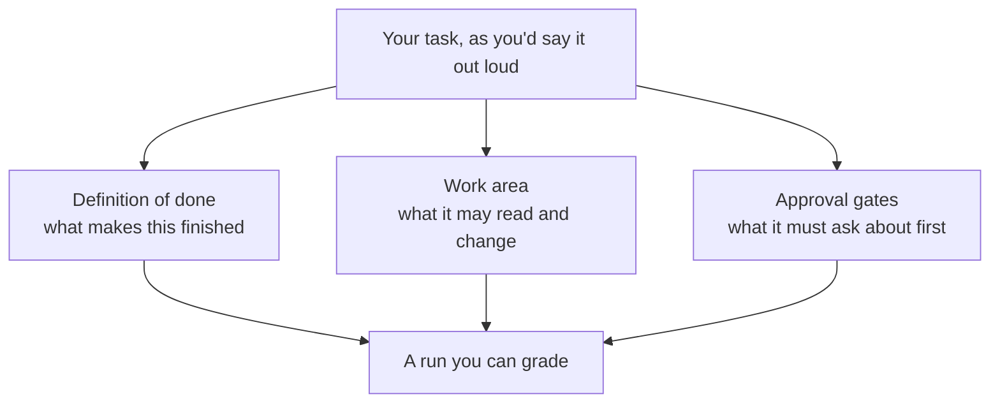

# Lesson 2: Drawing the Edges of a Task

> Lesson objectives:
> - Rewrite a vague request as a finish line the agent can check itself against.
> - Separate what the agent is technically able to reach from what it must ask you about.
> - Name the actions in your own task that deserve an approval gate before the run starts.
>
> Prerequisites: Lesson 1's four-question delegation test, and one candidate task written down | Previous [<< 01](./01-delegating-vs-chatting.md) | Next [03 >>](./03-where-agents-get-stuck.md)

## "Clean up old branches"

Here is a request that sounds completely reasonable, and a run that went wrong.

Anthropic publishes it as a worked example from their internal incident log: "A user asked to 'clean up old branches.' The agent listed remote branches, constructed a pattern match, and issued a delete."[^S4]

You do not need to know what a branch is to see the shape of this. Someone asked for tidying. The agent tidied. It tidied further than the person meant, and the tidying could not be taken back.

Now the important part, in Anthropic's words: "The action instead looks like reasonable problem-solving, only applied past the boundary of what the user authorized or intended."[^S4] There was no misunderstanding of the words. "Clean up" really does mean remove things. The request simply never said *how far*, and the agent had to pick a value for something the person never specified.

This lesson is about writing down those values before the run, instead of discovering afterwards which one the agent picked.

## Explanation

### The gap a vague request leaves

When you say "clean up old branches," you are carrying three unstated things in your head: how old counts as old, which ones are yours to remove, and whether you meant "show me candidates" or "delete them." You know all three. The request contains none of them.

An agent cannot leave a blank blank. To act, it needs a value, so it infers one from context. That inference is usually sensible and occasionally catastrophic, and — this is the part worth internalizing — it is invisible to you either way, because the agent does not announce that it just decided something on your behalf.

A **task boundary** is the set of decisions you make explicitly so the agent does not have to guess them. It has three parts, and it is worth keeping them separate because they fail differently:



The three parts answer three different questions — when to stop, where to reach, and when to pause — and leaving any one of them implicit is what produces the "clean up old branches" outcome.

### Part one: a definition of done the agent can check

A **definition of done** is a finish line stated so that the agent can test its own work against it, rather than deciding for itself when the task feels complete.

Compare these two:

```text
Weak:   "Organize my invoices."
Strong: "Every PDF in ~/invoices/2026 appears as one row in summary.csv with
         date, vendor, and total. Report the count of files you could not read."
```

The second is not longer for the sake of detail. It is checkable: you can count rows against files. And notice what the last sentence does — it makes the failures *reportable*. Without it, twenty unreadable files produce silence, and silence looks exactly like success. Naming what should happen to the parts that do not work is often the highest-value sentence in the whole boundary.

A useful test: could someone else, given only your definition of done and the finished result, tell you whether the task succeeded? If it takes your judgment to decide, the agent had no finish line either.

### Part two and three: what it can reach, and what it must ask

Here is a distinction that most people collapse into a single vague sense of "how much freedom to give it." Two products draw it as two separate axes, and keeping them separate is what makes a boundary tractable.

OpenAI's Codex documentation splits its controls in exactly this way — sandbox mode is "What Codex can do technically (for example, where it can write and whether it can reach the network) when it executes model-generated commands," while approval policy is "When Codex must ask you before it executes an action (for example, leaving the sandbox, using the network, or running commands outside a trusted set)."[^S9]

So:

- A **work area** is what the agent can technically touch at all — its blast radius if something goes wrong. Codex's local default is instructive: the sandbox "limits what it can touch (typically to the current workspace)."[^S9] Things outside it are not merely discouraged; they are out of reach.
- An **approval gate** is a point where the agent must stop and ask you before proceeding with something it *is* able to do.

The difference matters because they fail differently. A work area that is too wide fails silently — you never see the reach you did not want. An approval gate that is too broad fails loudly and annoyingly, by interrupting you constantly. You want the work area tight and the gates few and well-chosen.

And a gate is not a yes/no switch. Claude Code's permission documentation describes three outcomes: "Allow rules let Claude Code use the specified tool without manual approval. Ask rules prompt for confirmation whenever Claude Code tries to use the specified tool. Deny rules prevent Claude Code from using the specified tool."[^S10] The ordering is worth knowing too — "Rules are evaluated in order: deny, then ask, then allow"[^S10] — meaning a block wins over a permission, so you can open a category broadly and still carve a hole out of it.

Whatever tool you use and whatever it calls these, allow / ask / deny is the shape of the decision you are making for each kind of action. As of 2026-08-23 those are the terms in these two vendors' documentation; the names will drift, the three-way choice will not.

### Stopping conditions

One more piece, and it exists because runs do not always end by finishing.

A **stopping condition** is a limit that ends the run regardless of whether the task is done — a maximum number of steps, a time budget, a rule like "stop and report if you hit the same error twice." Anthropic's guidance on agent design recommends including "stopping conditions (such as a maximum number of iterations) to maintain control."[^S1] Their computer-use documentation describes the same mechanism with the reason attached: an iteration limit is a "safeguard [that] prevents potential infinite loops that could result in unexpected API costs."[^S5]

This is a design principle rather than a product feature, and it long predates any current tool. The point is that an agent that cannot finish will not necessarily stop — it will keep trying, and each attempt costs you something. Deciding in advance how much you are willing to spend on failure is cheaper than discovering the answer afterwards.

```agentmentor-order
{
  "id": "agent-first-real-task-boundary-order",
  "label": "Order the boundary decisions",
  "prompt": "You are about to delegate: 'Go through my downloads folder and file everything into the right project folder.' Put these four decisions in the order you must settle them, from the one that constrains all the others to the one that depends on the rest.",
  "whyHere": "Readers tend to start by listing approval gates, but a gate is unanswerable until you know what finished looks like and where the agent may reach, so this checks the dependency order rather than the vocabulary.",
  "copyPurpose": "Have the agent check whether I am writing approval gates before I have actually defined what done means for this task.",
  "items": [
    { "id": "done", "text": "Define done: every file either sits in a named project folder or is listed in an unsorted report" },
    { "id": "area", "text": "Fix the work area: it may read and write inside Downloads and the project folders, nothing else" },
    { "id": "gates", "text": "Choose approval gates: ask before overwriting any file that already exists" },
    { "id": "stop", "text": "Set the stopping condition: stop and report if more than 20 files are ambiguous" }
  ],
  "correctOrder": ["done", "area", "gates", "stop"],
  "feedback": "Done comes first because it decides what counts as an unsorted file at all; the work area then bounds where that definition applies; gates protect the risky actions inside that area; and the stopping condition is a budget on the failures the first three did not prevent.",
  "feedbackWrong": "Check which decision the others depend on: you cannot say what needs approval, or when to give up, until you have said what finished means and which folders are in play."
}
```

## Worked example: turning a wish into a boundary

The raw request, the way it would actually arrive in your head:

```text
"Sort out my downloads folder, it's a disaster."
```

Every one of the three parts is missing. Filling them in:

```text
DEFINITION OF DONE
  Every file currently in ~/Downloads is either:
    - copied into one of the four existing folders in ~/Documents/projects/, or
    - listed in unsorted.md with a one-line reason it could not be placed.
  A file that is already in a project folder is left alone.
  Report: how many were placed, how many were listed as unsorted.

WORK AREA
  May read:    ~/Downloads, and the folder names under ~/Documents/projects/
  May write:   ~/Documents/projects/*, and a new unsorted.md
  May not touch: anything else in ~/Documents, and nothing outside my home folder.

APPROVAL GATES
  Ask before: overwriting any file that already exists at the destination.
  Ask before: creating any new project folder.
  Never: delete anything in ~/Downloads. Copy, don't move.

STOPPING CONDITION
  If more than 20 files can't be confidently placed, stop and show me the list
  before continuing.
```

Three things in there are doing real work, and none of them is about being thorough:

**"Copy, don't move"** converts the whole run from irreversible to reversible. If the sort is wrong, the originals are all still in Downloads and you have lost nothing but time. This single word is usually the highest-leverage line in a first boundary.

**"or listed in unsorted.md with a one-line reason"** gives the agent somewhere to put its failures. Without it, an agent facing an ambiguous file has two options — guess, or silently skip — and both are invisible to you.

**The stopping condition** catches the case where your four project folders turn out not to match your actual downloads at all. Better to learn that after 20 files than after 400.

## Your turn: bound a task where the destination already exists

The reversibility trick from the worked example does not save you here, because this task must write into files that already exist. Fill in the four sections.

```text
Task: "Update the contact details in my client documents — I've changed office address."

DEFINITION OF DONE
  _______________________________________________________________

WORK AREA
  _______________________________________________________________

APPROVAL GATES
  _______________________________________________________________

STOPPING CONDITION
  _______________________________________________________________
```

Reference answer:

```text
DEFINITION OF DONE
  Every file under ~/clients/ containing the old address string now contains the new one.
  Nothing else in those files has changed.
  Report: a list of every file changed, with the line that changed in each.

WORK AREA
  May read and write: ~/clients/**
  May not touch: anything outside ~/clients, including my email and calendar.

APPROVAL GATES
  Ask before editing any file: show me the exact before/after line first, for the first
  three files. After I confirm the pattern is right, proceed without asking on the rest.
  Never: change any file that does not contain the old address string.

STOPPING CONDITION
  If the old address appears in a format that doesn't match the pattern I gave you
  (different spacing, split across lines), stop and show me that file rather than guessing.
```

Two things to notice about that answer. The gate is *front-loaded* rather than uniform — you approve the first three edits to confirm the pattern, then let it run. A gate on all 200 edits would be worse, not safer, because by edit 40 you would be clicking without reading. That is the failure Lesson 5 is built around.

And "Report: a list of every file changed, with the line that changed" is not a courtesy. It is what makes the run auditable afterwards. Lesson 4 is entirely about why that line matters more than it looks.

<!-- exercises -->
## 💻 Exercises (point these at your own real environment)

### Level 1 (warm-up)

Take the candidate task you wrote down in Lesson 1 and write its full boundary: definition of done, work area, approval gates, stopping condition. Write it in a scratch file. Do not run it yet — Lesson 3 will have you resize it first.

How: work through the four sections in order, since each constrains the next. For the work area, write real folder paths from your own machine, not placeholders. For the definition of done, include what should happen to the items the agent cannot handle.

<!-- rubric -->
- The definition of done is checkable by counting or comparing, without needing your judgment call.
- The work area names real paths, and states at least one thing explicitly out of bounds.
- At least one approval gate names a specific action, not a general attitude like "be careful."
- The stopping condition names a number or a condition, not "if things go wrong."
<!-- answer -->
A passing boundary reads as a set of decisions someone else could apply. For example: "Done: every .md file in ~/notes/2026 has a title line at the top; files that already have one are untouched; report the count changed and the count skipped. Work area: read and write in ~/notes/2026 only; do not touch ~/notes/archive. Gate: ask before changing any file over 500 lines. Never delete. Stopping: if more than 10 files have no obvious title, stop and list them." A failing version keeps the judgment in your head: "Done: notes are tidy. Work area: my notes folder. Gate: check with me on anything weird." Neither "tidy" nor "weird" is a value the agent can evaluate, so it will supply its own.
<!-- hint -->
For the definition of done, finish this sentence: "I will know this worked if I can count ___ and it equals ___."
<!-- hint -->
For approval gates, look back at question 3 of your Lesson 1 delegation test. The irreversible action you named there is your first gate.

### Level 2 (advanced)

Write the same boundary twice for one real task — once so tight the task probably cannot be completed, once so loose that the "clean up old branches" failure could happen — then write the version you would actually run and explain what each of the other two got wrong.

How: use a real task with something at stake. For the too-tight version, gate every action. For the too-loose version, write it as you would have written it before this lesson. Then write the middle version and mark which specific line moved it out of each failure mode.

<!-- rubric -->
- All three versions cover the same task and the same material.
- You identify a specific cost of the too-tight version beyond "it is slow" — name what the reader stops doing carefully.
- The too-loose version fails on an unstated value the agent would have to invent, and you name which one.
- The runnable version names the line that fixes each problem.
<!-- answer -->
Example, for "tidy up my photo library": the too-tight version asks before every single file operation, which sounds safe but produces hundreds of prompts — and the real cost is that you stop reading them, so the gate protects nothing while still costing you the afternoon. The too-loose version says "remove the duplicates," leaving the agent to invent a definition of duplicate — same filename? same size? same image at different resolutions? — and the answer it picks decides which of your photos survive. The runnable version fixes the first with a front-loaded gate ("show me the first five you judge duplicate, then continue if I confirm") and the second by defining the term ("identical file size and identical dimensions; anything else goes in a review list, not the bin").
<!-- hint -->
The too-loose version usually contains one verb with an unstated threshold: old, duplicate, unused, obsolete, irrelevant.
<!-- hint -->
For the too-tight version, count the prompts you would actually see. If it is over about twenty, ask honestly whether you would still be reading them at number fifteen.
<!-- /exercises -->

## The boundary is written; now stress it

You now have a task with a finish line, a fenced work area, gates on the actions you cannot take back, and a budget for failure. On paper that is a delegable task.

What it has not yet met is the way runs actually fail. A boundary protects you from the agent reaching where it should not — it does nothing about the agent losing the thread halfway through, or reporting a finish it did not reach. Lesson 3 goes through the failure patterns vendors have documented on real long runs, and you will come back and resize this task once you have seen them.
