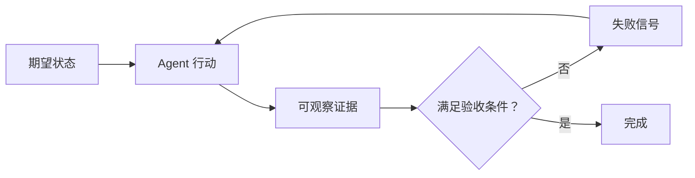

# 第 1 讲：Agent 失败诊断

> 本讲目标：
> - 从一次真实失败中分离期望、观察与缺失证据。
> - 判断问题首先属于模型能力还是任务环境。
> - 画出最短反馈回路，而不是用更长提示词掩盖失败。
>
> 前置条件：有过一次 coding agent 使用经历 | 上一页 [<< 课程目录](./README.md) | 下一讲 [02 >>](./02-agent-readable-repository.md)

## “做完了”不是可验收结果

你把一个功能交给 coding agent。二十分钟后，它说“已完成”，但测试没跑、页面没打开、边界条件没检查。此时最容易做的事是换模型或把提示词写得更长；更有信息量的动作，是先把失败写成三行：你期待什么、实际看到了什么、缺哪条可观察证据。

这一讲只做诊断，不急着搭完整系统。第一项独立动作不需要理解任何新框架。

## 解释

### 从三行事实开始

先写下这三个字段：

```text
期望状态：提交表单后出现成功页面，并写入一条数据库记录。
实际状态：Agent 修改了表单组件，声称完成；浏览器未验证。
缺失证据：没有端到端运行结果，也没有数据库查询结果。
```

这里的期望状态是任务结束时必须存在的外部事实；实际状态是你亲眼看到或命令输出证明的事实；缺失证据则说明结论为何站不住。三者比“感觉不可靠”更适合交给 Agent 继续处理。

### 区分模型与环境

模型能力是模型在给定信息和工具下推理、生成与选择动作的能力。任务环境包含它能读取的文件、能调用的工具、必须遵守的边界和能得到的反馈。Agent harness 是模型权重之外、让模型持续行动并接受反馈的工程结构；在 coding agent 场景中，它通常落在仓库文件、初始化命令、任务状态和验证脚本里。OpenAI 与 Anthropic 的工程记录都把可靠性问题指向环境可读性、状态工件和验证闭环，而不是只靠扩大一次提示。[^S1][^S2]

能力鸿沟指基准或演示中的能力与真实工程任务中的可靠执行之间的差距。真实仓库含有模糊需求、隐性规则和不完整测试；如果这些条件没有被显式化，模型即使会写代码，也可能不知道何时才算完成。WalkingLabs 将这一问题拆成 instructions、state、verification、scope、lifecycle 五类子系统。[^S5]

### 只认能重新取得的证据

可观察证据不是 Agent 的自述，而是另一个人或新会话可以重新取得的事实，例如退出码、测试报告、截图、数据库状态或可重复命令。失败信号是证据与期望之间的具体差异，例如“测试 17 通过、1 失败”，而不是“代码可能有问题”。

下面的反馈回路要表达的重点是：验证结果必须回到下一次行动，而不是停在自然语言总结。



把证据反馈到下一次行动，形成反馈回路。没有这条边，Agent 只能根据自己的输出猜测是否成功；有了这条边，失败会变成下一步可处理的输入。Agent eval 同样强调最终环境状态，而不是只看 Agent 在对话里说了什么。[^S4]

```agentmentor-check
{
  "id": "agent-harness-diagnosis-missing-evidence",
  "label": "定位缺失证据",
  "prompt": "Agent 修改了登录代码并说已完成，但没有运行浏览器。当前最先暴露的是哪类问题？",
  "whyHere": "这一步检查学习者是否把自述当成证据，或能先定位反馈回路的缺口。",
  "copyPurpose": "让 Agent 检查我是否把模型不会做与环境没有提供验证证据混为一谈。",
  "mode": "single",
  "choices": [
    {
      "id": "model",
      "text": "模型能力必然不足，应先更换更大的模型",
      "correct": false,
      "feedback": "现有事实只证明浏览器验证没有发生，尚不能推出模型无法完成任务。"
    },
    {
      "id": "evidence",
      "text": "任务环境缺少可重新运行的浏览器验收证据",
      "correct": true,
      "feedback": "先补验证动作和成功条件，才能根据真实失败判断是否还存在能力问题。"
    }
  ]
}
```

本讲的术语检查点是：coding agent、模型能力、任务环境、Agent harness、能力鸿沟、可观察证据、期望状态、实际状态、失败信号、反馈回路。

## 完整示例

假设任务是“给课程页增加复制按钮”。先把验收改写为：选中正文后按钮出现；点击后剪贴板包含所选文本与公开 URL；未选中文本时按钮不出现。然后要求 Agent 在浏览器中逐条验证并记录结果。这样做不是增加文档，而是把三个容易被忽略的外部事实放进反馈回路。

若验证显示按钮出现但 URL 缺失，失败信号已经足够精确：问题不再是“复制功能不好”，而是“剪贴板内容未满足第二条”。下一次行动可以只修这一条。

## 轮到你

补完这份半成品诊断：

```text
任务：修复移动端菜单。
期望状态：在 390px 宽度下，________________。
实际状态：Agent 改了 CSS，并给出代码摘要。
缺失证据：________________。
```

参考答案：第一空应写一个肉眼或浏览器测试能判断的行为，例如“菜单按钮可打开且所有链接可点击”；第二空应写“没有在 390px 视口实际打开页面并点击每个链接”。关键不是措辞一致，而是两项都能复查。

<!-- exercises -->
## 练习

### Level 1（热身）

从最近一次 Agent 任务中写出期望状态、实际状态、缺失证据。方法：只写你能指向文件、命令输出或界面行为的事实。
<!-- rubric -->
- 三行都存在，每行不超过两句话。
- 期望状态至少包含一个可观察行为。
- 实际状态没有使用“应该”“大概”等推测词。
<!-- answer -->
合格答案会把自述和证据分开。例如“Agent 说测试通过”属于实际观察到的自述；“终端显示 18 tests passed”才是验证证据。
<!-- hint -->
先找到 Agent 最后一句“完成”或“已修复”。
<!-- hint -->
问自己：换一个新会话后，我能运行什么来重新得到同一结论？

### Level 2（进阶）

把同一失败分别写成“换模型假设”和“补 harness 假设”，再列出一个成本最低的区分实验。
<!-- rubric -->
- 两个假设各有一条可证伪预测。
- 区分实验只改变一个条件。
- 实验结果能决定下一步是补环境还是调查能力限制。
<!-- answer -->
示例：换模型假设预测“提供同样文件和命令时，更强模型能通过现有测试”；补 harness 假设预测“当前模型拿到明确验收命令后就能发现并修复失败”。先只补验收命令重跑，若仍无法处理已暴露的失败，再比较模型。常见错误是同时换模型、改提示词、补测试，最后无法知道哪项起作用；修正方法是一次只改变一个变量。
<!-- hint -->
把“它不行”改成一个能被一次运行推翻的句子。
<!-- /exercises -->

## 总结与下一步

本讲把 Agent 失败变成了可检查的诊断：期望状态、实际状态、缺失证据。下一讲把这些事实安放进仓库，让新会话也能找到它们。
