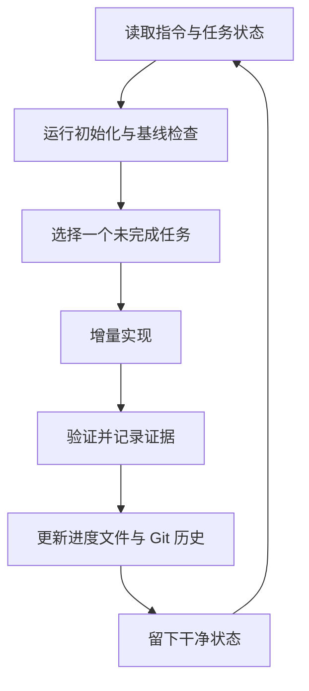

# 第 3 讲：跨会话连续性

> 本讲目标：
> - 识别上下文窗口重置后会丢失的工作状态。
> - 区分对话压缩与仓库中的持久状态工件。
> - 设计初始化、增量执行与干净交接的会话生命周期。
>
> 前置条件：仓库已有可发现入口 | 上一讲 [<< 02](./02-agent-readable-repository.md) | 下一讲 [04 >>](./04-machine-checkable-done.md)

## 新会话不是上一位 Agent 的延长线

长任务经常跨越一个上下文窗口。旧会话知道改过哪些文件、哪个测试仍失败、为什么放弃某条路径；新会话如果只看到代码结果，就可能重复试错，或误把局部进展当成全部完成。

Anthropic 把这个问题比作轮班工程师：每位接班者到场时没有上一班的记忆。其长任务实验使用 initializer agent 建立环境，再让 coding agent 每次只做增量工作并给下一会话留下清晰工件。[^S2]

## 解释

### 上下文不是项目状态

上下文窗口是模型在一次推理中可见的 token 集合。context engineering 是选择和维护这些 token，使它们对当前决策最有用。随着历史不断增长，相关信息可能被噪声稀释；Anthropic 将这类随上下文增长而出现的检索与注意力退化讨论为 context rot。[^S3]

compaction 会把临近上限的对话压缩为摘要，再用摘要启动新上下文。它能延续当前会话，却不应成为项目唯一的状态来源：摘要可能省略失败命令、未决边界或文件路径。

structured note-taking 则把关键状态写到上下文之外的持久介质，例如仓库中的 `agent-task.json` 或 `progress.md`。它与 Git 历史共同提供两种不同证据：进度文件解释当前意图与未决事项，Git 历史记录实际提交过的变化。Anthropic 的实验明确要求新会话同时读取进度文件和近期提交。[^S2][^S3]

### 第一次与后续会话职责不同

initializer agent 负责第一次建立运行环境、状态文件和初始检查；coding agent 负责后续会话中的增量实现。两者分开，是因为“建立可恢复工作台”和“完成一个具体任务”有不同完成条件。[^S2]

一个可恢复的会话生命周期如下。图中要看的不是 Agent 名称，而是每次会话开始和结束都经过磁盘工件。



进度文件应包含当前目标、已完成项、未决失败、下一条动作和最近验证证据。会话交接是把这些字段更新到真实状态；干净状态则意味着新会话无需先清理无关损坏，就能安全继续。Anthropic 对干净状态的描述包括无重大已知错误、代码有序、文档足以让下一位开发者开始新功能。[^S2]

```agentmentor-check
{
  "id": "agent-harness-continuity-source",
  "label": "选择恢复依据",
  "prompt": "对话经过 compaction 后摘要写着“支付已完成”，但仓库状态文件仍标记回调测试失败。新会话应先相信什么？",
  "whyHere": "这一步检查学习者是否把对话摘要误当成项目的权威状态。",
  "copyPurpose": "让 Agent 检查我的跨会话恢复流程是否把摘要放在了仓库证据之上。",
  "mode": "single",
  "choices": [
    {
      "id": "summary",
      "text": "相信摘要，因为它浓缩了完整对话",
      "correct": false,
      "feedback": "摘要可能省略失败细节，而且无法替代当前仓库中的测试与状态证据。"
    },
    {
      "id": "artifact",
      "text": "读取状态文件并重跑回调测试，再更新结论",
      "correct": true,
      "feedback": "持久工件和可重跑验证提供当前事实；摘要只能帮助定位，不决定完成状态。"
    }
  ]
}
```

本讲的术语检查点是：上下文窗口、context engineering、context rot、compaction、structured note-taking、initializer agent、coding agent、进度文件、Git 历史、干净状态、会话交接。

## 完整示例

一个迁移任务有三步：改 schema、回填数据、切换读取路径。initializer agent 创建 `agent-task.json`，把三步都设为 `pending`，并写入基线命令。第一次 coding agent 完成 schema 后，将第一步标为 `verified`，记录迁移测试命令和提交号，第二步仍为 `pending`。

新会话启动时先读状态文件和 Git 历史，再运行基线命令。即使旧对话完全不可见，它仍能知道“schema 已验证、回填未开始”，不会重做第一步或误跳到切换读取路径。

## 轮到你

补全交接记录中缺失的两个字段：

```json
{
  "goal": "移动课程站到 Cloudflare Workers",
  "completed": ["Next.js production build passes"],
  "unresolved": ["________"],
  "nextAction": "________",
  "lastEvidence": "npm run build: exit 0"
}
```

参考答案：“尚未运行 OpenNext Cloudflare build”；“运行 `npm run cf:build` 并保存退出码”。未决问题必须与下一动作相连。

<!-- exercises -->
## 练习

### Level 1（热身）

为一个跨两次会话的真实任务写最小状态文件，包含 goal、completed、unresolved、nextAction、lastEvidence。
<!-- rubric -->
- 五个字段齐全。
- completed 只包含已有证据支持的事项。
- nextAction 能在一次会话内开始执行。
<!-- answer -->
状态文件描述当前事实，不写长篇过程。失败输出过长时记录命令、退出码和日志路径；关键决策补一句原因。
<!-- hint -->
先从你准备在新会话第一分钟读取的内容反推字段。

### Level 2（进阶）

为仓库写一个初始化清单，规定新会话的前五个动作和旧会话结束前的后三个动作。
<!-- rubric -->
- 开始动作同时读取入口、状态和近期 Git 变化。
- 开始阶段包含一次基线检查。
- 结束阶段更新状态、验证证据并留下可恢复路径。
<!-- answer -->
推荐开始顺序：读指令、读状态、看 Git、安装或检查依赖、跑基线。结束顺序：重跑验证、更新状态、提交或明确记录未提交变更。若仓库不允许自动提交，就把“当前 diff 与恢复命令”写进交接，不要伪造干净状态。
<!-- hint -->
想象接班 Agent 完全看不到当前对话，它还缺什么？
<!-- /exercises -->

## 总结与下一步

compaction 维护对话，持久工件维护项目。初始化、进度文件、Git 历史和会话交接共同让新会话从证据恢复。下一讲把“完成”进一步拆成机器可检查的评测结构。
