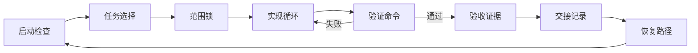

# 第 5 讲：最小 Harness 闭环

> 本讲目标：
> - 用四个小文件组装仓库级最小 harness。
> - 让一次 Agent 会话经过启动、选取、实现、验证和交接。
> - 用真实命令和可恢复状态证明闭环成立。
>
> 前置条件：能写任务状态与可检查 outcome | 上一讲 [<< 04](./04-machine-checkable-done.md) | 下一页 [课程目录 >>](./README.md)

## 文件数量不是目标，闭环才是

最小 harness 不是复制一整套模板，也不是先引入编排平台。它只需要让 Agent 在开始时取得正确上下文，在执行时受范围约束，在结束时留下验证证据和恢复路径。Anthropic 建议从能工作的最简单模式开始，再按真实失败增加复杂度。[^S6]

本讲把前四讲压缩成四个文件。请在可安全修改的练习仓库中操作，不要把 token、密码或私人数据写入这些文件，也不要让 Agent 运行未经检查的破坏性命令。

## 解释

### 四个文件的职责

```text
AGENTS.md                    # 入口、边界、验证命令
scripts/init-agent.sh        # 启动检查与基线
agent-task.json              # 当前任务、范围锁和状态
scripts/check-agent-task.sh  # 机器可检查的完成条件
```

启动检查确认当前位置、依赖和基线是否健康；任务选择从状态文件中取一个未完成项；范围锁列出允许修改的路径；实现循环让 Agent 修改后立即运行相关反馈；验证命令产生退出码和输出；验收证据把命令与结果写回任务状态。

交接记录说明完成、未决与下一动作；恢复路径告诉新会话如何回到最后一个已知状态。垃圾回收则把重复事故转成规则、测试或检查脚本，并删除已经失效的说明。OpenAI 把这类持续清理视为高吞吐 Agent 仓库维持一致性的必要工作。[^S1]

### 闭环生命周期

图中要看的关键是：验证失败返回实现，验证成功才能进入交接。



这个结构对应 WalkingLabs 归纳的 instructions、state、verification、scope、lifecycle 五类子系统，也与 Anthropic 的初始化、增量进展、测试和干净状态实验相符。[^S2][^S5]

### 可直接落地的最小内容

`AGENTS.md` 可以从以下内容开始：

```markdown
# Agent working agreement

1. 开始前读取 agent-task.json，并运行 scripts/init-agent.sh。
2. 只修改 agent-task.json.allowedPaths 中的路径。
3. 完成前运行 scripts/check-agent-task.sh。
4. 只有检查退出码为 0，才能把 status 改为 verified。
5. 结束时记录 lastEvidence、unresolved 和 nextAction。
```

`agent-task.json` 使用外部状态，而不是把任务是否完成留在对话里：

```json
{
  "goal": "为课程页增加选区复制按钮",
  "status": "in_progress",
  "allowedPaths": ["components/selection-copy.tsx", "tests/selection-copy.test.tsx"],
  "lastEvidence": "not run",
  "unresolved": ["selection cleared state"],
  "nextAction": "add a test for clearing selection"
}
```

启动脚本和检查脚本应使用仓库已有命令。你需要在仓库根目录运行它们；成功信号是退出码 0 和清楚的通过摘要。失败时，把完整命令、退出码和相关输出复制给 Agent，不要只复制最后一句。

```agentmentor-hotspot
{
  "id": "minimal-harness-verification-gate",
  "label": "定位完成闸门",
  "prompt": "哪一个节点必须阻止未验证的实现进入交接记录？",
  "whyHere": "这一步检查学习者是否把 Agent 的实现动作误当成完成闸门。",
  "layout": "flow",
  "nodes": [
    { "id": "select", "label": "任务选择", "x": 12, "y": 50 },
    { "id": "implement", "label": "实现循环", "x": 38, "y": 50 },
    { "id": "verify", "label": "验证命令", "x": 64, "y": 50 },
    { "id": "handoff", "label": "交接记录", "x": 88, "y": 50 }
  ],
  "edges": [
    { "from": "select", "to": "implement", "label": "限定范围" },
    { "from": "implement", "to": "verify", "label": "产生候选结果" },
    { "from": "verify", "to": "handoff", "label": "仅通过时进入" }
  ],
  "hotspots": [
    { "nodeId": "implement", "correct": false, "feedback": "实现只产生候选结果；没有命令证据时不能进入已完成交接。" },
    { "nodeId": "verify", "correct": true, "feedback": "验证命令用退出码和检查结果决定是否允许写入已完成状态。" }
  ],
  "copyPurpose": "让 Agent 检查我的 harness 是否存在绕过验证直接宣告完成的路径。"
}
```

本讲的术语检查点是：最小 harness、启动检查、任务选择、范围锁、实现循环、验证命令、验收证据、交接记录、恢复路径、垃圾回收。

## 完整示例

某课程仓库的任务是“删除播客逻辑，同时保留课程阅读和复制给 Agent”。Agent 启动时运行边界测试；状态文件只允许修改路由、组件和依赖清单；实现后先跑边界测试，再跑生产构建。两个命令都退出 0 后，状态才改为 `verified`，并记录具体命令与提交。

如果生产构建失败，会话不得写“功能已完成，只剩构建问题”。失败属于 outcome 的一部分，应写进 unresolved，nextAction 指向首个可复现失败。新会话由此能从同一点恢复。

## 轮到你

补完检查脚本的完成闸门：

```sh
#!/bin/sh
set -eu

npm test
________

printf '%s\n' 'agent task checks passed'
```

参考答案应放入当前项目真实的第二条验证命令，例如 `npm run build`。若项目没有 npm，就换成现有测试与构建入口；不要为了套模板新增无用工具。

```agentmentor-action
mode: reasoning_audit
label: 审计我的完成闸门
description: 逐条检查我的四个 harness 文件是否允许跳过范围锁、验证证据或交接更新。
purpose: 用我粘贴的 AGENTS.md、任务状态和脚本内容，找出一条最可能导致 Agent 过早宣告完成的路径。
rules:
  - 每次只指出一个可复现的越界或绕过路径。
  - 先要求我给出对应文件原文，再建议最小修订。
  - 不引入与已观察失败无关的框架或平台。
```

<!-- exercises -->
## 练习

### Level 1（热身）

在练习仓库中创建或修订 `AGENTS.md` 与 `agent-task.json`，让入口能找到当前任务、允许范围和验证命令。
<!-- rubric -->
- `AGENTS.md` 不超过 40 行，并指向真实文件。
- `agent-task.json` 含 goal、status、allowedPaths、lastEvidence、unresolved、nextAction。
- 允许范围不使用仓库根目录或无约束通配符。
<!-- answer -->
合格结果强调发现路径和边界，不重复整份架构文档。状态必须反映当前事实；尚未运行检查时写 `not run`，不能预填通过。
<!-- hint -->
先写 Agent 启动后必须知道的五件事，再删除可以通过链接取得的细节。

### Level 2（进阶）

创建 `scripts/init-agent.sh` 与 `scripts/check-agent-task.sh`，在仓库根目录运行完整生命周期，并把结果写回状态文件。
<!-- rubric -->
- 两个脚本都使用 `set -eu` 或项目等价的失败即停机制。
- init 脚本检查当前位置并运行一个基线命令。
- check 脚本至少运行一条功能测试和一条整体构建或类型检查。
- 实际运行检查；保存命令、退出码和通过摘要。
- 开一个新 Agent 会话，仅提供仓库路径，能根据四个文件说明当前状态与下一动作。
<!-- answer -->
最终应形成可重复闭环：新会话读入口与状态，运行 init，选择任务，按 allowedPaths 修改，运行 check；失败回到实现，成功更新 lastEvidence 和 nextAction。常见错误是让脚本自动把状态改为通过，即使中途命令输出被忽略；修正方法是失败即停，并只在全部命令退出 0 后人工或受控更新状态。
<!-- hint -->
先让 check 脚本故意失败一次，确认状态不会被标成 verified。
<!-- hint -->
再修复失败并重跑，把完整输出交给一个全新会话复查。
<!-- /exercises -->

## 总结与下一步

你已经把 instructions、state、scope、verification 和 lifecycle 放进一个最小 harness。下一步是在自己的真实仓库运行它一轮：保留失败、修正闸门、更新证据。只有新会话能从这些工件恢复并重跑结论，闭环才成立。
