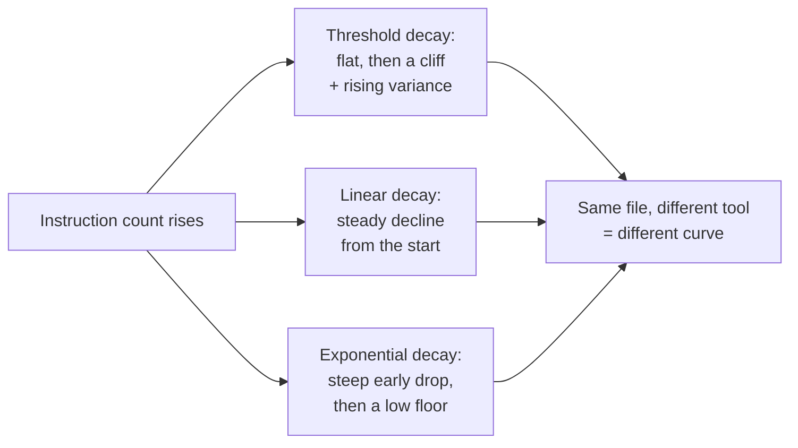

# Lesson 2: The cost of one long file

> Lesson objectives:
> - Explain why instruction adherence falls as the number of instructions rises, using measured degradation shapes rather than intuition.
> - Predict which instructions in a long file are most likely to be dropped, from position and from kind.
> - Name the two independent costs a long instruction file imposes on every session.
> - Decide, for a given file, whether the fix is deletion, splitting by directory, or splitting by path scope.
>
> Prerequisites: Lesson 1 — you have a list of candidate lines | Previous [<< 01](./01-repo-context-vs-portable-workflow.md) | Next [03 >>](./03-nearest-file-wins.md)

## The file grew, and adherence got worse

The file starts at four lines and everyone agrees it is useful. Six months later it is two hundred lines, because every incident added one and nothing ever removed one. Somewhere in the middle is `Never edit files in src/generated/`, and last week an agent edited a file in `src/generated/`.

The instinct is that the file was ignored, or that the model is careless. Neither explains the shape of what happens, which is more specific and more useful: as instructions accumulate, adherence to *each one* declines, and the decline is not evenly distributed across the list. Some lines are much more likely to survive than others, and their position in the file is part of why.

This lesson is about that curve. Lesson 1 gave you a way to decide whether a line deserves to exist; this one is about what it costs once it does, and it is the argument for everything Lesson 3 builds.

## Explanation

### Two costs, paid on different schedules

A long instruction file costs you twice, and separating the two matters because they have different fixes.

The first is **context cost**. The file is loaded into the model's context at session start, before any of your task's actual content. Claude Code's docs state the mechanism plainly: these files are "loaded into the context window at the start of every session, consuming tokens alongside your conversation."[^S5] The AAIF post puts the consequence in one sentence: "A file is read and reasoned about on every turn whether the task needs it or not, so length is a cost you pay on every run, not just the ones where it matters."[^S2]

The second is **adherence cost**: past some instruction density, instructions start getting dropped. This one is measurable, and the measurement is more interesting than "the model gets confused."

### What the degradation actually looks like

The IFScale benchmark was built to answer exactly this question. It gives a model a business-report writing task plus *N* keyword-inclusion instructions, scales *N* from 10 to 500 in steps of 10, runs five seeds at each level, and grades adherence by regex matching. Across 20 models from seven providers, "even the best frontier models only achieve 68% accuracy at the max density of 500 instructions."[^S6]

Before that number does any work, mark its boundaries. This is a single-turn keyword-inclusion task, not repository work; the models are the mid-2025 generation; the instructions are deliberately trivial so that the count is the only variable. Nobody puts 500 instructions in an AGENTS.md. **What transfers is the shape of the curve, not the percentage.**

And the shape is the finding. The paper identifies three distinct degradation patterns: "threshold decay—near-perfect performance until a critical density, then rising variance and decreased adherence," "linear decay," and "exponential decay... showing steep performance drops after minimal instruction densities before asymptotically approaching consistent low-performance baselines."[^S6]



What this diagram is for: the three curves are not three severities of the same problem — they are different failure signatures, and the middle one is the trap. Under threshold decay a file can be well under the cliff today and over it after one more incident, with nothing visible changing until it does. Under exponential decay, degradation starts early. Since you generally do not know which curve the tool reading your file follows, and it can differ per tool for the same file, the safe assumption is that every line you add makes the others slightly less reliable.

The variance finding sharpens this. Under threshold decay, the paper notes "rising variance" past the threshold[^S6] — meaning the same file and the same task stop producing the same behaviour run to run. That is what makes a too-long file so hard to diagnose: it does not fail, it becomes inconsistent, and inconsistency reads as randomness rather than as a cause.

### Position is not neutral

Now the part that changes how you write the file rather than just how long you make it.

IFScale measured **primacy effects** — the tendency to satisfy instructions appearing earlier in the list better than later ones. The metric is "the ratio of error rates in the final third of instructions to error rates in the first third of instructions. A ratio greater than 1.0 indicates that later instructions are more likely to be violated."[^S6]

The practical reading: **the bottom of a long file is the weakest position in it.** That has a direct consequence for how files grow. Appending each new rule to the end — the natural motion, and what every incident-driven edit does — steadily buries the newest rules in the least reliable position. The rules you added most recently are the ones you needed most recently.

Two things follow. Put the instructions whose violation costs most at the top, not in the order you thought of them. And when you add a line, decide where it goes rather than defaulting to the end.

Read primacy as a documented tendency in that benchmark's setting rather than a law of every agent: it is one measurement of one task shape on one generation of models. It gives you a defensible default for ordering, not a guarantee about your file.

### Vendors converge on "shorter," from different numbers

Nobody publishes a measured length threshold for instruction files, because it would depend on the tool, the model, and the task. What exists is convergent recommendation from vendors who compete with each other, as of 2026-08-23:

| Source | Guidance | Applies to |
|---|---|---|
| Claude Code docs | "target under 200 lines per CLAUDE.md file. Longer files consume more context and reduce adherence."[^S5] | Its own memory file |
| Cursor docs | "Keep rules under 500 lines. Split large rules into multiple, composable rules."[^S10] | Its own `.cursor/rules` files |
| OpenAI Codex docs | Stops adding files "once the combined size reaches the limit defined by `project_doc_max_bytes` (32 KiB by default)"[^S3] | The whole instruction chain |

These are not the same claim and should not be averaged into one. The first two are editorial recommendations for a vendor's own file format; the third is a hard technical cap on a concatenated chain, with a real consequence — past 32 KiB by default, Codex simply stops adding files, so a file *later* in the chain can be dropped entirely. Its documented fix is to "raise the limit or split instructions across nested directories."[^S3]

The useful synthesis, which is mine rather than any vendor's: **treat length as a budget you spend, with three different penalties depending on the tool** — tokens on every session, adherence at the margins, and in at least one tool a hard truncation that silently removes files. None of those penalties announce themselves.

### Three ways to make a file shorter, and when each is right

Deleting is not the only move, and reaching for it first loses information you need.

**Delete** when the line fails Lesson 1's tests — discoverable from the repo, not actionable, never actually cost you anything. This is the cheapest cut and usually the largest.

**Split by directory** when the line is true of one part of the repository and not the rest. A rule about the payments service does not need to be in context while someone edits the marketing site. That is Lesson 3's entire subject, and it works because loading is scoped: Amp includes subtree files "when the agent reads a file in the subtree,"[^S4] and Claude Code likewise loads subdirectory files "when Claude reads files in those subdirectories"[^S5] rather than at launch.

**Split by path scope** when the line follows a file *type* rather than a directory — TypeScript conventions that apply across `src/`, `tools/`, and `tests/` alike. Several tools support this directly: Amp reads `globs` frontmatter on mentioned files and includes them only "if Amp has read a file matching any of the globs,"[^S4] and GitHub Copilot has path-specific instruction files under `.github/instructions` that apply "to requests made in the context of files that match a specified path."[^S9] Note that this is a per-tool mechanism, not part of the plain AGENTS.md format — so it is a good fit when your team is on one tool and a poor one when it is not.

```agentmentor-order
{
  "id": "agent-readable-repo-file-length-shortening-order",
  "label": "Order the shortening moves",
  "prompt": "A 180-line AGENTS.md has stopped being reliably followed. Put the four moves in the order that recovers the most reliability for the least lost information.",
  "whyHere": "The instinct is to start splitting immediately, because splitting feels like architecture and deleting feels like loss. Doing it in that order splits junk into more places and makes the file set harder to maintain, so the sequence is the judgment worth checking.",
  "copyPurpose": "Have the agent check whether I am reorganising an instruction file that mostly needs deleting, and whether my top-of-file ordering reflects violation cost rather than the order I happened to write the rules in.",
  "items": [
    { "id": "delete", "text": "Delete lines that fail the discoverable/actionable/repeated tests" },
    { "id": "directory", "text": "Move directory-specific rules into nested files under the directories they describe" },
    { "id": "scope", "text": "Move file-type rules into path-scoped rules, where the team's tool supports them" },
    { "id": "order", "text": "Reorder what remains so the most costly-to-violate rules sit at the top" }
  ],
  "correctOrder": ["delete", "directory", "scope", "order"],
  "feedbackWrong": "Check which step you put first. Every later step is cheaper and cleaner once the junk is gone: splitting first means carrying discoverable style advice into three files instead of one, and you then have to review it three times. Deletion is also the only step that reduces total instruction count, which is the variable the degradation measurements are about. Reordering comes last for a plain reason — it operates on the surviving set, so doing it before the set is final means doing it twice.",
  "feedback": "Deletion first because it is the only move that reduces the total count rather than relocating it, and because everything after it is cheaper on a smaller file. Directory splits before path-scope splits because directory placement is part of the open format and works across tools, while path scoping is a per-tool mechanism. Ordering last because it applies to whatever survived."
}
```

## Worked example: cutting 180 lines to a working set

A real-shaped file, by section, with its line count and what happens to it.

```text
## Project overview               (22 lines — prose describing what the product does)
## Setup                          (14 lines — install, env vars, first run)
## Code style                     (61 lines — naming, imports, formatting, comments)
## Testing                        (18 lines — commands, plus "write tests for new code")
## The payments service           (31 lines — its own build, its own test command)
## Deployment                     (24 lines — staging and production steps)
## Notes                          (10 lines — three unrelated warnings added over time)
```

**Project overview, 22 → 3.** Most of it restates the README for a reader who already has the repository. What survives is the part the code does not say: that the `api/` and `worker/` directories share a schema package, and editing one without the other breaks the build. Non-obvious, actionable, has cost us twice.

**Setup, 14 → 6.** The env var list duplicates `.env.example` and drifts from it. Replace with a pointer: `Copy .env.example to .env — it is the source of truth for required variables.` Cursor's docs make this exact argument: reference files rather than copying their contents, since copying is what "prevents them from becoming stale as code changes."[^S10]

**Code style, 61 → 4.** The largest section and almost entirely the "already discoverable" bucket — brace placement, import ordering, comment style. All of it is enforced by the linter and the formatter. Cursor's docs are blunt about this case: "Copying entire style guides: Use a linter instead. Agent already knows common style conventions."[^S10] What survives is the one convention the linter cannot express and reviewers keep correcting, plus the command that enforces the rest: `Run npm run lint --fix before committing; it resolves formatting. Not lint-enforced: use British spelling in user-facing strings.`

**Testing, 18 → 5.** The commands stay. "Write tests for new behaviour" leaves — it is a portable norm, true in every repository the team owns, which is Lesson 1's portability test. It belongs in review standards, not here.

**The payments service, 31 → 0 here, 31 moved.** This is the split. Every line is true only inside `services/payments/`, so it becomes `services/payments/AGENTS.md`. Root file loses 31 lines; the payments rules get *closer* to the code they govern, which Lesson 3 shows is also a precedence improvement.

**Deployment, 24 → 2.** A multi-step procedure with judgment calls, identical across three repositories: a Skill by Lesson 1's test. Two lines stay for the repo-specific residue — the name of this service and which staging environment it maps to.

**Notes, 10 → 3.** Two of the three warnings are stale, describing a directory that no longer exists. Stale is worse than absent, because it gets followed. Delete both. The third is real: fold it into the section it belongs to and delete the heading.

Root file: **180 → 23 lines**, plus a 31-line nested file that loads only when someone works in payments, plus one Skill. Then the last move: reorder those 23 so the two rules whose violation is most expensive — the generated-files boundary and the schema-package coupling — are at the top rather than in the middle where they landed by accident.[^S6]

Note what did *not* happen: no information was lost that anyone will miss. The deletions were duplicates, discoverables, and staleness. That is typical, and it is why deletion comes first.

## Your turn: price your own file

Take the instruction file you classified in Lesson 1 (or the onboarding doc you used instead). Produce a table with one row per section:

| Section | Lines | Bucket (delete / nest / scope / keep) | Where it goes | Lines after |
|---|---|---|---|---|

Then answer three questions:

- Which section is largest, and does its size reflect its value? ________
- Which two rules are most expensive to violate, and where do they currently sit in the file? ________
- After the cuts, what is the root file's line count? ________

<details>
<summary>Answer: what the table usually reveals</summary>

**The largest section is almost never the most valuable one.** Style and setup sections grow because they are easy to write and feel like documentation; the two or three lines that actually prevent expensive mistakes are short and get buried among them. If your largest section is style, the linter argument applies to nearly all of it.

**The most expensive-to-violate rules are usually not at the top.** They arrived after an incident, which means they were appended — and appending puts them in the position the primacy measurement identifies as weakest.[^S6] This is the single cheapest fix in the lesson: moving two lines costs nothing and addresses a documented tendency.

**A common wrong cut: deleting the explanation and keeping only the command.** `Do not move session refresh into middleware` without `(edge runtime cannot reach the database)` is a rule an agent will follow until it finds what looks like a good reason to break it — and then it will break it, having been given nothing to weigh against its own reasoning. One clause of *why* is usually worth its length on any rule that contradicts an obvious-looking improvement. Cut explanation from rules nobody would think to violate; keep it on rules that look like bugs.

If your root file lands somewhere in the tens of lines, that is the right neighbourhood. If it is still over a hundred after honest cuts, the remainder is very likely directory-specific, and Lesson 3 is where it goes.
</details>

<!-- exercises -->
## 💻 Exercises (point these at your own real environment)

### Level 1 (warm-up)
Measure before you cut. In your repository root run `wc -l AGENTS.md` (substitute whichever filename you found in Lesson 1) — in your terminal; success is a number, and "No such file" means you have no root file yet and should run it against your onboarding doc instead. Then run `grep -n '^#' <file>` to list its headings with line numbers, and compute how many lines each section holds. Write the result as a table sorted by size.

<!-- rubric -->
- Total line count recorded as a number.
- Every heading listed with its line span, so section sizes are visible rather than estimated.
- The table is sorted by size, and the largest section is named.
- One sentence stating whether the largest section is also the most valuable, with a reason.

<!-- answer -->
The point of doing this by measurement rather than by reading is that reading a file you wrote gives you an unreliable sense of its proportions — you remember the lines you care about, not the lines that occupy space. Sorting by size usually surprises people: a style or overview section holding a third of the file is common, and it is almost always the section with the least effect on agent behaviour.

If `grep -n '^#'` returns nothing, your file has no headings, which is itself a finding worth recording. An unstructured wall is harder to cut because you cannot see its parts, and Claude Code's docs note the reading consequence directly: "Claude scans structure the same way readers do: organized sections are easier to follow than dense paragraphs."[^S5] Adding headings before cutting is a legitimate first step.

<!-- hint -->
On macOS and Linux, `awk '/^#/{print NR": "\$0}' AGENTS.md` gives the same listing as the grep if you prefer a single tool. Either way, what you want is heading line numbers so you can subtract.

<!-- hint -->
"Most valuable" is not "most interesting to read." Judge it by what breaks if the section is missing — a broken build, a wasted hour, a wrong package manager — not by how much thought went into writing it.

### Level 2 (advanced)
Perform the cut. Produce a shortened root file plus a list of what moved where, and keep the original so you can diff. Do not commit yet — Lesson 6 will have you verify the change before it lands. Then, for each line you deleted, mark which of three reasons applied: discoverable from the repo, duplicated elsewhere in the repo, or stale.

<!-- rubric -->
- A shortened root file exists alongside the original, with both line counts recorded.
- Every deleted line is tagged with one of the three reasons; anything you cannot tag is restored.
- Every moved line has a destination named — a directory path, a path-scope pattern, or a Skill.
- The surviving lines are reordered so the two most expensive-to-violate rules are in the first ten lines.
- One sentence naming what you were tempted to delete and kept, and why.

<!-- answer -->
The tagging requirement is the substance of this exercise, and the rule that anything untaggable gets restored is what makes it honest. "Deleted because the file was too long" is not one of the three reasons — length is the symptom you are treating, not a justification for removing a specific line. If a line is genuinely needed and genuinely non-obvious, shortening the file is not a reason to lose it; splitting it out to the directory where it applies is.

**The common mistake is deleting explanation to hit a line target.** Two rules of the same length are not equally compressible: `Use npm, not pnpm` needs no reason, because nobody switches package managers thinking they are improving things. `Session refresh is intentionally outside middleware` needs its reason, because without it the arrangement looks like an oversight worth fixing. Length is not the criterion; whether the rule looks like a bug is.

The second mistake is moving a rule to a nested directory that does not exist yet, or that agents rarely open. A rule in `services/payments/AGENTS.md` only loads when someone works in payments — which is exactly right for payments rules and exactly wrong for a rule that happens to be *about* payments but applies when editing the API gateway. Lesson 3 is about getting that placement right; if a move feels uncertain now, note it and decide it there.

<!-- hint -->
Diff the two files rather than reading them side by side: `diff AGENTS.md AGENTS.md.bak` shows you exactly what left, and a line you cannot justify in the diff output is a line to restore.

<!-- hint -->
"Duplicated elsewhere in the repo" needs the elsewhere named — `.env.example`, the CI workflow, the linter config. If you cannot name the file that holds the real version, it is not duplicated, it is just something you think is obvious.

<!-- hint -->
For the reordering step, imagine the worst violation of each surviving rule and price it in minutes of cleanup. The two most expensive go first, whatever their topic.
<!-- /exercises -->

## Length as a budget, and where the next spending goes

What you can now do:

- Explain adherence decline as a measured curve with distinct shapes, and treat the benchmark's percentages as bounded by its setting rather than as a prediction about your file.
- Predict that lines at the bottom of a long file are the least reliable, and order your file accordingly.
- Separate the two costs a long file imposes — tokens on every session, and adherence at the margins — plus the hard truncation cap one tool documents.
- Choose between deleting, nesting by directory, and scoping by path, in that order.

Two of those three fixes assume something not yet established: that a rule placed in a subdirectory is actually read when work happens there, and ignored when it does not. That behaviour is the load-bearing mechanism of the whole format, and the tools implement it in ways that differ in detail while agreeing on the headline. Lesson 3 works through what "the nearest file wins" means precisely enough to place a rule with confidence.
