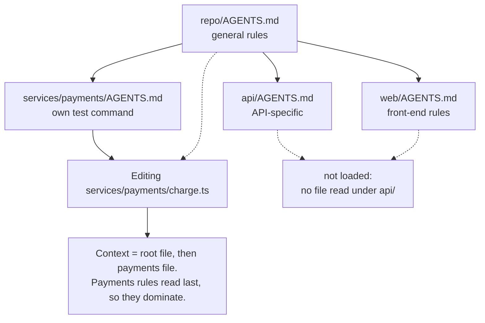

# Lesson 3: Nearest file wins

> Lesson objectives:
> - State what "the nearest file takes precedence" means mechanically, and why it is implemented as ordering rather than replacement.
> - Distinguish which instruction files load at session start from which load on demand, and say why that difference matters for cost.
> - Place a rule at the directory depth where it is true, and predict which files a given tool will load for a given edit.
> - Name three ways vendors differ on resolution, and design a file layout that survives all three.
>
> Prerequisites: Lesson 2 — you have a shortened file and a list of rules to relocate | Previous [<< 02](./02-the-cost-of-one-long-file.md) | Next [04 >>](./04-commands-not-adjectives.md)

## The rule that was true, in the wrong place

Your root file says `Run npm test before committing`. It is true — for most of the repository. It is false inside `services/payments/`, which has its own suite and its own command, and where running the root command produces a confusing pass that tested nothing relevant.

You could add a caveat to the root rule. Now the root file carries a payments exception that is loaded into every session, including the ones editing the marketing site. Add three more services with their own quirks and the root file has become a directory of exceptions — long, mostly irrelevant to any given task, and subject to everything Lesson 2 measured.

The format has a better answer, and it is the mechanism that makes an instruction file scale past one small project: rules live at the depth where they are true. This lesson is about what "the nearest file wins" actually does, because the headline is shared across tools and the mechanics are not.

## Explanation

### The headline rule, and who agrees on it

The format's own site states it: "Agents automatically read the nearest file in the directory tree, so the closest one takes precedence and every subproject can ship tailored instructions."[^S1] Its FAQ compresses the whole resolution question into one line: "The closest AGENTS.md to the edited file wins; explicit user chat prompts override everything."[^S1]

Independent vendors state the same rule in their own docs. GitHub's documentation for Copilot: "You can create one or more AGENTS.md files, stored anywhere within the repository. When Copilot is working, the nearest AGENTS.md file in the directory tree will take precedence."[^S9] Cursor's: "Cursor supports AGENTS.md in the project root and subdirectories."[^S10] Amp's recommendation for large repositories: "keeping the top-level AGENTS.md general and creating more specific AGENTS.md files in subtrees for each subproject."[^S4]

That convergence is the reason to design around nesting rather than around any one tool's extras: the headline is the part every vendor implements, and it is the part least likely to change.

### "Wins" means last, not only

Here is where intuition misleads. "The closest one takes precedence" sounds like replacement — the nested file is used *instead of* the root file. In the tools that document their mechanics, it is not.

Codex's documentation spells out the actual construction. Starting at the project root, it "walks down to your current working directory," takes at most one file per directory, and then: "Codex concatenates files from the root down, joining them with blank lines. Files closer to your current directory override earlier guidance because they appear later in the combined prompt."[^S3]

Read that last sentence carefully, because it contains the whole mechanism. Precedence is *positional*. The nested file wins not because the root file was discarded, but because it comes later in the same text. Claude Code describes its own equivalent identically: "All discovered files are concatenated into context rather than overriding each other. Across the directory tree, content is ordered from the filesystem root down to your working directory... so instructions closer to where you launched Claude are read last."[^S5]

Three consequences follow directly, and they are the practical content of this lesson:

**Inheritance is automatic.** A nested file does not need to restate the root rules; they are already in context. Restating them costs tokens and creates two copies to keep in sync.

**A nested file only wins where it actually speaks.** If the root says `Run npm test` and the payments file says nothing about testing, the root rule stands in payments. Overriding requires an explicit override — saying the contradicting thing in so many words, rather than merely stating an alternative.

**"Wins" is a soft win, not a hard one.** Both instructions are in context; the later one is expected to dominate. Nothing deletes the earlier one, and Lesson 5 is about what that costs when the two flatly contradict each other.

### When each file loads, and why that is the real cost saving

Nesting reduces context cost only because nested files are not all loaded at launch. Two vendors document the split.

Amp: files in the current directory and its parents "are always included," while "Subtree AGENTS.md files are included when the agent reads a file in the subtree."[^S4] Claude Code describes the same shape: files in the working directory and above load at launch, and files in subdirectories "are included when Claude reads files in those subdirectories" rather than at launch.[^S5]



What this diagram is for: it shows that the file set is chosen by *where the work happens*, not by what exists in the repository. Editing one file in payments pulls in two instruction files; the `api/` and `web/` rules stay out of context entirely. That is the mechanism converting Lesson 2's length problem into a placement problem — and it also tells you the failure mode. A rule placed too deep never loads for work that needed it.

Note the direction of the risk. Too shallow costs tokens on every session; too deep costs correctness on the sessions that needed the rule and did not get it. **When you are unsure, place the rule one level shallower than feels right**, because a rule that loads unnecessarily is merely wasteful and a rule that does not load is silently absent. That trade is my recommendation rather than any vendor's rule; the vendors document the loading, not the judgment.

### Three ways vendors differ

The headline is shared. Below it, as of 2026-08-23, the mechanics diverge in ways worth knowing before you design a layout.

**Which filename.** Claude Code "reads CLAUDE.md, not AGENTS.md," and recommends a `@AGENTS.md` import or a symlink to bridge them.[^S5] Amp falls back: if a directory has no AGENTS.md but has `AGENT.md` or `CLAUDE.md`, it uses that.[^S4] Copilot reads AGENTS.md anywhere in the repo and also accepts a single root `CLAUDE.md` or `GEMINI.md`.[^S9] For a nested layout, the bridging detail that matters is Amp's migration note: symlink "and repeat for subtree CLAUDE.md files"[^S4] — a root-only symlink leaves your nested files unread by the tool that needs the bridge.

**How deep it walks.** Codex walks from the project root down to your working directory and stops there — "Codex stops searching once it reaches your current directory"[^S3] — so a file *below* where you launched is not in the chain. Amp always includes parents up to `$HOME` and adds subtree files on demand.[^S4] These produce different sets for the same repository, and the difference shows up when someone launches their tool from inside a subdirectory.

**Whether there is a cap.** Codex "stops adding files once the combined size reaches the limit defined by `project_doc_max_bytes` (32 KiB by default)."[^S3] Since the chain is assembled root-first, hitting the cap drops the files nearest your work — the most specific ones. A bloated root file is therefore not merely wasteful under this tool; it can silently evict the nested file you wrote to fix it.

The layout that survives all three: **a short root file, nested files at real subproject boundaries, no reliance on depth greater than two or three, and a bridging symlink or import at every level where your team runs a tool that needs one.**

### The alternative axis: scoping by file type

Directories are not the only way to narrow a rule. Some rules follow a file *type* across many directories — TypeScript conventions in `src/`, `tools/`, and `tests/` alike — and nesting cannot express that without duplication.

Several tools offer a path-scoped mechanism instead. Amp reads `globs` in YAML frontmatter on `@`-mentioned files, and those files are included only "if Amp has read a file matching any of the globs."[^S4] Copilot has `NAME.instructions.md` files under `.github/instructions` applying "to requests made in the context of files that match a specified path," and notes that a repository-wide file and a matching path-specific file both apply — "the instructions from both files are used."[^S9]

The important caveat: **path scoping is a per-tool feature, not part of the plain AGENTS.md format.** A `globs` frontmatter block is meaningless to a tool that does not implement it, and depending on the tool it will either be ignored or read as literal text. Use path scoping when your team is standardised on one tool; use directory nesting when it is not. That is the portability trade, and it is the reason this course treats nesting as the default.

```agentmentor-hotspot
{
  "id": "agent-readable-repo-nesting-where-does-the-rule-go",
  "label": "Place the shared-schema rule",
  "prompt": "The rule is: 'api/ and worker/ both import the schema package — regenerate with npm run codegen after changing schema/, or the build breaks.' It has to load whenever someone edits api/ OR worker/ OR schema/. Click the directory whose instruction file should carry it.",
  "whyHere": "This is the placement judgment the whole nesting mechanism turns on, and it is the case where the intuitive answer — put the rule with the thing it is about — silently fails, because a rule in schema/ never loads for someone editing api/.",
  "copyPurpose": "Have the agent check whether I am placing rules by what they are about rather than by which sessions need them loaded, using the cross-cutting rules in my own repository.",
  "layout": "flow",
  "nodes": [
    { "id": "root", "label": "repo root", "x": 50, "y": 14 },
    { "id": "api", "label": "api/", "x": 16, "y": 60 },
    { "id": "worker", "label": "worker/", "x": 50, "y": 60 },
    { "id": "schema", "label": "schema/", "x": 84, "y": 60 }
  ],
  "edges": [
    { "from": "root", "to": "api", "label": "imports schema" },
    { "from": "root", "to": "worker", "label": "imports schema" },
    { "from": "root", "to": "schema", "label": "source of truth" }
  ],
  "hotspots": [
    { "nodeId": "root", "correct": true, "feedback": "The root is the nearest common ancestor of all three directories, and ancestors load whichever of them you are working in. A rule about a coupling has to live above everything it couples, or it is absent for exactly the sessions that break the build." },
    { "nodeId": "api", "correct": false, "feedback": "This loads the rule for api/ work and leaves it out for worker/ work — where the identical mistake breaks the identical build. Half-coverage on a coupling rule is close to no coverage, since the failure only needs one uncovered side." },
    { "nodeId": "worker", "correct": false, "feedback": "Same shape as api/, mirrored: someone editing api/ never sees it. Placing a rule inside one of the coupled parties is the standard version of this error, because the rule feels like it belongs to whichever side you were thinking about when you wrote it." },
    { "nodeId": "schema", "correct": false, "feedback": "The most tempting answer, because the rule is about schema/. But loading is driven by where work happens, not by subject matter: a rule here is in context when someone edits schema/ — which is the one moment they already know they changed the schema — and absent when someone edits api/ and wonders why the build broke." }
  ]
}
```

## Worked example: laying out a four-part repository

A monorepo with a web app, an API, a payments service, and a shared schema package. Here is each rule, and the reasoning that places it.

```text
repo/
├── AGENTS.md                        ← 3 rules
├── schema/
├── api/
├── worker/
├── web/
│   └── AGENTS.md                    ← 2 rules
└── services/payments/
    └── AGENTS.md                    ← 3 rules
```

**Root — `Use npm. The lockfile is package-lock.json; do not run pnpm or yarn.`** True everywhere, and violating it anywhere corrupts the lockfile for everyone. Root, and near the top, because Lesson 2's primacy finding says the top is the reliable position.[^S6]

**Root — `api/ and worker/ import the schema package. After editing anything in schema/, run npm run codegen or the build breaks.`** A coupling rule: it must load for work in any coupled directory, so it goes above all of them.

**Root — `Files in src/generated/ are produced by npm run codegen. Edit the .proto sources in schema/ instead.`** Anyone grepping for a symbol can land in a generated file from any directory. Root.

**`web/AGENTS.md` — `Run npm run test:e2e -- --project=chromium for UI changes; the full matrix takes 20 minutes and CI runs it anyway.`** True only for web work, and irrelevant context in every API session. Nested.

**`web/AGENTS.md` — `Components live in web/components/. Do not add to web/legacy/ — it is being deleted.`** Same reasoning, and note the second clause: without it, an agent finding `legacy/` reasonably concludes it is a valid home for components.

**`services/payments/AGENTS.md` — `Use make test-payments, not npm test. The root suite does not cover this service.`** The override case, and the clean illustration of positional precedence. The root's testing rule is still in context; this file appears later and contradicts it explicitly, so it dominates.[^S3] Note the explicitness — a payments file that merely mentioned `make test-payments` without saying *not npm test* leaves both commands live and an agent free to pick either.

**`services/payments/AGENTS.md` — `Never log the full card object. Use maskCard() from lib/pci.ts.`** Genuinely local, and expensive to violate.

**`services/payments/AGENTS.md` — `This service is PCI-scoped: changes here need a review from #payments-oncall before merge.`** Process context that only makes sense here.

Three things this layout deliberately does *not* do. It does not restate root rules in the nested files — they are already in context, and a copy is a future inconsistency. It does not create `api/AGENTS.md` or `worker/AGENTS.md`, because after the coupling rule moved to root there was nothing left that was uniquely true of either. And it does not go three levels deep anywhere: with Codex's 32 KiB cap dropping the *deepest* files first when the chain is oversized,[^S3] depth is a risk you take on only when a subproject genuinely earns it.

## Your turn: place five rules in your own tree

Sketch your repository's top two levels of directories. Then take five rules — from Lesson 2's relocation list, or write them now — and place each one.

For each rule, fill in:

- The rule, in one line: ________
- Every directory whose sessions need it loaded: ________
- The nearest common ancestor of those directories: ________
- Placement: ________
- If you placed it deeper than the ancestor, the reason: ________

<details>
<summary>Answer: the two placements that go wrong</summary>

**The subject-matter trap.** A rule about the database schema goes in `db/`, a rule about deploys goes in `deploy/`. It reads as tidy and it fails whenever the rule is *for* somebody outside that directory. The correcting question is never "what is this rule about" but "who needs to have read it before they act" — and for coupling rules the answer is always someone outside.

**The root-by-default trap.** The opposite error: everything at root, because root always loads. That is correct on availability and it is how you get back to Lesson 2's two-hundred-line file. The question that separates the cases is whether the rule is *false* elsewhere. `Use make test-payments` at root is not merely wasteful — it is wrong for the other 90% of the repository and will be followed there.

The clean decision procedure, which is the synthesis this course offers rather than any vendor's documented rule:

1. List every directory where a session needs the rule.
2. Take their nearest common ancestor.
3. Place it there — unless the rule is *false* somewhere under that ancestor, in which case place it at each true branch and say explicitly what it overrides.

Step 3's exception is the payments testing rule, and it is why that file says "not npm test" rather than just naming its own command.
</details>

```agentmentor-action
mode: mastery_probe
label: Have the agent predict which of my files load for one specific edit
description: Checks whether I can trace the actual instruction chain for a concrete file path in my own repository, rather than assuming the nesting layout I drew is the one my tool assembles.
purpose: I want to test my placement decisions against a real edit path before I commit the layout, because a rule placed too deep is silently absent and nothing in the run will tell me.
rules:
  - Ask me to describe my repository's directory layout and where I placed each instruction file.
  - Then name one specific file path in my repo and ask me which instruction files will be in context when an agent edits it, and in what order.
  - Check my answer against how instruction chains are actually assembled — concatenated root-first, nearest last, with subtree files loaded on demand.
  - When I get one wrong, point at which step of the walk I skipped rather than restating the whole rule.
  - Ask about one path at a time, and pick paths that stress the layout — a coupled directory, a deep one, the root itself.
```

<!-- exercises -->
## 💻 Exercises (point these at your own real environment)

### Level 1 (warm-up)
Find every instruction file already in your repository, at any depth. From the repository root run `find . -name 'AGENTS.md' -o -name 'CLAUDE.md' -o -name 'AGENT.md' | grep -v node_modules` — in your terminal; success is a list of paths, and no output means you have none yet. Draw the tree, mark each file's depth, and for each one write which directories' sessions would load it.

<!-- rubric -->
- The command ran at the repository root, with its output recorded even when empty.
- Every file found is placed on a sketch of the directory tree with its depth noted.
- For each file, the set of directories whose sessions load it is written down.
- At least one file is identified as either too deep (would not load where needed) or too shallow (loads where irrelevant), with the reason.

<!-- answer -->
Two patterns dominate real repositories. **One root file and nothing else**, which is fine for a single-project repo and is Lesson 2's length problem waiting to happen in a monorepo. **Files scattered without a pattern** — usually one per team that adopted an agent, at whatever depth that team works — which produces the situation where two people editing adjacent code get different rules and neither knows it.

If you find nested files, check one thing specifically: whether any of them restate rules from the root file. Since discovered files are concatenated rather than replaced,[^S5] a restated rule is pure duplication, and duplication is how the two copies drift into contradicting each other — which is Lesson 5's subject.

If you find no files at all, sketch where they *would* go instead. The exercise is about the mapping from directories to loaded rules, and that mapping is worth understanding before you write anything.

<!-- hint -->
Add `-not -path '*/node_modules/*'` or pipe through `grep -v` for whatever your language's dependency directory is — vendored packages ship their own instruction files and they are noise here.

<!-- hint -->
"Which directories' sessions load it" is answered by walking upward: a file at `a/b/AGENTS.md` is loaded for work in `a/b/` and anything under it, and not for work in `a/c/`.

<!-- hint -->
For the too-deep/too-shallow judgment, look for a rule mentioning a directory other than the one it lives in. That is the strongest signal of a misplacement.

### Level 2 (advanced)
Design the layout for your repository and write it down before creating any files. Produce a table with one row per rule: the rule text, the directories that need it, the common ancestor, your placement, and — for any rule you placed below the ancestor — what it overrides and whether the override is stated explicitly. Then check the layout against the three vendor differences in this lesson.

<!-- rubric -->
- Every rule has a placement with the ancestor calculation shown, not just a destination.
- Every rule placed below its common ancestor names what it overrides and quotes the explicit contradicting sentence.
- No nested file restates a rule that already exists in an ancestor file.
- The layout is checked against all three divergences: filename bridging, walk depth, and the size cap.
- Maximum depth is stated, with a justification if it exceeds two levels below root.

<!-- answer -->
The explicit-override requirement is the substance here. When a nested rule contradicts an ancestor, both texts are in context and the nested one is expected to dominate by position.[^S3] Expected is not guaranteed, and a nested file that names its own command without denying the ancestor's leaves two live commands with nothing to choose between them. `Use make test-payments, not npm test` denies it; `Test with make test-payments` does not.

**The common mistake is designing the layout around the repository's structure rather than around where rules are true.** A repository with six top-level directories does not need six instruction files. It needs a file wherever a *set of rules* is genuinely local, and after Lesson 2's deletion pass most directories have no such set. Two nested files in a large monorepo is a normal, healthy result; six is usually a sign the rules were split by topic rather than by truth.

The vendor check catches the failures that only appear later. If someone on your team runs Claude Code, a root-only symlink does not bridge nested files — Amp's migration note is explicit that you "repeat for subtree CLAUDE.md files."[^S4] If anyone launches their tool from inside a subdirectory, Codex's walk starts at the project root and stops at that directory,[^S3] which changes the chain. And if your root file is still long after Lesson 2, the 32 KiB cap becomes a live risk that drops your most specific files first.[^S3]

<!-- hint -->
Do the ancestor calculation mechanically for every rule, including the ones that feel obvious. The obvious ones are where the subject-matter trap hides.

<!-- hint -->
For the override check, grep your nested files for the command names used in the root file. A nested file that never mentions the root's command is not overriding it, whatever you intended.

<!-- hint -->
If your layout has a file more than two levels below root, ask what breaks if you move it up one. Usually the answer is "a little irrelevant context," which is cheaper than the cap risk.
<!-- /exercises -->

## Placement decided, wording still open

What you can now do:

- Explain precedence as concatenation order — root first, nearest last — and say why a nested file inherits rather than replaces.
- Distinguish files loaded at session start from files loaded when work touches their directory, and use that to move length out of every session.
- Compute a rule's placement from the directories whose sessions need it, and state explicitly what a nested rule overrides.
- Name where vendors diverge — filename, walk depth, size cap — and design a layout that does not depend on any one of them.

Every rule in this lesson was already written as a command with a path in it, which is what made placement decidable at all: you can only ask "where is this true" about a rule specific enough to be false somewhere. Most real instruction files are not written that way. They are full of adjectives, and an adjective has no directory. Lesson 4 is about converting them.
