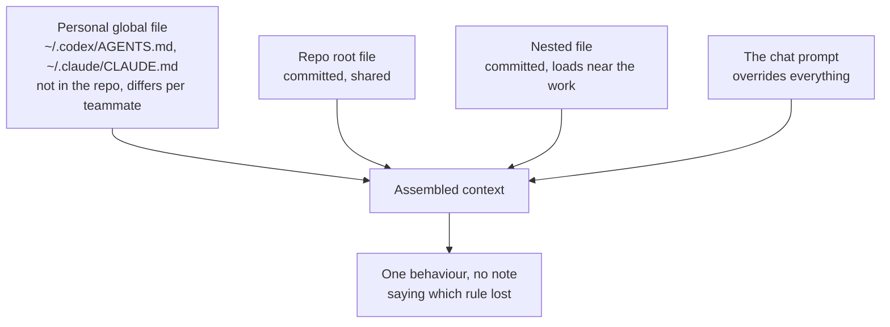

# Lesson 5: When two rules disagree

> Lesson objectives:
> - Explain why a declared priority ordering is a convention the model may or may not honour, rather than a mechanism that enforces itself.
> - Name the three places a conflicting instruction can come from in a single session.
> - Find contradictions in your own instruction set by reading the assembled chain rather than any single file.
> - Resolve a conflict by narrowing scope or deleting one side, and say why emphasis is the weakest available fix.
>
> Prerequisites: Lesson 4 — your rules are concrete enough to contradict each other | Previous [<< 04](./04-commands-not-adjectives.md) | Next [06 >>](./06-evidence-of-behaviour-change.md)

## Both rules were followed, on alternating days

Root file, line 8: `Always run the full test suite before committing.` Added after a bad merge, eighteen months ago.

`services/payments/AGENTS.md`, line 3: `Run make test-payments, not npm test.` Added last month by the payments team, who were tired of correcting it.

Both are concrete. Both are placed correctly by Lesson 3's rules. And in a payments session both are in the same context, saying opposite things, with the word `Always` on the losing side. Sometimes the agent runs the payments suite. Sometimes it runs both. Once it ran the root suite, reported green, and shipped a broken charge path.

The inconsistency is not a malfunction. It is what happens when two instructions of similar authority disagree and nothing outside the text decides between them. This lesson is about what actually resolves a conflict, what only appears to, and how to find the conflicts already sitting in your files.

## Explanation

### The documented resolution rule, and its exact scope

The format's site answers the conflict question in one sentence: "The closest AGENTS.md to the edited file wins; explicit user chat prompts override everything."[^S1]

That gives a two-level ordering — chat prompt beats file, nearer file beats farther file — and Lesson 3 explained the mechanism behind the second half: files are concatenated root-first, so the nearest file appears last in the assembled text and is expected to dominate.[^S3][^S5]

Now read what that sentence does *not* cover. It resolves conflicts *between files at different depths*. It says nothing about two rules inside the same file, and nothing about how strongly the nearer file wins. Both gaps matter, and Claude Code's docs name the first one plainly: "if two rules contradict each other, Claude may pick one arbitrarily."[^S5]

*Arbitrarily* is the word to sit with. Not "the later one wins," not "the more specific one wins" — arbitrarily. Within one file, ordering buys you nothing you can rely on.

### Why "the nearer file wins" is weaker than it sounds

The cross-file case is better, because position carries real weight. But it is a tendency in a text, not a rule enforced by code, and there is peer-reviewed evidence about how much load that kind of arrangement bears.

The Control Illusion study, published at AAAI-26, tested exactly this: what happens when a model is given two contradictory instructions with one designated higher-priority. The conflicts are deliberately minimal — capitalisation, length, language — placed in system versus user messages, which is the strongest priority separation those model APIs offer.

The baseline first. Without conflict, the six models tested followed individual constraints well: "all models demonstrate strong performance (ranging from 74.8–90.8%) when following individual constraints without conflicts."[^S7] So the instructions themselves were easy.

Add the conflict and it collapses: "Most models show dramatically lower performance (9.6–45.8% average R1) when handling conflicting constraints, compared to their baseline instruction-following capabilities."[^S7] R1 is the rate of following the *designated primary* constraint.

And stating the priority explicitly did not fix it: "Even for the emphasized separation configuration, where priority is explicitly stated, the obedience rate remains far from reliable priority control."[^S7] The best result under explicit emphasis was 63.8% on simple instructions.

**Read the boundary before carrying this anywhere.** These are formatting conflicts between system and user messages on 2025-generation models — not repository instruction files, not two AGENTS.md files at different depths, and the percentages do not transfer. What transfers is the mechanism, and the mechanism is the point: *a declared priority is a hint the model weighs against everything else in context, not a switch that disables the losing instruction.* If explicit priority in the strongest available separation lands well short of reliable, a convention about file depth is not stronger.

Two further findings from that study sharpen the practical advice.

**The conflict is usually resolved silently.** The authors found that "models rarely acknowledge the existence of conflicting instructions in their responses, and even when they do recognize conflicts, they frequently fail to maintain proper instruction hierarchies."[^S7] You do not get a warning that your file contradicts itself. You get one of the two behaviours, with no note attached — which is why the payments example above reads as flakiness rather than as a contradiction you wrote.

**Your ordering competes against the model's own preferences.** The study measured Constraint Bias — a model's tendency toward one kind of instruction regardless of designated priority — and found "Bias magnitudes often exceed 0.5, indicating a clear default tendency toward certain constraints."[^S7] It also found the effect uneven by constraint type: models "have better priority control over categorical constraints (e.g., case, language) than constraints requiring reasoning along a continuous scale."[^S7] The practical translation, which is my inference rather than the paper's claim: a conflict between two crisp either/or rules is the case a priority convention handles best; a conflict involving a judgment call is the case where it handles worst.

### Three places a conflicting instruction comes from

Before you can find contradictions, you need to know what is actually in the context competing with your file. Three sources, and only one of them is the file you are editing.



What this diagram is for: your repository holds two of the four inputs. A teammate's personal global file is real, is loaded, is invisible to you, and is a documented feature — Codex reads a global file from its home directory,[^S3] Amp reads `$HOME/.config/amp/AGENTS.md` and system-wide files,[^S4] Claude Code reads `~/.claude/CLAUDE.md` and a managed-policy file above it.[^S5] When a colleague reports behaviour your file cannot explain, this is the first thing to check, and you cannot check it from the repository.

The chat prompt sitting above all of them is the useful half of that picture: the chat prompt override is the documented escape hatch,[^S1] and it means a rule that occasionally needs breaking does not need to be softened in the file. Write the rule firmly and override it in conversation on the day it does not apply.

### What actually resolves a conflict

Four moves, worst to best.

**Emphasis — the weakest.** Adding `ALWAYS`, `NEVER`, bold, or capitals to one side. This is what everyone reaches for and it is closest to the configuration Control Illusion found "far from reliable priority control" even when priority was explicitly stated.[^S7] It also has a compounding cost: once two rules are shouting, the next contested rule has to shout louder, and a file where everything is emphasised has no emphasis. It is not useless — it is the least reliable thing available, and it is what people do *instead of* the three moves below.

**Narrowing scope — usually right.** Rewrite one rule so the two no longer overlap. The payments conflict dissolves entirely if the root rule becomes `Run npm test before committing (services/ have their own suites — see the AGENTS.md in each).` Now nothing contradicts: the root rule excludes the territory the nested rule claims. This works because the conflict was an artifact of a rule written before the exception existed.

**Deleting one side — often right, rarely chosen.** One rule is usually stale. `Always run the full test suite` was written when there was one suite; the repository grew and nobody revisited it. Claude Code's docs recommend this as maintenance rather than crisis response: "Review your CLAUDE.md files, nested CLAUDE.md files in subdirectories, and `.claude/rules/` periodically to remove outdated or conflicting instructions."[^S5]

**Making the losing rule impossible — best where available.** If the root suite must never be the one that runs in payments, the strongest fix is not text at all: make `npm test` fail with a message pointing at `make test-payments`. Then no instruction needs to win, because there is nothing to choose. This is Lesson 1's guidance-versus-enforcement boundary and Lesson 4's poka-yoke idea arriving at the same place from a third direction. It costs real work and is worth it only for conflicts that keep recurring.

The ordering is the lesson: **rewrite scope first, delete second, enforce for the ones that keep coming back, and treat emphasis as what you add after the real fix, not instead of it.**

### Finding the conflicts you already have

Conflicts hide because nobody reads the assembled chain — people read one file, and each file is individually coherent. So assemble it.

For a directory you care about, concatenate every instruction file that would load there, root first, in order. That is what the tool sees.[^S3][^S5] Then read it looking for four patterns, in rough order of how often they turn up:

1. **Two commands for the same job.** Grep the chain for command names. Two different test commands, two package managers, two lint invocations — each is a conflict unless one explicitly excludes the other's territory.
2. **A universal quantifier meeting an exception.** Search for `always`, `never`, `all`, `every`. A rule with `always` in it conflicts with every later exception by construction; that is what the word means.
3. **A rule that outlived its subject.** Any rule naming a path, script, or service. If the thing is gone, the rule is not merely dead — it is actively misleading, and it will be followed.
4. **Contradiction by implication.** The subtlest: `Keep changes minimal` in the root and `Add tests for any behaviour you change` in a nested file. Neither mentions the other; together they underdetermine what to do when the minimal change is untested.

The fourth is the one worth slowing down for, because it is invisible to grep and common in files that grew from separate incidents. Both rules are good. Their intersection is a decision nobody made, and the run makes it silently. A contradiction by implication also survives review indefinitely, since reviewing either rule on its own turns up nothing wrong.

```agentmentor-check
{
  "id": "agent-readable-repo-conflicts-strongest-available-fix",
  "label": "Pick the fix that survives",
  "prompt": "Your root file says 'Always run the full test suite before committing.' The payments subdirectory file says 'Run make test-payments, not npm test.' Agents in payments sessions do one or the other unpredictably. Which change most reliably ends the inconsistency?",
  "whyHere": "Emphasis is the near-universal first response and it is the one option with published evidence against it, so this is the place to spend the reader's attention — the correct answer looks less decisive than the wrong one, which is exactly why people skip it.",
  "copyPurpose": "Have the agent check whether I am reaching for stronger wording where I should be narrowing a rule's scope, using the actual conflicting rules in my own files.",
  "mode": "single",
  "choices": [
    {
      "id": "emphasis",
      "text": "Bold the nested rule and add 'THIS OVERRIDES THE ROOT RULE' so the priority is unmistakable",
      "correct": false,
      "feedback": "This is the configuration the AAAI-26 study measured as 'emphasized separation' — priority stated explicitly — and found still 'far from reliable priority control', with the best model reaching 63.8% on simple formatting conflicts. Both rules remain in context saying opposite things; you have only changed how loudly one of them says it. It also spends emphasis you will want later, since once two rules shout, the next one has to shout louder."
    },
    {
      "id": "narrow",
      "text": "Rewrite the root rule so it excludes the services directories, leaving nothing for the nested rule to contradict",
      "correct": true,
      "feedback": "This removes the conflict instead of adjudicating it. 'Run npm test before committing (services/ have their own suites — see the AGENTS.md in each)' and 'Run make test-payments' can both be true at once, so no priority mechanism has to hold. It also fixes the root cause: the root rule was written before the exception existed and was never revisited."
    },
    {
      "id": "deeper",
      "text": "Move the payments rule into a deeper subdirectory so it is unambiguously the nearest file",
      "correct": false,
      "feedback": "Depth is already on the nested rule's side — it is nearer, so it already appears later in the concatenated chain. Adding depth strengthens a signal that is not the weak link, and it risks Lesson 3's failure mode: a rule placed deeper loads for fewer sessions, so payments work that starts above that directory now gets the root rule alone."
    },
    {
      "id": "both",
      "text": "Change the nested rule to 'run both suites' so neither instruction is violated",
      "correct": false,
      "feedback": "This resolves the text by making every payments commit pay for a suite the payments team already determined does not cover their service. It is the compromise that looks safe and quietly reintroduces the cost the nested rule existed to remove — and it leaves the root's 'Always' unexamined, so the next service with its own suite creates the identical conflict."
    }
  ]
}
```

## Worked example: auditing one assembled chain

A team assembles the chain for `services/payments/` and reads it as one document. Root first, then the nested file.

```text
--- from repo/AGENTS.md ---
1  Use npm. The lockfile is package-lock.json.
2  Always run the full test suite before committing.
3  Keep changes minimal — do not add code that was not requested.
4  Never edit files in src/generated/; edit schema/ and run npm run codegen.
5  Update the CHANGELOG for any user-visible change.

--- from services/payments/AGENTS.md ---
6  Run make test-payments, not npm test.
7  Never log the full card object — use maskCard() from lib/pci.ts.
8  Add a test for every change to charge handling; this service is PCI-scoped.
9  Do not edit services/payments/vendor/ — it is a vendored SDK.
```

**Conflict 1: lines 2 and 6.** Direct, and found by pattern 1 — two test commands. *Fix: narrow line 2.* Rewrite as `Run npm test before committing (services/ have their own suites — see the AGENTS.md in each).` Both rules become true.

**Conflict 2: lines 3 and 8.** Contradiction by implication, found only by reading. "Keep changes minimal" and "add a test for every change" disagree exactly when a small charge fix would otherwise ship without a test — which is a routine situation, not an edge case. *Fix: narrow line 3 by naming its exception.* `Keep changes minimal — do not add code that was not requested. Tests are not extra code; add them where a nested file requires it.` The general rule keeps its force and stops swallowing the specific one.

**Conflict 3: lines 4 and 9, apparent only.** Both prohibit editing a directory, and they do not conflict — different paths, no overlap. Worth flagging in an audit and then clearing, because the audit is more useful when it distinguishes real conflicts from lines that merely look alike.

**Conflict 4: line 5, against nothing in this file.** The CHANGELOG rule mentions a file. Does `CHANGELOG.md` still exist? On inspection: it was removed when the team moved to generated release notes eight months ago. This is pattern 3 — a rule that outlived its subject — and it is the most dangerous line in the chain, because it is not ambiguous. An agent will do what it says: create the file, write an entry, and produce a change nobody wants. *Fix: delete.*

**One conflict that is not in this chain at all.** A payments developer reports that their agent keeps adding JSDoc comments nobody asked for, against line 3. Nothing in either file says to. The cause is in their `~/.claude/CLAUDE.md`, written a year ago for a different job. Personal global files are loaded, invisible to the repository, and per-teammate.[^S3][^S4][^S5] *Fix: not a repository change — the teammate narrows their own global file. Worth knowing this class exists, because you can audit the repo perfectly and still not explain the behaviour.*

Result: two rewrites, one deletion, one clarification, and one finding that lives outside the repository. Note that emphasis was not used once.

## Your turn: audit your own chain

Pick the directory in your repository where the most agent work happens. Assemble the chain that loads there.

Then work through the four patterns:

- Two commands for the same job: ________ → fix: ________
- A universal (`always`/`never`/`every`) meeting an exception: ________ → fix: ________
- A rule naming something that no longer exists: ________ → fix: ________
- Contradiction by implication (two good rules, undetermined intersection): ________ → fix: ________

For each fix, name the move: narrow scope, delete, enforce, or emphasise. If you wrote "emphasise" more than zero times, say what stopped you from narrowing instead.

<details>
<summary>Answer: what audits usually turn up, and the two traps</summary>

**The stale rule is almost always there, and it is usually the worst one.** Every audit of a file older than a year finds at least one rule naming a script, path, or process that has since changed. It is worse than a contradiction because there is nothing to adjudicate — the instruction is unambiguous and wrong, so it gets followed cleanly into a change you have to revert.

**The implication conflict is the one people miss and then recognise instantly.** It usually sounds like a philosophy disagreement between two people who were both right: minimal changes versus thorough tests, move fast versus document everything, do not add dependencies versus do not reinvent utilities. Neither rule is wrong; their intersection was never decided, and every run decides it again.

**Trap one: fixing the conflict by making both rules vaguer.** "Use judgment about test coverage" resolves the contradiction by removing the content of both rules, and lands you back in Lesson 4's adjective problem. The rule is now conflict-free and does nothing.

**Trap two: auditing one file instead of the chain.** Each file is internally coherent — that is why the contradiction survived. It only appears when you concatenate them in load order, which is what the tool does and what nobody does by hand.

If the audit finds no conflicts, check the file's age before believing it. A file under a few months old genuinely may not have any. A two-year-old file with no conflicts usually means the audit read the root file only.
</details>

```agentmentor-action
mode: pressure_scenario
label: Have the agent hunt the contradiction I could not see
description: Targets the implication conflict — two individually sound rules whose intersection nobody decided — which is the one class of contradiction that grep cannot find and that reads as flakiness in real runs.
purpose: I want a second reader on my assembled instruction chain, because the contradictions that survive are exactly the ones that look reasonable to the person who wrote both halves.
rules:
  - Ask me to paste my assembled chain — every instruction file that loads for one directory, concatenated root-first in load order.
  - Do not list every possible tension. Find the two rules whose intersection is genuinely undetermined and name the specific situation where they disagree.
  - Describe that situation concretely enough that I can recognise a run where it already happened.
  - Then ask me which move I would use — narrow, delete, enforce — and push back if I reach for stronger wording instead.
  - One conflict at a time, and say when you think the chain is clean.
```

<!-- exercises -->
## 💻 Exercises (point these at your own real environment)

### Level 1 (warm-up)
Assemble and scan one chain. In your terminal, from the repository root, concatenate the instruction files that load for your busiest directory in root-first order — for example `cat AGENTS.md services/payments/AGENTS.md > /tmp/chain.md` — then run `grep -n -iE 'always|never|all |every ' /tmp/chain.md` over the result. Success is a numbered list of universal quantifiers; no output means your rules are already scoped. For each hit, name one situation where that universal is false.

<!-- rubric -->
- The chain is assembled in load order, root first, and the file list is recorded.
- Every universal quantifier is listed with its line number.
- Each one has a concrete counter-situation written next to it, or is confirmed as genuinely universal with a reason.
- At least one rule is identified as needing its scope narrowed, with the rewritten line.

<!-- answer -->
Universals are the highest-yield grep because they make a claim about the whole repository from a file that usually knows about one part of it. Most survive because they were true when written: there was one test suite, one deployment target, one service.

The useful discipline is that a genuinely universal rule should survive the challenge. `Never commit secrets` has no counter-situation, and it should keep its `never`. `Always run the full test suite` fails on the first service with its own suite. The word is not the problem; an unexamined word is.

Watch for a universal that is true but pointless — `Always write correct code`. That is Lesson 4's adjective problem wearing a quantifier, and the fix is deletion, not scoping.

<!-- hint -->
Get the load order right: root first, nearest last. Reading them in the other order can make a resolved conflict look unresolved.

<!-- hint -->
If your grep hits a universal inside a code block or an example, skip it. You are auditing rules, not sample text.

<!-- hint -->
For the counter-situation, look for a directory in your repository that the rule's author probably was not thinking about. New services are where universals go to die.

### Level 2 (advanced)
Do the full four-pattern audit on your busiest chain, then fix every conflict you find. For each, record: the two rules, which pattern found it, the move you used, and the rewritten text. Then check the one source you cannot see from the repository — ask each teammate who runs an agent on this repo whether they have a personal global instruction file, and what is in it.

<!-- rubric -->
- All four patterns applied, with the result of each recorded — including "none found", which is a result.
- Every conflict has both rules quoted, the move named, and the new text written out.
- No conflict is resolved by emphasis alone; any use of emphasis sits on top of a real fix.
- At least one rule is deleted rather than rewritten.
- The personal-global-file question is asked of every teammate who runs an agent here, with answers recorded — including "did not know I had one".

<!-- answer -->
The teammate question is the part people skip and the part that explains the behaviour a repository audit cannot. Personal global files are documented across tools[^S3][^S4][^S5] and they are invisible to everyone but their owner. A colleague whose global file says "always add JSDoc to exported functions" will produce diffs your repository rules do not explain, and neither of you will find it by reading the repo.

Ask it as a factual question, not a compliance one. Global files are legitimate and useful — the point of a personal file is exactly that it holds preferences the team has not agreed on. What matters is knowing they exist when you are debugging behaviour, and noticing when something in one has quietly become a team-wide expectation that belongs in the shared file instead.

**The common mistake in this exercise is fixing conflicts one at a time and re-reading only the file you edited.** Narrowing a root rule changes the chain for every directory below it, so a fix that resolves the payments conflict can create one in `web/`. Re-assemble and re-read the whole chain after your edits, not just the file you touched.

The delete requirement is there because deleting is the move people avoid. Rewriting feels like preserving information; on a rule that outlived its subject, it preserves nothing and costs a line on every session. If your audit found no rule worth deleting, look specifically for rules naming a script, path, or process, and verify each one still exists.

<!-- hint -->
Pattern 4 cannot be grepped. Read the assembled chain end to end, slowly, asking after each rule: does anything above or below this make it harder to obey?

<!-- hint -->
When you narrow a root rule, list the directories under it and check the rewrite against each. A narrowing that names `services/` is fine; one that names `payments` specifically will be wrong the day a second service appears.

<!-- hint -->
For the teammate question, ask what tool they use as well. The file's location differs per tool, and "I don't have one" sometimes means "I don't know where mine lives".
<!-- /exercises -->

## A chain that agrees with itself

What you can now do:

- Explain why a stated priority is a hint weighed against everything else in context, and cite the measured gap between following one instruction and following the designated one of two.
- Name the four inputs assembled into one session's instructions, and identify the one your repository cannot see.
- Find contradictions by reading the assembled chain against four patterns, including the one grep cannot catch.
- Rank the fixes — narrow, delete, enforce — and recognise emphasis as what you add after a fix rather than instead of one.

Everything so far has been design: what belongs in the file, how long it should be, where each rule goes, how each line is worded, and whether the set agrees with itself. None of it is evidence. A file that satisfies every rule in this course can still fail to change a single run — because the tool never loaded it, because the rule that mattered was already implied, or because what looked like an improvement was noise. Lesson 6 is about finding out which, on your own repository.
