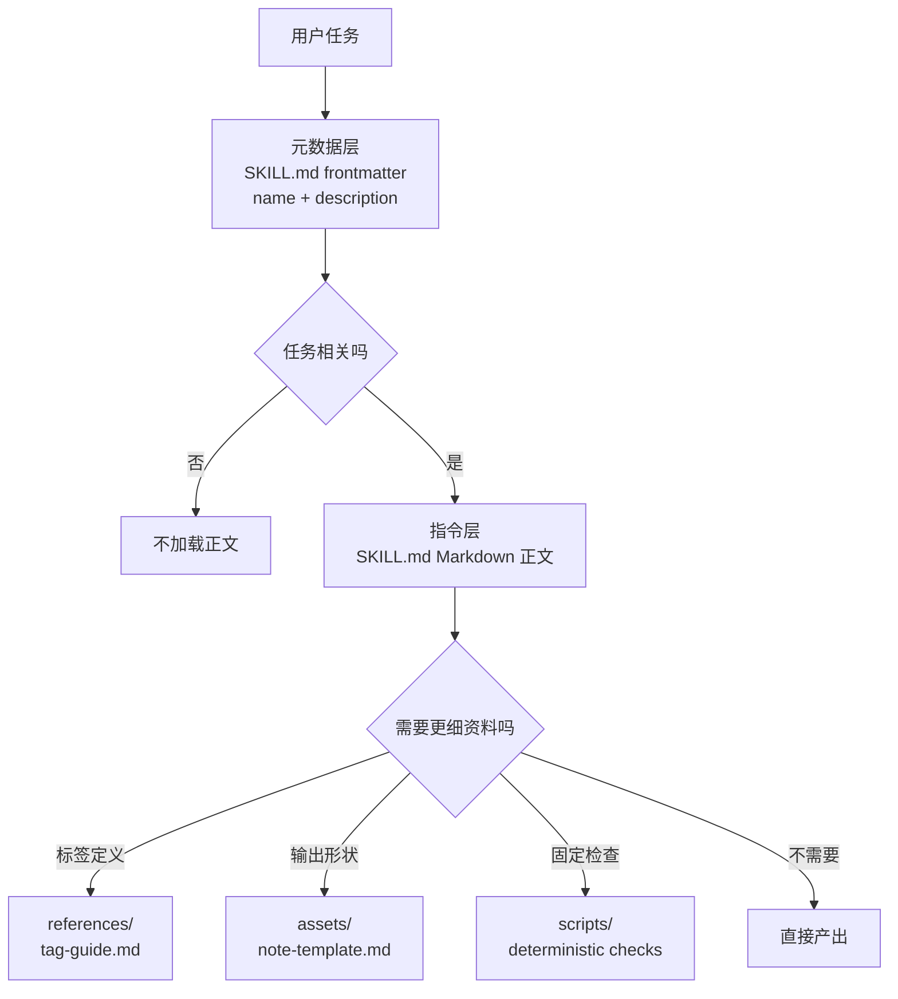

# 第 3 讲：渐进披露与资源分层

> 本讲目标：
> - 解释 Skill 为什么不应该把所有资料都塞进 `SKILL.md`。
> - 区分元数据层、指令层和资源层的职责。
> - 为一个资料较长的 Skill 画出按需加载结构。
>
> 前置条件：能写出最小 `SKILL.md` 的 `name`、`description` 和正文 | 上一讲 [<< 02](./02-skill-metadata.md) | 下一讲 [04 >>](./04-resources-and-boundaries.md)

## 你的 Skill 入口不该像资料柜

访谈纪要 Skill 一开始只有几条指令，后来又加进标签解释、示例纪要、语气规则和质量检查。每次任务都要读完这些内容，入口文件就成了资料柜。Agent 原本只需要先判断“这是不是访谈纪要任务”。

公开规范和官方说明把 Skill 描述为带有 `SKILL.md`、指令、脚本和资源的目录，并强调用渐进披露管理上下文。[^S1][^S3] 这意味着入口、执行规则和偶尔才用的细节要分开摆放。

## 解释

### 第一层：元数据层

元数据层就是 `SKILL.md` 顶部的 frontmatter，尤其是 `name` 和 `description`。它像文件柜外面的标签：短、稳定、帮助 Agent 判断是否打开这只柜子。规范要求 `SKILL.md` 先有 YAML frontmatter，再接 Markdown 正文；上一讲已经把 `name` 和 `description` 的格式讲清楚。[^S2]

这一层不要放操作细节。比如访谈纪要 Skill 的 `description` 可以写“把客户访谈 transcript 转成带原话证据的中文纪要”，但不该塞进“所有标签定义、五种客户类型和三个示例”。元数据层的目标是命中相关任务。

### 第二层：指令层

指令层是 `SKILL.md` frontmatter 后面的 Markdown 正文。它告诉 Agent：拿到任务后先做什么、输出什么、哪些边界不能越过。它应该足够短，让 Agent 一次读完就能开始工作。

在访谈纪要例子里，正文可以写：读取 transcript；提取主题、原话和开放问题；输出中文 Markdown；不修改原始文件。正文还可以指向更深资料：“如果需要标签定义，读取 `references/tag-guide.md`。”这句话就是从指令层通向资源层的门。

### 第三层：资源层

资源层使用开放规范约定的 `references/`、`assets/` 和 `scripts/`。它们不一定每次都要读。Agent 只有在任务需要某种细节时，才进入对应资源。不同客户端的发现和加载细节可能不同，所以本课只依赖公开文件结构，不假设所有实现都采用同一种内部策略。[^S2][^S4]

资源层适合放长资料：访谈标签解释、示例纪要、风格准则、空白模板、固定检查脚本。资料仍在目录里，但入口只保留当前任务必须读取的内容。

### 第四层：按需加载

按需加载指的是：先用最少信息判断相关性，再在任务需要时读取更深资料。它是渐进披露在 Skill 目录里的实际动作。官方说明把渐进披露作为 Skill 管理上下文的核心思路之一。[^S3]

你可以把层级想成下面这条路径。图里最重要的是箭头方向：Agent 先看外层，只有任务需要时才往下读。



```agentmentor-order
{
  "id": "agent-skills-reuse-progressive-disclosure-order",
  "label": "排加载顺序",
  "prompt": "一个访谈纪要 Skill 收到任务后，下面四步更合理的读取顺序是什么？",
  "whyHere": "很多初学者会先把所有资源读完，再开始判断任务是否相关；这个排序检查按需加载的方向是否真的建立起来。",
  "copyPurpose": "让 Agent 检查我是否把 Skill 的元数据、正文和资源读取顺序混在一起。",
  "items": [
    {
      "id": "metadata",
      "text": "用 `description` 判断这个用户任务是否像访谈纪要任务"
    },
    {
      "id": "instructions",
      "text": "读取 `SKILL.md` 正文，确认输入、输出和不处理边界"
    },
    {
      "id": "need",
      "text": "判断这次任务是否需要标签定义、模板或示例"
    },
    {
      "id": "resource",
      "text": "只读取本次任务需要的 `references/` 或 `assets/` 文件"
    }
  ],
  "correctOrder": ["metadata", "instructions", "need", "resource"],
  "feedback": "顺序正确：先用元数据判断是否相关，再读指令，最后按任务需要进入资源层。",
  "feedbackWrong": "先找第一个倒置点：如果还没判断任务相关性就读资源，入口层就失去了过滤作用；如果还没读正文就读模板，也容易忽略不处理边界。"
}
```

本讲术语表：

- 元数据层：`SKILL.md` frontmatter 中帮助 Agent 发现 Skill 的短信息。
- 指令层：`SKILL.md` 正文中指导 Agent 执行任务的核心规则。
- 资源层：放置长参考资料、模板、素材或脚本的目录。
- 按需加载：任务需要某类细节时，才读取对应更深资料。

## 完整示例：公开访谈纪要 Skill 的三层目录

假设你要做一个公开、虚构的 `interview-notes` Skill。它只处理用户自己提供的访谈 transcript，不包含任何真实客户隐私。你手里有三类资料：

```text
1. 任务边界：整理 transcript，输出中文纪要，不改原文。
2. 标签定义：pain-point、workaround、buying-signal 的解释。
3. 输出样式：纪要标题、原话证据、开放问题的排版模板。
```

第一步，先让目录名和入口存在：

```text
interview-notes/
  SKILL.md
```

第二步，把元数据层写短：

```markdown
---
name: interview-notes
description: Turns user-provided interview transcripts into Chinese Markdown notes with quoted evidence, themes, and open questions. Use when summarizing interviews, research calls, or transcript notes.
---
```

这段只负责“是否该打开”。它没有解释每个标签，也没有塞入完整模板。

第三步，把指令层写成可执行规则：

```markdown
# Interview Notes

## Instructions

Use this skill when the user provides interview transcripts or research call notes.

Return Chinese Markdown with:

- short summary
- quoted evidence
- recurring themes
- open questions

Do not modify the original transcript or invent missing quotes.

If the user asks for structured labels, read `references/tag-guide.md`.
If the user asks for a fixed note shape, read `assets/note-template.md`.
```

第四步，再放资源：

```text
interview-notes/
  SKILL.md
  references/
    tag-guide.md
  assets/
    note-template.md
```

这个结构的好处是：普通总结任务只需要读入口和正文；只有当用户要求“按标签分类”或“按固定格式输出”时，Agent 才进入对应资源。资源没有消失，只是从入口正文里退到了合适的位置。

## 半完成示例：把长入口拆成三层

下面这个 `SKILL.md` 草稿把所有内容都塞进入口。请补完三个“搬到哪里”的判断。

```markdown
---
name: interview-notes
description: Summarizes interviews.
---

# Interview Notes

## Instructions

Read transcript files and write Chinese notes with quotes.

## Tag Definitions

pain-point = 用户反复提到的具体阻碍……
workaround = 用户为了绕开阻碍做出的临时办法……
buying-signal = 用户主动询问价格、部署或采购流程……

## Note Template

# 访谈纪要
## 摘要
## 原话证据
## 开放问题
```

补完：

```text
元数据层应该改成：________________________________。
指令层应该保留：________________________________。
资源层应该拆出：________________________________。
```

参考答案：

```text
元数据层应该改成：更具体的 description，例如说明输入是 interview transcripts，输出是带原话证据和主题的中文纪要，并写明 Use when summarizing interviews 或 research calls。
指令层应该保留：读取 transcript、输出中文纪要、保留原话、不虚构证据，以及需要标签或固定格式时读取哪个资源文件。
资源层应该拆出：`references/tag-guide.md` 放标签定义，`assets/note-template.md` 放纪要模板。
```

关键判断是入口正文只留下执行所必需的规则，把偶尔才用的长资料移到可指向的位置。单纯追求字数短没有意义。

<!-- exercises -->
## 练习

### Level 1（热身）

拿出你上一讲写的练习 Skill，在纸上或一个草稿 Markdown 里画出三层结构：元数据层、指令层、资源层。即使你还没有创建 `references/` 或 `assets/`，也要写出“将来什么内容会放进去”。

做法：先复制你的 `description`，把它标成元数据层；再复制正文中的 3 到 6 条核心规则，标成指令层；最后列出 2 到 4 个“入口里不该长篇展开，但任务可能会用到”的资料。
<!-- rubric -->
- 三层都存在，并且每层至少有一个具体条目。
- 元数据层没有放长操作步骤。
- 指令层能独立指导一次普通任务。
- 资源层的每个条目都能说明“何时需要读取”。
<!-- answer -->
合格答案示例：`description` 属于元数据层；“读取 transcript、输出中文纪要、不修改原文”属于指令层；“标签定义、完整输出模板、示例纪要”属于资源层。常见错误是把所有资料都叫“指令”，这会让 Agent 无法区分每次必读和偶尔才读的内容。
<!-- hint -->
先问：Agent 判断是否加载 Skill 时，需要这条信息吗？
<!-- hint -->
再问：普通任务每次都必须读这条信息吗？如果不是，它多半属于资源层。

### Level 2（进阶）

为一个公开、虚构的访谈纪要 Skill 写出目录树和 `SKILL.md` 正文片段。要求正文中至少有两句“需要时读取某个资源”的指向语句。

做法：在自己的练习目录或草稿文件中写目录树，不要放真实访谈内容。目录树至少包含 `SKILL.md`、一个 `references/` 文件和一个 `assets/` 文件。正文片段只写核心规则和资源指向。
<!-- rubric -->
- 目录树中的资源文件名能看出用途。
- `SKILL.md` 正文没有复制长标签定义或完整模板。
- 至少两句资源指向语句分别对应不同触发条件。
- 没有使用真实客户、公司或私人访谈内容。
<!-- answer -->
一种合格结构是：`references/tag-guide.md` 放标签解释，`assets/note-template.md` 放输出骨架。正文写“如果用户要求按标签分类，读取 `references/tag-guide.md`；如果用户要求固定纪要格式，读取 `assets/note-template.md`。”常见错误是把 `assets/note-template.md` 的全部内容复制到 `SKILL.md`，这样目录虽然存在，但没有真正分层。
<!-- hint -->
资源文件名可以朴素一些，例如 `tag-guide.md`、`note-template.md`。
<!-- hint -->
资源指向句的开头可以用“如果用户要求……”或“当任务需要……”。
<!-- /exercises -->

## 总结与下一步

当入口只留下发现信息和核心规则，标签解释、示例与模板就能在需要时再被读取。下一讲继续看这些资源之间的分工：哪些内容供 Agent 阅读，哪些内容供它复制，哪些内容才适合交给固定脚本。
