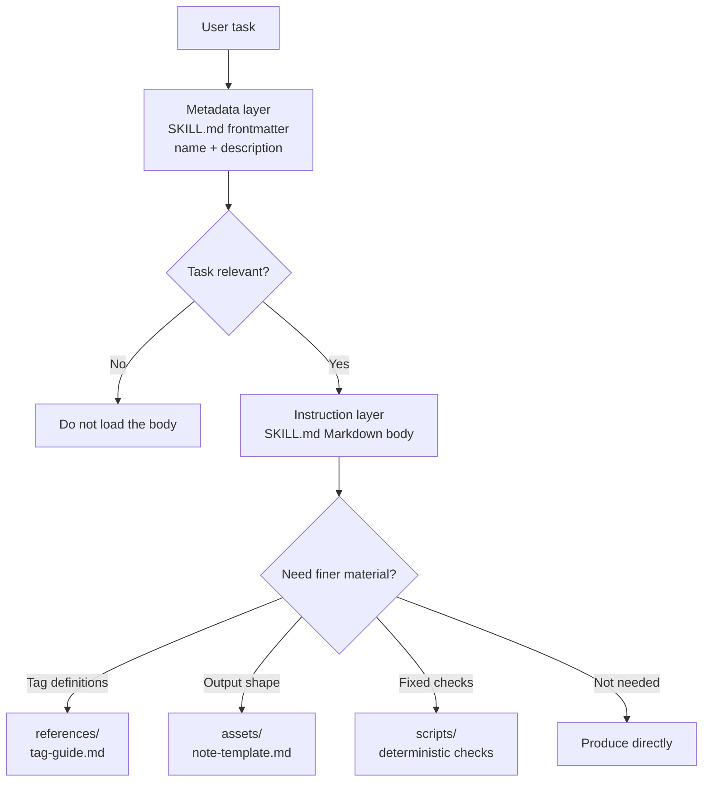

# Lesson 3: Progressive Disclosure and Resource Layering

> Goals for this lesson:
> - Explain why a Skill should not cram every material into `SKILL.md`.
> - Tell apart the jobs of the metadata layer, the instruction layer, and the resource layer.
> - Draw an on-demand loading structure for a Skill with long materials.
>
> Prerequisites: you can write a minimal `SKILL.md` with `name`, `description`, and a body | Previous [<< 02](./02-skill-metadata.md) | Next [04 >>](./04-resources-and-boundaries.md)

## Your Skill entry should not be a filing cabinet

The interview-notes Skill started with a few instructions; then tag definitions, sample notes, tone rules, and quality checks got added in. Reading all of that on every task turns the entry file into a filing cabinet. The agent originally only needed to judge "is this an interview-notes task".

The public specification and official docs describe a Skill as a directory with a `SKILL.md`, instructions, scripts, and resources, and they emphasize managing context with progressive disclosure.[^S1][^S3] That means the entry point, the execution rules, and the occasionally used details belong in separate places.

## Explanation

### Layer 1: the metadata layer

The metadata layer is the frontmatter at the top of `SKILL.md`, especially `name` and `description`. It is like the label on the outside of a filing cabinet: short, stable, and helping the agent decide whether to open this cabinet. The specification requires `SKILL.md` to start with YAML frontmatter followed by a Markdown body; the previous lesson covered the `name` and `description` formats.[^S2]

Put no operational detail in this layer. For example, the interview-notes Skill's `description` can say "turns customer interview transcripts into Chinese notes with quoted evidence", but it should not pack in "every tag definition, five customer types, and three examples". The goal of the metadata layer is to match relevant tasks.

### Layer 2: the instruction layer

The instruction layer is the Markdown body after the `SKILL.md` frontmatter. It tells the agent what to do first after receiving the task, what to output, and which boundaries must not be crossed. It should be short enough that the agent can read it once and start working.

In the interview-notes example, the body can say: read the transcript; extract themes, quotes, and open questions; output Chinese Markdown; do not modify the original file. The body can also point to deeper material: "If you need the tag definitions, read `references/tag-guide.md`." That sentence is the door from the instruction layer to the resource layer.

### Layer 3: the resource layer

The resource layer uses the `references/`, `assets/`, and `scripts/` directories named by the open specification. They do not have to be read every time. The agent enters a resource only when the task needs that kind of detail. Discovery and loading details differ across clients, so this course relies only on the public file structure and does not assume every implementation uses the same internal strategy.[^S2][^S4]

The resource layer suits long materials: interview tag definitions, sample notes, style guidelines, blank templates, fixed checking scripts. The materials still live in the directory, but the entry keeps only what the current task must read.

### Layer 4: on-demand loading

On-demand loading means: judge relevance with the least information first, then read deeper material when the task needs it. It is progressive disclosure as an actual motion inside the Skill directory. The official docs list progressive disclosure as one of the core ideas for how Skills manage context.[^S3]

You can picture the layers as the path below. The most important thing in the diagram is the arrow direction: the agent looks at the outer layer first, and reads deeper only when the task requires it.



```agentmentor-order
{
  "id": "agent-skills-reuse-progressive-disclosure-order",
  "label": "Order the loading steps",
  "prompt": "An interview-notes Skill has just received a task. What is the more reasonable reading order for these four steps?",
  "whyHere": "Many beginners read every resource first and only then judge whether the task is relevant; this ordering check verifies that the direction of on-demand loading has really sunk in.",
  "copyPurpose": "Have the agent check whether I mixed up the reading order of a Skill's metadata, body, and resources.",
  "items": [
    {
      "id": "metadata",
      "text": "Use the `description` to judge whether this user task looks like an interview-notes task"
    },
    {
      "id": "instructions",
      "text": "Read the `SKILL.md` body to confirm the input, output, and out-of-scope boundary"
    },
    {
      "id": "need",
      "text": "Judge whether this task needs tag definitions, a template, or examples"
    },
    {
      "id": "resource",
      "text": "Read only the `references/` or `assets/` files this task needs"
    }
  ],
  "correctOrder": ["metadata", "instructions", "need", "resource"],
  "feedback": "Correct order: judge relevance from the metadata first, then read the instructions, and enter the resource layer only as the task requires.",
  "feedbackWrong": "Find the first inversion: if you read resources before judging task relevance, the entry layer loses its filtering role; if you read templates before the body, you can easily miss the out-of-scope boundary."
}
```

Terms used in this lesson:

- metadata layer: the short information in the `SKILL.md` frontmatter that helps the agent discover the Skill.
- instruction layer: the core rules in the `SKILL.md` body that guide the agent through the task.
- resource layer: the directories holding long reference material, templates, assets, or scripts.
- on-demand loading: reading deeper material only when the task needs that kind of detail.

## Complete example: the three-layer directory of a public interview-notes Skill

Suppose you are building a public, fictional `interview-notes` Skill. It only processes interview transcripts the user provides and contains no real customer privacy. You have three kinds of material:

```text
1. Task boundary: organize transcripts, output Chinese notes, do not change the original.
2. Tag definitions: explanations of pain-point, workaround, buying-signal.
3. Output style: a layout template for the note title, quoted evidence, and open questions.
```

Step one: make the directory name and the entry exist:

```text
interview-notes/
  SKILL.md
```

Step two: keep the metadata layer short:

```markdown
---
name: interview-notes
description: Turns user-provided interview transcripts into Chinese Markdown notes with quoted evidence, themes, and open questions. Use when summarizing interviews, research calls, or transcript notes.
---
```

This passage only answers "should it be opened". It does not explain each tag and does not pack in the full template.

Step three: write the instruction layer as executable rules:

```markdown
# Interview Notes

## Instructions

Use this skill when the user provides interview transcripts or research call notes.

Return Chinese Markdown with:

- short summary
- quoted evidence
- recurring themes
- open questions

Do not modify the original transcript or invent missing quotes.

If the user asks for structured labels, read `references/tag-guide.md`.
If the user asks for a fixed note shape, read `assets/note-template.md`.
```

Step four: place the resources:

```text
interview-notes/
  SKILL.md
  references/
    tag-guide.md
  assets/
    note-template.md
```

The benefit of this structure: an ordinary summary task only reads the entry and the body; only when the user asks to "classify by tag" or "output in a fixed format" does the agent enter the matching resource. The resources have not disappeared — they have simply stepped back from the entry body to their proper place.

## Half-finished example: split a long entry into three layers

The `SKILL.md` draft below crams everything into the entry. Complete the three "where should it move" judgments.

```markdown
---
name: interview-notes
description: Summarizes interviews.
---

# Interview Notes

## Instructions

Read transcript files and write Chinese notes with quotes.

## Tag Definitions

pain-point = 用户反复提到的具体阻碍……
workaround = 用户为了绕开阻碍做出的临时办法……
buying-signal = 用户主动询问价格、部署或采购流程……

## Note Template

# 访谈纪要
## 摘要
## 原话证据
## 开放问题
```

Complete:

```text
The metadata layer should become: ________________________________.
The instruction layer should keep: ________________________________.
The resource layer should split out: ________________________________.
```

Reference answer:

```text
The metadata layer should become: a more specific description, for example stating the input is interview transcripts, the output is Chinese notes with quoted evidence and themes, and adding Use when summarizing interviews or research calls.
The instruction layer should keep: read the transcript, output Chinese notes, preserve quotes, do not invent evidence, plus which resource file to read when tags or a fixed format are needed.
The resource layer should split out: `references/tag-guide.md` for the tag definitions and `assets/note-template.md` for the note template.
```

The key judgment is that the entry body keeps only the rules execution requires, and moves occasionally used long material to a pointable location. Chasing a short character count for its own sake is meaningless.

<!-- exercises -->
## Exercises

### Level 1 (Warm-up)

Take the practice Skill you wrote in the previous lesson and draw its three layers on paper or in a scratch Markdown file: metadata layer, instruction layer, resource layer. Even if you have not created `references/` or `assets/` yet, write down "what content will go there in the future".

How: first copy your `description` and mark it as the metadata layer; then copy 3 to 6 core rules from the body and mark them as the instruction layer; finally list 2 to 4 materials that "should not be spelled out at length in the entry, but a task might use".
<!-- rubric -->
- All three layers exist, and each layer has at least one concrete entry.
- The metadata layer holds no long operating steps.
- The instruction layer can independently guide one ordinary task.
- Every resource-layer entry can state "when it needs to be read".
<!-- answer -->
A passing answer looks like: the `description` belongs to the metadata layer; "read the transcript, output Chinese notes, do not modify the original" belongs to the instruction layer; "tag definitions, the full output template, sample notes" belong to the resource layer. A common mistake is calling every material an "instruction", which leaves the agent unable to tell must-read-every-time content from read-only-when-needed content.
<!-- hint -->
Ask first: does the agent need this piece of information when deciding whether to load the Skill?
<!-- hint -->
Then ask: must every ordinary task read this piece of information? If not, it most likely belongs to the resource layer.

### Level 2 (Advanced)

For a public, fictional interview-notes Skill, write the directory tree and a `SKILL.md` body fragment. The body must contain at least two "read a resource when needed" pointer sentences.

How: write the directory tree in your practice directory or a scratch file; do not include real interview content. The tree contains at least `SKILL.md`, one `references/` file, and one `assets/` file. The body fragment holds only core rules and resource pointers.
<!-- rubric -->
- The resource file names in the directory tree make their purpose visible.
- The `SKILL.md` body does not copy in long tag definitions or a full template.
- At least two resource-pointer sentences correspond to different trigger conditions.
- No real customer, company, or private interview content is used.
<!-- answer -->
One passing structure: `references/tag-guide.md` holds the tag explanations, and `assets/note-template.md` holds the output skeleton. The body says "If the user asks to classify by tag, read `references/tag-guide.md`; if the user asks for a fixed note format, read `assets/note-template.md`." A common mistake is copying the entire contents of `assets/note-template.md` into `SKILL.md` — the directory exists, but nothing was actually layered.
<!-- hint -->
Resource file names can stay plain, for example `tag-guide.md` or `note-template.md`.
<!-- hint -->
A resource-pointer sentence can start with "If the user asks for..." or "When the task needs...".
<!-- /exercises -->

## Takeaway: after the entry point gets thin

Once the entry keeps only discovery information and core rules, tag definitions, examples, and templates can be read when needed. The next lesson looks at the division of labor among those resources: which content is for the agent to read, which is for it to copy, and which belongs to a fixed script.
