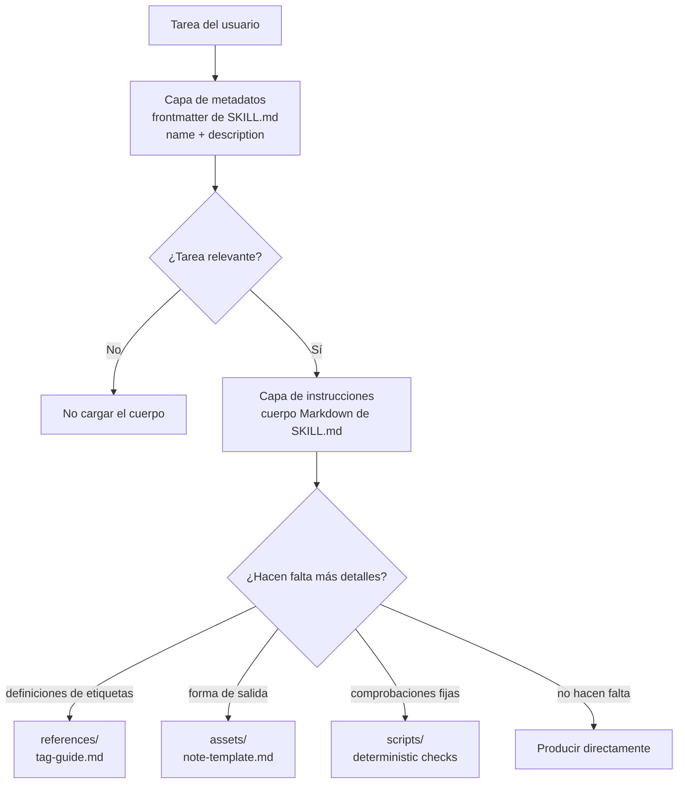

# Lección 3: Divulgación progresiva y estratificación de recursos

> Objetivos de esta lección:
> - Explicar por qué un Skill no debería meter todo su material dentro de `SKILL.md`.
> - Distinguir las responsabilidades de la capa de metadatos, la capa de instrucciones y la capa de recursos.
> - Dibujar una estructura de carga bajo demanda para un Skill con material largo.
>
> Requisitos previos: saber escribir el `name`, el `description` y el cuerpo de un `SKILL.md` mínimo | Lección anterior [<< 02](./02-skill-metadata.md) | Lección siguiente [04 >>](./04-resources-and-boundaries.md)

## La entrada de tu Skill no debería ser un archivador

El Skill de notas de entrevista empezó con unas pocas instrucciones; luego le añadiste explicaciones de etiquetas, notas de ejemplo, reglas de tono y comprobaciones de calidad. Si hay que leer todo eso en cada tarea, el archivo de entrada se convierte en un archivador. El Agent, en realidad, solo necesitaba decidir primero «si esto es una tarea de notas de entrevista».

La especificación pública y la documentación oficial describen el Skill como un directorio con `SKILL.md`, instrucciones, scripts y recursos, y subrayan el uso de la divulgación progresiva para gestionar el contexto.[^S1][^S3] Eso significa que la entrada, las reglas de ejecución y los detalles que solo se usan a veces se guardan por separado.

## Explicación

### Primera capa: la capa de metadatos

La capa de metadatos es el frontmatter en la parte superior de `SKILL.md`, sobre todo el `name` y el `description`. Es como la etiqueta en el exterior de un archivador: corta, estable, y sirve para que el Agent juzgue si abre ese cajón. La especificación exige que `SKILL.md` empiece con YAML frontmatter y siga con el cuerpo Markdown; la lección anterior ya dejó claro el formato de `name` y `description`.[^S2]

En esta capa no pongas detalles operativos. Por ejemplo, el `description` del Skill de notas de entrevista puede decir «convierte transcripts de entrevistas con clientes en notas en chino con evidencia de citas textuales», pero no debería embutir «todas las definiciones de etiquetas, cinco tipos de cliente y tres ejemplos». El objetivo de la capa de metadatos es acertar con las tareas relevantes.

### Segunda capa: la capa de instrucciones

La capa de instrucciones es el cuerpo Markdown que sigue al frontmatter de `SKILL.md`. Le dice al Agent qué hacer primero al recibir la tarea, qué entregar y qué límites no cruzar. Debería ser lo bastante corta para que el Agent la lea de una vez y pueda empezar a trabajar.

En el ejemplo de notas de entrevista, el cuerpo puede decir: lee el transcript; extrae temas, citas textuales y preguntas abiertas; entrega Markdown en chino; no modifiques el archivo original. El cuerpo también puede apuntar a material más profundo: «si necesitas las definiciones de etiquetas, lee `references/tag-guide.md`». Esa frase es la puerta que va de la capa de instrucciones a la capa de recursos.

### Tercera capa: la capa de recursos

La capa de recursos usa los directorios `references/`, `assets/` y `scripts/` que recoge la especificación abierta. No hace falta leerlos en cada tarea. El Agent solo entra en el recurso correspondiente cuando la tarea pide cierto detalle. Los detalles de descubrimiento y carga pueden variar entre clientes, así que este curso solo depende de la estructura pública de archivos y no asume que todas las implementaciones usen la misma estrategia interna.[^S2][^S4]

La capa de recursos es buena para material largo: explicaciones de etiquetas de entrevista, notas de ejemplo, guías de estilo, plantillas en blanco, scripts de comprobación fijos. El material sigue dentro del directorio, pero la entrada solo conserva lo que la tarea actual debe leer.

### Cuarta capa: la carga bajo demanda

La carga bajo demanda significa: juzgar primero la relevancia con la mínima información, y leer el material más profundo solo cuando la tarea lo necesita. Es la acción concreta de la divulgación progresiva dentro del directorio del Skill. La documentación oficial considera la divulgación progresiva una de las ideas centrales para gestionar el contexto de un Skill.[^S3]

Puedes pensar las capas como el camino de abajo. Lo más importante del diagrama es la dirección de las flechas: el Agent mira primero la capa exterior y solo baja cuando la tarea lo pide.



```agentmentor-order
{
  "id": "agent-skills-reuse-progressive-disclosure-order",
  "label": "Ordena la secuencia de carga",
  "prompt": "Cuando un Skill de notas de entrevista recibe una tarea, ¿cuál es el orden de lectura más razonable entre estos cuatro pasos?",
  "whyHere": "Muchas personas que empiezan leen la capa de recursos entera antes de juzgar si la tarea es relevante; esta ordenación comprueba si la dirección de la carga bajo demanda se ha entendido de verdad.",
  "copyPurpose": "Quiero que el Agent compruebe si estoy mezclando el orden de lectura de metadatos, cuerpo y recursos de un Skill.",
  "items": [
    {
      "id": "metadata",
      "text": "Usar `description` para juzgar si esta tarea del usuario parece una tarea de notas de entrevista"
    },
    {
      "id": "instructions",
      "text": "Leer el cuerpo de `SKILL.md` y confirmar entrada, salida y límites de «No procesa»"
    },
    {
      "id": "need",
      "text": "Juzgar si esta tarea necesita definiciones de etiquetas, una plantilla o ejemplos"
    },
    {
      "id": "resource",
      "text": "Leer solo los archivos de `references/` o `assets/` que esta tarea necesita"
    }
  ],
  "correctOrder": ["metadata", "instructions", "need", "resource"],
  "feedback": "Orden correcto: primero los metadatos para juzgar la relevancia, luego las instrucciones, y al final la capa de recursos según lo que pida la tarea.",
  "feedbackWrong": "Busca el primer punto invertido: si lees recursos antes de juzgar la relevancia, la capa de entrada pierde su función de filtro; si lees la plantilla antes de leer el cuerpo, también es fácil pasar por alto los límites de «No procesa»."
}
```

Glosario de esta lección:

- capa de metadatos: la información corta en el frontmatter de `SKILL.md` que ayuda al Agent a descubrir el Skill.
- capa de instrucciones: las reglas centrales en el cuerpo de `SKILL.md` que guían al Agent al ejecutar la tarea.
- capa de recursos: los directorios que guardan material de referencia largo, plantillas, recursos o scripts.
- carga bajo demanda: leer el material más profundo correspondiente solo cuando la tarea necesita ese tipo de detalle.

## Ejemplo completo: el directorio de tres capas de un Skill público de notas de entrevista

Supón que vas a hacer un Skill `interview-notes` público y ficticio. Solo procesa transcripts de entrevista que el propio usuario aporta, sin ningún dato privado de clientes reales. Tienes tres tipos de material:

```text
1. Límite de la tarea: organizar el transcript, entregar notas en chino, no modificar el original.
2. Definiciones de etiquetas: explicación de pain-point, workaround y buying-signal.
3. Estilo de salida: plantilla de maquetación para el título de las notas, la evidencia con citas textuales y las preguntas abiertas.
```

Primer paso: que existan el nombre de directorio y la entrada:

```text
interview-notes/
  SKILL.md
```

Segundo paso: escribe corta la capa de metadatos:

```markdown
---
name: interview-notes
description: Turns user-provided interview transcripts into Chinese Markdown notes with quoted evidence, themes, and open questions. Use when summarizing interviews, research calls, or transcript notes.
---
```

Este fragmento solo responde a «si conviene abrirlo». No explica cada etiqueta ni embute la plantilla completa.

Tercer paso: escribe la capa de instrucciones como reglas ejecutables:

```markdown
# Interview Notes

## Instructions

Use this skill when the user provides interview transcripts or research call notes.

Return Chinese Markdown with:

- short summary
- quoted evidence
- recurring themes
- open questions

Do not modify the original transcript or invent missing quotes.

If the user asks for structured labels, read `references/tag-guide.md`.
If the user asks for a fixed note shape, read `assets/note-template.md`.
```

Cuarto paso: coloca los recursos:

```text
interview-notes/
  SKILL.md
  references/
    tag-guide.md
  assets/
    note-template.md
```

La ventaja de esta estructura es que una tarea normal de resumen solo necesita leer la entrada y el cuerpo; solo cuando el usuario pide «clasificar por etiquetas» o «salida con formato fijo» entra el Agent en el recurso correspondiente. Los recursos no han desaparecido; simplemente se han retirado del cuerpo de la entrada a su lugar adecuado.

## Ejemplo a medias: dividir una entrada larga en tres capas

Este borrador de `SKILL.md` lo mete todo en la entrada. Completa los tres juicios de «a dónde se mueve».

```markdown
---
name: interview-notes
description: Summarizes interviews.
---

# Interview Notes

## Instructions

Read transcript files and write Chinese notes with quotes.

## Tag Definitions

pain-point = 用户反复提到的具体阻碍……
workaround = 用户为了绕开阻碍做出的临时办法……
buying-signal = 用户主动询问价格、部署或采购流程……

## Note Template

# 访谈纪要
## 摘要
## 原话证据
## 开放问题
```

Completa:

```text
La capa de metadatos debería cambiar a: ________________________________.
La capa de instrucciones debería conservar: ________________________________.
La capa de recursos debería separar: ________________________________.
```

Respuesta de referencia:

```text
La capa de metadatos debería cambiar a: un description más concreto, por ejemplo uno que diga que la entrada son interview transcripts, que la salida son notas en chino con evidencia de citas textuales y temas, y que escriba Use when summarizing interviews o research calls.
La capa de instrucciones debería conservar: leer el transcript, entregar notas en chino, conservar las citas textuales, no inventar evidencia, y a qué archivo de recurso acudir cuando hagan falta etiquetas o un formato fijo.
La capa de recursos debería separar: `references/tag-guide.md` para las definiciones de etiquetas y `assets/note-template.md` para la plantilla de las notas.
```

El juicio clave es que el cuerpo de la entrada solo conserva las reglas necesarias para ejecutar, y mueve el material largo de uso ocasional a un lugar al que se pueda apuntar. Buscar simplemente que el texto sea corto no tiene sentido.

<!-- exercises -->
## Ejercicios

### Level 1 (Calentamiento)

Toma el Skill de práctica que escribiste en la lección anterior y dibuja en papel o en un Markdown de borrador la estructura de tres capas: capa de metadatos, capa de instrucciones y capa de recursos. Aunque todavía no hayas creado `references/` ni `assets/`, escribe «qué contenido entraría ahí en el futuro».

Cómo hacerlo: copia primero tu `description` y márcalo como capa de metadatos; copia después de 3 a 6 reglas centrales del cuerpo y márcalas como capa de instrucciones; por último, lista de 2 a 4 materiales que «no deberían desarrollarse en largo en la entrada, pero que la tarea podría usar».
<!-- rubric -->
- Las tres capas existen, y cada una tiene al menos un elemento concreto.
- La capa de metadatos no contiene pasos operativos largos.
- La capa de instrucciones puede guiar por sí sola una tarea normal.
- Cada elemento de la capa de recursos puede explicar «cuándo hay que leerlo».
<!-- answer -->
Un ejemplo de respuesta válida: el `description` pertenece a la capa de metadatos; «leer el transcript, entregar notas en chino, no modificar el original» pertenece a la capa de instrucciones; «definiciones de etiquetas, plantilla de salida completa, notas de ejemplo» pertenecen a la capa de recursos. El error típico es llamar «instrucciones» a todo el material, lo que impide al Agent distinguir lo que hay que leer siempre de lo que solo se lee a veces.
<!-- hint -->
Pregunta primero: cuando el Agent decide si carga el Skill, ¿necesita este dato?
<!-- hint -->
Pregunta después: ¿una tarea normal tiene que leer este dato cada vez? Si no, lo más probable es que pertenezca a la capa de recursos.

### Level 2 (Avanzado)

Escribe el árbol de directorios y un fragmento del cuerpo de `SKILL.md` para un Skill de notas de entrevista público y ficticio. Requisito: el cuerpo debe contener al menos dos frases que apunten a «leer cierto recurso cuando haga falta».

Cómo hacerlo: escribe el árbol de directorios en tu directorio de práctica o en un archivo de borrador, sin contenido de entrevistas reales. El árbol debe incluir como mínimo `SKILL.md`, un archivo en `references/` y un archivo en `assets/`. El fragmento del cuerpo solo escribe las reglas centrales y los apuntes a recursos.
<!-- rubric -->
- Los nombres de los archivos de recurso en el árbol dejan ver su propósito.
- El cuerpo de `SKILL.md` no copia definiciones largas de etiquetas ni la plantilla completa.
- Al menos dos frases de apunte a recursos corresponden a condiciones de disparo distintas.
- No se usa contenido de clientes, empresas o entrevistas privadas reales.
<!-- answer -->
Una estructura válida es: `references/tag-guide.md` con las explicaciones de etiquetas y `assets/note-template.md` con el esqueleto de salida. El cuerpo dice «si el usuario pide clasificar por etiquetas, lee `references/tag-guide.md`; si el usuario pide un formato fijo de notas, lee `assets/note-template.md`». El error típico es copiar todo el contenido de `assets/note-template.md` dentro de `SKILL.md`: el directorio existe, pero no hay estratificación real.
<!-- hint -->
Los nombres de archivo de recurso pueden ser sencillos, por ejemplo `tag-guide.md` o `note-template.md`.
<!-- hint -->
Las frases de apunte a recursos pueden empezar con «si el usuario pide...» o «cuando la tarea necesite...».
<!-- /exercises -->

## Para llevar: después de adelgazar la entrada

Cuando la entrada solo conserva la información de descubrimiento y las reglas centrales, las explicaciones de etiquetas, los ejemplos y las plantillas pueden leerse cuando hagan falta. La próxima lección sigue con el reparto de trabajo entre esos recursos: qué contenido es para que el Agent lo lea, qué contenido es para que lo copie, y qué contenido es el que conviene dejar a un script fijo.
