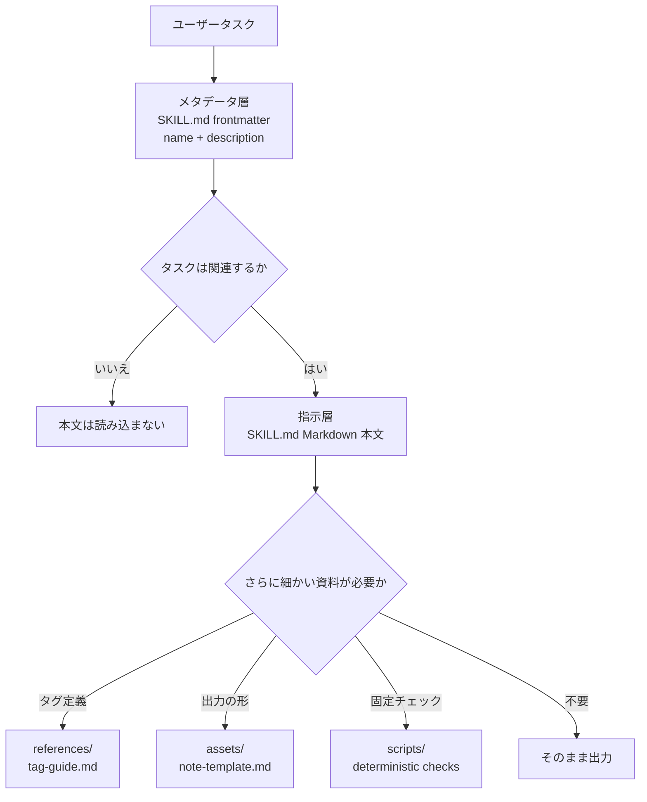

# 第3回：プログレッシブ・ディスクロージャーとリソースのレイヤー化

> 本講の目標：
> - Skill がすべての資料を `SKILL.md` に詰め込むべきでない理由を説明できます。
> - メタデータ層、指示層、リソース層の役割を区別します。
> - 資料が長い Skill のために、オンデマンド読み込みの構造を描けます。
>
> 前提条件：最小限の `SKILL.md` の `name`、`description`、本文が書けること | 前の講 [<< 02](./02-skill-metadata.md) | 次の講 [04 >>](./04-resources-and-boundaries.md)

## Skill の入口は資料棚になるべきではない

インタビューノート Skill は最初数行の指示だけでしたが、その後、タグの説明、ノート例、トーンルール、品質チェックが追加されました。毎回のタスクでこれら全部を読み込むと、入口ファイルは資料棚になります。Agent が本当に必要としていたのは、まず「これはインタビューノートのタスクか」を判断することだけでした。

公開仕様と公式の説明は、Skill を `SKILL.md`、インストラクション、スクリプト、リソースを持つディレクトリとして説明し、プログレッシブ・ディスクロージャーでコンテキストを管理することを強調しています。[^S1][^S3] つまり、入口、実行ルール、ときどきしか使わない詳細は、分けて配置するということです。

## 解説

### 第 1 層：メタデータ層

メタデータ層とは `SKILL.md` 先頭の frontmatter、特に `name` と `description` のことです。ファイルキャビネットの外側のラベルのようなもので、短く、安定していて、Agent がそのキャビネットを開けるべきか判断するのを助けます。仕様は `SKILL.md` がまず YAML frontmatter、次に Markdown 本文という順序を要求します。`name` と `description` の形式は前の講で説明したとおりです。[^S2]

この層に操作の詳細を置いてはいけません。たとえばインタビューノート Skill の `description` には「顧客インタビューの transcript を原話の証拠付きの中国語ノートに変換する」と書けますが、「すべてのタグ定義、5 種類の顧客タイプ、3 つの例」まで詰め込むべきではありません。メタデータ層の目標は、関連タスクにヒットすることです。

### 第 2 層：指示層

指示層は `SKILL.md` の frontmatter の後に続く Markdown 本文です。タスクを受け取った後、最初に何をするか、何を出力するか、どの境界を越えてはいけないかを Agent に伝えます。Agent が一度読めば作業を始められる程度の短さにすべきです。

インタビューノートの例では、本文に次のように書けます。transcript を読む。テーマ、原話、未解決の質問を抽出する。中国語の Markdown で出力する。元のファイルは変更しない。本文はさらに深い資料を指し示すこともできます。「タグ定義が必要なら `references/tag-guide.md` を読むこと」。この一文が、指示層からリソース層への扉です。

### 第 3 層：リソース層

リソース層は、オープン仕様が定める `references/`、`assets/`、`scripts/` を使います。これらは毎回読むとは限りません。Agent はタスクがある種の詳細を必要とするときだけ、対応するリソースに入ります。クライアントによって発見や読み込みの詳細は異なる可能性があるため、このコースは公開されているファイル構造だけに依存し、すべての実装が同じ内部戦略を取るとは想定しません。[^S2][^S4]

リソース層は長い資料の置き場所に適しています。インタビュータグの説明、ノート例、スタイルガイド、空のテンプレート、固定のチェックスクリプトなどです。資料はディレクトリ内に残りますが、入口には現在のタスクで必ず読むものだけを残します。

### 第 4 層：オンデマンド読み込み

オンデマンド読み込みとは、まず最小限の情報で関連性を判断し、タスクが必要とするときに、より深い資料を読むことです。これはプログレッシブ・ディスクロージャーが Skill ディレクトリの中で取る実際の動作です。公式の説明は、プログレッシブ・ディスクロージャーを Skill がコンテキストを管理する中核アイデアの 1 つとしています。[^S3]

レイヤーは次の経路としてイメージできます。図で最も重要なのは矢印の向きです。Agent はまず外側を見て、タスクが必要とするときだけ下に読み進みます。



```agentmentor-order
{
  "id": "agent-skills-reuse-progressive-disclosure-order",
  "label": "読み込み順を並べる",
  "prompt": "インタビューノート Skill がタスクを受け取ったとき、次の 4 ステップのより合理的な読み込み順はどれでしょうか。",
  "whyHere": "初学者はまずすべてのリソースを読んでからタスクの関連性を判断しがちです。この並べ替えは、オンデマンド読み込みの方向が本当に身についているかを確認します。",
  "copyPurpose": "Skill のメタデータ、本文、リソースの読み込み順を混同していないか、Agent にチェックさせます。",
  "items": [
    {
      "id": "metadata",
      "text": "`description` を使って、このユーザータスクがインタビューノートのタスクに見えるかを判断する"
    },
    {
      "id": "instructions",
      "text": "`SKILL.md` の本文を読み、入力、出力、対象外の境界を確認する"
    },
    {
      "id": "need",
      "text": "今回のタスクにタグ定義、テンプレート、例が必要かを判断する"
    },
    {
      "id": "resource",
      "text": "今回のタスクが必要とする `references/` や `assets/` のファイルだけを読む"
    }
  ],
  "correctOrder": ["metadata", "instructions", "need", "resource"],
  "feedback": "正しい順序です。まずメタデータで関連性を判断し、次に指示を読み、最後にタスクの必要に応じてリソース層に入ります。",
  "feedbackWrong": "まず最初の逆転箇所を探してください。タスクの関連性を判断する前にリソースを読むと、入口層のフィルター機能が失われます。本文を読む前にテンプレートを読むと、対象外の境界を見落としやすくなります。"
}
```

本講の用語：

- メタデータ層：`SKILL.md` の frontmatter 内の、Agent が Skill を発見するのを助ける短い情報。
- 指示層：`SKILL.md` 本文の、Agent のタスク実行を導く中核ルール。
- リソース層：長い参考資料、テンプレート、素材、スクリプトを置くディレクトリ。
- オンデマンド読み込み：タスクがある種の詳細を必要とするときだけ、対応する深い資料を読むこと。

## 完全な例：公開のインタビューノート Skill の 3 層ディレクトリ

公開用の架空の `interview-notes` Skill を作るとします。扱うのはユーザー自身が提供するインタビュー transcript だけで、実在の顧客のプライバシーは一切含みません。手元には 3 種類の資料があります。

```text
1. タスク境界：transcript を整理し、中国語のノートを出力し、原文は変更しない。
2. タグ定義：pain-point、workaround、buying-signal の説明。
3. 出力スタイル：ノートのタイトル、原話の証拠、未解決の質問のレイアウトテンプレート。
```

第 1 ステップ、まずディレクトリ名と入口を存在させます。

```text
interview-notes/
  SKILL.md
```

第 2 ステップ、メタデータ層を短く書きます。

```markdown
---
name: interview-notes
description: Turns user-provided interview transcripts into Chinese Markdown notes with quoted evidence, themes, and open questions. Use when summarizing interviews, research calls, or transcript notes.
---
```

これは「開けるべきか」だけを担います。各タグの説明も、完全なテンプレートも入っていません。

第 3 ステップ、指示層を実行可能なルールとして書きます。

```markdown
# Interview Notes

## Instructions

Use this skill when the user provides interview transcripts or research call notes.

Return Chinese Markdown with:

- short summary
- quoted evidence
- recurring themes
- open questions

Do not modify the original transcript or invent missing quotes.

If the user asks for structured labels, read `references/tag-guide.md`.
If the user asks for a fixed note shape, read `assets/note-template.md`.
```

第 4 ステップ、リソースを置きます。

```text
interview-notes/
  SKILL.md
  references/
    tag-guide.md
  assets/
    note-template.md
```

この構造の利点は、普通の要約タスクなら入口と本文を読むだけで済み、ユーザーが「タグで分類して」や「固定フォーマットで出力して」と求めたときだけ、Agent が対応するリソースに入ることです。リソースは消えたのではなく、入口の本文から適切な場所に退いただけです。

## 途中までの例：長い入口を 3 層に分ける

次の `SKILL.md` 下書きは、すべての内容を入口に詰め込んでいます。3 つの「どこに移すか」の判断を完成させてください。

```markdown
---
name: interview-notes
description: Summarizes interviews.
---

# Interview Notes

## Instructions

Read transcript files and write Chinese notes with quotes.

## Tag Definitions

pain-point = 用户反复提到的具体阻碍……
workaround = 用户为了绕开阻碍做出的临时办法……
buying-signal = 用户主动询问价格、部署或采购流程……

## Note Template

# 访谈纪要
## 摘要
## 原话证据
## 开放问题
```

補完部分：

```text
メタデータ層はこう変える：________________________________。
指示層に残すもの：________________________________。
リソース層に分け出すもの：________________________________。
```

参考回答：

```text
メタデータ層はこう変える：より具体的な description。たとえば入力が interview transcripts であり、出力が原話の証拠とテーマ付きの中国語ノートであることを示し、Use when summarizing interviews や research calls を明記する。
指示層に残すもの：transcript の読み込み、中国語ノートの出力、原話の保持、証拠を捏造しないこと、そしてタグや固定フォーマットが必要なときにどのリソースファイルを読むか。
リソース層に分け出すもの：`references/tag-guide.md` にタグ定義、`assets/note-template.md` にノートのテンプレート。
```

重要な判断は、入口の本文には実行に必須のルールだけを残し、ときどきしか使わない長い資料は指し示せる場所に移すことです。単に文字数を減らせばよいというものではありません。

<!-- exercises -->
## 演習

### Level 1（ウォームアップ）

前の講で書いた練習用 Skill を取り出し、紙または下書き Markdown に 3 層構造（メタデータ層、指示層、リソース層）を描いてください。まだ `references/` や `assets/` を作っていなくても、「将来どんな内容が入るか」を書きます。

進め方：まずあなたの `description` をコピーしてメタデータ層と印を付けます。次に本文の中核ルールを 3 から 6 条コピーして指示層と印を付けます。最後に「入口で長々と展開すべきでないが、タスクが使うかもしれない資料」を 2 から 4 件挙げます。
<!-- rubric -->
- 3 層がすべて存在し、各層に少なくとも 1 つの具体的な項目がある。
- メタデータ層に長い操作手順を置いていない。
- 指示層だけで普通のタスクを 1 回導ける。
- リソース層の各項目に「いつ読む必要があるか」が説明できる。
<!-- answer -->
合格回答の例：`description` はメタデータ層。「transcript を読む、中国語ノートを出力する、原文を変更しない」は指示層。「タグ定義、完全な出力テンプレート、ノート例」はリソース層。よくある間違いは、すべての資料を「指示」と呼ぶことです。毎回必読のものと、ときどきしか読まないものを Agent が区別できなくなります。
<!-- hint -->
まず問いかけてください。Agent が Skill を読み込むか判断するときに、この情報は必要か。
<!-- hint -->
次に問いかけてください。普通のタスクで毎回この情報を読む必要があるか。違うなら、それはたいていリソース層です。

### Level 2（発展）

公開用の架空のインタビューノート Skill のディレクトリツリーと `SKILL.md` 本文の断片を書いてください。本文には「必要なときにあるリソースを読む」という指向文を少なくとも 2 文含めます。

進め方：自分の練習用ディレクトリか下書きファイルにディレクトリツリーを書きます。実際のインタビュー内容は置かないでください。ディレクトリツリーには少なくとも `SKILL.md`、`references/` ファイル 1 つ、`assets/` ファイル 1 つを含めます。本文の断片には中核ルールとリソース指向だけを書きます。
<!-- rubric -->
- ディレクトリツリー内のリソースファイル名から用途が分かる。
- `SKILL.md` の本文に長いタグ定義や完全なテンプレートをコピーしていない。
- 少なくとも 2 文のリソース指向文が、それぞれ異なるトリガー条件に対応している。
- 実在の顧客、企業、プライベートなインタビュー内容を使用していない。
<!-- answer -->
合格構造の 1 つは、`references/tag-guide.md` にタグの説明、`assets/note-template.md` に出力スケルトンを置くものです。本文には「ユーザーがタグによる分類を求めたら `references/tag-guide.md` を読む。ユーザーが固定のノート形式を求めたら `assets/note-template.md` を読む」と書きます。よくある間違いは `assets/note-template.md` の全内容を `SKILL.md` にコピーすることです。ディレクトリは存在しても、実際にはレイヤー分けされていません。
<!-- hint -->
リソースファイル名は `tag-guide.md`、`note-template.md` のように素朴で構いません。
<!-- hint -->
リソース指向文は「ユーザーが……を求めたら」や「タスクが……を必要とするとき」で始められます。
<!-- /exercises -->

## 持ち帰り：入口が薄くなったあと

入口に発見情報と中核ルールだけが残れば、タグの説明、例、テンプレートは必要なときに読まれるようになります。次の講では、これらのリソース間の分担を見ていきます。どの内容を Agent が読むためのものにし、どれをコピー用にし、どれを固定スクリプトに任せるのが適切かを考えます。
