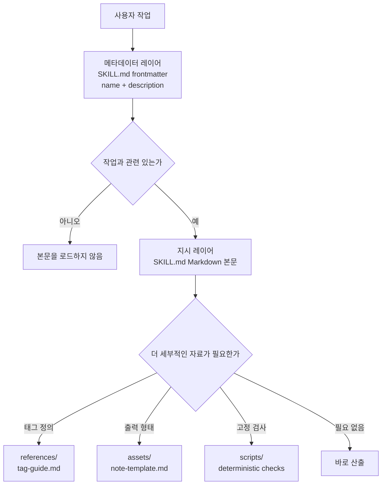

# 제3강: 점진적 공개와 리소스 계층화

> 이번 강의 목표:
> - Skill이 모든 자료를 `SKILL.md`에 욱여넣으면 안 되는 이유를 설명합니다.
> - 메타데이터 레이어, 지시 레이어, 리소스 레이어의 역할을 구분합니다.
> - 자료가 긴 Skill을 위해 온디맨드 로딩 구조를 그립니다.
>
> 선수 조건: 최소 `SKILL.md`의 `name`, `description`, 본문을 쓸 수 있어야 합니다 | 이전 [<< 02](./02-skill-metadata.md) | 다음 [04 >>](./04-resources-and-boundaries.md)

## Skill 진입점은 자료 캐비닛이 아닙니다

인터뷰 노트 Skill은 처음에 지시 몇 줄뿐이었지만, 나중에 태그 설명, 예시 노트, 어조 규칙, 품질 검사가 계속 추가됐습니다. 매 작업마다 이 내용을 모두 읽어야 한다면 진입 파일은 자료 캐비닛이 됩니다. Agent가 원래 먼저 판단해야 하는 것은 "이것이 인터뷰 노트 작업인가"입니다.

공개 스펙과 공식 설명은 Skill을 `SKILL.md`, 지시문, 스크립트, 리소스를 갖춘 디렉터리로 설명하고, 점진적 공개(progressive disclosure)로 컨텍스트를 관리한다고 강조합니다.[^S1][^S3] 즉, 진입점, 실행 규칙, 가끔만 쓰는 세부 사항을 따로 배치해야 합니다.

## 설명

### 첫 번째 레이어: 메타데이터 레이어

메타데이터 레이어는 `SKILL.md` 맨 위의 frontmatter, 특히 `name`과 `description`입니다. 파일 캐비닛 겉면의 라벨과 같습니다. 짧고, 안정적이고, Agent가 이 캐비닛을 열지 판단하게 돕습니다. 스펙은 `SKILL.md`가 먼저 YAML frontmatter, 그다음 Markdown 본문을 가져야 한다고 요구합니다. 이전 강의에서 `name`과 `description`의 형식을 이미 다뤘습니다.[^S2]

이 레이어에 동작 세부 사항을 넣지 마세요. 예를 들어 인터뷰 노트 Skill의 `description`에는 "고객 인터뷰 transcript를 원발언 증거가 담긴 중국어 노트로 변환한다"고 쓸 수 있지만, "모든 태그 정의, 다섯 가지 고객 유형, 세 개의 예시"를 욱여넣어서는 안 됩니다. 메타데이터 레이어의 목표는 관련 작업에 매칭되는 것입니다.

### 두 번째 레이어: 지시 레이어

지시 레이어는 `SKILL.md` frontmatter 뒤의 Markdown 본문입니다. Agent에게 작업을 받은 후 무엇을 먼저 하고, 무엇을 출력하고, 어떤 경계를 넘으면 안 되는지를 알려 줍니다. Agent가 한 번 읽고 바로 작업을 시작할 수 있을 만큼 짧아야 합니다.

인터뷰 노트 예시에서 본문은 이렇게 쓸 수 있습니다. transcript를 읽고, 주제, 원발언, 미해결 질문을 추출하고, 중국어 Markdown으로 출력하고, 원본 파일을 수정하지 않습니다. 본문은 더 깊은 자료를 가리킬 수도 있습니다. "태그 정의가 필요하면 `references/tag-guide.md`를 읽는다." 이 문장이 지시 레이어에서 리소스 레이어로 통하는 문입니다.

### 세 번째 레이어: 리소스 레이어

리소스 레이어는 공개 스펙이 약속한 `references/`, `assets/`, `scripts/`를 사용합니다. 매번 반드시 읽어야 하는 것은 아닙니다. Agent는 작업에 어떤 세부 사항이 필요할 때만 해당 리소스로 들어갑니다. 클라이언트마다 발견과 로딩의 세부 방식이 다를 수 있으므로, 이 코스는 공개된 파일 구조에만 의존하고 모든 구현이 같은 날부 전략을 쓴다고 가정하지 않습니다.[^S2][^S4]

리소스 레이어는 긴 자료에 적합합니다. 인터뷰 태그 설명, 예시 노트, 스타일 가이드, 빈 템플릿, 고정 검사 스크립트입니다. 자료는 여전히 디렉터리 안에 있지만, 진입점에는 현재 작업이 반드시 읽어야 하는 내용만 남깁니다.

### 네 번째 레이어: 온디맨드 로딩

온디맨드 로딩은 먼저 최소 정보로 관련성을 판단하고, 작업에 필요할 때만 더 깊은 자료를 읽는 것을 말합니다. 점진적 공개가 Skill 디렉터리 안에서 실제 동작으로 나타난 것입니다. 공식 설명은 점진적 공개를 Skill이 컨텍스트를 관리하는 핵심 아이디어 중 하나로 꼽습니다.[^S3]

계층을 아래 경로로 생각할 수 있습니다. 그림에서 가장 중요한 것은 화살표 방향입니다. Agent는 바깥을 먼저 보고, 작업에 필요할 때만 아래로 날아갑니다.



```agentmentor-order
{
  "id": "agent-skills-reuse-progressive-disclosure-order",
  "label": "로딩 순서 배열하기",
  "prompt": "인터뷰 노트 Skill이 작업을 받은 후, 아래 네 단계의 더 합리적인 읽기 순서는 무엇입니까?",
  "whyHere": "많은 초보자가 모든 리소스를 먼저 다 읽고 나서야 작업 관련성을 판단합니다. 이 정렬 문제는 온디맨드 로딩의 방향이 정말 자리 잡혔는지 확인합니다.",
  "copyPurpose": "Agent에게 내가 Skill의 메타데이터, 본문, 리소스 읽기 순서를 뒤섞지 않았는지 검사하게 합니다.",
  "items": [
    {
      "id": "metadata",
      "text": "`description`으로 이 사용자 작업이 인터뷰 노트 작업처럼 보이는지 판단한다"
    },
    {
      "id": "instructions",
      "text": "`SKILL.md` 본문을 읽고 입력, 출력, 처리하지 않음 경계를 확인한다"
    },
    {
      "id": "need",
      "text": "이번 작업에 태그 정의, 템플릿, 예시가 필요한지 판단한다"
    },
    {
      "id": "resource",
      "text": "이번 작업에 필요한 `references/` 또는 `assets/` 파일만 읽는다"
    }
  ],
  "correctOrder": ["metadata", "instructions", "need", "resource"],
  "feedback": "순서가 맞습니다. 먼저 메타데이터로 관련성을 판단하고, 그다음 지시문을 읽고, 마지막으로 작업 필요에 따라 리소스 레이어로 들어갑니다.",
  "feedbackWrong": "첫 번째 역전 지점을 찾아 보세요. 작업 관련성을 판단하기 전에 리소스를 읽으면 진입 레이어의 필터 역할이 사라지고, 본문을 읽기 전에 템플릿을 읽으면 처리하지 않음 경계를 놓치기 쉽습니다."
}
```

이번 강의 용어:

- 메타데이터 레이어: `SKILL.md` frontmatter에서 Agent가 Skill을 발견하게 돕는 짧은 정보.
- 지시 레이어: `SKILL.md` 본문에서 Agent의 작업 실행을 안내하는 핵심 규칙.
- 리소스 레이어: 긴 참고 자료, 템플릿, 에셋, 스크립트를 두는 디렉터리.
- 온디맨드 로딩: 작업에 어떤 세부 사항이 필요할 때만 해당 깊은 자료를 읽는 방식.

## 완성 예시: 공개 인터뷰 노트 Skill의 세 레이어 디렉터리

공개적이고 가상적인 `interview-notes` Skill을 만든다고 가정해 보겠습니다. 사용자가 직접 제공하는 인터뷰 transcript만 처리하며, 실제 고객의 개인 정보는 전혀 포함하지 않습니다. 손에 세 종류의 자료가 있습니다:

```text
1. 작업 경계: transcript를 정리해 중국어 노트를 출력하고, 원문을 수정하지 않습니다.
2. 태그 정의: pain-point, workaround, buying-signal의 설명.
3. 출력 스타일: 노트 제목, 원발언 증거, 미해결 질문의 레이아웃 템플릿.
```

첫 번째 단계, 디렉터리 이름과 진입점을 만듭니다:

```text
interview-notes/
  SKILL.md
```

두 번째 단계, 메타데이터 레이어를 짧게 씁니다:

```markdown
---
name: interview-notes
description: Turns user-provided interview transcripts into Chinese Markdown notes with quoted evidence, themes, and open questions. Use when summarizing interviews, research calls, or transcript notes.
---
```

이 부분은 "열어야 하는가"만 책임집니다. 각 태그를 설명하지도, 전체 템플릿을 넣지도 않았습니다.

세 번째 단계, 지시 레이어를 실행 가능한 규칙으로 씁니다:

```markdown
# Interview Notes

## Instructions

Use this skill when the user provides interview transcripts or research call notes.

Return Chinese Markdown with:

- short summary
- quoted evidence
- recurring themes
- open questions

Do not modify the original transcript or invent missing quotes.

If the user asks for structured labels, read `references/tag-guide.md`.
If the user asks for a fixed note shape, read `assets/note-template.md`.
```

네 번째 단계, 리소스를 배치합니다:

```text
interview-notes/
  SKILL.md
  references/
    tag-guide.md
  assets/
    note-template.md
```

이 구조의 장점은 일반적인 요약 작업이 진입점과 본문만 읽으면 된다는 것입니다. 사용자가 "태그별로 분류해 줘" 또는 "고정 형식으로 출력해 줘"라고 요청할 때만 Agent가 해당 리소스로 들어갑니다. 리소스가 사라진 것이 아니라 진입 본문에서 적절한 위치로 물러난 것입니다.

## 반쯤 완성된 예시: 긴 진입점을 세 레이어로 분해하기

아래 `SKILL.md` 초안은 모든 내용을 진입점에 욱여넣었습니다. 세 개의 "어디로 옮길까" 판단을 완성해 보세요.

```markdown
---
name: interview-notes
description: Summarizes interviews.
---

# Interview Notes

## Instructions

Read transcript files and write Chinese notes with quotes.

## Tag Definitions

pain-point = 用户反复提到的具体阻碍……
workaround = 用户为了绕开阻碍做出的临时办法……
buying-signal = 用户主动询问价格、部署或采购流程……

## Note Template

# 访谈纪要
## 摘要
## 原话证据
## 开放问题
```

완성할 부분:

```text
메타데이터 레이어는 이렇게 바꿔야 합니다: ________________________________.
지시 레이어는 이것을 유지해야 합니다: ________________________________.
리소스 레이어로 분리해야 할 것: ________________________________.
```

참고 답안:

```text
메타데이터 레이어는 이렇게 바꿔야 합니다: 더 구체적인 description. 예를 들어 입력이 interview transcripts이고 출력이 원발언 증거와 주제가 담긴 중국어 노트임을 설명하고, Use when summarizing interviews 또는 research calls를 명시합니다.
지시 레이어는 이것을 유지해야 합니다: transcript 읽기, 중국어 노트 출력, 원발언 유지, 증거를 날조하지 않기, 그리고 태그나 고정 형식이 필요할 때 어느 리소스 파일을 읽는지.
리소스 레이어로 분리해야 할 것: `references/tag-guide.md`에 태그 정의를, `assets/note-template.md`에 노트 템플릿을 둡니다.
```

핵심 판단은 진입 본문에 실행에 반드시 필요한 규칙만 남기고, 가끔만 쓰는 긴 자료는 가리킬 수 있는 위치로 옮기는 것입니다. 단순히 글자 수를 줄이는 것은 의미가 없습니다.

<!-- exercises -->
## 연습 문제

### Level 1 (워밍업)

이전 강의에서 쓴 연습용 Skill을 꺼내, 종이나 초안 Markdown에 메타데이터 레이어, 지시 레이어, 리소스 레이어의 세 레이어 구조를 그려 보세요. 아직 `references/`나 `assets/`를 만들지 않았더라도 "앞으로 어떤 내용이 들어갈지"를 써야 합니다.

방법: 먼저 당신의 `description`을 복사해 메타데이터 레이어로 표시합니다. 그다음 본문의 핵심 규칙 3~6줄을 복사해 지시 레이어로 표시합니다. 마지막으로 "진입점에서 길게 펼치면 안 되지만 작업에서 쓸 수 있는" 자료 2~4개를 나열합니다.
<!-- rubric -->
- 세 레이어가 모두 있고, 각 레이어에 최소 하나의 구체적인 항목이 있습니다.
- 메타데이터 레이어에 긴 동작 절차를 넣지 않았습니다.
- 지시 레이어가 일반적인 작업 한 번을 독립적으로 안내할 수 있습니다.
- 리소스 레이어의 각 항목이 "언제 읽어야 하는지"를 설명할 수 있습니다.
<!-- answer -->
합격 답안의 예: `description`은 메타데이터 레이어에 속하고, "transcript 읽기, 중국어 노트 출력, 원문 수정 금지"는 지시 레이어에 속하고, "태그 정의, 전체 출력 템플릿, 예시 노트"는 리소스 레이어에 속합니다. 흔한 실수는 모든 자료를 "지시"라고 부르는 것인데, 그러면 Agent가 매번 반드시 읽는 것과 가끔만 읽는 것을 구분할 수 없습니다.
<!-- hint -->
먼저 물어보세요. Agent가 Skill을 로드할지 판단할 때 이 정보가 필요한가요?
<!-- hint -->
다시 물어보세요. 일반 작업이 매번 이 정보를 반드시 읽어야 하나요? 아니라면 대개 리소스 레이어에 속합니다.

### Level 2 (심화)

공개적이고 가상적인 인터뷰 노트 Skill의 디렉터리 트리와 `SKILL.md` 본문 일부를 작성하세요. 본문에 최소 두 문장의 "필요할 때 어떤 리소스를 읽는다"는 안내 문장이 있어야 합니다.

방법: 자신의 연습 디렉터리나 초안 파일에 디렉터리 트리를 쓰되, 실제 인터뷰 내용은 넣지 마세요. 디렉터리 트리는 최소한 `SKILL.md`, `references/` 파일 하나, `assets/` 파일 하나를 포함합니다. 본문 일부에는 핵심 규칙과 리소스 안낼만 씁니다.
<!-- rubric -->
- 디렉터리 트리의 리소스 파일명에서 용도를 알 수 있습니다.
- `SKILL.md` 본문이 긴 태그 정의나 전체 템플릿을 복사하지 않았습니다.
- 최소 두 개의 리소스 안내 문장이 서로 다른 트리거 조건에 대응합니다.
- 실제 고객, 회사, 개인 인터뷰 내용을 사용하지 않았습니다.
<!-- answer -->
합격 구조의 한 예: `references/tag-guide.md`에 태그 설명을, `assets/note-template.md`에 출력 골격을 둡니다. 본문에는 "사용자가 태그별 분류를 요청하면 `references/tag-guide.md`를 읽고, 사용자가 고정 노트 형식을 요청하면 `assets/note-template.md`를 읽는다"고 씁니다. 흔한 실수는 `assets/note-template.md`의 전체 내용을 `SKILL.md`에 복사하는 것입니다. 그러면 디렉터리는 존재하지만 실제로 계층화되지 않은 것입니다.
<!-- hint -->
리소스 파일명은 `tag-guide.md`, `note-template.md`처럼 수수핼 수 있습니다.
<!-- hint -->
리소스 안내 문장은 "사용자가 ...를 요청하면" 또는 "작업에 ...가 필요할 때"로 시작할 수 있습니다.
<!-- /exercises -->

## 가져갈 것: 진입점이 얇아진 다음

진입점에 발견 정보와 핵심 규칙만 남으면, 태그 설명, 예시, 템플릿은 필요할 때 읽을 수 있습니다. 다음 강의는 이 리소스들 사이의 분업을 다룹니다. 어떤 내용이 Agent가 읽기 위한 것인지, 어떤 내용이 복사하기 위한 것인지, 어떤 내용이 고정 스크립트에 맡기기에 적합한지를 살펴홉니다.
