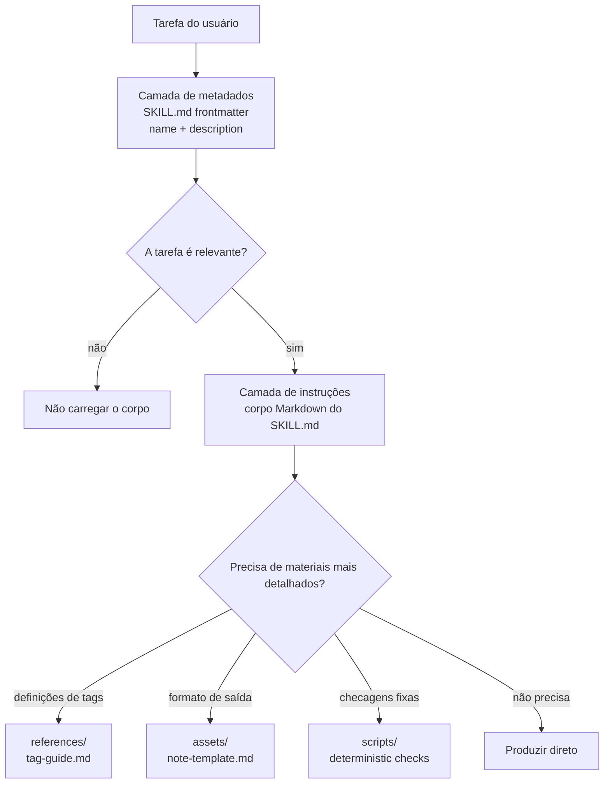

# Lição 3: Progressive disclosure e camadas de recursos

> Objetivos desta lição:
> - Explicar por que um Skill não deve enfiar todos os materiais dentro do `SKILL.md`.
> - Distinguir as responsabilidades da camada de metadados, da camada de instruções e da camada de recursos.
> - Desenhar uma estrutura de carregamento sob demanda para um Skill com materiais longos.
>
> Pré-requisito: saber escrever o `name`, a `description` e o corpo de um `SKILL.md` mínimo | lição anterior [<< 02](./02-skill-metadata.md) | próxima lição [04 >>](./04-resources-and-boundaries.md)

## A entrada do seu Skill não deve parecer um armário de arquivos

O Skill de ata de entrevista começou com poucas instruções; depois ganhou explicações de tags, exemplos de atas, regras de tom e checagens de qualidade. Se toda tarefa exige ler tudo isso, o arquivo de entrada vira um armário de arquivos. O Agent, na verdade, só precisava primeiro julgar "isto é uma tarefa de ata de entrevista?".

A especificação pública e a documentação oficial descrevem o Skill como um diretório com `SKILL.md`, instruções, scripts e recursos, e enfatizam o uso de progressive disclosure para gerenciar contexto.[^S1][^S3] Isso significa que entrada, regras de execução e detalhes usados só de vez em quando devem ficar em lugares separados.

## Explicação

### Primeira camada: camada de metadados

A camada de metadados é o frontmatter no topo do `SKILL.md`, sobretudo `name` e `description`. Ela funciona como a etiqueta na parte de fora do armário: curta, estável, ajudando o Agent a decidir se abre aquela gaveta. A especificação exige que o `SKILL.md` comece com YAML frontmatter seguido do corpo Markdown; a lição anterior já cobriu o formato de `name` e `description`.[^S2]

Não coloque detalhes operacionais nesta camada. Por exemplo, a `description` do Skill de ata de entrevista pode dizer "transforma transcripts de entrevistas com clientes em atas em chinês com evidências em fala literal", mas não deve carregar "todas as definições de tags, cinco tipos de cliente e três exemplos". O objetivo da camada de metadados é acertar as tarefas relevantes.

### Segunda camada: camada de instruções

A camada de instruções é o corpo Markdown depois do frontmatter do `SKILL.md`. Ela diz ao Agent: ao receber a tarefa, o que fazer primeiro, o que entregar e quais limites não cruzar. Deve ser curta o suficiente para que o Agent leia de uma vez e comece a trabalhar.

No exemplo da ata de entrevista, o corpo pode dizer: ler o transcript; extrair temas, falas literais e perguntas abertas; produzir Markdown em chinês; não modificar o arquivo original. O corpo também pode apontar para materiais mais profundos: "se precisar das definições de tags, leia `references/tag-guide.md`." Essa frase é a porta que leva da camada de instruções à camada de recursos.

### Terceira camada: camada de recursos

A camada de recursos usa os diretórios `references/`, `assets/` e `scripts/` convencionados pela especificação aberta. Eles não precisam ser lidos toda vez. O Agent só entra no recurso correspondente quando a tarefa pede aquele tipo de detalhe. Clientes diferentes podem diferir nos detalhes de descoberta e carregamento, então este curso depende apenas da estrutura pública de arquivos, sem presumir que todas as implementações adotam a mesma estratégia interna.[^S2][^S4]

A camada de recursos é o lugar dos materiais longos: explicações de tags de entrevista, exemplos de atas, diretrizes de estilo, templates em branco, scripts de checagem fixos. Os materiais continuam no diretório, mas a entrada mantém apenas o que a tarefa atual precisa ler.

### Quarta camada: carregamento sob demanda

Carregamento sob demanda significa: primeiro julgar relevância com o mínimo de informação, depois ler materiais mais profundos quando a tarefa pedir. É a ação concreta do progressive disclosure dentro do diretório do Skill. A documentação oficial apresenta progressive disclosure como uma das ideias centrais do Skill para gerenciar contexto.[^S3]

Você pode imaginar as camadas como o caminho abaixo. O mais importante na figura é a direção das setas: o Agent olha primeiro a camada externa e só desce quando a tarefa exige.



```agentmentor-order
{
  "id": "agent-skills-reuse-progressive-disclosure-order",
  "label": "Ordenar a sequência de leitura",
  "prompt": "Quando um Skill de ata de entrevista recebe uma tarefa, qual é a ordem de leitura mais razoável entre os quatro passos abaixo?",
  "whyHere": "Muitos iniciantes leem cada recurso antes de julgar se a tarefa é relevante; esta ordenação verifica se a direção do carregamento sob demanda foi realmente absorvida.",
  "copyPurpose": "Pedir ao Agent que verifique se estou misturando a ordem de leitura de metadados, corpo e recursos do Skill.",
  "items": [
    {
      "id": "metadata",
      "text": "Usar a `description` para julgar se esta tarefa do usuário parece uma tarefa de ata de entrevista"
    },
    {
      "id": "instructions",
      "text": "Ler o corpo do `SKILL.md`, confirmando entrada, saída e os limites do que não tratar"
    },
    {
      "id": "need",
      "text": "Julgar se esta tarefa precisa de definições de tags, templates ou exemplos"
    },
    {
      "id": "resource",
      "text": "Ler apenas os arquivos de `references/` ou `assets/` de que esta tarefa precisa"
    }
  ],
  "correctOrder": ["metadata", "instructions", "need", "resource"],
  "feedback": "Ordem correta: primeiro use os metadados para julgar relevância, depois leia as instruções e só então entre na camada de recursos conforme a necessidade da tarefa.",
  "feedbackWrong": "Procure o primeiro ponto de inversão: se você lê recursos antes de julgar a relevância da tarefa, a camada de entrada perde a função de filtro; se lê o template antes de ler o corpo, também fica fácil ignorar os limites do que não tratar."
}
```

Glossário desta lição:

- Camada de metadados: as informações curtas no frontmatter do `SKILL.md` que ajudam o Agent a descobrir o Skill.
- Camada de instruções: as regras centrais no corpo do `SKILL.md` que orientam o Agent na execução da tarefa.
- Camada de recursos: os diretórios que guardam materiais longos de referência, templates, insumos ou scripts.
- Carregamento sob demanda: ler materiais mais profundos apenas quando a tarefa precisa daquele tipo de detalhe.

## Exemplo completo: o diretório de três camadas de um Skill público de ata de entrevista

Suponha que você queira construir um Skill `interview-notes` público e fictício. Ele só trata transcripts de entrevista fornecidos pelo próprio usuário e não contém nenhuma informação privada de clientes reais. Você tem três tipos de materiais em mãos:

```text
1. Limite da tarefa: organizar o transcript, produzir ata em chinês, não alterar o original.
2. Definições de tags: explicações de pain-point, workaround, buying-signal.
3. Formato de saída: template de diagramação com título da ata, evidências em fala literal e perguntas abertas.
```

Primeiro passo: garantir que o nome do diretório e a entrada existam:

```text
interview-notes/
  SKILL.md
```

Segundo passo: escrever a camada de metadados curta:

```markdown
---
name: interview-notes
description: Turns user-provided interview transcripts into Chinese Markdown notes with quoted evidence, themes, and open questions. Use when summarizing interviews, research calls, or transcript notes.
---
```

Esse trecho só responde por "devo abrir?". Ele não explica cada tag nem embute o template completo.

Terceiro passo: escrever a camada de instruções como regras executáveis:

```markdown
# Interview Notes

## Instructions

Use this skill when the user provides interview transcripts or research call notes.

Return Chinese Markdown with:

- short summary
- quoted evidence
- recurring themes
- open questions

Do not modify the original transcript or invent missing quotes.

If the user asks for structured labels, read `references/tag-guide.md`.
If the user asks for a fixed note shape, read `assets/note-template.md`.
```

Quarto passo: só então posicionar os recursos:

```text
interview-notes/
  SKILL.md
  references/
    tag-guide.md
  assets/
    note-template.md
```

A vantagem dessa estrutura: uma tarefa comum de resumo só precisa ler a entrada e o corpo; somente quando o usuário pede "classifique por tags" ou "produza no formato fixo" o Agent entra no recurso correspondente. Os recursos não sumiram — apenas recuaram da entrada para o lugar adequado.

## Exemplo semicompleto: dividir uma entrada longa em três camadas

O rascunho de `SKILL.md` abaixo enfia tudo na entrada. Complete os três julgamentos de "para onde mover".

```markdown
---
name: interview-notes
description: Summarizes interviews.
---

# Interview Notes

## Instructions

Read transcript files and write Chinese notes with quotes.

## Tag Definitions

pain-point = 用户反复提到的具体阻碍……
workaround = 用户为了绕开阻碍做出的临时办法……
buying-signal = 用户主动询问价格、部署或采购流程……

## Note Template

# 访谈纪要
## 摘要
## 原话证据
## 开放问题
```

Complete:

```text
A camada de metadados deve virar: ________________________________.
A camada de instruções deve manter: ________________________________.
A camada de recursos deve separar: ________________________________.
```

Resposta de referência:

```text
A camada de metadados deve virar: uma description mais específica, por exemplo dizendo que a entrada é interview transcripts, a saída é uma ata em chinês com evidências em fala literal e temas, e declarando Use when summarizing interviews ou research calls.
A camada de instruções deve manter: ler o transcript, produzir a ata em chinês, preservar as falas literais, não inventar evidências, e qual arquivo de recurso ler quando tags ou formato fixo forem necessários.
A camada de recursos deve separar: `references/tag-guide.md` para as definições de tags e `assets/note-template.md` para o template da ata.
```

O julgamento-chave é deixar no corpo da entrada apenas as regras necessárias à execução, movendo os materiais longos usados ocasionalmente para posições que possam ser apontadas. Buscar texto curto pela contagem de palavras, sozinho, não faz sentido.

<!-- exercises -->
## Exercícios

### Level 1 (Aquecimento)

Pegue o Skill de prática que você escreveu na lição anterior e desenhe, no papel ou em um Markdown de rascunho, a estrutura de três camadas: camada de metadados, camada de instruções, camada de recursos. Mesmo que você ainda não tenha criado `references/` ou `assets/`, escreva "que conteúdo entrará ali no futuro".

Como fazer: primeiro copie a sua `description` e marque-a como camada de metadados; depois copie de 3 a 6 regras centrais do corpo e marque-as como camada de instruções; por fim liste de 2 a 4 materiais que "não devem se alongar na entrada, mas a tarefa pode vir a usar".
<!-- rubric -->
- As três camadas existem, e cada uma tem pelo menos um item concreto.
- A camada de metadados não contém passos operacionais longos.
- A camada de instruções consegue guiar sozinha uma tarefa comum.
- Cada item da camada de recursos diz "quando precisa ser lido".
<!-- answer -->
Exemplo de resposta aceitável: a `description` pertence à camada de metadados; "ler o transcript, produzir a ata em chinês, não modificar o original" pertence à camada de instruções; "definições de tags, template completo de saída, exemplos de atas" pertencem à camada de recursos. Um erro comum é chamar tudo de "instrução", o que impede o Agent de distinguir o que é leitura obrigatória de toda vez do que é leitura ocasional.
<!-- hint -->
Pergunte primeiro: o Agent precisa desta informação para decidir se carrega o Skill?
<!-- hint -->
Depois pergunte: uma tarefa comum precisa ler esta informação toda vez? Se não, ela provavelmente pertence à camada de recursos.

### Level 2 (Avançado)

Para um Skill público e fictício de ata de entrevista, escreva a árvore de diretórios e um trecho do corpo do `SKILL.md`. Exigência: o corpo deve ter pelo menos duas frases de apontamento do tipo "quando precisar, leia determinado recurso".

Como fazer: escreva a árvore de diretórios no seu diretório de prática ou em um arquivo de rascunho, sem conteúdo real de entrevistas. A árvore deve conter pelo menos `SKILL.md`, um arquivo em `references/` e um arquivo em `assets/`. O trecho do corpo traz apenas as regras centrais e os apontamentos de recursos.
<!-- rubric -->
- Os nomes dos arquivos de recurso na árvore deixam seu propósito visível.
- O corpo do `SKILL.md` não copia definições longas de tags nem o template completo.
- Pelo menos duas frases de apontamento de recursos correspondem a condições de gatilho diferentes.
- Nenhum conteúdo real de clientes, empresas ou entrevistas privadas foi usado.
<!-- answer -->
Uma estrutura aceitável é: `references/tag-guide.md` com as explicações de tags e `assets/note-template.md` com o esqueleto de saída. O corpo diz "se o usuário pedir classificação por tags, leia `references/tag-guide.md`; se o usuário pedir formato fixo de ata, leia `assets/note-template.md`." Um erro comum é copiar todo o conteúdo de `assets/note-template.md` para dentro do `SKILL.md` — assim o diretório existe, mas não houve camadas de verdade.
<!-- hint -->
Os nomes dos arquivos de recurso podem ser simples, como `tag-guide.md` e `note-template.md`.
<!-- hint -->
As frases de apontamento podem começar com "se o usuário pedir..." ou "quando a tarefa precisar...".
<!-- /exercises -->

## Para levar: depois que a entrada emagrece

Quando a entrada mantém apenas informações de descoberta e regras centrais, explicações de tags, exemplos e templates podem ser lidos quando necessário. A próxima lição continua olhando a divisão de trabalho entre esses recursos: quais conteúdos são para o Agent ler, quais são para ele copiar e quais devem ficar com scripts fixos.
