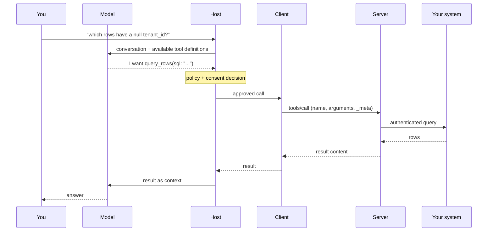

# Lesson 2: Host, client, and server

> Lesson objectives:
> - Name the three components in the architecture and state what each one owns.
> - Explain why one client talks to exactly one server, and what that buys you.
> - Predict what a given server can and cannot see about your conversation.
> - Trace one tool call from the model's decision to the returned result, naming the component at each hop.
> - Say where credentials live and why they do not live in the model's context.
>
> Prerequisites: Lesson 1 — you can tell a reach problem from a knowledge problem | Previous [<< 01](./01-tools-and-skills.md) | Next [03 >>](./03-the-stateless-core.md)

## You connected two servers, and now you want to know what they know

You added a server for your issue tracker and one for your database. The agent is doing useful work with both. Then a colleague asks the question you cannot answer: *does the database server see the tickets?* And a worse one: *does either of them see the rest of what I typed in this conversation?*

If your mental model is "the agent has some tools now," you have no way to answer. That model has one box in it, and the question is about a boundary inside the box.

This lesson replaces it with the real shape, which has three roles and a specific rule about what crosses between them. The answer to your colleague's question is a design principle written into the specification, and it is the load-bearing guarantee for everything you will decide in Lesson 6.

## Explanation

### Three roles, not two

The specification names the shape in one sentence: "The Model Context Protocol (MCP) follows a client-host-server architecture where each host can run multiple client instances."[^S4]

Three roles, and the middle one is the one people miss.

The **host** is the application you are actually using — the coding agent, the desktop app, the IDE extension. It holds the conversation, talks to the model, and, in the specification's own list, "Controls client connection permissions and lifecycle," "Enforces security policies and consent requirements," and "Handles user authorization decisions."[^S4] Consent lives here. Remember that; Lesson 6 is built on it.

A **client** is a connector the host creates, one per server. It is not a user-facing thing and you will rarely name one. Its job is to "Attach protocol version and capabilities to every request," route messages, and "Maintain security boundaries between servers."[^S4]

A **server** is the thing that reaches your system: it exposes "resources, tools and prompts via MCP primitives," operates "independently with focused responsibilities," and "Can be local processes or remote services."[^S4]

### One client, one server — and why that is the point

The rule is exact: "Each client is created by the host and communicates with exactly one server," and "A host application creates and manages multiple clients, with each client having a 1:1 relationship with a particular server."[^S4]

That could have been designed the other way — one connector multiplexing to everything. It was not, and the reason is the isolation property. Because every server sits behind its own client, the host can attach a different policy, a different set of credentials, and a different approval state to each one. Two servers connected to the same host are not connected to each other.

So: your database server does not see your issue tracker. Structurally, not by convention.

### What a server cannot see

Here is the answer to the harder question, quoted in full because the wording matters. The specification's third design principle is titled "Servers should not be able to read the whole conversation, nor 'see into' other servers," and it lists:[^S4]

- "Servers receive only necessary contextual information"
- "Full conversation history stays with the host"
- "Each server maintains isolation"
- "Cross-server interactions are controlled by the host"
- "Host process enforces security boundaries"

Read what that does and does not promise. A server sees the arguments of the calls made to it — nothing else about your session by default. It does not receive your conversation, your other servers' results, or your files.

But notice the shape of the promise: it is a property of the *architecture*, enforced by the host. It says nothing about what the server does with the arguments it does receive, and nothing about what a server can put *into* the conversation on the way back. That return path is the injection surface, and it is Lesson 6's subject.

### Where the credentials are

Follow the token. When you connect a server to a database, something must hold the database credential. That something is the server — on its own side of the wall, in its own environment or its own OAuth grant.

The model never sees it. The model sees a tool named `query_rows` with a description and an input schema, and it emits a call. Between that call and the database sits a process holding a secret the model has no access to.

This is the structural argument for a server over pasting: it is not only more convenient, it moves the credential out of the context window entirely. Which is why the reverse — putting a token into a tool argument, or into a prompt — throws away the main safety property you just bought.

**A security note, since this is where secrets first appear.** Credentials belong in the server's environment or in the host's own credential store, never in a committed configuration file and never typed into a chat window. Anything you type into the conversation is in the model's context and may be logged; anything committed to a repository is in the repository forever. If a server's setup instructions tell you to paste a long-lived token into a file you will commit, that is a finding, not a step.

### One call, end to end

Here is the actual path a tool call takes. What the diagram is for: showing that the model never touches the server, and that two hops in the middle are where all the control lives.



Three things to take from the trace. The model *requests* a call and does not make one — it emits an intent that the host may refuse. The host is the only component that sees both the conversation and the call, which is exactly why consent belongs there. And the server's view of the world is one arrow wide: the arguments it was handed.

### Capabilities: what each side admits to supporting

The last piece is how two sides agree on what is possible. MCP "uses a capability-based negotiation system where clients and servers declare their supported features on each request."[^S4]

As of the 2026-07-28 specification, that declaration is per-request rather than per-connection: clients include capabilities in `_meta.io.modelcontextprotocol/clientCapabilities` on every request, and "Servers advertise their capabilities in response to `server/discover`, which clients may call before any other request."[^S4] Tools are one such capability — "Tool invocation requires the server to declare tool capabilities."[^S4]

The practical consequence for you: a feature exists for a given pair only if both sides declared it. When a server's documentation promises something your client does not do, nothing errors interestingly — the feature is simply absent. That is **graceful degradation** working as designed, and Lesson 5 shows the version of it that bites hardest.

One caution about what these declarations are worth. Alongside capabilities, each side sends a name and version for itself. That is **self-reported identity**, and the specification is clear that it "is not verified by the protocol" and should not drive "security decisions."[^S5] It is for display and debugging. A server that decides what to expose based on the client name it was handed is trusting a string the caller chose.

```agentmentor-hotspot
{
  "id": "agent-tools-mcp-architecture-consent-node",
  "label": "Point at the component that can refuse a call",
  "prompt": "The model has just emitted a request to call a destructive tool. Exactly one component in this path is positioned to stop it before your system is touched. Click that component.",
  "whyHere": "Readers who came in with a two-box model ('the agent and the tool') tend to locate refusal either in the model's own judgment or in the server's validation, and both of those beliefs produce a bad permission design in Lesson 6.",
  "copyPurpose": "Have the agent check whether I am counting on the model's restraint or the server's validation as my safety layer, instead of on the host's consent boundary.",
  "layout": "flow",
  "nodes": [
    { "id": "model", "label": "Model", "x": 10, "y": 30 },
    { "id": "host", "label": "Host", "x": 37, "y": 30 },
    { "id": "client", "label": "Client", "x": 64, "y": 30 },
    { "id": "server", "label": "Server", "x": 88, "y": 30 },
    { "id": "system", "label": "Your system", "x": 88, "y": 75 }
  ],
  "edges": [
    { "from": "model", "to": "host", "label": "requests call" },
    { "from": "host", "to": "client", "label": "approved" },
    { "from": "client", "to": "server", "label": "tools/call" },
    { "from": "server", "to": "system", "label": "authenticated" }
  ],
  "hotspots": [
    { "nodeId": "model", "correct": false, "feedback": "The model is the component that wants the call. It can be steered by a description, and it can be wrong about what a tool does — including when the description was written by someone hostile. A component that can be persuaded is not a control point." },
    { "nodeId": "host", "correct": true, "feedback": "The host is the only component that sees both the conversation and the pending call, and the specification assigns it exactly this job: it 'Enforces security policies and consent requirements' and 'Handles user authorization decisions.' Everything downstream has already been approved by the time it arrives." },
    { "nodeId": "client", "correct": false, "feedback": "The client routes and attaches protocol metadata, and it maintains boundaries between servers — but it is created by the host and acts on decisions the host already made. It is the courier, not the approver." },
    { "nodeId": "server", "correct": false, "feedback": "The server can and must validate its inputs, but it validates on behalf of itself, not on your behalf — and for a third-party server it is the party you are deciding whether to trust in the first place. Asking the server to be your permission boundary puts the decision on the wrong side of the wall." },
    { "nodeId": "system", "correct": false, "feedback": "By the time the request reaches your database or API, the call has already happened. Whatever controls exist there are real, but they are the last layer, not the consent boundary this course is asking about." }
  ]
}
```

## Worked example: answering the colleague's two questions

Setup: a host with two servers connected — `tracker` (your issue system, remote, OAuth) and `db` (a local process holding a read-only Postgres URL in its environment). You ask the agent to "find the ticket about the null tenant bug and check how many rows it affects."

**Does `db` see the tickets?** No. The host created two clients, each bound to one server. The tracker's result comes back to the host, and the host puts it into the model's context. If the model then calls `db`, `db` receives the arguments of that one call. If the model wrote a ticket ID into the SQL, `db` sees that string — because it was handed to it as an argument — but it has no path to the tracker and no idea one exists.

**Does either see the rest of the conversation?** No. "Full conversation history stays with the host."[^S4] The design principle is explicit that servers "receive only necessary contextual information."

**Where did the Postgres password go?** Into `db`'s environment, on your machine. It never entered the conversation, so it is not in the model's context and not in any transcript.

**Now the uncomfortable follow-up.** The ticket body — written by whoever filed the ticket — came back through the tracker server and was placed in the model's context. From there, the model composed a call to `db`. The isolation guarantee held perfectly, and content from one system still influenced a call to another, by passing through the model. That is not a violation of the principle; it is what the principle does not cover. Hold that thought for Lesson 6.

## Your turn: trace your own two-server call

Pick two systems you would connect, or have connected. Write the trace for one realistic request that touches both, filling in the blanks:

1. You ask: ________
2. The host sends the model: the conversation plus ________
3. The model requests: ________ on server A
4. The component that can refuse it: ________
5. Server A receives exactly: ________
6. Server A returns, and the host places it: ________
7. The model then requests: ________ on server B
8. Server B knows about server A: ________

Answers for steps 4, 6, and 8, since they are the ones with a right answer: the host; into the model's context; nothing. If you wrote something else for step 8, re-read the isolation principle above — and then ask yourself how the content in step 6 got into the decision in step 7, because that path is real.

<!-- exercises -->
## 💻 Exercises (point these at your own real environment)

### Level 1 (warm-up)
Open your agent client and list the MCP servers currently connected, along with the tools each one exposes. Most clients have a command for this; in Claude Code it is the `/mcp` panel, which "shows the tool count next to each connected server."[^S13] For each connected server, write down: where the server runs (your machine or someone else's), what credential it holds, and who wrote it.

If you have no servers connected, do this against a server you are considering — read its README and answer the same three questions from its documentation.

<!-- rubric -->
- Every connected server has all three fields filled: location, credential, author.
- The credential field names the actual mechanism (environment variable, OAuth grant, config file), not "it's authenticated."
- At least one server is identified as either "written by someone I don't know" or "written by us" — the distinction is stated, not left blank.
- You can state the total number of tools currently loaded across all servers.
<!-- answer -->
A completed row: "`github` — remote, someone else's infrastructure — OAuth grant I approved in a browser, scoped to repo read/write — written by GitHub." Another: "`db` — local process on my machine — read-only Postgres URL in the launch environment — written by us, 80 lines."

The row that should make you pause: a server running locally, holding a long-lived token, written by someone you cannot name. That is the configuration the security guidance singles out — local servers are "binaries that are downloaded and executed on the same machine as the MCP client," with the risk that "Attackers can execute any command with MCP client privileges."[^S7]

The tool count matters because it is the context cost from Lesson 1, now measured rather than estimated.
<!-- hint -->
If your client does not list servers in the UI, look for a config file — the location differs by client, but the entries name the command or URL for each server.
<!-- hint -->
For "what credential," find where the server gets its secret: a `--env` flag, an `env` block in config, or an OAuth flow you completed in a browser. If you cannot find it, that is itself the answer to write down.

### Level 2 (advanced)
Take the two servers from your trace above and write the isolation statement for your specific setup: one paragraph a colleague could read that states what each server can see, what it cannot, and what the residual path between them is. Then identify the one thing in your setup that the isolation guarantee does *not* protect, and say what you would do about it.

<!-- rubric -->
- The statement names both servers and says explicitly that neither can see the other's data or your conversation history.
- It cites where that guarantee comes from — an architectural property enforced by the host, not a promise made by the servers.
- It names the residual path: content returned by one server enters the model's context and can shape a call to the other.
- The "what I would do about it" is a concrete control, not "be careful."
<!-- answer -->
The first three parts are mechanical once you have the design principle. The fourth is the exercise.

The residual path, stated plainly: server A's output becomes model context, and the model composes server B's call. Nothing crossed between servers, and yet A's content reached B. If A returns attacker-influenced text — an issue body, a support ticket, a web page — then a call to B is now downstream of text you did not write.

Concrete controls people actually adopt: require approval for writes on the second server while leaving reads automatic; connect the untrusted-content server only in sessions that need it; or keep the two in separate sessions entirely so no single conversation holds both. "Be careful" is not one of them, because the control has to hold when you are not reading closely. Lesson 6 develops this into a rule you can apply per tool.

**Common mistake to avoid:** writing the isolation statement as if it were a promise the servers make to each other. It is not. Neither server knows the other exists, and neither is doing anything to maintain the boundary — the host is. Getting this backwards leads to trusting a server's own claims about its scope, which the specification specifically warns against for annotations and identity fields alike.[^S6]
<!-- hint -->
Start by writing the sentence "Neither server can see ______" three times with three different objects, then check each one against the design principle.
<!-- hint -->
For the residual path, follow one piece of text: pick something a server returns that a stranger could have written, and trace where it ends up.
<!-- /exercises -->

## The shape you can now draw

You can place four components in order, say which one holds the conversation, which one holds the credential, and which one is positioned to say no. You know that server isolation is architectural rather than negotiated, and you have found the one path it does not close.

Everything so far has been about *who* talks to whom. Lesson 3 is about *what they say* — specifically, what the 2026-07-28 revision guarantees about each request now that the protocol core has no memory between them. The change is large enough that instructions written a year ago describe a protocol that no longer exists.
