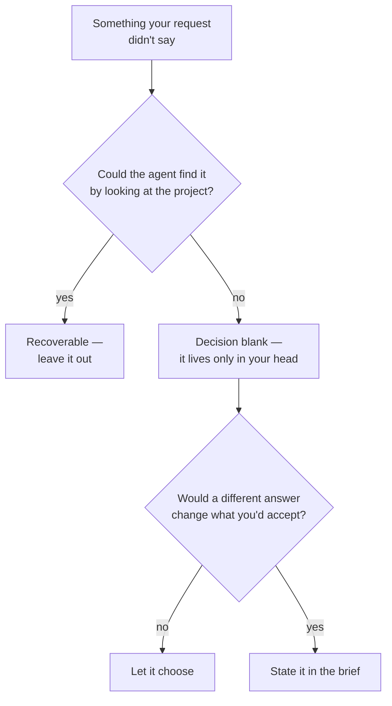

# Lesson 1: The Blanks in a Request

> Lesson objectives:
> - Locate the decisions a request leaves for the agent to invent.
> - Explain why those blanks are invisible to the person who wrote the request.
> - Separate a blank that is safe to leave open from one that decides the outcome.
>
> Prerequisites: You have watched an agent complete at least one task for you | Previous [<< Course contents](./README.md) | Next [02 >>](./02-why-agents-dont-ask.md)

## The run succeeded and the result is wrong

You asked for something. The agent worked for a while, reported that it was finished, and what came back is not what you had in mind. Nothing crashed. No step failed. The work is coherent, and it answers a request that is recognizably yours — just not the one you were holding in your head.

The instinct at this point is to blame the model, or to conclude that you need better phrasing. Both send you the wrong way. What actually happened is that your request contained a decision you never noticed you were making, the agent had to pick a value for it in order to act, and it picked one. Your version and its version were both consistent with the words you sent.

This lesson is about finding those decisions before you send the request, using a task of your own. The next four lessons are about what to write once you have found them.

## Explanation

### A request is a specification with holes in it

Start with a request small enough to hold in one line:

```text
"Add a loading state to the settings page."
```

Read it as a set of instructions someone has to execute. Where does it run out?

- Loading state for what — the whole page, or the one slow section?
- What does it look like — a spinner, a skeleton, a disabled form, the existing pattern from somewhere else?
- What about failure — does a request that never comes back show an error, or spin forever?
- Does it match the loading treatment already used elsewhere in this product, and if so, which one?

Four decisions. Your request specified none of them. You were not being careless; you had already answered all four in your head before you started typing, and answered questions do not feel like questions.

The research term for this is **underspecification**: information missing from a request that the person doing the work needs in order to succeed. The Ambig-SWE study, which built an underspecified variant of a standard software benchmark, uses a definition worth borrowing exactly — "missing information that would prevent an expert from being able to create a successful solution."[^S1] Note what that rules out. A request is not underspecified because it is short. It is underspecified when something is missing that a *competent* worker would still need.

That distinction matters because it stops you from over-writing. Half of what you might add to a request is detail a capable agent could find on its own. The other half is information that exists only in your head, and no amount of competence recovers it.

### Missing information is the normal case, not the sloppy case

If it helps to know that this is not a personal failing: a study that collected 1,000 real user instructions written against 100 real APIs, then had annotators classify what was wrong with the problematic ones, found that the dominant defect was missing information — "the most common issue in the instructions is 'Instructions Missing Key Information', with a significant 56.0% of all errors."[^S2] The next two categories, instructions containing wrong details and instructions asking for something the tools could not do, came in at 17.3% and 15.3%.[^S2]

So more than half of what goes wrong with real requests is a blank rather than a mistake. People do not usually say the wrong thing. They leave things out.

### Two kinds of blank, and only one of them matters

Not every unstated thing needs stating. Here is the split that decides where your effort goes:

- A **recoverable blank** is something the agent can determine by looking. Which file a function lives in, what the current version of a dependency is, how the existing tests are structured — this information exists in your project, and a competent agent will go and find it. Writing it out costs you time and buys little.
- A **decision blank** is a choice with more than one defensible answer, where the answer lives in your head or in a conversation the agent was not part of. Whether errors should be silent or loud. Whether "recent" means seven days or thirty. Whether this fix should be minimal or thorough.

GitHub's guidance for its coding agent makes the same cut from the other side, noting that the agent "has the ability to search your codebase, including semantic code search," and that "even if you don't specify exact file paths in a task, the agent can often discover the right code on its own."[^S8] That is the recoverable half being handled for you. It is precisely why the same page still asks you to supply "complete acceptance criteria on what a good solution looks like"[^S8] — because no amount of searching your codebase reveals a preference you never wrote down.

A test you can apply in one pass: **could the agent find this by looking?** If yes, leave it out. If no, it is a decision blank, and you either state it or it gets invented.



The diagram is a filter, not a checklist: most unstated things fall out at the first question, and the small set that survives both questions is what a brief is actually for.

### The colleague test

There is a faster version of all this, and it comes from Anthropic's prompting documentation as a stated rule: "Show your prompt to a colleague with minimal context on the task and ask them to follow it. If they'd be confused, Claude will be too."[^S4]

This works because it moves the request out of your head, where the blanks are pre-filled, and into someone else's, where they are visible. You do not need an actual colleague. Read your request as if a competent contractor received it on their first day, with access to your files and none of your history, and had to start work without asking you anything. The moment you catch yourself thinking "well, obviously they'd..." — that is a decision blank. "Obviously" is the sound the blank makes.

```agentmentor-check
{
  "id": "brief-an-agent-gap-recoverable-vs-decision",
  "label": "Separate recoverable from decision blanks",
  "prompt": "The request is: \"Clean up the error handling in the checkout flow.\" Four things it doesn't say. Which one is the decision blank you must write down, rather than something the agent can settle by looking?",
  "whyHere": "Readers who have just learned that requests have blanks tend to try to fill all of them, which produces bloated briefs and still misses the one that decides the outcome. This checks the filter, not the vocabulary.",
  "copyPurpose": "Have the agent check whether I'm padding my brief with details it could have found in my project, instead of writing down the choices only I can make.",
  "mode": "single",
  "choices": [
    {
      "id": "files",
      "text": "Which files the checkout flow spans",
      "correct": false,
      "feedback": "This is in the project already. An agent that can search the codebase will map the flow itself, so writing out the file list mostly costs you time — and if your list is stale, it actively misleads."
    },
    {
      "id": "existing-pattern",
      "text": "What the current error handling looks like",
      "correct": false,
      "feedback": "The agent reads this directly from the code, and reads it more accurately than you would recall it. Describing the current state is the most common way a brief gets long without getting clearer."
    },
    {
      "id": "swallow-or-surface",
      "text": "Whether errors from the payment provider should be shown to the customer or logged and swallowed",
      "correct": true,
      "feedback": "Both answers are defensible, nothing in the codebase settles which one is wanted here, and the two produce visibly different checkout experiences. That combination — more than one reasonable answer, no evidence in the project, different outcomes — is what makes a blank worth a line in the brief."
    },
    {
      "id": "language",
      "text": "Which language the project is written in",
      "correct": false,
      "feedback": "The files answer this before the agent reads a second one. It also fails the second half of the filter: knowing the language does not change which result you would accept."
    }
  ]
}
```

## Worked example: taking one request apart

The request, exactly as it would arrive in your own head:

```text
"Make the export faster."
```

Reading it as a specification and listing what it does not say:

```text
UNSTATED                                  RECOVERABLE?   DECIDES THE OUTCOME?
-------------------------------------------------------------------------------
Which export (CSV, PDF, both)             no             yes  -> STATE IT
Where the current export code lives       yes            —    -> leave out
How slow it is now                        yes            —    -> leave out
How fast counts as fast enough            no             yes  -> STATE IT
Whether output may change to gain speed   no             yes  -> STATE IT
Whether a rewrite is in scope, or         no             yes  -> STATE IT
  only targeted fixes
Which test suite proves nothing broke     yes            —    -> leave out
```

Four survive. And the fourth is the interesting one, because it is the blank most people never notice they left: **how much work is authorized**. "Make the export faster" is equally consistent with adding a cache in twenty minutes and with restructuring the whole pipeline over two days. You know which one you meant. The request does not.

The rewrite, stating only the four:

```text
Make the CSV export faster. The PDF export is out of scope for this change.

Target: a 50,000-row export finishes in under 10 seconds; it currently takes
about 90. If you can't reach 10 seconds without changing the file's contents,
stop and tell me what the tradeoff would be rather than deciding for me.

The exported file's columns, ordering, and formatting must be byte-identical
to what it produces today.

Prefer targeted fixes over restructuring. If you conclude the only way to hit
the target is a rewrite, say so before starting one.
```

Three things in there are load-bearing, and none of them is about being thorough:

**"The PDF export is out of scope"** is the cheapest line in the brief. One clause removes an entire branch the agent might otherwise have taken, and it takes four words.

**"byte-identical to what it produces today"** converts a preference into something checkable. You can diff two files. You cannot diff two impressions of whether the output still looks right.

**"stop and tell me what the tradeoff would be rather than deciding for me"** is the line that handles the case you did not foresee. It gives the agent somewhere to put a decision it cannot make, so the decision comes back to you instead of getting made silently. Lesson 2 is about why that line is necessary and what makes it work.

Notice what the rewrite does not contain: no file paths, no description of the current implementation, no instruction to run the tests afterwards. All recoverable. The brief roughly doubled in length, and every added word was a decision only you could make.

## Your turn: three blanks and a filter

Here is a request with a longer list of unstated things. Mark each R (recoverable), L (leave to the agent), or S (state it), then write the rewritten request.

```text
"Update the onboarding emails — they're out of date."

UNSTATED                                        R / L / S ?
------------------------------------------------------------
Which of the six onboarding emails                _______
Where the email templates are stored              _______
What specifically is out of date                  _______
Whether to send a test after editing              _______
Whether the tone/voice may change                 _______
What to do with an email nobody can date          _______

Rewritten request:
______________________________________________________
```

Reference answer:

```text
Which of the six onboarding emails               S  — you know; the files don't
Where the email templates are stored             R  — the agent finds these
What specifically is out of date                 S  — this lives only in your head
Whether to send a test after editing             S  — an outward action; see Lesson 5
Whether the tone/voice may change                S  — silent scope expansion if unsaid
What to do with an email nobody can date         S  — the failure needs somewhere to go

Rewritten:
  Update emails 2, 4, and 5 in the onboarding sequence. The product name
  changed from Ledgerly to Ledger, and the pricing page moved to /pricing
  from /plans — those two facts are what's out of date.

  Change only those facts. Wording, tone, subject lines, and formatting stay
  exactly as they are.

  Don't send anything, including test sends. Leave the drafts for me to review.

  If you find a third stale fact I haven't listed, add it to a list at the end
  of your summary rather than fixing it.
```

Two things worth extracting from that answer. First, "what specifically is out of date" was the make-or-break blank, and it is the one most people mark R — it feels like the kind of thing an agent could work out. It cannot: nothing in the email files says which of their claims stopped being true last quarter.

Second, the last line converts a foreseeable surprise into a report instead of an action. You did not have to predict *which* extra stale fact it would find. You only had to decide, in advance, what should happen to things in that category. That move — routing the unexpected somewhere visible instead of leaving the agent to handle it — recurs in every lesson from here.

<!-- exercises -->
## 💻 Exercises (point these at your own real environment)

### Level 1 (warm-up)

Take a real request you sent an agent in the last two weeks that came back wrong. Paste it into a scratch file, list everything it did not say, and mark each item R, L, or S. Then find the specific blank whose filled-in value produced the result you did not want.

How: work from the actual text you sent, not a cleaned-up memory of it — the gap between those two is itself the lesson. For each unstated item, ask the two filter questions in order: could the agent find it by looking, and would a different answer change what you'd accept?

<!-- rubric -->
- You listed at least five unstated things, and at least two are marked R.
- At least one item marked S is something you'd have sworn was obvious when you sent the request.
- You can name the single blank whose value produced the wrong result, and say what value the agent picked.
- You wrote the one sentence that would have closed that blank, in under 25 words.
<!-- answer -->
A passing analysis identifies a specific invented value rather than a general vagueness. For example: "I asked it to 'add tests for the payment module.' Unstated: which module files (R), the test framework (R), whether to test the third-party API calls or mock them (S), what coverage counts as done (S), whether it may refactor code that's hard to test (S). The blank that broke it: mocking. It made real calls to the payment sandbox, which was defensible and cost me an hour of cleanup. Closing sentence: 'Mock all outbound calls to the payment provider; no test may make a real network request.'" A failing analysis stops at "my request was too vague" — that is the diagnosis you already had before this lesson, and it does not tell you which sentence to write.
<!-- hint -->
Start with the result you got rather than the request you sent. What did the agent assume was true? That assumption's opposite is the blank.
<!-- hint -->
If every item on your list is marked S, you are treating recoverable detail as decision content. Re-ask the first filter question honestly: your project already contains most of what you're tempted to write down.

### Level 2 (advanced)

Take a request you consider well-specified — one that worked — and find three decision blanks it still contains. Then have someone else, or an agent in a fresh session with no context, read it back to you and state what they would build.

How: the fresh reader is the colleague test made real. Give them the request text and nothing else, ask them to describe what they'd produce before doing any work, and write down every place their description differs from what you had in mind.

<!-- rubric -->
- You found at least three decision blanks in a request you initially judged complete.
- The fresh reader's description differs from your intent in at least one specific, nameable way.
- You can say, for one of those differences, whether their reading was also reasonable given the words.
- You note at least one thing you were about to add that the filter told you to leave out.
<!-- answer -->
The instructive outcome is a difference where the other reading is defensible. Example: a request reading "add rate limiting to the public API, 100 requests per minute per user" sounds airtight. Three blanks: what happens on the 101st request (rejected with an error, or queued and delayed?), whether the limit is a rolling window or a fixed clock minute, and whether authenticated internal services are subject to it. A fresh reader described a fixed-minute counter that rejects with a 429 and exempts nothing; the author had in mind a rolling window that exempts internal traffic. Neither reading contradicts the words. If your fresh reader describes exactly what you intended, the request may genuinely be tight — but check that you did not brief them verbally first, which is the most common way this exercise quietly fails.
<!-- hint -->
Well-specified requests hide their blanks in the boundary cases: what happens at the limit, on failure, on the item that doesn't fit the pattern.
<!-- hint -->
If you use an agent as the fresh reader, ask it what it would build and to name what it had to assume — not to do the task. A reader who starts working has stopped being a test.
<!-- /exercises -->

## What the blanks turn into

You can now take one of your own requests apart and separate what the agent will find from what only you know. That is the raw material of a brief: the small set of decisions that would otherwise get made without you.

There is an assumption buried in this lesson that is worth surfacing, because the rest of the course depends on it being false. It would be reasonable to expect that an agent facing a genuine blank — a real fork with no evidence pointing either way — would stop and ask. That is what a competent contractor does on their first day. Lesson 2 is about why agents mostly do not, what happens in the model instead, and what it takes to change that behaviour.
