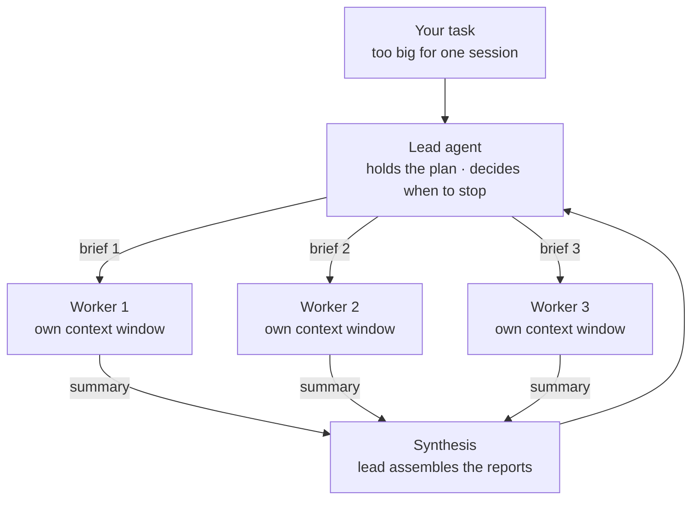

# Lesson 2: A lead and its workers

> Lesson objectives:
> - Describe the orchestrator-worker shape and say which component holds the plan, the results, and the decision to stop.
> - Write a delegation brief containing the four documented parts, and name the failure each missing part produces.
> - Distinguish a fixed parallel split from an orchestrator that decides the split at run time, and pick the right one for a task.
> - Size a fan-out from the task rather than from ambition, and recognise the two documented over-dispatch failures.
>
> Prerequisites: Lesson 1's four-question test, applied to a real task | Previous [<< 01](./01-the-cost-of-a-second-agent.md) | Next [03 >>](./03-what-comes-back-from-a-worker.md)

## Your worker did the wrong job well

You passed the test in Lesson 1, split a task, and the results came back wrong in a way that is hard to complain about. One worker answered a narrower question than you meant. Two workers did the same work. A third went somewhere adjacent and stayed there.

None of them failed. Each did a reasonable job on the task it understood itself to have. The gap is between the job you meant and the job that arrived, and that gap has a name and a documented set of causes. This lesson is about closing it, which is most of what orchestration actually is.

## Explanation

### The shape, and where the parts live

The published name for the arrangement you are building is the **orchestrator-worker pattern**: "a lead agent coordinates the process while delegating to specialized subagents that operate in parallel."[^S1] The lead is sometimes called an orchestrator; the workers are commonly called **subagents**.

Three things sit somewhere specific in this shape, and knowing where saves a lot of confusion later.

*The plan* lives with the lead. It analyses the task, decides on a strategy, and decides how many workers to create and what each one does.[^S1]

*The results* return to the lead. In the documented implementation, "The LeadResearcher synthesizes these results and decides whether more research is needed—if so, it can create additional subagents or refine its strategy."[^S1] Workers report; they do not publish.

*The decision to stop* is the lead's. Only the lead sees the whole picture, so only the lead can tell whether the picture is complete.



The thing to see in the diagram is that the workers never touch each other. Every arrow goes through the lead. That is what makes the brief on each outbound arrow the worker's entire inheritance — and what makes two workers' incompatible assumptions invisible until the summaries land together.

There is a second arrangement where that is not true. Some tools support peer agents that "communicate directly with each other" and coordinate through a shared task list rather than through a lead.[^S8] That trades the lead's bottleneck for genuine peer coordination, at a higher price: "each teammate is a separate Claude instance."[^S8] It is worth knowing the shape exists; this course teaches the lead/worker version, because the coordination problems are the same and easier to see when every message goes through one place.

### The four parts of a brief

Here is the part that fixes the failures in the hook. A worker starts from a **delegation brief** — the message the lead composes about the task — and in an isolated worker that message is everything it will ever know about your intent.[^S7]

Anthropic's team names the required contents from experience: "Each subagent needs an objective, an output format, guidance on the tools and sources to use, and clear task boundaries. Without detailed task descriptions, agents duplicate work, leave gaps, or fail to find necessary information."[^S1]

Four parts. Each maps to a specific failure when it is missing:

| Part | What it answers | Failure when missing |
|---|---|---|
| Objective | What question is this worker answering? | It answers an adjacent question well |
| Output format | What shape must come back? | The field you need is absent, and re-asking means re-running |
| Tools and sources | Where should it look? | It searches the wrong place, or everywhere |
| Task boundaries | Where does this worker's job end? | Two workers cover the same ground |

The duplication failure is not hypothetical. From the same report: "one subagent explored the 2021 automotive chip crisis while 2 others duplicated work investigating current 2025 supply chains, without an effective division of labor."[^S1] Three workers, two doing the same job, because the boundaries were not drawn.

A second vendor's documentation states the requirement slightly differently and adds a part worth having: "A good subagent prompt should explain how to divide the work, whether Codex should wait for all agents before continuing, and what summary or output to return."[^S9] The middle item — whether to wait — belongs to the dispatch instruction rather than the individual brief, and Lesson 4 is about that choice.

### Why the brief carries so much weight

It is worth being precise about how little a worker inherits, because this is where the context-engineering course stops and this one starts.

"Each subagent starts with a fresh, isolated context window. It doesn't see your conversation history, the skills you've already invoked, or the files Claude has already read. Claude composes a delegation message that summarizes the task, and the subagent works from there."[^S7]

Not "sees less". Sees none of it. The two hours of decisions in your session cross the boundary only insofar as they appear in the brief, and they do not appear there by default.

This is the mechanism behind the Flappy Bird failure from Lesson 1: the workers were not underinformed by accident but by construction, and "any number of details could have consequences on the interpretation of the task."[^S3] The brief is not a convenience. It is a translation of your session's state into the only channel that exists.

Which gives the writing test: **read your brief as someone who has never seen your project.** Every noun that resolves only because of your session — "the new format", "as we discussed", "the usual pattern" — is a blank the worker will fill on its own.

### Fixed split or decided split

Two arrangements look the same on a diagram and differ in who chooses the pieces.

In a **fixed split**, you decide the subtasks and dispatch them. The pattern's general form is "Breaking a task into independent subtasks run in parallel," effective "when the divided subtasks can be parallelized for speed, or when multiple perspectives or attempts are needed for higher confidence results."[^S2] You know the pieces before you start: six services, six workers.

In the orchestrator variant, "a central LLM dynamically breaks down tasks, delegates them to worker LLMs, and synthesizes their results." The distinction is explicit: "Whereas it's topographically similar, the key difference from parallelization is its flexibility—subtasks aren't pre-defined, but determined by the orchestrator based on the specific input."[^S2] Its home ground is "complex tasks where you can't predict the subtasks needed."[^S2]

That essay is from December 2024 and is cited here for the distinction rather than for any claim about current tooling. The distinction is durable because it is about your knowledge, not about any product: if you can enumerate the pieces, enumerate them. Handing that decision to a model buys flexibility you do not need and adds a step that can go wrong.

A concrete tell: if writing the dispatch instruction requires you to say "figure out which parts need attention and split accordingly," you are in the orchestrator case. If you can write "one worker per service, here are the six," you are in the fixed case — and you should take the certainty.

### How many workers

Ambition is a bad input to this decision. The documented early failure was "spawning 50 subagents for simple queries, scouring the web endlessly for nonexistent sources, and distracting each other with excessive updates."[^S1]

The fix was explicit sizing rules in the lead's prompt, and the published numbers give a usable starting shape: "Simple fact-finding requires just 1 agent with 3-10 tool calls, direct comparisons might need 2-4 subagents with 10-15 calls each, and complex research might use more than 10 subagents with clearly divided responsibilities."[^S1] In their production shape, "the lead agent spins up 3-5 subagents in parallel rather than serially."[^S1]

Two qualifications. These are from a research product doing web search, so the tool-call counts belong to that setting; carry the tiering, not the numbers. And the condition attached to the largest tier is the operative part: more than ten subagents, *with clearly divided responsibilities*. The count is downstream of the division. If you cannot divide the work ten ways cleanly, ten workers is not a scaled-up version of five — it is five workers plus five sources of overlap.

Specialisation is a separate reason to add a worker, and it is not about parallelism at all. In the sixteen-agent compiler build, roles were assigned by function: one agent on deduplicating code, one on compiler performance, one on generated-code efficiency, one critiquing the design, one on documentation.[^S5] Those workers are not doing a share of one job; they are doing different jobs that happen to touch the same repository. That is a legitimate second use of the pattern, and the sizing question for it is "how many distinct jobs are there", which usually has a small answer.

## Worked example: one brief, written and diagnosed

The task from the four-question test: find out how each of six services handles authentication failure, so a single convention can be chosen. Six workers, one per service.

Here is the brief most people write first:

```text
Look at how the billing service handles auth failures and report back.
```

Every part of the required four is missing, and each absence produces a different wrong answer:

```text
Objective    absent → "handles auth failures" could mean the HTTP status
                      returned, the retry behaviour, the logging, the user
                      message, or the token refresh path. The worker picks
                      one. Six workers pick differently, and the comparison
                      you wanted is now impossible.

Format       absent → One worker returns prose, one a table, one a list of
                      file paths. Assembling them is manual, and any field
                      you need but did not ask for is simply not there.

Sources      absent → It may read the service's README and stop, or crawl
                      the whole monorepo including a vendored copy of an
                      old client.

Boundaries   absent → Nothing says the shared auth library is out of scope,
                      so several workers independently read and report on
                      the same library code.
```

The same brief with the four parts present:

```text
OBJECTIVE
Determine what services/billing does when an incoming request carries an
expired or invalid auth token. Specifically: the HTTP status returned, the
response body shape, whether a refresh is attempted, and what is logged.

SOURCES
Read only under services/billing/. Its handlers are in src/middleware/ and
src/routes/. Do not read other services. Do not read lib/auth-shared/ —
that is common to all six and is being reviewed separately.

OUTPUT FORMAT
Return exactly these five fields:
  status_code:      the HTTP status, or "varies" plus the conditions
  body_shape:       the JSON keys returned, as a list
  refresh_attempted: yes / no / conditional, with the condition
  logged:           what is written, at what level, and whether the token
                    or any part of it appears in the log line
  file_refs:        path:line for each of the above

BOUNDARIES
Report only. Do not edit any file. Do not propose a convention — that
decision is being made after all six reports are in.
If you cannot determine a field from this service's own code, write
"undetermined" and say what you would need to read. Do not infer it from
how another service probably works.
```

Four things in that brief are doing work beyond their obvious purpose.

*`file_refs`* turns every claim into something checkable without re-running the worker. Lesson 5 is built on this field.

*"Do not propose a convention"* keeps the decision with the lead. Six workers each proposing a convention produces six conventions, and the lead is then reconciling opinions instead of facts.

*"undetermined"* gives uncertainty a place to go. Without a named slot for it, uncertainty becomes silence, and silence reads as a finding.

*"Do not infer it from how another service probably works"* blocks a specific and plausible failure: a worker that cannot find the answer filling the gap with a reasonable general pattern. That output looks exactly like a real finding.

Now the dispatch instruction, which is a separate thing from the brief:

```text
Run six workers, one per service: billing, identity, catalog, orders,
notifications, search. Same five fields from each. Wait for all six before
reporting. Do not merge or compare the results — return the six reports
as they came back.
```

"Wait for all six" is the documented item about whether to block.[^S9] "Do not merge" is deliberate: the lead reading six raw reports can see the disagreements between them, which a merged version smooths away. Lesson 5 explains why that matters more than it sounds like it should.

## Your turn: repair a brief

This brief was sent to four workers, one per module, on a task to inventory error handling before a refactor. It came back unusable. Find the four missing parts and what each one cost.

```text
Have a look at error handling in the payments module and tell me what
you find. We want to clean this up so flag anything that looks wrong.
```

```text
Missing part 1: ____________  → failure it produced: ____________
Missing part 2: ____________  → failure it produced: ____________
Missing part 3: ____________  → failure it produced: ____________
Missing part 4: ____________  → failure it produced: ____________

Which phrase in the brief is the most dangerous, and why?
    ____________________________________________
```

Reference answer:

```text
Objective — "tell me what you find" names no question. One worker
  inventoried try/catch blocks, one wrote about error message wording,
  one covered retry logic. All three were responsive. None of them are
  comparable, which was the entire point of running four.

Output format — nothing specified, so nothing aligns. There is no way to
  read four of these side by side, and no field carrying a location, so
  every claim must be re-found by hand before it can be checked.

Sources — "the payments module" is not a path. Its boundary is a matter
  of opinion in most repositories, and the workers held different
  opinions about whether the shared HTTP client was inside it.

Boundaries — "we want to clean this up" reads as permission to edit. At
  least one worker will helpfully fix something, and its fix embeds a
  convention nobody agreed to.

Most dangerous phrase: "flag anything that looks wrong".

  It delegates the standard rather than the work. Every worker must
  decide what "wrong" means here, and those four private definitions
  are exactly the unannounced decisions that make the reports
  incompatible. Worse, the decision is invisible in the output: you
  receive four lists of flagged items and no way to tell that they were
  produced against four different criteria. A worker told to report
  every catch block that swallows an exception without logging returns
  something you can compare. A worker told to flag what looks wrong
  returns its taste.
```

The general repair, and the one to carry into Lesson 3: **delegate the work, never the standard.** Any adjective in a brief — clean, wrong, important, relevant — is a decision the worker will make privately and will not report making.

<!-- exercises -->
## 💻 Exercises (point these at your own real environment)

### Level 1 (warm-up)

Write a full four-part brief for one piece of the task you verdicted SPLIT in Lesson 1. Then run it with a single worker — not the whole fan-out — and check the result against the format you specified.

How: run one worker first, deliberately. A brief that is wrong is much cheaper to discover on one worker than on six, and the single most common cause of a bad fan-out is a brief that was never tested.

<!-- rubric -->
- The brief contains all four parts, each identifiable as its own section.
- The output format names specific fields, and at least one carries a location or reference for checking.
- There is a named place for uncertainty, and the worker's report either uses it or you can say why not.
- Every field you asked for came back; you can name any that did not.
- You can point at one adjective you removed from an earlier draft and say what you replaced it with.
<!-- answer -->
The usual result of the first test run is that one field comes back in a shape you did not anticipate — a status code that is genuinely conditional, a location that is a directory rather than a file. That is the brief teaching you about the task, and the repair is to tighten the format, not to explain more about your project.

The uncertainty slot is the part most often skipped and its absence is invisible. A report with no "undetermined" entries can mean the worker determined everything, or that it had nowhere to put what it could not determine. You cannot tell which from the report, which is why the slot has to exist before the run.

A common mistake: writing the boundaries section as a list of things not to do, and forgetting the positive boundary — where this worker's job ends and the next one's begins. The negative boundaries stop damage; the positive boundary is what prevents duplication.
<!-- hint -->
Read the brief aloud as if you had never seen your project. Every phrase that only resolves because of your session is a blank the worker will fill silently.
<!-- hint -->
If your format has fewer than three fields, you are probably about to receive prose. Fields are what make several reports comparable, which is the reason to run several workers at all.

### Level 2 (advanced)

Dispatch the same piece of work to two workers with deliberately different briefs: one vague ("look into X and report back") and one with all four parts. Compare the outputs and attribute each difference to a specific part of the brief.

How: same task, same tool, same model, two briefs. Run them separately so neither can see the other. Read both outputs before deciding which differences matter.

<!-- rubric -->
- Both runs completed on the same underlying task, with the two briefs recorded verbatim.
- At least three concrete differences identified between the outputs.
- Each difference attributed to a specific missing part — objective, format, sources, or boundaries.
- At least one case identified where the vague brief's output is plausible and wrong, or plausible and unverifiable.
- A judgment on whether the vague output would have survived your review if you had not had the other one to compare against.
<!-- answer -->
The important finding is usually the last rubric item. The vague brief's output is typically fluent, organised, and defensible — it reads like a good report. What it lacks is comparability and checkability: no locations to verify, no fixed fields, and a scope the worker chose. Read on its own, it passes. Read beside a specified report, its gaps become obvious.

Expect the largest divergence in scope. The vague brief lets the worker choose where the task ends, and the choice it makes is reasonable and different from yours. In a fan-out this is the duplication failure, arriving one worker at a time.

A common mistake in this exercise: judging the vague output as "worse quality". It usually is not worse in any way you could defend in isolation. It is *unusable in aggregate*, which is a different defect and the one that matters when six of them have to be read together. If you find yourself arguing about which output is better written, you have not yet found the difference this exercise is about.
<!-- hint -->
Compare the two outputs on scope before content: what did each one decide was in and out? That decision was made by the worker in one case and by you in the other.
<!-- hint -->
Take one claim from the vague output and try to verify it. Time how long that takes, then do the same for the specified output. That gap is what the format field bought.
<!-- /exercises -->

## From one brief to many

You can now write the message a worker actually runs on: an objective it cannot misread, a format that makes several reports comparable, sources that fix where it looks, and boundaries that keep two workers off the same ground. You can tell a fixed split from a decided one, and size a fan-out from the division rather than from ambition.

The brief governs what goes out. What comes back is governed by something else entirely, and it is not symmetric: a worker that reads a hundred files returns a page. That compression is the reason the whole architecture is affordable, and it is also where your evidence goes missing. Lesson 3 is about what survives the return trip.
