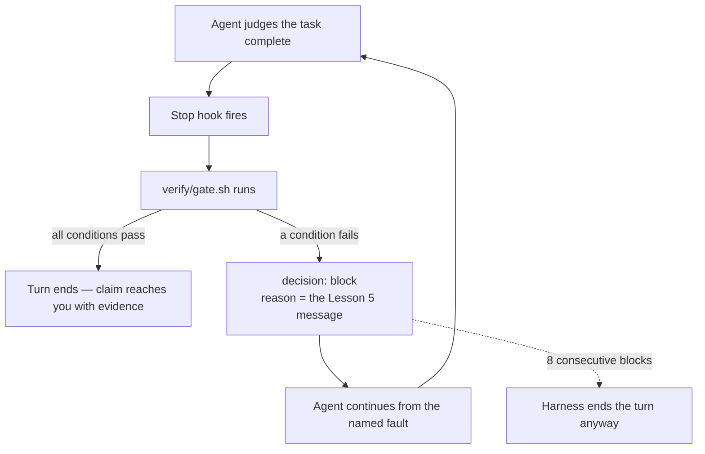

# Lesson 6: Wiring the gate into your project

> Lesson objectives:
> - Install a three-layer gate in one of your own repositories as a single runnable command.
> - Attach it to a trigger that fires without you choosing to run it.
> - Use the gate to overturn one real "done" claim and record what it caught.
> - Decide what your gate does not cover, and say so explicitly rather than by omission.
>
> Prerequisites: Lessons 3–5 — a done-condition file, layers ordered by cost, and repair-ready failure output | Previous [<< 05](./05-failure-output-an-agent-can-use.md) | Next [Course contents >>](./README.md)

## Everything so far runs only when you decide to run it

You have the pieces. Conditions the agent does not own, three layers ordered so the cheap one fails first, failures written so an agent can act on them. All of it invoked by you typing a command.

That is the state Sonar's survey describes at scale: near-universal distrust of AI-generated code, and "only 48% of developers always check their AI-assisted code before committing."[^S7] The gap is not knowledge. Nobody in that 52% believes checking is unnecessary. They skip it on the change that looked small, on the Friday, on the fourth run of the day — and those are the runs where a completion claim goes unexamined.

This lesson makes the gate fire on a trigger you do not control, then uses it on a real claim.

## Explanation

### One command, three layers, one verdict

Before any trigger, the gate must be a single command. If verifying takes three commands in the right order, it will be run partially.

```bash
#!/usr/bin/env bash
# verify/gate.sh — run from the repository root. Exits 0 (pass) or 1 (fail).
set -uo pipefail
cd "$(dirname "$0")/.."

fail() { printf '\n%s\n' "$1"; exit 1; }

# Layer 1 — static. Seconds. Nothing above is interpretable until this passes.
npm run typecheck --silent || fail "LAYER 1 FAIL — types do not check.
  Run: npm run typecheck
  Nothing below this layer was run; fix the build first."

# Layer 2 — behavioural, plus the count check from Lesson 4.
npm test --silent -- --reporter=json > /tmp/gate-tests.json 2>/dev/null || true
node verify/check-tests.mjs /tmp/gate-tests.json verify/done.json || exit 1

# Layer 3 — system. Drives the real path against the done-conditions.
node verify/drive-conditions.mjs verify/done.json || exit 1

printf '\nGATE PASS — all conditions in verify/done.json satisfied.\n'
```

Three details are doing real work. `set -uo pipefail` without `-e`, so a failing layer reaches your own message rather than dying silently on the exit code. Each `fail` message says what was *not* run, so a red layer 1 does not read as a green layer 3. And layers 2 and 3 own their own output, because Lesson 5's four elements need the check's internal state — a wrapper script cannot reconstruct it.

Note what is not here: no coverage percentage, no summary table, no advisory warnings. The gate produces a verdict.

### Making it fire on its own

Now attach it to something that happens whether or not you remember.

**Version control hook.** A pre-commit or pre-push hook fires on an action you already take. It is local, it works with any agent and any editor, and it costs nothing to install. Its limitation matters: it fires at commit time, so an agent that declares completion and stops has already finished by the time the gate speaks.

**Continuous integration.** Fires on push, cannot be skipped by anyone, and runs in a clean environment — which catches the environment differences from Lesson 2's blind-spot table. It is also the slowest to tell you, and by then the claim has been made and probably accepted.

**A harness hook, firing when the agent tries to finish.** This is the one that addresses the failure this course opened with, because it evaluates at the moment the completion claim is made.

Claude Code's hook system is built for this. The docs state the purpose plainly: hooks "execute automatically at specific points in Claude Code's lifecycle," which "gives you deterministic control: certain actions always happen rather than relying on the LLM to choose to run them."[^S9] That sentence is the whole argument of this course expressed as a product feature — the check runs because the lifecycle runs it, not because the agent decided verification was warranted.

The relevant event is `Stop`, which "runs when the main Claude Code agent has finished responding," and it can refuse: `decision: "block"` "prevents Claude from stopping," with a `reason` that is "required when `decision` is `\"block\"`" and "tells Claude why it should continue."[^S9]

Read what that composes into. The agent concludes the task is done. Before that conclusion reaches you, your gate runs. If a condition fails, the turn does not end — the agent receives your Lesson 5 failure message as the reason to continue. The completion claim from Lesson 1 never arrives, because the thing that would have produced it was overruled by a check the agent does not control.



The diagram's point is the loop on the left and the dotted escape on the right. The agent cannot exit through its own judgment while a condition is failing — but the loop is bounded, because "Claude Code overrides the hook and ends the turn after 8 consecutive blocks."[^S9] That bound is not a flaw; it is what prevents an impossible condition from trapping a session forever. It does mean a persistently failing condition eventually stops blocking, so treat the eighth block as a signal to look yourself.

One asymmetry from the same documentation is worth internalising, because it decides how you write the script: "The hook can deny the call, but staying silent doesn't approve it."[^S9] A hook that crashes or exits without a decision does not assert that the work is fine — it declines to have an opinion, and normal flow proceeds. Your gate is a veto, not a certificate. A green gate means nothing it checks is broken, never that the work is correct.

**Hook event names, field names, and JSON shapes are product surface and change between versions.** Read your harness's current hook documentation before wiring anything, and treat the mechanism — a lifecycle event that can refuse a completion — as the durable part. That mechanism now exists in several harnesses under different names.

### Protecting the gate from the run being gated

Lesson 2 measured what happens when the thing being graded can edit the grader.[^S4] Now that the gate lives in the repository the agent works in, that hazard is yours.

Three defences, in order of how much they buy:

**Make the checks read-only to the agent session.** The measured effect: "Read-only access provides a middle ground: it restores legitimate performance while preventing test modification attempts," while not eliminating "other cheating methods such as special-casing or operator overloading."[^S4] One shortcut closed, honestly partial. Most harnesses can deny writes to a path.

**Record the counts.** `verify/done.json` holds `total`; your test check holds the expected test count. A deleted condition changes a number, and a changed number is visible even when everything exits 0.

**Constrain the allowed edit.** Anthropic's harness let agents "edit this file only by changing the status of a `passes` field," under the instruction that removing or editing tests "is unacceptable... because this could lead to missing or buggy functionality."[^S1] The requirement text is not up for revision by the run being graded.

None of this is a security boundary, and it is worth being blunt about that. An agent with shell access in your repository can modify anything you can modify. These measures make tampering *visible* rather than impossible — which is the achievable goal, and enough, because a check whose modification shows up in your diff is a check you can trust at a glance.

While wiring this up: never put credentials in `verify/done.json`, in your gate script, or in a hook command. Layer 3 drives a running application and will want a test account or an API key — read those from environment variables, keep the values out of the repository, and point layer 3 at a development instance rather than production. A gate that drives real user flows against production data is a gate that can send real emails and delete real records.

### Say what the gate does not cover

Every gate has a boundary, and an unstated boundary gets read as coverage.

Two limits are structural. Layer 3 sees only what it drives — the harness authors hit this directly: "limitations to Claude's vision and to browser automation tools mak[e] it difficult to identify every kind of bug."[^S1] And no layer has an opinion about fit. Lesson 2's measured rejections were increasingly dominated by code quality rather than broken functionality,[^S2] and the vendor line holds: "whereas automated testing helps verify functionality, human review remains crucial for ensuring solutions align with broader system requirements."[^S10]

So write the boundary into the repository, next to the gate, as an **unchecked list**:

```markdown
# What verify/gate.sh does not check
- Any path layer 3 does not drive. Currently driven: signup, reset, checkout.
  Not driven: admin, billing export, anything behind a feature flag.
- Whether the change fits this codebase — conventions, duplication, dependencies.
  This is the largest uncovered category. Read the diff.
- Conditions marked `"checked": false` in verify/done.json (currently pr-5:
  counters surviving a restart — no automated check exists).
- Performance, accessibility, security. No layer looks at any of these.
```

This file is what keeps a passing gate from meaning more than it should. It is also your work queue: every line is a candidate layer, and the ones that keep biting you are the ones to build next.

## Worked example: overturning a claim end to end

Here is the whole gate on one real task, from claim to correction.

**The task and its conditions.** "Add CSV export to the reports page." Four conditions, written before the work (Lesson 3):

```json
{
  "task": "csv-export",
  "total": 4,
  "conditions": [
    { "id": "cx-1", "must": "Clicking Export on /reports downloads a file named reports-<date>.csv", "passes": false },
    { "id": "cx-2", "must": "The file's row count equals the row count shown on the page", "passes": false },
    { "id": "cx-3", "must": "A field containing a comma stays one field when the file is reopened", "passes": false },
    { "id": "cx-4", "must": "Exporting an empty report yields a header row, not an empty file or an error", "passes": false }
  ]
}
```

`cx-3` and `cx-4` are the ones nobody writes tests for, and they are where CSV export actually breaks.

**The claim.** The run finishes: "Added CSV export. The endpoint streams the report rows through a CSV formatter and the button triggers the download. Added unit tests for the formatter — all passing."

Under Lesson 1's split: one external signal (tests pass), three reported beliefs. The signal covers the formatter, which is not the layer `cx-1` through `cx-4` live at.

**The gate runs, triggered by the Stop hook.**

```text
LAYER 1  pass   (4s)
LAYER 2  pass   (52/52 tests, count matches recorded total)
LAYER 3  FAIL   (12s)

LAYER 3 FAIL — condition cx-3 (1 of 4 conditions failing, 3 passing)

  Condition: A field containing a comma stays one field when the file is reopened
  Expected:  the row for report "Q3 Sales, EMEA" parses back as 5 fields
  Actual:    parsed back as 6 fields — "Q3 Sales" and " EMEA" split apart
  Observed:  the emitted line is  Q3 Sales, EMEA,412,2026-03-11,open,acme
             no quoting applied to any field
  Where:     the row writer in src/reports/csv.ts — fields are joined with
             "," and never quoted or escaped
  Satisfied when: any field containing a comma, a double quote, or a newline
                  is emitted quoted with internal quotes doubled, per RFC 4180.
                  Stripping commas from the data does not satisfy this — the
                  exported value must match the value shown on the page.
```

**What happened next.** The turn did not end. The agent received that message as the `reason` to continue, changed the row writer to quote fields, and the gate re-ran: `cx-3` passed, all four conditions green, and only then did the turn end.

**Read what each part contributed.** The condition existed because it was written before the work, when nobody was invested in it passing. Layer 3 caught it because it round-tripped the file rather than checking that the endpoint returned 200. The message named the property — quote per RFC 4180 — and closed the cheapest wrong repair, stripping commas, which would have made the assertion pass while corrupting the data. The Stop hook made all of it happen without anyone deciding to check.

And the claim itself was accurate throughout. The endpoint did stream rows, the button did trigger a download, the formatter tests did pass. Every reported belief was true, and the feature was broken. That is the failure this course is about, and this is what catching it looks like.

## Your turn: install it

Do this in a repository you actually work in. Fill in each blank by doing the thing, not by planning it.

1. Repository: ________ Task with a done-condition file: ________
2. `verify/gate.sh` exists and runs from the repo root, exits 0 or 1: ________
3. Measured cost of a passing run: ____ s. Of a layer-1 failure: ____ s.
4. Trigger installed (hook / pre-commit / CI): ________
5. Verify the trigger fires: break one condition on purpose and confirm the gate goes red **without you invoking it**. What did you break, and did it fire? ________
6. `verify/UNCHECKED.md` written, with at least three real uncovered items: ________

<details>
<summary>Answer</summary>

Step 5 is the step, and it is the one most likely to be skipped because everything looks correct. A trigger that is installed but not firing is indistinguishable from a working gate until the day it matters. Break something real — comment out the line satisfying one condition — and confirm red arrives on its own.

The common failure at step 5 is a hook that is registered but exits silently: wrong path, script not executable, wrong working directory. Recall the asymmetry — silence is not approval, so a broken hook produces a green-looking run rather than an error. Check that your script is executable and that it resolves paths from the repository root rather than from wherever the harness invoked it.

At step 3, if a passing run costs more than about 90 seconds, split the trigger rather than shortening the gate: layers 1 and 2 on the frequent trigger, layer 3 on push or on completion only. A slow gate on every keystroke gets disabled within a week, and a disabled gate checks nothing.

At step 6, if you cannot name three uncovered things, look harder rather than concluding coverage is complete. Every gate has uncovered paths; a short UNCHECKED.md means you have not found them yet, not that they do not exist.
</details>

```agentmentor-action
mode: error_simulation
label: Play the run that passes my gate while breaking the feature
description: Tests whether my conditions are worded tightly enough that satisfying them requires actually building the feature, by having an agent look for the cheapest way to turn each one green without doing the work.
purpose: Before I trust this gate on real work, I want the loopholes found deliberately rather than discovered later — the conditions that can be satisfied by a shortcut, and the wrong repairs my failure messages leave open.
rules:
  - Ask me to paste my verify/done.json conditions and one failure message from my gate.
  - For each condition, propose the cheapest change that would make it pass without implementing the intended behaviour.
  - Be adversarial and concrete: name the specific edit, not the category of shortcut.
  - After each one, wait for me to rewrite the condition before moving to the next.
  - If a condition genuinely has no cheap shortcut, say so and move on rather than inventing a weak one.
```

<!-- exercises -->
## 💻 Exercises (point these at your own real environment)

### Level 1 (warm-up)
Install the gate and prove the trigger works. Write `verify/gate.sh` for one real repository, wire it to one trigger, then deliberately break a condition and confirm the gate goes red without you running it. Restore the code and confirm it goes green again.

<!-- rubric -->
- `verify/gate.sh` committed, runnable from the repository root, exiting 0 on pass and 1 on fail.
- All three layers present, or a written note naming which is missing and why.
- A trigger installed and named.
- A deliberate break, with the red output pasted and the trigger that produced it identified.
- Restored code, and a green run confirmed.
- Passing-run cost measured in seconds.

<!-- answer -->
The red-then-green cycle is the deliverable — it proves the gate can fail, which an always-green gate never does. Two failure modes to expect while wiring this up: a hook registered at the wrong path or not executable, which produces silence rather than an error; and a script that assumes it runs from the repository root when the harness invoked it elsewhere. The `cd "$(dirname "$0")/.."` line addresses the second.

If your layer 3 does not exist yet, an honest minimum is a script that starts the app and performs one request against the main path. That is a real layer 3 — it drives the running system — and it already catches the seam failures a green unit suite cannot. Note it in UNCHECKED.md as covering one path only.

Keep the measured cost visible. It is the number that decides whether this gate is still running next month.

<!-- hint -->
Start with layer 1 alone and confirm the trigger fires before adding the others. Debugging a trigger and a three-layer script at once doubles the search space.

<!-- hint -->
`chmod +x verify/gate.sh`. A non-executable hook script is the single most common cause of a hook that appears installed and never runs.

<!-- hint -->
Break a condition by commenting out the line that satisfies it rather than by breaking syntax. A syntax error fails at layer 1 and tells you nothing about layers 2 and 3.

### Level 2 (advanced) — the course task
Use the gate to overturn one real "done" claim. Give an agent a genuine task in your repository with its done-condition file written first, let it work to completion, and let the gate evaluate the claim. Record what the claim said, what the gate found, and what the difference was. If the gate passes on the first attempt, keep going with the next task until you catch one — and if you catch nothing across three tasks, that is a finding about your conditions, not a pass.

<!-- rubric -->
- One completed run recorded: the task, the done-condition file written before the work, the agent's completion claim verbatim.
- The gate's verdict, with the failing condition's full output pasted.
- The gap named in one sentence: what the claim asserted, and what was actually true.
- What happened after: the repair, and whether the failure message was sufficient without you explaining it.
- If nothing was caught in three tasks, an analysis of which conditions were too weak, and at least one rewritten.
- `verify/UNCHECKED.md` updated with anything this run revealed as uncovered.

<!-- answer -->
Expect the overturned claim to be accurate in every detail and wrong overall — that is the shape of the whole failure, as in the worked example, where every reported belief was true and the export was still broken. If your caught failure has that shape, you have reproduced the mechanism the course opened with and closed it.

If three tasks pass cleanly, work through the possibilities in order. Your conditions may only cover what the agent would have done anyway, which shows up as conditions written after you had a sense of the implementation — the fix is Lesson 3's step 3, describing the world where each condition is false. Your layer 3 may not drive the path where failures live, which is Lesson 4's Level 2 exercise applied to a new task. Or the work genuinely was complete, which happens and is not the common case on multi-step tasks.

A common mistake worth naming: writing the conditions after seeing the plan the agent proposed. At that point you are encoding its approach into your finish line, and it will pass by construction. The conditions must come from the requirement, before any implementation is visible.

On the repair step: if you had to explain the failure to the agent beyond the message, Lesson 5's four elements are incomplete somewhere. Note which element was missing and fix the check that emitted it — that is the loop closing on the gate itself.

<!-- hint -->
Pick a task with at least one integration seam — something touching a template, an external call, a file format, or a schema. Pure-logic tasks are where agents do best and where a gate finds least.

<!-- hint -->
Write the conditions before you send the request, and do not revise them once work begins. Revising mid-task is how a finish line becomes a description of what was built.

<!-- hint -->
Save the completion claim verbatim before the gate runs. Afterwards it is tempting to remember it as more hedged than it was.

<!-- hint -->
If the gate catches something, resist fixing it yourself. Hand back the message and watch what the agent does — that is the loop you built, and this is the run where you learn whether it works.
<!-- /exercises -->

## Summary + what to do next

What you can now do, that you could not six lessons ago:

- Read a completion claim as evidence about a belief, and separate its reported beliefs from external signals.
- Say what a green suite leaves unmeasured, with the measured gap and the settings it came from.
- Write a done-condition file the agent reads, cannot rewrite, and did not author.
- Run three layers ordered by cost, each producing a verdict rather than a report.
- Emit failures an agent can repair without you translating them.
- Fire the whole thing on a trigger you do not control, and state what it does not cover.

Two things are worth doing in the next week. Run the gate on every task you delegate, and keep the failure log — after five or six catches it will show you which layer is earning its cost and which conditions never fail because they were written too loosely. Then reread `verify/UNCHECKED.md` and build the layer covering whichever uncovered item has bitten you since.

The boundary of all this is worth stating plainly at the end. A green gate means nothing it checks is broken. It does not mean the work is right, and the largest uncovered category — whether the change belongs in your codebase — is still yours. What you have removed is the need to ask "did this actually work" on every run. That question now has an answer before you read the claim.
