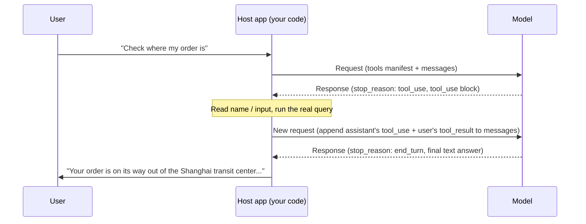

# Lesson 2: The Full Round-Trip of a Tool Call

> Learning goals:
> - Name the key fields the request and the response each carry in one tool-call round-trip
> - Tell whether a piece of tool_use / tool_result code is matched up correctly
> - Spot a data dependency between calls in the same parallel batch, and know when to split the calls into two rounds
> - Explain why the phrase "the model calls a tool" is itself inaccurate
>
> Prerequisites: You've read Lesson 1 and know why agents need tools | Prev: [Lesson 1 <<](./01-why-agents-need-tools.md) | Next: [Lesson 3 >>](./03-tool-types.md)

## Start With Three Chunks of JSON

You're building a support bot. A user asks, "Can you check where my order ORD-2026-8842 is?" Your code sends that message to the model along with a tool definition:

```json
{
  "model": "claude-sonnet-5",
  "tools": [
    {
      "name": "get_order_status",
      "description": "Look up the current status and shipping info for an order. Use it when a user asks about order progress, shipping, or estimated delivery time.",
      "input_schema": {
        "type": "object",
        "properties": {
          "order_id": { "type": "string", "description": "The order number, in the form ORD-2026-0001" }
        },
        "required": ["order_id"]
      }
    }
  ],
  "messages": [
    { "role": "user", "content": "Can you check where my order ORD-2026-8842 is?" }
  ]
}
```

Notice the new `tools` field. It isn't a message; it's a manifest that tells the model what tools it has on hand, what each one looks like, and what parameters each one needs.[^S3] You have to send this manifest with every request — the model doesn't "remember" it, so your code has to include it each time.

The model reads the manifest and, instead of answering the order status directly, returns something like this:

```json
{
  "id": "msg_01A2b3C4d5E6f7G8h9",
  "role": "assistant",
  "stop_reason": "tool_use",
  "content": [
    { "type": "text", "text": "Let me check on that order for you." },
    { "type": "tool_use", "id": "toolu_01XYZ89AbCdEfGhIjKlMnOp", "name": "get_order_status", "input": { "order_id": "ORD-2026-8842" } }
  ]
}
```

Two new things show up here: `stop_reason` has become `"tool_use"`, and the `content` array has a new block with `type: "tool_use"`. The model hasn't looked up any order information — it doesn't even know where the order system lives. It's just saying, "I need you to call `get_order_status` for me with these parameters, then tell me the result."

Your code takes over from here, actually queries the order system, gets a result, and packs that result into the next request to send back:

```json
{
  "model": "claude-sonnet-5",
  "tools": [ /* same as above; this round needs it too */ ],
  "messages": [
    { "role": "user", "content": "Can you check where my order ORD-2026-8842 is?" },
    {
      "role": "assistant",
      "content": [
        { "type": "text", "text": "Let me check on that order for you." },
        { "type": "tool_use", "id": "toolu_01XYZ89AbCdEfGhIjKlMnOp", "name": "get_order_status", "input": { "order_id": "ORD-2026-8842" } }
      ]
    },
    {
      "role": "user",
      "content": [
        {
          "type": "tool_result",
          "tool_use_id": "toolu_01XYZ89AbCdEfGhIjKlMnOp",
          "content": "{\"status\":\"in_transit\",\"location\":\"Shanghai transit center\",\"eta\":\"2026-08-27\"}"
        }
      ]
    }
  ]
}
```

Notice what got added: the model's full reply from the previous round is dropped back into `messages` verbatim, followed by a new `user` message. That message doesn't hold text the user typed — it holds a `type: "tool_result"` block whose `tool_use_id` matches exactly the id the model just handed you.

Only after seeing this request does the model finally say something like, "Your order is on its way out of the Shanghai transit center, with delivery expected on August 27." Three chunks of JSON, three role switches: the model makes a request, your code runs it, the result gets fed back. That's the whole of one tool-call round-trip.

## stop_reason Is a Signal, Not an Execution Record

Here's the thing beginners get wrong most often: they assume `stop_reason: "tool_use"` means the tool has already been called. It hasn't. It's just the model's reason for why it stopped when it finished this message, the same kind of field as `"end_turn"` (it's done talking) or `"max_tokens"` (it ran out of room), only with a different value.[^S2]

The model never touches a database, fires an HTTP request, or runs a shell command on its own. All it can do is emit a structured request; the rest of the work falls to your code or Anthropic's servers.[^S4] That's why tools split into "client tools" (the host application runs them) and "server tools" (Anthropic runs them on your behalf) — the difference is only about who runs this step, not about whether the model can run it itself.[^S2]

```agentmentor-check
{
  "id": "tool-zh-02-stop-reason-meaning",
  "label": "Decide what has happened after stop_reason: tool_use",
  "prompt": "You get a response from the model. stop_reason is \"tool_use\", and content holds one tool_use block whose name is send_email. At this moment, has the user's email already been sent?",
  "whyHere": "We just established that stop_reason is only a signal, not a record of execution. This checks whether the learner still carries the common misconception that a returned tool_use block means the tool already ran.",
  "mode": "single",
  "choices": [
    {
      "id": "a",
      "text": "Yes, it's sent. A returned tool_use block is the sign that execution is done.",
      "correct": false,
      "feedback": "No. A tool_use block is just the model's request, the equivalent of it saying \"please call send_email for me with these parameters.\" The model has no network access and can't send anything; the code that actually sends the email only runs after the host application reads this block."
    },
    {
      "id": "b",
      "text": "Not yet. Your code has to read the parameters out of the tool_use block and call your own email-sending logic.",
      "correct": true,
      "feedback": "Right. stop_reason: tool_use only means the model has handed over a request slip. Execution always stays with the host application, and the email is actually sent after your code parses out name and input and calls your own send function."
    }
  ]
}
```

## The Three Fields in a tool_use Block, None Optional

Look back at that `tool_use` block. Only three of its fields are required:[^S5]

- **`id`**: the unique identifier for this call, in the form `toolu_01XYZ...`. It has exactly one job — matching things up when you send the result back later.
- **`name`**: the tool the model picked, which has to match the `name` of one of the tools in your `tools` manifest exactly.
- **`input`**: an object holding the parameters for this call, shaped to satisfy the rules you defined in `input_schema`.

Put those three fields together and you have everything the model can express: "I want to call the `name` tool with this `id`, and here's the `input`." It won't tack on logic like "retry three times" — you write that yourself in the host code. How to design a tool interface so the model makes fewer parameter mistakes is Lesson 3's territory; this lesson only cares about how these three fields get packed in and read back out.

## tool_result Matches Up by tool_use_id

A single reply from the model can hold more than one `tool_use` block. Say the user asks, "Can you check where my order ORD-2026-8842 is, and also check whether ORD-2026-9001 has shipped?" The model puts two `tool_use` blocks in the same `content` array, and `stop_reason` is still `"tool_use"`.

Your code has to look up both orders, then, in the **same** `user` message, drop both results into the `content` array together, with each `tool_result` claiming its call by its own `tool_use_id`:

```json
{
  "role": "user",
  "content": [
    {
      "type": "tool_result",
      "tool_use_id": "toolu_01XYZ89AbCdEfGhIjKlMnOp",
      "content": "{\"status\":\"in_transit\",\"eta\":\"2026-08-27\"}"
    },
    {
      "type": "tool_result",
      "tool_use_id": "toolu_02QRS45TuVwXyZaBcDeFgH",
      "content": "{\"status\":\"pending\",\"eta\":null}"
    }
  ]
}
```

If you take a shortcut and send one round with just the first `tool_use_id` on its own, the model refuses to continue the conversation, because "the previous round had a `tool_use` block that never got its `tool_result`" — both blocks have to be claimed together in the next `user` message; you can't split them across two requests and send them back in batches.[^S21] The `tool_result` block also has an optional `is_error` field: set it to `true` when the tool fails, and the model knows this call ran into a problem.[^S5]

```agentmentor-check
{
  "id": "tool-zh-02-batched-tool-result",
  "label": "How to send results back for multiple tool_use blocks",
  "prompt": "The model's response this round has two tool_use blocks (each calling a different tool), and stop_reason is still tool_use. You've run both tools. How should you send the results back?",
  "whyHere": "We just covered that tool_result matches up by tool_use_id. This checks whether the learner understands that when one reply has multiple calls, the results must go back as a batch rather than split across separate requests.",
  "mode": "single",
  "choices": [
    {
      "id": "a",
      "text": "Send two separate requests, one tool_result each, finishing the first before sending the second.",
      "correct": false,
      "feedback": "On the first request, the other tool_use block still hasn't gotten its tool_result, so the conversation can't move forward. Both blocks have to be claimed in the same new user message — wait until both have run, then package them and send."
    },
    {
      "id": "b",
      "text": "Put both tool_result blocks in the content array of a single user message, each matched by its own tool_use_id.",
      "correct": true,
      "feedback": "Right. However many tool_use blocks there are in one response, the next user message needs that many tool_result blocks, matched one-to-one by tool_use_id, all packaged in the same message and sent together."
    }
  ]
}
```

## Calls in the Same Batch Can't See Each Other's Results

Now that the batched-return rule is settled, there's a deeper trap: the **data dependency** between `tool_use` blocks in the same batch.

Switch scenarios. A money-transfer agent is set up with two tools: `read_balance(account_id)` reads the balance, and `withdraw(account_id, amount)` moves money out. The user says, "Move \$100 out of A001, if there's enough." In a single response, the model gives back two `tool_use` blocks: `read_balance({"account_id": "A001"})` and `withdraw({"account_id": "A001", "amount": 100})`.

Look at `withdraw`'s `amount`: 100, copied straight from the number in the user's sentence, with no relationship to whether the balance is enough. This isn't the model being lazy; it has no choice. At the moment it generates this response, `read_balance` is still just "something it plans to do" — its return value doesn't even exist yet, so `withdraw` can't read it. Within one batch of `tool_use` blocks, no call can see the results of the others in that batch, because those results haven't been executed or sent back at that point.

So here's a line you have to hold yourself: **if a write operation's parameter should, in theory, equal the return value of a read operation in the same batch, those two calls shouldn't appear in the same response.** The genuinely safe approach is to split them into two rounds: run only `read_balance` first, send the real balance back as a `tool_result`, and once the model sees "the balance is only 60," let it decide whether to call `withdraw` and for how much.

Three tactics that actually work:

1. **Write the precondition into the tool description.** Add a line to `withdraw`'s `description`: "only call after you've seen the latest balance returned by read_balance." The tool description is itself part of the prompt the model can read, which is far more reliable than hoping the model figures out the dependency on its own.[^S8]
2. **Turn off parallelism with disable_parallel_tool_use.** Set `{"type": "auto", "disable_parallel_tool_use": true}` in the request's `tool_choice`, and the model calls at most one tool per response.[^S21] Tighten the behavior to one-at-a-time first, get the dependencies between steps clear in your head, and only then consider loosening it.
3. **Backstop it in the execution layer.** Have the code that runs `withdraw` re-check the latest balance itself, refuse to run if the condition isn't met, and write the reason into the `tool_result` error info for the model to see, rather than pretending it succeeded. Even if the model bundles the two calls together again this time, this check catches the risk.

## Draw It as a Diagram

Draw the round-trip above and it looks like this:



The step most often gotten wrong on this diagram is the "append" arrow: sending just the `tool_result` on its own and forgetting to drop the model's full `tool_use` reply from that round back into `messages`. The model then receives a tool result that appears out of nowhere, with no record in its context of the request it made — a non sequitur or an outright error becomes likely. The right move is to store every round's response into history verbatim; `messages` only ever grows longer and is never trimmed.[^S4]

## One Task May Take More Than One Round-Trip

The example above ended after a single tool call. In real scenarios, the model often has to go back and forth several times before it can finish. Picture a deployment bot. The user says, "Restart the service for me, and tell me if there are any errors in the logs":

1. The model returns `tool_use` on the first round, calling `restart_service`; you run it and send the result back
2. The model returns `tool_use` again on the second round, calling `read_logs` to check for errors; you run it and send the logs back
3. On the third round the model finally returns `stop_reason: "end_turn"`, with a summary in text

The code logic on the host side is essentially a loop: as long as `stop_reason` is still `"tool_use"`, keep running tools, packing the results back in, and sending another round; once it turns into `"end_turn"`, hand the final text to the user.[^S4]

```javascript
// tools is your list of tool definitions, like the tools array in this lesson's opening request
const messages = [{ role: "user", content: userInput }];

let response = await callModel({ tools, messages });

while (response.stop_reason === "tool_use") {
  const toolUseBlocks = response.content.filter(b => b.type === "tool_use");

  messages.push({ role: "assistant", content: response.content });

  const toolResults = await Promise.all(
    toolUseBlocks.map(async (block) => ({
      type: "tool_result",
      tool_use_id: block.id,
      content: await executeTool(block.name, block.input),
    }))
  );

  messages.push({ role: "user", content: toolResults });

  response = await callModel({ tools, messages });
}

// stop_reason has turned to end_turn; response holds the final text answer
```

This loop has no fixed cap on iterations — for one user request, the model might call a tool just once, or five or six times before it has gathered enough. Lesson 3 covers how tool-interface design can cut the number of round-trips; for this lesson, just remember: multiple round-trips are the norm, not the exception.

## Swap the Host, the Field Names Change, the Structure Doesn't

If you're on an OpenAI-compatible API, the same mechanism comes in different wrapping: the call request shows up in the `choices[0].message.tool_calls` array, the finishing signal isn't called `stop_reason` but `finish_reason`, and its value is `"tool_calls"` rather than `"tool_use"`.[^S7] OpenAI's official docs describe the process as "a multi-step conversation between your application and a model via the OpenAI API. When the model calls a function, you must execute it and return the result" — the model issues a call request, the application runs it and sends the result back, exactly like Claude.[^S1]

Field names change with the API, but the skeleton — "the model only sends requests, the host handles execution, results come back carrying an identifier, and it may loop several rounds" — is universal.

<!-- exercises -->
## 💻 Exercises

### Level 1: Hand-Write the tool_result Request

The model returned this response (`stop_reason` is `"tool_use"`):

```json
{
  "role": "assistant",
  "stop_reason": "tool_use",
  "content": [
    { "type": "tool_use", "id": "toolu_01Weather9527", "name": "get_weather", "input": { "city": "Hangzhou" } }
  ]
}
```

You called your own weather-lookup function and got the result: sunny, 26 degrees Celsius.

In your editor, write out the complete `messages` array for the next request (the original user message + this round's assistant response + the tool_result message you construct), with these requirements:

1. The `tool_use_id` matches the `id` in the response above exactly
2. The `tool_result`'s `content` is a piece of text a program can parse (a JSON string, for example)
3. The three messages in the array have `role` values of `user`, `assistant`, `user` in that order

<!-- rubric -->
- The `messages` array contains three messages, in the right order and with the right roles
- The `tool_result` block's `tool_use_id` is exactly `toolu_01Weather9527`, not some made-up string
- The `tool_result`'s `content` carries the actual weather data, in a format later code can parse

<!-- answer -->
```json
[
  { "role": "user", "content": "What's the weather in Hangzhou?" },
  {
    "role": "assistant",
    "content": [
      { "type": "tool_use", "id": "toolu_01Weather9527", "name": "get_weather", "input": { "city": "Hangzhou" } }
    ]
  },
  {
    "role": "user",
    "content": [
      {
        "type": "tool_result",
        "tool_use_id": "toolu_01Weather9527",
        "content": "{\"condition\":\"sunny\",\"temperature_c\":26}"
      }
    ]
  }
]
```

<!-- hint -->
The second message comes from the model's response — just carry its `role` and `content` straight into the array. Top-level metadata fields like `stop_reason` aren't part of the message itself, so leave them out.

<!-- hint -->
The `tool_result` doesn't need a new id. Its `tool_use_id` is just the `id` the model gave you, copied character for character.

### Level 2: Find the Three Bugs in the Round-Trip Code

The code below tries to implement the "call a tool, send the result back" logic, but three things will keep the model from getting the right result, or make the conversation error out. Find the problems and write the corrected version. (Assume the model's response has only one `tool_use` block.)

```javascript
async function handleTurn(userMessage, tools) {
  const messages = [{ role: "user", content: userMessage }];
  const response = await callModel({ tools, messages });

  if (response.stop_reason === "tool_use") {
    const toolBlock = response.content.find(b => b.type === "tool_use");
    const result = await executeTool(toolBlock.name, toolBlock.input);

    messages.push({
      role: "user",
      content: [{ type: "tool_result", tool_use_id: toolBlock.name, content: result }],
    });

    const finalResponse = await callModel({ messages });
    return finalResponse;
  }

  return response;
}
```

<!-- rubric -->
- Identify and explain three specific problems, each pointing to an exact line in the code
- The corrected code appends the model's `response.content` into `messages`
- The corrected code uses `toolBlock.id`, not `toolBlock.name`, for `tool_use_id`
- The corrected second `callModel` call includes `tools`

<!-- answer -->
Three problems:

1. **`tool_use_id: toolBlock.name` uses the wrong field.** It should be `toolBlock.id` — `name` is the tool's name, not the unique identifier for this call, so the model can't match up against it.
2. **`response.content` never gets appended into `messages`.** Jumping straight from a single `user` message to appending the `tool_result` means the model has no record of the request it made on the next round, and the context is broken.
3. **The second `callModel({ messages })` doesn't include `tools`.** The tool manifest has to go with every round, or the model can't find the tool definitions when a task needs more than one round-trip.

Corrected, the key changes are these three spots (the rest of the code stays the same):

```javascript
messages.push({ role: "assistant", content: response.content }); // add this line
messages.push({
  role: "user",
  content: [{ type: "tool_result", tool_use_id: toolBlock.id, content: result }], // .id, not .name
});
const finalResponse = await callModel({ tools, messages }); // include tools
```

<!-- hint -->
Check it against the JSON example in this lesson's "stop_reason Is a Signal, Not an Execution Record" section, line by line: in a real round-trip, how many messages show up in the `messages` array, and what's the `role` of each?

<!-- hint -->
Ask yourself: if this task needed the model to call tools twice in a row (check inventory first, then check price), would this code's second `callModel` still have a `tools` parameter to work with? If not, what would the model use to start a second `tool_use`?

<!-- /exercises -->

## Recap

- The model never runs anything directly. It only emits `stop_reason: "tool_use"` plus one or more `tool_use` blocks; execution stays with the host application
- A `tool_use` block has only three required fields: `id` (for matching), `name` (the tool picked), and `input` (the parameters)
- Results go back as `tool_result` blocks, and `tool_use_id` has to match the `id` of the corresponding `tool_use` block exactly
- One response can have multiple `tool_use` blocks; the matching `tool_result` blocks have to be packed into the **same** `user` message, not split across multiple requests
- `tool_use` blocks in the same batch can't see each other's execution results: if a write operation's parameter depends on a read operation's return value in the same batch, split them into two rounds, or force one-at-a-time with `disable_parallel_tool_use`
- One task may take several round-trips: the host-side implementation is essentially a loop — keep executing and sending back while `stop_reason` is still `"tool_use"`, and it's only done once it turns into `"end_turn"`

[>> Lesson 3: Five Common Tool Types: Read, Write, Execute, Search, Call](./03-tool-types.md)
