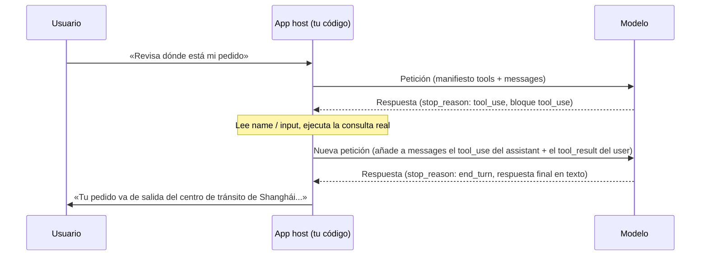

# Lección 2: La ida y vuelta completa de una llamada a herramienta

> Objetivos de aprendizaje:
> - Nombrar los campos clave que llevan la petición y la respuesta en una ida y vuelta de llamada a herramienta
> - Distinguir si un fragmento de código con tool_use / tool_result está emparejado correctamente
> - Detectar una dependencia de datos entre llamadas del mismo lote paralelo, y saber cuándo dividir las llamadas en dos rondas
> - Explicar por qué la frase «el modelo llama a una herramienta» es en sí misma imprecisa
>
> Requisitos: Has leído la Lección 1 y sabes por qué los agentes necesitan herramientas | Anterior: [Lección 1 <<](./01-why-agents-need-tools.md) | Siguiente: [Lección 3 >>](./03-tool-types.md)

## Empecemos con tres bloques de JSON

Estás construyendo un bot de soporte. Un usuario pregunta: «¿Puedes revisar dónde está mi pedido ORD-2026-8842?». Tu código envía ese mensaje al modelo junto con una definición de herramienta:

```json
{
  "model": "claude-sonnet-5",
  "tools": [
    {
      "name": "get_order_status",
      "description": "Consulta el estado actual y la información de envío de un pedido. Úsala cuando un usuario pregunte por el avance de un pedido, el envío o el tiempo estimado de entrega.",
      "input_schema": {
        "type": "object",
        "properties": {
          "order_id": { "type": "string", "description": "El número de pedido, con la forma ORD-2026-0001" }
        },
        "required": ["order_id"]
      }
    }
  ],
  "messages": [
    { "role": "user", "content": "¿Puedes revisar dónde está mi pedido ORD-2026-8842?" }
  ]
}
```

Fíjate en el nuevo campo `tools`. No es un mensaje; es un manifiesto que le dice al modelo qué herramientas tiene a mano, cómo es cada una y qué parámetros necesita cada una.[^S3] Tienes que enviar este manifiesto con cada petición — el modelo no lo «recuerda», así que tu código tiene que incluirlo cada vez.

El modelo lee el manifiesto y, en lugar de responder directamente el estado del pedido, devuelve algo así:

```json
{
  "id": "msg_01A2b3C4d5E6f7G8h9",
  "role": "assistant",
  "stop_reason": "tool_use",
  "content": [
    { "type": "text", "text": "Déjame revisar ese pedido." },
    { "type": "tool_use", "id": "toolu_01XYZ89AbCdEfGhIjKlMnOp", "name": "get_order_status", "input": { "order_id": "ORD-2026-8842" } }
  ]
}
```

Aquí aparecen dos cosas nuevas: `stop_reason` ha pasado a ser `"tool_use"`, y el array `content` tiene un bloque nuevo con `type: "tool_use"`. El modelo no ha consultado ninguna información del pedido — ni siquiera sabe dónde vive el sistema de pedidos. Solo está diciendo: «necesito que llames a `get_order_status` por mí con estos parámetros y luego me digas el resultado».

Tu código toma el relevo a partir de aquí, consulta realmente el sistema de pedidos, obtiene un resultado y empaqueta ese resultado en la siguiente petición para devolverlo:

```json
{
  "model": "claude-sonnet-5",
  "tools": [ /* igual que arriba; esta ronda también lo necesita */ ],
  "messages": [
    { "role": "user", "content": "¿Puedes revisar dónde está mi pedido ORD-2026-8842?" },
    {
      "role": "assistant",
      "content": [
        { "type": "text", "text": "Déjame revisar ese pedido." },
        { "type": "tool_use", "id": "toolu_01XYZ89AbCdEfGhIjKlMnOp", "name": "get_order_status", "input": { "order_id": "ORD-2026-8842" } }
      ]
    },
    {
      "role": "user",
      "content": [
        {
          "type": "tool_result",
          "tool_use_id": "toolu_01XYZ89AbCdEfGhIjKlMnOp",
          "content": "{\"status\":\"in_transit\",\"location\":\"centro de tránsito de Shanghái\",\"eta\":\"2026-08-27\"}"
        }
      ]
    }
  ]
}
```

Fíjate en lo que se añadió: la respuesta completa del modelo de la ronda anterior se vuelve a soltar literalmente dentro de `messages`, seguida de un nuevo mensaje `user`. Ese mensaje no contiene texto que el usuario escribiera — contiene un bloque `type: "tool_result"` cuyo `tool_use_id` coincide exactamente con el id que el modelo acaba de entregarte.

Solo después de ver esta petición el modelo dice por fin algo como: «Tu pedido va de salida del centro de tránsito de Shanghái, con entrega prevista para el 27 de agosto». Tres bloques de JSON, tres cambios de rol: el modelo hace una petición, tu código la ejecuta, el resultado se devuelve. Eso es toda una ida y vuelta de llamada a herramienta.

## stop_reason es una señal, no un registro de ejecución

Esto es lo que más a menudo malinterpretan quienes empiezan: suponen que `stop_reason: "tool_use"` significa que la herramienta ya se llamó. No es así. Es solo la razón del modelo para haber parado al terminar este mensaje, el mismo tipo de campo que `"end_turn"` (ha terminado de hablar) o `"max_tokens"` (se quedó sin espacio), solo que con un valor distinto.[^S2]

El modelo nunca toca una base de datos, ni dispara una petición HTTP, ni ejecuta un comando de shell por su cuenta. Todo lo que puede hacer es emitir una petición estructurada; el resto del trabajo recae en tu código o en los servidores de Anthropic.[^S4] Por eso las herramientas se dividen en «client tools» (las ejecuta la aplicación host) y «server tools» (las ejecuta Anthropic en tu nombre) — la diferencia está solo en quién ejecuta este paso, no en si el modelo puede ejecutarlo él mismo.[^S2]

```agentmentor-check
{
  "id": "tool-zh-02-stop-reason-meaning",
  "label": "Decidir qué ha ocurrido tras stop_reason: tool_use",
  "prompt": "Recibes una respuesta del modelo. stop_reason es «tool_use», y content contiene un bloque tool_use cuyo name es send_email. En este momento, ¿ya se ha enviado el correo del usuario?",
  "whyHere": "Acabamos de establecer que stop_reason es solo una señal, no un registro de ejecución. Esto comprueba si el estudiante todavía arrastra la idea equivocada común de que un bloque tool_use devuelto significa que la herramienta ya se ejecutó.",
  "mode": "single",
  "choices": [
    {
      "id": "a",
      "text": "Sí, ya se envió. Un bloque tool_use devuelto es la señal de que la ejecución está hecha.",
      "correct": false,
      "feedback": "No. Un bloque tool_use es solo la petición del modelo, el equivalente a que diga «por favor, llama a send_email por mí con estos parámetros». El modelo no tiene acceso a la red y no puede enviar nada; el código que realmente envía el correo solo se ejecuta después de que la aplicación host lee este bloque."
    },
    {
      "id": "b",
      "text": "Todavía no. Tu código tiene que leer los parámetros del bloque tool_use y llamar a tu propia lógica de envío de correo.",
      "correct": true,
      "feedback": "Correcto. stop_reason: tool_use solo significa que el modelo ha entregado una solicitud. La ejecución siempre se queda en la aplicación host, y el correo se envía realmente después de que tu código extrae name e input y llama a tu propia función de envío."
    }
  ]
}
```

## Los tres campos de un bloque tool_use, ninguno opcional

Vuelve a mirar ese bloque `tool_use`. Solo tres de sus campos son obligatorios:[^S5]

- **`id`**: el identificador único de esta llamada, con la forma `toolu_01XYZ...`. Tiene exactamente una función: emparejar las cosas cuando devuelvas el resultado más adelante.
- **`name`**: la herramienta que el modelo eligió, que tiene que coincidir exactamente con el `name` de una de las herramientas de tu manifiesto `tools`.
- **`input`**: un objeto que contiene los parámetros de esta llamada, con la forma que exigen las reglas que definiste en `input_schema`.

Junta esos tres campos y tienes todo lo que el modelo puede expresar: «quiero llamar a la herramienta `name` con este `id`, y aquí está el `input`». No le añadirá lógica del tipo «reintenta tres veces» — eso lo escribes tú mismo en el código del host. Cómo diseñar una interfaz de herramienta para que el modelo cometa menos errores de parámetros es terreno de la Lección 3; esta lección solo se ocupa de cómo se empaquetan y se leen estos tres campos.

## tool_result se empareja mediante tool_use_id

Una sola respuesta del modelo puede contener más de un bloque `tool_use`. Digamos que el usuario pregunta: «¿Puedes revisar dónde está mi pedido ORD-2026-8842 y también si el ORD-2026-9001 ya se envió?». El modelo pone dos bloques `tool_use` en el mismo array `content`, y `stop_reason` sigue siendo `"tool_use"`.

Tu código tiene que consultar los dos pedidos y luego, en el **mismo** mensaje `user`, soltar los dos resultados juntos en el array `content`, con cada `tool_result` reclamando su llamada mediante su propio `tool_use_id`:

```json
{
  "role": "user",
  "content": [
    {
      "type": "tool_result",
      "tool_use_id": "toolu_01XYZ89AbCdEfGhIjKlMnOp",
      "content": "{\"status\":\"in_transit\",\"eta\":\"2026-08-27\"}"
    },
    {
      "type": "tool_result",
      "tool_use_id": "toolu_02QRS45TuVwXyZaBcDeFgH",
      "content": "{\"status\":\"pending\",\"eta\":null}"
    }
  ]
}
```

Si tomas un atajo y envías una ronda solo con el primer `tool_use_id`, el modelo se niega a continuar la conversación, porque «la ronda anterior tenía un bloque `tool_use` que nunca recibió su `tool_result`» — los dos bloques tienen que reclamarse juntos en el siguiente mensaje `user`; no puedes repartirlos entre dos peticiones y devolverlos por lotes.[^S21] El bloque `tool_result` también tiene un campo opcional `is_error`: ponlo en `true` cuando la herramienta falle, y el modelo sabrá que esta llamada tuvo un problema.[^S5]

```agentmentor-check
{
  "id": "tool-zh-02-batched-tool-result",
  "label": "Cómo devolver los resultados de varios bloques tool_use",
  "prompt": "La respuesta del modelo en esta ronda tiene dos bloques tool_use (cada uno llama a una herramienta distinta), y stop_reason sigue siendo tool_use. Ya has ejecutado las dos herramientas. ¿Cómo deberías devolver los resultados?",
  "whyHere": "Acabamos de cubrir que tool_result se empareja mediante tool_use_id. Esto comprueba si el estudiante entiende que, cuando una respuesta tiene varias llamadas, los resultados deben volver como lote y no repartidos entre peticiones separadas.",
  "mode": "single",
  "choices": [
    {
      "id": "a",
      "text": "Enviar dos peticiones separadas, un tool_result en cada una, terminando la primera antes de enviar la segunda.",
      "correct": false,
      "feedback": "En la primera petición, el otro bloque tool_use todavía no ha recibido su tool_result, así que la conversación no puede avanzar. Los dos bloques tienen que reclamarse en el mismo mensaje user nuevo — espera a que los dos se hayan ejecutado, luego empaquétalos y envíalos."
    },
    {
      "id": "b",
      "text": "Poner los dos bloques tool_result en el array content de un único mensaje user, cada uno emparejado por su propio tool_use_id.",
      "correct": true,
      "feedback": "Correcto. Por muchos bloques tool_use que haya en una respuesta, el siguiente mensaje user necesita esa misma cantidad de bloques tool_result, emparejados uno a uno mediante tool_use_id, todos empaquetados en el mismo mensaje y enviados juntos."
    }
  ]
}
```

## Las llamadas del mismo lote no pueden ver los resultados de las demás

Ahora que la regla de devolución por lotes está fijada, hay una trampa más profunda: la **dependencia de datos** entre bloques `tool_use` del mismo lote.

Cambiemos de escenario. Un agente de transferencias está configurado con dos herramientas: `read_balance(account_id)` lee el saldo, y `withdraw(account_id, amount)` saca dinero. El usuario dice: «Saca \$100 de A001, si hay suficiente». En una sola respuesta, el modelo devuelve dos bloques `tool_use`: `read_balance({"account_id": "A001"})` y `withdraw({"account_id": "A001", "amount": 100})`.

Mira el `amount` de `withdraw`: 100, copiado directamente del número en la frase del usuario, sin ninguna relación con si el saldo alcanza. Esto no es que el modelo sea perezoso; no tiene alternativa. En el momento en que genera esta respuesta, `read_balance` todavía es solo «algo que planea hacer» — su valor de retorno ni siquiera existe aún, así que `withdraw` no puede leerlo. Dentro de un lote de bloques `tool_use`, ninguna llamada puede ver los resultados de las otras de ese lote, porque en ese punto esos resultados no se han ejecutado ni devuelto.

Así que aquí va una línea que tienes que sostener tú mismo: **si el parámetro de una operación de escritura debería, en teoría, ser igual al valor de retorno de una operación de lectura del mismo lote, esas dos llamadas no deberían aparecer en la misma respuesta.** El enfoque genuinamente seguro es dividirlas en dos rondas: ejecuta primero solo `read_balance`, devuelve el saldo real como `tool_result`, y una vez que el modelo vea «el saldo es solo 60», deja que decida si llama a `withdraw` y por cuánto.

Tres tácticas que funcionan de verdad:

1. **Escribe la precondición en la descripción de la herramienta.** Añade una línea a la `description` de `withdraw`: «llámala solo después de haber visto el último saldo devuelto por read_balance». La descripción de la herramienta es en sí misma parte del prompt que el modelo puede leer, lo cual es mucho más fiable que esperar que el modelo deduzca la dependencia por su cuenta.[^S8]
2. **Desactiva el paralelismo con disable_parallel_tool_use.** Pon `{"type": "auto", "disable_parallel_tool_use": true}` en el `tool_choice` de la petición, y el modelo llamará como mucho a una herramienta por respuesta.[^S21] Ajusta primero el comportamiento a una llamada cada vez, ten claras en la cabeza las dependencias entre pasos, y solo entonces plantéate aflojarlo.
3. **Ponle una red de seguridad en la capa de ejecución.** Haz que el código que ejecuta `withdraw` vuelva a comprobar por su cuenta el último saldo, se niegue a ejecutarse si no se cumple la condición, y escriba la razón en la información de error del `tool_result` para que el modelo la vea, en lugar de fingir que tuvo éxito. Aunque el modelo vuelva a agrupar las dos llamadas esta vez, esta comprobación atrapa el riesgo.

## Dibújalo como un diagrama

Dibuja la ida y vuelta de arriba y se ve así:



El paso que más a menudo se hace mal en este diagrama es la flecha de «añadir»: enviar solo el `tool_result` por su cuenta y olvidarse de soltar de vuelta en `messages` la respuesta `tool_use` completa del modelo de esa ronda. El modelo recibe entonces un resultado de herramienta que aparece de la nada, sin ningún registro en su contexto de la petición que hizo — se vuelve probable un despropósito, o directamente un error. Lo correcto es guardar literalmente en el historial la respuesta de cada ronda; `messages` solo crece y nunca se recorta.[^S4]

## Una tarea puede requerir más de una ida y vuelta

El ejemplo de arriba terminó tras una sola llamada a herramienta. En escenarios reales, el modelo a menudo tiene que ir y venir varias veces antes de poder terminar. Imagina un bot de despliegue. El usuario dice: «Reinicia el servicio por mí, y dime si hay algún error en los logs»:

1. El modelo devuelve `tool_use` en la primera ronda, llamando a `restart_service`; tú lo ejecutas y devuelves el resultado
2. El modelo vuelve a devolver `tool_use` en la segunda ronda, llamando a `read_logs` para buscar errores; tú lo ejecutas y devuelves los logs
3. En la tercera ronda el modelo por fin devuelve `stop_reason: "end_turn"`, con un resumen en texto

La lógica del código en el lado del host es esencialmente un bucle: mientras `stop_reason` siga siendo `"tool_use"`, sigue ejecutando herramientas, empaquetando los resultados de vuelta y enviando otra ronda; en cuanto pase a `"end_turn"`, entrega el texto final al usuario.[^S4]

```javascript
// tools es tu lista de definiciones de herramientas, como el array tools de la petición inicial de esta lección
const messages = [{ role: "user", content: userInput }];

let response = await callModel({ tools, messages });

while (response.stop_reason === "tool_use") {
  const toolUseBlocks = response.content.filter(b => b.type === "tool_use");

  messages.push({ role: "assistant", content: response.content });

  const toolResults = await Promise.all(
    toolUseBlocks.map(async (block) => ({
      type: "tool_result",
      tool_use_id: block.id,
      content: await executeTool(block.name, block.input),
    }))
  );

  messages.push({ role: "user", content: toolResults });

  response = await callModel({ tools, messages });
}

// stop_reason ha pasado a end_turn; response contiene la respuesta final en texto
```

Este bucle no tiene un tope fijo de iteraciones — para una misma petición del usuario, el modelo podría llamar a una herramienta una sola vez, o cinco o seis veces antes de haber reunido lo suficiente. La Lección 3 cubre cómo el diseño de la interfaz de herramientas puede recortar el número de idas y vueltas; para esta lección, recuerda solo esto: varias idas y vueltas son la norma, no la excepción.

## Cambia el host, cambian los nombres de campo, la estructura no

Si estás en una API compatible con OpenAI, el mismo mecanismo viene con otro envoltorio: la petición de llamada aparece en el array `choices[0].message.tool_calls`, la señal de finalización no se llama `stop_reason` sino `finish_reason`, y su valor es `"tool_calls"` en lugar de `"tool_use"`.[^S7] La documentación oficial de OpenAI describe el proceso como "a multi-step conversation between your application and a model via the OpenAI API. When the model calls a function, you must execute it and return the result" (una conversación de varios pasos entre tu aplicación y un modelo a través de la API de OpenAI; cuando el modelo llama a una función, tú debes ejecutarla y devolver el resultado) — el modelo emite una petición de llamada, la aplicación la ejecuta y devuelve el resultado, exactamente igual que con Claude.[^S1]

Los nombres de los campos cambian con la API, pero el esqueleto — «el modelo solo envía peticiones, el host se encarga de la ejecución, los resultados vuelven llevando un identificador, y puede repetirse varias rondas» — es universal.

<!-- exercises -->
## 💻 Ejercicios

### Nivel 1: Escribe a mano la petición con tool_result

El modelo devolvió esta respuesta (`stop_reason` es `"tool_use"`):

```json
{
  "role": "assistant",
  "stop_reason": "tool_use",
  "content": [
    { "type": "tool_use", "id": "toolu_01Weather9527", "name": "get_weather", "input": { "city": "Hangzhou" } }
  ]
}
```

Llamaste a tu propia función de consulta del clima y obtuviste el resultado: soleado, 26 grados Celsius.

En tu editor, escribe el array `messages` completo para la siguiente petición (el mensaje original del usuario + la respuesta del assistant de esta ronda + el mensaje tool_result que construyas), con estos requisitos:

1. El `tool_use_id` coincide exactamente con el `id` de la respuesta de arriba
2. El `content` del `tool_result` es un texto que un programa puede parsear (una cadena JSON, por ejemplo)
3. Los tres mensajes del array tienen los valores de `role` `user`, `assistant`, `user` en ese orden

<!-- rubric -->
- El array `messages` contiene tres mensajes, en el orden correcto y con los roles correctos
- El `tool_use_id` del bloque `tool_result` es exactamente `toolu_01Weather9527`, no una cadena inventada
- El `content` del `tool_result` lleva los datos reales del clima, en un formato que el código posterior pueda parsear

<!-- answer -->
```json
[
  { "role": "user", "content": "¿Qué tiempo hace en Hangzhou?" },
  {
    "role": "assistant",
    "content": [
      { "type": "tool_use", "id": "toolu_01Weather9527", "name": "get_weather", "input": { "city": "Hangzhou" } }
    ]
  },
  {
    "role": "user",
    "content": [
      {
        "type": "tool_result",
        "tool_use_id": "toolu_01Weather9527",
        "content": "{\"condition\":\"sunny\",\"temperature_c\":26}"
      }
    ]
  }
]
```

<!-- hint -->
El segundo mensaje viene de la respuesta del modelo — basta con llevar su `role` y su `content` directamente al array. Los campos de metadatos de nivel superior como `stop_reason` no forman parte del mensaje en sí, así que déjalos fuera.

<!-- hint -->
El `tool_result` no necesita un id nuevo. Su `tool_use_id` es solo el `id` que el modelo te dio, copiado carácter por carácter.

### Nivel 2: Encuentra los tres errores en el código de la ida y vuelta

El código de abajo intenta implementar la lógica de «llamar a una herramienta, devolver el resultado», pero hay tres cosas que impedirán que el modelo obtenga el resultado correcto, o harán que la conversación falle. Encuentra los problemas y escribe la versión corregida. (Supón que la respuesta del modelo tiene un solo bloque `tool_use`.)

```javascript
async function handleTurn(userMessage, tools) {
  const messages = [{ role: "user", content: userMessage }];
  const response = await callModel({ tools, messages });

  if (response.stop_reason === "tool_use") {
    const toolBlock = response.content.find(b => b.type === "tool_use");
    const result = await executeTool(toolBlock.name, toolBlock.input);

    messages.push({
      role: "user",
      content: [{ type: "tool_result", tool_use_id: toolBlock.name, content: result }],
    });

    const finalResponse = await callModel({ messages });
    return finalResponse;
  }

  return response;
}
```

<!-- rubric -->
- Identifica y explica tres problemas concretos, cada uno señalando una línea exacta del código
- El código corregido añade el `response.content` del modelo a `messages`
- El código corregido usa `toolBlock.id`, no `toolBlock.name`, para `tool_use_id`
- La segunda llamada a `callModel` corregida incluye `tools`

<!-- answer -->
Tres problemas:

1. **`tool_use_id: toolBlock.name` usa el campo equivocado.** Debería ser `toolBlock.id` — `name` es el nombre de la herramienta, no el identificador único de esta llamada, así que el modelo no puede emparejar contra él.
2. **`response.content` nunca se añade a `messages`.** Saltar directamente de un único mensaje `user` a añadir el `tool_result` significa que el modelo no tiene registro de la petición que hizo en la siguiente ronda, y el contexto queda roto.
3. **La segunda llamada `callModel({ messages })` no incluye `tools`.** El manifiesto de herramientas tiene que ir en cada ronda, o el modelo no encontrará las definiciones de herramientas cuando una tarea necesite más de una ida y vuelta.

Corregido, los cambios clave son estos tres puntos (el resto del código se queda igual):

```javascript
messages.push({ role: "assistant", content: response.content }); // añade esta línea
messages.push({
  role: "user",
  content: [{ type: "tool_result", tool_use_id: toolBlock.id, content: result }], // .id, no .name
});
const finalResponse = await callModel({ tools, messages }); // incluye tools
```

<!-- hint -->
Compáralo línea por línea con el ejemplo de JSON de la sección «stop_reason es una señal, no un registro de ejecución» de esta lección: en una ida y vuelta real, ¿cuántos mensajes aparecen en el array `messages`, y cuál es el `role` de cada uno?

<!-- hint -->
Pregúntate: si esta tarea necesitara que el modelo llamara a herramientas dos veces seguidas (consultar el inventario primero, luego consultar el precio), ¿tendría todavía la segunda llamada a `callModel` de este código un parámetro `tools` con el que trabajar? Si no, ¿con qué iniciaría el modelo un segundo `tool_use`?

<!-- /exercises -->

## Resumen

- El modelo nunca ejecuta nada directamente. Solo emite `stop_reason: "tool_use"` más uno o varios bloques `tool_use`; la ejecución se queda en la aplicación host
- Un bloque `tool_use` tiene solo tres campos obligatorios: `id` (para emparejar), `name` (la herramienta elegida) e `input` (los parámetros)
- Los resultados vuelven como bloques `tool_result`, y `tool_use_id` tiene que coincidir exactamente con el `id` del bloque `tool_use` correspondiente
- Una respuesta puede tener varios bloques `tool_use`; los bloques `tool_result` que les corresponden tienen que empaquetarse en el **mismo** mensaje `user`, no repartirse entre varias peticiones
- Los bloques `tool_use` del mismo lote no pueden ver los resultados de ejecución de los demás: si el parámetro de una operación de escritura depende del valor de retorno de una operación de lectura del mismo lote, divídelas en dos rondas, o fuerza una llamada cada vez con `disable_parallel_tool_use`
- Una tarea puede requerir varias idas y vueltas: la implementación del lado del host es esencialmente un bucle — sigue ejecutando y devolviendo mientras `stop_reason` siga siendo `"tool_use"`, y solo termina cuando pase a `"end_turn"`

[>> Lección 3: Cinco tipos comunes de herramientas: leer, escribir, ejecutar, buscar, llamar](./03-tool-types.md)
