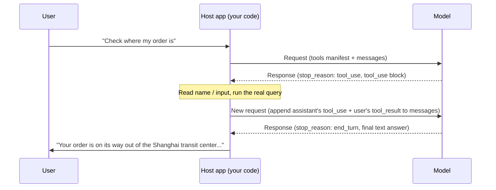

# レッスン2: ツール呼び出しの完全なラウンドトリップ

> 学習目標:
> - 1回のツール呼び出しラウンドトリップにおいて、リクエストとレスポンスがそれぞれ持つキーフィールドの名前を言える
> - tool_use / tool_result コードの一部が正しくマッチしているかどうかを判断できる
> - 同じ並列バッチ内の呼び出し間のデータ依存関係を見抜き、呼び出しを2ラウンドに分割すべきタイミングを知る
> - 「モデルがツールを呼び出す」というフレーズそのものが不正確である理由を説明できる
>
> 前提: レッスン1を読み、エージェントにツールが必要な理由を知っている | 前: [レッスン1 <<](./01-why-agents-need-tools.md) | 次: [レッスン3 >>](./03-tool-types.md)

## 3つのJSONの塊から始める

サポートボットを構築しています。ユーザーが「注文ORD-2026-8842がどこにあるか確認してもらえますか?」と尋ねます。あなたのコードはそのメッセージをツール定義と一緒にモデルに送信します:

```json
{
  "model": "claude-sonnet-5",
  "tools": [
    {
      "name": "get_order_status",
      "description": "注文の現在のステータスと配送情報を検索します。ユーザーが注文の進捗、配送、または配達予定日について尋ねたときに使用します。",
      "input_schema": {
        "type": "object",
        "properties": {
          "order_id": { "type": "string", "description": "注文番号、ORD-2026-0001の形式" }
        },
        "required": ["order_id"]
      }
    }
  ],
  "messages": [
    { "role": "user", "content": "Can you check where my order ORD-2026-8842 is?" }
  ]
}
```

新しい`tools`フィールドに注目してください。これはメッセージではありません; モデルに手元にどんなツールがあるか、それぞれがどのように見えるか、そしてそれぞれが必要とするパラメータは何かを伝えるマニフェストです。[^S3] このマニフェストはリクエストごとに送信する必要があります — モデルはそれを「記憶」しないので、あなたのコードは毎回それを含めなければなりません。

モデルはマニフェストを読み、注文ステータスを直接答える代わりに、このようなものを返します:

```json
{
  "id": "msg_01A2b3C4d5E6f7G8h9",
  "role": "assistant",
  "stop_reason": "tool_use",
  "content": [
    { "type": "text", "text": "Let me check on that order for you." },
    { "type": "tool_use", "id": "toolu_01XYZ89AbCdEfGhIjKlMnOp", "name": "get_order_status", "input": { "order_id": "ORD-2026-8842" } }
  ]
}
```

ここで2つの新しいことが現れます: `stop_reason`が`"tool_use"`になり、`content`配列に`type: "tool_use"`を持つ新しいブロックがあります。モデルは注文情報を調べていません — 注文システムがどこにあるかさえ知りません。ただ「これらのパラメータで`get_order_status`を呼び出してください、そして結果を教えてください」と言っているだけです。

ここからあなたのコードが引き継ぎ、実際に注文システムにクエリを投げ、結果を取得し、その結果を次のリクエストにパックして送り返します:

```json
{
  "model": "claude-sonnet-5",
  "tools": [ /* 上記と同じ; このラウンドもそれが必要 */ ],
  "messages": [
    { "role": "user", "content": "Can you check where my order ORD-2026-8842 is?" },
    {
      "role": "assistant",
      "content": [
        { "type": "text", "text": "Let me check on that order for you." },
        { "type": "tool_use", "id": "toolu_01XYZ89AbCdEfGhIjKlMnOp", "name": "get_order_status", "input": { "order_id": "ORD-2026-8842" } }
      ]
    },
    {
      "role": "user",
      "content": [
        {
          "type": "tool_result",
          "tool_use_id": "toolu_01XYZ89AbCdEfGhIjKlMnOp",
          "content": "{\"status\":\"in_transit\",\"location\":\"Shanghai transit center\",\"eta\":\"2026-08-27\"}"
        }
      ]
    }
  ]
}
```

何が追加されたかに注目してください: 前のラウンドのモデルの完全な応答が`messages`に逐語的に戻され、その後に新しい`user`メッセージが続きます。そのメッセージはユーザーが入力したテキストを保持していません — モデルがちょうど渡してきたidと正確に一致する`tool_use_id`を持つ`type: "tool_result"`ブロックを保持しています。

このリクエストを見て初めて、モデルは最終的に「ご注文は上海トランジットセンターを出発中で、8月27日に配達予定です」のようなことを言います。3つのJSONの塊、3つのロールの切り替え: モデルがリクエストを出し、あなたのコードがそれを実行し、結果がフィードバックされます。これが1回のツール呼び出しラウンドトリップのすべてです。

## stop_reasonはシグナルであり、実行記録ではない

初心者が最も頻繁に間違えることがこれです: `stop_reason: "tool_use"`はツールがすでに呼び出されたことを意味すると思い込むことです。そうではありません。これはモデルがこのメッセージを終えたときに停止した理由に過ぎず、`"end_turn"`(話し終わった)や`"max_tokens"`(スペースが足りなくなった)と同じ種類のフィールドで、ただ値が異なるだけです。[^S2]

モデルは決してデータベースに触れたり、HTTPリクエストを発行したり、シェルコマンドを自力で実行したりしません。できることは構造化されたリクエストを発行することだけです; 残りの作業はあなたのコードまたはAnthropicのサーバーに委ねられます。[^S4] だからこそツールは「クライアントツール」(ホストアプリケーションが実行する)と「サーバーツール」(Anthropicがあなたの代わりに実行する)に分かれています — 違いは誰がこのステップを実行するかだけで、モデルが自分でそれを実行できるかどうかではありません。[^S2]

```agentmentor-check
{
  "id": "tool-zh-02-stop-reason-meaning",
  "label": "stop_reason: tool_use後に何が起こったかを判断する",
  "prompt": "モデルからレスポンスを受け取りました。stop_reasonは「tool_use」で、contentにはnameがsend_emailであるtool_useブロックが1つあります。この時点で、ユーザーのメールはすでに送信されていますか?",
  "whyHere": "stop_reasonはシグナルに過ぎず、実行記録ではないことを確立したばかりです。これは、返されたtool_useブロックがツールがすでに実行されたことを意味するという一般的な誤解を学習者がまだ持っているかどうかをチェックします。",
  "mode": "single",
  "choices": [
    {
      "id": "a",
      "text": "はい、送信されています。返されたtool_useブロックは実行が完了したサインです。",
      "correct": false,
      "feedback": "いいえ。tool_useブロックはモデルのリクエストに過ぎず、「これらのパラメータでsend_emailを呼び出してください」と言っているのと同等です。モデルにはネットワークアクセスがなく、何も送信できません; 実際にメールを送信するコードは、ホストアプリケーションがこのブロックを読んだ後にのみ実行されます。"
    },
    {
      "id": "b",
      "text": "まだです。あなたのコードがtool_useブロックからパラメータを読み取り、自分のメール送信ロジックを呼び出す必要があります。",
      "correct": true,
      "feedback": "正解です。stop_reason: tool_useはモデルがリクエストスリップを渡したことを意味するだけです。実行は常にホストアプリケーションにあり、メールは実際にあなたのコードがnameとinputを解析し、自分の送信関数を呼び出した後に送信されます。"
    }
  ]
}
```

## tool_useブロックの3つのフィールド、どれもオプションではない

その`tool_use`ブロックを見返してください。必須フィールドは3つだけです:[^S5]

- **`id`**: この呼び出しの一意の識別子で、`toolu_01XYZ...`の形式です。1つの仕事しかありません — 後で結果を送り返すときに照合することです。
- **`name`**: モデルが選んだツールで、`tools`マニフェスト内のツールの1つの`name`と正確に一致しなければなりません。
- **`input`**: この呼び出しのパラメータを保持するオブジェクトで、`input_schema`で定義したルールを満たすように形成されています。

これら3つのフィールドをまとめると、モデルが表現できるすべてが揃います:「この`id`で`name`ツールを呼び出したい、そしてこれが`input`です。」「3回リトライ」のようなロジックを付け加えることはありません — それはホストコードで自分で書きます。モデルがパラメータミスを減らすようにツールインターフェースを設計する方法はレッスン3の領域です; このレッスンはこれら3つのフィールドがどのようにパックされ、読み返されるかだけを気にします。

## tool_resultはtool_use_idで照合する

モデルからの1つの応答には複数の`tool_use`ブロックが含まれることがあります。ユーザーが「注文ORD-2026-8842がどこにあるか確認して、それとORD-2026-9001が発送されたかどうかも確認してください」と尋ねたとします。モデルは同じ`content`配列に2つの`tool_use`ブロックを入れ、`stop_reason`は依然として`"tool_use"`です。

あなたのコードは両方の注文を調べ、それから**同じ**`user`メッセージで、両方の結果を`content`配列に一緒に入れ、各`tool_result`が自分の`tool_use_id`で呼び出しを主張します:

```json
{
  "role": "user",
  "content": [
    {
      "type": "tool_result",
      "tool_use_id": "toolu_01XYZ89AbCdEfGhIjKlMnOp",
      "content": "{\"status\":\"in_transit\",\"eta\":\"2026-08-27\"}"
    },
    {
      "type": "tool_result",
      "tool_use_id": "toolu_02QRS45TuVwXyZaBcDeFgH",
      "content": "{\"status\":\"pending\",\"eta\":null}"
    }
  ]
}
```

ショートカットを取って最初の`tool_use_id`だけで1ラウンド送信すると、モデルは会話を続けることを拒否します。なぜなら「前のラウンドには`tool_result`を得なかった`tool_use`ブロックがあった」からです — 両方のブロックは次の`user`メッセージで一緒に主張される必要があります; それらを2つのリクエストに分割してバッチで送り返すことはできません。[^S21] `tool_result`ブロックにはオプションの`is_error`フィールドもあります: ツールが失敗したときに`true`に設定すると、モデルはこの呼び出しが問題に遭遇したことを知ります。[^S5]

```agentmentor-check
{
  "id": "tool-zh-02-batched-tool-result",
  "label": "複数のtool_useブロックに対して結果をどう送り返すか",
  "prompt": "このラウンドのモデルのレスポンスには2つのtool_useブロック(それぞれ異なるツールを呼び出している)があり、stop_reasonは依然としてtool_useです。両方のツールを実行しました。結果をどのように送り返すべきですか?",
  "whyHere": "tool_resultがtool_use_idで照合されることをちょうどカバーしました。これは、1つの応答に複数の呼び出しがある場合、結果は別々のリクエストに分割するのではなくバッチとして戻す必要があることを学習者が理解しているかどうかをチェックします。",
  "mode": "single",
  "choices": [
    {
      "id": "a",
      "text": "2つの別々のリクエストを送信し、それぞれ1つのtool_resultで、最初のものを終えてから2つ目を送信する。",
      "correct": false,
      "feedback": "最初のリクエストでは、もう一方のtool_useブロックがまだtool_resultを得ていないので、会話は前に進めません。両方のブロックは同じ新しいuserメッセージで主張される必要があります — 両方が実行されるまで待ってから、パッケージ化して送信します。"
    },
    {
      "id": "b",
      "text": "両方のtool_resultブロックを1つのuserメッセージのcontent配列に入れ、それぞれ自分のtool_use_idで照合する。",
      "correct": true,
      "feedback": "正解です。1つのレスポンスにいくつtool_useブロックがあっても、次のuserメッセージにはその数だけtool_resultブロックが必要で、tool_use_idで1対1に照合され、すべて同じメッセージにパッケージ化されて一緒に送信されます。"
    }
  ]
}
```

## 同じバッチ内の呼び出しは互いの結果を見ることができない

バッチ返却ルールが確立されたので、より深い罠があります: 同じバッチ内の`tool_use`ブロック間の**データ依存関係**です。

シナリオを切り替えます。送金エージェントが2つのツールで設定されています: `read_balance(account_id)`は残高を読み、`withdraw(account_id, amount)`はお金を引き出します。ユーザーが「A001から\$100を引き出して、十分あるなら」と言います。1つのレスポンスで、モデルは2つの`tool_use`ブロックを返します: `read_balance({"account_id": "A001"})`と`withdraw({"account_id": "A001", "amount": 100})`。

`withdraw`の`amount`を見てください: 100、ユーザーの文の数字から直接コピーされ、残高が十分かどうかとは無関係です。これはモデルが怠惰だからではありません; 選択肢がないのです。このレスポンスを生成する瞬間、`read_balance`はまだ「それがやろうとしていること」に過ぎません — その戻り値はまだ存在していないので、`withdraw`はそれを読むことができません。1つのバッチの`tool_use`ブロック内では、どの呼び出しもそのバッチ内の他の呼び出しの結果を見ることができません。なぜならそれらの結果はその時点でまだ実行されておらず送り返されていないからです。

だからあなた自身が守らなければならない線がこれです: **書き込み操作のパラメータが、理論上は同じバッチ内の読み取り操作の戻り値と等しくあるべきなら、その2つの呼び出しは同じレスポンスに現れるべきではありません。** 本当に安全なアプローチは、それらを2ラウンドに分割することです: まず`read_balance`だけを実行し、実際の残高を`tool_result`として送り返し、モデルが「残高は60しかない」と見たら、`withdraw`を呼び出すかどうか、いくらで呼び出すかを決めさせます。

実際に機能する3つの戦術:

1. **ツールの説明に前提条件を書く。** `withdraw`の`description`に一行追加します:「read_balanceから返された最新の残高を見た後にのみ呼び出してください。」ツールの説明はモデルが読めるプロンプトの一部そのものなので、モデルが依存関係を自力で把握することを期待するよりもはるかに信頼できます。[^S8]
2. **disable_parallel_tool_useで並列性をオフにする。** リクエストの`tool_choice`に`{"type": "auto", "disable_parallel_tool_use": true}`を設定すると、モデルは1レスポンスにつき最大1つのツールを呼び出します。[^S21] 動作をまず1回ずつに絞り、ステップ間の依存関係を頭の中で明確にし、その後でそれを緩めることを検討します。
3. **実行レイヤーでバックストップする。** `withdraw`を実行するコードに最新の残高を再チェックさせ、条件が満たされていない場合は実行を拒否し、理由を`tool_result`エラー情報に書いてモデルに見せます。成功したふりをするのではなく。たとえモデルが今回また2つの呼び出しをバンドルしても、このチェックがリスクを捕捉します。

## 図として描く

上記のラウンドトリップを描くとこのようになります:



この図で最も頻繁に間違えられるステップは「append」矢印です: `tool_result`だけを単独で送信し、そのラウンドのモデルの完全な`tool_use`応答を`messages`に戻すのを忘れることです。すると、モデルは自分が出したリクエストの記録がコンテキストにないまま、どこからともなく現れたツール結果を受け取ることになります — 論理の飛躍やあからさまなエラーが起こりやすくなります。正しい動きは、毎ラウンドのレスポンスを逐語的に履歴に保存することです; `messages`は常に長くなるだけで、決してトリミングされません。[^S4]

## 1つのタスクが複数回のラウンドトリップを必要とすることがある

上記の例は1回のツール呼び出しの後に終わりました。実際のシナリオでは、モデルは完了する前に何度も往復することがよくあります。デプロイボットを想像してください。ユーザーが「サービスを再起動して、ログにエラーがないか教えて」と言います:

1. モデルは最初のラウンドで`tool_use`を返し、`restart_service`を呼び出します; あなたはそれを実行し、結果を送り返します
2. モデルは2回目のラウンドで再び`tool_use`を返し、`read_logs`を呼び出してエラーをチェックします; あなたはそれを実行し、ログを送り返します
3. 3回目のラウンドで、モデルは最終的に`stop_reason: "end_turn"`を返し、テキストで要約します

ホスト側のコードロジックは本質的にループです: `stop_reason`がまだ`"tool_use"`である限り、ツールを実行し続け、結果をパックし直し、別のラウンドを送信します; `"end_turn"`になったら、最終テキストをユーザーに渡します。[^S4]

```javascript
// toolsはこのレッスンの冒頭のリクエストのtoolsのような、ツール定義のリスト
const messages = [{ role: "user", content: userInput }];

let response = await callModel({ tools, messages });

while (response.stop_reason === "tool_use") {
  const toolUseBlocks = response.content.filter(b => b.type === "tool_use");

  messages.push({ role: "assistant", content: response.content });

  const toolResults = await Promise.all(
    toolUseBlocks.map(async (block) => ({
      type: "tool_result",
      tool_use_id: block.id,
      content: await executeTool(block.name, block.input),
    }))
  );

  messages.push({ role: "user", content: toolResults });

  response = await callModel({ tools, messages });
}

// stop_reasonがend_turnになった; responseは最終テキスト回答を保持
```

このループには反復回数の固定上限がありません — 1つのユーザーリクエストに対して、モデルは1回だけツールを呼び出すかもしれませんし、十分に集めるまで5回か6回呼び出すかもしれません。レッスン3では、ツールインターフェース設計がラウンドトリップ回数をどのように削減できるかをカバーします; このレッスンでは、ただ覚えておいてください: 複数回のラウンドトリップは例外ではなく標準です。

## ホストを交換すると、フィールド名は変わるが、構造は変わらない

OpenAI互換APIを使用している場合、同じメカニズムが異なるラッパーで提供されます: 呼び出しリクエストは`choices[0].message.tool_calls`配列に現れ、終了シグナルは`stop_reason`ではなく`finish_reason`と呼ばれ、その値は`"tool_use"`ではなく`"tool_calls"`です。[^S7] OpenAIの公式ドキュメントはこのプロセスを次のように説明しています:

> "Tool calling is a multi-step conversation between your application and a model via the OpenAI API. When the model calls a function, you must execute it and return the result"

(ツール呼び出しは、OpenAI APIを介したアプリケーションとモデル間の複数ステップの会話です。モデルが関数を呼び出すとき、あなたはそれを実行して結果を返さなければなりません) — モデルが呼び出しリクエストを発行し、アプリケーションがそれを実行して結果を送り返す、まさにClaudeと同じです。[^S1]

フィールド名はAPIによって変わりますが、骨格 — 「モデルはリクエストを送るだけ、ホストが実行を処理する、結果は識別子を運んで戻ってくる、そして複数ラウンドをループすることがある」 — は普遍的です。

<!-- exercises -->
## 💻 演習

### レベル1: tool_resultリクエストを手書きする

モデルがこのレスポンスを返しました(`stop_reason`は`"tool_use"`):

```json
{
  "role": "assistant",
  "stop_reason": "tool_use",
  "content": [
    { "type": "tool_use", "id": "toolu_01Weather9527", "name": "get_weather", "input": { "city": "Hangzhou" } }
  ]
}
```

あなたは自分の天気検索関数を呼び出し、結果を得ました: 晴れ、26度。

エディタで、次のリクエストのための完全な`messages`配列(元のユーザーメッセージ + このラウンドのアシスタントレスポンス + あなたが構築するtool_resultメッセージ)を書いてください。これらの要件で:

1. `tool_use_id`が上記のレスポンスの`id`と正確に一致する
2. `tool_result`の`content`がプログラムが解析できるテキスト(例えばJSON文字列)である
3. 配列内の3つのメッセージが`role`値を`user`、`assistant`、`user`の順に持つ

<!-- rubric -->
- `messages`配列に3つのメッセージが含まれ、正しい順序と正しいロールを持つ
- `tool_result`ブロックの`tool_use_id`が正確に`toolu_01Weather9527`で、作り上げた文字列ではない
- `tool_result`の`content`が実際の天気データを運び、後のコードが解析できるフォーマットである

<!-- answer -->
```json
[
  { "role": "user", "content": "What's the weather in Hangzhou?" },
  {
    "role": "assistant",
    "content": [
      { "type": "tool_use", "id": "toolu_01Weather9527", "name": "get_weather", "input": { "city": "Hangzhou" } }
    ]
  },
  {
    "role": "user",
    "content": [
      {
        "type": "tool_result",
        "tool_use_id": "toolu_01Weather9527",
        "content": "{\"condition\":\"sunny\",\"temperature_c\":26}"
      }
    ]
  }
]
```

<!-- hint -->
2番目のメッセージはモデルのレスポンスから来ています — その`role`と`content`を配列にそのまま運びます。`stop_reason`のようなトップレベルのメタデータフィールドはメッセージ自体の一部ではないので、それらを除外します。

<!-- hint -->
`tool_result`には新しいidは必要ありません。その`tool_use_id`はモデルがあなたに与えた`id`を、文字ごとにコピーしただけです。

### レベル2: ラウンドトリップコードの3つのバグを見つける

以下のコードは「ツールを呼び出し、結果を送り返す」ロジックを実装しようとしていますが、3つのことがモデルが正しい結果を得るのを妨げたり、会話をエラーにしたりします。問題を見つけて、修正版を書いてください。(モデルのレスポンスには1つの`tool_use`ブロックしかないと仮定します。)

```javascript
async function handleTurn(userMessage, tools) {
  const messages = [{ role: "user", content: userMessage }];
  const response = await callModel({ tools, messages });

  if (response.stop_reason === "tool_use") {
    const toolBlock = response.content.find(b => b.type === "tool_use");
    const result = await executeTool(toolBlock.name, toolBlock.input);

    messages.push({
      role: "user",
      content: [{ type: "tool_result", tool_use_id: toolBlock.name, content: result }],
    });

    const finalResponse = await callModel({ messages });
    return finalResponse;
  }

  return response;
}
```

<!-- rubric -->
- 3つの具体的な問題を特定して説明し、それぞれコード内の正確な行を指している
- 修正されたコードがモデルの`response.content`を`messages`に追加している
- 修正されたコードが`tool_use_id`に`toolBlock.name`ではなく`toolBlock.id`を使用している
- 修正された2回目の`callModel`呼び出しに`tools`が含まれている

<!-- answer -->
3つの問題:

1. **`tool_use_id: toolBlock.name`が間違ったフィールドを使用しています。** `toolBlock.id`であるべきです — `name`はツールの名前であり、この呼び出しの一意の識別子ではないので、モデルはそれと照合できません。
2. **`response.content`が決して`messages`に追加されていません。** 単一の`user`メッセージから`tool_result`の追加に直接ジャンプすることは、次のラウンドでモデルが自分が出したリクエストの記録を持たないことを意味し、コンテキストが壊れます。
3. **2回目の`callModel({ messages })`に`tools`が含まれていません。** ツールマニフェストは毎ラウンド付けなければならず、さもなければタスクが複数回のラウンドトリップを必要とするときにモデルがツール定義を見つけられません。

修正すると、重要な変更はこの3箇所です(残りのコードは同じまま):

```javascript
messages.push({ role: "assistant", content: response.content }); // この行を追加
messages.push({
  role: "user",
  content: [{ type: "tool_result", tool_use_id: toolBlock.id, content: result }], // .nameではなく.id
});
const finalResponse = await callModel({ tools, messages }); // toolsを含める
```

<!-- hint -->
このレッスンの「stop_reasonはシグナルであり、実行記録ではない」セクションのJSON例と一行ずつ照合してください: 実際のラウンドトリップでは、`messages`配列にいくつのメッセージが現れ、それぞれの`role`は何ですか?

<!-- hint -->
自問してください: このタスクがモデルにツールを連続2回呼び出させる必要がある場合(最初に在庫をチェック、次に価格をチェック)、このコードの2回目の`callModel`はまだ機能する`tools`パラメータを持っているでしょうか? そうでない場合、モデルは2回目の`tool_use`を開始するために何を使うのでしょうか?

<!-- /exercises -->

## まとめ

- モデルは何も直接実行しません。`stop_reason: "tool_use"`と1つ以上の`tool_use`ブロックを発行するだけです; 実行はホストアプリケーションに留まります
- `tool_use`ブロックには3つの必須フィールドしかありません: `id`(照合用)、`name`(選ばれたツール)、`input`(パラメータ)
- 結果は`tool_result`ブロックとして戻り、`tool_use_id`は対応する`tool_use`ブロックの`id`と正確に一致しなければなりません
- 1つのレスポンスには複数の`tool_use`ブロックが含まれることがあります; 照合する`tool_result`ブロックは複数のリクエストに分割するのではなく、**同じ**`user`メッセージにパックされなければなりません
- 同じバッチ内の`tool_use`ブロックは互いの実行結果を見ることができません: 書き込み操作のパラメータが同じバッチ内の読み取り操作の戻り値に依存する場合は、それらを2ラウンドに分割するか、`disable_parallel_tool_use`で1回ずつに強制します
- 1つのタスクが複数回のラウンドトリップを必要とすることがあります: ホスト側の実装は本質的にループです — `stop_reason`がまだ`"tool_use"`である間は実行と送り返しを続け、`"end_turn"`になって初めて完了します

[>> レッスン3: 5つの一般的なツールタイプ: 読む、書く、実行する、検索する、呼び出す](./03-tool-types.md)
