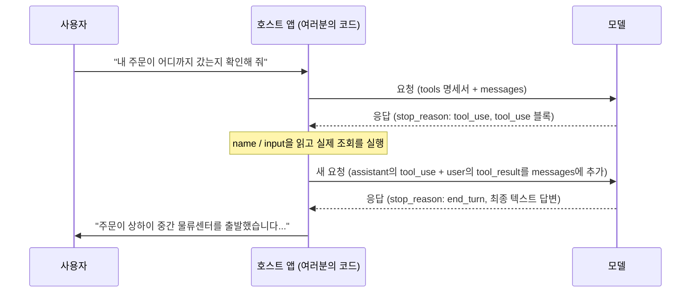

# 레슨 2: 도구 호출 한 번의 전체 왕복

> 학습 목표:
> - 도구 호출 한 번의 왕복에서 요청과 응답이 각각 지니는 핵심 필드 짚어 내기
> - tool_use / tool_result 코드가 서로 제대로 짝지어졌는지 판별하기
> - 같은 병렬 배치 안의 호출 사이에 있는 데이터 의존을 알아채고, 언제 두 라운드로 쪼개야 하는지 알기
> - '모델이 도구를 호출한다'는 표현 자체가 왜 부정확한지 설명하기
>
> 전제: 레슨 1을 읽었고 에이전트에 도구가 필요한 이유를 안다 | 이전: [레슨 1 <<](./01-why-agents-need-tools.md) | 다음: [레슨 3 >>](./03-tool-types.md)

## JSON 세 덩어리로 시작한다

여러분이 고객 지원 봇을 만들고 있다고 해 봅시다. 사용자가 "주문 ORD-2026-8842가 어디까지 갔는지 확인해 줄래?"라고 묻습니다. 여러분의 코드는 이 메시지를 도구 정의와 함께 모델에게 보냅니다.

```json
{
  "model": "claude-sonnet-5",
  "tools": [
    {
      "name": "get_order_status",
      "description": "주문의 현재 상태와 배송 정보를 조회한다. 사용자가 주문 진행 상황, 배송, 예상 도착 시간을 물을 때 사용한다.",
      "input_schema": {
        "type": "object",
        "properties": {
          "order_id": { "type": "string", "description": "주문 번호. ORD-2026-0001 형태" }
        },
        "required": ["order_id"]
      }
    }
  ],
  "messages": [
    { "role": "user", "content": "주문 ORD-2026-8842가 어디까지 갔는지 확인해 줄래?" }
  ]
}
```

새로 생긴 `tools` 필드에 주목하세요. 이것은 메시지가 아니라, 모델에게 어떤 도구가 손에 있고 각각이 어떻게 생겼으며 어떤 파라미터가 필요한지 알려 주는 명세서입니다.[^S3] 이 명세서는 매 요청마다 함께 보내야 합니다. 모델은 이것을 '기억'하지 않으므로, 여러분의 코드가 매번 넣어 주어야 합니다.

모델은 명세서를 읽고, 주문 상태를 곧바로 답하는 대신 이런 것을 반환합니다.

```json
{
  "id": "msg_01A2b3C4d5E6f7G8h9",
  "role": "assistant",
  "stop_reason": "tool_use",
  "content": [
    { "type": "text", "text": "그 주문을 확인해 보겠습니다." },
    { "type": "tool_use", "id": "toolu_01XYZ89AbCdEfGhIjKlMnOp", "name": "get_order_status", "input": { "order_id": "ORD-2026-8842" } }
  ]
}
```

여기서 새로 등장한 것이 둘 있습니다. `stop_reason`이 `"tool_use"`로 바뀌었고, `content` 배열에 `type: "tool_use"`인 블록이 새로 생겼습니다. 모델은 주문 정보를 조회하지 않았습니다. 주문 시스템이 어디에 있는지조차 모릅니다. 그저 "이 파라미터로 `get_order_status`를 대신 호출하고, 그 결과를 알려 달라"고 말하고 있을 뿐입니다.

여기서부터는 여러분의 코드가 이어받습니다. 실제로 주문 시스템에 질의해 결과를 얻고, 그 결과를 다음 요청에 담아 돌려보냅니다.

```json
{
  "model": "claude-sonnet-5",
  "tools": [ /* 위와 동일. 이번 라운드에도 필요하다 */ ],
  "messages": [
    { "role": "user", "content": "주문 ORD-2026-8842가 어디까지 갔는지 확인해 줄래?" },
    {
      "role": "assistant",
      "content": [
        { "type": "text", "text": "그 주문을 확인해 보겠습니다." },
        { "type": "tool_use", "id": "toolu_01XYZ89AbCdEfGhIjKlMnOp", "name": "get_order_status", "input": { "order_id": "ORD-2026-8842" } }
      ]
    },
    {
      "role": "user",
      "content": [
        {
          "type": "tool_result",
          "tool_use_id": "toolu_01XYZ89AbCdEfGhIjKlMnOp",
          "content": "{\"status\":\"in_transit\",\"location\":\"상하이 중간 물류센터\",\"eta\":\"2026-08-27\"}"
        }
      ]
    }
  ]
}
```

무엇이 추가되었는지 보세요. 앞 라운드에서 받은 모델의 응답 전체가 `messages`에 그대로 다시 들어갔고, 그 뒤에 새 `user` 메시지가 붙었습니다. 그 메시지에는 사용자가 입력한 텍스트가 아니라 `type: "tool_result"` 블록이 들어 있고, 그 `tool_use_id`는 방금 모델이 건네준 id와 정확히 일치합니다.

이 요청을 보고 나서야 모델은 비로소 "주문이 상하이 중간 물류센터를 출발했고, 8월 27일 도착 예정입니다" 같은 말을 합니다. JSON 세 덩어리, 역할 전환 세 번입니다. 모델이 요청하고, 여러분의 코드가 실행하고, 결과가 되먹여집니다. 이것이 도구 호출 한 번의 왕복 전부입니다.

## stop_reason은 신호이지, 실행 기록이 아니다

초보자가 가장 자주 틀리는 지점이 여기입니다. `stop_reason: "tool_use"`를 보고 도구가 이미 호출되었다고 여기는 것입니다. 아닙니다. 이것은 모델이 이 메시지를 끝내면서 왜 멈췄는지를 밝히는 이유일 뿐이며, `"end_turn"`(할 말을 다 했다)이나 `"max_tokens"`(자리가 다 찼다)와 똑같은 종류의 필드에 값만 다른 것입니다.[^S2]

모델은 스스로 데이터베이스를 건드리거나, HTTP 요청을 쏘거나, 셸 명령을 실행하지 않습니다. 모델이 할 수 있는 것은 구조화된 요청을 내보내는 일뿐이고, 나머지는 여러분의 코드나 Anthropic의 서버 몫입니다.[^S4] 도구가 "client tools"(호스트 애플리케이션이 실행)와 "server tools"(Anthropic이 대신 실행)로 나뉘는 것도 그래서입니다. 차이는 이 단계를 누가 실행하느냐일 뿐, 모델이 스스로 실행할 수 있느냐가 아닙니다.[^S2]

```agentmentor-check
{
  "id": "tool-zh-02-stop-reason-meaning",
  "label": "stop_reason: tool_use 이후 무슨 일이 일어났는지 판단하기",
  "prompt": "모델로부터 응답을 받았습니다. stop_reason은 'tool_use'이고, content에는 name이 send_email인 tool_use 블록이 하나 들어 있습니다. 이 시점에 사용자의 이메일은 이미 발송되었을까요?",
  "whyHere": "방금 stop_reason은 신호일 뿐 실행 기록이 아니라는 점을 짚었습니다. tool_use 블록이 돌아왔다는 것이 곧 도구가 실행되었다는 뜻이라는 흔한 오해가 아직 남아 있는지 확인하는 자리입니다.",
  "mode": "single",
  "choices": [
    {
      "id": "a",
      "text": "발송되었다. tool_use 블록이 돌아온 것이 실행이 끝났다는 표시다",
      "correct": false,
      "feedback": "아닙니다. tool_use 블록은 모델의 요청일 뿐이고, '이 파라미터로 send_email을 대신 호출해 주세요'라고 말한 것과 같습니다. 모델에게는 네트워크 접근 권한이 없어 아무것도 보낼 수 없습니다. 실제로 이메일을 보내는 코드는 호스트 애플리케이션이 이 블록을 읽은 뒤에야 돌아갑니다."
    },
    {
      "id": "b",
      "text": "아직이다. 여러분의 코드가 tool_use 블록에서 파라미터를 꺼내 직접 만든 이메일 발송 로직을 호출해야 한다",
      "correct": true,
      "feedback": "정답입니다. stop_reason: tool_use는 모델이 요청서를 건넸다는 뜻일 뿐입니다. 실행은 언제나 호스트 애플리케이션에 남아 있고, 이메일은 여러분의 코드가 name과 input을 파싱해 직접 만든 발송 함수를 호출한 뒤에야 실제로 나갑니다."
    }
  ]
}
```

## tool_use 블록의 세 필드, 어느 것도 선택이 아니다

앞의 `tool_use` 블록을 다시 봅시다. 필수 필드는 셋뿐입니다.[^S5]

- **`id`**: 이번 호출의 고유 식별자로, `toolu_01XYZ...` 형태입니다. 하는 일은 딱 하나, 나중에 결과를 돌려보낼 때 짝을 맞추는 것입니다.
- **`name`**: 모델이 고른 도구이며, 여러분의 `tools` 명세서에 있는 도구 중 하나의 `name`과 정확히 일치해야 합니다.
- **`input`**: 이번 호출의 파라미터를 담은 객체이며, 여러분이 `input_schema`에 정의한 규칙을 만족하는 형태여야 합니다.

이 세 필드를 합치면 모델이 표현할 수 있는 전부가 됩니다. "이 `id`로 `name` 도구를 호출하고 싶고, `input`은 이것이다." 모델은 "세 번 재시도하라" 같은 로직을 덧붙이지 않습니다. 그런 것은 여러분이 호스트 코드에 직접 씁니다. 모델이 파라미터를 덜 틀리도록 도구 인터페이스를 설계하는 법은 레슨 3의 영역입니다. 이 레슨은 이 세 필드가 어떻게 담기고 어떻게 읽히는지에만 관심을 둡니다.

## tool_result는 tool_use_id로 짝을 맞춘다

모델의 응답 하나에 `tool_use` 블록이 둘 이상 들어갈 수 있습니다. 사용자가 "주문 ORD-2026-8842가 어디까지 갔는지, 그리고 ORD-2026-9001이 발송됐는지도 확인해 줄래?"라고 묻는 경우를 생각해 봅시다. 모델은 같은 `content` 배열에 `tool_use` 블록 두 개를 넣고, `stop_reason`은 여전히 `"tool_use"`입니다.

여러분의 코드는 두 주문을 모두 조회한 다음, **같은** `user` 메시지의 `content` 배열에 두 결과를 함께 넣어야 하며, 각 `tool_result`는 자기 `tool_use_id`로 자기 호출과 짝을 맞춥니다.

```json
{
  "role": "user",
  "content": [
    {
      "type": "tool_result",
      "tool_use_id": "toolu_01XYZ89AbCdEfGhIjKlMnOp",
      "content": "{\"status\":\"in_transit\",\"eta\":\"2026-08-27\"}"
    },
    {
      "type": "tool_result",
      "tool_use_id": "toolu_02QRS45TuVwXyZaBcDeFgH",
      "content": "{\"status\":\"pending\",\"eta\":null}"
    }
  ]
}
```

지름길을 택해 첫 번째 `tool_use_id` 하나만 담아 한 라운드를 보내면, 모델은 대화를 이어 가기를 거부합니다. "앞 라운드에 `tool_result`를 받지 못한 `tool_use` 블록이 있다"는 이유에서입니다. 두 블록은 다음 `user` 메시지에서 함께 응답되어야 하며, 두 요청으로 쪼개 나눠 보낼 수 없습니다.[^S21] `tool_result` 블록에는 선택 필드인 `is_error`도 있습니다. 도구가 실패했을 때 `true`로 설정하면 모델은 이번 호출이 문제를 만났다는 것을 알게 됩니다.[^S5]

```agentmentor-check
{
  "id": "tool-zh-02-batched-tool-result",
  "label": "여러 tool_use 블록의 결과를 돌려보내는 방법",
  "prompt": "이번 라운드 모델의 응답에 tool_use 블록이 두 개 들어 있고(각각 다른 도구를 호출), stop_reason은 여전히 tool_use입니다. 두 도구를 모두 실행했습니다. 결과를 어떻게 돌려보내야 할까요?",
  "whyHere": "방금 tool_result가 tool_use_id로 짝을 맞춘다는 점을 다뤘습니다. 응답 하나에 호출이 여럿일 때 결과를 요청마다 쪼개지 않고 한 번에 묶어 보내야 한다는 것을 이해했는지 확인하는 자리입니다.",
  "mode": "single",
  "choices": [
    {
      "id": "a",
      "text": "요청을 두 번 나눠 보낸다. 각각에 tool_result를 하나씩 담고, 첫 번째를 끝낸 뒤 두 번째를 보낸다",
      "correct": false,
      "feedback": "첫 번째 요청 시점에는 다른 tool_use 블록이 아직 tool_result를 받지 못한 상태라 대화가 앞으로 나아갈 수 없습니다. 두 블록은 같은 새 user 메시지 안에서 응답되어야 합니다. 둘 다 실행될 때까지 기다렸다가 함께 묶어 보내세요."
    },
    {
      "id": "b",
      "text": "user 메시지 하나의 content 배열에 tool_result 블록 둘을 모두 넣고, 각각 자기 tool_use_id로 짝을 맞춘다",
      "correct": true,
      "feedback": "정답입니다. 응답 하나에 tool_use 블록이 몇 개 있든, 다음 user 메시지에는 그만큼의 tool_result 블록이 tool_use_id로 일대일 대응되어 들어가야 하며, 모두 같은 메시지에 담겨 함께 나가야 합니다."
    }
  ]
}
```

## 같은 배치의 호출은 서로의 결과를 볼 수 없다

한 번에 묶어 돌려보내는 규칙이 정리되었으니, 더 깊은 함정이 하나 있습니다. 같은 배치 안 `tool_use` 블록 사이의 **데이터 의존**입니다.

장면을 바꿔 봅시다. 송금 에이전트에 도구 두 개가 붙어 있습니다. `read_balance(account_id)`는 잔액을 읽고, `withdraw(account_id, amount)`는 돈을 빼냅니다. 사용자가 말합니다. "잔액이 충분하면 A001에서 \$100을 빼 줘." 모델은 응답 하나에 `tool_use` 블록 두 개를 돌려줍니다. `read_balance({"account_id": "A001"})`와 `withdraw({"account_id": "A001", "amount": 100})`입니다.

`withdraw`의 `amount`를 보세요. 100입니다. 사용자 문장 속 숫자를 그대로 베낀 것이고, 잔액이 충분한지와는 아무 관계가 없습니다. 모델이 게을러서가 아니라 달리 방법이 없어서입니다. 이 응답을 생성하는 시점에 `read_balance`는 여전히 '하려고 계획한 일'일 뿐이고, 그 반환값은 아직 존재하지도 않으므로 `withdraw`가 읽을 수 없습니다. 한 배치의 `tool_use` 블록 안에서는 어떤 호출도 같은 배치의 다른 호출 결과를 볼 수 없습니다. 그 시점에 그 결과는 실행되지도, 돌려보내지지도 않았기 때문입니다.

그래서 스스로 지켜야 할 선이 하나 있습니다. **쓰기 작업의 파라미터가 이론상 같은 배치 안 읽기 작업의 반환값과 같아야 한다면, 그 두 호출은 같은 응답에 나타나서는 안 됩니다.** 진짜 안전한 방법은 두 라운드로 쪼개는 것입니다. 먼저 `read_balance`만 실행하고, 실제 잔액을 `tool_result`로 돌려보낸 뒤, 모델이 "잔액이 60뿐이다"를 보고 나서 `withdraw`를 호출할지, 얼마를 뺄지 판단하게 하는 것입니다.

실제로 통하는 세 가지 방법이 있습니다.

1. **전제 조건을 도구 description에 적는다.** `withdraw`의 `description`에 한 줄을 넣습니다. "read_balance가 반환한 최신 잔액을 확인한 뒤에만 호출할 것." 도구 description 자체가 모델이 읽을 수 있는 프롬프트의 일부이고, 모델이 의존 관계를 스스로 알아차리기를 바라는 것보다 훨씬 믿을 만합니다.[^S8]
2. **disable_parallel_tool_use로 병렬 실행을 끈다.** 요청의 `tool_choice`에 `{"type": "auto", "disable_parallel_tool_use": true}`를 설정하면 모델은 응답 하나당 도구를 최대 하나만 호출합니다.[^S21] 먼저 한 번에 하나씩으로 동작을 조인 다음, 단계 사이의 의존 관계를 머릿속에서 분명히 하고, 그다음에야 느슨하게 풀 것을 고려하세요.
3. **실행 계층에서 한 번 더 막는다.** `withdraw`를 실행하는 코드가 스스로 최신 잔액을 다시 확인하게 하고, 조건이 맞지 않으면 실행을 거부하고, 그 이유를 성공한 척하는 대신 `tool_result` 에러 정보에 적어 모델이 보게 하세요. 이번에도 모델이 두 호출을 묶어 보내더라도 이 점검이 위험을 잡아냅니다.

## 그림으로 그려 본다

위의 왕복을 그림으로 그리면 이렇게 됩니다.



이 그림에서 가장 자주 틀리는 단계는 '추가' 화살표입니다. `tool_result`만 달랑 보내고, 그 라운드의 모델 응답인 `tool_use` 전체를 `messages`에 다시 넣는 것을 잊는 것입니다. 그러면 모델은 난데없이 나타난 도구 결과를 받게 되고, 자기가 한 요청의 기록이 컨텍스트에 없으니, 앞뒤가 맞지 않는 말이나 명백한 에러가 나오기 쉽습니다. 올바른 방법은 매 라운드의 응답을 그대로 이력에 저장하는 것입니다. `messages`는 길어지기만 할 뿐 잘려 나가지 않습니다.[^S4]

## 한 작업에 왕복이 여러 번 필요할 수 있다

위의 예시는 도구 호출 한 번으로 끝났습니다. 실제 상황에서는 모델이 여러 번 오가야 마무리되는 경우가 많습니다. 배포 봇을 떠올려 보세요. 사용자가 말합니다. "서비스를 재시작하고, 로그에 에러가 있으면 알려 줘."

1. 첫 라운드에 모델이 `tool_use`를 반환하며 `restart_service`를 호출하고, 여러분은 실행해 결과를 돌려보냅니다
2. 둘째 라운드에 모델이 다시 `tool_use`를 반환하며 에러를 확인하려고 `read_logs`를 호출하고, 여러분은 실행해 로그를 돌려보냅니다
3. 셋째 라운드에 모델이 비로소 `stop_reason: "end_turn"`을 반환하며 텍스트로 요약합니다

호스트 쪽 코드 로직은 본질적으로 루프입니다. `stop_reason`이 여전히 `"tool_use"`인 동안에는 도구를 실행하고 결과를 담아 한 라운드를 더 보내고, `"end_turn"`으로 바뀌면 최종 텍스트를 사용자에게 건넵니다.[^S4]

```javascript
// tools는 이 레슨 첫머리 요청의 tools 배열 같은, 도구 정의 목록이다
const messages = [{ role: "user", content: userInput }];

let response = await callModel({ tools, messages });

while (response.stop_reason === "tool_use") {
  const toolUseBlocks = response.content.filter(b => b.type === "tool_use");

  messages.push({ role: "assistant", content: response.content });

  const toolResults = await Promise.all(
    toolUseBlocks.map(async (block) => ({
      type: "tool_result",
      tool_use_id: block.id,
      content: await executeTool(block.name, block.input),
    }))
  );

  messages.push({ role: "user", content: toolResults });

  response = await callModel({ tools, messages });
}

// stop_reason이 end_turn으로 바뀌었다. response에 최종 텍스트 답변이 들어 있다
```

이 루프에는 반복 횟수의 고정된 상한이 없습니다. 사용자 요청 하나에 대해 모델은 도구를 딱 한 번 호출할 수도 있고, 충분히 모을 때까지 대여섯 번 호출할 수도 있습니다. 도구 인터페이스 설계로 왕복 횟수를 줄이는 방법은 레슨 3에서 다룹니다. 이 레슨에서는 이것만 기억하세요. 여러 번의 왕복은 예외가 아니라 일상입니다.

## 호스트를 바꾸면 필드 이름은 달라지지만 구조는 그대로다

OpenAI 호환 API를 쓰고 있다면 같은 메커니즘이 다른 포장으로 옵니다. 호출 요청은 `choices[0].message.tool_calls` 배열에 나타나고, 종료 신호는 `stop_reason`이 아니라 `finish_reason`이라 불리며, 그 값은 `"tool_use"`가 아니라 `"tool_calls"`입니다.[^S7] OpenAI 공식 문서는 이 과정을 "a multi-step conversation between your application and a model via the OpenAI API. When the model calls a function, you must execute it and return the result"(OpenAI API를 통한 애플리케이션과 모델 사이의 여러 단계에 걸친 대화다. 모델이 함수를 호출하면, 여러분이 그것을 실행하고 결과를 반환해야 한다)라고 설명합니다. 모델이 호출 요청을 내고, 애플리케이션이 실행해 결과를 돌려보낸다는 점에서 Claude와 완전히 같습니다.[^S1]

필드 이름은 API마다 달라지지만, 뼈대는 보편적입니다. 모델은 요청만 보내고, 실행은 호스트가 맡고, 결과는 식별자를 달고 돌아오며, 여러 라운드를 돌 수 있다는 것 말입니다.

<!-- exercises -->
## 💻 연습

### 레벨 1: tool_result 요청 직접 작성하기

모델이 이런 응답을 반환했습니다(`stop_reason`은 `"tool_use"`입니다).

```json
{
  "role": "assistant",
  "stop_reason": "tool_use",
  "content": [
    { "type": "tool_use", "id": "toolu_01Weather9527", "name": "get_weather", "input": { "city": "Hangzhou" } }
  ]
}
```

여러분은 직접 만든 날씨 조회 함수를 호출해 결과를 얻었습니다. 맑음, 섭씨 26도입니다.

에디터에서 다음 요청에 보낼 완전한 `messages` 배열(원래의 user 메시지 + 이번 라운드의 assistant 응답 + 여러분이 구성한 tool_result 메시지)을 작성하되, 다음 조건을 지키세요.

1. `tool_use_id`가 위 응답의 `id`와 정확히 일치할 것
2. `tool_result`의 `content`가 프로그램이 파싱할 수 있는 텍스트일 것(예: JSON 문자열)
3. 배열의 세 메시지가 `user`, `assistant`, `user` 순서의 `role` 값을 가질 것

<!-- rubric -->
- `messages` 배열에 메시지가 셋 들어 있고, 순서와 role이 올바르다
- `tool_result` 블록의 `tool_use_id`가 지어낸 문자열이 아니라 정확히 `toolu_01Weather9527`이다
- `tool_result`의 `content`가 실제 날씨 데이터를, 이후 코드가 파싱할 수 있는 형식으로 담고 있다

<!-- answer -->
```json
[
  { "role": "user", "content": "항저우 날씨 어때?" },
  {
    "role": "assistant",
    "content": [
      { "type": "tool_use", "id": "toolu_01Weather9527", "name": "get_weather", "input": { "city": "Hangzhou" } }
    ]
  },
  {
    "role": "user",
    "content": [
      {
        "type": "tool_result",
        "tool_use_id": "toolu_01Weather9527",
        "content": "{\"condition\":\"sunny\",\"temperature_c\":26}"
      }
    ]
  }
]
```

<!-- hint -->
두 번째 메시지는 모델의 응답에서 옵니다. 그 `role`과 `content`를 그대로 배열에 옮기면 됩니다. `stop_reason` 같은 최상위 메타데이터 필드는 메시지 자체의 일부가 아니므로 빼세요.

<!-- hint -->
`tool_result`에는 새 id가 필요하지 않습니다. 그 `tool_use_id`는 모델이 준 `id`를 글자 하나까지 그대로 베낀 것일 뿐입니다.

### 레벨 2: 왕복 코드에서 버그 세 개 찾기

아래 코드는 '도구를 호출하고 결과를 돌려보내는' 로직을 구현하려 하지만, 세 가지가 모델이 올바른 결과를 얻지 못하게 하거나 대화를 에러로 만듭니다. 문제를 찾아 고친 버전을 작성해 보세요.(모델의 응답에 `tool_use` 블록이 하나뿐이라고 가정합니다.)

```javascript
async function handleTurn(userMessage, tools) {
  const messages = [{ role: "user", content: userMessage }];
  const response = await callModel({ tools, messages });

  if (response.stop_reason === "tool_use") {
    const toolBlock = response.content.find(b => b.type === "tool_use");
    const result = await executeTool(toolBlock.name, toolBlock.input);

    messages.push({
      role: "user",
      content: [{ type: "tool_result", tool_use_id: toolBlock.name, content: result }],
    });

    const finalResponse = await callModel({ messages });
    return finalResponse;
  }

  return response;
}
```

<!-- rubric -->
- 구체적인 문제 세 가지를 짚고 설명하며, 각각 코드의 정확한 줄을 가리킨다
- 고친 코드가 모델의 `response.content`를 `messages`에 추가한다
- 고친 코드가 `tool_use_id`에 `toolBlock.name`이 아니라 `toolBlock.id`를 쓴다
- 고친 두 번째 `callModel` 호출에 `tools`가 들어 있다

<!-- answer -->
문제 세 가지:

1. **`tool_use_id: toolBlock.name`이 잘못된 필드를 쓰고 있습니다.** `toolBlock.id`여야 합니다. `name`은 도구의 이름이지 이번 호출의 고유 식별자가 아니므로, 모델이 이것으로는 짝을 맞출 수 없습니다.
2. **`response.content`가 `messages`에 전혀 추가되지 않습니다.** `user` 메시지 하나에서 곧바로 `tool_result`를 추가해 버리면 다음 라운드에 모델은 자기가 한 요청의 기록이 없고, 컨텍스트가 끊깁니다.
3. **두 번째 `callModel({ messages })`에 `tools`가 없습니다.** 도구 명세서는 매 라운드에 함께 가야 합니다. 그렇지 않으면 작업에 왕복이 한 번 이상 필요할 때 모델이 도구 정의를 찾을 수 없습니다.

고치면 핵심 변경은 이 세 군데입니다(나머지 코드는 그대로입니다).

```javascript
messages.push({ role: "assistant", content: response.content }); // 이 줄을 추가
messages.push({
  role: "user",
  content: [{ type: "tool_result", tool_use_id: toolBlock.id, content: result }], // .name이 아니라 .id
});
const finalResponse = await callModel({ tools, messages }); // tools를 포함
```

<!-- hint -->
이 레슨의 'stop_reason은 신호이지, 실행 기록이 아니다' 절에 있는 JSON 예시와 한 줄씩 대조해 보세요. 실제 왕복에서 `messages` 배열에는 메시지가 몇 개 나타나고, 각각의 `role`은 무엇입니까?

<!-- hint -->
스스로 물어보세요. 이 작업이 모델에게 도구를 연달아 두 번 호출하게 해야 하는 일이었다면(먼저 재고를 확인하고, 그다음 가격을 확인), 이 코드의 두 번째 `callModel`에 쓸 `tools` 파라미터가 있었을까요? 없다면 모델은 무엇을 가지고 두 번째 `tool_use`를 시작할까요?

<!-- /exercises -->

## 정리

- 모델은 무엇도 직접 실행하지 않는다. `stop_reason: "tool_use"`와 하나 이상의 `tool_use` 블록을 내보낼 뿐이고, 실행은 호스트 애플리케이션에 남는다
- `tool_use` 블록의 필수 필드는 셋뿐이다. `id`(짝 맞추기용), `name`(고른 도구), `input`(파라미터)이다
- 결과는 `tool_result` 블록으로 돌아가고, `tool_use_id`는 대응하는 `tool_use` 블록의 `id`와 정확히 일치해야 한다
- 응답 하나에 `tool_use` 블록이 여럿일 수 있고, 짝이 되는 `tool_result` 블록들은 여러 요청으로 쪼개지 말고 **같은** `user` 메시지에 담아야 한다
- 같은 배치의 `tool_use` 블록은 서로의 실행 결과를 볼 수 없다. 쓰기 작업의 파라미터가 같은 배치 읽기 작업의 반환값에 의존한다면 두 라운드로 쪼개거나, `disable_parallel_tool_use`로 한 번에 하나씩으로 강제한다
- 한 작업에 왕복이 여러 번 필요할 수 있다. 호스트 쪽 구현은 본질적으로 루프이며, `stop_reason`이 여전히 `"tool_use"`인 동안 실행과 되돌려보내기를 반복하고, `"end_turn"`으로 바뀌어야 끝난다

[>> 레슨 3: 흔한 도구 다섯 유형: 읽기, 쓰기, 실행, 검색, 호출](./03-tool-types.md)
