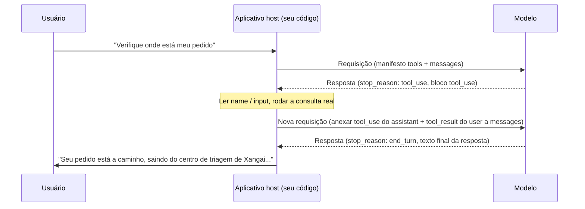

# Lição 2: A ida e volta completa de uma chamada de ferramenta

> Objetivos de aprendizado:
> - Nomear os campos-chave que a requisição e a resposta carregam em uma ida e volta de chamada de ferramenta
> - Dizer se um trecho de código com tool_use / tool_result está corretamente pareado
> - Identificar uma dependência de dados entre chamadas do mesmo lote paralelo, e saber quando dividir as chamadas em duas rodadas
> - Explicar por que a expressão “o modelo chama uma ferramenta” é, em si, imprecisa
>
> Pré-requisitos: Você leu a Lição 1 e sabe por que agentes precisam de ferramentas | Anterior: [Lição 1 <<](./01-why-agents-need-tools.md) | Próxima: [Lição 3 >>](./03-tool-types.md)

## Comece por três blocos de JSON

Você está construindo um bot de atendimento. Um usuário pergunta: “Você consegue verificar onde está meu pedido ORD-2026-8842?”. Seu código envia essa mensagem ao modelo junto com uma definição de ferramenta:

```json
{
  "model": "claude-sonnet-5",
  "tools": [
    {
      "name": "get_order_status",
      "description": "Consulta o status atual e as informações de envio de um pedido. Use quando um usuário perguntar sobre o andamento do pedido, o envio ou o prazo estimado de entrega.",
      "input_schema": {
        "type": "object",
        "properties": {
          "order_id": { "type": "string", "description": "O número do pedido, no formato ORD-2026-0001" }
        },
        "required": ["order_id"]
      }
    }
  ],
  "messages": [
    { "role": "user", "content": "Você consegue verificar onde está meu pedido ORD-2026-8842?" }
  ]
}
```

Repare no novo campo `tools`. Ele não é uma mensagem; é um manifesto que informa ao modelo quais ferramentas ele tem em mãos, como é cada uma e quais parâmetros cada uma exige.[^S3] Você precisa enviar esse manifesto em toda requisição — o modelo não “lembra” dele, então o seu código tem que incluí-lo todas as vezes.

O modelo lê o manifesto e, em vez de responder o status do pedido diretamente, retorna algo assim:

```json
{
  "id": "msg_01A2b3C4d5E6f7G8h9",
  "role": "assistant",
  "stop_reason": "tool_use",
  "content": [
    { "type": "text", "text": "Deixa eu verificar esse pedido para você." },
    { "type": "tool_use", "id": "toolu_01XYZ89AbCdEfGhIjKlMnOp", "name": "get_order_status", "input": { "order_id": "ORD-2026-8842" } }
  ]
}
```

Duas coisas novas aparecem aqui: `stop_reason` virou `"tool_use"`, e o array `content` ganhou um bloco novo com `type: "tool_use"`. O modelo não consultou informação nenhuma sobre o pedido — ele nem sabe onde fica o sistema de pedidos. Ele está apenas dizendo: “preciso que você chame `get_order_status` para mim com estes parâmetros, e depois me conte o resultado”.

Seu código assume o controle daqui em diante, consulta de fato o sistema de pedidos, obtém um resultado e empacota esse resultado na próxima requisição a ser enviada de volta:

```json
{
  "model": "claude-sonnet-5",
  "tools": [ /* igual ao de cima; esta rodada também precisa dele */ ],
  "messages": [
    { "role": "user", "content": "Você consegue verificar onde está meu pedido ORD-2026-8842?" },
    {
      "role": "assistant",
      "content": [
        { "type": "text", "text": "Deixa eu verificar esse pedido para você." },
        { "type": "tool_use", "id": "toolu_01XYZ89AbCdEfGhIjKlMnOp", "name": "get_order_status", "input": { "order_id": "ORD-2026-8842" } }
      ]
    },
    {
      "role": "user",
      "content": [
        {
          "type": "tool_result",
          "tool_use_id": "toolu_01XYZ89AbCdEfGhIjKlMnOp",
          "content": "{\"status\":\"in_transit\",\"location\":\"centro de triagem de Xangai\",\"eta\":\"2026-08-27\"}"
        }
      ]
    }
  ]
}
```

Repare no que foi acrescentado: a resposta completa do modelo da rodada anterior é jogada de volta em `messages` na íntegra, seguida de uma nova mensagem `user`. Essa mensagem não carrega texto digitado pelo usuário — ela carrega um bloco `type: "tool_result"` cujo `tool_use_id` corresponde exatamente ao id que o modelo acabou de te entregar.

Só depois de ver esta requisição é que o modelo finalmente diz algo como: “Seu pedido está a caminho, saindo do centro de triagem de Xangai, com entrega prevista para 27 de agosto”. Três blocos de JSON, três trocas de papel: o modelo faz um pedido, o seu código executa, o resultado é devolvido. É isso a ida e volta completa de uma chamada de ferramenta.

## stop_reason é um sinal, não um registro de execução

Aqui está o que os iniciantes mais erram: eles supõem que `stop_reason: "tool_use"` significa que a ferramenta já foi chamada. Não foi. É apenas a razão pela qual o modelo parou ao terminar esta mensagem, o mesmo tipo de campo que `"end_turn"` (terminou de falar) ou `"max_tokens"` (ficou sem espaço), só que com um valor diferente.[^S2]

O modelo nunca toca num banco de dados, dispara uma requisição HTTP ou roda um comando de shell por conta própria. Tudo o que ele pode fazer é emitir um pedido estruturado; o resto do trabalho recai sobre o seu código ou sobre os servidores da Anthropic.[^S4] É por isso que as ferramentas se dividem em “client tools” (o aplicativo host as executa) e “server tools” (a Anthropic as executa por você) — a diferença é só sobre quem executa este passo, não sobre se o modelo consegue executá-lo sozinho.[^S2]

```agentmentor-check
{
  "id": "tool-zh-02-stop-reason-meaning",
  "label": "Decidir o que aconteceu depois de stop_reason: tool_use",
  "prompt": "Você recebe uma resposta do modelo. stop_reason é “tool_use”, e content contém um bloco tool_use cujo name é send_email. Neste momento, o e-mail do usuário já foi enviado?",
  "whyHere": "Acabamos de estabelecer que stop_reason é apenas um sinal, não um registro de execução. Isto verifica se o aprendiz ainda carrega o equívoco comum de que um bloco tool_use retornado significa que a ferramenta já rodou.",
  "mode": "single",
  "choices": [
    {
      "id": "a",
      "text": "Sim, já foi enviado. Um bloco tool_use retornado é o sinal de que a execução terminou.",
      "correct": false,
      "feedback": "Não. Um bloco tool_use é apenas o pedido do modelo, o equivalente a ele dizer “por favor, chame send_email para mim com estes parâmetros”. O modelo não tem acesso à rede e não consegue enviar nada; o código que de fato envia o e-mail só roda depois que o aplicativo host lê esse bloco."
    },
    {
      "id": "b",
      "text": "Ainda não. Seu código tem que ler os parâmetros do bloco tool_use e chamar a sua própria lógica de envio de e-mail.",
      "correct": true,
      "feedback": "Correto. stop_reason: tool_use só significa que o modelo entregou uma requisição. A execução fica sempre com o aplicativo host, e o e-mail é de fato enviado depois que o seu código extrai name e input e chama a sua própria função de envio."
    }
  ]
}
```

## Os três campos de um bloco tool_use, nenhum opcional

Volte àquele bloco `tool_use`. Só três dos seus campos são obrigatórios:[^S5]

- **`id`**: o identificador único desta chamada, no formato `toolu_01XYZ...`. Ele tem exatamente uma função — fazer a correspondência quando você devolver o resultado mais tarde.
- **`name`**: a ferramenta que o modelo escolheu, que tem que corresponder exatamente ao `name` de uma das ferramentas do seu manifesto `tools`.
- **`input`**: um objeto contendo os parâmetros desta chamada, no formato que satisfaz as regras que você definiu em `input_schema`.

Junte esses três campos e você tem tudo o que o modelo consegue expressar: “quero chamar a ferramenta `name` com este `id`, e aqui está o `input`”. Ele não vai acrescentar lógica do tipo “tente de novo três vezes” — isso você escreve por conta própria no código do host. Como projetar uma interface de ferramenta para que o modelo erre menos parâmetros é território da Lição 3; esta lição só se importa com como esses três campos são empacotados e lidos de volta.

## tool_result faz a correspondência pelo tool_use_id

Uma única resposta do modelo pode conter mais de um bloco `tool_use`. Digamos que o usuário pergunte: “Você consegue verificar onde está meu pedido ORD-2026-8842 e também verificar se o ORD-2026-9001 já foi enviado?”. O modelo coloca dois blocos `tool_use` no mesmo array `content`, e `stop_reason` continua sendo `"tool_use"`.

Seu código tem que consultar os dois pedidos e então, na **mesma** mensagem `user`, colocar os dois resultados juntos no array `content`, com cada `tool_result` reivindicando a sua própria chamada pelo respectivo `tool_use_id`:

```json
{
  "role": "user",
  "content": [
    {
      "type": "tool_result",
      "tool_use_id": "toolu_01XYZ89AbCdEfGhIjKlMnOp",
      "content": "{\"status\":\"in_transit\",\"eta\":\"2026-08-27\"}"
    },
    {
      "type": "tool_result",
      "tool_use_id": "toolu_02QRS45TuVwXyZaBcDeFgH",
      "content": "{\"status\":\"pending\",\"eta\":null}"
    }
  ]
}
```

Se você tomar um atalho e enviar uma rodada só com o primeiro `tool_use_id` sozinho, o modelo se recusa a continuar a conversa, porque “a rodada anterior tinha um bloco `tool_use` que nunca recebeu o seu `tool_result`” — os dois blocos têm que ser reivindicados juntos na próxima mensagem `user`; você não pode dividi-los em duas requisições e devolvê-los em partes.[^S21] O bloco `tool_result` também tem um campo opcional `is_error`: defina-o como `true` quando a ferramenta falhar, e o modelo saberá que esta chamada esbarrou em um problema.[^S5]

```agentmentor-check
{
  "id": "tool-zh-02-batched-tool-result",
  "label": "Como devolver os resultados de vários blocos tool_use",
  "prompt": "A resposta do modelo nesta rodada tem dois blocos tool_use (cada um chamando uma ferramenta diferente), e stop_reason continua sendo tool_use. Você já executou as duas ferramentas. Como você deve devolver os resultados?",
  "whyHere": "Acabamos de ver que tool_result faz a correspondência pelo tool_use_id. Isto verifica se o aprendiz entende que, quando uma resposta traz várias chamadas, os resultados têm que voltar em lote e não divididos em requisições separadas.",
  "mode": "single",
  "choices": [
    {
      "id": "a",
      "text": "Enviar duas requisições separadas, um tool_result em cada, terminando a primeira antes de enviar a segunda.",
      "correct": false,
      "feedback": "Na primeira requisição, o outro bloco tool_use ainda não recebeu o seu tool_result, então a conversa não consegue avançar. Os dois blocos têm que ser reivindicados na mesma mensagem user nova — espere até que os dois tenham rodado, então empacote e envie."
    },
    {
      "id": "b",
      "text": "Colocar os dois blocos tool_result no array content de uma única mensagem user, cada um pareado pelo seu próprio tool_use_id.",
      "correct": true,
      "feedback": "Correto. Quantos blocos tool_use houver em uma resposta, a próxima mensagem user precisa dessa mesma quantidade de blocos tool_result, pareados um a um pelo tool_use_id, todos empacotados na mesma mensagem e enviados juntos."
    }
  ]
}
```

## Chamadas do mesmo lote não enxergam os resultados umas das outras

Agora que a regra da devolução em lote está resolvida, há uma armadilha mais profunda: a **dependência de dados** entre blocos `tool_use` do mesmo lote.

Mude de cenário. Um agente de transferência de dinheiro está montado com duas ferramentas: `read_balance(account_id)` lê o saldo, e `withdraw(account_id, amount)` tira dinheiro. O usuário diz: “Tire \$100 da A001, se houver saldo suficiente”. Em uma única resposta, o modelo devolve dois blocos `tool_use`: `read_balance({"account_id": "A001"})` e `withdraw({"account_id": "A001", "amount": 100})`.

Olhe o `amount` do `withdraw`: 100, copiado direto do número na frase do usuário, sem nenhuma relação com o saldo ser suficiente ou não. Isso não é preguiça do modelo; ele não tem escolha. No momento em que gera esta resposta, `read_balance` ainda é só “algo que ele planeja fazer” — o valor de retorno dela nem existe ainda, então `withdraw` não tem como lê-lo. Dentro de um lote de blocos `tool_use`, nenhuma chamada consegue ver os resultados das outras daquele lote, porque nesse ponto esses resultados não foram executados nem devolvidos.

Então aqui vai uma linha que você mesmo tem que segurar: **se o parâmetro de uma operação de escrita deveria, em tese, ser igual ao valor de retorno de uma operação de leitura do mesmo lote, essas duas chamadas não deveriam aparecer na mesma resposta.** A abordagem genuinamente segura é dividi-las em duas rodadas: rode só `read_balance` primeiro, devolva o saldo real como um `tool_result`, e uma vez que o modelo veja “o saldo é só 60”, deixe que ele decida se chama `withdraw` e por quanto.

Três táticas que realmente funcionam:

1. **Escreva a pré-condição na descrição da ferramenta.** Acrescente uma linha à `description` do `withdraw`: “só chame depois de ter visto o saldo mais recente retornado por read_balance”. A descrição da ferramenta é ela própria parte do prompt que o modelo consegue ler, o que é muito mais confiável do que torcer para o modelo descobrir a dependência sozinho.[^S8]
2. **Desligue o paralelismo com disable_parallel_tool_use.** Defina `{"type": "auto", "disable_parallel_tool_use": true}` no `tool_choice` da requisição, e o modelo chama no máximo uma ferramenta por resposta.[^S21] Aperte primeiro o comportamento para uma de cada vez, deixe claras na sua cabeça as dependências entre os passos, e só então considere afrouxar.
3. **Coloque uma rede de segurança na camada de execução.** Faça o código que roda o `withdraw` reconferir ele mesmo o saldo mais recente, recusar-se a rodar se a condição não for satisfeita, e escrever a razão na informação de erro do `tool_result` para o modelo ver, em vez de fingir que deu certo. Mesmo que o modelo agrupe as duas chamadas de novo desta vez, essa verificação contém o risco.

## Desenhe como um diagrama

Desenhe a ida e volta acima e ela fica assim:



O passo em que mais se erra neste diagrama é a seta do “anexar”: enviar só o `tool_result` sozinho e esquecer de jogar de volta em `messages` a resposta `tool_use` completa do modelo daquela rodada. O modelo então recebe um resultado de ferramenta que parece surgir do nada, sem nenhum registro no seu contexto do pedido que ele fez — um non sequitur ou um erro explícito passa a ser provável. O movimento certo é guardar a resposta de cada rodada no histórico na íntegra; `messages` só cresce e nunca é podado.[^S4]

## Uma tarefa pode exigir mais de uma ida e volta

O exemplo acima terminou depois de uma única chamada de ferramenta. Em cenários reais, o modelo muitas vezes tem que ir e voltar várias vezes até conseguir concluir. Imagine um bot de deploy. O usuário diz: “Reinicie o serviço para mim e me diga se há algum erro nos logs”:

1. O modelo retorna `tool_use` na primeira rodada, chamando `restart_service`; você executa e devolve o resultado
2. O modelo retorna `tool_use` de novo na segunda rodada, chamando `read_logs` para verificar se há erros; você executa e devolve os logs
3. Na terceira rodada o modelo finalmente retorna `stop_reason: "end_turn"`, com um resumo em texto

A lógica do código no lado do host é essencialmente um laço: enquanto `stop_reason` continuar sendo `"tool_use"`, siga executando ferramentas, empacotando os resultados de volta e enviando outra rodada; assim que ele virar `"end_turn"`, entregue o texto final ao usuário.[^S4]

```javascript
// tools é a sua lista de definições de ferramenta, como o array tools da requisição de abertura desta lição
const messages = [{ role: "user", content: userInput }];

let response = await callModel({ tools, messages });

while (response.stop_reason === "tool_use") {
  const toolUseBlocks = response.content.filter(b => b.type === "tool_use");

  messages.push({ role: "assistant", content: response.content });

  const toolResults = await Promise.all(
    toolUseBlocks.map(async (block) => ({
      type: "tool_result",
      tool_use_id: block.id,
      content: await executeTool(block.name, block.input),
    }))
  );

  messages.push({ role: "user", content: toolResults });

  response = await callModel({ tools, messages });
}

// stop_reason virou end_turn; response contém o texto final da resposta
```

Este laço não tem um teto fixo de iterações — para um único pedido do usuário, o modelo pode chamar uma ferramenta só uma vez, ou cinco ou seis vezes até ter reunido o suficiente. A Lição 3 cobre como o projeto da interface de ferramenta consegue cortar o número de idas e voltas; para esta lição, basta lembrar: várias idas e voltas são a norma, não a exceção.

## Troque o host, os nomes dos campos mudam, a estrutura não

Se você está em uma API compatível com a da OpenAI, o mesmo mecanismo vem em outra embalagem: a requisição de chamada aparece no array `choices[0].message.tool_calls`, o sinal de término não se chama `stop_reason` e sim `finish_reason`, e o valor dele é `"tool_calls"` em vez de `"tool_use"`.[^S7] A documentação oficial da OpenAI descreve o processo como "a multi-step conversation between your application and a model via the OpenAI API. When the model calls a function, you must execute it and return the result" (uma conversa de múltiplos passos entre a sua aplicação e um modelo via API da OpenAI; quando o modelo chama uma função, você tem que executá-la e retornar o resultado) — o modelo emite uma requisição de chamada, a aplicação executa e devolve o resultado, exatamente como no Claude.[^S1]

Os nomes dos campos mudam conforme a API, mas o esqueleto — “o modelo só envia pedidos, o host cuida da execução, os resultados voltam carregando um identificador, e isso pode repetir por várias rodadas” — é universal.

<!-- exercises -->
## 💻 Exercícios

### Nível 1: Escrever à mão a requisição com tool_result

O modelo retornou esta resposta (`stop_reason` é `"tool_use"`):

```json
{
  "role": "assistant",
  "stop_reason": "tool_use",
  "content": [
    { "type": "tool_use", "id": "toolu_01Weather9527", "name": "get_weather", "input": { "city": "Hangzhou" } }
  ]
}
```

Você chamou a sua própria função de consulta de clima e obteve o resultado: ensolarado, 26 graus Celsius.

No seu editor, escreva o array `messages` completo da próxima requisição (a mensagem original do usuário + a resposta desta rodada + a mensagem de tool_result que você construir), com estes requisitos:

1. O `tool_use_id` corresponde exatamente ao `id` da resposta acima
2. O `content` do `tool_result` é um texto que um programa consegue parsear (uma string JSON, por exemplo)
3. As três mensagens do array têm os valores de `role` em ordem: `user`, `assistant`, `user`

<!-- rubric -->
- O array `messages` contém três mensagens, na ordem certa e com os papéis certos
- O `tool_use_id` do bloco `tool_result` é exatamente `toolu_01Weather9527`, não uma string inventada
- O `content` do `tool_result` carrega os dados reais do clima, em um formato que o código posterior consegue parsear

<!-- answer -->
```json
[
  { "role": "user", "content": "Como está o tempo em Hangzhou?" },
  {
    "role": "assistant",
    "content": [
      { "type": "tool_use", "id": "toolu_01Weather9527", "name": "get_weather", "input": { "city": "Hangzhou" } }
    ]
  },
  {
    "role": "user",
    "content": [
      {
        "type": "tool_result",
        "tool_use_id": "toolu_01Weather9527",
        "content": "{\"condition\":\"sunny\",\"temperature_c\":26}"
      }
    ]
  }
]
```

<!-- hint -->
A segunda mensagem vem da resposta do modelo — basta levar o `role` e o `content` dela direto para o array. Campos de metadados de nível superior como `stop_reason` não fazem parte da mensagem em si, então deixe-os de fora.

<!-- hint -->
O `tool_result` não precisa de um id novo. O `tool_use_id` dele é apenas o `id` que o modelo te deu, copiado caractere por caractere.

### Nível 2: Encontrar os três bugs no código da ida e volta

O código abaixo tenta implementar a lógica de “chamar uma ferramenta, devolver o resultado”, mas três coisas vão impedir o modelo de obter o resultado certo, ou fazer a conversa dar erro. Encontre os problemas e escreva a versão corrigida. (Suponha que a resposta do modelo tenha só um bloco `tool_use`.)

```javascript
async function handleTurn(userMessage, tools) {
  const messages = [{ role: "user", content: userMessage }];
  const response = await callModel({ tools, messages });

  if (response.stop_reason === "tool_use") {
    const toolBlock = response.content.find(b => b.type === "tool_use");
    const result = await executeTool(toolBlock.name, toolBlock.input);

    messages.push({
      role: "user",
      content: [{ type: "tool_result", tool_use_id: toolBlock.name, content: result }],
    });

    const finalResponse = await callModel({ messages });
    return finalResponse;
  }

  return response;
}
```

<!-- rubric -->
- Identificar e explicar três problemas específicos, cada um apontando para uma linha exata do código
- O código corrigido anexa o `response.content` do modelo em `messages`
- O código corrigido usa `toolBlock.id`, e não `toolBlock.name`, para o `tool_use_id`
- A segunda chamada corrigida de `callModel` inclui `tools`

<!-- answer -->
Três problemas:

1. **`tool_use_id: toolBlock.name` usa o campo errado.** Deveria ser `toolBlock.id` — `name` é o nome da ferramenta, não o identificador único desta chamada, então o modelo não consegue fazer a correspondência com ele.
2. **`response.content` nunca é anexado em `messages`.** Pular direto de uma única mensagem `user` para o acréscimo do `tool_result` significa que o modelo não tem, na rodada seguinte, nenhum registro do pedido que ele fez, e o contexto fica quebrado.
3. **A segunda chamada `callModel({ messages })` não inclui `tools`.** O manifesto de ferramentas tem que ir junto em toda rodada, senão o modelo não encontra as definições das ferramentas quando uma tarefa exige mais de uma ida e volta.

Corrigido, as mudanças principais são nestes três pontos (o resto do código permanece igual):

```javascript
messages.push({ role: "assistant", content: response.content }); // acrescente esta linha
messages.push({
  role: "user",
  content: [{ type: "tool_result", tool_use_id: toolBlock.id, content: result }], // .id, não .name
});
const finalResponse = await callModel({ tools, messages }); // inclua tools
```

<!-- hint -->
Confira o código contra o exemplo em JSON da seção “stop_reason é um sinal, não um registro de execução” desta lição, linha por linha: em uma ida e volta real, quantas mensagens aparecem no array `messages`, e qual é o `role` de cada uma?

<!-- hint -->
Pergunte-se: se esta tarefa exigisse que o modelo chamasse ferramentas duas vezes seguidas (verificar o estoque primeiro, depois verificar o preço), a segunda chamada de `callModel` deste código ainda teria um parâmetro `tools` com que trabalhar? Se não, com o que o modelo iniciaria um segundo `tool_use`?

<!-- /exercises -->

## Recapitulação

- O modelo nunca executa nada diretamente. Ele apenas emite `stop_reason: "tool_use"` mais um ou mais blocos `tool_use`; a execução fica com o aplicativo host
- Um bloco `tool_use` tem só três campos obrigatórios: `id` (para a correspondência), `name` (a ferramenta escolhida) e `input` (os parâmetros)
- Os resultados voltam como blocos `tool_result`, e o `tool_use_id` tem que corresponder exatamente ao `id` do bloco `tool_use` equivalente
- Uma resposta pode ter vários blocos `tool_use`; os blocos `tool_result` correspondentes têm que ser empacotados na **mesma** mensagem `user`, e não divididos em várias requisições
- Blocos `tool_use` do mesmo lote não enxergam os resultados de execução uns dos outros: se o parâmetro de uma operação de escrita depende do valor de retorno de uma operação de leitura do mesmo lote, divida-os em duas rodadas, ou force uma de cada vez com `disable_parallel_tool_use`
- Uma tarefa pode exigir várias idas e voltas: a implementação do lado do host é essencialmente um laço — siga executando e devolvendo enquanto `stop_reason` continuar sendo `"tool_use"`, e só termina quando ele virar `"end_turn"`

[>> Lição 3: Cinco tipos comuns de ferramenta: ler, escrever, executar, buscar, chamar](./03-tool-types.md)
