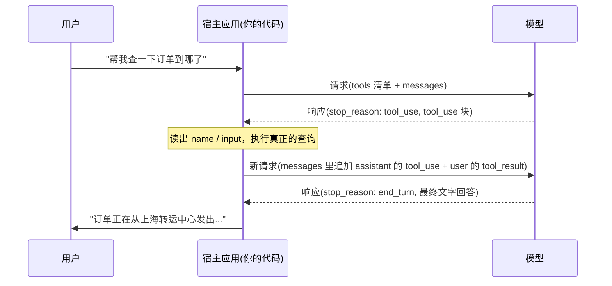

# 第 2 课：一次工具调用的完整往返

> 学习目标：
> - 说出一次工具调用往返里请求和响应各自携带的关键字段
> - 判断一段 tool_use / tool_result 代码是否正确匹配
> - 认出同一批并行调用之间的数据依赖，知道什么时候该把调用拆成两轮
> - 解释为什么"模型调用工具"这句话本身不准确
>
> 前置要求：读过第 1 课，知道 Agent 为什么需要工具 | 上一课 [第 1 课 <<](./01-why-agents-need-tools.md) | 下一课 [第 3 课 >>](./03-tool-types.md)

## 先看三段 JSON

你在写一个客服机器人，用户问"帮我查一下订单 ORD-2026-8842 到哪了"。代码把这句话连同一份工具定义一起发给模型：

```json
{
  "model": "claude-sonnet-5",
  "tools": [
    {
      "name": "get_order_status",
      "description": "查询一个订单的当前状态和物流信息，用户问订单进度、发货或预计送达时间时使用。",
      "input_schema": {
        "type": "object",
        "properties": {
          "order_id": { "type": "string", "description": "订单编号，形如 ORD-2026-0001" }
        },
        "required": ["order_id"]
      }
    }
  ],
  "messages": [
    { "role": "user", "content": "帮我查一下订单 ORD-2026-8842 到哪了" }
  ]
}
```

注意这里多了 `tools` 字段。它不是消息，是一份清单，告诉模型"你手头有这些工具，每个长什么样、需要什么参数"[^S3]。这份清单每一轮请求都要带上——模型不会"记住"它，你的代码得每次塞进去。

模型看完这份清单，没有直接回答订单状态，而是返回了这样的东西：

```json
{
  "id": "msg_01A2b3C4d5E6f7G8h9",
  "role": "assistant",
  "stop_reason": "tool_use",
  "content": [
    { "type": "text", "text": "我来帮你查一下这个订单。" },
    { "type": "tool_use", "id": "toolu_01XYZ89AbCdEfGhIjKlMnOp", "name": "get_order_status", "input": { "order_id": "ORD-2026-8842" } }
  ]
}
```

注意这里多了两样东西：`stop_reason` 变成了 `"tool_use"`，`content` 数组里多了一个 `type: "tool_use"` 的块。模型没有查到任何订单信息——它连订单系统在哪都不知道，只是说"我需要你帮我调 `get_order_status`，参数是这些，然后把结果告诉我"。

你的代码接手这个请求，真去查了订单系统，拿到结果，再把结果塞回下一轮请求里发回去：

```json
{
  "model": "claude-sonnet-5",
  "tools": [ /* 同上，这一轮也要带 */ ],
  "messages": [
    { "role": "user", "content": "帮我查一下订单 ORD-2026-8842 到哪了" },
    {
      "role": "assistant",
      "content": [
        { "type": "text", "text": "我来帮你查一下这个订单。" },
        { "type": "tool_use", "id": "toolu_01XYZ89AbCdEfGhIjKlMnOp", "name": "get_order_status", "input": { "order_id": "ORD-2026-8842" } }
      ]
    },
    {
      "role": "user",
      "content": [
        {
          "type": "tool_result",
          "tool_use_id": "toolu_01XYZ89AbCdEfGhIjKlMnOp",
          "content": "{\"status\":\"in_transit\",\"location\":\"上海转运中心\",\"eta\":\"2026-08-27\"}"
        }
      ]
    }
  ]
}
```

注意这里多了什么：上一轮模型的完整回复被原样塞回了 `messages` 里，后面又跟了一条新的 `user` 消息，里面装的不是用户打的字，而是一个 `type: "tool_result"` 的块，`tool_use_id` 精确对上了模型刚才给的那个 id。

模型看到这轮请求，才终于说出"你的订单正在从上海转运中心发出，预计 8 月 27 号送达"这样的话。三段 JSON，三次角色切换：模型提要求、代码执行、结果喂回去。这就是一次工具调用往返的全部。

## stop_reason 是信号，不是执行记录

新手最容易搞错的一点：以为 `stop_reason: "tool_use"` 意味着工具已经被调用过了。不是，它只是模型说完这句话时给的"我为什么停下来"的理由，和 `"end_turn"`（说完了）、`"max_tokens"`（写满了）是同一类字段，只是取值不同[^S2]。

模型从来不会自己访问数据库、发 HTTP 请求或跑 shell 命令。它只能"吐出一段结构化的请求"，剩下的活全靠你的代码或 Anthropic 服务器去干[^S4]。这也是为什么工具分"客户端工具"（宿主应用自己执行）和"服务器工具"（Anthropic 代为执行）——区别只在谁来跑这一步，不在模型有没有能力自己跑[^S2]。

```agentmentor-check
{
  "id": "tool-zh-02-stop-reason-meaning",
  "label": "判断 stop_reason: tool_use 之后发生了什么",
  "prompt": "你收到模型的响应，stop_reason 是 \"tool_use\"，content 里有一个 tool_use 块，name 是 send_email。这时候，用户的邮件已经发出去了吗？",
  "whyHere": "刚讲完 stop_reason 只是信号而非执行记录，需要检查学习者是否还残留着「模型返回了 tool_use 就等于工具已经跑完」的常见误解",
  "mode": "single",
  "choices": [
    {
      "id": "a",
      "text": "已经发出去了，模型返回 tool_use 就是执行完成的标志",
      "correct": false,
      "feedback": "不对。tool_use 块只是模型的请求，相当于它在说「麻烦帮我调 send_email，参数是这些」。模型没有网络权限，什么都发不出去，真正发邮件的代码要等宿主应用读到这个块之后才会执行。"
    },
    {
      "id": "b",
      "text": "还没有，需要你的代码读取 tool_use 块里的参数，自己调用发送邮件的逻辑",
      "correct": true,
      "feedback": "正确。stop_reason: tool_use 只是模型交出一份请求单，执行权始终在宿主应用手里，邮件真正发出去是在代码解析出 name 和 input、调用自己的发送函数之后。"
    }
  ]
}
```

## tool_use 块里的三个字段，缺一不可

回头看那个 `tool_use` 块，它只有三个字段是必需的[^S5]：

- **`id`**：这次调用的唯一标识，形如 `toolu_01XYZ...`。它的作用只有一个——等下你把结果传回去时，靠它对上号。
- **`name`**：模型选中的工具名字，必须和你 `tools` 清单里某个工具的 `name` 完全一致。
- **`input`**：一个对象，装着这次调用的参数，形状要符合你在 `input_schema` 里定义的规则。

这三个字段拼起来，就是模型能表达的全部内容："我要调 `id` 为这个的 `name` 工具，参数是 `input`"，不会附带"重试三次"之类的逻辑，那得你自己在宿主代码里写。工具接口怎么设计能让模型少犯参数错误，是第 4 课的内容；这一课只关心这三个字段怎么被塞进去、又怎么被读出来。

## tool_result 靠 tool_use_id 对号入座

模型的一次回复里，可能不止一个 `tool_use` 块。假设用户问的是"帮我查一下订单 ORD-2026-8842 到哪了，另外查一下 ORD-2026-9001 有没有发货"，模型会在同一个 `content` 数组里放两个 `tool_use` 块，`stop_reason` 依然是 `"tool_use"`。

你的代码要把两个订单都查一遍，再在**同一条** `user` 消息里，把两个结果一起放进 `content` 数组，每个 `tool_result` 用自己的 `tool_use_id` 认领对应的调用：

```json
{
  "role": "user",
  "content": [
    {
      "type": "tool_result",
      "tool_use_id": "toolu_01XYZ89AbCdEfGhIjKlMnOp",
      "content": "{\"status\":\"in_transit\",\"eta\":\"2026-08-27\"}"
    },
    {
      "type": "tool_result",
      "tool_use_id": "toolu_02QRS45TuVwXyZaBcDeFgH",
      "content": "{\"status\":\"pending\",\"eta\":null}"
    }
  ]
}
```

如果偷懒先拿第一个 `tool_use_id` 单独发一轮请求，模型会因为"上一轮有 `tool_use` 块没等到 `tool_result`"而拒绝继续对话——两个块必须在下一条 `user` 消息里同时认领完，不能拆成两次请求分批送回去[^S21]。`tool_result` 还有个可选的 `is_error` 字段，工具执行失败时设成 `true`，模型看到就知道这次调用出了问题[^S5]。

```agentmentor-check
{
  "id": "tool-zh-02-batched-tool-result",
  "label": "多个 tool_use 块要怎么回传结果",
  "prompt": "模型这一轮的响应里有两个 tool_use 块（分别调用了两个不同的工具），stop_reason 仍然是 tool_use。你已经把两个工具都执行完了，接下来该怎么把结果传回去？",
  "whyHere": "刚讲完 tool_result 要靠 tool_use_id 对号入座，这里检查学习者是否理解「一次回复多个调用」时结果必须批量回传，而不是拆成多次请求",
  "mode": "single",
  "choices": [
    {
      "id": "a",
      "text": "分两次请求发过去，每次带一个 tool_result，先处理完第一个再发第二个",
      "correct": false,
      "feedback": "这样第一次请求里，另一个 tool_use 块还没等到它的 tool_result，对话没法往下走。两个块必须在同一条新的 user 消息里一起认领——等两个都执行完，打包发出去。"
    },
    {
      "id": "b",
      "text": "在同一条 user 消息的 content 数组里放两个 tool_result 块，各自用对应的 tool_use_id 匹配",
      "correct": true,
      "feedback": "正确。一次响应里有几个 tool_use 块，下一条 user 消息就要有几个 tool_result 块，靠 tool_use_id 一一对应，打包在同一条消息里发出去。"
    }
  ]
}
```

## 同一批调用，互相看不到对方的结果

批量回传的规则说完了，还有一个藏得更深的坑：同一批 `tool_use` 之间的**数据依赖**。

换一个场景：一个转账 Agent 配了两个工具，`read_balance(account_id)` 读余额，`withdraw(account_id, amount)` 扣款。用户说"从 A001 转 100 元出去，如果余额够的话"。模型在同一次响应里给出了两个 `tool_use` 块：`read_balance({"account_id": "A001"})` 和 `withdraw({"account_id": "A001", "amount": 100})`。

看 `withdraw` 的 `amount`：100，直接抄的是用户那句话里的数字，跟余额够不够毫无关系。这不是模型偷懒，是它没得选——生成这次响应的时候，`read_balance` 还只是"计划要做的事"，连自己的返回值都不存在，`withdraw` 自然读不到。同一批 `tool_use` 里，任何一个调用都看不到同批里其他调用的结果，因为那些结果这时候还没被执行、也没被送回去过。

所以这里有一条要自己把住的线：**如果一个写操作的参数理论上应该等于同一批里某个读操作的返回值，这两个调用就不该出现在同一次响应里。**真正安全的做法是拆成两轮：先只执行 `read_balance`，把真实余额作为 `tool_result` 传回去，模型看到"余额只有 60"之后，再决定要不要调用 `withdraw`、传多少。

三个实际能用的手段：

1. **工具描述里写清前置条件。**给 `withdraw` 的 `description` 加一句"仅在已经看到 read_balance 返回的最新余额后才能调用"——工具描述本身就是模型能读到的提示词的一部分，比指望模型自己悟出这个依赖靠谱得多[^S8]。
2. **用 disable_parallel_tool_use 关掉并行。**在请求的 `tool_choice` 里设置 `{"type": "auto", "disable_parallel_tool_use": true}`，模型每次响应最多只调用一个工具[^S21]。先把行为收紧到一次一个，把每一步的依赖关系想清楚，想清楚了再考虑要不要放开。
3. **执行层自己兜底。**执行 `withdraw` 的代码自己重新查一遍最新余额，不满足条件就拒绝执行，把原因写进 `tool_result` 的错误信息里让模型看到，而不是假装成功。哪怕模型这次又把两个调用捆在了一起，这道检查也能把风险接住。

## 画成一张图

把上面的往返画出来，是这样的：



图上最容易被写错的一步是"追加"那一箭头：只把 `tool_result` 单独发过去，忘了把模型那一轮完整的 `tool_use` 回复也塞回 `messages`——模型收到一条莫名其妙冒出来的工具结果，上下文里没有它自己发过请求的记录，答非所问或报错都可能发生。正确做法是把每一轮响应原样存进历史，`messages` 只会越滚越长，从不删减[^S4]。

## 一次任务，可能不止一次往返

上面的例子只有一次工具调用就结束了。真实场景里，模型经常要来回好几趟才能把话说完。想象一个部署机器人，用户说"帮我把服务重启一下，如果日志里有报错就告诉我"：

1. 模型第一轮返回 `tool_use`，调用 `restart_service`，你执行后把结果传回去
2. 模型第二轮又返回 `tool_use`，调用 `read_logs` 确认有没有报错，你执行后把日志传回去
3. 模型第三轮终于返回 `stop_reason: "end_turn"`，附上总结文字

宿主这边的代码逻辑，本质上就是一个循环：只要 `stop_reason` 还是 `"tool_use"`，就继续执行工具、把结果塞回去、再发一轮请求；等它变成 `"end_turn"`，才把最终文字交给用户[^S4]。

```javascript
// tools 是你的工具定义清单，形如本课开头请求里的 tools 数组
const messages = [{ role: "user", content: userInput }];

let response = await callModel({ tools, messages });

while (response.stop_reason === "tool_use") {
  const toolUseBlocks = response.content.filter(b => b.type === "tool_use");

  messages.push({ role: "assistant", content: response.content });

  const toolResults = await Promise.all(
    toolUseBlocks.map(async (block) => ({
      type: "tool_result",
      tool_use_id: block.id,
      content: await executeTool(block.name, block.input),
    }))
  );

  messages.push({ role: "user", content: toolResults });

  response = await callModel({ tools, messages });
}

// stop_reason 变成 end_turn，response 里是最终的文字回答
```

这个循环没有固定次数上限——一次用户请求，模型可能只调一次工具，也可能调五六次才凑齐信息。第 4 课会讲工具接口怎么设计能减少往返次数；这一课你只需要记住：多轮往返是常态，不是例外。

## 换个宿主，字段名不一样，结构没变

如果你用的是 OpenAI 兼容 API，同样的机制换了个包装：调用请求出现在 `choices[0].message.tool_calls` 数组里，收尾标志不叫 `stop_reason` 而叫 `finish_reason`，取值是 `"tool_calls"` 而不是 `"tool_use"`[^S7]。OpenAI 官方文档把这个过程称作"应用程序和模型之间的多步骤对话"——模型给出调用请求，应用程序执行并把结果送回去，和 Claude 完全一致[^S1]。

字段名会随 API 变，但"模型只发请求、宿主负责执行、结果带着标识符送回去、可能循环好几轮"这套骨架是通用的。

<!-- exercises -->
## 💻 练习

### Level 1：把 tool_result 请求手写出来

模型返回了这个响应（`stop_reason` 是 `"tool_use"`）：

```json
{
  "role": "assistant",
  "stop_reason": "tool_use",
  "content": [
    { "type": "tool_use", "id": "toolu_01Weather9527", "name": "get_weather", "input": { "city": "杭州" } }
  ]
}
```

你调用了自己的天气查询函数，拿到结果：晴，26 摄氏度。

请在你的编辑器里写出完整的下一轮请求 `messages` 数组（原来的 user 消息 + 这一轮 assistant 响应 + 你新构造的 tool_result 消息），要求：

1. `tool_use_id` 和上面响应里的 `id` 完全一致
2. `tool_result` 的 `content` 是一段能被程序解析的文本（比如 JSON 字符串）
3. 数组里三条消息的 `role` 依次是 `user`、`assistant`、`user`

<!-- rubric -->
- `messages` 数组里包含三条消息，顺序和 role 都正确
- `tool_result` 块的 `tool_use_id` 精确等于 `toolu_01Weather9527`，不是随便编的字符串
- `tool_result` 的 `content` 携带实际天气数据，格式能被后续代码解析

<!-- answer -->
```json
[
  { "role": "user", "content": "杭州天气怎么样" },
  {
    "role": "assistant",
    "content": [
      { "type": "tool_use", "id": "toolu_01Weather9527", "name": "get_weather", "input": { "city": "杭州" } }
    ]
  },
  {
    "role": "user",
    "content": [
      {
        "type": "tool_result",
        "tool_use_id": "toolu_01Weather9527",
        "content": "{\"condition\":\"晴\",\"temperature_c\":26}"
      }
    ]
  }
]
```

<!-- hint -->
第二条消息取自模型的响应——把它的 `role` 和 `content` 原样搬进数组即可，`stop_reason` 等顶层元数据字段不属于消息本身，不用带。

<!-- hint -->
`tool_result` 不需要造一个新的 id，`tool_use_id` 就是抄模型给的那个 `id`，一字不差。

### Level 2：找出往返代码里的三个错误

下面这段代码想实现"调用工具、把结果传回去"的逻辑，但有三处会导致模型收不到正确结果，或者对话直接报错。找出问题，写出修正后的版本。（本题假设模型的响应里只有一个 `tool_use` 块。）

```javascript
async function handleTurn(userMessage, tools) {
  const messages = [{ role: "user", content: userMessage }];
  const response = await callModel({ tools, messages });

  if (response.stop_reason === "tool_use") {
    const toolBlock = response.content.find(b => b.type === "tool_use");
    const result = await executeTool(toolBlock.name, toolBlock.input);

    messages.push({
      role: "user",
      content: [{ type: "tool_result", tool_use_id: toolBlock.name, content: result }],
    });

    const finalResponse = await callModel({ messages });
    return finalResponse;
  }

  return response;
}
```

<!-- rubric -->
- 找出并说明三个具体问题，每个都指向代码里的确切一行
- 修正后的代码把模型的 `response.content` 追加进了 `messages`
- 修正后的代码 `tool_use_id` 用的是 `toolBlock.id` 而不是 `toolBlock.name`
- 修正后的第二次 `callModel` 调用带上了 `tools`

<!-- answer -->
三个问题：

1. **`tool_use_id: toolBlock.name` 写错字段。** 应该是 `toolBlock.id`——`name` 是工具名字，不是这次调用的唯一标识，模型没法靠它对号入座。
2. **`response.content` 没有被追加进 `messages`。** 直接从一条 `user` 消息跳到追加 `tool_result`，模型下一轮看不到自己发过请求的记录，上下文断裂。
3. **第二次 `callModel({ messages })` 没带 `tools`。** 工具清单每一轮都要带，不然任务需要不止一次往返时模型找不到工具定义。

修正后，关键改动是这三处（其余代码不变）：

```javascript
messages.push({ role: "assistant", content: response.content }); // 补上这一行
messages.push({
  role: "user",
  content: [{ type: "tool_result", tool_use_id: toolBlock.id, content: result }], // .id 不是 .name
});
const finalResponse = await callModel({ tools, messages }); // 带上 tools
```

<!-- hint -->
对照本课"stop_reason 是信号，不是执行记录"那节的 JSON 例子，逐行核对：真实往返里 `messages` 数组一共出现几条消息、每条的 `role` 是什么。

<!-- hint -->
问自己：如果这个任务需要模型连续调用两次工具（先查库存，再查价格），这段代码第二次 `callModel` 还有没有 `tools` 参数可用？没有的话，模型拿什么发起第二次 `tool_use`？

<!-- /exercises -->

## 小结

- 模型从不直接执行任何操作，它只吐出 `stop_reason: "tool_use"` 加一个或多个 `tool_use` 块，执行权在宿主应用手里
- `tool_use` 块只有三个必需字段：`id`（认领用）、`name`（选中的工具）、`input`（参数）
- 结果以 `tool_result` 块传回去，`tool_use_id` 必须精确匹配对应 `tool_use` 块的 `id`
- 一次响应可能有多个 `tool_use` 块，对应的多个 `tool_result` 要打包进**同一条** `user` 消息，不能拆成多次请求
- 同一批 `tool_use` 互相看不到对方的执行结果：写操作的参数如果依赖同批读操作的返回值，就得拆成两轮，或用 `disable_parallel_tool_use` 强制一次只调一个
- 一次任务可能来回好几趟：宿主端实现本质是一个循环，`stop_reason` 还是 `"tool_use"` 就继续执行并回传，变成 `"end_turn"` 才算说完

[>> 第 3 课：五类常用工具：读、写、执行、搜索、调用](./03-tool-types.md)
