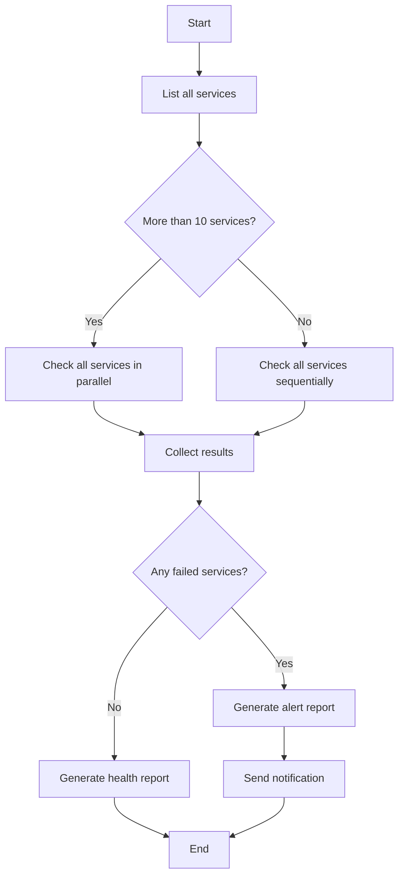

# Lesson 2: Workflow Building Blocks: Steps, State, Branches, Loops

> Learning goals:
> - Master the four core building blocks of a workflow
> - Understand dependencies and data passing between steps
> - Learn to design a workflow's execution flowchart
>
> Prerequisites: [Lesson 1: From Conversation to Workflow](./01-from-conversation-to-workflow.md) | Next: [Lesson 3 >>](./03-task-decomposition.md)

## Workflows Aren't Magic, They're Composition

In the last lesson we saw that a workflow can coordinate dozens of agents to finish a complex task. But open up a workflow script and you'll find it's just ordinary code: functions, loops, conditionals.

**The power of a workflow comes from combining four simple building blocks:**

1. **Steps** — the basic unit of work
2. **State** — data shared between steps
3. **Branches** — choosing a path based on a condition
4. **Loops** — repeating a similar operation

Once you understand these four building blocks, you can design a workflow of any complexity.[^S4]

## Building Block 1: Steps

**A step is a workflow's atomic operation.** Each step is either an Agent call or a deterministic function.[^S5]

### Agent Steps vs Function Steps

```javascript
// Agent step: let the LLM do work that needs reasoning
const summary = await agent({
  task: 'Summarize code review findings',
  prompt: 'Extract the key issues from these review results, ranked by severity',
  context: reviews
});

// Function step: deterministic transform, no LLM needed
const filtered = reviews.filter(r => r.severity === 'high');
const count = filtered.length;
```

**When to use an Agent step:**
- You need to understand fuzzy input (natural language, unstructured data)
- You need to generate creative content (docs, code, explanations)
- You need to make a judgment (does this code have a security problem?)

**When to use a function step:**
- Data transformation (filter, sort, format)
- Math (statistics, aggregation)
- Conditional checks (if-else logic)
- File operations (read, write, move)

**Best practice:** Agent steps reason, function steps compute. Don't make the LLM do a simple array filter or add up numbers — it's slow, expensive, and unreliable.[^S5]

### A Step's Input/Output Contract

Every step should have a clear input/output contract:

```javascript
// Good step: clear inputs and outputs
async function analyzeFile(filePath) {
  // Input: file path (string)
  const result = await agent({
    task: `Analyze ${filePath}`,
    prompt: 'Return JSON: { complexity: number, issues: string[] }'
  });
  // Output: { complexity, issues }
  return JSON.parse(result);
}

// Bad step: fuzzy inputs and outputs
async function doStuff(data) {
  // What format is data? What does it return? Unclear.
  return await agent({ task: 'Process data', context: data });
}
```

**A clear contract makes a workflow easy to understand and debug.** When step 5 breaks, you can immediately see it's because step 4's output was in the wrong format.[^S6]

## Building Block 2: State

**State is the data shared between steps.** It's like the workflow's memory, holding intermediate results and execution progress.[^S11]

### Two Kinds of State

**Workflow State:**
- All the information about the current task: which step you're on, each step's result, what the next step needs
- Stored in script variables or an external database
- Passed between steps, but not across sessions

**Session State:**
- The user's conversation history and preference settings
- The Agent manages this itself; the workflow doesn't need to care about it[^S11]

```javascript
// Workflow state example
const workflowState = {
  phase: 'analysis',           // current phase
  filesAnalyzed: 47,          // progress
  issues: [],                 // accumulated results
  nextAction: 'generate-plan' // next step
};
```

### State Management Patterns

**Pattern 1: Script variables (good for short workflows)**

```javascript
async function shortWorkflow() {
  // State is just plain variables
  let files = await listFiles();
  let analysis = await analyzeFiles(files);
  let report = await generateReport(analysis);
  return report;
}
```

**Pattern 2: A state object (good for medium complexity)**

```javascript
async function mediumWorkflow() {
  const state = {
    input: await getInput(),
    processed: [],
    errors: []
  };
  
  for (const item of state.input) {
    try {
      const result = await processItem(item);
      state.processed.push(result);
    } catch (err) {
      state.errors.push({ item, error: err });
    }
  }
  
  return state;
}
```

**Pattern 3: External storage (good for long-running workflows)**

```javascript
async function longWorkflow(taskId) {
  // State lives in a database, recoverable at any time
  let state = await db.loadState(taskId);
  
  if (state.phase === 'completed') return state.result;
  
  // Resume from where it left off
  if (state.phase === 'analysis') {
    state.analysisResult = await runAnalysis();
    state.phase = 'planning';
    await db.saveState(taskId, state);
  }
  
  if (state.phase === 'planning') {
    state.plan = await generatePlan(state.analysisResult);
    state.phase = 'execution';
    await db.saveState(taskId, state);
  }
  
  // ...
}
```

**Checkpointing:** Save state after key steps so the workflow can resume from the point of failure instead of starting over.[^S12]

## Building Block 3: Branches

**A branch chooses a different execution path based on a condition.**[^S2]

### Simple Branch

```javascript
const fileCount = files.length;

if (fileCount < 10) {
  // Few files, process sequentially
  for (const file of files) {
    await processFile(file);
  }
} else {
  // Many files, process in parallel
  await Promise.all(files.map(f => processFile(f)));
}
```

### Branching on an Agent's Decision

```javascript
// Agent assesses complexity
const assessment = await agent({
  task: 'Assess refactoring complexity',
  prompt: 'Return JSON: { complexity: "low" | "medium" | "high" }'
});

const parsed = JSON.parse(assessment);

if (parsed.complexity === 'low') {
  // Auto-refactor
  await autoRefactor();
} else if (parsed.complexity === 'medium') {
  // Generate a plan, wait for human approval
  const plan = await generatePlan();
  await waitForApproval(plan);
  await executeRefactor(plan);
} else {
  // High complexity, only generate recommendations
  await generateRecommendations();
}
```

### Error-Handling Branch

```javascript
for (const service of services) {
  try {
    await deployService(service);
  } catch (error) {
    if (error.type === 'transient') {
      // Transient error, retry
      await retry(() => deployService(service));
    } else {
      // Permanent error, roll back
      await rollback(service);
      throw error;
    }
  }
}
```

```agentmentor-check
{
  "id": "workflows-zh-02-branching-logic",
  "label": "Judge whether a branching design is sound",
  "prompt": "A code review workflow decides its next step based on the number of issues found: 0 issues → auto-merge; 1-3 issues → notify the author to fix; 4+ issues → reject the PR and generate a detailed report. Should this branching logic be implemented by an Agent, or by a script's if-else?",
  "whyHere": "Right after learning Agent steps vs function steps and how to implement branches, this checks whether the learner can tell when a branch should be deterministic (script) versus an Agent-decision branch.",
  "mode": "single",
  "choices": [
    {
      "id": "a",
      "text": "By an Agent, because it needs to understand the severity of the issues",
      "correct": false,
      "feedback": "Not quite. The issue count is an unambiguous number (0, 1-3, 4+); no Agent is needed to understand or judge it. Severity assessment should happen in an earlier step, and the branch only needs an if-else on a clear number — a script is faster, more reliable, and more predictable."
    },
    {
      "id": "b",
      "text": "By a script's if-else, because the condition is a clear numeric comparison",
      "correct": true,
      "feedback": "Correct. The branch condition is deterministic (whether the issue count is 0, 1-3, or 4+); it needs no reasoning or understanding, so an if-else is faster, cheaper, and fully predictable. The Agent should focus on reasoning work (like judging whether an issue is really an issue), not simple numeric comparisons."
    }
  ]
}
```

## Building Block 4: Loops

**A loop lets you run the same operation over many similar objects.** This is the core source of a workflow's power.[^S2]

### Sequential Loop

```javascript
// Process one after another
for (const pr of pullRequests) {
  const review = await reviewPR(pr);
  await postComment(pr, review);
}
```

### Parallel Loop

```javascript
// Process all at once
const reviews = await Promise.all(
  pullRequests.map(pr => reviewPR(pr))
);

// Parallel but with a concurrency cap (avoid overload)
const limit = 5;
for (let i = 0; i < pullRequests.length; i += limit) {
  const batch = pullRequests.slice(i, i + limit);
  await Promise.all(batch.map(pr => reviewPR(pr)));
}
```

Here, `limit = 5` is the concurrency cap: run at most 5 at a time instead of firing off all 100 at once with `Promise.all`, which would open too many connections or file handles.

### Loop with Accumulation

```javascript
let totalIssues = 0;
const reports = [];

for (const file of files) {
  const analysis = await analyzeFile(file);
  totalIssues += analysis.issueCount;
  reports.push({
    file: file.path,
    issues: analysis.issues
  });
}

console.log(`Found ${totalIssues} issues in total`);
```

### Loop with Conditional Termination

```javascript
let attempts = 0;
let success = false;

while (!success && attempts < 3) {
  try {
    await runTests();
    success = true;
  } catch (error) {
    attempts++;
    console.log(`Test failed, retrying ${attempts}/3`);
    await wait(1000 * attempts); // exponential backoff
  }
}

if (!success) throw new Error('Tests failed all 3 times');
```

## Combining the Building Blocks: A Complete Workflow

Let's combine these four building blocks to design a "microservice health check" workflow:



The matching script:

```javascript
async function healthCheckWorkflow() {
  // Step 1: get the service list (function step)
  const services = await listServices();
  
  // State: hold the results
  const state = {
    total: services.length,
    healthy: [],
    unhealthy: []
  };
  
  // Branch: choose a strategy based on count
  let results;
  if (services.length > 10) {
    // Parallel loop
    results = await Promise.all(
      services.map(s => checkServiceHealth(s))
    );
  } else {
    // Sequential loop
    results = [];
    for (const service of services) {
      results.push(await checkServiceHealth(service));
    }
  }
  
  // Function step: classify results
  for (const result of results) {
    if (result.healthy) {
      state.healthy.push(result);
    } else {
      state.unhealthy.push(result);
    }
  }
  
  // Branch: generate a different report based on results
  if (state.unhealthy.length > 0) {
    // Agent step: generate an alert
    const alert = await agent({
      task: 'Generate alert report',
      prompt: `${state.unhealthy.length} services are unhealthy,
               generate a detailed failure report and suggested fix steps`,
      context: state.unhealthy
    });
    await sendAlert(alert);
  } else {
    // Agent step: generate a health report
    const report = await agent({
      task: 'Generate health report',
      prompt: `All ${state.total} services are healthy,
               generate a concise status summary`
    });
    await logReport(report);
  }
  
  return state;
}
```

**This workflow uses all four building blocks:**
- **Steps**: `listServices`, `checkServiceHealth`, the `agent()` calls
- **State**: the `state` object holding the total and the healthy/unhealthy lists
- **Branches**: parallel vs sequential based on service count, and report type based on health status
- **Loops**: the `map` parallel loop, the `for` sequential loop

## How to Think About Designing Workflows

**Work backward from the endpoint:**

1. What's the final output? (a report, deployed services, cleaned-up code)
2. What input does the last step need? (aggregated data, validated results)
3. Where does that input come from? (the previous step's output)
4. Repeat until you reach the start (user input or the file system)

**Spot the parallel opportunities:**

- If several steps don't depend on each other, they can run in parallel
- "For each X, do Y" can usually be parallelized
- Parallelism can take ten 5-minute tasks from 50 minutes down to 5

**Make dependencies explicit:**

```javascript
// Dependency example
const files = await readFiles();      // step 1
const analysis = await analyze(files); // step 2 depends on step 1
const plan = await makePlan(analysis); // step 3 depends on step 2

// Can run in parallel (no dependencies)
const [files, config, users] = await Promise.all([
  readFiles(),
  loadConfig(),
  fetchUsers()
]);
```

<!-- exercises -->


## 💻 Exercises

### Level 1: Design a Simple Workflow

Task: Design a "batch image processing" workflow. The input is 50 images, and you need to: (1) resize them to 800x600, (2) add a watermark, (3) convert them to WebP format.

**Requirements:**
- Draw the flowchart (a text description works too, e.g. A → B → C)
- State which steps use functions and which use an Agent
- State where things can run in parallel
- Write the core part of the pseudocode (loop and branch)

<!-- rubric -->
The flowchart is clear (includes at least input, a processing loop, and output nodes); correctly identifies that all steps are function steps (no Agent needed, since image processing is deterministic); recognizes that the 50 images can be processed in parallel (each is independent); the pseudocode includes a parallel loop (`Promise.all`).

<!-- answer -->
Flowchart: start → read 50 images → process each image in parallel (resize → add watermark → convert format) → save results → end. All steps use functions (an image library); no Agent is needed. All 50 images can be processed in parallel, because processing one image doesn't depend on the others. Pseudocode: `const results = await Promise.all(images.map(async img => { const resized = await resize(img, 800, 600); const watermarked = await addWatermark(resized); return await convertToWebP(watermarked); }));`

<!-- hint -->
Image processing (resize, add watermark, format conversion) is deterministic — no understanding or reasoning is needed — so these are all function steps.

<!-- hint -->
Ask yourself: when processing the 10th image, do you need to know the result of the 9th? If not, you can run them in parallel.

### Level 2: Identify State Management Needs

A "codebase migration" workflow needs to: (1) scan 200 files to find the API calls that need migrating, (2) migrate all files in parallel, (3) run tests, (4) if the tests fail, roll back all changes.

**Questions:**
1. What state does this workflow need to save? List at least 3 state fields.
2. After which step should you set a checkpoint? Why?
3. If step 3 (running tests) fails, what state information does the workflow need to roll back correctly?

<!-- rubric -->
Correctly identifies at least 3 key pieces of state (e.g. the list of files to migrate, the list of migrated files, a backup of each file's original content, the test results); points out that a checkpoint should be set after step 2 (migration done), with a sound reason (e.g. migration is time-consuming, and a checkpoint avoids re-running it); identifies the state needed for rollback (file list + original-content backup).

<!-- answer -->
(1) State fields: `filesToMigrate` (the list of files to migrate), `migratedFiles` (the migrated files and their new content), `backups` (a backup of each file's original content), `testResult` (whether the tests passed). (2) A checkpoint should be set after step 2, because migrating 200 files takes a long time, and if the test phase crashes you don't want to re-migrate every file. (3) Rollback needs `migratedFiles` (to know which files were changed) and `backups` (to know how to restore them), overwriting the migrated files with the backup content.

<!-- hint -->
State usually includes: input data, intermediate results, execution progress, and error information. Anything important for "resuming execution" or "undoing an operation" should be saved.

<!-- hint -->
Set a checkpoint "after a time-consuming operation" or "before an irreversible operation." In this workflow, migration is the time-consuming operation, and rollback is the irreversible one (you need to know what changed to undo it).

<!-- /exercises -->

---

**Next:** [Lesson 3: Decomposing a Complex Task into a Workflow](./03-task-decomposition.md) — strategies for systematically breaking a complex task down into workflow steps
