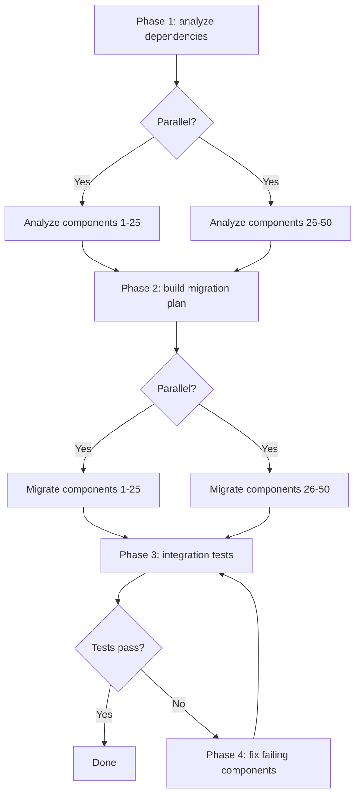

# Lesson 3: Decomposing a Complex Task into a Workflow

> Learning goals:
> - Master the three task-decomposition strategies
> - Identify dependencies between tasks
> - Turn a decomposition into an executable workflow
>
> Prerequisites: [Lesson 2: Workflow Building Blocks: Steps, State, Branches, Loops](./02-workflow-building-blocks.md) | Next: [Lesson 4 >>](./04-state-and-context.md)

## From "I don't know where to start" to clear steps

A task lands on your desk: "Split our monolithic Rails app into a microservices architecture." That's a complex task. You don't know where to begin, how many steps it takes, or what each step does.

**Task decomposition is how you take a vague, oversized task and break it into small, clear steps.**[^S16]

A good decomposition meets three standards:

1. **Each subtask is small enough** to finish in a single agent call or function.
2. **Dependencies between subtasks are explicit** — you know which must run in order and which can run in parallel.
3. **Each subtask has clear inputs and outputs** — one step's output can feed directly into the next.

Decompose well and writing the workflow feels like snapping Lego together. Decompose badly and you'll discover, mid-execution, that steps are missing, the order is wrong, or data won't flow through.[^S17]

## Strategy 1: Sequential Decomposition

**When to use it:** the task has a clear front-to-back order, and each step depends on the result of the one before it.

**How:** work backward from the end. Ask "what input does this step need? Where does that input come from?"

### Example: generating technical docs

**Task:** generate user-facing docs for an API.

**Backward decomposition:**

```
Final output: Markdown docs
  ↑ needs what?
Step 4: render Markdown (needs: structured doc content)
  ↑ comes from?
Step 3: organize content (needs: endpoint list + example code + descriptions)
  ↑ comes from?
Step 2: generate an example per endpoint (needs: endpoint list)
  ↑ comes from?
Step 1: extract the endpoint list from code (needs: source code)
  ↑
Start: source directory
```

**Turned into a workflow:**

```javascript
async function generateAPIDocsWorkflow(sourceDir) {
  // Step 1: extract endpoints
  const endpoints = await extractEndpoints(sourceDir);
  
  // Step 2: generate examples (depends on step 1)
  const examples = await Promise.all(
    endpoints.map(ep => generateExample(ep))
  );
  
  // Step 3: organize content (depends on steps 1 and 2)
  const content = await agent({
    task: 'Organize the doc structure',
    prompt: 'Organize the endpoints and examples into a user-friendly doc structure',
    context: { endpoints, examples }
  });
  
  // Step 4: render Markdown (depends on step 3)
  const markdown = await renderMarkdown(content);
  
  return markdown;
}
```

**Dependency chain:**
```
Step 1 → Step 2
   ↓         ↓
   └─→ Step 3 → Step 4
```

Can step 2 run in parallel with step 1? No — step 2 needs step 1's `endpoints`.

Can step 3 run in parallel with step 2? No — step 3 needs step 2's `examples`.

**What sequential decomposition is like:** a long dependency chain, few chances to parallelize, but the logic is clear.[^S18]

## Strategy 2: Parallel Decomposition

**When to use it:** the task splits into several independent subtasks that don't depend on each other.

**How:** spot the "do Y for every X" pattern — each X can be processed in parallel.

### Example: security-auditing a codebase

**Task:** audit 100 files for security issues.

**Parallel decomposition:**

```javascript
async function securityAuditWorkflow(files) {
  // Phase 1: audit each file in parallel (no dependencies)
  const audits = await Promise.all(
    files.map(file => auditFile(file))
  );
  
  // Phase 2: aggregate results (depends on phase 1)
  const summary = await agent({
    task: 'Summarize the security audit',
    prompt: `Analyze the audit results across ${audits.length} files,
             rank issues by severity, and produce an executive summary`,
    context: audits
  });
  
  return summary;
}

async function auditFile(file) {
  return await agent({
    task: `Audit ${file.path}`,
    prompt: `Check for SQL injection, XSS, hardcoded secrets, and weak crypto.
             Return JSON: { file, issues: [{ type, line, severity }] }`
  });
}
```

**Shape:**
```
          ┌─→ auditFile(1) ─┐
          ├─→ auditFile(2) ─┤
files ───→├─→ auditFile(3) ─┼─→ summary
          ├─→   ...         ─┤
          └─→ auditFile(100)─┘
```

**Fan-out-reduce pattern:** this is the most common shape for parallel decomposition.[^S4]

1. **Fan out:** spread the task across many parallel agents.
2. **Reduce:** merge every result into a final output.

**The power of parallel decomposition:** 100 files, 2 minutes to audit each. Sequential execution takes 200 minutes; parallel execution takes 2 (assuming no resource limits).

```agentmentor-check
{
  "id": "workflows-zh-03-decomposition-strategy",
  "label": "Pick the right decomposition strategy",
  "prompt": "Task: generate an integration-test report for 10 microservices. Each service needs to (1) start the service, (2) run tests, (3) collect logs, (4) analyze results. Finally, summarize the test status across all services. Should this task use sequential or parallel decomposition?",
  "whyHere": "You've just learned sequential and parallel decomposition back to back. This task hides two layers at once — the 10 services are independent (parallel) while the 4 steps inside each service have a strict order (sequential) — so it checks whether you read the task's structure instead of latching onto the first ordered-looking cue.",
  "mode": "single",
  "choices": [
    {
      "id": "a",
      "text": "Sequential, because the steps run in order: start → test → collect → analyze",
      "correct": false,
      "feedback": "That order is real, but it applies inside one service. The task has 10 services, and one service's test doesn't depend on another's. So the 10 services run in parallel while each service's 4 steps run in order internally, then everything is summarized. That's a hybrid, not a pure sequential, decomposition."
    },
    {
      "id": "b",
      "text": "Parallel, because the 10 services test independently, each running its 4 steps in order, then a final summary",
      "correct": true,
      "feedback": "Right. This is a fan-out-reduce hybrid: the outer layer is parallel (10 services test at once) and the inner layer is sequential (each service's start → test → collect → analyze must stay ordered). The final summary depends on every service's result. Reading both layers is what lets you use all the available parallelism without breaking each service's internal order."
    }
  ]
}
```

## Strategy 3: Hybrid Decomposition

**When to use it:** most real tasks. Some parts run in parallel, some must run in order.

**How:** first find the high-level phases (which must run in order), then find the parallel opportunities inside each phase.

### Example: a large-scale refactor

**Task:** upgrade 50 components from Vue 2 to Vue 3.

**Hybrid decomposition:**



**Turned into a workflow:**

```javascript
async function vue2to3MigrationWorkflow(components) {
  // Phase 1: analyze all components in parallel
  const analyses = await Promise.all(
    components.map(c => analyzeComponent(c))
  );
  
  // Phase 2: build the migration plan in order (depends on phase 1)
  const plan = await agent({
    task: 'Build the migration plan',
    prompt: 'Based on the analysis, decide the migration order and flag potential conflicts',
    context: analyses
  });
  
  // Phase 3: migrate components in parallel, following the plan
  const migrated = await Promise.all(
    plan.batches.map(batch => 
      Promise.all(batch.map(c => migrateComponent(c)))
    )
  );
  
  // Phase 4: run integration tests in order
  let testResult = await runIntegrationTests();
  
  // Phase 5: if tests fail, fix and retest (loop)
  let attempts = 0;
  while (!testResult.passed && attempts < 3) {
    const failures = testResult.failures;
    await Promise.all(
      failures.map(f => fixComponent(f))
    );
    testResult = await runIntegrationTests();
    attempts++;
  }
  
  if (!testResult.passed) {
    throw new Error('Migration failed: 3 fix attempts all failed the tests');
  }
  
  return { plan, migrated, testResult };
}
```

**Dependency graph for the hybrid:**

```
Phase 1 (parallel)      Phase 2 (sequential)
analyze(1..50) ────→ generatePlan
                              ↓
Phase 3 (parallel)           ↓
migrate(1..50) ←────────────┘
       ↓
Phase 4 (sequential)
runTests ←─────┐
   ↓           │
   ├─pass→ Done │
   └─fail→ Phase 5 (parallel + loop)
          fix(failures) ─┘
```

**The heart of hybrid decomposition:** keep the ordering you truly need while squeezing out every chance to parallelize.[^S18]

## Using an LLM to help you decompose

You can also hand the decomposition to an LLM. Three ways all work: zero-shot prompting, chain-of-thought prompting, and few-shot (example-guided) prompting.[^S16]

### Zero-shot

```
Task: upgrade a REST API's docs, covering 100 endpoints, from Swagger 2.0 to OpenAPI 3.0

Break this task into 5-8 clear steps. For each step, state:
1. What it does
2. What input it needs
3. What it outputs
4. Whether it can run in parallel
```

### Chain-of-thought

```
Task: refactor a 5000-line Python class by splitting it into several smaller classes

Let's think step by step about how to decompose this:

What should the first step do, and why?
What output of the first step does the second step depend on?
Which steps can run in parallel?
How do we verify each step finished correctly?

Give a detailed decomposition.
```

### Few-shot

```
I'll give you a complex task. Follow the example to break it into workflow steps.

Example task: batch-process 50 images (resize, add watermark)
Example decomposition:
1. Read the image list (input: directory path, output: file list)
2. Process each image in parallel:
   2a. Resize (input: original image, output: resized image)
   2b. Add watermark (input: resized image, output: final image)
3. Save the results (input: processed image list, output: saved-path list)

Now decompose this task: generate a contributor-stats report for 20 Git repositories
```

**The upside of LLM decomposition:** it drafts a first plan fast and catches steps you might have missed.

**The downside of LLM decomposition:** it can stay too abstract (say "analyze the data" instead of "compute the cyclomatic complexity of each file"), so it needs a human to sharpen it.[^S16]

## Practical tips for spotting dependencies

**Tip 1: ask "could this step run before the first one?"**

If the answer is "yes," they can run in parallel. If it's "no, it needs the first step's result," there's a dependency.

**Tip 2: draw the dependency graph**

```
Arrows mean dependency: A → B means "B depends on A's output"

Step 1 → Step 2 → Step 4
         ↓
       Step 3 ↗
```

Can step 2 and step 3 run in parallel? Yes — both depend only on step 1.

Can step 3 and step 4 run in parallel? No — step 4 depends on step 2.

A graph where arrows mean dependency and never loop back to the start has a formal name: a DAG (directed acyclic graph). Step 1 depends on nothing, so it's a leaf the graph can run first. Ordering every step so you never violate an arrow's direction is called a topological sort.

**Tip 3: check the data flow**

List each step's input and output:

| Step | Input | Output |
|------|------|------|
| 1. Read file | file path | file contents |
| 2. Parse code | file contents | AST |
| 3. Extract functions | AST | function list |
| 4. Generate docs | function list | Markdown |

If step X's input comes from step Y's output, X depends on Y.

## Common decomposition mistakes

**Mistake 1: steps that are too big**

```
❌ Bad:
1. Prepare the data
2. Run the migration
3. Verify the result
```

What does "prepare the data" cover? Read files? Parse config? Connect to a database? Too vague.

```
✓ Good:
1. Read the config file
2. Connect to the database
3. Read the source data table
4. Transform the data format
5. Write to the target data table
6. Run a verification query
```

**Mistake 2: no error-handling steps**

```
❌ Bad:
1. Deploy service A
2. Deploy service B
3. Update the load balancer
```

What if step 2 fails? Service A is already deployed but B isn't, and the system is in an inconsistent state.

```
✓ Good:
1. Back up the current config
2. Deploy service A
3. Health-check service A
4. If step 3 fails → roll back service A
5. Deploy service B
6. Health-check service B
7. If step 6 fails → roll back services A and B
8. Update the load balancer
```

**Mistake 3: ignoring parallel opportunities**

```
❌ Bad (sequential):
for (const service of services) {
  await buildService(service);
  await testService(service);
  await deployService(service);
}
```

This processes each service one at a time. Slow.

```
✓ Good (hybrid parallel):
// Build all services in parallel
await Promise.all(services.map(s => buildService(s)));

// Test all services in parallel
await Promise.all(services.map(s => testService(s)));

// Deploy all services in parallel
await Promise.all(services.map(s => deployService(s)));
```

<!-- exercises -->


## 💻 Exercises

### Level 1: Decompose a real task

Pick one of the tasks below and break it into 5-8 steps:

**Task A:** generate a performance report for a web app (load time, resource size, Core Web Vitals)

**Task B:** clean up a Git repository (remove unused dependencies, delete dead code, update stale comments)

**Requirements:**
- For each step, spell out what it does, its input, and its output
- Mark which steps can run in parallel
- Draw the dependency graph (words or arrows)
- Say whether it's sequential, parallel, or hybrid decomposition

<!-- rubric -->
The step count is reasonable (5-8 steps, not 3 huge ones and not 15 fragments); each step has clear inputs and outputs; parallel opportunities are correctly identified (e.g. in Task A, load time, resource size, and Core Web Vitals can be measured in parallel); the dependency graph is correct; the choice of decomposition strategy is sound.

<!-- answer -->
(Task A example) Step 1: start the app server (input: app code, output: a running service URL) → steps 2/3/4 run in parallel: step 2: measure load time (input: URL, output: load-time data), step 3: analyze resource size (input: URL, output: resource list and sizes), step 4: measure Core Web Vitals (input: URL, output: LCP/FID/CLS data) → step 5: generate the report (input: all outputs of steps 2/3/4, output: Markdown report). Dependency graph: step 1 → {step 2, step 3, step 4} → step 5. This is hybrid decomposition (steps 1 and 5 must run in order, steps 2/3/4 can run in parallel).

<!-- hint -->
Work backward from the end (the final report or result): what data does the report need? Where does that data come from? Which data can be fetched without depending on anything else?

<!-- hint -->
Task A's three performance metrics (load time, resource size, Core Web Vitals) can all be measured at once — they depend only on one shared input (the running app URL). That's a textbook parallel opportunity.

### Level 2: Fix a broken decomposition

Below is a decomposition for a "batch-migrate API endpoints" task. It has 3 serious problems. Find them and give a corrected plan.

```
Original decomposition:
1. Read all API endpoint configs
2. Generate the new endpoint definitions
3. Deploy to production
```

**Requirements:**
- Find the 3 problems (hint: steps too big, no error handling, ignored parallelism)
- Give a corrected, complete decomposition (5-8 steps)

<!-- rubric -->
Correctly identifies the 3 key problems (step 2 is too vague and doesn't say how to generate; there's no test/verification step; there's no rollback; multiple endpoints aren't processed in parallel); the corrected plan has at least 6 steps; it includes a test/verification step; it includes an error-handling or rollback step; it identifies the parallel opportunity.

<!-- answer -->
Three problems: (1) step 2, "generate the new endpoint definitions," is too vague — it doesn't say whether that means converting formats, updating config, or rewriting code; (2) there's no test or verification step, and jumping straight from generation to production deploy is dangerous; (3) if there are many endpoints, they aren't processed in parallel. Corrected plan: step 1: read all endpoint configs → step 2: convert each endpoint's definition in parallel (input: old endpoint, output: new endpoint definition) → step 3: deploy the new endpoints to a test environment → step 4: run integration tests → step 5: if tests fail, fix the problems and return to step 3 → step 6: back up the production config → step 7: deploy to production → step 8: health-check, and roll back to the step 6 backup if it fails.

<!-- hint -->
A good decomposition should answer: what happens if a step fails? How do you know a step succeeded? When there are many similar objects, do you process them one at a time or in parallel?

<!-- hint -->
There must be a test step before any production deploy, a verification step after it, and ideally a backup step before any write operation.

<!-- /exercises -->

---

**Next:** [Lesson 4: State Management and Passing Context](./04-state-and-context.md) — learn how to pass and manage data correctly between the steps of a workflow.
