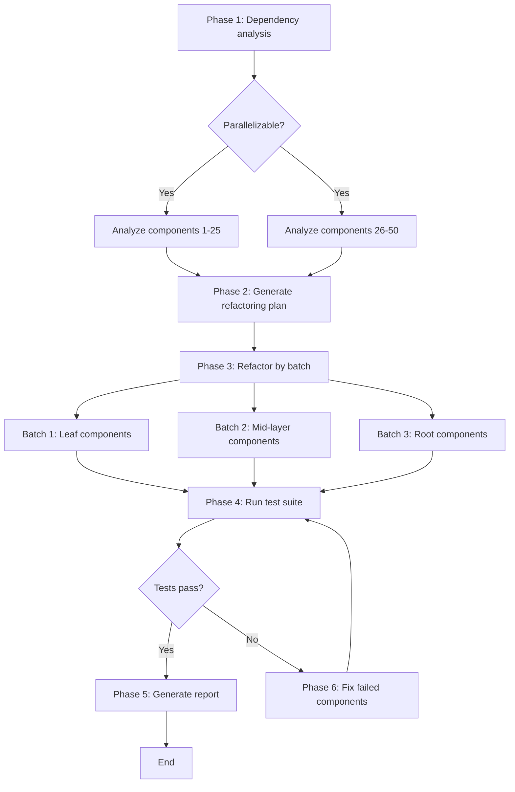

# Lesson 6: Real-World Workflows in Practice

> Learning goals:
> - Combine task decomposition, state management, and error handling to design complete workflows
> - Understand the workflow patterns behind three production-grade scenarios
> - Master observability and debugging techniques for workflows
>
> Prerequisites: [Lesson 5: Error Handling and Retry Strategies](./05-error-handling-retry.md)

## From Theory to Practice

Over the first five lessons we covered the building blocks of workflows: steps, state, decomposition, and error handling. Now we'll put them together and build three production-grade workflows drawn from real scenarios.

**The three workflows in this lesson:**

1. **Code refactoring pipeline**: refactor legacy code into modern patterns, covering analysis, planning, execution, testing, and verification
2. **Doc generation pipeline**: auto-generate API docs from code, covering extraction, example generation, rendering, and publishing
3. **Test automation flow**: an end-to-end testing workflow, covering environment setup, parallel testing, result aggregation, and report generation

**Every workflow shows:**
- A complete task decomposition
- State management and checkpoint design
- Error handling and recovery strategies
- Observability and debugging support[^S20]

## Scenario 1: Code Refactoring Pipeline

### Requirements

Refactor a legacy front-end project of 50 components from class components to function components + Hooks.

**Challenges:**
- The components depend on each other, so you can't refactor them in an arbitrary order
- Refactoring can break behavior, so it needs test verification
- 50 components can't be finished in a single conversation; they need parallel processing[^S21]

### Task Decomposition

The workflow has 6 phases. The first two can process components in parallel; the later phases run in dependency order.



### Full Implementation

```javascript
// Workflow state definition
const createInitialState = (components) => ({
  phase: 'init',
  input: { components, total: components.length },
  analysis: null,
  plan: null,
  refactored: [],
  testResults: null,
  errors: [],
  startTime: Date.now()
});

// Main workflow
async function refactoringWorkflow(componentPaths) {
  const workflowId = `refactor-${Date.now()}`;
  const store = new WorkflowStateStore();
  
  // Load or create state
  let state = await store.load(workflowId) || 
              createInitialState(componentPaths);
  
  console.log(`🚀 Starting refactoring workflow (${state.input.total} components)`);
  
  try {
    // Phase 1: Dependency analysis
    if (state.phase === 'init') {
      console.log('\n📊 Phase 1: Analyzing component dependencies...');
      
      state.analysis = await analyzeComponentsInParallel(
        state.input.components
      );
      
      state.phase = 'analyzed';
      await store.save(workflowId, state);
      console.log(`✓ Analysis done: found ${state.analysis.dependencies.length} dependencies`);
    }
    
    // Phase 2: Generate refactoring plan
    if (state.phase === 'analyzed') {
      console.log('\n📋 Phase 2: Generating the refactoring plan...');
      
      state.plan = await agent({
        task: 'Generate refactoring plan',
        prompt: `
          Based on the dependency analysis, produce the order for refactoring the components:
          1. Refactor leaf components first (those that don't depend on other components)
          2. Then the mid layer (components that depend on already-refactored ones)
          3. Finally the root components
          
          Return JSON: {
            batches: [
              { name: "Leaf components", components: [...] },
              { name: "Mid layer", components: [...] },
              { name: "Root components", components: [...] }
            ]
          }
        `,
        context: state.analysis
      });
      
      state.phase = 'planned';
      await store.save(workflowId, state);
      console.log(`✓ Plan generated: ${state.plan.batches.length} batches`);
    }
    
    // Phase 3: Refactor by batch
    if (state.phase === 'planned') {
      console.log('\n🔧 Phase 3: Running the refactor...');
      
      for (const batch of state.plan.batches) {
        console.log(`\n  Batch: ${batch.name} (${batch.components.length} components)`);
        
        // Refactor this batch's components in parallel
        const results = await Promise.allSettled(
          batch.components.map(async (component) => {
            return await retryWithBackoffAndJitter(
              async () => refactorComponent(component),
              3,
              2000
            );
          })
        );
        
        // Handle results
        for (let i = 0; i < results.length; i++) {
          const result = results[i];
          const component = batch.components[i];
          
          if (result.status === 'fulfilled') {
            state.refactored.push({
              component,
              code: result.value,
              batch: batch.name
            });
          } else {
            state.errors.push({
              component,
              error: result.reason.message,
              batch: batch.name
            });
          }
        }
        
        // Save a checkpoint after the batch completes
        await store.save(workflowId, state);
        console.log(`  ✓ ${batch.name} done`);
      }
      
      state.phase = 'refactored';
      await store.save(workflowId, state);
      console.log(`\n✓ Refactor done: ${state.refactored.length}/${state.input.total}`);
    }
    
    // Phase 4: Run tests
    if (state.phase === 'refactored') {
      console.log('\n🧪 Phase 4: Running the test suite...');
      
      state.testResults = await runTestSuite({
        timeout: 300000,  // 5 minutes
        parallel: true
      });
      
      state.phase = 'tested';
      await store.save(workflowId, state);
      
      if (state.testResults.passed) {
        console.log(`✓ Tests passed: ${state.testResults.passedCount}/${state.testResults.totalCount}`);
      } else {
        console.log(`✗ Tests failed: ${state.testResults.failedTests.length} failures`);
      }
    }
    
    // Phase 5: Fix failures (if needed)
    if (state.phase === 'tested' && !state.testResults.passed) {
      console.log('\n🔨 Phase 5: Fixing the failed components...');
      
      const failedComponents = identifyFailedComponents(
        state.testResults,
        state.refactored
      );
      
      console.log(`  ${failedComponents.length} components need fixing`);
      
      for (const component of failedComponents) {
        try {
          const fixed = await agent({
            task: `Fix component ${component.name}`,
            prompt: `
              This component's tests failed after refactoring.
              Failed tests: ${component.failedTests.join(', ')}
              Error message: ${component.errors.join('\n')}
              
              Diagnose the problem and fix the code.
            `,
            context: {
              originalCode: component.originalCode,
              refactoredCode: component.refactoredCode,
              tests: component.tests
            }
          });
          
          // Update the refactoring result
          const index = state.refactored.findIndex(r => r.component === component.path);
          state.refactored[index].code = fixed;
          
        } catch (error) {
          state.errors.push({
            component: component.path,
            error: `Fix failed: ${error.message}`,
            phase: 'fix'
          });
        }
      }
      
      // Re-test
      state.phase = 'refactored';
      await store.save(workflowId, state);
      
      // Recurse into itself (with a limit)
      state.fixAttempts = (state.fixAttempts || 0) + 1;
      if (state.fixAttempts < 3) {
        return await refactoringWorkflow(componentPaths);
      } else {
        console.log('✗ Tests still failing after 3 fix attempts');
      }
    }
    
    // Phase 6: Generate report
    if (state.phase === 'tested' && state.testResults.passed) {
      console.log('\n📄 Phase 6: Generating the refactoring report...');
      
      const report = await agent({
        task: 'Generate refactoring report',
        prompt: `
          Generate a report for the refactoring project, including:
          - Refactoring stats (how many components, distribution by batch)
          - Test result summary
          - Problems encountered and how they were solved
          - Before/after code comparison examples
          
          Return Markdown.
        `,
        context: {
          total: state.input.total,
          refactored: state.refactored.length,
          batches: state.plan.batches.map(b => b.name),
          testResults: state.testResults,
          errors: state.errors,
          duration: Date.now() - state.startTime
        }
      });
      
      await fs.writeFile('refactoring-report.md', report);
      
      state.phase = 'completed';
      state.completedAt = Date.now();
      await store.save(workflowId, state);
      
      console.log('\n✅ Refactoring workflow complete!');
      console.log(`   Report saved: refactoring-report.md`);
    }
    
    return state;
    
  } catch (error) {
    console.error('\n❌ Workflow failed:', error.message);
    state.phase = 'failed';
    state.error = error.message;
    await store.save(workflowId, state);
    throw error;
  }
}

// Helper: analyze components in parallel
async function analyzeComponentsInParallel(components) {
  const analyses = await Promise.all(
    components.map(async (path) => {
      return await agent({
        task: `Analyze ${path}`,
        prompt: `
          Analyze this component:
          1. Is it a class or a function component
          2. Which other components does it depend on (import statements)
          3. Which lifecycle methods or hooks does it use
          
          Return JSON: { type, dependencies: [], hooks: [] }
        `,
        context: { file: await fs.readFile(path, 'utf-8') }
      });
    })
  );
  
  // Build the dependency graph
  const dependencies = [];
  for (let i = 0; i < components.length; i++) {
    const component = components[i];
    const analysis = analyses[i];
    
    for (const dep of analysis.dependencies) {
      dependencies.push({ from: component, to: dep });
    }
  }
  
  return { components: analyses, dependencies };
}

// Helper: refactor a single component
async function refactorComponent(componentPath) {
  return await agent({
    task: `Refactor ${componentPath}`,
    prompt: `
      Refactor this class component into a function component + Hooks:
      1. Remove the class and constructor
      2. Replace state with useState
      3. Replace lifecycle methods with useEffect
      4. Keep the same props interface and behavior
      
      Return the complete refactored code.
    `,
    context: {
      code: await fs.readFile(componentPath, 'utf-8')
    }
  });
}
```

### Key Design Points

**1. Checkpoint strategy**: save after each batch completes, so you never re-refactor work

**2. Parallel execution**: components in the same batch can be refactored in parallel (they don't depend on each other)

**3. Retry mechanism**: one component's failure doesn't affect the others; use `Promise.allSettled` to collect every result

**4. Fix loop**: on test failure, automatically attempt a fix, up to 3 times

**5. Observability**: every phase logs clearly, and state is persisted to external storage[^S22]

## Scenario 2: Doc Generation Pipeline

### Requirements

Generate complete API docs for a service with 30 REST API endpoints, including endpoint descriptions, request/response examples, and error-code explanations.

### Task Decomposition (fan-out/aggregate pattern)

```javascript
async function apiDocGenerationWorkflow(servicePath) {
  console.log('📚 API doc generation workflow');
  
  // Step 1: extract all endpoints
  console.log('\n1️⃣ Extracting API endpoints...');
  const endpoints = await extractAPIEndpoints(servicePath);
  console.log(`   Found ${endpoints.length} endpoints`);
  
  // Step 2: generate docs for each endpoint in parallel
  console.log('\n2️⃣ Generating endpoint docs (parallel)...');
  const docs = await Promise.all(
    endpoints.map(async (endpoint, index) => {
      console.log(`   [${index + 1}/${endpoints.length}] ${endpoint.method} ${endpoint.path}`);
      
      return await agent({
        task: `Generate docs for ${endpoint.method} ${endpoint.path}`,
        prompt: `
          Generate docs for this API endpoint:
          
          ## ${endpoint.method} ${endpoint.path}
          
          Include:
          1. Description (one paragraph)
          2. Request parameters (path params, query params, body)
          3. Request examples (curl and JavaScript)
          4. Response examples (success and common errors)
          5. Error-code explanations
          
          Return Markdown.
        `,
        context: {
          code: endpoint.handlerCode,
          schema: endpoint.schema,
          examples: endpoint.existingTests || []
        }
      });
    })
  );
  
  // Step 3: generate a table of contents and overview
  console.log('\n3️⃣ Generating the doc table of contents...');
  const toc = await agent({
    task: 'Generate doc table of contents',
    prompt: `
      Generate a table of contents for these API endpoints:
      - Group by function (user management, order management, etc.)
      - List the endpoints under each group (with anchor links)
      - Generate a service overview (one paragraph on what this service does)
      
      Return Markdown.
    `,
    context: {
      endpoints: endpoints.map(e => ({ method: e.method, path: e.path, summary: e.summary }))
    }
  });
  
  // Step 4: assemble the full document
  console.log('\n4️⃣ Assembling the full document...');
  const fullDoc = [
    '# API Documentation\n',
    toc,
    '\n---\n',
    ...docs.map((doc, i) => `\n## ${endpoints[i].method} ${endpoints[i].path}\n\n${doc}`)
  ].join('\n');
  
  // Step 5: save and publish
  console.log('\n5️⃣ Saving the document...');
  await fs.writeFile('api-docs.md', fullDoc);
  
  console.log('\n✅ Docs generated!');
  console.log(`   File: api-docs.md`);
  console.log(`   Endpoints: ${endpoints.length}`);
  
  return { endpoints: endpoints.length, outputFile: 'api-docs.md' };
}
```

**Key characteristics:**
- **Fan-out/aggregate pattern**: 30 endpoints generate docs in parallel, then aggregate at the end
- **Stateless**: the task is fast enough (< 10 minutes) that it needs no checkpoints
- **Idempotent**: you can rerun it any time and overwrite the output file[^S20]

## Scenario 3: Test Automation Flow

### Requirements

Run end-to-end tests across several environments (local, staging, production), collect test results and performance metrics, and generate a comparison report.

### Full Implementation

```javascript
async function e2eTestingWorkflow(config) {
  const workflowId = `e2e-test-${Date.now()}`;
  const state = {
    environments: config.environments,  // ['local', 'staging', 'production']
    results: {},
    phase: 'init',
    startTime: Date.now()
  };
  
  console.log(`🧪 E2E testing workflow (${state.environments.length} environments)`);
  
  try {
    // Phase 1: prepare environments
    console.log('\n1️⃣ Preparing the test environments...');
    for (const env of state.environments) {
      console.log(`   Configuring the ${env} environment...`);
      await setupTestEnvironment(env);
    }
    state.phase = 'environments_ready';
    
    // Phase 2: run tests across all environments in parallel
    console.log('\n2️⃣ Running tests (parallel)...');
    const testPromises = state.environments.map(async (env) => {
      console.log(`   [${env}] Starting tests...`);
      
      try {
        const result = await runTestsWithRetry(env, {
          maxRetries: 2,
          testSuites: config.testSuites,
          timeout: 600000  // 10 minutes
        });
        
        console.log(`   [${env}] ✓ Done: ${result.passed}/${result.total} passed`);
        return { env, result, status: 'success' };
        
      } catch (error) {
        console.log(`   [${env}] ✗ Failed: ${error.message}`);
        return { env, error: error.message, status: 'failed' };
      }
    });
    
    const testResults = await Promise.all(testPromises);
    
    // Save results into state
    for (const { env, result, error, status } of testResults) {
      state.results[env] = status === 'success' ? result : { error };
    }
    
    state.phase = 'tests_completed';
    
    // Phase 3: generate the comparison report
    console.log('\n3️⃣ Generating the test report...');
    const report = await agent({
      task: 'Generate cross-environment test comparison report',
      prompt: `
        Generate a cross-environment test comparison report:
        
        Comparison dimensions:
        1. Pass rate (per environment)
        2. Performance metrics (average response time, P95, P99)
        3. Failing-case analysis (which cases fail in which environments)
        4. Environment-difference issues (cases that fail only in a specific environment)
        
        Return Markdown, with tables and chart descriptions.
      `,
      context: state.results
    });
    
    await fs.writeFile('e2e-test-report.md', report);
    
    // Phase 4: if there are failures, generate fix suggestions
    const failedEnvs = Object.entries(state.results)
      .filter(([env, result]) => result.error || result.failedCount > 0);
    
    if (failedEnvs.length > 0) {
      console.log('\n4️⃣ Generating failure analysis...');
      
      for (const [env, result] of failedEnvs) {
        const analysis = await agent({
          task: `Analyze failures in the ${env} environment`,
          prompt: `
            Diagnose the test failures and provide fix suggestions:
            
            Failed tests: ${result.failedTests?.map(t => t.name).join(', ')}
            Error messages: ${result.failedTests?.map(t => t.error).join('\n')}
            
            Possible causes:
            - Environment configuration issues
            - Data inconsistency
            - Time-dependent tests
            - Network issues
            
            Return fix suggestions (Markdown).
          `,
          context: { env, result }
        });
        
        await fs.writeFile(`fix-${env}.md`, analysis);
        console.log(`   ${env} failure analysis saved: fix-${env}.md`);
      }
    }
    
    state.phase = 'completed';
    state.completedAt = Date.now();
    
    console.log('\n✅ Testing workflow complete!');
    console.log(`   Report: e2e-test-report.md`);
    console.log(`   Total time: ${((state.completedAt - state.startTime) / 1000).toFixed(1)}s`);
    
    return state;
    
  } catch (error) {
    console.error('\n❌ Workflow failed:', error);
    throw error;
  }
}

// Helper: run tests with retry
async function runTestsWithRetry(env, options) {
  const { maxRetries, testSuites, timeout } = options;
  
  for (let attempt = 1; attempt <= maxRetries + 1; attempt++) {
    try {
      const result = await runTests(env, testSuites, timeout);
      return result;
      
    } catch (error) {
      if (attempt <= maxRetries) {
        console.log(`   [${env}] Retry ${attempt}/${maxRetries}...`);
        await sleep(5000 * attempt);  // increasing delay
      } else {
        throw error;
      }
    }
  }
}
```

**Key characteristics:**
- **Parallel testing**: multiple environments run their tests at the same time, cutting total time dramatically
- **Fault tolerance**: one environment's failure doesn't affect the others
- **Smart retry**: failed tests retry automatically (network blips and transient faults are common)
- **Failure analysis**: fix suggestions for failures are generated automatically[^S20]

## Workflow Observability

**A good workflow should be able to answer, at any moment:**

- How far along is it? (X/Y done)
- How much longer is it likely to take?
- What errors has it hit?
- Where are the performance bottlenecks?

If you can't answer these, your logging and state tracking aren't detailed enough. Debugging a workflow rides on those records, not on guessing.

### Implementing Observability

```javascript
class ObservableWorkflow {
  constructor(name, totalSteps) {
    this.name = name;
    this.totalSteps = totalSteps;
    this.currentStep = 0;
    this.startTime = Date.now();
    this.stepTimes = [];
    this.errors = [];
  }
  
  async step(name, fn) {
    this.currentStep++;
    const stepNum = this.currentStep;
    const progress = ((stepNum / this.totalSteps) * 100).toFixed(1);
    
    console.log(`\n[${this.name}] Step ${stepNum}/${this.totalSteps} (${progress}%): ${name}`);
    
    const stepStart = Date.now();
    
    try {
      const result = await fn();
      const duration = Date.now() - stepStart;
      this.stepTimes.push({ name, duration });
      
      console.log(`  ✓ Done (${(duration / 1000).toFixed(1)}s)`);
      
      return result;
      
    } catch (error) {
      const duration = Date.now() - stepStart;
      this.errors.push({ step: name, error: error.message, duration });
      
      console.log(`  ✗ Failed: ${error.message}`);
      throw error;
    }
  }
  
  summary() {
    const totalDuration = Date.now() - this.startTime;
    const avgStepTime = this.stepTimes.reduce((sum, s) => sum + s.duration, 0) / this.stepTimes.length;
    
    console.log(`\n━━━ ${this.name} summary ━━━`);
    console.log(`Total time: ${(totalDuration / 1000).toFixed(1)}s`);
    console.log(`Steps: ${this.currentStep}/${this.totalSteps}`);
    console.log(`Average per step: ${(avgStepTime / 1000).toFixed(1)}s`);
    
    if (this.errors.length > 0) {
      console.log(`\nErrors (${this.errors.length}):`);
      for (const err of this.errors) {
        console.log(`  - ${err.step}: ${err.error}`);
      }
    }
    
    console.log(`\nSlowest steps:`);
    const sorted = [...this.stepTimes].sort((a, b) => b.duration - a.duration);
    for (const step of sorted.slice(0, 3)) {
      console.log(`  - ${step.name}: ${(step.duration / 1000).toFixed(1)}s`);
    }
  }
}

// Usage example
async function myWorkflow() {
  const wf = new ObservableWorkflow('Code refactoring', 5);
  
  await wf.step('Analyze dependencies', async () => {
    return await analyzeDependencies();
  });
  
  await wf.step('Generate plan', async () => {
    return await generatePlan();
  });
  
  // ...
  
  wf.summary();
}
```

That bit inside `summary()` that sorts by duration and prints only the three slowest steps is the simplest form of performance profiling: measure how long each step took, then find the bottleneck from the data instead of guessing which step is slow.

<!-- exercises -->


## 💻 Exercises

### Level 1: Design Your Own Workflow

Pick a real task from your own work and design a complete workflow for it.

**Requirements:**
1. Describe the task (2-3 sentences)
2. Draw the workflow diagram (phases, branches, parallel steps)
3. List the state fields (at least 5)
4. Explain where you'd set checkpoints
5. List the possible errors and how you'd handle them

<!-- rubric -->
The task description is clear; the workflow diagram has at least 4 phases and at least 1 branch or parallel point; the state design is sound (includes a phase marker, progress, results, errors); checkpoint placement is reasonable (after expensive operations, before irreversible ones); at least 3 error types are identified with handling strategies.

<!-- answer -->
(Example omitted; it should be designed around the learner's own work scenario.)

<!-- hint -->
Start with a repetitive task that recently took you more than 2 hours, and think about which handful of big steps it would break into if you handed it to an agent.

<!-- hint -->
A good workflow usually has clear inputs (files, config, data) and outputs (a report, modified code, a deployment result). Work backward from the input and output to figure out which transformations you need in between.

### Level 2: Debug a Failing Workflow

A "batch image processing" workflow fails on the 47th image, with the error message `Error: EMFILE: too many open files`.

**Questions:**
1. What type of error is this (transient/permanent)?
2. Why does it fail on the 47th image rather than the 1st?
3. How should you fix the workflow? (Give code-change suggestions.)

<!-- rubric -->
Correctly identifies the error type (a transient resource-exhaustion error, but with a code-design root cause); understands the cause (too many file handles opened in parallel, exceeding the system limit); provides a reasonable fix (limit concurrency, close files promptly after processing, use streaming).

<!-- answer -->
(1) This is a transient error (resource exhaustion), but the root cause is a code problem. (2) The workflow probably uses `Promise.all(images.map(...))` to process every image in parallel; each image opens a file handle, and by the 47th it exceeds the system limit (usually 1024 or 4096). (3) Fix: limit concurrency, processing only 10 images at a time and waiting between batches. Code: `for (let i = 0; i < images.length; i += 10) { const batch = images.slice(i, i + 10); await Promise.all(batch.map(processImage)); }`. Or use streaming and close each file as soon as it's processed.

<!-- hint -->
The EMFILE error means too many files are open. Think about whether the workflow opens all 100 images at once, or closes one before opening the next.

<!-- hint -->
If you process 100 files in parallel with `Promise.all(array.map(...))`, you open 100 file handles at once. The fix is to limit concurrency (e.g. process only 10 at a time).

<!-- /exercises -->

---

**Congratulations on finishing the Agent Workflow Design course.**

You now have a handle on:
- The core concepts of workflows and where they fit
- The three strategies for task decomposition
- State management and the checkpoint mechanism
- Error handling and retry strategies
- Three production-grade workflows from real scenarios

**Next steps:**
1. Practice a simple workflow (< 5 steps) in one of your projects
2. Add complexity step by step (parallelism, checkpoints, error handling)
3. Share your workflow design and get feedback from the community
4. Explore more advanced topics (distributed workflows, workflow orchestration frameworks, visual workflow editors)
