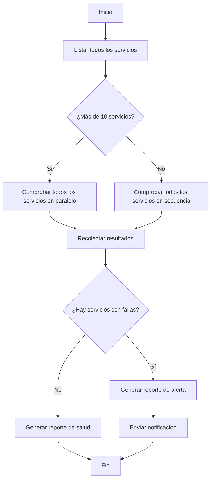

# Lección 2: Bloques de construcción de un flujo de trabajo: pasos, estado, bifurcaciones y bucles

> Objetivos de aprendizaje:
> - Dominar los cuatro bloques de construcción centrales de un flujo de trabajo
> - Entender las dependencias y el paso de datos entre pasos
> - Aprender a diseñar el diagrama de ejecución de un flujo de trabajo
>
> Requisitos: [Lección 1: De la conversación al flujo de trabajo](./01-from-conversation-to-workflow.md) | Siguiente: [Lección 3 >>](./03-task-decomposition.md)

## Los flujos de trabajo no son magia, son composición

En la lección anterior vimos que un flujo de trabajo puede coordinar decenas de agentes para terminar una tarea compleja. Pero si abres el script de un flujo de trabajo, descubrirás que es código común y corriente: funciones, bucles, condicionales.

**La potencia de un flujo de trabajo viene de combinar cuatro bloques de construcción simples:**

1. **Pasos** — la unidad básica de trabajo
2. **Estado** — los datos que se comparten entre pasos
3. **Bifurcaciones** — elegir un camino según una condición
4. **Bucles** — repetir una operación similar

Una vez que entiendes estos cuatro bloques de construcción, puedes diseñar un flujo de trabajo de cualquier complejidad.[^S4]

## Bloque de construcción 1: los pasos

**Un paso es la operación atómica de un flujo de trabajo.** Cada paso es o bien una llamada a un agente, o bien una función determinista.[^S5]

### Pasos de agente frente a pasos de función

```javascript
// Paso de agente: dejar que el LLM haga el trabajo que requiere razonamiento
const summary = await agent({
  task: 'Resume los hallazgos de la revisión de código',
  prompt: 'Extrae los problemas clave de estos resultados de revisión, ordenados por gravedad',
  context: reviews
});

// Paso de función: transformación determinista, sin necesidad de LLM
const filtered = reviews.filter(r => r.severity === 'high');
const count = filtered.length;
```

**Cuándo usar un paso de agente:**
- Necesitas entender una entrada difusa (lenguaje natural, datos no estructurados)
- Necesitas generar contenido creativo (documentación, código, explicaciones)
- Necesitas emitir un juicio (¿este código tiene un problema de seguridad?)

**Cuándo usar un paso de función:**
- Transformación de datos (filtrar, ordenar, formatear)
- Cálculos (estadísticas, agregación)
- Comprobaciones condicionales (lógica if-else)
- Operaciones con archivos (leer, escribir, mover)

**Buena práctica:** los pasos de agente razonan, los pasos de función calculan. No le pidas al LLM que haga un simple filtrado de un array o que sume números: es lento, caro y poco confiable.[^S5]

### El contrato de entrada/salida de un paso

Cada paso debería tener un contrato claro de entrada y salida:

```javascript
// Paso bueno: entradas y salidas claras
async function analyzeFile(filePath) {
  // Entrada: ruta del archivo (string)
  const result = await agent({
    task: `Analiza ${filePath}`,
    prompt: 'Devuelve JSON: { complexity: number, issues: string[] }'
  });
  // Salida: { complexity, issues }
  return JSON.parse(result);
}

// Paso malo: entradas y salidas difusas
async function doStuff(data) {
  // ¿En qué formato viene data? ¿Qué devuelve? No queda claro.
  return await agent({ task: 'Procesa los datos', context: data });
}
```

**Un contrato claro hace que un flujo de trabajo sea fácil de entender y de depurar.** Cuando el paso 5 se rompe, ves de inmediato que es porque la salida del paso 4 tenía el formato equivocado.[^S6]

## Bloque de construcción 2: el estado

**El estado son los datos que se comparten entre pasos.** Es como la memoria del flujo de trabajo: guarda los resultados intermedios y el progreso de la ejecución.[^S11]

### Dos tipos de estado

**Estado del flujo de trabajo:**
- Toda la información sobre la tarea actual: en qué paso vas, el resultado de cada paso, lo que necesita el paso siguiente
- Se guarda en variables del script o en una base de datos externa
- Se pasa entre pasos, pero no entre sesiones

**Estado de sesión:**
- El historial de conversación del usuario y sus preferencias
- Lo gestiona el propio agente; al flujo de trabajo no le hace falta ocuparse de él[^S11]

```javascript
// Ejemplo de estado del flujo de trabajo
const workflowState = {
  phase: 'analysis',           // fase actual
  filesAnalyzed: 47,          // progreso
  issues: [],                 // resultados acumulados
  nextAction: 'generate-plan' // paso siguiente
};
```

### Patrones de gestión del estado

**Patrón 1: variables del script (bueno para flujos de trabajo cortos)**

```javascript
async function shortWorkflow() {
  // El estado son simples variables
  let files = await listFiles();
  let analysis = await analyzeFiles(files);
  let report = await generateReport(analysis);
  return report;
}
```

**Patrón 2: un objeto de estado (bueno para complejidad media)**

```javascript
async function mediumWorkflow() {
  const state = {
    input: await getInput(),
    processed: [],
    errors: []
  };
  
  for (const item of state.input) {
    try {
      const result = await processItem(item);
      state.processed.push(result);
    } catch (err) {
      state.errors.push({ item, error: err });
    }
  }
  
  return state;
}
```

**Patrón 3: almacenamiento externo (bueno para flujos de trabajo de larga duración)**

```javascript
async function longWorkflow(taskId) {
  // El estado vive en una base de datos, recuperable en cualquier momento
  let state = await db.loadState(taskId);
  
  if (state.phase === 'completed') return state.result;
  
  // Reanudar desde donde se quedó
  if (state.phase === 'analysis') {
    state.analysisResult = await runAnalysis();
    state.phase = 'planning';
    await db.saveState(taskId, state);
  }
  
  if (state.phase === 'planning') {
    state.plan = await generatePlan(state.analysisResult);
    state.phase = 'execution';
    await db.saveState(taskId, state);
  }
  
  // ...
}
```

**Puntos de control:** guarda el estado después de los pasos clave para que el flujo de trabajo pueda reanudarse desde el punto de falla en lugar de empezar de nuevo.[^S12]

## Bloque de construcción 3: las bifurcaciones

**Una bifurcación elige una ruta de ejecución distinta según una condición.**[^S2]

### Bifurcación simple

```javascript
const fileCount = files.length;

if (fileCount < 10) {
  // Pocos archivos, procesar en secuencia
  for (const file of files) {
    await processFile(file);
  }
} else {
  // Muchos archivos, procesar en paralelo
  await Promise.all(files.map(f => processFile(f)));
}
```

### Bifurcar según la decisión de un agente

```javascript
// El agente evalúa la complejidad
const assessment = await agent({
  task: 'Evalúa la complejidad de la refactorización',
  prompt: 'Devuelve JSON: { complexity: "low" | "medium" | "high" }'
});

const parsed = JSON.parse(assessment);

if (parsed.complexity === 'low') {
  // Refactorización automática
  await autoRefactor();
} else if (parsed.complexity === 'medium') {
  // Generar un plan y esperar la aprobación humana
  const plan = await generatePlan();
  await waitForApproval(plan);
  await executeRefactor(plan);
} else {
  // Complejidad alta, solo generar recomendaciones
  await generateRecommendations();
}
```

### Bifurcación para el manejo de errores

```javascript
for (const service of services) {
  try {
    await deployService(service);
  } catch (error) {
    if (error.type === 'transient') {
      // Error transitorio, reintentar
      await retry(() => deployService(service));
    } else {
      // Error permanente, revertir
      await rollback(service);
      throw error;
    }
  }
}
```

```agentmentor-check
{
  "id": "workflows-zh-02-branching-logic",
  "label": "Juzgar si un diseño de bifurcación es sólido",
  "prompt": "Un flujo de trabajo de revisión de código decide su paso siguiente según la cantidad de problemas encontrados: 0 problemas → fusión automática; de 1 a 3 problemas → avisar al autor para que los corrija; 4 o más problemas → rechazar el PR y generar un reporte detallado. ¿Debería implementarse esta lógica de bifurcación con un agente o con un if-else del script?",
  "whyHere": "Justo después de aprender la diferencia entre pasos de agente y pasos de función y cómo se implementan las bifurcaciones, esto comprueba si sabes distinguir cuándo una bifurcación debería ser determinista (del script) y cuándo debería decidirla un agente.",
  "mode": "single",
  "choices": [
    {
      "id": "a",
      "text": "Con un agente, porque hace falta entender la gravedad de los problemas",
      "correct": false,
      "feedback": "No exactamente. La cantidad de problemas es un número sin ambigüedad (0, de 1 a 3, 4 o más); no hace falta ningún agente para entenderlo ni para juzgarlo. La evaluación de la gravedad debería ocurrir en un paso anterior, y la bifurcación solo necesita un if-else sobre un número claro: un script es más rápido, más confiable y más predecible."
    },
    {
      "id": "b",
      "text": "Con un if-else del script, porque la condición es una comparación numérica clara",
      "correct": true,
      "feedback": "Correcto. La condición de la bifurcación es determinista (si la cantidad de problemas es 0, de 1 a 3, o 4 o más); no necesita razonamiento ni comprensión, así que un if-else es más rápido, más barato y del todo predecible. El agente debería centrarse en el trabajo de razonamiento (como juzgar si un problema es realmente un problema), no en comparaciones numéricas simples."
    }
  ]
}
```

## Bloque de construcción 4: los bucles

**Un bucle te permite ejecutar la misma operación sobre muchos objetos similares.** Esta es la fuente central de la potencia de un flujo de trabajo.[^S2]

### Bucle secuencial

```javascript
// Procesar uno tras otro
for (const pr of pullRequests) {
  const review = await reviewPR(pr);
  await postComment(pr, review);
}
```

### Bucle paralelo

```javascript
// Procesar todos a la vez
const reviews = await Promise.all(
  pullRequests.map(pr => reviewPR(pr))
);

// En paralelo pero con un tope de concurrencia (evita la sobrecarga)
const limit = 5;
for (let i = 0; i < pullRequests.length; i += limit) {
  const batch = pullRequests.slice(i, i + limit);
  await Promise.all(batch.map(pr => reviewPR(pr)));
}
```

Aquí, `limit = 5` es el tope de concurrencia: ejecutar como máximo 5 a la vez en lugar de disparar los 100 de golpe con `Promise.all`, lo que abriría demasiadas conexiones o descriptores de archivo.

### Bucle con acumulación

```javascript
let totalIssues = 0;
const reports = [];

for (const file of files) {
  const analysis = await analyzeFile(file);
  totalIssues += analysis.issueCount;
  reports.push({
    file: file.path,
    issues: analysis.issues
  });
}

console.log(`Se encontraron ${totalIssues} problemas en total`);
```

### Bucle con terminación condicional

```javascript
let attempts = 0;
let success = false;

while (!success && attempts < 3) {
  try {
    await runTests();
    success = true;
  } catch (error) {
    attempts++;
    console.log(`La prueba falló, reintentando ${attempts}/3`);
    await wait(1000 * attempts); // retroceso exponencial
  }
}

if (!success) throw new Error('Las pruebas fallaron las 3 veces');
```

## Combinar los bloques de construcción: un flujo de trabajo completo

Combinemos estos cuatro bloques de construcción para diseñar un flujo de trabajo de «chequeo de salud de microservicios»:



El script correspondiente:

```javascript
async function healthCheckWorkflow() {
  // Paso 1: obtener la lista de servicios (paso de función)
  const services = await listServices();
  
  // Estado: guardar los resultados
  const state = {
    total: services.length,
    healthy: [],
    unhealthy: []
  };
  
  // Bifurcación: elegir una estrategia según la cantidad
  let results;
  if (services.length > 10) {
    // Bucle paralelo
    results = await Promise.all(
      services.map(s => checkServiceHealth(s))
    );
  } else {
    // Bucle secuencial
    results = [];
    for (const service of services) {
      results.push(await checkServiceHealth(service));
    }
  }
  
  // Paso de función: clasificar los resultados
  for (const result of results) {
    if (result.healthy) {
      state.healthy.push(result);
    } else {
      state.unhealthy.push(result);
    }
  }
  
  // Bifurcación: generar un reporte distinto según los resultados
  if (state.unhealthy.length > 0) {
    // Paso de agente: generar una alerta
    const alert = await agent({
      task: 'Genera un reporte de alerta',
      prompt: `${state.unhealthy.length} servicios están en mal estado,
               genera un reporte detallado de la falla y los pasos de corrección sugeridos`,
      context: state.unhealthy
    });
    await sendAlert(alert);
  } else {
    // Paso de agente: generar un reporte de salud
    const report = await agent({
      task: 'Genera un reporte de salud',
      prompt: `Los ${state.total} servicios están sanos,
               genera un resumen conciso del estado`
    });
    await logReport(report);
  }
  
  return state;
}
```

**Este flujo de trabajo usa los cuatro bloques de construcción:**
- **Pasos**: `listServices`, `checkServiceHealth`, las llamadas a `agent()`
- **Estado**: el objeto `state` que guarda el total y las listas de servicios sanos y no sanos
- **Bifurcaciones**: paralelo o secuencial según la cantidad de servicios, y el tipo de reporte según el estado de salud
- **Bucles**: el bucle paralelo con `map`, el bucle secuencial con `for`

## Cómo pensar el diseño de un flujo de trabajo

**Trabaja hacia atrás desde el final:**

1. ¿Cuál es la salida final? (un reporte, servicios desplegados, código limpio)
2. ¿Qué entrada necesita el último paso? (datos agregados, resultados validados)
3. ¿De dónde viene esa entrada? (de la salida del paso anterior)
4. Repite hasta llegar al inicio (la entrada del usuario o el sistema de archivos)

**Detecta las oportunidades de paralelismo:**

- Si varios pasos no dependen entre sí, pueden ejecutarse en paralelo
- «Haz Y para cada X» por lo general se puede paralelizar
- Con paralelismo, diez tareas de 5 minutos pasan de 50 minutos a 5

**Haz explícitas las dependencias:**

```javascript
// Ejemplo de dependencia
const files = await readFiles();      // paso 1
const analysis = await analyze(files); // el paso 2 depende del paso 1
const plan = await makePlan(analysis); // el paso 3 depende del paso 2

// Se pueden ejecutar en paralelo (sin dependencias)
const [files, config, users] = await Promise.all([
  readFiles(),
  loadConfig(),
  fetchUsers()
]);
```

<!-- exercises -->


## 💻 Ejercicios

### Nivel 1: Diseñar un flujo de trabajo simple

Tarea: diseña un flujo de trabajo de «procesamiento de imágenes por lotes». La entrada son 50 imágenes y necesitas: (1) redimensionarlas a 800x600, (2) agregarles una marca de agua, (3) convertirlas al formato WebP.

**Requisitos:**
- Dibuja el diagrama de flujo (una descripción en texto también sirve, por ejemplo A → B → C)
- Indica qué pasos usan funciones y cuáles usan un agente
- Indica dónde se puede ejecutar en paralelo
- Escribe la parte central del pseudocódigo (bucle y bifurcación)

<!-- rubric -->
El diagrama de flujo es claro (incluye al menos los nodos de entrada, el bucle de procesamiento y la salida); identifica correctamente que todos los pasos son pasos de función (no hace falta ningún agente, porque el procesamiento de imágenes es determinista); reconoce que las 50 imágenes se pueden procesar en paralelo (cada una es independiente); el pseudocódigo incluye un bucle paralelo (`Promise.all`).

<!-- answer -->
Diagrama de flujo: inicio → leer 50 imágenes → procesar cada imagen en paralelo (redimensionar → agregar marca de agua → convertir el formato) → guardar los resultados → fin. Todos los pasos usan funciones (una biblioteca de imágenes); no hace falta ningún agente. Las 50 imágenes se pueden procesar en paralelo, porque procesar una imagen no depende de las demás. Pseudocódigo: `const results = await Promise.all(images.map(async img => { const resized = await resize(img, 800, 600); const watermarked = await addWatermark(resized); return await convertToWebP(watermarked); }));`

<!-- hint -->
El procesamiento de imágenes (redimensionar, agregar marca de agua, convertir el formato) es determinista —no hace falta comprensión ni razonamiento—, así que todos son pasos de función.

<!-- hint -->
Pregúntate: al procesar la imagen 10, ¿necesitas conocer el resultado de la 9? Si no, puedes ejecutarlas en paralelo.

### Nivel 2: Identificar las necesidades de gestión del estado

Un flujo de trabajo de «migración de una base de código» necesita: (1) escanear 200 archivos para encontrar las llamadas a la API que hay que migrar, (2) migrar todos los archivos en paralelo, (3) ejecutar las pruebas, (4) si las pruebas fallan, revertir todos los cambios.

**Preguntas:**
1. ¿Qué estado necesita guardar este flujo de trabajo? Enumera al menos 3 campos de estado.
2. ¿Después de qué paso deberías establecer un punto de control? ¿Por qué?
3. Si el paso 3 (ejecutar las pruebas) falla, ¿qué información de estado necesita el flujo de trabajo para revertir correctamente?

<!-- rubric -->
Identifica correctamente al menos 3 piezas clave de estado (por ejemplo, la lista de archivos por migrar, la lista de archivos migrados, una copia de seguridad del contenido original de cada archivo, los resultados de las pruebas); señala que debería establecerse un punto de control después del paso 2 (migración terminada), con una razón sólida (por ejemplo, la migración lleva mucho tiempo y un punto de control evita repetirla); identifica el estado necesario para la reversión (lista de archivos + copia de seguridad del contenido original).

<!-- answer -->
(1) Campos de estado: `filesToMigrate` (la lista de archivos por migrar), `migratedFiles` (los archivos migrados y su nuevo contenido), `backups` (una copia de seguridad del contenido original de cada archivo), `testResult` (si las pruebas pasaron). (2) Debería establecerse un punto de control después del paso 2, porque migrar 200 archivos lleva mucho tiempo y, si la fase de pruebas se cae, no querrás volver a migrar todos los archivos. (3) La reversión necesita `migratedFiles` (para saber qué archivos cambiaron) y `backups` (para saber cómo restaurarlos), sobrescribiendo los archivos migrados con el contenido de la copia de seguridad.

<!-- hint -->
El estado suele incluir: los datos de entrada, los resultados intermedios, el progreso de la ejecución y la información de errores. Todo lo que sea importante para «reanudar la ejecución» o «deshacer una operación» debería guardarse.

<!-- hint -->
Establece un punto de control «después de una operación costosa en tiempo» o «antes de una operación irreversible». En este flujo de trabajo, la migración es la operación costosa y la reversión es la irreversible (necesitas saber qué cambió para deshacerlo).

<!-- /exercises -->

---

**Siguiente:** [Lección 3: Descomponer una tarea compleja en un flujo de trabajo](./03-task-decomposition.md) — estrategias para desglosar sistemáticamente una tarea compleja en los pasos de un flujo de trabajo
