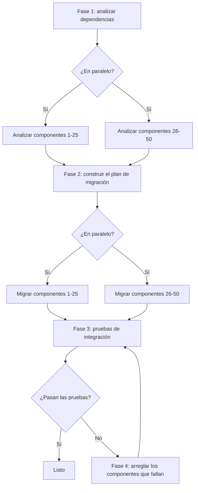

# Lección 3: Descomponer una tarea compleja en un flujo de trabajo

> Objetivos de aprendizaje:
> - Dominar las tres estrategias de descomposición de tareas
> - Identificar las dependencias entre tareas
> - Convertir una descomposición en un flujo de trabajo ejecutable
>
> Requisitos: [Lección 2: Bloques de construcción de un flujo de trabajo: pasos, estado, bifurcaciones y bucles](./02-workflow-building-blocks.md) | Siguiente: [Lección 4 >>](./04-state-and-context.md)

## De «no sé por dónde empezar» a pasos claros

Te cae una tarea en el escritorio: «Divide nuestra app monolítica de Rails en una arquitectura de microservicios». Eso es una tarea compleja. No sabes por dónde empezar, cuántos pasos lleva ni qué hace cada paso.

**La descomposición de tareas es la forma de tomar una tarea vaga y demasiado grande y partirla en pasos pequeños y claros.**[^S16]

Una buena descomposición cumple tres estándares:

1. **Cada subtarea es lo bastante pequeña** como para terminarse en una sola llamada a un agente o en una función.
2. **Las dependencias entre subtareas son explícitas**: sabes cuáles tienen que ejecutarse en orden y cuáles pueden ejecutarse en paralelo.
3. **Cada subtarea tiene entradas y salidas claras**: la salida de un paso puede alimentar directamente al siguiente.

Si descompones bien, escribir el flujo de trabajo se siente como encajar piezas de Lego. Si descompones mal, descubrirás a mitad de la ejecución que faltan pasos, que el orden está mal o que los datos no fluyen.[^S17]

## Estrategia 1: descomposición secuencial

**Cuándo usarla:** la tarea tiene un orden claro de principio a fin y cada paso depende del resultado del anterior.

**Cómo:** trabaja hacia atrás desde el final. Pregunta «¿qué entrada necesita este paso? ¿De dónde viene esa entrada?».

### Ejemplo: generar documentación técnica

**Tarea:** generar documentación de cara al usuario para una API.

**Descomposición hacia atrás:**

```
Salida final: documentación en Markdown
  ↑ ¿necesita qué?
Paso 4: renderizar el Markdown (necesita: contenido estructurado del documento)
  ↑ ¿de dónde viene?
Paso 3: organizar el contenido (necesita: lista de endpoints + código de ejemplo + descripciones)
  ↑ ¿de dónde viene?
Paso 2: generar un ejemplo por endpoint (necesita: lista de endpoints)
  ↑ ¿de dónde viene?
Paso 1: extraer la lista de endpoints del código (necesita: código fuente)
  ↑
Inicio: directorio de fuentes
```

**Convertido en un flujo de trabajo:**

```javascript
async function generateAPIDocsWorkflow(sourceDir) {
  // Paso 1: extraer los endpoints
  const endpoints = await extractEndpoints(sourceDir);
  
  // Paso 2: generar ejemplos (depende del paso 1)
  const examples = await Promise.all(
    endpoints.map(ep => generateExample(ep))
  );
  
  // Paso 3: organizar el contenido (depende de los pasos 1 y 2)
  const content = await agent({
    task: 'Organiza la estructura del documento',
    prompt: 'Organiza los endpoints y los ejemplos en una estructura de documento fácil de usar',
    context: { endpoints, examples }
  });
  
  // Paso 4: renderizar el Markdown (depende del paso 3)
  const markdown = await renderMarkdown(content);
  
  return markdown;
}
```

**Cadena de dependencias:**
```
Paso 1 → Paso 2
   ↓         ↓
   └─→ Paso 3 → Paso 4
```

¿Puede el paso 2 ejecutarse en paralelo con el paso 1? No: el paso 2 necesita los `endpoints` del paso 1.

¿Puede el paso 3 ejecutarse en paralelo con el paso 2? No: el paso 3 necesita los `examples` del paso 2.

**Cómo es la descomposición secuencial:** una cadena larga de dependencias, pocas oportunidades de paralelizar, pero con una lógica clara.[^S18]

## Estrategia 2: descomposición paralela

**Cuándo usarla:** la tarea se divide en varias subtareas independientes que no dependen entre sí.

**Cómo:** detecta el patrón «haz Y para cada X»: cada X se puede procesar en paralelo.

### Ejemplo: auditoría de seguridad de una base de código

**Tarea:** auditar 100 archivos en busca de problemas de seguridad.

**Descomposición paralela:**

```javascript
async function securityAuditWorkflow(files) {
  // Fase 1: auditar cada archivo en paralelo (sin dependencias)
  const audits = await Promise.all(
    files.map(file => auditFile(file))
  );
  
  // Fase 2: agregar los resultados (depende de la fase 1)
  const summary = await agent({
    task: 'Resume la auditoría de seguridad',
    prompt: `Analiza los resultados de la auditoría de ${audits.length} archivos,
             ordena los problemas por gravedad y produce un resumen ejecutivo`,
    context: audits
  });
  
  return summary;
}

async function auditFile(file) {
  return await agent({
    task: `Audita ${file.path}`,
    prompt: `Busca inyección SQL, XSS, secretos hardcodeados y criptografía débil.
             Devuelve JSON: { file, issues: [{ type, line, severity }] }`
  });
}
```

**Forma:**
```
          ┌─→ auditFile(1) ─┐
          ├─→ auditFile(2) ─┤
files ───→├─→ auditFile(3) ─┼─→ summary
          ├─→   ...         ─┤
          └─→ auditFile(100)─┘
```

**Patrón fan-out-reduce:** esta es la forma más común de la descomposición paralela.[^S4]

1. **Fan out:** repartir la tarea entre muchos agentes en paralelo.
2. **Reduce:** fusionar todos los resultados en una salida final.

**La potencia de la descomposición paralela:** 100 archivos, 2 minutos para auditar cada uno. La ejecución secuencial lleva 200 minutos; la ejecución paralela lleva 2 (suponiendo que no haya límites de recursos).

```agentmentor-check
{
  "id": "workflows-zh-03-decomposition-strategy",
  "label": "Elegir la estrategia de descomposición correcta",
  "prompt": "Tarea: generar un reporte de pruebas de integración para 10 microservicios. Cada servicio necesita (1) iniciar el servicio, (2) ejecutar las pruebas, (3) recolectar los registros, (4) analizar los resultados. Al final, resumir el estado de las pruebas de todos los servicios. ¿Debería esta tarea usar descomposición secuencial o paralela?",
  "whyHere": "Acabas de aprender la descomposición secuencial y la paralela, una después de la otra. Esta tarea esconde dos capas a la vez —los 10 servicios son independientes (paralelo) mientras que los 4 pasos dentro de cada servicio tienen un orden estricto (secuencial)—, así que comprueba si lees la estructura de la tarea en lugar de aferrarte a la primera señal que parece indicar un orden.",
  "mode": "single",
  "choices": [
    {
      "id": "a",
      "text": "Secuencial, porque los pasos se ejecutan en orden: iniciar → probar → recolectar → analizar",
      "correct": false,
      "feedback": "Ese orden es real, pero se aplica dentro de un servicio. La tarea tiene 10 servicios, y la prueba de un servicio no depende de la de otro. Así que los 10 servicios se ejecutan en paralelo mientras que los 4 pasos de cada servicio se ejecutan en orden internamente, y después se resume todo. Eso es una descomposición híbrida, no puramente secuencial."
    },
    {
      "id": "b",
      "text": "Paralela, porque los 10 servicios se prueban de forma independiente, cada uno ejecutando sus 4 pasos en orden, y luego un resumen final",
      "correct": true,
      "feedback": "Correcto. Esto es un híbrido de tipo fan-out-reduce: la capa externa es paralela (los 10 servicios se prueban a la vez) y la capa interna es secuencial (el iniciar → probar → recolectar → analizar de cada servicio tiene que mantener su orden). El resumen final depende del resultado de todos los servicios. Leer ambas capas es lo que te permite aprovechar todo el paralelismo disponible sin romper el orden interno de cada servicio."
    }
  ]
}
```

## Estrategia 3: descomposición híbrida

**Cuándo usarla:** en la mayoría de las tareas reales. Algunas partes se ejecutan en paralelo y otras tienen que ejecutarse en orden.

**Cómo:** primero encuentra las fases de alto nivel (que tienen que ejecutarse en orden) y después busca las oportunidades de paralelismo dentro de cada fase.

### Ejemplo: una refactorización a gran escala

**Tarea:** actualizar 50 componentes de Vue 2 a Vue 3.

**Descomposición híbrida:**



**Convertido en un flujo de trabajo:**

```javascript
async function vue2to3MigrationWorkflow(components) {
  // Fase 1: analizar todos los componentes en paralelo
  const analyses = await Promise.all(
    components.map(c => analyzeComponent(c))
  );
  
  // Fase 2: construir el plan de migración en orden (depende de la fase 1)
  const plan = await agent({
    task: 'Construye el plan de migración',
    prompt: 'A partir del análisis, decide el orden de migración y señala los posibles conflictos',
    context: analyses
  });
  
  // Fase 3: migrar los componentes en paralelo, siguiendo el plan
  const migrated = await Promise.all(
    plan.batches.map(batch => 
      Promise.all(batch.map(c => migrateComponent(c)))
    )
  );
  
  // Fase 4: ejecutar las pruebas de integración en orden
  let testResult = await runIntegrationTests();
  
  // Fase 5: si las pruebas fallan, arreglar y volver a probar (bucle)
  let attempts = 0;
  while (!testResult.passed && attempts < 3) {
    const failures = testResult.failures;
    await Promise.all(
      failures.map(f => fixComponent(f))
    );
    testResult = await runIntegrationTests();
    attempts++;
  }
  
  if (!testResult.passed) {
    throw new Error('La migración falló: los 3 intentos de arreglo fallaron en las pruebas');
  }
  
  return { plan, migrated, testResult };
}
```

**Grafo de dependencias del híbrido:**

```
Fase 1 (paralelo)      Fase 2 (secuencial)
analyze(1..50) ────→ generatePlan
                              ↓
Fase 3 (paralelo)            ↓
migrate(1..50) ←────────────┘
       ↓
Fase 4 (secuencial)
runTests ←─────┐
   ↓           │
   ├─pasa→ Listo │
   └─falla→ Fase 5 (paralelo + bucle)
          fix(failures) ─┘
```

**El corazón de la descomposición híbrida:** conservar el orden que de verdad necesitas mientras exprimes cada oportunidad de paralelizar.[^S18]

## Usar un LLM para ayudarte a descomponer

También puedes delegar la descomposición a un LLM. Las tres formas funcionan: prompting zero-shot, prompting chain-of-thought y prompting few-shot (guiado por ejemplos).[^S16]

### Zero-shot

```
Tarea: actualizar la documentación de una API REST, que cubre 100 endpoints, de Swagger 2.0 a OpenAPI 3.0

Divide esta tarea en 5-8 pasos claros. Para cada paso, indica:
1. Qué hace
2. Qué entrada necesita
3. Qué produce como salida
4. Si se puede ejecutar en paralelo
```

### Chain-of-thought

```
Tarea: refactorizar una clase de Python de 5000 líneas dividiéndola en varias clases más pequeñas

Pensemos paso a paso cómo descomponer esto:

¿Qué debería hacer el primer paso y por qué?
¿De qué salida del primer paso depende el segundo paso?
¿Qué pasos se pueden ejecutar en paralelo?
¿Cómo verificamos que cada paso terminó correctamente?

Da una descomposición detallada.
```

### Few-shot

```
Te voy a dar una tarea compleja. Sigue el ejemplo para dividirla en pasos de un flujo de trabajo.

Tarea de ejemplo: procesar 50 imágenes por lotes (redimensionar, agregar marca de agua)
Descomposición de ejemplo:
1. Leer la lista de imágenes (entrada: ruta del directorio, salida: lista de archivos)
2. Procesar cada imagen en paralelo:
   2a. Redimensionar (entrada: imagen original, salida: imagen redimensionada)
   2b. Agregar marca de agua (entrada: imagen redimensionada, salida: imagen final)
3. Guardar los resultados (entrada: lista de imágenes procesadas, salida: lista de rutas guardadas)

Ahora descompón esta tarea: generar un reporte de estadísticas de contribuidores para 20 repositorios de Git
```

**La ventaja de la descomposición con LLM:** redacta rápido un primer plan y detecta pasos que se te podrían haber pasado.

**La desventaja de la descomposición con LLM:** puede quedarse demasiado abstracta (decir «analiza los datos» en lugar de «calcula la complejidad ciclomática de cada archivo»), así que necesita que una persona la afine.[^S16]

## Consejos prácticos para detectar dependencias

**Consejo 1: pregunta «¿podría este paso ejecutarse antes del primero?»**

Si la respuesta es «sí», pueden ejecutarse en paralelo. Si es «no, necesita el resultado del primer paso», hay una dependencia.

**Consejo 2: dibuja el grafo de dependencias**

```
Las flechas significan dependencia: A → B significa «B depende de la salida de A»

Paso 1 → Paso 2 → Paso 4
         ↓
       Paso 3 ↗
```

¿Pueden el paso 2 y el paso 3 ejecutarse en paralelo? Sí: ambos dependen solo del paso 1.

¿Pueden el paso 3 y el paso 4 ejecutarse en paralelo? No: el paso 4 depende del paso 2.

Un grafo donde las flechas significan dependencia y nunca vuelven al inicio tiene un nombre formal: un DAG (grafo acíclico dirigido). El paso 1 no depende de nada, así que es una hoja que el grafo puede ejecutar primero. Ordenar todos los pasos de modo que nunca se viole la dirección de una flecha se llama orden topológico.

**Consejo 3: revisa el flujo de datos**

Enumera la entrada y la salida de cada paso:

| Paso | Entrada | Salida |
|------|------|------|
| 1. Leer el archivo | ruta del archivo | contenido del archivo |
| 2. Parsear el código | contenido del archivo | AST |
| 3. Extraer las funciones | AST | lista de funciones |
| 4. Generar la documentación | lista de funciones | Markdown |

Si la entrada del paso X viene de la salida del paso Y, X depende de Y.

## Errores comunes al descomponer

**Error 1: pasos demasiado grandes**

```
❌ Mal:
1. Preparar los datos
2. Ejecutar la migración
3. Verificar el resultado
```

¿Qué cubre «preparar los datos»? ¿Leer archivos? ¿Parsear la configuración? ¿Conectarse a una base de datos? Demasiado vago.

```
✓ Bien:
1. Leer el archivo de configuración
2. Conectarse a la base de datos
3. Leer la tabla de datos de origen
4. Transformar el formato de los datos
5. Escribir en la tabla de datos de destino
6. Ejecutar una consulta de verificación
```

**Error 2: sin pasos de manejo de errores**

```
❌ Mal:
1. Desplegar el servicio A
2. Desplegar el servicio B
3. Actualizar el balanceador de carga
```

¿Y si el paso 2 falla? El servicio A ya está desplegado pero B no, y el sistema queda en un estado inconsistente.

```
✓ Bien:
1. Respaldar la configuración actual
2. Desplegar el servicio A
3. Comprobar la salud del servicio A
4. Si el paso 3 falla → revertir el servicio A
5. Desplegar el servicio B
6. Comprobar la salud del servicio B
7. Si el paso 6 falla → revertir los servicios A y B
8. Actualizar el balanceador de carga
```

**Error 3: ignorar las oportunidades de paralelismo**

```
❌ Mal (secuencial):
for (const service of services) {
  await buildService(service);
  await testService(service);
  await deployService(service);
}
```

Esto procesa un servicio a la vez. Lento.

```
✓ Bien (paralelismo híbrido):
// Construir todos los servicios en paralelo
await Promise.all(services.map(s => buildService(s)));

// Probar todos los servicios en paralelo
await Promise.all(services.map(s => testService(s)));

// Desplegar todos los servicios en paralelo
await Promise.all(services.map(s => deployService(s)));
```

<!-- exercises -->


## 💻 Ejercicios

### Nivel 1: Descomponer una tarea real

Elige una de las tareas de abajo y divídela en 5-8 pasos:

**Tarea A:** generar un reporte de rendimiento para una app web (tiempo de carga, tamaño de los recursos, Core Web Vitals)

**Tarea B:** limpiar un repositorio de Git (quitar dependencias sin usar, eliminar código muerto, actualizar comentarios desactualizados)

**Requisitos:**
- Para cada paso, detalla qué hace, su entrada y su salida
- Marca qué pasos se pueden ejecutar en paralelo
- Dibuja el grafo de dependencias (con palabras o flechas)
- Di si es una descomposición secuencial, paralela o híbrida

<!-- rubric -->
La cantidad de pasos es razonable (de 5 a 8 pasos, ni 3 enormes ni 15 fragmentos); cada paso tiene entradas y salidas claras; las oportunidades de paralelismo están bien identificadas (por ejemplo, en la tarea A, el tiempo de carga, el tamaño de los recursos y los Core Web Vitals se pueden medir en paralelo); el grafo de dependencias es correcto; la elección de la estrategia de descomposición es sólida.

<!-- answer -->
(Ejemplo de la tarea A) Paso 1: iniciar el servidor de la app (entrada: código de la app, salida: la URL de un servicio en ejecución) → los pasos 2/3/4 se ejecutan en paralelo: paso 2: medir el tiempo de carga (entrada: URL, salida: datos de tiempo de carga), paso 3: analizar el tamaño de los recursos (entrada: URL, salida: lista de recursos y tamaños), paso 4: medir los Core Web Vitals (entrada: URL, salida: datos de LCP/FID/CLS) → paso 5: generar el reporte (entrada: todas las salidas de los pasos 2/3/4, salida: reporte en Markdown). Grafo de dependencias: paso 1 → {paso 2, paso 3, paso 4} → paso 5. Esto es una descomposición híbrida (los pasos 1 y 5 tienen que ejecutarse en orden, los pasos 2/3/4 se pueden ejecutar en paralelo).

<!-- hint -->
Trabaja hacia atrás desde el final (el reporte o el resultado final): ¿qué datos necesita el reporte? ¿De dónde vienen esos datos? ¿Qué datos se pueden obtener sin depender de nada más?

<!-- hint -->
Las tres métricas de rendimiento de la tarea A (tiempo de carga, tamaño de los recursos, Core Web Vitals) se pueden medir todas a la vez: dependen solo de una entrada compartida (la URL de la app en ejecución). Ese es un ejemplo clásico de oportunidad de paralelismo.

### Nivel 2: Arreglar una descomposición rota

Abajo hay una descomposición para una tarea de «migrar endpoints de API por lotes». Tiene 3 problemas serios. Encuéntralos y da un plan corregido.

```
Descomposición original:
1. Leer todas las configuraciones de los endpoints de la API
2. Generar las nuevas definiciones de los endpoints
3. Desplegar a producción
```

**Requisitos:**
- Encuentra los 3 problemas (pista: pasos demasiado grandes, sin manejo de errores, paralelismo ignorado)
- Da una descomposición corregida y completa (de 5 a 8 pasos)

<!-- rubric -->
Identifica correctamente los 3 problemas clave (el paso 2 es demasiado vago y no dice cómo generar; no hay paso de prueba ni de verificación; no hay reversión; los múltiples endpoints no se procesan en paralelo); el plan corregido tiene al menos 6 pasos; incluye un paso de prueba o de verificación; incluye un paso de manejo de errores o de reversión; identifica la oportunidad de paralelismo.

<!-- answer -->
Tres problemas: (1) el paso 2, «generar las nuevas definiciones de los endpoints», es demasiado vago: no dice si eso significa convertir formatos, actualizar la configuración o reescribir código; (2) no hay paso de prueba ni de verificación, y saltar directo de la generación al despliegue en producción es peligroso; (3) si hay muchos endpoints, no se procesan en paralelo. Plan corregido: paso 1: leer todas las configuraciones de los endpoints → paso 2: convertir en paralelo la definición de cada endpoint (entrada: endpoint viejo, salida: nueva definición del endpoint) → paso 3: desplegar los nuevos endpoints en un entorno de pruebas → paso 4: ejecutar las pruebas de integración → paso 5: si las pruebas fallan, arreglar los problemas y volver al paso 3 → paso 6: respaldar la configuración de producción → paso 7: desplegar a producción → paso 8: comprobar la salud y revertir a la copia de seguridad del paso 6 si falla.

<!-- hint -->
Una buena descomposición debería responder: ¿qué pasa si un paso falla? ¿Cómo sabes que un paso tuvo éxito? Cuando hay muchos objetos similares, ¿los procesas de a uno o en paralelo?

<!-- hint -->
Tiene que haber un paso de prueba antes de cualquier despliegue a producción, un paso de verificación después y, idealmente, un paso de respaldo antes de cualquier operación de escritura.

<!-- /exercises -->

---

**Siguiente:** [Lección 4: Gestión de estado y paso de contexto](./04-state-and-context.md) — aprende a pasar y gestionar correctamente los datos entre los pasos de un flujo de trabajo.
