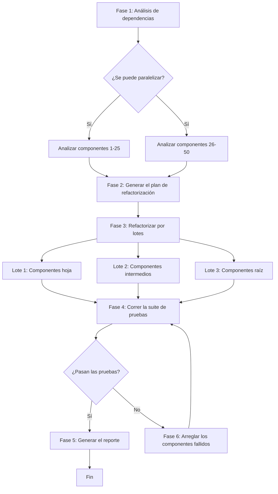

# Lección 6: Flujos de trabajo del mundo real en la práctica

> Objetivos de aprendizaje:
> - Combinar descomposición de tareas, gestión de estado y manejo de errores para diseñar flujos de trabajo completos
> - Entender los patrones de flujo de trabajo detrás de tres escenarios de nivel producción
> - Dominar las técnicas de observabilidad y depuración de flujos de trabajo
>
> Requisitos: [Lección 5: Manejo de errores y estrategias de reintento](./05-error-handling-retry.md)

## De la teoría a la práctica

A lo largo de las primeras cinco lecciones cubrimos las piezas con las que se arma un flujo de trabajo: pasos, estado, descomposición y manejo de errores. Ahora las vamos a juntar y construir tres flujos de trabajo de nivel producción sacados de escenarios reales.

**Los tres flujos de trabajo de esta lección:**

1. **Pipeline de refactorización de código**: refactorizar código heredado hacia patrones modernos, cubriendo análisis, planificación, ejecución, pruebas y verificación
2. **Pipeline de generación de documentación**: generar automáticamente documentación de API a partir del código, cubriendo extracción, generación de ejemplos, renderizado y publicación
3. **Flujo de automatización de pruebas**: un flujo de trabajo de pruebas de punta a punta, cubriendo preparación del entorno, pruebas en paralelo, agregación de resultados y generación del reporte

**Cada flujo de trabajo muestra:**
- Una descomposición completa de la tarea
- El diseño de la gestión de estado y de los puntos de control
- Estrategias de manejo de errores y de recuperación
- Soporte para observabilidad y depuración[^S20]

## Escenario 1: pipeline de refactorización de código

### Requisitos

Refactorizar un proyecto de frontend heredado de 50 componentes, pasándolos de componentes de clase a componentes de función + Hooks.

**Desafíos:**
- Los componentes dependen unos de otros, así que no puedes refactorizarlos en un orden arbitrario
- La refactorización puede romper el comportamiento, así que necesita verificación con pruebas
- 50 componentes no se pueden terminar en una sola conversación; necesitan procesamiento en paralelo[^S21]

### Descomposición de la tarea

El flujo de trabajo tiene 6 fases. Las dos primeras pueden procesar componentes en paralelo; las fases posteriores corren en orden de dependencia.



### Implementación completa

```javascript
// Definición del estado del flujo de trabajo
const createInitialState = (components) => ({
  phase: 'init',
  input: { components, total: components.length },
  analysis: null,
  plan: null,
  refactored: [],
  testResults: null,
  errors: [],
  startTime: Date.now()
});

// Flujo de trabajo principal
async function refactoringWorkflow(componentPaths) {
  const workflowId = `refactor-${Date.now()}`;
  const store = new WorkflowStateStore();
  
  // Cargar o crear el estado
  let state = await store.load(workflowId) || 
              createInitialState(componentPaths);
  
  console.log(`🚀 Iniciando el flujo de trabajo de refactorización (${state.input.total} componentes)`);
  
  try {
    // Fase 1: análisis de dependencias
    if (state.phase === 'init') {
      console.log('\n📊 Fase 1: Analizando las dependencias de los componentes...');
      
      state.analysis = await analyzeComponentsInParallel(
        state.input.components
      );
      
      state.phase = 'analyzed';
      await store.save(workflowId, state);
      console.log(`✓ Análisis listo: se encontraron ${state.analysis.dependencies.length} dependencias`);
    }
    
    // Fase 2: generar el plan de refactorización
    if (state.phase === 'analyzed') {
      console.log('\n📋 Fase 2: Generando el plan de refactorización...');
      
      state.plan = await agent({
        task: 'Generar plan de refactorización',
        prompt: `
          A partir del análisis de dependencias, produce el orden en que hay que refactorizar los componentes:
          1. Refactorizar primero los componentes hoja (los que no dependen de otros componentes)
          2. Después la capa intermedia (componentes que dependen de otros ya refactorizados)
          3. Por último los componentes raíz
          
          Devuelve JSON: {
            batches: [
              { name: "Componentes hoja", components: [...] },
              { name: "Capa intermedia", components: [...] },
              { name: "Componentes raíz", components: [...] }
            ]
          }
        `,
        context: state.analysis
      });
      
      state.phase = 'planned';
      await store.save(workflowId, state);
      console.log(`✓ Plan generado: ${state.plan.batches.length} lotes`);
    }
    
    // Fase 3: refactorizar por lotes
    if (state.phase === 'planned') {
      console.log('\n🔧 Fase 3: Ejecutando la refactorización...');
      
      for (const batch of state.plan.batches) {
        console.log(`\n  Lote: ${batch.name} (${batch.components.length} componentes)`);
        
        // Refactorizar en paralelo los componentes de este lote
        const results = await Promise.allSettled(
          batch.components.map(async (component) => {
            return await retryWithBackoffAndJitter(
              async () => refactorComponent(component),
              3,
              2000
            );
          })
        );
        
        // Manejar los resultados
        for (let i = 0; i < results.length; i++) {
          const result = results[i];
          const component = batch.components[i];
          
          if (result.status === 'fulfilled') {
            state.refactored.push({
              component,
              code: result.value,
              batch: batch.name
            });
          } else {
            state.errors.push({
              component,
              error: result.reason.message,
              batch: batch.name
            });
          }
        }
        
        // Guardar un punto de control cuando el lote termina
        await store.save(workflowId, state);
        console.log(`  ✓ ${batch.name} listo`);
      }
      
      state.phase = 'refactored';
      await store.save(workflowId, state);
      console.log(`\n✓ Refactorización lista: ${state.refactored.length}/${state.input.total}`);
    }
    
    // Fase 4: correr las pruebas
    if (state.phase === 'refactored') {
      console.log('\n🧪 Fase 4: Corriendo la suite de pruebas...');
      
      state.testResults = await runTestSuite({
        timeout: 300000,  // 5 minutos
        parallel: true
      });
      
      state.phase = 'tested';
      await store.save(workflowId, state);
      
      if (state.testResults.passed) {
        console.log(`✓ Pruebas superadas: ${state.testResults.passedCount}/${state.testResults.totalCount}`);
      } else {
        console.log(`✗ Pruebas fallidas: ${state.testResults.failedTests.length} fallas`);
      }
    }
    
    // Fase 5: arreglar las fallas (si hace falta)
    if (state.phase === 'tested' && !state.testResults.passed) {
      console.log('\n🔨 Fase 5: Arreglando los componentes fallidos...');
      
      const failedComponents = identifyFailedComponents(
        state.testResults,
        state.refactored
      );
      
      console.log(`  ${failedComponents.length} componentes necesitan arreglo`);
      
      for (const component of failedComponents) {
        try {
          const fixed = await agent({
            task: `Arreglar el componente ${component.name}`,
            prompt: `
              Las pruebas de este componente fallaron después de la refactorización.
              Pruebas fallidas: ${component.failedTests.join(', ')}
              Mensaje de error: ${component.errors.join('\n')}
              
              Diagnostica el problema y arregla el código.
            `,
            context: {
              originalCode: component.originalCode,
              refactoredCode: component.refactoredCode,
              tests: component.tests
            }
          });
          
          // Actualizar el resultado de la refactorización
          const index = state.refactored.findIndex(r => r.component === component.path);
          state.refactored[index].code = fixed;
          
        } catch (error) {
          state.errors.push({
            component: component.path,
            error: `Falló el arreglo: ${error.message}`,
            phase: 'fix'
          });
        }
      }
      
      // Volver a probar
      state.phase = 'refactored';
      await store.save(workflowId, state);
      
      // Recursión sobre sí mismo (con un límite)
      state.fixAttempts = (state.fixAttempts || 0) + 1;
      if (state.fixAttempts < 3) {
        return await refactoringWorkflow(componentPaths);
      } else {
        console.log('✗ Las pruebas siguen fallando después de 3 intentos de arreglo');
      }
    }
    
    // Fase 6: generar el reporte
    if (state.phase === 'tested' && state.testResults.passed) {
      console.log('\n📄 Fase 6: Generando el reporte de refactorización...');
      
      const report = await agent({
        task: 'Generar reporte de refactorización',
        prompt: `
          Genera un reporte del proyecto de refactorización, que incluya:
          - Estadísticas de la refactorización (cuántos componentes, distribución por lote)
          - Resumen de los resultados de las pruebas
          - Problemas encontrados y cómo se resolvieron
          - Ejemplos de comparación del código antes y después
          
          Devuelve Markdown.
        `,
        context: {
          total: state.input.total,
          refactored: state.refactored.length,
          batches: state.plan.batches.map(b => b.name),
          testResults: state.testResults,
          errors: state.errors,
          duration: Date.now() - state.startTime
        }
      });
      
      await fs.writeFile('refactoring-report.md', report);
      
      state.phase = 'completed';
      state.completedAt = Date.now();
      await store.save(workflowId, state);
      
      console.log('\n✅ ¡Flujo de trabajo de refactorización completo!');
      console.log(`   Reporte guardado: refactoring-report.md`);
    }
    
    return state;
    
  } catch (error) {
    console.error('\n❌ El flujo de trabajo falló:', error.message);
    state.phase = 'failed';
    state.error = error.message;
    await store.save(workflowId, state);
    throw error;
  }
}

// Auxiliar: analizar componentes en paralelo
async function analyzeComponentsInParallel(components) {
  const analyses = await Promise.all(
    components.map(async (path) => {
      return await agent({
        task: `Analizar ${path}`,
        prompt: `
          Analiza este componente:
          1. Si es un componente de clase o de función
          2. De qué otros componentes depende (sentencias import)
          3. Qué métodos del ciclo de vida o hooks usa
          
          Devuelve JSON: { type, dependencies: [], hooks: [] }
        `,
        context: { file: await fs.readFile(path, 'utf-8') }
      });
    })
  );
  
  // Construir el grafo de dependencias
  const dependencies = [];
  for (let i = 0; i < components.length; i++) {
    const component = components[i];
    const analysis = analyses[i];
    
    for (const dep of analysis.dependencies) {
      dependencies.push({ from: component, to: dep });
    }
  }
  
  return { components: analyses, dependencies };
}

// Auxiliar: refactorizar un solo componente
async function refactorComponent(componentPath) {
  return await agent({
    task: `Refactorizar ${componentPath}`,
    prompt: `
      Refactoriza este componente de clase para convertirlo en un componente de función + Hooks:
      1. Quita la clase y el constructor
      2. Reemplaza state por useState
      3. Reemplaza los métodos del ciclo de vida por useEffect
      4. Mantén la misma interfaz de props y el mismo comportamiento
      
      Devuelve el código refactorizado completo.
    `,
    context: {
      code: await fs.readFile(componentPath, 'utf-8')
    }
  });
}
```

### Puntos clave del diseño

**1. Estrategia de puntos de control**: guardar cuando termina cada lote, para no volver a refactorizar trabajo ya hecho

**2. Ejecución en paralelo**: los componentes del mismo lote se pueden refactorizar en paralelo (no dependen entre sí)

**3. Mecanismo de reintento**: que un componente falle no afecta a los demás; usa `Promise.allSettled` para recolectar todos los resultados

**4. Ciclo de arreglo**: ante una falla de pruebas, intenta arreglar automáticamente, hasta 3 veces

**5. Observabilidad**: cada fase deja registros claros y el estado se persiste en almacenamiento externo[^S22]

## Escenario 2: pipeline de generación de documentación

### Requisitos

Generar documentación de API completa para un servicio con 30 endpoints REST, incluyendo descripciones de los endpoints, ejemplos de petición y respuesta, y explicaciones de los códigos de error.

### Descomposición de la tarea (patrón fan-out/agregación)

```javascript
async function apiDocGenerationWorkflow(servicePath) {
  console.log('📚 Flujo de trabajo de generación de documentación de la API');
  
  // Paso 1: extraer todos los endpoints
  console.log('\n1️⃣ Extrayendo los endpoints de la API...');
  const endpoints = await extractAPIEndpoints(servicePath);
  console.log(`   Se encontraron ${endpoints.length} endpoints`);
  
  // Paso 2: generar la documentación de cada endpoint en paralelo
  console.log('\n2️⃣ Generando la documentación de los endpoints (en paralelo)...');
  const docs = await Promise.all(
    endpoints.map(async (endpoint, index) => {
      console.log(`   [${index + 1}/${endpoints.length}] ${endpoint.method} ${endpoint.path}`);
      
      return await agent({
        task: `Generar documentación para ${endpoint.method} ${endpoint.path}`,
        prompt: `
          Genera la documentación de este endpoint de API:
          
          ## ${endpoint.method} ${endpoint.path}
          
          Incluye:
          1. Descripción (un párrafo)
          2. Parámetros de la petición (parámetros de ruta, de consulta, cuerpo)
          3. Ejemplos de petición (curl y JavaScript)
          4. Ejemplos de respuesta (éxito y errores comunes)
          5. Explicación de los códigos de error
          
          Devuelve Markdown.
        `,
        context: {
          code: endpoint.handlerCode,
          schema: endpoint.schema,
          examples: endpoint.existingTests || []
        }
      });
    })
  );
  
  // Paso 3: generar un índice y una vista general
  console.log('\n3️⃣ Generando el índice de la documentación...');
  const toc = await agent({
    task: 'Generar índice de la documentación',
    prompt: `
      Genera un índice para estos endpoints de API:
      - Agrupa por función (gestión de usuarios, gestión de pedidos, etc.)
      - Lista los endpoints bajo cada grupo (con enlaces de ancla)
      - Genera una vista general del servicio (un párrafo sobre qué hace este servicio)
      
      Devuelve Markdown.
    `,
    context: {
      endpoints: endpoints.map(e => ({ method: e.method, path: e.path, summary: e.summary }))
    }
  });
  
  // Paso 4: ensamblar el documento completo
  console.log('\n4️⃣ Ensamblando el documento completo...');
  const fullDoc = [
    '# Documentación de la API\n',
    toc,
    '\n---\n',
    ...docs.map((doc, i) => `\n## ${endpoints[i].method} ${endpoints[i].path}\n\n${doc}`)
  ].join('\n');
  
  // Paso 5: guardar y publicar
  console.log('\n5️⃣ Guardando el documento...');
  await fs.writeFile('api-docs.md', fullDoc);
  
  console.log('\n✅ ¡Documentación generada!');
  console.log(`   Archivo: api-docs.md`);
  console.log(`   Endpoints: ${endpoints.length}`);
  
  return { endpoints: endpoints.length, outputFile: 'api-docs.md' };
}
```

**Características clave:**
- **Patrón fan-out/agregación**: 30 endpoints generan su documentación en paralelo y al final se agrega todo
- **Sin estado**: la tarea es lo bastante rápida (< 10 minutos) como para no necesitar puntos de control
- **Idempotente**: puedes volver a correrlo cuando quieras y sobrescribir el archivo de salida[^S20]

## Escenario 3: flujo de automatización de pruebas

### Requisitos

Correr pruebas de punta a punta en varios entornos (local, staging, producción), recolectar los resultados de las pruebas y las métricas de rendimiento, y generar un reporte comparativo.

### Implementación completa

```javascript
async function e2eTestingWorkflow(config) {
  const workflowId = `e2e-test-${Date.now()}`;
  const state = {
    environments: config.environments,  // ['local', 'staging', 'production']
    results: {},
    phase: 'init',
    startTime: Date.now()
  };
  
  console.log(`🧪 Flujo de trabajo de pruebas E2E (${state.environments.length} entornos)`);
  
  try {
    // Fase 1: preparar los entornos
    console.log('\n1️⃣ Preparando los entornos de prueba...');
    for (const env of state.environments) {
      console.log(`   Configurando el entorno ${env}...`);
      await setupTestEnvironment(env);
    }
    state.phase = 'environments_ready';
    
    // Fase 2: correr las pruebas en todos los entornos en paralelo
    console.log('\n2️⃣ Corriendo las pruebas (en paralelo)...');
    const testPromises = state.environments.map(async (env) => {
      console.log(`   [${env}] Iniciando las pruebas...`);
      
      try {
        const result = await runTestsWithRetry(env, {
          maxRetries: 2,
          testSuites: config.testSuites,
          timeout: 600000  // 10 minutos
        });
        
        console.log(`   [${env}] ✓ Listo: ${result.passed}/${result.total} superadas`);
        return { env, result, status: 'success' };
        
      } catch (error) {
        console.log(`   [${env}] ✗ Falló: ${error.message}`);
        return { env, error: error.message, status: 'failed' };
      }
    });
    
    const testResults = await Promise.all(testPromises);
    
    // Guardar los resultados en el estado
    for (const { env, result, error, status } of testResults) {
      state.results[env] = status === 'success' ? result : { error };
    }
    
    state.phase = 'tests_completed';
    
    // Fase 3: generar el reporte comparativo
    console.log('\n3️⃣ Generando el reporte de pruebas...');
    const report = await agent({
      task: 'Generar reporte comparativo de pruebas entre entornos',
      prompt: `
        Genera un reporte comparativo de las pruebas entre entornos:
        
        Dimensiones de comparación:
        1. Tasa de aprobación (por entorno)
        2. Métricas de rendimiento (tiempo de respuesta promedio, P95, P99)
        3. Análisis de los casos fallidos (qué casos fallan en qué entornos)
        4. Problemas por diferencias de entorno (casos que fallan solo en un entorno específico)
        
        Devuelve Markdown, con tablas y descripciones de gráficas.
      `,
      context: state.results
    });
    
    await fs.writeFile('e2e-test-report.md', report);
    
    // Fase 4: si hay fallas, generar sugerencias de arreglo
    const failedEnvs = Object.entries(state.results)
      .filter(([env, result]) => result.error || result.failedCount > 0);
    
    if (failedEnvs.length > 0) {
      console.log('\n4️⃣ Generando el análisis de fallas...');
      
      for (const [env, result] of failedEnvs) {
        const analysis = await agent({
          task: `Analizar las fallas en el entorno ${env}`,
          prompt: `
            Diagnostica las fallas de las pruebas y da sugerencias de arreglo:
            
            Pruebas fallidas: ${result.failedTests?.map(t => t.name).join(', ')}
            Mensajes de error: ${result.failedTests?.map(t => t.error).join('\n')}
            
            Causas posibles:
            - Problemas de configuración del entorno
            - Inconsistencia de datos
            - Pruebas que dependen del tiempo
            - Problemas de red
            
            Devuelve sugerencias de arreglo (Markdown).
          `,
          context: { env, result }
        });
        
        await fs.writeFile(`fix-${env}.md`, analysis);
        console.log(`   Análisis de fallas de ${env} guardado: fix-${env}.md`);
      }
    }
    
    state.phase = 'completed';
    state.completedAt = Date.now();
    
    console.log('\n✅ ¡Flujo de trabajo de pruebas completo!');
    console.log(`   Reporte: e2e-test-report.md`);
    console.log(`   Tiempo total: ${((state.completedAt - state.startTime) / 1000).toFixed(1)}s`);
    
    return state;
    
  } catch (error) {
    console.error('\n❌ El flujo de trabajo falló:', error);
    throw error;
  }
}

// Auxiliar: correr las pruebas con reintento
async function runTestsWithRetry(env, options) {
  const { maxRetries, testSuites, timeout } = options;
  
  for (let attempt = 1; attempt <= maxRetries + 1; attempt++) {
    try {
      const result = await runTests(env, testSuites, timeout);
      return result;
      
    } catch (error) {
      if (attempt <= maxRetries) {
        console.log(`   [${env}] Reintento ${attempt}/${maxRetries}...`);
        await sleep(5000 * attempt);  // retardo creciente
      } else {
        throw error;
      }
    }
  }
}
```

**Características clave:**
- **Pruebas en paralelo**: varios entornos corren sus pruebas al mismo tiempo, lo que recorta muchísimo el tiempo total
- **Tolerancia a fallas**: que un entorno falle no afecta a los demás
- **Reintento inteligente**: las pruebas fallidas se reintentan automáticamente (los tropiezos de red y las fallas transitorias son comunes)
- **Análisis de fallas**: las sugerencias de arreglo para las fallas se generan automáticamente[^S20]

## Observabilidad del flujo de trabajo

**Un buen flujo de trabajo debería poder responder, en cualquier momento:**

- ¿Qué tan avanzado está? (X/Y listos)
- ¿Cuánto más va a tardar, probablemente?
- ¿Con qué errores se topó?
- ¿Dónde están los cuellos de botella de rendimiento?

Si no puedes responder esto, tus registros y tu seguimiento del estado no son lo bastante detallados. Depurar un flujo de trabajo se monta sobre esos registros, no sobre adivinar.

### Implementar la observabilidad

```javascript
class ObservableWorkflow {
  constructor(name, totalSteps) {
    this.name = name;
    this.totalSteps = totalSteps;
    this.currentStep = 0;
    this.startTime = Date.now();
    this.stepTimes = [];
    this.errors = [];
  }
  
  async step(name, fn) {
    this.currentStep++;
    const stepNum = this.currentStep;
    const progress = ((stepNum / this.totalSteps) * 100).toFixed(1);
    
    console.log(`\n[${this.name}] Paso ${stepNum}/${this.totalSteps} (${progress}%): ${name}`);
    
    const stepStart = Date.now();
    
    try {
      const result = await fn();
      const duration = Date.now() - stepStart;
      this.stepTimes.push({ name, duration });
      
      console.log(`  ✓ Listo (${(duration / 1000).toFixed(1)}s)`);
      
      return result;
      
    } catch (error) {
      const duration = Date.now() - stepStart;
      this.errors.push({ step: name, error: error.message, duration });
      
      console.log(`  ✗ Falló: ${error.message}`);
      throw error;
    }
  }
  
  summary() {
    const totalDuration = Date.now() - this.startTime;
    const avgStepTime = this.stepTimes.reduce((sum, s) => sum + s.duration, 0) / this.stepTimes.length;
    
    console.log(`\n━━━ Resumen de ${this.name} ━━━`);
    console.log(`Tiempo total: ${(totalDuration / 1000).toFixed(1)}s`);
    console.log(`Pasos: ${this.currentStep}/${this.totalSteps}`);
    console.log(`Promedio por paso: ${(avgStepTime / 1000).toFixed(1)}s`);
    
    if (this.errors.length > 0) {
      console.log(`\nErrores (${this.errors.length}):`);
      for (const err of this.errors) {
        console.log(`  - ${err.step}: ${err.error}`);
      }
    }
    
    console.log(`\nPasos más lentos:`);
    const sorted = [...this.stepTimes].sort((a, b) => b.duration - a.duration);
    for (const step of sorted.slice(0, 3)) {
      console.log(`  - ${step.name}: ${(step.duration / 1000).toFixed(1)}s`);
    }
  }
}

// Ejemplo de uso
async function myWorkflow() {
  const wf = new ObservableWorkflow('Refactorización de código', 5);
  
  await wf.step('Analizar dependencias', async () => {
    return await analyzeDependencies();
  });
  
  await wf.step('Generar el plan', async () => {
    return await generatePlan();
  });
  
  // ...
  
  wf.summary();
}
```

Ese pedacito dentro de `summary()` que ordena por duración e imprime solo los tres pasos más lentos es la forma más simple de perfilado de rendimiento: mide cuánto tardó cada paso y después encuentra el cuello de botella a partir de los datos, en lugar de adivinar qué paso es lento.

<!-- exercises -->


## 💻 Ejercicios

### Nivel 1: Diseñar tu propio flujo de trabajo

Elige una tarea real de tu propio trabajo y diseña un flujo de trabajo completo para ella.

**Requisitos:**
1. Describe la tarea (2-3 oraciones)
2. Dibuja el diagrama del flujo de trabajo (fases, bifurcaciones, pasos en paralelo)
3. Enumera los campos del estado (al menos 5)
4. Explica dónde pondrías los puntos de control
5. Enumera los errores posibles y cómo los manejarías

<!-- rubric -->
La descripción de la tarea es clara; el diagrama del flujo de trabajo tiene al menos 4 fases y al menos 1 bifurcación o punto de paralelismo; el diseño del estado es sólido (incluye un marcador de fase, progreso, resultados, errores); la ubicación de los puntos de control es razonable (después de las operaciones costosas, antes de las irreversibles); se identifican al menos 3 tipos de error con sus estrategias de manejo.

<!-- answer -->
(Ejemplo omitido; debería diseñarse alrededor del escenario de trabajo de quien aprende.)

<!-- hint -->
Empieza por una tarea repetitiva que hace poco te haya llevado más de 2 horas, y piensa en qué puñado de pasos grandes se descompondría si se la entregaras a un agente.

<!-- hint -->
Un buen flujo de trabajo suele tener entradas claras (archivos, configuración, datos) y salidas claras (un reporte, código modificado, un resultado de despliegue). Trabaja hacia atrás desde la entrada y la salida para darte cuenta de qué transformaciones necesitas en medio.

### Nivel 2: Depurar un flujo de trabajo que falla

Un flujo de trabajo de «procesamiento de imágenes por lotes» falla en la imagen 47, con el mensaje de error `Error: EMFILE: too many open files`.

**Preguntas:**
1. ¿Qué tipo de error es este (transitorio/permanente)?
2. ¿Por qué falla en la imagen 47 y no en la primera?
3. ¿Cómo deberías arreglar el flujo de trabajo? (Da sugerencias de cambios en el código.)

<!-- rubric -->
Identifica correctamente el tipo de error (un error transitorio de agotamiento de recursos, pero con una causa raíz de diseño del código); entiende la causa (demasiados descriptores de archivo abiertos en paralelo, por encima del límite del sistema); ofrece un arreglo razonable (limitar la concurrencia, cerrar los archivos apenas se procesan, usar streaming).

<!-- answer -->
(1) Es un error transitorio (agotamiento de recursos), pero la causa raíz es un problema de código. (2) El flujo de trabajo probablemente usa `Promise.all(images.map(...))` para procesar todas las imágenes en paralelo; cada imagen abre un descriptor de archivo y, para la número 47, se pasa del límite del sistema (normalmente 1024 o 4096). (3) Arreglo: limitar la concurrencia, procesando solo 10 imágenes a la vez y esperando entre lotes. Código: `for (let i = 0; i < images.length; i += 10) { const batch = images.slice(i, i + 10); await Promise.all(batch.map(processImage)); }`. O usar streaming y cerrar cada archivo apenas se procesa.

<!-- hint -->
El error EMFILE significa que hay demasiados archivos abiertos. Piensa en si el flujo de trabajo abre las 100 imágenes de golpe, o cierra una antes de abrir la siguiente.

<!-- hint -->
Si procesas 100 archivos en paralelo con `Promise.all(array.map(...))`, abres 100 descriptores de archivo de golpe. El arreglo es limitar la concurrencia (por ejemplo, procesar solo 10 a la vez).

<!-- /exercises -->

---

**Felicidades por terminar el curso de Diseño de flujos de trabajo con agentes.**

Ahora manejas:
- Los conceptos centrales de los flujos de trabajo y dónde encajan
- Las tres estrategias de descomposición de tareas
- La gestión de estado y el mecanismo de puntos de control
- El manejo de errores y las estrategias de reintento
- Tres flujos de trabajo de nivel producción salidos de escenarios reales

**Próximos pasos:**
1. Practica un flujo de trabajo simple (< 5 pasos) en alguno de tus proyectos
2. Agrega complejidad paso a paso (paralelismo, puntos de control, manejo de errores)
3. Comparte tu diseño de flujo de trabajo y recibe comentarios de la comunidad
4. Explora temas más avanzados (flujos de trabajo distribuidos, frameworks de orquestación de flujos de trabajo, editores visuales de flujos de trabajo)