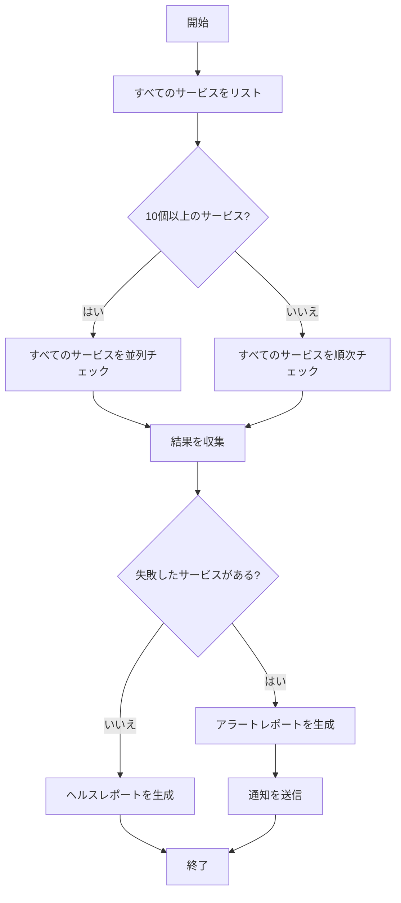

# レッスン2: ワークフローの構成要素: ステップ、状態、分岐、ループ

> 学習目標:
> - ワークフローの4つの核となる構成要素をマスターする
> - ステップ間の依存関係とデータの受け渡しを理解する
> - ワークフローの実行フローチャートを設計する方法を学ぶ
>
> 前提: [レッスン1: 会話からワークフローへ](./01-from-conversation-to-workflow.md) | 次: [レッスン3 >>](./03-task-decomposition.md)

## ワークフローは魔法ではなく、組み合わせである

前回のレッスンで、ワークフローが数十のエージェントを調整して複雑なタスクを完了できることを見ました。しかし、ワークフロースクリプトを開いてみると、それは単なる普通のコードです: 関数、ループ、条件分岐。

**ワークフローの力は、4つのシンプルな構成要素を組み合わせることから生まれます:**

1. **ステップ** — 作業の基本単位
2. **状態** — ステップ間で共有されるデータ
3. **分岐** — 条件に基づいて異なるパスを選択する
4. **ループ** — 同様の操作を繰り返す

この4つの構成要素を理解すれば、どんな複雑さのワークフローでも設計できます。[^S4]

## 構成要素1: ステップ

**ステップはワークフローのアトミックな操作です。** 各ステップはエージェント呼び出しか、決定論的な関数のどちらかです。[^S5]

### エージェントステップ vs 関数ステップ

```javascript
// エージェントステップ: 推論が必要な作業はLLMに任せる
const summary = await agent({
  task: 'コードレビュー結果の要約',
  prompt: 'これらのレビュー結果から重要な問題を抽出し、重要度順にランク付けしてください',
  context: reviews
});

// 関数ステップ: 決定論的な変換、LLMは不要
const filtered = reviews.filter(r => r.severity === 'high');
const count = filtered.length;
```

**エージェントステップを使うべき場合:**
- 曖昧な入力を理解する必要がある場合(自然言語、非構造化データ)
- 創造的なコンテンツを生成する必要がある場合(ドキュメント、コード、説明)
- 判断を下す必要がある場合(このコードにセキュリティ問題があるか?)

**関数ステップを使うべき場合:**
- データ変換(フィルタ、ソート、フォーマット)
- 数学演算(統計、集計)
- 条件チェック(if-elseロジック)
- ファイル操作(読み取り、書き込み、移動)

**ベストプラクティス:** エージェントステップは推論し、関数ステップは計算する。LLMに単純な配列フィルタや数値の加算をさせないでください — 遅く、高コストで、信頼性が低くなります。[^S5]

### ステップの入力/出力契約

すべてのステップは明確な入力/出力契約を持つべきです:

```javascript
// 良いステップ: 明確な入力と出力
async function analyzeFile(filePath) {
  // 入力: ファイルパス(文字列)
  const result = await agent({
    task: `${filePath}を分析`,
    prompt: 'JSON形式で返してください: { complexity: number, issues: string[] }'
  });
  // 出力: { complexity, issues }
  return JSON.parse(result);
}

// 悪いステップ: 曖昧な入力と出力
async function doStuff(data) {
  // dataはどんな形式? 何を返す? 不明確。
  return await agent({ task: 'データを処理', context: data });
}
```

**明確な契約により、ワークフローは理解しやすく、デバッグしやすくなります。** ステップ5が失敗したとき、ステップ4の出力が間違った形式だったからだとすぐにわかります。[^S6]

## 構成要素2: 状態

**状態はステップ間で共有されるデータです。** これはワークフローのメモリのようなもので、中間結果と実行の進捗を保持します。[^S11]

### 2種類の状態

**ワークフロー状態:**
- 現在のタスクに関するすべての情報: どのステップにいるか、各ステップの結果、次のステップが何を必要とするか
- スクリプト変数または外部データベースに保存される
- ステップ間で受け渡されるが、セッションをまたがない

**セッション状態:**
- ユーザーの会話履歴と設定
- エージェント自身が管理するもので、ワークフローは気にする必要がない[^S11]

```javascript
// ワークフロー状態の例
const workflowState = {
  phase: 'analysis',           // 現在のフェーズ
  filesAnalyzed: 47,          // 進捗
  issues: [],                 // 累積された結果
  nextAction: 'generate-plan' // 次のステップ
};
```

### 状態管理パターン

**パターン1: スクリプト変数(短いワークフローに適している)**

```javascript
async function shortWorkflow() {
  // 状態は単なる普通の変数
  let files = await listFiles();
  let analysis = await analyzeFiles(files);
  let report = await generateReport(analysis);
  return report;
}
```

**パターン2: 状態オブジェクト(中程度の複雑さに適している)**

```javascript
async function mediumWorkflow() {
  const state = {
    input: await getInput(),
    processed: [],
    errors: []
  };
  
  for (const item of state.input) {
    try {
      const result = await processItem(item);
      state.processed.push(result);
    } catch (err) {
      state.errors.push({ item, error: err });
    }
  }
  
  return state;
}
```

**パターン3: 外部ストレージ(長時間実行されるワークフローに適している)**

```javascript
async function longWorkflow(taskId) {
  // 状態はデータベースに保存され、いつでも復元可能
  let state = await db.loadState(taskId);
  
  if (state.phase === 'completed') return state.result;
  
  // 中断したところから再開
  if (state.phase === 'analysis') {
    state.analysisResult = await runAnalysis();
    state.phase = 'planning';
    await db.saveState(taskId, state);
  }
  
  if (state.phase === 'planning') {
    state.plan = await generatePlan(state.analysisResult);
    state.phase = 'execution';
    await db.saveState(taskId, state);
  }
  
  // ...
}
```

**チェックポイント:** 重要なステップの後に状態を保存することで、ワークフローは最初からやり直すのではなく、失敗した時点から再開できます。[^S12]

## 構成要素3: 分岐

**分岐は条件に基づいて異なる実行パスを選択します。**[^S2]

### シンプルな分岐

```javascript
const fileCount = files.length;

if (fileCount < 10) {
  // ファイルが少ない場合、順次処理
  for (const file of files) {
    await processFile(file);
  }
} else {
  // ファイルが多い場合、並列処理
  await Promise.all(files.map(f => processFile(f)));
}
```

### エージェントの判断に基づく分岐

```javascript
// エージェントが複雑さを評価
const assessment = await agent({
  task: 'リファクタリングの複雑さを評価',
  prompt: 'JSON形式で返してください: { complexity: "low" | "medium" | "high" }'
});

const parsed = JSON.parse(assessment);

if (parsed.complexity === 'low') {
  // 自動リファクタリング
  await autoRefactor();
} else if (parsed.complexity === 'medium') {
  // 計画を生成し、人間の承認を待つ
  const plan = await generatePlan();
  await waitForApproval(plan);
  await executeRefactor(plan);
} else {
  // 複雑度が高い場合、推奨事項のみを生成
  await generateRecommendations();
}
```

### エラーハンドリング分岐

```javascript
for (const service of services) {
  try {
    await deployService(service);
  } catch (error) {
    if (error.type === 'transient') {
      // 一時的なエラー、リトライ
      await retry(() => deployService(service));
    } else {
      // 永続的なエラー、ロールバック
      await rollback(service);
      throw error;
    }
  }
}
```

```agentmentor-check
{
  "id": "workflows-zh-02-branching-logic",
  "label": "分岐設計が適切かどうかを判断する",
  "prompt": "コードレビューワークフローは、見つかった問題の数に基づいて次のステップを決定します: 0個の問題 → 自動マージ; 1-3個の問題 → 作成者に修正を通知; 4個以上の問題 → PRを却下し、詳細なレポートを生成。この分岐ロジックはエージェントによって実装されるべきですか、それともスクリプトのif-elseで実装されるべきですか?",
  "whyHere": "エージェントステップ vs 関数ステップと分岐の実装方法を学んだ直後に、学習者が分岐を決定論的(スクリプト)にすべきかエージェント判断分岐にすべきかを判断できるかをチェックします。",
  "mode": "single",
  "choices": [
    {
      "id": "a",
      "text": "エージェントによって、問題の重要度を理解する必要があるため",
      "correct": false,
      "feedback": "正しくありません。問題の数は明確な数値(0、1-3、4+)であり、それを理解または判断するためにエージェントは必要ありません。重要度の評価は前のステップで行われるべきで、分岐は明確な数値に対するif-elseのみが必要です — スクリプトの方が高速で、信頼性が高く、予測可能です。"
    },
    {
      "id": "b",
      "text": "スクリプトのif-elseによって、条件が明確な数値比較だから",
      "correct": true,
      "feedback": "正解です。分岐条件は決定論的(問題数が0、1-3、4+のいずれか)であり、推論や理解は必要ないため、if-elseの方が高速で、低コストで、完全に予測可能です。エージェントは推論作業(問題が本当に問題かどうかの判断など)に集中すべきで、単純な数値比較には使うべきではありません。"
    }
  ]
}
```

## 構成要素4: ループ

**ループは多くの類似したオブジェクトに対して同じ操作を実行できます。** これがワークフローの力の中核です。[^S2]

### 順次ループ

```javascript
// 一つずつ処理
for (const pr of pullRequests) {
  const review = await reviewPR(pr);
  await postComment(pr, review);
}
```

### 並列ループ

```javascript
// すべて一度に処理
const reviews = await Promise.all(
  pullRequests.map(pr => reviewPR(pr))
);

// 並列だが並行数の上限あり(過負荷を避ける)
const limit = 5;
for (let i = 0; i < pullRequests.length; i += limit) {
  const batch = pullRequests.slice(i, i + limit);
  await Promise.all(batch.map(pr => reviewPR(pr)));
}
```

ここで、`limit = 5`が並行数の上限です: `Promise.all`で100個すべてを一度に実行するのではなく、最大5個ずつ実行します。そうしないと、接続やファイルハンドルが多すぎて開いてしまいます。

### 累積を伴うループ

```javascript
let totalIssues = 0;
const reports = [];

for (const file of files) {
  const analysis = await analyzeFile(file);
  totalIssues += analysis.issueCount;
  reports.push({
    file: file.path,
    issues: analysis.issues
  });
}

console.log(`合計${totalIssues}個の問題が見つかりました`);
```

### 条件付き終了を伴うループ

```javascript
let attempts = 0;
let success = false;

while (!success && attempts < 3) {
  try {
    await runTests();
    success = true;
  } catch (error) {
    attempts++;
    console.log(`テスト失敗、リトライ中 ${attempts}/3`);
    await wait(1000 * attempts); // 指数バックオフ
  }
}

if (!success) throw new Error('テストが3回とも失敗しました');
```

## 構成要素を組み合わせる: 完全なワークフロー

4つの構成要素を組み合わせて、「マイクロサービスヘルスチェック」ワークフローを設計してみましょう:



対応するスクリプト:

```javascript
async function healthCheckWorkflow() {
  // ステップ1: サービスリストを取得(関数ステップ)
  const services = await listServices();
  
  // 状態: 結果を保持
  const state = {
    total: services.length,
    healthy: [],
    unhealthy: []
  };
  
  // 分岐: 数に基づいて戦略を選択
  let results;
  if (services.length > 10) {
    // 並列ループ
    results = await Promise.all(
      services.map(s => checkServiceHealth(s))
    );
  } else {
    // 順次ループ
    results = [];
    for (const service of services) {
      results.push(await checkServiceHealth(service));
    }
  }
  
  // 関数ステップ: 結果を分類
  for (const result of results) {
    if (result.healthy) {
      state.healthy.push(result);
    } else {
      state.unhealthy.push(result);
    }
  }
  
  // 分岐: 結果に基づいて異なるレポートを生成
  if (state.unhealthy.length > 0) {
    // エージェントステップ: アラートを生成
    const alert = await agent({
      task: 'アラートレポートを生成',
      prompt: `${state.unhealthy.length}個のサービスが不健全です。
               詳細な障害レポートと推奨される修正手順を生成してください`,
      context: state.unhealthy
    });
    await sendAlert(alert);
  } else {
    // エージェントステップ: ヘルスレポートを生成
    const report = await agent({
      task: 'ヘルスレポートを生成',
      prompt: `${state.total}個すべてのサービスが健全です。
               簡潔なステータスサマリーを生成してください`
    });
    await logReport(report);
  }
  
  return state;
}
```

**このワークフローは4つの構成要素すべてを使用しています:**
- **ステップ**: `listServices`、`checkServiceHealth`、`agent()`呼び出し
- **状態**: 合計数と健全/不健全リストを保持する`state`オブジェクト
- **分岐**: サービス数に基づく並列 vs 順次、健全性ステータスに基づくレポートタイプ
- **ループ**: `map`並列ループ、`for`順次ループ

## ワークフロー設計の考え方

**エンドポイントから逆算する:**

1. 最終的な出力は何か?(レポート、デプロイされたサービス、クリーンアップされたコード)
2. 最後のステップが必要とする入力は何か?(集計データ、検証済み結果)
3. その入力はどこから来るか?(前のステップの出力)
4. 開始地点(ユーザー入力またはファイルシステム)に到達するまで繰り返す

**並列化の機会を見つける:**

- 複数のステップが互いに依存していない場合、それらは並列で実行できる
- 「各Xに対してYを実行」は通常並列化できる
- 並列化により、各5分の10タスクを50分から5分に短縮できる

**依存関係を明示的にする:**

```javascript
// 依存関係の例
const files = await readFiles();      // ステップ1
const analysis = await analyze(files); // ステップ2はステップ1に依存
const plan = await makePlan(analysis); // ステップ3はステップ2に依存

// 並列実行可能(依存関係なし)
const [files, config, users] = await Promise.all([
  readFiles(),
  loadConfig(),
  fetchUsers()
]);
```

<!-- exercises -->


## 💻 演習

### レベル1: シンプルなワークフローを設計する

タスク: 「バッチ画像処理」ワークフローを設計してください。入力は50枚の画像で、以下を行う必要があります: (1) 800x600にリサイズ、(2) ウォーターマークを追加、(3) WebP形式に変換。

**要件:**
- フローチャートを描く(テキスト説明でも可、例: A → B → C)
- どのステップが関数を使い、どのステップがエージェントを使うかを述べる
- どこで並列実行できるかを述べる
- 疑似コードのコア部分(ループと分岐)を書く

<!-- rubric -->
フローチャートが明確(少なくとも入力、処理ループ、出力ノードを含む); すべてのステップが関数ステップであることを正しく識別(画像処理は決定論的なのでエージェントは不要); 50枚の画像を並列処理できることを認識(各画像は独立); 疑似コードに並列ループ(`Promise.all`)が含まれる。

<!-- answer -->
フローチャート: 開始 → 50枚の画像を読み込む → 各画像を並列処理(リサイズ → ウォーターマーク追加 → 形式変換) → 結果を保存 → 終了。すべてのステップは関数を使用(画像ライブラリ); エージェントは不要。50枚すべての画像を並列処理できる。なぜなら、1枚の画像を処理することは他の画像に依存しないから。疑似コード: `const results = await Promise.all(images.map(async img => { const resized = await resize(img, 800, 600); const watermarked = await addWatermark(resized); return await convertToWebP(watermarked); }));`

<!-- hint -->
画像処理(リサイズ、ウォーターマーク追加、形式変換)は決定論的です — 理解や推論は不要 — したがって、これらはすべて関数ステップです。

<!-- hint -->
自問してください: 10番目の画像を処理するとき、9番目の結果を知る必要がありますか? もし必要ないなら、並列実行できます。

### レベル2: 状態管理のニーズを特定する

「コードベース移行」ワークフローは以下を行う必要があります: (1) 200ファイルをスキャンして移行が必要なAPI呼び出しを見つける、(2) すべてのファイルを並列で移行、(3) テストを実行、(4) テストが失敗した場合、すべての変更をロールバック。

**質問:**
1. このワークフローはどのような状態を保存する必要がありますか? 少なくとも3つの状態フィールドをリストしてください。
2. どのステップの後にチェックポイントを設定すべきですか? その理由は?
3. ステップ3(テスト実行)が失敗した場合、ワークフローが正しくロールバックするためにどのような状態情報が必要ですか?

<!-- rubric -->
少なくとも3つの重要な状態を正しく識別(例: 移行するファイルのリスト、移行済みファイルのリスト、各ファイルの元のコンテンツのバックアップ、テスト結果); ステップ2(移行完了)の後にチェックポイントを設定すべきと指摘し、その妥当な理由(例: 移行は時間がかかるので、チェックポイントにより再実行を避けられる)を述べる; ロールバックに必要な状態(ファイルリスト + 元のコンテンツバックアップ)を識別。

<!-- answer -->
(1) 状態フィールド: `filesToMigrate`(移行するファイルのリスト)、`migratedFiles`(移行済みファイルとその新しいコンテンツ)、`backups`(各ファイルの元のコンテンツのバックアップ)、`testResult`(テストが成功したかどうか)。(2) ステップ2の後にチェックポイントを設定すべき。なぜなら、200ファイルの移行には長い時間がかかり、テストフェーズでクラッシュした場合、すべてのファイルを再移行したくないから。(3) ロールバックには`migratedFiles`(どのファイルが変更されたかを知るため)と`backups`(どのように復元するかを知るため)が必要で、移行済みファイルをバックアップコンテンツで上書きします。

<!-- hint -->
状態は通常以下を含みます: 入力データ、中間結果、実行の進捗、エラー情報。「実行を再開する」または「操作を元に戻す」ために重要なものはすべて保存すべきです。

<!-- hint -->
チェックポイントは「時間のかかる操作の後」または「不可逆な操作の前」に設定します。このワークフローでは、移行が時間のかかる操作で、ロールバックが不可逆なもの(何が変更されたかを知らないと元に戻せない)です。

<!-- /exercises -->

---

**次:** [レッスン3: 複雑なタスクをワークフローに分解する](./03-task-decomposition.md) — 複雑なタスクを体系的にワークフローステップに分解する戦略
