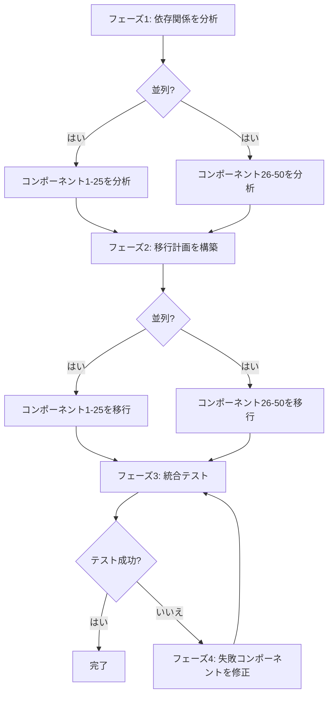

# レッスン3: 複雑なタスクをワークフローに分解する

> 学習目標:
> - 3つのタスク分解戦略をマスターする
> - タスク間の依存関係を特定する
> - 分解を実行可能なワークフローに変換する
>
> 前提: [レッスン2: ワークフローの構成要素: ステップ、状態、分岐、ループ](./02-workflow-building-blocks.md) | 次: [レッスン4 >>](./04-state-and-context.md)

## 「どこから始めればいいかわからない」から明確なステップへ

あなたの机にタスクが届きます。「モノリシックなRailsアプリをマイクロサービスアーキテクチャに分割する」というものです。これは複雑なタスクです。どこから始めればいいのか、何ステップ必要なのか、各ステップが何をするのかわかりません。

**タスク分解とは、曖昧で大きすぎるタスクを小さく明確なステップに分割する方法です。**[^S16]

優れた分解は3つの基準を満たします:

1. **各サブタスクが十分に小さい** — 単一のエージェント呼び出しや関数で完了できる
2. **サブタスク間の依存関係が明示的** — どれを順番に実行し、どれを並列実行できるかがわかる
3. **各サブタスクに明確な入力と出力がある** — あるステップの出力を次のステップに直接渡せる

分解が適切であれば、ワークフローの記述はレゴブロックを組み立てるような感覚になります。分解が不適切だと、実行中にステップの欠落、順序の誤り、データの流れの問題を発見することになります。[^S17]

## 戦略1: シーケンシャル分解

**いつ使うか:** タスクに明確な前後の順序があり、各ステップが前のステップの結果に依存する場合。

**方法:** 終わりから逆算します。「このステップにはどんな入力が必要か? その入力はどこから来るか?」と問います。

### 例: 技術ドキュメントの生成

**タスク:** APIのユーザー向けドキュメントを生成する。

**逆算による分解:**

```
最終出力: Markdownドキュメント
  ↑ 何が必要?
ステップ4: Markdownをレンダリング (必要: 構造化されたドキュメントコンテンツ)
  ↑ どこから来る?
ステップ3: コンテンツを整理 (必要: エンドポイントリスト + サンプルコード + 説明)
  ↑ どこから来る?
ステップ2: エンドポイントごとにサンプルを生成 (必要: エンドポイントリスト)
  ↑ どこから来る?
ステップ1: コードからエンドポイントリストを抽出 (必要: ソースコード)
  ↑
開始: ソースディレクトリ
```

**ワークフローに変換:**

```javascript
async function generateAPIDocsWorkflow(sourceDir) {
  // ステップ1: エンドポイントを抽出
  const endpoints = await extractEndpoints(sourceDir);
  
  // ステップ2: サンプルを生成 (ステップ1に依存)
  const examples = await Promise.all(
    endpoints.map(ep => generateExample(ep))
  );
  
  // ステップ3: コンテンツを整理 (ステップ1と2に依存)
  const content = await agent({
    task: 'Organize the doc structure',
    prompt: 'Organize the endpoints and examples into a user-friendly doc structure',
    context: { endpoints, examples }
  });
  
  // ステップ4: Markdownをレンダリング (ステップ3に依存)
  const markdown = await renderMarkdown(content);
  
  return markdown;
}
```

**依存関係チェーン:**
```
ステップ1 → ステップ2
   ↓         ↓
   └─→ ステップ3 → ステップ4
```

ステップ2はステップ1と並列実行できますか? いいえ — ステップ2はステップ1の `endpoints` が必要です。

ステップ3はステップ2と並列実行できますか? いいえ — ステップ3はステップ2の `examples` が必要です。

**シーケンシャル分解の特徴:** 長い依存関係チェーン、並列化の機会は少ないが、ロジックは明確です。[^S18]

## 戦略2: パラレル分解

**いつ使うか:** タスクが相互に依存しない複数の独立したサブタスクに分割できる場合。

**方法:** 「すべてのXについてYを実行」というパターンを見つけます — 各Xは並列処理できます。

### 例: コードベースのセキュリティ監査

**タスク:** 100個のファイルをセキュリティ問題について監査する。

**パラレル分解:**

```javascript
async function securityAuditWorkflow(files) {
  // フェーズ1: 各ファイルを並列監査 (依存関係なし)
  const audits = await Promise.all(
    files.map(file => auditFile(file))
  );
  
  // フェーズ2: 結果を集約 (フェーズ1に依存)
  const summary = await agent({
    task: 'Summarize the security audit',
    prompt: `Analyze the audit results across ${audits.length} files,
             rank issues by severity, and produce an executive summary`,
    context: audits
  });
  
  return summary;
}

async function auditFile(file) {
  return await agent({
    task: `Audit ${file.path}`,
    prompt: `Check for SQL injection, XSS, hardcoded secrets, and weak crypto.
             Return JSON: { file, issues: [{ type, line, severity }] }`
  });
}
```

**形状:**
```
          ┌─→ auditFile(1) ─┐
          ├─→ auditFile(2) ─┤
files ───→├─→ auditFile(3) ─┼─→ summary
          ├─→   ...         ─┤
          └─→ auditFile(100)─┘
```

**ファンアウト・リデュースパターン:** これはパラレル分解の最も一般的な形状です。[^S4]

1. **ファンアウト:** タスクを多数の並列エージェントに分散させる。
2. **リデュース:** すべての結果を最終出力にマージする。

**パラレル分解の威力:** 100ファイル、各監査に2分。シーケンシャル実行は200分かかりますが、パラレル実行は2分で完了します(リソース制限がない場合)。

```agentmentor-check
{
  "id": "workflows-zh-03-decomposition-strategy",
  "label": "適切な分解戦略を選ぶ",
  "prompt": "タスク: 10個のマイクロサービスの統合テストレポートを生成する。各サービスは (1) サービスを起動、(2) テストを実行、(3) ログを収集、(4) 結果を分析する必要がある。最後に、すべてのサービスのテスト状態をまとめる。このタスクはシーケンシャル分解とパラレル分解のどちらを使うべきですか?",
  "whyHere": "シーケンシャル分解とパラレル分解を続けて学んだ直後です。このタスクは2つの層を同時に隠しています — 10個のサービスは独立している(パラレル)が、各サービス内の4つのステップは厳密な順序がある(シーケンシャル) — したがって、最初の順序らしい手がかりに飛びつくのではなく、タスクの構造を読み取れるかをチェックします。",
  "mode": "single",
  "choices": [
    {
      "id": "a",
      "text": "シーケンシャル、なぜならステップが順番に実行されるから: 起動 → テスト → 収集 → 分析",
      "correct": false,
      "feedback": "その順序は実在しますが、それは1つのサービス内に適用されます。タスクには10個のサービスがあり、あるサービスのテストは他のサービスに依存しません。したがって、10個のサービスは並列実行され、各サービスの4つのステップは内部で順番に実行され、その後すべてがまとめられます。これはハイブリッドであり、純粋なシーケンシャル分解ではありません。"
    },
    {
      "id": "b",
      "text": "パラレル、なぜなら10個のサービスは独立してテストされ、各サービスは4つのステップを順番に実行し、最後にまとめが行われるから",
      "correct": true,
      "feedback": "正解です。これはファンアウト・リデュースハイブリッドです: 外側の層はパラレル(10個のサービスが同時にテスト)で、内側の層はシーケンシャル(各サービスの 起動 → テスト → 収集 → 分析 は順序を保つ必要がある)です。最終的なまとめはすべてのサービスの結果に依存します。両方の層を読み取ることで、各サービスの内部順序を壊すことなく、利用可能なすべての並列性を使用できます。"
    }
  ]
}
```

## 戦略3: ハイブリッド分解

**いつ使うか:** ほとんどの実際のタスク。一部は並列実行でき、一部は順序を守る必要がある場合。

**方法:** まず高レベルのフェーズ(順番に実行する必要があるもの)を見つけ、次に各フェーズ内の並列化の機会を見つけます。

### 例: 大規模リファクタリング

**タスク:** 50個のコンポーネントをVue 2からVue 3にアップグレードする。

**ハイブリッド分解:**



**ワークフローに変換:**

```javascript
async function vue2to3MigrationWorkflow(components) {
  // フェーズ1: すべてのコンポーネントを並列分析
  const analyses = await Promise.all(
    components.map(c => analyzeComponent(c))
  );
  
  // フェーズ2: 移行計画を順番に構築 (フェーズ1に依存)
  const plan = await agent({
    task: 'Build the migration plan',
    prompt: 'Based on the analysis, decide the migration order and flag potential conflicts',
    context: analyses
  });
  
  // フェーズ3: 計画に従ってコンポーネントを並列移行
  const migrated = await Promise.all(
    plan.batches.map(batch => 
      Promise.all(batch.map(c => migrateComponent(c)))
    )
  );
  
  // フェーズ4: 統合テストを順番に実行
  let testResult = await runIntegrationTests();
  
  // フェーズ5: テストが失敗したら修正して再テスト (ループ)
  let attempts = 0;
  while (!testResult.passed && attempts < 3) {
    const failures = testResult.failures;
    await Promise.all(
      failures.map(f => fixComponent(f))
    );
    testResult = await runIntegrationTests();
    attempts++;
  }
  
  if (!testResult.passed) {
    throw new Error('Migration failed: 3 fix attempts all failed the tests');
  }
  
  return { plan, migrated, testResult };
}
```

**ハイブリッドの依存関係グラフ:**

```
フェーズ1 (パラレル)      フェーズ2 (シーケンシャル)
analyze(1..50) ────→ generatePlan
                              ↓
フェーズ3 (パラレル)           ↓
migrate(1..50) ←────────────┘
       ↓
フェーズ4 (シーケンシャル)
runTests ←─────┐
   ↓           │
   ├─成功→ 完了 │
   └─失敗→ フェーズ5 (パラレル + ループ)
          fix(failures) ─┘
```

**ハイブリッド分解の核心:** 本当に必要な順序を保ちながら、並列化のあらゆる機会を絞り出します。[^S18]

## LLMを使って分解を支援する

分解をLLMに任せることもできます。3つの方法がすべて機能します: ゼロショットプロンプト、思考連鎖プロンプト、そしてフューショット(例ベース)プロンプトです。[^S16]

### ゼロショット

```
タスク: REST APIのドキュメントを100個のエンドポイントについて、Swagger 2.0からOpenAPI 3.0にアップグレードする

このタスクを5-8個の明確なステップに分割してください。各ステップについて次を述べてください:
1. 何をするか
2. どんな入力が必要か
3. 何を出力するか
4. 並列実行できるか
```

### 思考連鎖

```
タスク: 5000行のPythonクラスを複数の小さなクラスに分割してリファクタリングする

このタスクの分解について段階的に考えましょう:

最初のステップは何をすべきで、なぜですか?
最初のステップの出力に対して、2番目のステップは何に依存しますか?
どのステップを並列実行できますか?
各ステップが正しく完了したことをどう検証しますか?

詳細な分解を提供してください。
```

### フューショット

```
複雑なタスクを提供します。例に従ってワークフローステップに分解してください。

例のタスク: 50枚の画像をバッチ処理(リサイズ、ウォーターマーク追加)
例の分解:
1. 画像リストを読み込む (入力: ディレクトリパス、出力: ファイルリスト)
2. 各画像を並列処理:
   2a. リサイズ (入力: 元画像、出力: リサイズされた画像)
   2b. ウォーターマークを追加 (入力: リサイズされた画像、出力: 最終画像)
3. 結果を保存 (入力: 処理済み画像リスト、出力: 保存パスリスト)

では、このタスクを分解してください: 20個のGitリポジトリのコントリビューター統計レポートを生成する
```

**LLM分解の利点:** 最初の計画を素早く作成し、見落としていたステップを見つけます。

**LLM分解の欠点:** 抽象的すぎる可能性があります(「各ファイルの循環的複雑度を計算する」ではなく「データを分析する」と言うなど)。したがって、人間が明確化する必要があります。[^S16]

## 依存関係を見つけるための実践的なヒント

**ヒント1: 「このステップは最初のステップの前に実行できるか?」と問う**

答えが「はい」なら、並列実行できます。「いいえ、最初のステップの結果が必要」なら、依存関係があります。

**ヒント2: 依存関係グラフを描く**

```
矢印は依存関係を意味する: A → B は「BはAの出力に依存する」

ステップ1 → ステップ2 → ステップ4
         ↓
       ステップ3 ↗
```

ステップ2とステップ3は並列実行できますか? はい — どちらもステップ1にのみ依存します。

ステップ3とステップ4は並列実行できますか? いいえ — ステップ4はステップ2に依存します。

矢印が依存関係を意味し、決して開始地点にループバックしないグラフには正式な名前があります: DAG(有向非巡回グラフ)。ステップ1は何にも依存しないため、グラフが最初に実行できるリーフです。矢印の方向に違反しないようにすべてのステップを順序付けすることは、トポロジカルソートと呼ばれます。

**ヒント3: データフローをチェックする**

各ステップの入力と出力をリストアップします:

| ステップ | 入力 | 出力 |
|------|------|------|
| 1. ファイルを読み込む | ファイルパス | ファイル内容 |
| 2. コードをパースする | ファイル内容 | AST |
| 3. 関数を抽出する | AST | 関数リスト |
| 4. ドキュメントを生成する | 関数リスト | Markdown |

ステップXの入力がステップYの出力から来る場合、XはYに依存します。

## 一般的な分解の間違い

**間違い1: ステップが大きすぎる**

```
❌ 悪い例:
1. データを準備する
2. 移行を実行する
3. 結果を検証する
```

「データを準備する」は何を含みますか? ファイルを読む? 設定をパースする? データベースに接続する? 曖昧すぎます。

```
✓ 良い例:
1. 設定ファイルを読み込む
2. データベースに接続する
3. ソースデータテーブルを読み込む
4. データ形式を変換する
5. ターゲットデータテーブルに書き込む
6. 検証クエリを実行する
```

**間違い2: エラーハンドリングステップがない**

```
❌ 悪い例:
1. サービスAをデプロイ
2. サービスBをデプロイ
3. ロードバランサーを更新
```

ステップ2が失敗したらどうなりますか? サービスAはすでにデプロイされていますがBはされておらず、システムは不整合な状態です。

```
✓ 良い例:
1. 現在の設定をバックアップ
2. サービスAをデプロイ
3. サービスAのヘルスチェック
4. ステップ3が失敗 → サービスAをロールバック
5. サービスBをデプロイ
6. サービスBのヘルスチェック
7. ステップ6が失敗 → サービスAとBをロールバック
8. ロードバランサーを更新
```

**間違い3: 並列化の機会を無視する**

```
❌ 悪い例 (シーケンシャル):
for (const service of services) {
  await buildService(service);
  await testService(service);
  await deployService(service);
}
```

これは各サービスを一度に1つずつ処理します。遅いです。

```
✓ 良い例 (ハイブリッドパラレル):
// すべてのサービスを並列ビルド
await Promise.all(services.map(s => buildService(s)));

// すべてのサービスを並列テスト
await Promise.all(services.map(s => testService(s)));

// すべてのサービスを並列デプロイ
await Promise.all(services.map(s => deployService(s)));
```

<!-- exercises -->


## 💻 演習

### レベル1: 実際のタスクを分解する

以下のタスクのいずれかを選び、5-8ステップに分割してください:

**タスクA:** Webアプリのパフォーマンスレポートを生成する(ロード時間、リソースサイズ、Core Web Vitals)

**タスクB:** Gitリポジトリをクリーンアップする(未使用の依存関係を削除、デッドコードを削除、古いコメントを更新)

**要件:**
- 各ステップについて、何をするか、入力、出力を明記する
- どのステップを並列実行できるかをマークする
- 依存関係グラフを描く(言葉または矢印)
- シーケンシャル、パラレル、またはハイブリッド分解のいずれかを述べる

<!-- rubric -->
ステップ数が妥当(5-8ステップ、3つの巨大なものでも15の断片でもない); 各ステップに明確な入力と出力がある; 並列化の機会が正しく特定されている(例: タスクAでは、ロード時間、リソースサイズ、Core Web Vitalsは並列測定可能); 依存関係グラフが正確; 分解戦略の選択が健全。

<!-- answer -->
(タスクAの例) ステップ1: アプリサーバーを起動(入力: アプリコード、出力: 実行中のサービスURL) → ステップ2/3/4を並列実行: ステップ2: ロード時間を測定(入力: URL、出力: ロード時間データ)、ステップ3: リソースサイズを分析(入力: URL、出力: リソースリストとサイズ)、ステップ4: Core Web Vitalsを測定(入力: URL、出力: LCP/FID/CLSデータ) → ステップ5: レポートを生成(入力: ステップ2/3/4のすべての出力、出力: Markdownレポート)。依存関係グラフ: ステップ1 → {ステップ2, ステップ3, ステップ4} → ステップ5。これはハイブリッド分解(ステップ1と5は順番に実行する必要があり、ステップ2/3/4は並列実行可能)。

<!-- hint -->
終わりから逆算します(最終的なレポートまたは結果): レポートにはどんなデータが必要か? そのデータはどこから来るか? 何にも依存せずに取得できるデータはどれか?

<!-- hint -->
タスクAの3つのパフォーマンスメトリクス(ロード時間、リソースサイズ、Core Web Vitals)はすべて同時に測定できます — それらは1つの共有入力(実行中のアプリURL)にのみ依存します。これは教科書的な並列化の機会です。

### レベル2: 壊れた分解を修正する

以下は「APIエンドポイントのバッチ移行」タスクの分解です。3つの深刻な問題があります。それらを見つけて、修正された計画を提供してください。

```
元の分解:
1. すべてのAPIエンドポイント設定を読み込む
2. 新しいエンドポイント定義を生成する
3. 本番環境にデプロイする
```

**要件:**
- 3つの問題を見つける(ヒント: ステップが大きすぎる、エラーハンドリングがない、並列化を無視)
- 修正された完全な分解を提供する(5-8ステップ)

<!-- rubric -->
3つの主要な問題を正しく特定する(ステップ2が曖昧すぎて生成方法を述べていない; テスト/検証ステップがない; ロールバックがない; 複数のエンドポイントが並列処理されていない); 修正された計画に少なくとも6ステップがある; テスト/検証ステップが含まれている; エラーハンドリングまたはロールバックステップが含まれている; 並列化の機会を特定している。

<!-- answer -->
3つの問題: (1) ステップ2の「新しいエンドポイント定義を生成する」が曖昧すぎる — フォーマット変換、設定更新、コード書き換えのいずれを意味するか不明; (2) テストまたは検証ステップがなく、生成から本番デプロイに直接ジャンプするのは危険; (3) 多数のエンドポイントがある場合、並列処理されていない。修正された計画: ステップ1: すべてのエンドポイント設定を読み込む → ステップ2: 各エンドポイントの定義を並列変換(入力: 古いエンドポイント、出力: 新しいエンドポイント定義) → ステップ3: 新しいエンドポイントをテスト環境にデプロイ → ステップ4: 統合テストを実行 → ステップ5: テストが失敗したら問題を修正してステップ3に戻る → ステップ6: 本番設定をバックアップ → ステップ7: 本番環境にデプロイ → ステップ8: ヘルスチェック、失敗したらステップ6のバックアップにロールバック。

<!-- hint -->
優れた分解は次の質問に答えるべきです: ステップが失敗したらどうなるか? ステップが成功したことをどう知るか? 多数の類似オブジェクトがある場合、一度に1つずつ処理するか、並列処理するか?

<!-- hint -->
本番デプロイの前にテストステップが必要で、デプロイ後に検証ステップが必要で、理想的には書き込み操作の前にバックアップステップが必要です。

<!-- /exercises -->

---

**次:** [レッスン4: 状態管理とコンテキスト渡し](./04-state-and-context.md) — ワークフローのステップ間でデータを正しく渡し管理する方法を学びます。
