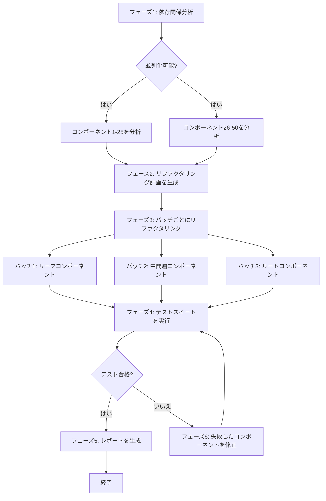

# レッスン6: 実践における実世界のワークフロー

> 学習目標:
> - タスク分解、状態管理、エラーハンドリングを組み合わせて完全なワークフローを設計する
> - 3つの本番レベルのシナリオにおけるワークフローパターンを理解する
> - ワークフローの可観測性とデバッグ技術を習得する
>
> 前提: [<< レッスン5: エラーハンドリングとリトライ戦略](./05-error-handling-retry.md)

## 理論から実践へ

最初の5つのレッスンでは、ワークフローの構成要素であるステップ、状態、分解、エラーハンドリングを扱いました。今度はそれらを統合し、実際のシナリオから得られた3つの本番レベルのワークフローを構築します。

**このレッスンにおける3つのワークフロー:**

1. **コードリファクタリングパイプライン**: レガシーコードを最新のパターンにリファクタリングし、分析、計画、実行、テスト、検証をカバー
2. **ドキュメント生成パイプライン**: コードからAPIドキュメントを自動生成し、抽出、サンプル生成、レンダリング、公開をカバー
3. **テスト自動化フロー**: エンドツーエンドのテストワークフローで、環境セットアップ、並列テスト、結果集約、レポート生成をカバー

**すべてのワークフローが示すもの:**
- 完全なタスク分解
- 状態管理とチェックポイント設計
- エラーハンドリングと復旧戦略
- 可観測性とデバッグサポート[^S20]

## シナリオ1: コードリファクタリングパイプライン

### 要件

50個のコンポーネントを持つレガシーフロントエンドプロジェクトを、クラスコンポーネントから関数コンポーネント + Hooksにリファクタリングする。

**課題:**
- コンポーネント間に依存関係があるため、任意の順序でリファクタリングできない
- リファクタリングは動作を壊す可能性があるため、テスト検証が必要
- 50個のコンポーネントは単一の会話で完了できないため、並列処理が必要[^S21]

### タスク分解

ワークフローは6つのフェーズで構成されます。最初の2つはコンポーネントを並列処理でき、後のフェーズは依存関係順に実行されます。



### 完全な実装

```javascript
// ワークフロー状態の定義
const createInitialState = (components) => ({
  phase: 'init',
  input: { components, total: components.length },
  analysis: null,
  plan: null,
  refactored: [],
  testResults: null,
  errors: [],
  startTime: Date.now()
});

// メインワークフロー
async function refactoringWorkflow(componentPaths) {
  const workflowId = `refactor-${Date.now()}`;
  const store = new WorkflowStateStore();
  
  // 状態をロードまたは作成
  let state = await store.load(workflowId) || 
              createInitialState(componentPaths);
  
  console.log(`🚀 リファクタリングワークフローを開始 (${state.input.total} コンポーネント)`);
  
  try {
    // フェーズ1: 依存関係分析
    if (state.phase === 'init') {
      console.log('\n📊 フェーズ1: コンポーネントの依存関係を分析中...');
      
      state.analysis = await analyzeComponentsInParallel(
        state.input.components
      );
      
      state.phase = 'analyzed';
      await store.save(workflowId, state);
      console.log(`✓ 分析完了: ${state.analysis.dependencies.length}個の依存関係を発見`);
    }
    
    // フェーズ2: リファクタリング計画を生成
    if (state.phase === 'analyzed') {
      console.log('\n📋 フェーズ2: リファクタリング計画を生成中...');
      
      state.plan = await agent({
        task: 'リファクタリング計画を生成',
        prompt: `
          依存関係分析に基づいて、コンポーネントのリファクタリング順序を生成してください:
          1. まずリーフコンポーネントをリファクタリング（他のコンポーネントに依存しないもの）
          2. 次に中間層（すでにリファクタリングされたものに依存するコンポーネント）
          3. 最後にルートコンポーネント
          
          JSON形式で返してください: {
            batches: [
              { name: "リーフコンポーネント", components: [...] },
              { name: "中間層", components: [...] },
              { name: "ルートコンポーネント", components: [...] }
            ]
          }
        `,
        context: state.analysis
      });
      
      state.phase = 'planned';
      await store.save(workflowId, state);
      console.log(`✓ 計画を生成: ${state.plan.batches.length}バッチ`);
    }
    
    // フェーズ3: バッチごとにリファクタリング
    if (state.phase === 'planned') {
      console.log('\n🔧 フェーズ3: リファクタリングを実行中...');
      
      for (const batch of state.plan.batches) {
        console.log(`\n  バッチ: ${batch.name} (${batch.components.length}コンポーネント)`);
        
        // このバッチのコンポーネントを並列にリファクタリング
        const results = await Promise.allSettled(
          batch.components.map(async (component) => {
            return await retryWithBackoffAndJitter(
              async () => refactorComponent(component),
              3,
              2000
            );
          })
        );
        
        // 結果を処理
        for (let i = 0; i < results.length; i++) {
          const result = results[i];
          const component = batch.components[i];
          
          if (result.status === 'fulfilled') {
            state.refactored.push({
              component,
              code: result.value,
              batch: batch.name
            });
          } else {
            state.errors.push({
              component,
              error: result.reason.message,
              batch: batch.name
            });
          }
        }
        
        // バッチ完了後にチェックポイントを保存
        await store.save(workflowId, state);
        console.log(`  ✓ ${batch.name} 完了`);
      }
      
      state.phase = 'refactored';
      await store.save(workflowId, state);
      console.log(`\n✓ リファクタリング完了: ${state.refactored.length}/${state.input.total}`);
    }
    
    // フェーズ4: テストを実行
    if (state.phase === 'refactored') {
      console.log('\n🧪 フェーズ4: テストスイートを実行中...');
      
      state.testResults = await runTestSuite({
        timeout: 300000,  // 5分
        parallel: true
      });
      
      state.phase = 'tested';
      await store.save(workflowId, state);
      
      if (state.testResults.passed) {
        console.log(`✓ テスト合格: ${state.testResults.passedCount}/${state.testResults.totalCount}`);
      } else {
        console.log(`✗ テスト失敗: ${state.testResults.failedTests.length}件の失敗`);
      }
    }
    
    // フェーズ5: 失敗を修正（必要な場合）
    if (state.phase === 'tested' && !state.testResults.passed) {
      console.log('\n🔨 フェーズ5: 失敗したコンポーネントを修正中...');
      
      const failedComponents = identifyFailedComponents(
        state.testResults,
        state.refactored
      );
      
      console.log(`  ${failedComponents.length}個のコンポーネントが修正が必要`);
      
      for (const component of failedComponents) {
        try {
          const fixed = await agent({
            task: `コンポーネント ${component.name} を修正`,
            prompt: `
              このコンポーネントはリファクタリング後にテストが失敗しました。
              失敗したテスト: ${component.failedTests.join(', ')}
              エラーメッセージ: ${component.errors.join('\n')}
              
              問題を診断してコードを修正してください。
            `,
            context: {
              originalCode: component.originalCode,
              refactoredCode: component.refactoredCode,
              tests: component.tests
            }
          });
          
          // リファクタリング結果を更新
          const index = state.refactored.findIndex(r => r.component === component.path);
          state.refactored[index].code = fixed;
          
        } catch (error) {
          state.errors.push({
            component: component.path,
            error: `修正失敗: ${error.message}`,
            phase: 'fix'
          });
        }
      }
      
      // 再テスト
      state.phase = 'refactored';
      await store.save(workflowId, state);
      
      // 自身に再帰（制限付き）
      state.fixAttempts = (state.fixAttempts || 0) + 1;
      if (state.fixAttempts < 3) {
        return await refactoringWorkflow(componentPaths);
      } else {
        console.log('✗ 3回の修正試行後もテストが失敗しています');
      }
    }
    
    // フェーズ6: レポートを生成
    if (state.phase === 'tested' && state.testResults.passed) {
      console.log('\n📄 フェーズ6: リファクタリングレポートを生成中...');
      
      const report = await agent({
        task: 'リファクタリングレポートを生成',
        prompt: `
          リファクタリングプロジェクトのレポートを生成してください。以下を含めます:
          - リファクタリング統計（コンポーネント数、バッチごとの分布）
          - テスト結果サマリー
          - 遭遇した問題とその解決方法
          - 変更前後のコード比較例
          
          Markdown形式で返してください。
        `,
        context: {
          total: state.input.total,
          refactored: state.refactored.length,
          batches: state.plan.batches.map(b => b.name),
          testResults: state.testResults,
          errors: state.errors,
          duration: Date.now() - state.startTime
        }
      });
      
      await fs.writeFile('refactoring-report.md', report);
      
      state.phase = 'completed';
      state.completedAt = Date.now();
      await store.save(workflowId, state);
      
      console.log('\n✅ リファクタリングワークフロー完了！');
      console.log(`   レポート保存: refactoring-report.md`);
    }
    
    return state;
    
  } catch (error) {
    console.error('\n❌ ワークフロー失敗:', error.message);
    state.phase = 'failed';
    state.error = error.message;
    await store.save(workflowId, state);
    throw error;
  }
}

// ヘルパー: コンポーネントを並列に分析
async function analyzeComponentsInParallel(components) {
  const analyses = await Promise.all(
    components.map(async (path) => {
      return await agent({
        task: `${path} を分析`,
        prompt: `
          このコンポーネントを分析してください:
          1. クラスまたは関数コンポーネントか
          2. どの他のコンポーネントに依存しているか（import文）
          3. どのライフサイクルメソッドまたはフックを使用しているか
          
          JSON形式で返してください: { type, dependencies: [], hooks: [] }
        `,
        context: { file: await fs.readFile(path, 'utf-8') }
      });
    })
  );
  
  // 依存関係グラフを構築
  const dependencies = [];
  for (let i = 0; i < components.length; i++) {
    const component = components[i];
    const analysis = analyses[i];
    
    for (const dep of analysis.dependencies) {
      dependencies.push({ from: component, to: dep });
    }
  }
  
  return { components: analyses, dependencies };
}

// ヘルパー: 単一のコンポーネントをリファクタリング
async function refactorComponent(componentPath) {
  return await agent({
    task: `${componentPath} をリファクタリング`,
    prompt: `
      このクラスコンポーネントを関数コンポーネント + Hooksにリファクタリングしてください:
      1. クラスとコンストラクタを削除
      2. stateをuseStateに置き換え
      3. ライフサイクルメソッドをuseEffectに置き換え
      4. 同じpropsインターフェースと動作を維持
      
      完全なリファクタリング後のコードを返してください。
    `,
    context: {
      code: await fs.readFile(componentPath, 'utf-8')
    }
  });
}
```

### 主要な設計ポイント

**1. チェックポイント戦略**: 各バッチ完了後に保存し、作業を再リファクタリングしない

**2. 並列実行**: 同じバッチ内のコンポーネントは並列にリファクタリング可能（相互に依存していない）

**3. リトライメカニズム**: 1つのコンポーネントの失敗が他に影響しない。`Promise.allSettled`を使用してすべての結果を収集

**4. 修正ループ**: テスト失敗時、自動的に修正を試行し、最大3回まで

**5. 可観測性**: すべてのフェーズが明確にログを出力し、状態は外部ストレージに永続化される[^S22]

## シナリオ2: ドキュメント生成パイプライン

### 要件

30個のREST APIエンドポイントを持つサービスの完全なAPIドキュメントを生成する。エンドポイントの説明、リクエスト/レスポンスの例、エラーコードの説明を含む。

### タスク分解（ファンアウト/集約パターン）

```javascript
async function apiDocGenerationWorkflow(servicePath) {
  console.log('📚 APIドキュメント生成ワークフロー');
  
  // ステップ1: すべてのエンドポイントを抽出
  console.log('\n1️⃣ APIエンドポイントを抽出中...');
  const endpoints = await extractAPIEndpoints(servicePath);
  console.log(`   ${endpoints.length}個のエンドポイントを発見`);
  
  // ステップ2: 各エンドポイントのドキュメントを並列に生成
  console.log('\n2️⃣ エンドポイントドキュメントを生成中（並列）...');
  const docs = await Promise.all(
    endpoints.map(async (endpoint, index) => {
      console.log(`   [${index + 1}/${endpoints.length}] ${endpoint.method} ${endpoint.path}`);
      
      return await agent({
        task: `${endpoint.method} ${endpoint.path} のドキュメントを生成`,
        prompt: `
          このAPIエンドポイントのドキュメントを生成してください:
          
          ## ${endpoint.method} ${endpoint.path}
          
          以下を含めます:
          1. 説明（1段落）
          2. リクエストパラメータ（パスパラメータ、クエリパラメータ、ボディ）
          3. リクエスト例（curlとJavaScript）
          4. レスポンス例（成功と一般的なエラー）
          5. エラーコードの説明
          
          Markdown形式で返してください。
        `,
        context: {
          code: endpoint.handlerCode,
          schema: endpoint.schema,
          examples: endpoint.existingTests || []
        }
      });
    })
  );
  
  // ステップ3: 目次と概要を生成
  console.log('\n3️⃣ ドキュメントの目次を生成中...');
  const toc = await agent({
    task: 'ドキュメントの目次を生成',
    prompt: `
      これらのAPIエンドポイントの目次を生成してください:
      - 機能ごとにグループ化（ユーザー管理、注文管理など）
      - 各グループの下にエンドポイントをリスト（アンカーリンク付き）
      - サービス概要を生成（このサービスが何をするかの1段落）
      
      Markdown形式で返してください。
    `,
    context: {
      endpoints: endpoints.map(e => ({ method: e.method, path: e.path, summary: e.summary }))
    }
  });
  
  // ステップ4: 完全なドキュメントを組み立て
  console.log('\n4️⃣ 完全なドキュメントを組み立て中...');
  const fullDoc = [
    '# API Documentation\n',
    toc,
    '\n---\n',
    ...docs.map((doc, i) => `\n## ${endpoints[i].method} ${endpoints[i].path}\n\n${doc}`)
  ].join('\n');
  
  // ステップ5: 保存して公開
  console.log('\n5️⃣ ドキュメントを保存中...');
  await fs.writeFile('api-docs.md', fullDoc);
  
  console.log('\n✅ ドキュメント生成完了！');
  console.log(`   ファイル: api-docs.md`);
  console.log(`   エンドポイント: ${endpoints.length}`);
  
  return { endpoints: endpoints.length, outputFile: 'api-docs.md' };
}
```

**主要な特徴:**
- **ファンアウト/集約パターン**: 30個のエンドポイントが並列にドキュメントを生成し、最後に集約
- **ステートレス**: タスクは十分に高速（< 10分）なのでチェックポイントは不要
- **冪等性**: いつでも再実行でき、出力ファイルを上書き可能[^S20]

## シナリオ3: テスト自動化フロー

### 要件

複数の環境（ローカル、ステージング、本番）でエンドツーエンドテストを実行し、テスト結果とパフォーマンス指標を収集し、比較レポートを生成する。

### 完全な実装

```javascript
async function e2eTestingWorkflow(config) {
  const workflowId = `e2e-test-${Date.now()}`;
  const state = {
    environments: config.environments,  // ['local', 'staging', 'production']
    results: {},
    phase: 'init',
    startTime: Date.now()
  };
  
  console.log(`🧪 E2Eテストワークフロー (${state.environments.length}環境)`);
  
  try {
    // フェーズ1: 環境を準備
    console.log('\n1️⃣ テスト環境を準備中...');
    for (const env of state.environments) {
      console.log(`   ${env}環境を設定中...`);
      await setupTestEnvironment(env);
    }
    state.phase = 'environments_ready';
    
    // フェーズ2: すべての環境でテストを並列実行
    console.log('\n2️⃣ テストを実行中（並列）...');
    const testPromises = state.environments.map(async (env) => {
      console.log(`   [${env}] テスト開始...`);
      
      try {
        const result = await runTestsWithRetry(env, {
          maxRetries: 2,
          testSuites: config.testSuites,
          timeout: 600000  // 10分
        });
        
        console.log(`   [${env}] ✓ 完了: ${result.passed}/${result.total} 合格`);
        return { env, result, status: 'success' };
        
      } catch (error) {
        console.log(`   [${env}] ✗ 失敗: ${error.message}`);
        return { env, error: error.message, status: 'failed' };
      }
    });
    
    const testResults = await Promise.all(testPromises);
    
    // 結果を状態に保存
    for (const { env, result, error, status } of testResults) {
      state.results[env] = status === 'success' ? result : { error };
    }
    
    state.phase = 'tests_completed';
    
    // フェーズ3: 比較レポートを生成
    console.log('\n3️⃣ テストレポートを生成中...');
    const report = await agent({
      task: '環境横断テスト比較レポートを生成',
      prompt: `
        環境横断テスト比較レポートを生成してください:
        
        比較の観点:
        1. 合格率（環境ごと）
        2. パフォーマンス指標（平均応答時間、P95、P99）
        3. 失敗ケース分析（どのケースがどの環境で失敗するか）
        4. 環境差異の問題（特定の環境でのみ失敗するケース）
        
        Markdown形式で、テーブルとグラフの説明を含めて返してください。
      `,
      context: state.results
    });
    
    await fs.writeFile('e2e-test-report.md', report);
    
    // フェーズ4: 失敗がある場合、修正提案を生成
    const failedEnvs = Object.entries(state.results)
      .filter(([env, result]) => result.error || result.failedCount > 0);
    
    if (failedEnvs.length > 0) {
      console.log('\n4️⃣ 失敗分析を生成中...');
      
      for (const [env, result] of failedEnvs) {
        const analysis = await agent({
          task: `${env}環境での失敗を分析`,
          prompt: `
            テストの失敗を診断し、修正提案を提供してください:
            
            失敗したテスト: ${result.failedTests?.map(t => t.name).join(', ')}
            エラーメッセージ: ${result.failedTests?.map(t => t.error).join('\n')}
            
            考えられる原因:
            - 環境設定の問題
            - データの不整合
            - 時間依存のテスト
            - ネットワークの問題
            
            修正提案を返してください（Markdown形式）。
          `,
          context: { env, result }
        });
        
        await fs.writeFile(`fix-${env}.md`, analysis);
        console.log(`   ${env}の失敗分析を保存: fix-${env}.md`);
      }
    }
    
    state.phase = 'completed';
    state.completedAt = Date.now();
    
    console.log('\n✅ テストワークフロー完了！');
    console.log(`   レポート: e2e-test-report.md`);
    console.log(`   合計時間: ${((state.completedAt - state.startTime) / 1000).toFixed(1)}s`);
    
    return state;
    
  } catch (error) {
    console.error('\n❌ ワークフロー失敗:', error);
    throw error;
  }
}

// ヘルパー: リトライ付きでテストを実行
async function runTestsWithRetry(env, options) {
  const { maxRetries, testSuites, timeout } = options;
  
  for (let attempt = 1; attempt <= maxRetries + 1; attempt++) {
    try {
      const result = await runTests(env, testSuites, timeout);
      return result;
      
    } catch (error) {
      if (attempt <= maxRetries) {
        console.log(`   [${env}] リトライ ${attempt}/${maxRetries}...`);
        await sleep(5000 * attempt);  // 増加する遅延
      } else {
        throw error;
      }
    }
  }
}
```

**主要な特徴:**
- **並列テスト**: 複数の環境が同時にテストを実行し、合計時間を大幅に短縮
- **耐障害性**: 1つの環境の失敗が他に影響しない
- **スマートリトライ**: 失敗したテストは自動的にリトライ（ネットワークの一時的な障害や過渡的な障害はよくある）
- **失敗分析**: 失敗の修正提案が自動生成される[^S20]

## ワークフローの可観測性

**優れたワークフローはいつでも以下に答えられるべきです:**

- どこまで進んでいるか？（X/Y完了）
- あとどのくらいかかりそうか？
- どんなエラーに遭遇したか？
- パフォーマンスのボトルネックはどこか？

これらに答えられないなら、ログと状態追跡が十分詳細ではありません。ワークフローのデバッグはそれらの記録に依存し、推測には頼りません。

### 可観測性の実装

```javascript
class ObservableWorkflow {
  constructor(name, totalSteps) {
    this.name = name;
    this.totalSteps = totalSteps;
    this.currentStep = 0;
    this.startTime = Date.now();
    this.stepTimes = [];
    this.errors = [];
  }
  
  async step(name, fn) {
    this.currentStep++;
    const stepNum = this.currentStep;
    const progress = ((stepNum / this.totalSteps) * 100).toFixed(1);
    
    console.log(`\n[${this.name}] ステップ ${stepNum}/${this.totalSteps} (${progress}%): ${name}`);
    
    const stepStart = Date.now();
    
    try {
      const result = await fn();
      const duration = Date.now() - stepStart;
      this.stepTimes.push({ name, duration });
      
      console.log(`  ✓ 完了 (${(duration / 1000).toFixed(1)}s)`);
      
      return result;
      
    } catch (error) {
      const duration = Date.now() - stepStart;
      this.errors.push({ step: name, error: error.message, duration });
      
      console.log(`  ✗ 失敗: ${error.message}`);
      throw error;
    }
  }
  
  summary() {
    const totalDuration = Date.now() - this.startTime;
    const avgStepTime = this.stepTimes.reduce((sum, s) => sum + s.duration, 0) / this.stepTimes.length;
    
    console.log(`\n━━━ ${this.name} サマリー ━━━`);
    console.log(`合計時間: ${(totalDuration / 1000).toFixed(1)}s`);
    console.log(`ステップ: ${this.currentStep}/${this.totalSteps}`);
    console.log(`1ステップあたりの平均: ${(avgStepTime / 1000).toFixed(1)}s`);
    
    if (this.errors.length > 0) {
      console.log(`\nエラー (${this.errors.length}):`);
      for (const err of this.errors) {
        console.log(`  - ${err.step}: ${err.error}`);
      }
    }
    
    console.log(`\n最も遅いステップ:`);
    const sorted = [...this.stepTimes].sort((a, b) => b.duration - a.duration);
    for (const step of sorted.slice(0, 3)) {
      console.log(`  - ${step.name}: ${(step.duration / 1000).toFixed(1)}s`);
    }
  }
}

// 使用例
async function myWorkflow() {
  const wf = new ObservableWorkflow('コードリファクタリング', 5);
  
  await wf.step('依存関係を分析', async () => {
    return await analyzeDependencies();
  });
  
  await wf.step('計画を生成', async () => {
    return await generatePlan();
  });
  
  // ...
  
  wf.summary();
}
```

`summary()`内で期間によってソートし、最も遅い3つのステップのみを出力する部分は、最もシンプルな形式のパフォーマンスプロファイリングです。各ステップにかかった時間を測定し、どのステップが遅いかを推測するのではなくデータからボトルネックを見つけます。

<!-- exercises -->


## 💻 演習

### レベル1: 独自のワークフローを設計する

自分の仕事から実際のタスクを選び、それに対する完全なワークフローを設計してください。

**要件:**
1. タスクを説明する（2-3文）
2. ワークフロー図を描く（フェーズ、分岐、並列ステップ）
3. 状態フィールドをリストする（最低5つ）
4. チェックポイントをどこに設定するか説明する
5. 起こりうるエラーとその対処方法をリストする

<!-- rubric -->
タスクの説明が明確である。ワークフロー図は少なくとも4つのフェーズと少なくとも1つの分岐または並列ポイントを持つ。状態設計が健全である（フェーズマーカー、進捗、結果、エラーを含む）。チェックポイントの配置が合理的である（高コストな操作の後、不可逆的な操作の前）。少なくとも3つのエラータイプが処理戦略と共に特定されている。

<!-- answer -->
（例は省略。学習者自身の作業シナリオに基づいて設計されるべきです。）

<!-- hint -->
最近2時間以上かかった反復的なタスクから始めて、エージェントに渡す場合にどのような大きなステップに分解するか考えてください。

<!-- hint -->
優れたワークフローは通常、明確な入力（ファイル、設定、データ）と出力（レポート、修正されたコード、デプロイ結果）を持ちます。入力と出力から逆算して、その間に必要な変換を把握してください。

### レベル2: 失敗したワークフローをデバッグする

「バッチ画像処理」ワークフローが47番目の画像で失敗し、エラーメッセージは`Error: EMFILE: too many open files`です。

**質問:**
1. これはどのタイプのエラーですか（一時的/永続的）？
2. なぜ1番目ではなく47番目の画像で失敗するのですか？
3. ワークフローをどのように修正すべきですか？（コード変更の提案を提供してください。）

<!-- rubric -->
エラータイプを正しく識別している（一時的なリソース枯渇エラーだが、コード設計に根本原因がある）。原因を理解している（並列で開かれた多すぎるファイルハンドルがシステム制限を超えている）。合理的な修正を提供している（並行性を制限する、処理後すぐにファイルを閉じる、ストリーミングを使用する）。

<!-- answer -->
（1）これは一時的なエラー（リソース枯渇）ですが、根本原因はコードの問題です。（2）ワークフローはおそらく`Promise.all(images.map(...))`を使用してすべての画像を並列処理しています。各画像はファイルハンドルを開き、47番目までにシステム制限（通常1024または4096）を超えます。（3）修正: 並行性を制限し、一度に10個の画像のみを処理してバッチ間で待機します。コード: `for (let i = 0; i < images.length; i += 10) { const batch = images.slice(i, i + 10); await Promise.all(batch.map(processImage)); }`。またはストリーミングを使用し、処理後すぐに各ファイルを閉じます。

<!-- hint -->
EMFILEエラーは開いているファイルが多すぎることを意味します。ワークフローが100個の画像をすべて一度に開くか、次を開く前に1つを閉じるかを考えてください。

<!-- hint -->
`Promise.all(array.map(...))`で100個のファイルを並列処理すると、100個のファイルハンドルを一度に開きます。修正は並行性を制限することです（例: 一度に10個のみ処理）。

<!-- /exercises -->

---

**エージェントワークフロー設計コースの修了おめでとうございます。**

これで以下を習得しました:
- ワークフローの核となる概念とその適用場所
- タスク分解の3つの戦略
- 状態管理とチェックポイントメカニズム
- エラーハンドリングとリトライ戦略
- 実際のシナリオから得られた3つの本番レベルのワークフロー

**次のステップ:**
1. プロジェクトの1つでシンプルなワークフロー（< 5ステップ）を実践する
2. 段階的に複雑さを追加する（並列処理、チェックポイント、エラーハンドリング）
3. ワークフロー設計を共有してコミュニティからフィードバックを得る
4. より高度なトピックを探索する（分散ワークフロー、ワークフローオーケストレーションフレームワーク、ビジュアルワークフローエディター）
