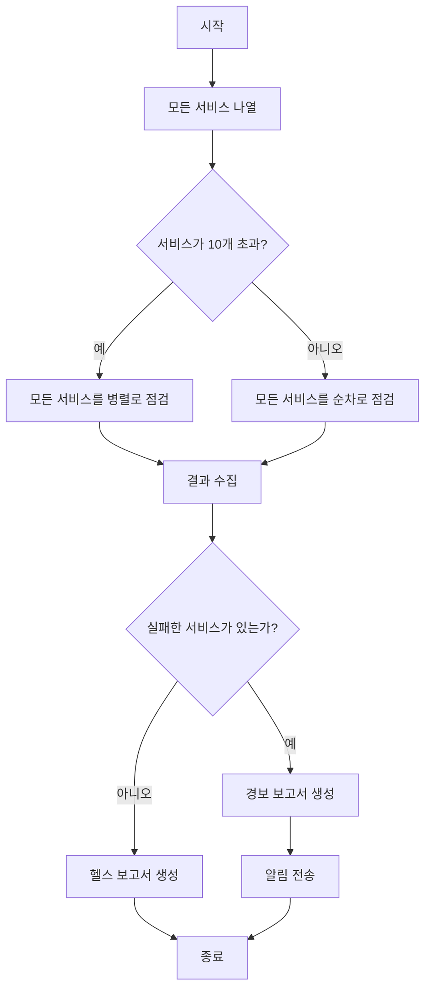

# 레슨 2: 워크플로의 구성 요소: 단계, 상태, 분기, 루프

> 학습 목표:
> - 워크플로의 네 가지 핵심 구성 요소 익히기
> - 단계 사이의 의존 관계와 데이터 전달 이해하기
> - 워크플로의 실행 흐름도 설계하기
>
> 전제: [레슨 1: 대화에서 워크플로로](./01-from-conversation-to-workflow.md) | 다음: [레슨 3 >>](./03-task-decomposition.md)

## 워크플로는 마법이 아니라 조합이다

지난 레슨에서 워크플로가 수십 개의 에이전트를 조율해 복잡한 작업을 끝낼 수 있다는 것을 봤습니다. 그런데 워크플로 스크립트를 열어 보면 그저 평범한 코드일 뿐입니다. 함수, 루프, 조건문.

**워크플로의 힘은 네 가지 단순한 구성 요소의 조합에서 나옵니다.**

1. **단계** — 작업의 기본 단위
2. **상태** — 단계 사이에 공유되는 데이터
3. **분기** — 조건에 따라 경로를 고르는 것
4. **루프** — 비슷한 조작을 반복하는 것

이 네 가지 구성 요소를 이해하면 어떤 복잡도의 워크플로도 설계할 수 있습니다.[^S4]

## 구성 요소 1: 단계

**단계는 워크플로의 원자적 조작입니다.** 각 단계는 에이전트 호출이거나 결정론적 함수입니다.[^S5]

### 에이전트 단계 vs 함수 단계

```javascript
// 에이전트 단계: 추론이 필요한 작업을 LLM에게 맡긴다
const summary = await agent({
  task: '코드 리뷰 결과 요약',
  prompt: '이 리뷰 결과에서 핵심 문제를 심각도 순으로 뽑아내라',
  context: reviews
});

// 함수 단계: 결정론적 변환, LLM이 필요 없다
const filtered = reviews.filter(r => r.severity === 'high');
const count = filtered.length;
```

**에이전트 단계를 쓸 때:**
- 모호한 입력(자연어, 비정형 데이터)을 이해해야 할 때
- 창의적인 결과물(문서, 코드, 설명)을 생성해야 할 때
- 판단을 내려야 할 때(이 코드에 보안 문제가 있는가?)

**함수 단계를 쓸 때:**
- 데이터 변환(필터링, 정렬, 형식 맞추기)
- 계산(통계, 집계)
- 조건 검사(if-else 로직)
- 파일 조작(읽기, 쓰기, 이동)

**모범 사례:** 에이전트 단계는 추론하고, 함수 단계는 계산합니다. 단순한 배열 필터링이나 숫자 더하기를 LLM에게 시키지 마세요. 느리고, 비싸고, 믿을 수 없습니다.[^S5]

### 단계의 입출력 계약

모든 단계에는 명확한 입출력 계약이 있어야 합니다.

```javascript
// 좋은 단계: 입력과 출력이 명확하다
async function analyzeFile(filePath) {
  // 입력: 파일 경로(문자열)
  const result = await agent({
    task: `${filePath} 분석`,
    prompt: 'JSON 반환: { complexity: number, issues: string[] }'
  });
  // 출력: { complexity, issues }
  return JSON.parse(result);
}

// 나쁜 단계: 입력과 출력이 모호하다
async function doStuff(data) {
  // data는 어떤 형식인가? 무엇을 반환하는가? 불분명하다.
  return await agent({ task: '데이터 처리', context: data });
}
```

**계약이 명확하면 워크플로를 이해하고 디버그하기 쉬워집니다.** 5단계가 깨졌을 때, 4단계의 출력 형식이 잘못됐기 때문임을 곧바로 알 수 있습니다.[^S6]

## 구성 요소 2: 상태

**상태는 단계 사이에 공유되는 데이터입니다.** 워크플로의 기억과 같아서, 중간 결과와 실행 진행 상황을 담고 있습니다.[^S11]

### 두 가지 상태

**워크플로 상태(Workflow State):**
- 현재 작업에 관한 모든 정보. 어느 단계에 있는지, 각 단계의 결과가 무엇인지, 다음 단계에 무엇이 필요한지
- 스크립트 변수나 외부 데이터베이스에 저장된다
- 단계 사이로 전달되지만, 세션을 넘어가지는 않는다

**세션 상태(Session State):**
- 사용자의 대화 이력과 선호 설정
- 에이전트가 알아서 관리하며, 워크플로가 신경 쓸 필요가 없다[^S11]

```javascript
// 워크플로 상태 예시
const workflowState = {
  phase: 'analysis',           // 현재 단계
  filesAnalyzed: 47,          // 진행 상황
  issues: [],                 // 누적된 결과
  nextAction: 'generate-plan' // 다음 단계
};
```

### 상태 관리 패턴

**패턴 1: 스크립트 변수(짧은 워크플로에 적합)**

```javascript
async function shortWorkflow() {
  // 상태는 그냥 평범한 변수다
  let files = await listFiles();
  let analysis = await analyzeFiles(files);
  let report = await generateReport(analysis);
  return report;
}
```

**패턴 2: 상태 객체(중간 복잡도에 적합)**

```javascript
async function mediumWorkflow() {
  const state = {
    input: await getInput(),
    processed: [],
    errors: []
  };
  
  for (const item of state.input) {
    try {
      const result = await processItem(item);
      state.processed.push(result);
    } catch (err) {
      state.errors.push({ item, error: err });
    }
  }
  
  return state;
}
```

**패턴 3: 외부 저장소(오래 도는 워크플로에 적합)**

```javascript
async function longWorkflow(taskId) {
  // 상태가 데이터베이스에 있어 언제든 복구할 수 있다
  let state = await db.loadState(taskId);
  
  if (state.phase === 'completed') return state.result;
  
  // 중단된 지점부터 재개
  if (state.phase === 'analysis') {
    state.analysisResult = await runAnalysis();
    state.phase = 'planning';
    await db.saveState(taskId, state);
  }
  
  if (state.phase === 'planning') {
    state.plan = await generatePlan(state.analysisResult);
    state.phase = 'execution';
    await db.saveState(taskId, state);
  }
  
  // ...
}
```

**체크포인팅:** 핵심 단계를 지난 뒤에 상태를 저장해 두면, 워크플로가 처음부터 다시 시작하는 대신 실패한 지점부터 재개할 수 있습니다.[^S12]

## 구성 요소 3: 분기

**분기는 조건에 따라 다른 실행 경로를 고릅니다.**[^S2]

### 단순 분기

```javascript
const fileCount = files.length;

if (fileCount < 10) {
  // 파일이 적으면 순차 처리
  for (const file of files) {
    await processFile(file);
  }
} else {
  // 파일이 많으면 병렬 처리
  await Promise.all(files.map(f => processFile(f)));
}
```

### 에이전트의 판단에 따른 분기

```javascript
// 에이전트가 복잡도를 평가
const assessment = await agent({
  task: '리팩터링 복잡도 평가',
  prompt: 'JSON 반환: { complexity: "low" | "medium" | "high" }'
});

const parsed = JSON.parse(assessment);

if (parsed.complexity === 'low') {
  // 자동 리팩터링
  await autoRefactor();
} else if (parsed.complexity === 'medium') {
  // 계획을 생성하고 사람의 승인을 기다린다
  const plan = await generatePlan();
  await waitForApproval(plan);
  await executeRefactor(plan);
} else {
  // 복잡도가 높으면 권고안만 생성
  await generateRecommendations();
}
```

### 에러 처리 분기

```javascript
for (const service of services) {
  try {
    await deployService(service);
  } catch (error) {
    if (error.type === 'transient') {
      // 일시적 에러, 재시도
      await retry(() => deployService(service));
    } else {
      // 영구적 에러, 롤백
      await rollback(service);
      throw error;
    }
  }
}
```

```agentmentor-check
{
  "id": "workflows-zh-02-branching-logic",
  "label": "분기 설계가 타당한지 가려내기",
  "prompt": "어떤 코드 리뷰 워크플로가 발견된 문제의 개수에 따라 다음 단계를 정합니다. 문제 0개 → 자동 병합, 1~3개 → 작성자에게 수정 요청, 4개 이상 → PR 거절 후 상세 보고서 생성. 이 분기 로직은 에이전트로 구현해야 할까요, 아니면 스크립트의 if-else로 구현해야 할까요?",
  "whyHere": "에이전트 단계와 함수 단계의 차이, 그리고 분기를 구현하는 방법을 막 배운 참입니다. 분기가 결정론적이어야 할 때(스크립트)와 에이전트의 판단에 맡겨야 할 때를 구별할 수 있는지 확인합니다.",
  "mode": "single",
  "choices": [
    {
      "id": "a",
      "text": "에이전트로. 문제의 심각도를 이해해야 하기 때문이다",
      "correct": false,
      "feedback": "그렇지 않습니다. 문제 개수는 해석의 여지가 없는 숫자(0개, 1~3개, 4개 이상)이므로, 이해하거나 판단할 에이전트가 필요 없습니다. 심각도 평가는 앞선 단계에서 이뤄져야 하고, 분기는 명확한 숫자에 대한 if-else만 있으면 됩니다. 스크립트가 더 빠르고, 더 믿을 만하고, 더 예측 가능합니다."
    },
    {
      "id": "b",
      "text": "스크립트의 if-else로. 조건이 명확한 수치 비교이기 때문이다",
      "correct": true,
      "feedback": "정답입니다. 분기 조건이 결정론적이고(문제 개수가 0개인지, 1~3개인지, 4개 이상인지) 추론이나 이해가 필요하지 않으므로, if-else가 더 빠르고 저렴하고 완전히 예측 가능합니다. 에이전트는 단순한 수치 비교가 아니라 추론이 필요한 일(어떤 문제가 정말 문제인지 판단하는 것 같은)에 집중해야 합니다."
    }
  ]
}
```

## 구성 요소 4: 루프

**루프는 비슷한 대상 여러 개에 같은 조작을 실행하게 해 줍니다.** 워크플로가 가진 힘의 핵심 원천입니다.[^S2]

### 순차 루프

```javascript
// 하나씩 차례로 처리
for (const pr of pullRequests) {
  const review = await reviewPR(pr);
  await postComment(pr, review);
}
```

### 병렬 루프

```javascript
// 한꺼번에 처리
const reviews = await Promise.all(
  pullRequests.map(pr => reviewPR(pr))
);

// 병렬이지만 동시 실행 수를 제한(과부하 방지)
const limit = 5;
for (let i = 0; i < pullRequests.length; i += limit) {
  const batch = pullRequests.slice(i, i + limit);
  await Promise.all(batch.map(pr => reviewPR(pr)));
}
```

여기서 `limit = 5`가 동시 실행 상한입니다. `Promise.all`로 100개를 한꺼번에 쏘아 올려 연결이나 파일 핸들을 너무 많이 여는 대신, 한 번에 최대 5개씩만 돌립니다.

### 누적이 있는 루프

```javascript
let totalIssues = 0;
const reports = [];

for (const file of files) {
  const analysis = await analyzeFile(file);
  totalIssues += analysis.issueCount;
  reports.push({
    file: file.path,
    issues: analysis.issues
  });
}

console.log(`총 ${totalIssues}개의 문제를 발견`);
```

### 조건부 종료가 있는 루프

```javascript
let attempts = 0;
let success = false;

while (!success && attempts < 3) {
  try {
    await runTests();
    success = true;
  } catch (error) {
    attempts++;
    console.log(`테스트 실패, 재시도 ${attempts}/3`);
    await wait(1000 * attempts); // 선형 백오프(1s, 2s, 3s)
  }
}

if (!success) throw new Error('테스트가 3번 모두 실패');
```

## 구성 요소 조합하기: 완전한 워크플로

이 네 가지 구성 요소를 조합해 "마이크로서비스 헬스 체크" 워크플로를 설계해 봅시다.



여기에 대응하는 스크립트입니다.

```javascript
async function healthCheckWorkflow() {
  // 1단계: 서비스 목록 가져오기(함수 단계)
  const services = await listServices();
  
  // 상태: 결과를 담아 둔다
  const state = {
    total: services.length,
    healthy: [],
    unhealthy: []
  };
  
  // 분기: 개수에 따라 전략을 고른다
  let results;
  if (services.length > 10) {
    // 병렬 루프
    results = await Promise.all(
      services.map(s => checkServiceHealth(s))
    );
  } else {
    // 순차 루프
    results = [];
    for (const service of services) {
      results.push(await checkServiceHealth(service));
    }
  }
  
  // 함수 단계: 결과 분류
  for (const result of results) {
    if (result.healthy) {
      state.healthy.push(result);
    } else {
      state.unhealthy.push(result);
    }
  }
  
  // 분기: 결과에 따라 다른 보고서를 생성
  if (state.unhealthy.length > 0) {
    // 에이전트 단계: 경보 생성
    const alert = await agent({
      task: '경보 보고서 생성',
      prompt: `서비스 ${state.unhealthy.length}개가 비정상이다.
               상세한 장애 보고서와 권장 복구 절차를 생성하라`,
      context: state.unhealthy
    });
    await sendAlert(alert);
  } else {
    // 에이전트 단계: 헬스 보고서 생성
    const report = await agent({
      task: '헬스 보고서 생성',
      prompt: `서비스 ${state.total}개가 모두 정상이다.
               간결한 상태 요약을 생성하라`
    });
    await logReport(report);
  }
  
  return state;
}
```

**이 워크플로는 네 가지 구성 요소를 모두 씁니다.**
- **단계**: `listServices`, `checkServiceHealth`, `agent()` 호출들
- **상태**: 전체 개수와 정상/비정상 목록을 담은 `state` 객체
- **분기**: 서비스 개수에 따른 병렬 대 순차, 그리고 건강 상태에 따른 보고서 종류
- **루프**: `map` 병렬 루프, `for` 순차 루프

## 워크플로 설계를 생각하는 방법

**끝점에서 거꾸로 올라가기:**

1. 최종 출력이 무엇인가?(보고서, 배포된 서비스, 정리된 코드)
2. 마지막 단계에 어떤 입력이 필요한가?(취합된 데이터, 검증된 결과)
3. 그 입력은 어디서 오는가?(앞 단계의 출력)
4. 시작점(사용자 입력이나 파일 시스템)에 닿을 때까지 반복

**병렬화할 기회 찾기:**

- 여러 단계가 서로 의존하지 않는다면 병렬로 돌릴 수 있다
- "각각의 X에 대해 Y를 한다"는 대개 병렬화할 수 있다
- 병렬화하면 5분짜리 작업 10개를 50분에서 5분으로 줄일 수 있다

**의존 관계를 드러내기:**

```javascript
// 의존 관계 예시
const files = await readFiles();      // 1단계
const analysis = await analyze(files); // 2단계는 1단계에 의존
const plan = await makePlan(analysis); // 3단계는 2단계에 의존

// 병렬로 돌릴 수 있다(의존 관계 없음)
const [files, config, users] = await Promise.all([
  readFiles(),
  loadConfig(),
  fetchUsers()
]);
```

<!-- exercises -->


## 💻 연습

### 레벨 1: 단순한 워크플로 설계하기

과제: "이미지 일괄 처리" 워크플로를 설계해 보세요. 입력은 이미지 50장이고, (1) 800x600으로 크기를 조정하고, (2) 워터마크를 붙이고, (3) WebP 형식으로 변환해야 합니다.

**요구 사항:**
- 흐름도를 그린다(A → B → C 같은 글 설명도 괜찮습니다)
- 어떤 단계가 함수를 쓰고 어떤 단계가 에이전트를 쓰는지 밝힌다
- 어디를 병렬로 돌릴 수 있는지 밝힌다
- 의사 코드의 핵심 부분(루프와 분기)을 쓴다

<!-- rubric -->
흐름도가 명확하다(최소한 입력, 처리 루프, 출력 노드를 담고 있다). 모든 단계가 함수 단계라는 것을 올바르게 짚어냈다(이미지 처리는 결정론적이므로 에이전트가 필요 없다). 이미지 50장을 병렬로 처리할 수 있음을 알아봤다(각각이 독립적이다). 의사 코드에 병렬 루프(`Promise.all`)가 들어 있다.

<!-- answer -->
흐름도: 시작 → 이미지 50장 읽기 → 각 이미지를 병렬 처리(크기 조정 → 워터마크 붙이기 → 형식 변환) → 결과 저장 → 종료. 모든 단계가 함수를 쓴다(이미지 라이브러리). 에이전트는 필요 없다. 이미지 50장을 전부 병렬로 처리할 수 있다. 한 이미지의 처리가 다른 이미지에 의존하지 않기 때문이다. 의사 코드: `const results = await Promise.all(images.map(async img => { const resized = await resize(img, 800, 600); const watermarked = await addWatermark(resized); return await convertToWebP(watermarked); }));`

<!-- hint -->
이미지 처리(크기 조정, 워터마크 붙이기, 형식 변환)는 결정론적이다. 이해하거나 추론할 것이 없으므로 전부 함수 단계다.

<!-- hint -->
스스로에게 물어보자. 10번째 이미지를 처리할 때 9번째의 결과를 알아야 하는가? 그렇지 않다면 병렬로 돌릴 수 있다.

### 레벨 2: 상태 관리 요구 사항 파악하기

"코드베이스 마이그레이션" 워크플로가 해야 할 일은 이렇습니다. (1) 파일 200개를 훑어 마이그레이션이 필요한 API 호출을 찾고, (2) 모든 파일을 병렬로 마이그레이션하고, (3) 테스트를 돌리고, (4) 테스트가 실패하면 모든 변경을 롤백한다.

**질문:**
1. 이 워크플로는 어떤 상태를 저장해야 합니까? 상태 필드를 최소 3개 나열해 보세요.
2. 어느 단계 뒤에 체크포인트를 둬야 합니까? 왜 그렇습니까?
3. 3단계(테스트 실행)가 실패하면, 워크플로가 올바르게 롤백하려면 어떤 상태 정보가 필요합니까?

<!-- rubric -->
핵심 상태를 최소 3개 올바르게 짚어냈다(예: 마이그레이션할 파일 목록, 마이그레이션된 파일 목록, 각 파일의 원본 내용 백업, 테스트 결과). 2단계(마이그레이션 완료) 뒤에 체크포인트를 둬야 한다고 지적하고 타당한 근거를 댔다(예: 마이그레이션은 시간이 오래 걸리므로 체크포인트가 재실행을 막아 준다). 롤백에 필요한 상태를 짚어냈다(파일 목록 + 원본 내용 백업).

<!-- answer -->
(1) 상태 필드: `filesToMigrate`(마이그레이션할 파일 목록), `migratedFiles`(마이그레이션된 파일과 그 새 내용), `backups`(각 파일의 원본 내용 백업), `testResult`(테스트 통과 여부). (2) 체크포인트는 2단계 뒤에 둬야 한다. 파일 200개를 마이그레이션하는 데 시간이 오래 걸리므로, 테스트 단계에서 죽었을 때 모든 파일을 다시 마이그레이션하고 싶지 않기 때문이다. (3) 롤백에는 `migratedFiles`(어떤 파일이 바뀌었는지 알기 위해)와 `backups`(어떻게 되돌릴지 알기 위해)가 필요하며, 마이그레이션된 파일을 백업 내용으로 덮어쓴다.

<!-- hint -->
상태에는 대개 입력 데이터, 중간 결과, 실행 진행 상황, 에러 정보가 들어간다. "실행을 재개하는 것"이나 "조작을 되돌리는 것"에 중요한 것은 모두 저장해야 한다.

<!-- hint -->
체크포인트는 "시간이 오래 걸리는 조작 뒤"나 "되돌릴 수 없는 조작 앞"에 두자. 이 워크플로에서 시간이 오래 걸리는 조작은 마이그레이션이고, 되돌릴 수 없는 조작은 롤백이다(무엇이 바뀌었는지 알아야 되돌릴 수 있다).

<!-- /exercises -->

---

**다음:** [레슨 3: 복잡한 작업을 워크플로로 분해하기](./03-task-decomposition.md) — 복잡한 작업을 워크플로 단계로 체계적으로 쪼개는 전략
