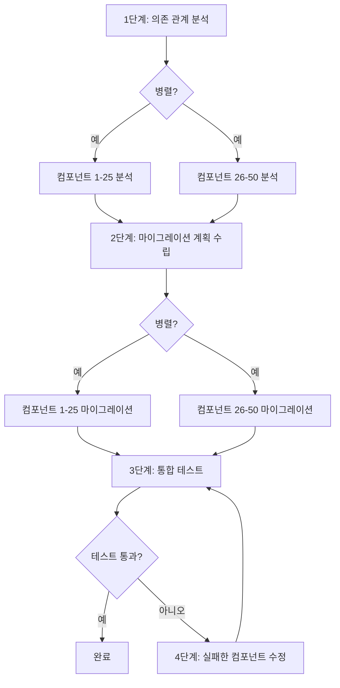

# 레슨 3: 복잡한 작업을 워크플로로 분해하기

> 학습 목표:
> - 세 가지 작업 분해 전략 익히기
> - 작업 사이의 의존 관계 찾아내기
> - 분해 결과를 실행 가능한 워크플로로 옮기기
>
> 전제: [레슨 2: 워크플로의 구성 요소: 단계, 상태, 분기, 루프](./02-workflow-building-blocks.md) | 다음: [레슨 4 >>](./04-state-and-context.md)

## "어디서 시작할지 모르겠다"에서 명확한 단계로

작업 하나가 책상에 떨어집니다. "우리 모놀리식 Rails 앱을 마이크로서비스 아키텍처로 쪼개 주세요." 이것은 복잡한 작업입니다. 어디서 시작할지, 몇 개의 단계가 필요한지, 각 단계가 무엇을 하는지 알 수 없습니다.

**작업 분해는 모호하고 지나치게 큰 작업을 작고 명확한 단계로 쪼개는 방법입니다.**[^S16]

좋은 분해는 세 가지 기준을 충족합니다.

1. **각 하위 작업이 충분히 작다.** 에이전트 호출 하나나 함수 하나로 끝낼 수 있을 만큼.
2. **하위 작업 사이의 의존 관계가 드러나 있다.** 무엇이 순서대로 실행되어야 하고 무엇이 병렬로 실행될 수 있는지 안다.
3. **각 하위 작업의 입력과 출력이 명확하다.** 한 단계의 출력이 다음 단계로 곧바로 들어갈 수 있다.

분해를 잘하면 워크플로 작성이 레고를 맞추는 것처럼 느껴집니다. 분해를 잘못하면 실행 도중에 단계가 빠졌거나, 순서가 틀렸거나, 데이터가 흘러가지 않는다는 것을 알게 됩니다.[^S17]

## 전략 1: 순차 분해

**언제 쓰는가:** 작업에 처음부터 끝까지 명확한 순서가 있고, 각 단계가 바로 앞 단계의 결과에 의존할 때.

**어떻게 하는가:** 끝에서 거꾸로 올라갑니다. "이 단계에는 어떤 입력이 필요한가? 그 입력은 어디서 오는가?"를 물어보세요.

### 예시: 기술 문서 생성

**작업:** API의 사용자용 문서를 생성한다.

**거꾸로 올라가는 분해:**

```
최종 출력: Markdown 문서
  ↑ 무엇이 필요한가?
4단계: Markdown 렌더링 (필요: 구조화된 문서 내용)
  ↑ 어디서 오는가?
3단계: 내용 정리 (필요: 엔드포인트 목록 + 예제 코드 + 설명)
  ↑ 어디서 오는가?
2단계: 엔드포인트마다 예제 생성 (필요: 엔드포인트 목록)
  ↑ 어디서 오는가?
1단계: 코드에서 엔드포인트 목록 추출 (필요: 소스 코드)
  ↑
시작: 소스 디렉터리
```

**워크플로로 옮기면:**

```javascript
async function generateAPIDocsWorkflow(sourceDir) {
  // 1단계: 엔드포인트 추출
  const endpoints = await extractEndpoints(sourceDir);
  
  // 2단계: 예제 생성(1단계에 의존)
  const examples = await Promise.all(
    endpoints.map(ep => generateExample(ep))
  );
  
  // 3단계: 내용 정리(1단계와 2단계에 의존)
  const content = await agent({
    task: '문서 구조 정리',
    prompt: '엔드포인트와 예제를 사용자가 보기 좋은 문서 구조로 정리하라',
    context: { endpoints, examples }
  });
  
  // 4단계: Markdown 렌더링(3단계에 의존)
  const markdown = await renderMarkdown(content);
  
  return markdown;
}
```

**의존 관계 사슬:**
```
1단계 → 2단계
   ↓         ↓
   └─→ 3단계 → 4단계
```

2단계는 1단계와 병렬로 돌 수 있습니까? 아니요. 2단계에는 1단계의 `endpoints`가 필요합니다.

3단계는 2단계와 병렬로 돌 수 있습니까? 아니요. 3단계에는 2단계의 `examples`가 필요합니다.

**순차 분해의 특징:** 의존 관계 사슬이 길고, 병렬화할 기회가 적지만, 로직이 명확합니다.[^S18]

## 전략 2: 병렬 분해

**언제 쓰는가:** 작업이 서로 의존하지 않는 여러 독립적인 하위 작업으로 나뉠 때.

**어떻게 하는가:** "모든 X에 대해 Y를 한다" 패턴을 찾아내세요. 각각의 X를 병렬로 처리할 수 있습니다.

### 예시: 코드베이스 보안 감사

**작업:** 파일 100개의 보안 문제를 감사한다.

**병렬 분해:**

```javascript
async function securityAuditWorkflow(files) {
  // 1단계: 각 파일을 병렬로 감사(의존 관계 없음)
  const audits = await Promise.all(
    files.map(file => auditFile(file))
  );
  
  // 2단계: 결과 취합(1단계에 의존)
  const summary = await agent({
    task: '보안 감사 요약',
    prompt: `파일 ${audits.length}개의 감사 결과를 분석하고,
             문제를 심각도 순으로 정렬해 경영진용 요약을 작성하라`,
    context: audits
  });
  
  return summary;
}

async function auditFile(file) {
  return await agent({
    task: `${file.path} 감사`,
    prompt: `SQL 인젝션, XSS, 하드코딩된 비밀값, 취약한 암호화를 점검하라.
             JSON 반환: { file, issues: [{ type, line, severity }] }`
  });
}
```

**모양:**
```
          ┌─→ auditFile(1) ─┐
          ├─→ auditFile(2) ─┤
files ───→├─→ auditFile(3) ─┼─→ summary
          ├─→   ...         ─┤
          └─→ auditFile(100)─┘
```

**팬아웃-리듀스 패턴:** 병렬 분해에서 가장 흔한 모양입니다.[^S4]

1. **팬아웃:** 작업을 여러 병렬 에이전트에 흩뿌린다.
2. **리듀스:** 모든 결과를 하나의 최종 출력으로 합친다.

**병렬 분해의 위력:** 파일 100개, 하나를 감사하는 데 2분. 순차 실행은 200분이 걸리지만, 병렬 실행은 2분이면 됩니다(자원 제약이 없다고 가정할 때).

```agentmentor-check
{
  "id": "workflows-zh-03-decomposition-strategy",
  "label": "알맞은 분해 전략 고르기",
  "prompt": "작업: 마이크로서비스 10개의 통합 테스트 보고서를 생성한다. 서비스마다 (1) 서비스를 띄우고, (2) 테스트를 돌리고, (3) 로그를 수집하고, (4) 결과를 분석해야 한다. 마지막으로 모든 서비스의 테스트 상태를 요약한다. 이 작업에는 순차 분해와 병렬 분해 중 어느 쪽을 써야 할까요?",
  "whyHere": "순차 분해와 병렬 분해를 연달아 막 배웠습니다. 이 작업에는 두 층이 한꺼번에 숨어 있습니다. 서비스 10개는 서로 독립적이고(병렬), 각 서비스 안의 4개 단계는 엄격한 순서를 따릅니다(순차). 순서처럼 보이는 첫 단서에 달려들지 않고 작업의 구조를 읽어 내는지 확인합니다.",
  "mode": "single",
  "choices": [
    {
      "id": "a",
      "text": "순차 분해. 단계가 시작 → 테스트 → 수집 → 분석 순서로 실행되기 때문이다",
      "correct": false,
      "feedback": "그렇지 않습니다. 그 순서는 실제로 존재하지만, 서비스 하나의 내부에 적용되는 이야기입니다. 이 작업에는 서비스가 10개 있고, 한 서비스의 테스트는 다른 서비스에 의존하지 않습니다. 따라서 서비스 10개는 병렬로 돌고, 각 서비스의 4개 단계는 내부적으로 순서대로 돌고, 그다음 전부가 요약됩니다. 순수한 순차 분해가 아니라 혼합 분해입니다."
    },
    {
      "id": "b",
      "text": "병렬 분해. 서비스 10개가 독립적으로 테스트되고, 각각이 자기 4개 단계를 순서대로 실행한 뒤, 마지막에 요약하기 때문이다",
      "correct": true,
      "feedback": "정답입니다. 이것은 팬아웃-리듀스 혼합형입니다. 바깥층은 병렬이고(서비스 10개가 한꺼번에 테스트된다) 안쪽층은 순차입니다(각 서비스의 시작 → 테스트 → 수집 → 분석은 순서를 지켜야 한다). 마지막 요약은 모든 서비스의 결과에 의존합니다. 두 층을 함께 읽어야 각 서비스의 내부 순서를 깨뜨리지 않으면서 쓸 수 있는 병렬성을 전부 끌어낼 수 있습니다."
    }
  ]
}
```

## 전략 3: 혼합 분해

**언제 쓰는가:** 현실의 작업 대부분. 어떤 부분은 병렬로 돌고, 어떤 부분은 순서대로 돌아야 합니다.

**어떻게 하는가:** 먼저 상위 단계를 찾고(이들은 순서대로 돌아야 합니다), 그다음 각 단계 안에서 병렬화할 기회를 찾습니다.

### 예시: 대규모 리팩터링

**작업:** 컴포넌트 50개를 Vue 2에서 Vue 3로 업그레이드한다.

**혼합 분해:**



**워크플로로 옮기면:**

```javascript
async function vue2to3MigrationWorkflow(components) {
  // 1단계: 모든 컴포넌트를 병렬로 분석
  const analyses = await Promise.all(
    components.map(c => analyzeComponent(c))
  );
  
  // 2단계: 마이그레이션 계획을 순서대로 수립(1단계에 의존)
  const plan = await agent({
    task: '마이그레이션 계획 수립',
    prompt: '분석 결과를 바탕으로 마이그레이션 순서를 정하고 충돌 가능성을 표시하라',
    context: analyses
  });
  
  // 3단계: 계획에 따라 컴포넌트를 병렬로 마이그레이션
  const migrated = await Promise.all(
    plan.batches.map(batch => 
      Promise.all(batch.map(c => migrateComponent(c)))
    )
  );
  
  // 4단계: 통합 테스트를 순서대로 실행
  let testResult = await runIntegrationTests();
  
  // 5단계: 테스트가 실패하면 고치고 다시 테스트(루프)
  let attempts = 0;
  while (!testResult.passed && attempts < 3) {
    const failures = testResult.failures;
    await Promise.all(
      failures.map(f => fixComponent(f))
    );
    testResult = await runIntegrationTests();
    attempts++;
  }
  
  if (!testResult.passed) {
    throw new Error('마이그레이션 실패: 수정을 3번 시도했지만 모두 테스트를 통과하지 못함');
  }
  
  return { plan, migrated, testResult };
}
```

**혼합 분해의 의존 관계 그래프:**

```
1단계 (병렬)           2단계 (순차)
analyze(1..50) ────→ generatePlan
                              ↓
3단계 (병렬)                  ↓
migrate(1..50) ←────────────┘
       ↓
4단계 (순차)
runTests ←─────┐
   ↓           │
   ├─통과→ 완료 │
   └─실패→ 5단계 (병렬 + 루프)
          fix(failures) ─┘
```

**혼합 분해의 핵심:** 정말로 필요한 순서는 지키면서, 병렬화할 기회는 하나도 남김없이 짜냅니다.[^S18]

## LLM으로 분해를 돕기

분해를 LLM에게 맡길 수도 있습니다. zero-shot 프롬프팅, chain-of-thought 프롬프팅, few-shot(예시로 이끄는) 프롬프팅 세 가지 모두 잘 작동합니다.[^S16]

### Zero-shot

```
작업: REST API 문서를 엔드포인트 100개 규모로 Swagger 2.0에서 OpenAPI 3.0으로 업그레이드

이 작업을 5~8개의 명확한 단계로 쪼개라. 각 단계마다 다음을 밝혀라:
1. 무엇을 하는지
2. 어떤 입력이 필요한지
3. 무엇을 출력하는지
4. 병렬로 돌 수 있는지
```

### Chain-of-thought

```
작업: 5000줄짜리 Python 클래스를 여러 개의 작은 클래스로 쪼개는 리팩터링

이것을 어떻게 분해할지 단계별로 생각해 보자:

첫 번째 단계는 무엇을 해야 하고, 왜 그런가?
두 번째 단계는 첫 번째 단계의 어떤 출력에 의존하는가?
어떤 단계들이 병렬로 돌 수 있는가?
각 단계가 제대로 끝났는지 어떻게 검증하는가?

상세한 분해를 내놓아라.
```

### Few-shot

```
복잡한 작업을 하나 주겠다. 예시를 따라 워크플로 단계로 쪼개라.

예시 작업: 이미지 50장 일괄 처리(크기 조정, 워터마크 붙이기)
예시 분해:
1. 이미지 목록 읽기 (입력: 디렉터리 경로, 출력: 파일 목록)
2. 각 이미지를 병렬로 처리:
   2a. 크기 조정 (입력: 원본 이미지, 출력: 크기 조정된 이미지)
   2b. 워터마크 붙이기 (입력: 크기 조정된 이미지, 출력: 최종 이미지)
3. 결과 저장 (입력: 처리된 이미지 목록, 출력: 저장 경로 목록)

이제 이 작업을 분해하라: Git 저장소 20개의 기여자 통계 보고서 생성
```

**LLM 분해의 장점:** 첫 계획 초안을 빠르게 뽑아 주고, 놓쳤을 법한 단계를 잡아 줍니다.

**LLM 분해의 단점:** 너무 추상적인 수준에 머무를 수 있어("각 파일의 순환 복잡도를 계산한다" 대신 "데이터를 분석한다"고 말하는 식으로) 사람이 날을 세워 줘야 합니다.[^S16]

## 의존 관계를 찾아내는 실전 요령

**요령 1: "이 단계가 첫 번째 단계보다 먼저 돌 수 있는가?"를 물어보기**

답이 "그렇다"면 병렬로 돌 수 있습니다. "아니다, 첫 번째 단계의 결과가 필요하다"면 의존 관계가 있는 것입니다.

**요령 2: 의존 관계 그래프 그리기**

```
화살표는 의존을 뜻한다. A → B는 "B가 A의 출력에 의존한다"는 뜻이다.

1단계 → 2단계 → 4단계
         ↓
       3단계 ↗
```

2단계와 3단계는 병렬로 돌 수 있습니까? 그렇습니다. 둘 다 1단계에만 의존합니다.

3단계와 4단계는 병렬로 돌 수 있습니까? 아니요. 4단계는 2단계에 의존합니다.

화살표가 의존을 뜻하고 시작점으로 되돌아가는 일이 없는 그래프에는 DAG(방향성 비순환 그래프)라는 정식 이름이 있습니다. 1단계는 아무것에도 의존하지 않으므로, 그래프가 가장 먼저 실행할 수 있는 잎입니다. 화살표의 방향을 한 번도 어기지 않도록 모든 단계의 순서를 정하는 일을 위상 정렬이라고 부릅니다.

**요령 3: 데이터 흐름 확인하기**

각 단계의 입력과 출력을 나열해 보세요.

| 단계 | 입력 | 출력 |
|------|------|------|
| 1. 파일 읽기 | 파일 경로 | 파일 내용 |
| 2. 코드 파싱 | 파일 내용 | AST |
| 3. 함수 추출 | AST | 함수 목록 |
| 4. 문서 생성 | 함수 목록 | Markdown |

단계 X의 입력이 단계 Y의 출력에서 온다면, X는 Y에 의존합니다.

## 흔한 분해 실수

**실수 1: 단계가 너무 크다**

```
❌ 나쁨:
1. 데이터 준비
2. 마이그레이션 실행
3. 결과 검증
```

"데이터 준비"는 무엇을 포함합니까? 파일 읽기? 설정 파싱? 데이터베이스 연결? 너무 모호합니다.

```
✓ 좋음:
1. 설정 파일 읽기
2. 데이터베이스 연결
3. 원본 데이터 테이블 읽기
4. 데이터 형식 변환
5. 대상 데이터 테이블에 쓰기
6. 검증 쿼리 실행
```

**실수 2: 에러 처리 단계가 없다**

```
❌ 나쁨:
1. 서비스 A 배포
2. 서비스 B 배포
3. 로드 밸런서 갱신
```

2단계가 실패하면 어떻게 됩니까? 서비스 A는 이미 배포됐는데 B는 아니고, 시스템은 일관성 없는 상태에 놓입니다.

```
✓ 좋음:
1. 현재 설정 백업
2. 서비스 A 배포
3. 서비스 A 헬스 체크
4. 3단계가 실패하면 → 서비스 A 롤백
5. 서비스 B 배포
6. 서비스 B 헬스 체크
7. 6단계가 실패하면 → 서비스 A와 B 롤백
8. 로드 밸런서 갱신
```

**실수 3: 병렬화할 기회를 놓친다**

```
❌ 나쁨(순차):
for (const service of services) {
  await buildService(service);
  await testService(service);
  await deployService(service);
}
```

이렇게 하면 서비스를 한 번에 하나씩 처리합니다. 느립니다.

```
✓ 좋음(혼합 병렬):
// 모든 서비스를 병렬로 빌드
await Promise.all(services.map(s => buildService(s)));

// 모든 서비스를 병렬로 테스트
await Promise.all(services.map(s => testService(s)));

// 모든 서비스를 병렬로 배포
await Promise.all(services.map(s => deployService(s)));
```

<!-- exercises -->


## 💻 연습

### 레벨 1: 실제 작업 분해하기

아래 작업 중 하나를 골라 5~8개의 단계로 쪼개 보세요.

**작업 A:** 웹 앱의 성능 보고서 생성(로딩 시간, 리소스 크기, Core Web Vitals)

**작업 B:** Git 저장소 정리(쓰지 않는 의존성 제거, 죽은 코드 삭제, 낡은 주석 갱신)

**요구 사항:**
- 각 단계마다 무엇을 하는지, 입력과 출력이 무엇인지 밝힌다
- 어떤 단계가 병렬로 돌 수 있는지 표시한다
- 의존 관계 그래프를 그린다(말이나 화살표로)
- 순차 분해인지, 병렬 분해인지, 혼합 분해인지 말한다

<!-- rubric -->
단계 개수가 타당하다(5~8개이며, 거대한 3개도 아니고 잘게 부서진 15개도 아니다). 각 단계의 입력과 출력이 명확하다. 병렬화 기회를 올바르게 짚어냈다(예: 작업 A에서 로딩 시간, 리소스 크기, Core Web Vitals는 병렬로 측정할 수 있다). 의존 관계 그래프가 맞다. 분해 전략의 선택이 타당하다.

<!-- answer -->
(작업 A 예시) 1단계: 앱 서버 띄우기(입력: 앱 코드, 출력: 도는 서비스 URL) → 2/3/4단계를 병렬로 실행: 2단계: 로딩 시간 측정(입력: URL, 출력: 로딩 시간 데이터), 3단계: 리소스 크기 분석(입력: URL, 출력: 리소스 목록과 크기), 4단계: Core Web Vitals 측정(입력: URL, 출력: LCP/FID/CLS 데이터) → 5단계: 보고서 생성(입력: 2/3/4단계의 모든 출력, 출력: Markdown 보고서). 의존 관계 그래프: 1단계 → {2단계, 3단계, 4단계} → 5단계. 이것은 혼합 분해다(1단계와 5단계는 순서대로 돌아야 하고, 2/3/4단계는 병렬로 돌 수 있다).

<!-- hint -->
끝(최종 보고서나 결과)에서 거꾸로 올라가자. 보고서에 어떤 데이터가 필요한가? 그 데이터는 어디서 오는가? 어떤 데이터가 아무것에도 의존하지 않고 가져올 수 있는가?

<!-- hint -->
작업 A의 세 가지 성능 지표(로딩 시간, 리소스 크기, Core Web Vitals)는 한꺼번에 측정할 수 있다. 공유된 입력 하나(도는 앱 URL)에만 의존하기 때문이다. 교과서적인 병렬화 기회다.

### 레벨 2: 잘못된 분해 고치기

아래는 "API 엔드포인트 일괄 마이그레이션" 작업의 분해입니다. 심각한 문제가 3개 있습니다. 그것들을 찾아내고 고친 계획을 내놓으세요.

```
원래 분해:
1. 모든 API 엔드포인트 설정 읽기
2. 새 엔드포인트 정의 생성
3. 프로덕션에 배포
```

**요구 사항:**
- 문제 3개를 찾는다(힌트: 단계가 너무 크다, 에러 처리가 없다, 병렬화를 놓쳤다)
- 고친 완전한 분해를 내놓는다(5~8개 단계)

<!-- rubric -->
핵심 문제 3개를 올바르게 짚어냈다(2단계가 너무 모호해 어떻게 생성하는지 말하지 않는다, 테스트/검증 단계가 없다, 롤백이 없다, 엔드포인트 여러 개를 병렬로 처리하지 않는다). 고친 계획에 단계가 최소 6개 있다. 테스트/검증 단계가 들어 있다. 에러 처리나 롤백 단계가 들어 있다. 병렬화 기회를 짚어냈다.

<!-- answer -->
문제 3개: (1) 2단계 "새 엔드포인트 정의 생성"이 너무 모호하다. 형식 변환을 뜻하는지, 설정 갱신을 뜻하는지, 코드 재작성을 뜻하는지 말하지 않는다. (2) 테스트나 검증 단계가 없고, 생성에서 곧바로 프로덕션 배포로 건너뛰는 것은 위험하다. (3) 엔드포인트가 많을 때 병렬로 처리하지 않는다. 고친 계획: 1단계: 모든 엔드포인트 설정 읽기 → 2단계: 각 엔드포인트의 정의를 병렬로 변환(입력: 옛 엔드포인트, 출력: 새 엔드포인트 정의) → 3단계: 새 엔드포인트를 테스트 환경에 배포 → 4단계: 통합 테스트 실행 → 5단계: 테스트가 실패하면 문제를 고치고 3단계로 돌아가기 → 6단계: 프로덕션 설정 백업 → 7단계: 프로덕션에 배포 → 8단계: 헬스 체크하고, 실패하면 6단계의 백업으로 롤백.

<!-- hint -->
좋은 분해는 이런 질문에 답할 수 있어야 한다. 어떤 단계가 실패하면 무슨 일이 벌어지는가? 어떤 단계가 성공했는지 어떻게 아는가? 비슷한 대상이 여러 개일 때 하나씩 처리하는가, 병렬로 처리하는가?

<!-- hint -->
프로덕션 배포 앞에는 테스트 단계가 반드시 있어야 하고, 배포 뒤에는 검증 단계가 있어야 하며, 쓰기 조작 앞에는 백업 단계가 있으면 좋다.

<!-- /exercises -->

---

**다음:** [레슨 4: 상태 관리와 컨텍스트 전달](./04-state-and-context.md) — 워크플로의 단계 사이에서 데이터를 올바르게 전달하고 관리하는 방법을 배웁니다.
