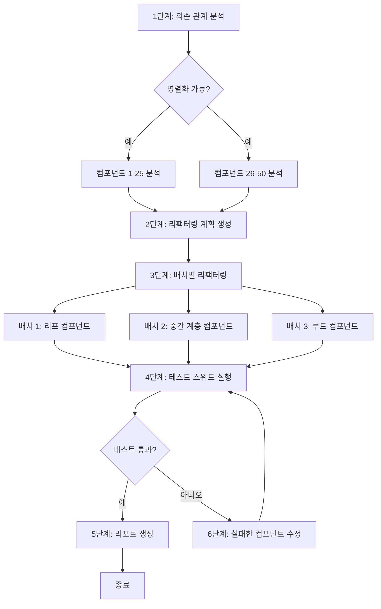

# 레슨 6: 실전 워크플로 사례

> 학습 목표:
> - 작업 분해, 상태 관리, 에러 처리를 결합해 완전한 워크플로 설계하기
> - 프로덕션 수준 시나리오 세 가지의 워크플로 패턴 이해하기
> - 워크플로의 관측 가능성과 디버깅 기법 익히기
>
> 전제: [레슨 5: 에러 처리와 재시도 전략](./05-error-handling-retry.md)

## 이론에서 실전으로

앞선 다섯 레슨에서 워크플로의 구성 요소를 다뤘습니다. 단계, 상태, 분해, 에러 처리. 이제 그것들을 합쳐, 실제 상황에서 가져온 프로덕션 수준의 워크플로 세 개를 만들어 봅니다.

**이 레슨에서 다룰 세 워크플로:**

1. **코드 리팩터링 파이프라인**: 레거시 코드를 현대적인 패턴으로 리팩터링합니다. 분석, 계획, 실행, 테스트, 검증을 다룹니다
2. **문서 생성 파이프라인**: 코드에서 API 문서를 자동 생성합니다. 추출, 예시 생성, 렌더링, 게시를 다룹니다
3. **테스트 자동화 흐름**: 엔드투엔드 테스트 워크플로입니다. 환경 준비, 병렬 테스트, 결과 집계, 리포트 생성을 다룹니다

**각 워크플로에서 보여 줄 것:**
- 완전한 작업 분해
- 상태 관리와 체크포인트 설계
- 에러 처리와 복구 전략
- 관측 가능성과 디버깅 지원[^S20]

## 시나리오 1: 코드 리팩터링 파이프라인

### 요구 사항

컴포넌트 50개짜리 레거시 프론트엔드 프로젝트를 클래스 컴포넌트에서 함수 컴포넌트 + Hooks로 리팩터링합니다.

**어려운 점:**
- 컴포넌트가 서로 의존하므로 아무 순서로나 리팩터링할 수 없다
- 리팩터링이 동작을 깨뜨릴 수 있으므로 테스트 검증이 필요하다
- 컴포넌트 50개는 대화 한 번으로 끝낼 수 없어 병렬 처리가 필요하다[^S21]

### 작업 분해

워크플로는 6단계입니다. 앞의 두 단계는 컴포넌트를 병렬로 처리할 수 있고, 뒤의 단계들은 의존 순서대로 돕니다.



### 전체 구현

```javascript
// 워크플로 상태 정의
const createInitialState = (components) => ({
  phase: 'init',
  input: { components, total: components.length },
  analysis: null,
  plan: null,
  refactored: [],
  testResults: null,
  errors: [],
  startTime: Date.now()
});

// 메인 워크플로
async function refactoringWorkflow(componentPaths) {
  const workflowId = `refactor-${Date.now()}`;
  const store = new WorkflowStateStore();
  
  // 상태 로드 또는 생성
  let state = await store.load(workflowId) || 
              createInitialState(componentPaths);
  
  console.log(`🚀 리팩터링 워크플로 시작(컴포넌트 ${state.input.total}개)`);
  
  try {
    // 1단계: 의존 관계 분석
    if (state.phase === 'init') {
      console.log('\n📊 1단계: 컴포넌트 의존 관계 분석 중...');
      
      state.analysis = await analyzeComponentsInParallel(
        state.input.components
      );
      
      state.phase = 'analyzed';
      await store.save(workflowId, state);
      console.log(`✓ 분석 완료: 의존 관계 ${state.analysis.dependencies.length}개 발견`);
    }
    
    // 2단계: 리팩터링 계획 생성
    if (state.phase === 'analyzed') {
      console.log('\n📋 2단계: 리팩터링 계획 생성 중...');
      
      state.plan = await agent({
        task: '리팩터링 계획 생성',
        prompt: `
          의존 관계 분석을 바탕으로 컴포넌트를 리팩터링할 순서를 만들어 주세요:
          1. 리프 컴포넌트부터 리팩터링(다른 컴포넌트에 의존하지 않는 것)
          2. 다음은 중간 계층(이미 리팩터링된 것에 의존하는 컴포넌트)
          3. 마지막으로 루트 컴포넌트
          
          JSON으로 반환: {
            batches: [
              { name: "리프 컴포넌트", components: [...] },
              { name: "중간 계층", components: [...] },
              { name: "루트 컴포넌트", components: [...] }
            ]
          }
        `,
        context: state.analysis
      });
      
      state.phase = 'planned';
      await store.save(workflowId, state);
      console.log(`✓ 계획 생성 완료: 배치 ${state.plan.batches.length}개`);
    }
    
    // 3단계: 배치별 리팩터링
    if (state.phase === 'planned') {
      console.log('\n🔧 3단계: 리팩터링 실행 중...');
      
      for (const batch of state.plan.batches) {
        console.log(`\n  배치: ${batch.name}(컴포넌트 ${batch.components.length}개)`);
        
        // 이 배치의 컴포넌트를 병렬로 리팩터링
        const results = await Promise.allSettled(
          batch.components.map(async (component) => {
            return await retryWithBackoffAndJitter(
              async () => refactorComponent(component),
              3,
              2000
            );
          })
        );
        
        // 결과 처리
        for (let i = 0; i < results.length; i++) {
          const result = results[i];
          const component = batch.components[i];
          
          if (result.status === 'fulfilled') {
            state.refactored.push({
              component,
              code: result.value,
              batch: batch.name
            });
          } else {
            state.errors.push({
              component,
              error: result.reason.message,
              batch: batch.name
            });
          }
        }
        
        // 배치가 끝나면 체크포인트 저장
        await store.save(workflowId, state);
        console.log(`  ✓ ${batch.name} 완료`);
      }
      
      state.phase = 'refactored';
      await store.save(workflowId, state);
      console.log(`\n✓ 리팩터링 완료: ${state.refactored.length}/${state.input.total}`);
    }
    
    // 4단계: 테스트 실행
    if (state.phase === 'refactored') {
      console.log('\n🧪 4단계: 테스트 스위트 실행 중...');
      
      state.testResults = await runTestSuite({
        timeout: 300000,  // 5분
        parallel: true
      });
      
      state.phase = 'tested';
      await store.save(workflowId, state);
      
      if (state.testResults.passed) {
        console.log(`✓ 테스트 통과: ${state.testResults.passedCount}/${state.testResults.totalCount}`);
      } else {
        console.log(`✗ 테스트 실패: ${state.testResults.failedTests.length}건`);
      }
    }
    
    // 5단계: 실패 수정(필요한 경우)
    if (state.phase === 'tested' && !state.testResults.passed) {
      console.log('\n🔨 5단계: 실패한 컴포넌트 수정 중...');
      
      const failedComponents = identifyFailedComponents(
        state.testResults,
        state.refactored
      );
      
      console.log(`  컴포넌트 ${failedComponents.length}개를 수정해야 함`);
      
      for (const component of failedComponents) {
        try {
          const fixed = await agent({
            task: `컴포넌트 ${component.name} 수정`,
            prompt: `
              이 컴포넌트는 리팩터링 후 테스트가 실패했습니다.
              실패한 테스트: ${component.failedTests.join(', ')}
              에러 메시지: ${component.errors.join('\n')}
              
              문제를 진단하고 코드를 고쳐 주세요.
            `,
            context: {
              originalCode: component.originalCode,
              refactoredCode: component.refactoredCode,
              tests: component.tests
            }
          });
          
          // 리팩터링 결과 갱신
          const index = state.refactored.findIndex(r => r.component === component.path);
          state.refactored[index].code = fixed;
          
        } catch (error) {
          state.errors.push({
            component: component.path,
            error: `수정 실패: ${error.message}`,
            phase: 'fix'
          });
        }
      }
      
      // 재테스트
      state.phase = 'refactored';
      await store.save(workflowId, state);
      
      // 자기 자신을 재귀 호출(횟수 제한 포함)
      state.fixAttempts = (state.fixAttempts || 0) + 1;
      if (state.fixAttempts < 3) {
        return await refactoringWorkflow(componentPaths);
      } else {
        console.log('✗ 3번 수정했지만 테스트가 여전히 실패');
      }
    }
    
    // 6단계: 리포트 생성
    if (state.phase === 'tested' && state.testResults.passed) {
      console.log('\n📄 6단계: 리팩터링 리포트 생성 중...');
      
      const report = await agent({
        task: '리팩터링 리포트 생성',
        prompt: `
          리팩터링 프로젝트의 리포트를 생성해 주세요. 포함할 내용:
          - 리팩터링 통계(컴포넌트 몇 개, 배치별 분포)
          - 테스트 결과 요약
          - 마주친 문제와 해결 방법
          - 변경 전후 코드 비교 예시
          
          Markdown으로 반환.
        `,
        context: {
          total: state.input.total,
          refactored: state.refactored.length,
          batches: state.plan.batches.map(b => b.name),
          testResults: state.testResults,
          errors: state.errors,
          duration: Date.now() - state.startTime
        }
      });
      
      await fs.writeFile('refactoring-report.md', report);
      
      state.phase = 'completed';
      state.completedAt = Date.now();
      await store.save(workflowId, state);
      
      console.log('\n✅ 리팩터링 워크플로 완료!');
      console.log(`   리포트 저장: refactoring-report.md`);
    }
    
    return state;
    
  } catch (error) {
    console.error('\n❌ 워크플로 실패:', error.message);
    state.phase = 'failed';
    state.error = error.message;
    await store.save(workflowId, state);
    throw error;
  }
}

// 헬퍼: 컴포넌트 병렬 분석
async function analyzeComponentsInParallel(components) {
  const analyses = await Promise.all(
    components.map(async (path) => {
      return await agent({
        task: `${path} 분석`,
        prompt: `
          이 컴포넌트를 분석해 주세요:
          1. 클래스 컴포넌트인지 함수 컴포넌트인지
          2. 어떤 다른 컴포넌트에 의존하는지(import 문)
          3. 어떤 생명주기 메서드나 훅을 쓰는지
          
          JSON으로 반환: { type, dependencies: [], hooks: [] }
        `,
        context: { file: await fs.readFile(path, 'utf-8') }
      });
    })
  );
  
  // 의존 관계 그래프 구축
  const dependencies = [];
  for (let i = 0; i < components.length; i++) {
    const component = components[i];
    const analysis = analyses[i];
    
    for (const dep of analysis.dependencies) {
      dependencies.push({ from: component, to: dep });
    }
  }
  
  return { components: analyses, dependencies };
}

// 헬퍼: 컴포넌트 하나 리팩터링
async function refactorComponent(componentPath) {
  return await agent({
    task: `${componentPath} 리팩터링`,
    prompt: `
      이 클래스 컴포넌트를 함수 컴포넌트 + Hooks로 리팩터링해 주세요:
      1. 클래스와 constructor 제거
      2. state를 useState로 교체
      3. 생명주기 메서드를 useEffect로 교체
      4. props 인터페이스와 동작은 그대로 유지
      
      리팩터링한 전체 코드를 반환.
    `,
    context: {
      code: await fs.readFile(componentPath, 'utf-8')
    }
  });
}
```

### 핵심 설계 포인트

**1. 체크포인트 전략**: 배치가 끝날 때마다 저장하므로, 이미 한 리팩터링을 다시 하는 일이 없습니다

**2. 병렬 실행**: 같은 배치의 컴포넌트는 병렬로 리팩터링할 수 있습니다(서로 의존하지 않으므로)

**3. 재시도 메커니즘**: 한 컴포넌트의 실패가 다른 컴포넌트에 영향을 주지 않습니다. `Promise.allSettled`로 모든 결과를 모읍니다

**4. 수정 루프**: 테스트가 실패하면 자동으로 수정을 시도하며, 최대 3회까지입니다

**5. 관측 가능성**: 모든 단계가 명확하게 로그를 남기고, 상태는 외부 저장소에 영속화됩니다[^S22]

## 시나리오 2: 문서 생성 파이프라인

### 요구 사항

REST API 엔드포인트 30개를 가진 서비스의 완전한 API 문서를 생성합니다. 엔드포인트 설명, 요청/응답 예시, 에러 코드 설명을 포함합니다.

### 작업 분해(팬아웃/집계 패턴)

```javascript
async function apiDocGenerationWorkflow(servicePath) {
  console.log('📚 API 문서 생성 워크플로');
  
  // 1단계: 모든 엔드포인트 추출
  console.log('\n1️⃣ API 엔드포인트 추출 중...');
  const endpoints = await extractAPIEndpoints(servicePath);
  console.log(`   엔드포인트 ${endpoints.length}개 발견`);
  
  // 2단계: 엔드포인트별 문서를 병렬로 생성
  console.log('\n2️⃣ 엔드포인트 문서 생성 중(병렬)...');
  const docs = await Promise.all(
    endpoints.map(async (endpoint, index) => {
      console.log(`   [${index + 1}/${endpoints.length}] ${endpoint.method} ${endpoint.path}`);
      
      return await agent({
        task: `${endpoint.method} ${endpoint.path} 문서 생성`,
        prompt: `
          이 API 엔드포인트의 문서를 생성해 주세요:
          
          ## ${endpoint.method} ${endpoint.path}
          
          포함할 내용:
          1. 설명(한 문단)
          2. 요청 파라미터(경로 파라미터, 쿼리 파라미터, 본문)
          3. 요청 예시(curl과 JavaScript)
          4. 응답 예시(성공과 흔한 에러)
          5. 에러 코드 설명
          
          Markdown으로 반환.
        `,
        context: {
          code: endpoint.handlerCode,
          schema: endpoint.schema,
          examples: endpoint.existingTests || []
        }
      });
    })
  );
  
  // 3단계: 목차와 개요 생성
  console.log('\n3️⃣ 문서 목차 생성 중...');
  const toc = await agent({
    task: '문서 목차 생성',
    prompt: `
      이 API 엔드포인트들의 목차를 생성해 주세요:
      - 기능별로 묶기(사용자 관리, 주문 관리 등)
      - 각 묶음 아래에 엔드포인트 나열(앵커 링크 포함)
      - 서비스 개요 생성(이 서비스가 무엇을 하는지 한 문단)
      
      Markdown으로 반환.
    `,
    context: {
      endpoints: endpoints.map(e => ({ method: e.method, path: e.path, summary: e.summary }))
    }
  });
  
  // 4단계: 전체 문서 조립
  console.log('\n4️⃣ 전체 문서 조립 중...');
  const fullDoc = [
    '# API 문서\n',
    toc,
    '\n---\n',
    ...docs.map((doc, i) => `\n## ${endpoints[i].method} ${endpoints[i].path}\n\n${doc}`)
  ].join('\n');
  
  // 5단계: 저장 및 게시
  console.log('\n5️⃣ 문서 저장 중...');
  await fs.writeFile('api-docs.md', fullDoc);
  
  console.log('\n✅ 문서 생성 완료!');
  console.log(`   파일: api-docs.md`);
  console.log(`   엔드포인트: ${endpoints.length}개`);
  
  return { endpoints: endpoints.length, outputFile: 'api-docs.md' };
}
```

**핵심 특징:**
- **팬아웃/집계 패턴**: 엔드포인트 30개의 문서를 병렬로 생성한 뒤 마지막에 집계합니다
- **무상태**: 작업이 충분히 빨라서(10분 미만) 체크포인트가 필요 없습니다
- **멱등성**: 언제든 다시 돌려서 출력 파일을 덮어쓸 수 있습니다[^S20]

## 시나리오 3: 테스트 자동화 흐름

### 요구 사항

여러 환경(로컬, 스테이징, 프로덕션)에서 엔드투엔드 테스트를 돌리고, 테스트 결과와 성능 지표를 모아 비교 리포트를 생성합니다.

### 전체 구현

```javascript
async function e2eTestingWorkflow(config) {
  const workflowId = `e2e-test-${Date.now()}`;
  const state = {
    environments: config.environments,  // ['local', 'staging', 'production']
    results: {},
    phase: 'init',
    startTime: Date.now()
  };
  
  console.log(`🧪 E2E 테스트 워크플로(환경 ${state.environments.length}개)`);
  
  try {
    // 1단계: 환경 준비
    console.log('\n1️⃣ 테스트 환경 준비 중...');
    for (const env of state.environments) {
      console.log(`   ${env} 환경 설정 중...`);
      await setupTestEnvironment(env);
    }
    state.phase = 'environments_ready';
    
    // 2단계: 모든 환경에서 테스트를 병렬로 실행
    console.log('\n2️⃣ 테스트 실행 중(병렬)...');
    const testPromises = state.environments.map(async (env) => {
      console.log(`   [${env}] 테스트 시작...`);
      
      try {
        const result = await runTestsWithRetry(env, {
          maxRetries: 2,
          testSuites: config.testSuites,
          timeout: 600000  // 10분
        });
        
        console.log(`   [${env}] ✓ 완료: ${result.passed}/${result.total} 통과`);
        return { env, result, status: 'success' };
        
      } catch (error) {
        console.log(`   [${env}] ✗ 실패: ${error.message}`);
        return { env, error: error.message, status: 'failed' };
      }
    });
    
    const testResults = await Promise.all(testPromises);
    
    // 결과를 상태에 저장
    for (const { env, result, error, status } of testResults) {
      state.results[env] = status === 'success' ? result : { error };
    }
    
    state.phase = 'tests_completed';
    
    // 3단계: 비교 리포트 생성
    console.log('\n3️⃣ 테스트 리포트 생성 중...');
    const report = await agent({
      task: '환경 간 테스트 비교 리포트 생성',
      prompt: `
        환경 간 테스트 비교 리포트를 생성해 주세요:
        
        비교 항목:
        1. 통과율(환경별)
        2. 성능 지표(평균 응답 시간, P95, P99)
        3. 실패 케이스 분석(어떤 케이스가 어떤 환경에서 실패하는지)
        4. 환경 차이 문제(특정 환경에서만 실패하는 케이스)
        
        표와 차트 설명을 넣어 Markdown으로 반환.
      `,
      context: state.results
    });
    
    await fs.writeFile('e2e-test-report.md', report);
    
    // 4단계: 실패가 있으면 수정 제안 생성
    const failedEnvs = Object.entries(state.results)
      .filter(([env, result]) => result.error || result.failedCount > 0);
    
    if (failedEnvs.length > 0) {
      console.log('\n4️⃣ 실패 분석 생성 중...');
      
      for (const [env, result] of failedEnvs) {
        const analysis = await agent({
          task: `${env} 환경의 실패 분석`,
          prompt: `
            테스트 실패를 진단하고 수정 제안을 제시해 주세요:
            
            실패한 테스트: ${result.failedTests?.map(t => t.name).join(', ')}
            에러 메시지: ${result.failedTests?.map(t => t.error).join('\n')}
            
            가능한 원인:
            - 환경 설정 문제
            - 데이터 불일치
            - 시간에 의존하는 테스트
            - 네트워크 문제
            
            수정 제안을 반환(Markdown).
          `,
          context: { env, result }
        });
        
        await fs.writeFile(`fix-${env}.md`, analysis);
        console.log(`   ${env} 실패 분석 저장: fix-${env}.md`);
      }
    }
    
    state.phase = 'completed';
    state.completedAt = Date.now();
    
    console.log('\n✅ 테스트 워크플로 완료!');
    console.log(`   리포트: e2e-test-report.md`);
    console.log(`   총 소요 시간: ${((state.completedAt - state.startTime) / 1000).toFixed(1)}s`);
    
    return state;
    
  } catch (error) {
    console.error('\n❌ 워크플로 실패:', error);
    throw error;
  }
}

// 헬퍼: 재시도가 있는 테스트 실행
async function runTestsWithRetry(env, options) {
  const { maxRetries, testSuites, timeout } = options;
  
  for (let attempt = 1; attempt <= maxRetries + 1; attempt++) {
    try {
      const result = await runTests(env, testSuites, timeout);
      return result;
      
    } catch (error) {
      if (attempt <= maxRetries) {
        console.log(`   [${env}] 재시도 ${attempt}/${maxRetries}...`);
        await sleep(5000 * attempt);  // 점점 늘어나는 지연
      } else {
        throw error;
      }
    }
  }
}
```

**핵심 특징:**
- **병렬 테스트**: 여러 환경이 동시에 테스트를 돌려 총 시간을 크게 줄입니다
- **장애 허용**: 한 환경의 실패가 다른 환경에 영향을 주지 않습니다
- **똑똑한 재시도**: 실패한 테스트를 자동으로 재시도합니다(네트워크 딸꾹질과 일시적 결함은 흔합니다)
- **실패 분석**: 실패에 대한 수정 제안이 자동으로 생성됩니다[^S20]

## 워크플로의 관측 가능성

**좋은 워크플로는 어느 순간에든 이런 질문에 답할 수 있어야 합니다.**

- 얼마나 진행되었는가?(X/Y 완료)
- 앞으로 얼마나 더 걸릴 것 같은가?
- 어떤 에러를 만났는가?
- 성능 병목은 어디인가?

이 질문들에 답할 수 없다면 로깅과 상태 추적이 충분히 상세하지 않은 것입니다. 워크플로 디버깅은 짐작이 아니라 그 기록에 기댑니다.

### 관측 가능성 구현

```javascript
class ObservableWorkflow {
  constructor(name, totalSteps) {
    this.name = name;
    this.totalSteps = totalSteps;
    this.currentStep = 0;
    this.startTime = Date.now();
    this.stepTimes = [];
    this.errors = [];
  }
  
  async step(name, fn) {
    this.currentStep++;
    const stepNum = this.currentStep;
    const progress = ((stepNum / this.totalSteps) * 100).toFixed(1);
    
    console.log(`\n[${this.name}] 단계 ${stepNum}/${this.totalSteps}(${progress}%): ${name}`);
    
    const stepStart = Date.now();
    
    try {
      const result = await fn();
      const duration = Date.now() - stepStart;
      this.stepTimes.push({ name, duration });
      
      console.log(`  ✓ 완료(${(duration / 1000).toFixed(1)}s)`);
      
      return result;
      
    } catch (error) {
      const duration = Date.now() - stepStart;
      this.errors.push({ step: name, error: error.message, duration });
      
      console.log(`  ✗ 실패: ${error.message}`);
      throw error;
    }
  }
  
  summary() {
    const totalDuration = Date.now() - this.startTime;
    const avgStepTime = this.stepTimes.reduce((sum, s) => sum + s.duration, 0) / this.stepTimes.length;
    
    console.log(`\n━━━ ${this.name} 요약 ━━━`);
    console.log(`총 소요 시간: ${(totalDuration / 1000).toFixed(1)}s`);
    console.log(`단계: ${this.currentStep}/${this.totalSteps}`);
    console.log(`단계당 평균: ${(avgStepTime / 1000).toFixed(1)}s`);
    
    if (this.errors.length > 0) {
      console.log(`\n에러(${this.errors.length}건):`);
      for (const err of this.errors) {
        console.log(`  - ${err.step}: ${err.error}`);
      }
    }
    
    console.log(`\n가장 느린 단계:`);
    const sorted = [...this.stepTimes].sort((a, b) => b.duration - a.duration);
    for (const step of sorted.slice(0, 3)) {
      console.log(`  - ${step.name}: ${(step.duration / 1000).toFixed(1)}s`);
    }
  }
}

// 사용 예시
async function myWorkflow() {
  const wf = new ObservableWorkflow('코드 리팩터링', 5);
  
  await wf.step('의존 관계 분석', async () => {
    return await analyzeDependencies();
  });
  
  await wf.step('계획 생성', async () => {
    return await generatePlan();
  });
  
  // ...
  
  wf.summary();
}
```

`summary()` 안에서 소요 시간으로 정렬해 가장 느린 단계 세 개만 출력하는 저 부분이 가장 단순한 형태의 성능 프로파일링입니다. 각 단계가 얼마나 걸렸는지 재고, 어느 단계가 느린지 짐작하는 대신 데이터에서 병목을 찾아내는 것입니다.

<!-- exercises -->


## 💻 연습

### 레벨 1: 자기 워크플로 설계하기

자기 업무에서 실제 작업을 하나 골라 완전한 워크플로를 설계하세요.

**요구 사항:**
1. 작업 설명(2~3문장)
2. 워크플로 다이어그램 그리기(단계, 분기, 병렬 지점)
3. 상태 필드 나열(최소 5개)
4. 체크포인트를 어디에 둘지 설명
5. 일어날 수 있는 에러와 처리 방법 나열

<!-- rubric -->
작업 설명이 명확함. 워크플로 다이어그램에 최소 4단계와 최소 1개의 분기 또는 병렬 지점이 있음. 상태 설계가 타당함(단계 표시자, 진행 상황, 결과, 에러 포함). 체크포인트 위치가 합리적임(비용이 큰 작업 뒤, 되돌릴 수 없는 작업 전). 최소 3가지 에러 유형을 처리 전략과 함께 짚음.

<!-- answer -->
(예시 생략. 학습자 자신의 업무 상황에 맞춰 설계해야 합니다.)

<!-- hint -->
최근에 두 시간 넘게 걸렸던 반복 작업부터 시작해, 그것을 에이전트에게 넘긴다면 몇 개의 큰 단계로 쪼개질지 생각해 보세요.

<!-- hint -->
좋은 워크플로에는 대개 분명한 입력(파일, 설정, 데이터)과 출력(리포트, 수정된 코드, 배포 결과)이 있습니다. 입력과 출력에서 거꾸로 짚어 가면 그 사이에 어떤 변환이 필요한지 알 수 있습니다.

### 레벨 2: 실패하는 워크플로 디버깅하기

"이미지 일괄 처리" 워크플로가 47번째 이미지에서 `Error: EMFILE: too many open files`라는 에러 메시지와 함께 실패합니다.

**질문:**
1. 이것은 어떤 유형의 에러인가?(일시적/영구적)
2. 왜 첫 번째가 아니라 47번째 이미지에서 실패하는가?
3. 워크플로를 어떻게 고쳐야 하는가?(코드 수정 제안을 제시하세요.)

<!-- rubric -->
에러 유형을 정확히 짚음(리소스 고갈로 인한 일시적 에러이지만 근본 원인은 코드 설계). 원인을 이해함(병렬로 파일 핸들을 너무 많이 열어 시스템 한도를 넘김). 합리적인 수정안을 제시함(동시성 제한, 처리 후 즉시 파일 닫기, 스트리밍 사용).

<!-- answer -->
(1) 이것은 일시적 에러(리소스 고갈)이지만 근본 원인은 코드 문제입니다. (2) 워크플로가 아마 `Promise.all(images.map(...))`으로 모든 이미지를 병렬 처리하고 있을 것입니다. 이미지마다 파일 핸들이 하나씩 열리고, 47번째에서 시스템 한도(보통 1024 또는 4096)를 넘습니다. (3) 수정: 동시성을 제한해 한 번에 10장씩만 처리하고 배치 사이에 기다립니다. 코드: `for (let i = 0; i < images.length; i += 10) { const batch = images.slice(i, i + 10); await Promise.all(batch.map(processImage)); }`. 또는 스트리밍을 써서 처리가 끝나는 대로 파일을 닫습니다.

<!-- hint -->
EMFILE 에러는 열린 파일이 너무 많다는 뜻입니다. 워크플로가 이미지 100장을 한꺼번에 여는지, 아니면 하나를 닫고 다음을 여는지 생각해 보세요.

<!-- hint -->
`Promise.all(array.map(...))`으로 파일 100개를 병렬 처리하면 파일 핸들 100개가 한꺼번에 열립니다. 해결책은 동시성을 제한하는 것입니다(예: 한 번에 10개씩만 처리).

<!-- /exercises -->

---

**에이전트 워크플로 설계 코스를 끝낸 것을 축하합니다.**

이제 다음을 다룰 수 있습니다.
- 워크플로의 핵심 개념과 그것이 놓이는 자리
- 작업 분해의 세 가지 전략
- 상태 관리와 체크포인트 메커니즘
- 에러 처리와 재시도 전략
- 현실 시나리오에서 가져온 프로덕션 수준 워크플로 세 개

**다음 단계:**
1. 자기 프로젝트에서 단순한 워크플로(5단계 미만)를 연습해 보기
2. 복잡도를 한 단계씩 올려 보기(병렬 처리, 체크포인트, 에러 처리)
3. 자기 워크플로 설계를 공유하고 커뮤니티의 피드백 받기
4. 더 고급 주제 탐색하기(분산 워크플로, 워크플로 오케스트레이션 프레임워크, 시각적 워크플로 편집기)
