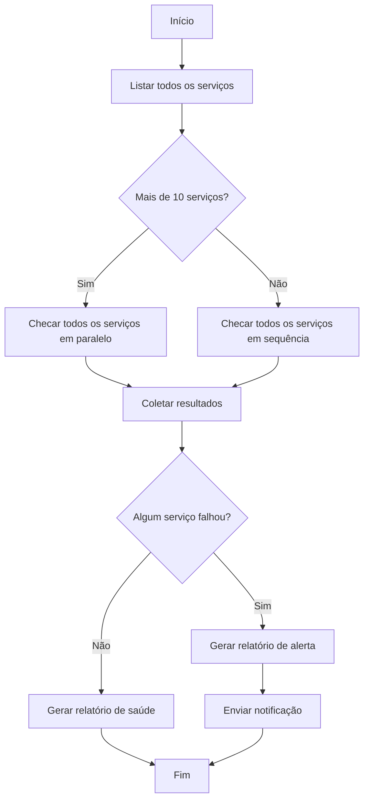

# Lição 2: Blocos de construção de um fluxo de trabalho: passos, estado, ramificações e loops

> Objetivos de aprendizado:
> - Dominar os quatro blocos de construção centrais de um fluxo de trabalho
> - Entender dependências e passagem de dados entre passos
> - Aprender a projetar o fluxograma de execução de um fluxo de trabalho
>
> Pré-requisitos: [Lição 1: Da conversa ao fluxo de trabalho](./01-from-conversation-to-workflow.md) | Próxima: [Lição 3 >>](./03-task-decomposition.md)

## Fluxos de trabalho não são mágica, são composição

Na lição anterior vimos que um fluxo de trabalho consegue coordenar dezenas de agentes para concluir uma tarefa complexa. Mas abra um script de fluxo de trabalho e você vai encontrar apenas código comum: funções, loops, condicionais.

**O poder de um fluxo de trabalho vem da combinação de quatro blocos de construção simples:**

1. **Passos** — a unidade básica de trabalho
2. **Estado** — dados compartilhados entre passos
3. **Ramificações** — escolher um caminho com base em uma condição
4. **Loops** — repetir uma operação parecida

Depois que você entende esses quatro blocos, consegue projetar um fluxo de trabalho de qualquer complexidade.[^S4]

## Bloco de construção 1: passos

**Um passo é a operação atômica de um fluxo de trabalho.** Cada passo é ou uma chamada de Agent ou uma função determinística.[^S5]

### Passos de Agent x passos de função

```javascript
// Passo de Agent: deixe o LLM fazer o trabalho que exige raciocínio
const summary = await agent({
  task: 'Resuma os achados da revisão de código',
  prompt: 'Extraia os problemas principais destes resultados de revisão, ordenados por severidade',
  context: reviews
});

// Passo de função: transformação determinística, sem precisar de LLM
const filtered = reviews.filter(r => r.severity === 'high');
const count = filtered.length;
```

**Quando usar um passo de Agent:**
- Você precisa entender uma entrada difusa (linguagem natural, dados não estruturados)
- Você precisa gerar conteúdo criativo (documentação, código, explicações)
- Você precisa emitir um julgamento (este código tem algum problema de segurança?)

**Quando usar um passo de função:**
- Transformação de dados (filtrar, ordenar, formatar)
- Matemática (estatísticas, agregação)
- Checagens condicionais (lógica if-else)
- Operações de arquivo (ler, escrever, mover)

**Boa prática:** passos de Agent raciocinam, passos de função computam. Não faça o LLM aplicar um filtro simples em um array ou somar números — é lento, caro e pouco confiável.[^S5]

### O contrato de entrada/saída de um passo

Todo passo deve ter um contrato claro de entrada e saída:

```javascript
// Passo bom: entradas e saídas claras
async function analyzeFile(filePath) {
  // Entrada: caminho do arquivo (string)
  const result = await agent({
    task: `Analise ${filePath}`,
    prompt: 'Devolva JSON: { complexity: number, issues: string[] }'
  });
  // Saída: { complexity, issues }
  return JSON.parse(result);
}

// Passo ruim: entradas e saídas difusas
async function doStuff(data) {
  // Qual é o formato de data? O que ela devolve? Não dá para saber.
  return await agent({ task: 'Processe os dados', context: data });
}
```

**Um contrato claro deixa o fluxo de trabalho fácil de entender e de depurar.** Quando o passo 5 quebra, você enxerga na hora que foi porque a saída do passo 4 veio no formato errado.[^S6]

## Bloco de construção 2: estado

**Estado são os dados compartilhados entre passos.** É como a memória do fluxo de trabalho, guardando resultados intermediários e o progresso da execução.[^S11]

### Dois tipos de estado

**Estado do fluxo de trabalho:**
- Toda a informação sobre a tarefa atual: em que passo você está, o resultado de cada passo, o que o próximo passo precisa
- Guardado em variáveis do script ou em um banco de dados externo
- Passado entre passos, mas não entre sessões

**Estado de sessão:**
- O histórico de conversa do usuário e as configurações de preferência
- O próprio Agent gerencia isso; o fluxo de trabalho não precisa se preocupar com ele[^S11]

```javascript
// Exemplo de estado do fluxo de trabalho
const workflowState = {
  phase: 'analysis',           // fase atual
  filesAnalyzed: 47,          // progresso
  issues: [],                 // resultados acumulados
  nextAction: 'generate-plan' // próximo passo
};
```

### Padrões de gerenciamento de estado

**Padrão 1: variáveis do script (bom para fluxos de trabalho curtos)**

```javascript
async function shortWorkflow() {
  // O estado são apenas variáveis comuns
  let files = await listFiles();
  let analysis = await analyzeFiles(files);
  let report = await generateReport(analysis);
  return report;
}
```

**Padrão 2: um objeto de estado (bom para complexidade média)**

```javascript
async function mediumWorkflow() {
  const state = {
    input: await getInput(),
    processed: [],
    errors: []
  };
  
  for (const item of state.input) {
    try {
      const result = await processItem(item);
      state.processed.push(result);
    } catch (err) {
      state.errors.push({ item, error: err });
    }
  }
  
  return state;
}
```

**Padrão 3: armazenamento externo (bom para fluxos de trabalho de longa duração)**

```javascript
async function longWorkflow(taskId) {
  // O estado vive em um banco de dados, recuperável a qualquer momento
  let state = await db.loadState(taskId);
  
  if (state.phase === 'completed') return state.result;
  
  // Retomar de onde parou
  if (state.phase === 'analysis') {
    state.analysisResult = await runAnalysis();
    state.phase = 'planning';
    await db.saveState(taskId, state);
  }
  
  if (state.phase === 'planning') {
    state.plan = await generatePlan(state.analysisResult);
    state.phase = 'execution';
    await db.saveState(taskId, state);
  }
  
  // ...
}
```

**Checkpointing:** salve o estado depois dos passos importantes, para que o fluxo de trabalho consiga retomar do ponto da falha em vez de começar tudo de novo.[^S12]

## Bloco de construção 3: ramificações

**Uma ramificação escolhe um caminho de execução diferente com base em uma condição.**[^S2]

### Ramificação simples

```javascript
const fileCount = files.length;

if (fileCount < 10) {
  // Poucos arquivos, processar em sequência
  for (const file of files) {
    await processFile(file);
  }
} else {
  // Muitos arquivos, processar em paralelo
  await Promise.all(files.map(f => processFile(f)));
}
```

### Ramificação a partir da decisão de um Agent

```javascript
// O Agent avalia a complexidade
const assessment = await agent({
  task: 'Avalie a complexidade da refatoração',
  prompt: 'Devolva JSON: { complexity: "low" | "medium" | "high" }'
});

const parsed = JSON.parse(assessment);

if (parsed.complexity === 'low') {
  // Refatoração automática
  await autoRefactor();
} else if (parsed.complexity === 'medium') {
  // Gerar um plano e esperar aprovação humana
  const plan = await generatePlan();
  await waitForApproval(plan);
  await executeRefactor(plan);
} else {
  // Complexidade alta, apenas gerar recomendações
  await generateRecommendations();
}
```

### Ramificação de tratamento de erros

```javascript
for (const service of services) {
  try {
    await deployService(service);
  } catch (error) {
    if (error.type === 'transient') {
      // Erro transitório, tentar de novo
      await retry(() => deployService(service));
    } else {
      // Erro permanente, reverter
      await rollback(service);
      throw error;
    }
  }
}
```

```agentmentor-check
{
  "id": "workflows-zh-02-branching-logic",
  "label": "Julgamento da solidez de um desenho de ramificação",
  "prompt": "Um fluxo de trabalho de revisão de código decide o próximo passo com base na quantidade de problemas encontrados: 0 problemas → merge automático; 1 a 3 problemas → avisar o autor para corrigir; 4 ou mais problemas → rejeitar o PR e gerar um relatório detalhado. Essa lógica de ramificação deve ser implementada por um Agent ou pelo if-else de um script?",
  "whyHere": "Logo depois de aprender a diferença entre passos de Agent e passos de função e como implementar ramificações, esta checagem verifica se você sabe distinguir quando uma ramificação deve ser determinística (script) e quando ela é uma ramificação por decisão de Agent.",
  "mode": "single",
  "choices": [
    {
      "id": "a",
      "text": "Por um Agent, porque é preciso entender a severidade dos problemas",
      "correct": false,
      "feedback": "Não exatamente. A quantidade de problemas é um número sem ambiguidade (0, 1 a 3, 4 ou mais); nenhum Agent é necessário para entendê-la ou julgá-la. A avaliação de severidade deveria acontecer em um passo anterior, e a ramificação só precisa de um if-else sobre um número claro — um script é mais rápido, mais confiável e mais previsível."
    },
    {
      "id": "b",
      "text": "Pelo if-else de um script, porque a condição é uma comparação numérica clara",
      "correct": true,
      "feedback": "Correto. A condição da ramificação é determinística (se a quantidade de problemas é 0, de 1 a 3, ou 4 ou mais); ela não exige raciocínio nem compreensão, então um if-else é mais rápido, mais barato e totalmente previsível. O Agent deve focar no trabalho de raciocínio (como julgar se um problema é mesmo um problema), não em comparações numéricas simples."
    }
  ]
}
```

## Bloco de construção 4: loops

**Um loop permite rodar a mesma operação sobre muitos objetos parecidos.** Essa é a fonte central do poder de um fluxo de trabalho.[^S2]

### Loop sequencial

```javascript
// Processar um depois do outro
for (const pr of pullRequests) {
  const review = await reviewPR(pr);
  await postComment(pr, review);
}
```

### Loop paralelo

```javascript
// Processar todos de uma vez
const reviews = await Promise.all(
  pullRequests.map(pr => reviewPR(pr))
);

// Paralelo, mas com um limite de concorrência (evita sobrecarga)
const limit = 5;
for (let i = 0; i < pullRequests.length; i += limit) {
  const batch = pullRequests.slice(i, i + limit);
  await Promise.all(batch.map(pr => reviewPR(pr)));
}
```

Aqui, `limit = 5` é o limite de concorrência: rode no máximo 5 por vez, em vez de disparar todos os 100 de uma só vez com `Promise.all`, o que abriria conexões ou descritores de arquivo demais.

### Loop com acumulação

```javascript
let totalIssues = 0;
const reports = [];

for (const file of files) {
  const analysis = await analyzeFile(file);
  totalIssues += analysis.issueCount;
  reports.push({
    file: file.path,
    issues: analysis.issues
  });
}

console.log(`Foram encontrados ${totalIssues} problemas no total`);
```

### Loop com terminação condicional

```javascript
let attempts = 0;
let success = false;

while (!success && attempts < 3) {
  try {
    await runTests();
    success = true;
  } catch (error) {
    attempts++;
    console.log(`Teste falhou, tentando de novo ${attempts}/3`);
    await wait(1000 * attempts); // backoff linear (1s, 2s, 3s)
  }
}

if (!success) throw new Error('Os testes falharam nas 3 tentativas');
```

## Combinando os blocos de construção: um fluxo de trabalho completo

Vamos combinar esses quatro blocos para projetar um fluxo de trabalho de “checagem de saúde de microsserviços”:



O script correspondente:

```javascript
async function healthCheckWorkflow() {
  // Passo 1: obter a lista de serviços (passo de função)
  const services = await listServices();
  
  // Estado: guardar os resultados
  const state = {
    total: services.length,
    healthy: [],
    unhealthy: []
  };
  
  // Ramificação: escolher a estratégia com base na quantidade
  let results;
  if (services.length > 10) {
    // Loop paralelo
    results = await Promise.all(
      services.map(s => checkServiceHealth(s))
    );
  } else {
    // Loop sequencial
    results = [];
    for (const service of services) {
      results.push(await checkServiceHealth(service));
    }
  }
  
  // Passo de função: classificar os resultados
  for (const result of results) {
    if (result.healthy) {
      state.healthy.push(result);
    } else {
      state.unhealthy.push(result);
    }
  }
  
  // Ramificação: gerar um relatório diferente conforme os resultados
  if (state.unhealthy.length > 0) {
    // Passo de Agent: gerar um alerta
    const alert = await agent({
      task: 'Gere um relatório de alerta',
      prompt: `${state.unhealthy.length} serviços estão fora de saúde,
               gere um relatório detalhado das falhas e passos sugeridos de correção`,
      context: state.unhealthy
    });
    await sendAlert(alert);
  } else {
    // Passo de Agent: gerar um relatório de saúde
    const report = await agent({
      task: 'Gere um relatório de saúde',
      prompt: `Todos os ${state.total} serviços estão saudáveis,
               gere um resumo de status conciso`
    });
    await logReport(report);
  }
  
  return state;
}
```

**Este fluxo de trabalho usa os quatro blocos de construção:**
- **Passos**: `listServices`, `checkServiceHealth`, as chamadas `agent()`
- **Estado**: o objeto `state` guardando o total e as listas de saudáveis/não saudáveis
- **Ramificações**: paralelo x sequencial conforme a quantidade de serviços, e o tipo de relatório conforme o status de saúde
- **Loops**: o loop paralelo com `map`, o loop sequencial com `for`

## Como pensar o design de fluxos de trabalho

**Trabalhe de trás para frente, a partir do ponto final:**

1. Qual é a saída final? (um relatório, serviços em produção, código limpo)
2. De que entrada o último passo precisa? (dados agregados, resultados validados)
3. De onde vem essa entrada? (da saída do passo anterior)
4. Repita até chegar ao início (entrada do usuário ou sistema de arquivos)

**Identifique as oportunidades de paralelismo:**

- Se vários passos não dependem uns dos outros, eles podem rodar em paralelo
- “Para cada X, faça Y” geralmente pode ser paralelizado
- O paralelismo pode fazer dez tarefas de 5 minutos caírem de 50 minutos para 5

**Deixe as dependências explícitas:**

```javascript
// Exemplo de dependência
const files = await readFiles();      // passo 1
const analysis = await analyze(files); // passo 2 depende do passo 1
const plan = await makePlan(analysis); // passo 3 depende do passo 2

// Podem rodar em paralelo (sem dependências)
const [files, config, users] = await Promise.all([
  readFiles(),
  loadConfig(),
  fetchUsers()
]);
```

<!-- exercises -->


## 💻 Exercícios

### Nível 1: Projete um fluxo de trabalho simples

Tarefa: projete um fluxo de trabalho de “processamento de imagens em lote”. A entrada são 50 imagens, e você precisa: (1) redimensioná-las para 800x600, (2) adicionar uma marca d'água, (3) convertê-las para o formato WebP.

**Requisitos:**
- Desenhe o fluxograma (uma descrição em texto também serve, por exemplo A → B → C)
- Diga quais passos usam funções e quais usam um Agent
- Diga onde as coisas podem rodar em paralelo
- Escreva a parte central do pseudocódigo (loop e ramificação)

<!-- rubric -->
O fluxograma está claro (inclui pelo menos os nós de entrada, de loop de processamento e de saída); identifica corretamente que todos os passos são passos de função (nenhum Agent é necessário, já que processamento de imagem é determinístico); reconhece que as 50 imagens podem ser processadas em paralelo (cada uma é independente); o pseudocódigo inclui um loop paralelo (`Promise.all`).

<!-- answer -->
Fluxograma: início → ler 50 imagens → processar cada imagem em paralelo (redimensionar → adicionar marca d'água → converter formato) → salvar resultados → fim. Todos os passos usam funções (uma biblioteca de imagens); nenhum Agent é necessário. As 50 imagens podem ser processadas em paralelo, porque processar uma imagem não depende das outras. Pseudocódigo: `const results = await Promise.all(images.map(async img => { const resized = await resize(img, 800, 600); const watermarked = await addWatermark(resized); return await convertToWebP(watermarked); }));`

<!-- hint -->
Processamento de imagem (redimensionar, adicionar marca d'água, converter formato) é determinístico — não exige compreensão nem raciocínio — então todos esses são passos de função.

<!-- hint -->
Pergunte a si mesmo: ao processar a 10ª imagem, você precisa saber o resultado da 9ª? Se não, dá para rodar em paralelo.

### Nível 2: Identifique as necessidades de gerenciamento de estado

Um fluxo de trabalho de “migração de base de código” precisa: (1) varrer 200 arquivos para encontrar as chamadas de API que precisam ser migradas, (2) migrar todos os arquivos em paralelo, (3) rodar os testes, (4) se os testes falharem, reverter todas as mudanças.

**Perguntas:**
1. Que estado esse fluxo de trabalho precisa salvar? Liste pelo menos 3 campos de estado.
2. Depois de qual passo você deveria colocar um checkpoint? Por quê?
3. Se o passo 3 (rodar os testes) falhar, de que informação de estado o fluxo de trabalho precisa para reverter corretamente?

<!-- rubric -->
Identifica corretamente pelo menos 3 peças-chave de estado (por exemplo, a lista de arquivos a migrar, a lista de arquivos migrados, um backup do conteúdo original de cada arquivo, os resultados dos testes); aponta que um checkpoint deve ser colocado depois do passo 2 (migração concluída), com uma justificativa sólida (por exemplo, a migração é demorada, e um checkpoint evita refazê-la); identifica o estado necessário para a reversão (lista de arquivos + backup do conteúdo original).

<!-- answer -->
(1) Campos de estado: `filesToMigrate` (a lista de arquivos a migrar), `migratedFiles` (os arquivos migrados e seu novo conteúdo), `backups` (um backup do conteúdo original de cada arquivo), `testResult` (se os testes passaram). (2) Um checkpoint deve ser colocado depois do passo 2, porque migrar 200 arquivos leva muito tempo, e se a fase de testes quebrar você não vai querer migrar todos os arquivos de novo. (3) A reversão precisa de `migratedFiles` (para saber quais arquivos foram alterados) e `backups` (para saber como restaurá-los), sobrescrevendo os arquivos migrados com o conteúdo do backup.

<!-- hint -->
O estado costuma incluir: dados de entrada, resultados intermediários, progresso da execução e informação de erro. Tudo o que for importante para “retomar a execução” ou “desfazer uma operação” deve ser salvo.

<!-- hint -->
Coloque um checkpoint “depois de uma operação demorada” ou “antes de uma operação irreversível”. Neste fluxo de trabalho, a migração é a operação demorada, e a reversão é a irreversível (você precisa saber o que mudou para poder desfazer).

<!-- /exercises -->

---

**Próxima:** [Lição 3: Decompondo uma tarefa complexa em um fluxo de trabalho](./03-task-decomposition.md) — estratégias para quebrar sistematicamente uma tarefa complexa em passos de fluxo de trabalho
