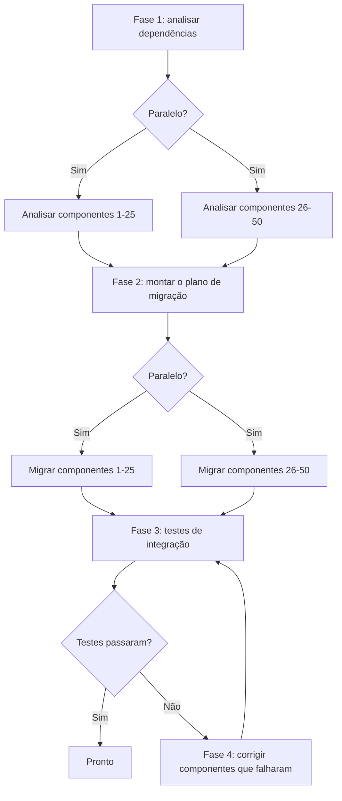

# Lição 3: Decompondo uma tarefa complexa em um fluxo de trabalho

> Objetivos de aprendizado:
> - Dominar as três estratégias de decomposição de tarefas
> - Identificar dependências entre tarefas
> - Transformar uma decomposição em um fluxo de trabalho executável
>
> Pré-requisitos: [Lição 2: Blocos de construção de um fluxo de trabalho: passos, estado, ramificações e loops](./02-workflow-building-blocks.md) | Próxima: [Lição 4 >>](./04-state-and-context.md)

## De “não sei por onde começar” a passos claros

Uma tarefa cai na sua mesa: “Divida nossa aplicação Rails monolítica em uma arquitetura de microsserviços.” Essa é uma tarefa complexa. Você não sabe por onde começar, quantos passos ela leva nem o que cada passo faz.

**Decomposição de tarefas é como você pega uma tarefa vaga e grande demais e a quebra em passos pequenos e claros.**[^S16]

Uma boa decomposição atende a três critérios:

1. **Cada subtarefa é pequena o bastante** para terminar em uma única chamada de agente ou função.
2. **As dependências entre subtarefas são explícitas** — você sabe quais precisam rodar em ordem e quais podem rodar em paralelo.
3. **Cada subtarefa tem entradas e saídas claras** — a saída de um passo pode alimentar diretamente o próximo.

Decomponha bem e escrever o fluxo de trabalho vira montar Lego. Decomponha mal e você vai descobrir, no meio da execução, que faltam passos, que a ordem está errada ou que os dados não fluem.[^S17]

## Estratégia 1: decomposição sequencial

**Quando usar:** a tarefa tem uma ordem clara do início ao fim, e cada passo depende do resultado do anterior.

**Como:** trabalhe de trás para frente, a partir do fim. Pergunte “de que entrada este passo precisa? De onde vem essa entrada?”

### Exemplo: gerar documentação técnica

**Tarefa:** gerar documentação voltada ao usuário para uma API.

**Decomposição de trás para frente:**

```
Saída final: documentação em Markdown
  ↑ precisa do quê?
Passo 4: renderizar o Markdown (precisa de: conteúdo estruturado do documento)
  ↑ vem de onde?
Passo 3: organizar o conteúdo (precisa de: lista de endpoints + código de exemplo + descrições)
  ↑ vem de onde?
Passo 2: gerar um exemplo por endpoint (precisa de: lista de endpoints)
  ↑ vem de onde?
Passo 1: extrair a lista de endpoints do código (precisa de: código-fonte)
  ↑
Início: diretório de origem
```

**Transformada em um fluxo de trabalho:**

```javascript
async function generateAPIDocsWorkflow(sourceDir) {
  // Passo 1: extrair os endpoints
  const endpoints = await extractEndpoints(sourceDir);
  
  // Passo 2: gerar exemplos (depende do passo 1)
  const examples = await Promise.all(
    endpoints.map(ep => generateExample(ep))
  );
  
  // Passo 3: organizar o conteúdo (depende dos passos 1 e 2)
  const content = await agent({
    task: 'Organize a estrutura do documento',
    prompt: 'Organize os endpoints e os exemplos em uma estrutura de documento amigável ao usuário',
    context: { endpoints, examples }
  });
  
  // Passo 4: renderizar o Markdown (depende do passo 3)
  const markdown = await renderMarkdown(content);
  
  return markdown;
}
```

**Cadeia de dependências:**
```
Passo 1 → Passo 2
   ↓         ↓
   └─→ Passo 3 → Passo 4
```

O passo 2 pode rodar em paralelo com o passo 1? Não — o passo 2 precisa dos `endpoints` do passo 1.

O passo 3 pode rodar em paralelo com o passo 2? Não — o passo 3 precisa dos `examples` do passo 2.

**Como é a decomposição sequencial:** uma longa cadeia de dependências, poucas chances de paralelizar, mas com lógica clara.[^S18]

## Estratégia 2: decomposição paralela

**Quando usar:** a tarefa se divide em várias subtarefas independentes que não dependem umas das outras.

**Como:** identifique o padrão “faça Y para cada X” — cada X pode ser processado em paralelo.

### Exemplo: auditoria de segurança de uma base de código

**Tarefa:** auditar 100 arquivos em busca de problemas de segurança.

**Decomposição paralela:**

```javascript
async function securityAuditWorkflow(files) {
  // Fase 1: auditar cada arquivo em paralelo (sem dependências)
  const audits = await Promise.all(
    files.map(file => auditFile(file))
  );
  
  // Fase 2: agregar os resultados (depende da fase 1)
  const summary = await agent({
    task: 'Resuma a auditoria de segurança',
    prompt: `Analise os resultados da auditoria em ${audits.length} arquivos,
             ordene os problemas por severidade e produza um resumo executivo`,
    context: audits
  });
  
  return summary;
}

async function auditFile(file) {
  return await agent({
    task: `Audite ${file.path}`,
    prompt: `Cheque injeção de SQL, XSS, segredos hardcoded e criptografia fraca.
             Devolva JSON: { file, issues: [{ type, line, severity }] }`
  });
}
```

**Formato:**
```
          ┌─→ auditFile(1) ─┐
          ├─→ auditFile(2) ─┤
files ───→├─→ auditFile(3) ─┼─→ summary
          ├─→   ...         ─┤
          └─→ auditFile(100)─┘
```

**Padrão fan-out-reduce:** este é o formato mais comum da decomposição paralela.[^S4]

1. **Fan out:** espalhe a tarefa entre muitos agentes paralelos.
2. **Reduce:** junte todos os resultados em uma saída final.

**O poder da decomposição paralela:** 100 arquivos, 2 minutos para auditar cada um. A execução sequencial leva 200 minutos; a paralela leva 2 (supondo que não haja limites de recursos).

```agentmentor-check
{
  "id": "workflows-zh-03-decomposition-strategy",
  "label": "Escolha da estratégia de decomposição correta",
  "prompt": "Tarefa: gerar um relatório de testes de integração para 10 microsserviços. Cada serviço precisa (1) subir o serviço, (2) rodar os testes, (3) coletar os logs, (4) analisar os resultados. No final, resumir o status dos testes de todos os serviços. Essa tarefa deve usar decomposição sequencial ou paralela?",
  "whyHere": "Você acabou de aprender decomposição sequencial e paralela, uma logo depois da outra. Esta tarefa esconde duas camadas de uma vez — os 10 serviços são independentes (paralelo), enquanto os 4 passos dentro de cada serviço têm ordem estrita (sequencial) — então ela checa se você lê a estrutura da tarefa em vez de se agarrar à primeira pista que parece ordenada.",
  "mode": "single",
  "choices": [
    {
      "id": "a",
      "text": "Sequencial, porque os passos rodam em ordem: subir → testar → coletar → analisar",
      "correct": false,
      "feedback": "Essa ordem é real, mas ela vale dentro de um serviço. A tarefa tem 10 serviços, e o teste de um serviço não depende do de outro. Então os 10 serviços rodam em paralelo, enquanto os 4 passos de cada serviço rodam em ordem internamente, e só depois vem o resumo. Isso é uma decomposição híbrida, não uma sequencial pura."
    },
    {
      "id": "b",
      "text": "Paralela, porque os 10 serviços são testados de forma independente, cada um rodando seus 4 passos em ordem, e no fim vem um resumo",
      "correct": true,
      "feedback": "Correto. Este é um híbrido fan-out-reduce: a camada externa é paralela (os 10 serviços são testados de uma vez) e a interna é sequencial (o subir → testar → coletar → analisar de cada serviço precisa manter a ordem). O resumo final depende do resultado de todos os serviços. Ler as duas camadas é o que permite usar todo o paralelismo disponível sem quebrar a ordem interna de cada serviço."
    }
  ]
}
```

## Estratégia 3: decomposição híbrida

**Quando usar:** na maioria das tarefas reais. Algumas partes rodam em paralelo, outras precisam rodar em ordem.

**Como:** primeiro encontre as fases de alto nível (que precisam rodar em ordem) e depois encontre as oportunidades de paralelismo dentro de cada fase.

### Exemplo: uma refatoração em larga escala

**Tarefa:** atualizar 50 componentes de Vue 2 para Vue 3.

**Decomposição híbrida:**



**Transformada em um fluxo de trabalho:**

```javascript
async function vue2to3MigrationWorkflow(components) {
  // Fase 1: analisar todos os componentes em paralelo
  const analyses = await Promise.all(
    components.map(c => analyzeComponent(c))
  );
  
  // Fase 2: montar o plano de migração em ordem (depende da fase 1)
  const plan = await agent({
    task: 'Monte o plano de migração',
    prompt: 'Com base na análise, defina a ordem de migração e sinalize conflitos em potencial',
    context: analyses
  });
  
  // Fase 3: migrar os componentes em paralelo, seguindo o plano
  const migrated = await Promise.all(
    plan.batches.map(batch => 
      Promise.all(batch.map(c => migrateComponent(c)))
    )
  );
  
  // Fase 4: rodar os testes de integração em ordem
  let testResult = await runIntegrationTests();
  
  // Fase 5: se os testes falharem, corrigir e testar de novo (loop)
  let attempts = 0;
  while (!testResult.passed && attempts < 3) {
    const failures = testResult.failures;
    await Promise.all(
      failures.map(f => fixComponent(f))
    );
    testResult = await runIntegrationTests();
    attempts++;
  }
  
  if (!testResult.passed) {
    throw new Error('Migração falhou: as 3 tentativas de correção falharam nos testes');
  }
  
  return { plan, migrated, testResult };
}
```

**Grafo de dependências do híbrido:**

```
Fase 1 (paralela)       Fase 2 (sequencial)
analyze(1..50) ────→ generatePlan
                              ↓
Fase 3 (paralela)            ↓
migrate(1..50) ←────────────┘
       ↓
Fase 4 (sequencial)
runTests ←───────┐
   ↓             │
   ├─passa→ Feito │
   └─falha→ Fase 5 (paralela + loop)
          fix(failures) ─┘
```

**O coração da decomposição híbrida:** mantenha a ordem de que você realmente precisa, extraindo ao mesmo tempo toda chance de paralelizar.[^S18]

## Usando um LLM para ajudar a decompor

Você também pode entregar a decomposição a um LLM. Três caminhos funcionam: prompting zero-shot, prompting chain-of-thought e prompting few-shot (guiado por exemplos).[^S16]

### Zero-shot

```
Tarefa: atualizar a documentação de uma API REST, cobrindo 100 endpoints, de Swagger 2.0 para OpenAPI 3.0

Quebre esta tarefa em 5 a 8 passos claros. Para cada passo, informe:
1. O que ele faz
2. De que entrada ele precisa
3. O que ele produz de saída
4. Se ele pode rodar em paralelo
```

### Chain-of-thought

```
Tarefa: refatorar uma classe Python de 5000 linhas, dividindo-a em várias classes menores

Vamos pensar passo a passo em como decompor isso:

O que o primeiro passo deve fazer, e por quê?
De qual saída do primeiro passo o segundo passo depende?
Quais passos podem rodar em paralelo?
Como verificamos que cada passo terminou corretamente?

Dê uma decomposição detalhada.
```

### Few-shot

```
Vou te dar uma tarefa complexa. Siga o exemplo para quebrá-la em passos de fluxo de trabalho.

Tarefa de exemplo: processar 50 imagens em lote (redimensionar, adicionar marca d'água)
Decomposição de exemplo:
1. Ler a lista de imagens (entrada: caminho do diretório, saída: lista de arquivos)
2. Processar cada imagem em paralelo:
   2a. Redimensionar (entrada: imagem original, saída: imagem redimensionada)
   2b. Adicionar marca d'água (entrada: imagem redimensionada, saída: imagem final)
3. Salvar os resultados (entrada: lista de imagens processadas, saída: lista de caminhos salvos)

Agora decomponha esta tarefa: gerar um relatório de estatísticas de contribuidores para 20 repositórios Git
```

**A vantagem da decomposição por LLM:** ela esboça um primeiro plano rápido e pega passos que você poderia ter esquecido.

**A desvantagem da decomposição por LLM:** ela pode ficar abstrata demais (dizer “analise os dados” em vez de “calcule a complexidade ciclomática de cada arquivo”), então precisa de um humano para afiar.[^S16]

## Dicas práticas para identificar dependências

**Dica 1: pergunte “este passo poderia rodar antes do primeiro?”**

Se a resposta for “sim”, eles podem rodar em paralelo. Se for “não, ele precisa do resultado do primeiro passo”, existe uma dependência.

**Dica 2: desenhe o grafo de dependências**

```
As setas indicam dependência: A → B significa "B depende da saída de A"

Passo 1 → Passo 2 → Passo 4
          ↓
        Passo 3 ↗
```

Os passos 2 e 3 podem rodar em paralelo? Sim — ambos dependem apenas do passo 1.

Os passos 3 e 4 podem rodar em paralelo? Não — o passo 4 depende do passo 2.

Um grafo em que as setas indicam dependência e nunca voltam para o início tem nome formal: DAG (grafo acíclico dirigido). O passo 1 não depende de nada, então é uma folha que o grafo pode executar primeiro. Ordenar todos os passos de modo a nunca violar a direção de uma seta se chama ordenação topológica.

**Dica 3: cheque o fluxo de dados**

Liste a entrada e a saída de cada passo:

| Passo | Entrada | Saída |
|------|------|------|
| 1. Ler arquivo | caminho do arquivo | conteúdo do arquivo |
| 2. Fazer o parse do código | conteúdo do arquivo | AST |
| 3. Extrair funções | AST | lista de funções |
| 4. Gerar documentação | lista de funções | Markdown |

Se a entrada do passo X vem da saída do passo Y, então X depende de Y.

## Erros comuns de decomposição

**Erro 1: passos grandes demais**

```
❌ Ruim:
1. Preparar os dados
2. Rodar a migração
3. Verificar o resultado
```

O que “preparar os dados” abrange? Ler arquivos? Fazer o parse da configuração? Conectar em um banco de dados? Vago demais.

```
✓ Bom:
1. Ler o arquivo de configuração
2. Conectar no banco de dados
3. Ler a tabela de dados de origem
4. Transformar o formato dos dados
5. Escrever na tabela de dados de destino
6. Rodar uma consulta de verificação
```

**Erro 2: nenhum passo de tratamento de erros**

```
❌ Ruim:
1. Fazer o deploy do serviço A
2. Fazer o deploy do serviço B
3. Atualizar o balanceador de carga
```

E se o passo 2 falhar? O serviço A já está no ar, mas o B não, e o sistema fica em um estado inconsistente.

```
✓ Bom:
1. Fazer backup da configuração atual
2. Fazer o deploy do serviço A
3. Fazer a checagem de saúde do serviço A
4. Se o passo 3 falhar → reverter o serviço A
5. Fazer o deploy do serviço B
6. Fazer a checagem de saúde do serviço B
7. Se o passo 6 falhar → reverter os serviços A e B
8. Atualizar o balanceador de carga
```

**Erro 3: ignorar oportunidades de paralelismo**

```
❌ Ruim (sequencial):
for (const service of services) {
  await buildService(service);
  await testService(service);
  await deployService(service);
}
```

Isso processa um serviço por vez. Lento.

```
✓ Bom (paralelo híbrido):
// Buildar todos os serviços em paralelo
await Promise.all(services.map(s => buildService(s)));

// Testar todos os serviços em paralelo
await Promise.all(services.map(s => testService(s)));

// Fazer o deploy de todos os serviços em paralelo
await Promise.all(services.map(s => deployService(s)));
```

<!-- exercises -->


## 💻 Exercícios

### Nível 1: Decomponha uma tarefa real

Escolha uma das tarefas abaixo e quebre-a em 5 a 8 passos:

**Tarefa A:** gerar um relatório de performance de uma aplicação web (tempo de carregamento, tamanho dos recursos, Core Web Vitals)

**Tarefa B:** limpar um repositório Git (remover dependências não usadas, apagar código morto, atualizar comentários desatualizados)

**Requisitos:**
- Para cada passo, detalhe o que ele faz, sua entrada e sua saída
- Marque quais passos podem rodar em paralelo
- Desenhe o grafo de dependências (em palavras ou com setas)
- Diga se a decomposição é sequencial, paralela ou híbrida

<!-- rubric -->
A quantidade de passos é razoável (de 5 a 8 passos, não 3 gigantes nem 15 fragmentos); cada passo tem entradas e saídas claras; as oportunidades de paralelismo estão corretamente identificadas (por exemplo, na Tarefa A, tempo de carregamento, tamanho dos recursos e Core Web Vitals podem ser medidos em paralelo); o grafo de dependências está correto; a escolha da estratégia de decomposição é sólida.

<!-- answer -->
(Exemplo da Tarefa A) Passo 1: subir o servidor da aplicação (entrada: código da aplicação, saída: uma URL de serviço no ar) → passos 2/3/4 rodam em paralelo: passo 2: medir o tempo de carregamento (entrada: URL, saída: dados de tempo de carregamento), passo 3: analisar o tamanho dos recursos (entrada: URL, saída: lista de recursos e tamanhos), passo 4: medir os Core Web Vitals (entrada: URL, saída: dados de LCP/FID/CLS) → passo 5: gerar o relatório (entrada: todas as saídas dos passos 2/3/4, saída: relatório em Markdown). Grafo de dependências: passo 1 → {passo 2, passo 3, passo 4} → passo 5. Isso é decomposição híbrida (os passos 1 e 5 precisam rodar em ordem, os passos 2/3/4 podem rodar em paralelo).

<!-- hint -->
Trabalhe de trás para frente, a partir do fim (o relatório ou resultado final): de que dados o relatório precisa? De onde vêm esses dados? Quais dados podem ser obtidos sem depender de mais nada?

<!-- hint -->
As três métricas de performance da Tarefa A (tempo de carregamento, tamanho dos recursos, Core Web Vitals) podem ser medidas todas de uma vez — elas dependem apenas de uma entrada compartilhada (a URL da aplicação no ar). Essa é uma oportunidade de paralelismo de manual.

### Nível 2: Conserte uma decomposição quebrada

Abaixo está uma decomposição para a tarefa “migrar endpoints de API em lote”. Ela tem 3 problemas sérios. Encontre-os e apresente um plano corrigido.

```
Decomposição original:
1. Ler todas as configurações de endpoints da API
2. Gerar as novas definições de endpoints
3. Fazer o deploy em produção
```

**Requisitos:**
- Encontre os 3 problemas (dica: passos grandes demais, sem tratamento de erros, paralelismo ignorado)
- Apresente uma decomposição corrigida e completa (de 5 a 8 passos)

<!-- rubric -->
Identifica corretamente os 3 problemas principais (o passo 2 é vago demais e não diz como gerar; não há passo de teste ou verificação; não há reversão; múltiplos endpoints não são processados em paralelo); o plano corrigido tem pelo menos 6 passos; inclui um passo de teste ou verificação; inclui um passo de tratamento de erros ou de reversão; identifica a oportunidade de paralelismo.

<!-- answer -->
Três problemas: (1) o passo 2, “gerar as novas definições de endpoints”, é vago demais — ele não diz se isso significa converter formatos, atualizar configuração ou reescrever código; (2) não existe passo de teste ou verificação, e pular direto da geração para o deploy em produção é perigoso; (3) se houver muitos endpoints, eles não são processados em paralelo. Plano corrigido: passo 1: ler todas as configurações de endpoints → passo 2: converter a definição de cada endpoint em paralelo (entrada: endpoint antigo, saída: nova definição do endpoint) → passo 3: fazer o deploy dos novos endpoints em um ambiente de teste → passo 4: rodar os testes de integração → passo 5: se os testes falharem, corrigir os problemas e voltar ao passo 3 → passo 6: fazer backup da configuração de produção → passo 7: fazer o deploy em produção → passo 8: fazer a checagem de saúde e, se falhar, reverter para o backup do passo 6.

<!-- hint -->
Uma boa decomposição deve responder: o que acontece se um passo falhar? Como você sabe que um passo teve sucesso? Quando há muitos objetos parecidos, você processa um de cada vez ou em paralelo?

<!-- hint -->
Precisa haver um passo de teste antes de qualquer deploy em produção, um passo de verificação depois dele e, de preferência, um passo de backup antes de qualquer operação de escrita.

<!-- /exercises -->

---

**Próxima:** [Lição 4: Gerenciamento de estado e passagem de contexto](./04-state-and-context.md) — aprenda a passar e gerenciar dados corretamente entre os passos de um fluxo de trabalho.
