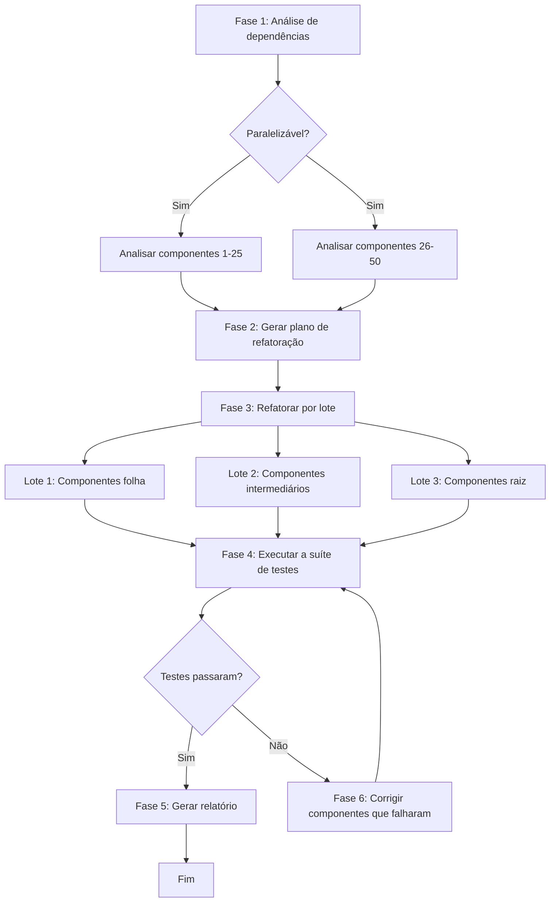

# Lição 6: Fluxos de trabalho do mundo real na prática

> Objetivos de aprendizado:
> - Combinar decomposição de tarefas, gerenciamento de estado e tratamento de erros para projetar fluxos de trabalho completos
> - Entender os padrões de fluxo de trabalho por trás de três cenários de nível de produção
> - Dominar técnicas de observabilidade e depuração de fluxos de trabalho
>
> Pré-requisitos: [Lição 5: Tratamento de erros e estratégias de retentativa](./05-error-handling-retry.md)

## Da teoria à prática

Ao longo das cinco primeiras lições, cobrimos os blocos de construção dos fluxos de trabalho: passos, estado, decomposição e tratamento de erros. Agora vamos juntá-los e construir três fluxos de trabalho de nível de produção tirados de cenários reais.

**Os três fluxos de trabalho desta lição:**

1. **Pipeline de refatoração de código**: refatorar código legado para padrões modernos, cobrindo análise, planejamento, execução, testes e verificação
2. **Pipeline de geração de documentação**: gerar automaticamente documentação de API a partir do código, cobrindo extração, geração de exemplos, renderização e publicação
3. **Fluxo de automação de testes**: um fluxo de trabalho de testes de ponta a ponta, cobrindo preparação de ambiente, testes em paralelo, agregação de resultados e geração de relatório

**Cada fluxo de trabalho mostra:**
- Uma decomposição completa da tarefa
- Gerenciamento de estado e design de checkpoints
- Estratégias de tratamento de erros e recuperação
- Suporte a observabilidade e depuração[^S20]

## Cenário 1: pipeline de refatoração de código

### Requisitos

Refatorar um projeto de front-end legado de 50 componentes, de componentes de classe para componentes de função + Hooks.

**Desafios:**
- Os componentes dependem uns dos outros, então você não pode refatorá-los em uma ordem arbitrária
- A refatoração pode quebrar comportamento, então ela precisa de verificação por testes
- 50 componentes não podem ser concluídos em uma única conversa; eles precisam de processamento em paralelo[^S21]

### Decomposição da tarefa

O fluxo de trabalho tem 6 fases. As duas primeiras podem processar componentes em paralelo; as fases seguintes rodam na ordem das dependências.



### Implementação completa

```javascript
// Definição do estado do fluxo de trabalho
const createInitialState = (components) => ({
  phase: 'init',
  input: { components, total: components.length },
  analysis: null,
  plan: null,
  refactored: [],
  testResults: null,
  errors: [],
  startTime: Date.now()
});

// Fluxo de trabalho principal
async function refactoringWorkflow(componentPaths) {
  const workflowId = `refactor-${Date.now()}`;
  const store = new WorkflowStateStore();
  
  // Carrega ou cria o estado
  let state = await store.load(workflowId) || 
              createInitialState(componentPaths);
  
  console.log(`🚀 Iniciando o fluxo de trabalho de refatoração (${state.input.total} componentes)`);
  
  try {
    // Fase 1: análise de dependências
    if (state.phase === 'init') {
      console.log('\n📊 Fase 1: Analisando as dependências dos componentes...');
      
      state.analysis = await analyzeComponentsInParallel(
        state.input.components
      );
      
      state.phase = 'analyzed';
      await store.save(workflowId, state);
      console.log(`✓ Análise concluída: ${state.analysis.dependencies.length} dependências encontradas`);
    }
    
    // Fase 2: gerar o plano de refatoração
    if (state.phase === 'analyzed') {
      console.log('\n📋 Fase 2: Gerando o plano de refatoração...');
      
      state.plan = await agent({
        task: 'Gerar plano de refatoração',
        prompt: `
          Com base na análise de dependências, produza a ordem de refatoração dos componentes:
          1. Refatore primeiro os componentes folha (aqueles que não dependem de outros componentes)
          2. Depois a camada intermediária (componentes que dependem dos já refatorados)
          3. Por fim, os componentes raiz
          
          Retorne JSON: {
            batches: [
              { name: "Componentes folha", components: [...] },
              { name: "Camada intermediária", components: [...] },
              { name: "Componentes raiz", components: [...] }
            ]
          }
        `,
        context: state.analysis
      });
      
      state.phase = 'planned';
      await store.save(workflowId, state);
      console.log(`✓ Plano gerado: ${state.plan.batches.length} lotes`);
    }
    
    // Fase 3: refatorar por lote
    if (state.phase === 'planned') {
      console.log('\n🔧 Fase 3: Executando a refatoração...');
      
      for (const batch of state.plan.batches) {
        console.log(`\n  Lote: ${batch.name} (${batch.components.length} componentes)`);
        
        // Refatora os componentes deste lote em paralelo
        const results = await Promise.allSettled(
          batch.components.map(async (component) => {
            return await retryWithBackoffAndJitter(
              async () => refactorComponent(component),
              3,
              2000
            );
          })
        );
        
        // Trata os resultados
        for (let i = 0; i < results.length; i++) {
          const result = results[i];
          const component = batch.components[i];
          
          if (result.status === 'fulfilled') {
            state.refactored.push({
              component,
              code: result.value,
              batch: batch.name
            });
          } else {
            state.errors.push({
              component,
              error: result.reason.message,
              batch: batch.name
            });
          }
        }
        
        // Salva um checkpoint depois que o lote termina
        await store.save(workflowId, state);
        console.log(`  ✓ ${batch.name} concluído`);
      }
      
      state.phase = 'refactored';
      await store.save(workflowId, state);
      console.log(`\n✓ Refatoração concluída: ${state.refactored.length}/${state.input.total}`);
    }
    
    // Fase 4: rodar os testes
    if (state.phase === 'refactored') {
      console.log('\n🧪 Fase 4: Executando a suíte de testes...');
      
      state.testResults = await runTestSuite({
        timeout: 300000,  // 5 minutos
        parallel: true
      });
      
      state.phase = 'tested';
      await store.save(workflowId, state);
      
      if (state.testResults.passed) {
        console.log(`✓ Testes passaram: ${state.testResults.passedCount}/${state.testResults.totalCount}`);
      } else {
        console.log(`✗ Testes falharam: ${state.testResults.failedTests.length} falhas`);
      }
    }
    
    // Fase 5: corrigir falhas (se necessário)
    if (state.phase === 'tested' && !state.testResults.passed) {
      console.log('\n🔨 Fase 5: Corrigindo os componentes que falharam...');
      
      const failedComponents = identifyFailedComponents(
        state.testResults,
        state.refactored
      );
      
      console.log(`  ${failedComponents.length} componentes precisam de correção`);
      
      for (const component of failedComponents) {
        try {
          const fixed = await agent({
            task: `Corrigir o componente ${component.name}`,
            prompt: `
              Os testes deste componente falharam depois da refatoração.
              Testes que falharam: ${component.failedTests.join(', ')}
              Mensagem de erro: ${component.errors.join('\n')}
              
              Diagnostique o problema e corrija o código.
            `,
            context: {
              originalCode: component.originalCode,
              refactoredCode: component.refactoredCode,
              tests: component.tests
            }
          });
          
          // Atualiza o resultado da refatoração
          const index = state.refactored.findIndex(r => r.component === component.path);
          state.refactored[index].code = fixed;
          
        } catch (error) {
          state.errors.push({
            component: component.path,
            error: `Correção falhou: ${error.message}`,
            phase: 'fix'
          });
        }
      }
      
      // Testa de novo
      state.phase = 'refactored';
      await store.save(workflowId, state);
      
      // Chama a si mesmo recursivamente (com um limite)
      state.fixAttempts = (state.fixAttempts || 0) + 1;
      if (state.fixAttempts < 3) {
        return await refactoringWorkflow(componentPaths);
      } else {
        console.log('✗ Testes ainda falhando depois de 3 tentativas de correção');
      }
    }
    
    // Fase 6: gerar o relatório
    if (state.phase === 'tested' && state.testResults.passed) {
      console.log('\n📄 Fase 6: Gerando o relatório de refatoração...');
      
      const report = await agent({
        task: 'Gerar relatório de refatoração',
        prompt: `
          Gere um relatório do projeto de refatoração, incluindo:
          - Estatísticas da refatoração (quantos componentes, distribuição por lote)
          - Resumo dos resultados de testes
          - Problemas encontrados e como foram resolvidos
          - Exemplos de comparação de código antes/depois
          
          Retorne Markdown.
        `,
        context: {
          total: state.input.total,
          refactored: state.refactored.length,
          batches: state.plan.batches.map(b => b.name),
          testResults: state.testResults,
          errors: state.errors,
          duration: Date.now() - state.startTime
        }
      });
      
      await fs.writeFile('refactoring-report.md', report);
      
      state.phase = 'completed';
      state.completedAt = Date.now();
      await store.save(workflowId, state);
      
      console.log('\n✅ Fluxo de trabalho de refatoração concluído!');
      console.log(`   Relatório salvo: refactoring-report.md`);
    }
    
    return state;
    
  } catch (error) {
    console.error('\n❌ Fluxo de trabalho falhou:', error.message);
    state.phase = 'failed';
    state.error = error.message;
    await store.save(workflowId, state);
    throw error;
  }
}

// Auxiliar: analisa componentes em paralelo
async function analyzeComponentsInParallel(components) {
  const analyses = await Promise.all(
    components.map(async (path) => {
      return await agent({
        task: `Analisar ${path}`,
        prompt: `
          Analise este componente:
          1. Se é um componente de classe ou de função
          2. De quais outros componentes ele depende (instruções import)
          3. Quais métodos de ciclo de vida ou hooks ele usa
          
          Retorne JSON: { type, dependencies: [], hooks: [] }
        `,
        context: { file: await fs.readFile(path, 'utf-8') }
      });
    })
  );
  
  // Constrói o grafo de dependências
  const dependencies = [];
  for (let i = 0; i < components.length; i++) {
    const component = components[i];
    const analysis = analyses[i];
    
    for (const dep of analysis.dependencies) {
      dependencies.push({ from: component, to: dep });
    }
  }
  
  return { components: analyses, dependencies };
}

// Auxiliar: refatora um único componente
async function refactorComponent(componentPath) {
  return await agent({
    task: `Refatorar ${componentPath}`,
    prompt: `
      Refatore este componente de classe para um componente de função + Hooks:
      1. Remova a classe e o constructor
      2. Substitua state por useState
      3. Substitua os métodos de ciclo de vida por useEffect
      4. Mantenha a mesma interface de props e o mesmo comportamento
      
      Retorne o código refatorado completo.
    `,
    context: {
      code: await fs.readFile(componentPath, 'utf-8')
    }
  });
}
```

### Pontos centrais do design

**1. Estratégia de checkpoint**: salvar depois que cada lote termina, para que você nunca refatore de novo o que já foi feito

**2. Execução em paralelo**: componentes do mesmo lote podem ser refatorados em paralelo (eles não dependem uns dos outros)

**3. Mecanismo de retentativa**: a falha de um componente não afeta os outros; use `Promise.allSettled` para coletar todos os resultados

**4. Loop de correção**: em caso de falha nos testes, tenta corrigir automaticamente, até 3 vezes

**5. Observabilidade**: cada fase registra logs claros, e o estado é persistido em armazenamento externo[^S22]

## Cenário 2: pipeline de geração de documentação

### Requisitos

Gerar documentação de API completa para um serviço com 30 endpoints REST, incluindo descrições dos endpoints, exemplos de requisição/resposta e explicações dos códigos de erro.

### Decomposição da tarefa (padrão fan-out/agregação)

```javascript
async function apiDocGenerationWorkflow(servicePath) {
  console.log('📚 Fluxo de trabalho de geração de documentação de API');
  
  // Passo 1: extrair todos os endpoints
  console.log('\n1️⃣ Extraindo os endpoints da API...');
  const endpoints = await extractAPIEndpoints(servicePath);
  console.log(`   ${endpoints.length} endpoints encontrados`);
  
  // Passo 2: gerar a documentação de cada endpoint em paralelo
  console.log('\n2️⃣ Gerando a documentação dos endpoints (em paralelo)...');
  const docs = await Promise.all(
    endpoints.map(async (endpoint, index) => {
      console.log(`   [${index + 1}/${endpoints.length}] ${endpoint.method} ${endpoint.path}`);
      
      return await agent({
        task: `Gerar documentação para ${endpoint.method} ${endpoint.path}`,
        prompt: `
          Gere a documentação deste endpoint de API:
          
          ## ${endpoint.method} ${endpoint.path}
          
          Inclua:
          1. Descrição (um parágrafo)
          2. Parâmetros da requisição (path params, query params, body)
          3. Exemplos de requisição (curl e JavaScript)
          4. Exemplos de resposta (sucesso e erros comuns)
          5. Explicações dos códigos de erro
          
          Retorne Markdown.
        `,
        context: {
          code: endpoint.handlerCode,
          schema: endpoint.schema,
          examples: endpoint.existingTests || []
        }
      });
    })
  );
  
  // Passo 3: gerar um sumário e uma visão geral
  console.log('\n3️⃣ Gerando o sumário da documentação...');
  const toc = await agent({
    task: 'Gerar sumário da documentação',
    prompt: `
      Gere um sumário para estes endpoints de API:
      - Agrupe por função (gestão de usuários, gestão de pedidos, etc.)
      - Liste os endpoints sob cada grupo (com links âncora)
      - Gere uma visão geral do serviço (um parágrafo sobre o que este serviço faz)
      
      Retorne Markdown.
    `,
    context: {
      endpoints: endpoints.map(e => ({ method: e.method, path: e.path, summary: e.summary }))
    }
  });
  
  // Passo 4: montar o documento completo
  console.log('\n4️⃣ Montando o documento completo...');
  const fullDoc = [
    '# Documentação da API\n',
    toc,
    '\n---\n',
    ...docs.map((doc, i) => `\n## ${endpoints[i].method} ${endpoints[i].path}\n\n${doc}`)
  ].join('\n');
  
  // Passo 5: salvar e publicar
  console.log('\n5️⃣ Salvando o documento...');
  await fs.writeFile('api-docs.md', fullDoc);
  
  console.log('\n✅ Documentação gerada!');
  console.log(`   Arquivo: api-docs.md`);
  console.log(`   Endpoints: ${endpoints.length}`);
  
  return { endpoints: endpoints.length, outputFile: 'api-docs.md' };
}
```

**Características centrais:**
- **Padrão fan-out/agregação**: 30 endpoints geram documentação em paralelo, e no fim tudo é agregado
- **Sem estado**: a tarefa é rápida o bastante (< 10 minutos) para não precisar de checkpoints
- **Idempotente**: você pode rodar de novo a qualquer momento e sobrescrever o arquivo de saída[^S20]

## Cenário 3: fluxo de automação de testes

### Requisitos

Rodar testes de ponta a ponta em vários ambientes (local, staging, produção), coletar resultados de testes e métricas de desempenho, e gerar um relatório comparativo.

### Implementação completa

```javascript
async function e2eTestingWorkflow(config) {
  const workflowId = `e2e-test-${Date.now()}`;
  const state = {
    environments: config.environments,  // ['local', 'staging', 'production']
    results: {},
    phase: 'init',
    startTime: Date.now()
  };
  
  console.log(`🧪 Fluxo de trabalho de testes E2E (${state.environments.length} ambientes)`);
  
  try {
    // Fase 1: preparar os ambientes
    console.log('\n1️⃣ Preparando os ambientes de teste...');
    for (const env of state.environments) {
      console.log(`   Configurando o ambiente ${env}...`);
      await setupTestEnvironment(env);
    }
    state.phase = 'environments_ready';
    
    // Fase 2: rodar os testes em todos os ambientes em paralelo
    console.log('\n2️⃣ Executando os testes (em paralelo)...');
    const testPromises = state.environments.map(async (env) => {
      console.log(`   [${env}] Iniciando os testes...`);
      
      try {
        const result = await runTestsWithRetry(env, {
          maxRetries: 2,
          testSuites: config.testSuites,
          timeout: 600000  // 10 minutos
        });
        
        console.log(`   [${env}] ✓ Concluído: ${result.passed}/${result.total} passaram`);
        return { env, result, status: 'success' };
        
      } catch (error) {
        console.log(`   [${env}] ✗ Falhou: ${error.message}`);
        return { env, error: error.message, status: 'failed' };
      }
    });
    
    const testResults = await Promise.all(testPromises);
    
    // Salva os resultados no estado
    for (const { env, result, error, status } of testResults) {
      state.results[env] = status === 'success' ? result : { error };
    }
    
    state.phase = 'tests_completed';
    
    // Fase 3: gerar o relatório comparativo
    console.log('\n3️⃣ Gerando o relatório de testes...');
    const report = await agent({
      task: 'Gerar relatório comparativo de testes entre ambientes',
      prompt: `
        Gere um relatório comparativo de testes entre ambientes:
        
        Dimensões de comparação:
        1. Taxa de aprovação (por ambiente)
        2. Métricas de desempenho (tempo médio de resposta, P95, P99)
        3. Análise dos casos que falharam (quais casos falham em quais ambientes)
        4. Problemas de diferença entre ambientes (casos que falham só em um ambiente específico)
        
        Retorne Markdown, com tabelas e descrições de gráficos.
      `,
      context: state.results
    });
    
    await fs.writeFile('e2e-test-report.md', report);
    
    // Fase 4: se houver falhas, gerar sugestões de correção
    const failedEnvs = Object.entries(state.results)
      .filter(([env, result]) => result.error || result.failedCount > 0);
    
    if (failedEnvs.length > 0) {
      console.log('\n4️⃣ Gerando a análise das falhas...');
      
      for (const [env, result] of failedEnvs) {
        const analysis = await agent({
          task: `Analisar as falhas no ambiente ${env}`,
          prompt: `
            Diagnostique as falhas de teste e forneça sugestões de correção:
            
            Testes que falharam: ${result.failedTests?.map(t => t.name).join(', ')}
            Mensagens de erro: ${result.failedTests?.map(t => t.error).join('\n')}
            
            Causas possíveis:
            - Problemas de configuração do ambiente
            - Inconsistência de dados
            - Testes dependentes de tempo
            - Problemas de rede
            
            Retorne sugestões de correção (Markdown).
          `,
          context: { env, result }
        });
        
        await fs.writeFile(`fix-${env}.md`, analysis);
        console.log(`   Análise das falhas de ${env} salva: fix-${env}.md`);
      }
    }
    
    state.phase = 'completed';
    state.completedAt = Date.now();
    
    console.log('\n✅ Fluxo de trabalho de testes concluído!');
    console.log(`   Relatório: e2e-test-report.md`);
    console.log(`   Tempo total: ${((state.completedAt - state.startTime) / 1000).toFixed(1)}s`);
    
    return state;
    
  } catch (error) {
    console.error('\n❌ Fluxo de trabalho falhou:', error);
    throw error;
  }
}

// Auxiliar: roda os testes com retentativa
async function runTestsWithRetry(env, options) {
  const { maxRetries, testSuites, timeout } = options;
  
  for (let attempt = 1; attempt <= maxRetries + 1; attempt++) {
    try {
      const result = await runTests(env, testSuites, timeout);
      return result;
      
    } catch (error) {
      if (attempt <= maxRetries) {
        console.log(`   [${env}] Retentativa ${attempt}/${maxRetries}...`);
        await sleep(5000 * attempt);  // atraso crescente
      } else {
        throw error;
      }
    }
  }
}
```

**Características centrais:**
- **Testes em paralelo**: vários ambientes rodam seus testes ao mesmo tempo, cortando drasticamente o tempo total
- **Tolerância a falhas**: a falha de um ambiente não afeta os outros
- **Retentativa inteligente**: testes que falham repetem automaticamente (quedas de rede e falhas transitórias são comuns)
- **Análise de falhas**: sugestões de correção para as falhas são geradas automaticamente[^S20]

## Observabilidade de fluxos de trabalho

**Um bom fluxo de trabalho deve conseguir responder, a qualquer momento:**

- Quanto ele já avançou? (X/Y concluídos)
- Quanto tempo mais ele provavelmente vai levar?
- Que erros ele encontrou?
- Onde estão os gargalos de desempenho?

Se você não consegue responder a essas perguntas, seus logs e seu acompanhamento de estado não estão detalhados o suficiente. Depurar um fluxo de trabalho se apoia nesses registros, não em adivinhação.

### Implementando a observabilidade

```javascript
class ObservableWorkflow {
  constructor(name, totalSteps) {
    this.name = name;
    this.totalSteps = totalSteps;
    this.currentStep = 0;
    this.startTime = Date.now();
    this.stepTimes = [];
    this.errors = [];
  }
  
  async step(name, fn) {
    this.currentStep++;
    const stepNum = this.currentStep;
    const progress = ((stepNum / this.totalSteps) * 100).toFixed(1);
    
    console.log(`\n[${this.name}] Passo ${stepNum}/${this.totalSteps} (${progress}%): ${name}`);
    
    const stepStart = Date.now();
    
    try {
      const result = await fn();
      const duration = Date.now() - stepStart;
      this.stepTimes.push({ name, duration });
      
      console.log(`  ✓ Concluído (${(duration / 1000).toFixed(1)}s)`);
      
      return result;
      
    } catch (error) {
      const duration = Date.now() - stepStart;
      this.errors.push({ step: name, error: error.message, duration });
      
      console.log(`  ✗ Falhou: ${error.message}`);
      throw error;
    }
  }
  
  summary() {
    const totalDuration = Date.now() - this.startTime;
    const avgStepTime = this.stepTimes.reduce((sum, s) => sum + s.duration, 0) / this.stepTimes.length;
    
    console.log(`\n━━━ resumo de ${this.name} ━━━`);
    console.log(`Tempo total: ${(totalDuration / 1000).toFixed(1)}s`);
    console.log(`Passos: ${this.currentStep}/${this.totalSteps}`);
    console.log(`Média por passo: ${(avgStepTime / 1000).toFixed(1)}s`);
    
    if (this.errors.length > 0) {
      console.log(`\nErros (${this.errors.length}):`);
      for (const err of this.errors) {
        console.log(`  - ${err.step}: ${err.error}`);
      }
    }
    
    console.log(`\nPassos mais lentos:`);
    const sorted = [...this.stepTimes].sort((a, b) => b.duration - a.duration);
    for (const step of sorted.slice(0, 3)) {
      console.log(`  - ${step.name}: ${(step.duration / 1000).toFixed(1)}s`);
    }
  }
}

// Exemplo de uso
async function myWorkflow() {
  const wf = new ObservableWorkflow('Refatoração de código', 5);
  
  await wf.step('Analisar dependências', async () => {
    return await analyzeDependencies();
  });
  
  await wf.step('Gerar plano', async () => {
    return await generatePlan();
  });
  
  // ...
  
  wf.summary();
}
```

Aquele trecho dentro de `summary()` que ordena por duração e imprime apenas os três passos mais lentos é a forma mais simples de profiling de desempenho: meça quanto tempo cada passo levou e depois encontre o gargalo a partir dos dados, em vez de adivinhar qual passo é lento.

<!-- exercises -->


## 💻 Exercícios

### Nível 1: Projete seu próprio fluxo de trabalho

Escolha uma tarefa real do seu próprio trabalho e projete um fluxo de trabalho completo para ela.

**Requisitos:**
1. Descreva a tarefa (2-3 frases)
2. Desenhe o diagrama do fluxo de trabalho (fases, ramificações, passos em paralelo)
3. Liste os campos de estado (pelo menos 5)
4. Explique onde você colocaria checkpoints
5. Liste os erros possíveis e como você os trataria

<!-- rubric -->
A descrição da tarefa é clara; o diagrama do fluxo de trabalho tem pelo menos 4 fases e pelo menos 1 ramificação ou ponto de paralelismo; o design do estado é sólido (inclui um marcador de fase, progresso, resultados, erros); o posicionamento dos checkpoints é razoável (depois de operações caras, antes de operações irreversíveis); pelo menos 3 tipos de erro são identificados com estratégias de tratamento.

<!-- answer -->
(Exemplo omitido; ele deve ser projetado em torno do cenário de trabalho de quem está aprendendo.)

<!-- hint -->
Comece por uma tarefa repetitiva que recentemente tomou mais de 2 horas do seu tempo e pense em quais poucos passos grandes ela se dividiria se você a entregasse a um agente.

<!-- hint -->
Um bom fluxo de trabalho normalmente tem entradas claras (arquivos, configuração, dados) e saídas claras (um relatório, código modificado, um resultado de deploy). Trabalhe de trás para frente a partir da entrada e da saída para descobrir de quais transformações você precisa no meio.

### Nível 2: Depure um fluxo de trabalho que falha

Um fluxo de trabalho de “processamento de imagens em lote” falha na 47ª imagem, com a mensagem de erro `Error: EMFILE: too many open files`.

**Perguntas:**
1. Que tipo de erro é este (transitório/permanente)?
2. Por que ele falha na 47ª imagem em vez da 1ª?
3. Como você deveria corrigir o fluxo de trabalho? (Dê sugestões de mudança no código.)

<!-- rubric -->
Identifica corretamente o tipo de erro (um erro transitório de esgotamento de recursos, mas com causa raiz no design do código); entende a causa (arquivos demais abertos em paralelo, ultrapassando o limite do sistema); apresenta uma correção razoável (limitar a concorrência, fechar os arquivos assim que processados, usar streaming).

<!-- answer -->
(1) Este é um erro transitório (esgotamento de recursos), mas a causa raiz é um problema de código. (2) O fluxo de trabalho provavelmente usa `Promise.all(images.map(...))` para processar todas as imagens em paralelo; cada imagem abre um descritor de arquivo e, na 47ª, ultrapassa o limite do sistema (normalmente 1024 ou 4096). (3) Correção: limitar a concorrência, processando apenas 10 imagens por vez e esperando entre os lotes. Código: `for (let i = 0; i < images.length; i += 10) { const batch = images.slice(i, i + 10); await Promise.all(batch.map(processImage)); }`. Ou usar streaming e fechar cada arquivo assim que ele for processado.

<!-- hint -->
O erro EMFILE significa que há arquivos demais abertos. Pense se o fluxo de trabalho abre as 100 imagens de uma vez ou se fecha uma antes de abrir a próxima.

<!-- hint -->
Se você processa 100 arquivos em paralelo com `Promise.all(array.map(...))`, você abre 100 descritores de arquivo de uma vez. A correção é limitar a concorrência (por exemplo, processar apenas 10 por vez).

<!-- /exercises -->

---

**Parabéns por concluir o curso de Design de Fluxos de Trabalho com Agentes.**

Agora você domina:
- Os conceitos centrais dos fluxos de trabalho e onde eles se encaixam
- As três estratégias de decomposição de tarefas
- Gerenciamento de estado e o mecanismo de checkpoint
- Tratamento de erros e estratégias de retentativa
- Três fluxos de trabalho de nível de produção tirados de cenários reais

**Próximos passos:**
1. Pratique um fluxo de trabalho simples (< 5 passos) em um dos seus projetos
2. Acrescente complexidade aos poucos (paralelismo, checkpoints, tratamento de erros)
3. Compartilhe o design do seu fluxo de trabalho e receba feedback da comunidade
4. Explore tópicos mais avançados (fluxos de trabalho distribuídos, frameworks de orquestração de fluxos de trabalho, editores visuais de fluxos de trabalho)
