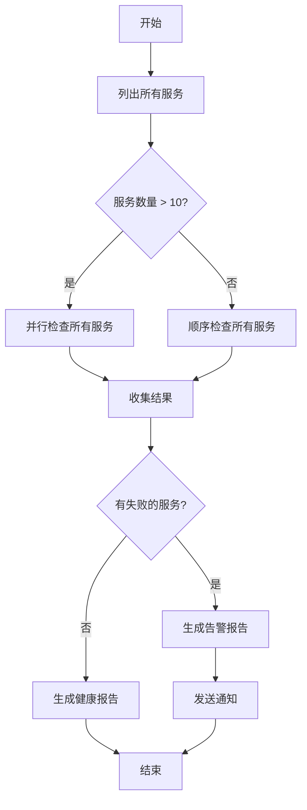

# 第 2 课：工作流的基本组成：步骤、状态、分支、循环

> 学习目标：
> - 掌握工作流的四个核心构建块
> - 理解步骤间的依赖关系和数据传递
> - 学会设计工作流的执行流程图
>
> 前置要求：[第 1 课：从单次对话到工作流](./01-from-conversation-to-workflow.md) | 下一课 [第 3 课 >>](./03-task-decomposition.md)

## 工作流不是魔法，是组合

上一课我们看到工作流可以协调数十个代理完成复杂任务。但如果你打开一个工作流脚本，会发现它只是普通的代码：函数、循环、条件判断。

**工作流的威力来自四个简单构建块的组合：**

1. **步骤(Steps)** — 工作的基本单元
2. **状态(State)** — 步骤间共享的数据
3. **分支(Branches)** — 根据条件选择路径
4. **循环(Loops)** — 重复执行相似操作

理解这四个构建块，你就能设计任何复杂度的工作流。[^S4]

## 构建块 1：步骤

**步骤是工作流的原子操作。**每个步骤要么是一个 Agent 调用，要么是一个确定性函数。[^S5]

### Agent 步骤 vs 函数步骤

```javascript
// Agent 步骤：让 LLM 做需要推理的工作
const summary = await agent({
  task: '总结代码审查发现',
  prompt: '从这些审查结果中提取关键问题，按严重性排序',
  context: reviews
});

// 函数步骤：确定性转换，不需要 LLM
const filtered = reviews.filter(r => r.severity === 'high');
const count = filtered.length;
```

**什么时候用 Agent 步骤:**
- 需要理解模糊输入(自然语言、非结构化数据)
- 需要生成创意内容(文档、代码、解释)
- 需要做判断(这段代码有没有安全问题？)

**什么时候用函数步骤:**
- 数据转换(过滤、排序、格式化)
- 数学计算(统计、聚合)
- 条件判断(if-else 逻辑)
- 文件操作(读取、写入、移动)

**最佳实践：** Agent 步骤做推理，函数步骤做计算。不要让 LLM 做简单的数组过滤或数字求和，这既慢又贵还不稳定。[^S5]

### 步骤的输入输出契约

每个步骤应该有清晰的输入输出契约：

```javascript
// 好的步骤：输入输出明确
async function analyzeFile(filePath) {
  // 输入：文件路径(字符串)
  const result = await agent({
    task: `分析 ${filePath}`,
    prompt: '返回 JSON: { complexity: number, issues: string[] }'
  });
  // 输出：{ complexity, issues }
  return JSON.parse(result);
}

// 不好的步骤：输入输出模糊
async function doStuff(data) {
  // data 是什么格式？返回什么？不清楚
  return await agent({ task: '处理数据', context: data });
}
```

**清晰的契约让工作流易于理解和调试。**当第 5 步出错，你能立即看出是因为第 4 步的输出格式不对。[^S6]

## 构建块 2：状态

**状态是步骤间共享的数据。**它像工作流的内存，保存中间结果和执行进度。[^S11]

### 两种状态类型

**工作流状态(Workflow State):**
- 当前任务的所有信息：做到哪一步、每步的结果、下一步需要什么
- 存储在脚本变量或外部数据库中
- 跨步骤传递，但不跨会话

**会话状态(Session State):**
- 用户的对话历史、偏好设置
- 这是 Agent 自己管理的，工作流不需要关心[^S11]

```javascript
// 工作流状态示例
const workflowState = {
  phase: 'analysis',           // 当前阶段
  filesAnalyzed: 47,          // 进度
  issues: [],                 // 累积的结果
  nextAction: 'generate-plan' // 下一步
};
```

### 状态管理模式

**模式 1：脚本变量(适合短工作流)**

```javascript
async function shortWorkflow() {
  // 状态就是普通变量
  let files = await listFiles();
  let analysis = await analyzeFiles(files);
  let report = await generateReport(analysis);
  return report;
}
```

**模式 2：状态对象(适合中等复杂度)**

```javascript
async function mediumWorkflow() {
  const state = {
    input: await getInput(),
    processed: [],
    errors: []
  };
  
  for (const item of state.input) {
    try {
      const result = await processItem(item);
      state.processed.push(result);
    } catch (err) {
      state.errors.push({ item, error: err });
    }
  }
  
  return state;
}
```

**模式 3：外部存储(适合长时间运行的工作流)**

```javascript
async function longWorkflow(taskId) {
  // 状态存在数据库，随时可恢复
  let state = await db.loadState(taskId);
  
  if (state.phase === 'completed') return state.result;
  
  // 从上次中断的地方继续
  if (state.phase === 'analysis') {
    state.analysisResult = await runAnalysis();
    state.phase = 'planning';
    await db.saveState(taskId, state);
  }
  
  if (state.phase === 'planning') {
    state.plan = await generatePlan(state.analysisResult);
    state.phase = 'execution';
    await db.saveState(taskId, state);
  }
  
  // ...
}
```

**检查点(Checkpointing):** 在关键步骤后保存状态，这样工作流可以从失败点恢复，而不是从头开始。[^S12]

## 构建块 3：分支

**分支根据条件选择不同的执行路径。**[^S2]

### 简单分支

```javascript
const fileCount = files.length;

if (fileCount < 10) {
  // 文件少，顺序处理
  for (const file of files) {
    await processFile(file);
  }
} else {
  // 文件多，并行处理
  await Promise.all(files.map(f => processFile(f)));
}
```

### 基于 Agent 决策的分支

```javascript
// Agent 评估复杂性
const assessment = await agent({
  task: '评估重构复杂度',
  prompt: '返回 JSON: { complexity: "low" | "medium" | "high" }'
});

const parsed = JSON.parse(assessment);

if (parsed.complexity === 'low') {
  // 自动重构
  await autoRefactor();
} else if (parsed.complexity === 'medium') {
  // 生成方案，等待人工确认
  const plan = await generatePlan();
  await waitForApproval(plan);
  await executeRefactor(plan);
} else {
  // 复杂度高，仅生成建议
  await generateRecommendations();
}
```

### 错误处理分支

```javascript
for (const service of services) {
  try {
    await deployService(service);
  } catch (error) {
    if (error.type === 'transient') {
      // 瞬态错误，重试
      await retry(() => deployService(service));
    } else {
      // 永久错误，回滚
      await rollback(service);
      throw error;
    }
  }
}
```

```agentmentor-check
{
  "id": "workflows-zh-02-branching-logic",
  "label": "判断分支逻辑的设计合理性",
  "prompt": "一个代码审查工作流需要根据发现的问题数量决定下一步：0 个问题 → 自动合并；1-3 个问题 → 通知作者修复；4+ 个问题 → 拒绝 PR 并生成详细报告。这个分支逻辑应该由 Agent 还是脚本的 if-else 实现？",
  "whyHere": "刚学完 Agent 步骤 vs 函数步骤、以及分支的实现方式，需要检查学习者能否判断什么时候用确定性分支(脚本)、什么时候用 Agent 决策分支",
  "mode": "single",
  "choices": [
    {
      "id": "a",
      "text": "由 Agent 判断，因为需要理解问题的严重性",
      "correct": false,
      "feedback": "不对。问题数量是明确的数字(0, 1-3, 4+)，不需要 Agent 理解或判断。严重性评估应该在前面的步骤完成，分支逻辑只需要根据明确的数字做 if-else 判断，用脚本更快、更可靠、更可预测。"
    },
    {
      "id": "b",
      "text": "由脚本的 if-else 实现，因为判断条件是明确的数字比较",
      "correct": true,
      "feedback": "正确。分支条件是确定性的(问题数量是 0、1-3 还是 4+)，不需要推理或理解，用 if-else 实现更快、成本更低、行为完全可预测。Agent 应该专注于做推理性工作(如判断问题是否真的是问题)，而不是简单的数字比较。"
    }
  ]
}
```

## 构建块 4：循环

**循环让你对多个相似对象执行相同操作。**这是工作流威力的核心来源。[^S2]

### 顺序循环

```javascript
// 一个接一个处理
for (const pr of pullRequests) {
  const review = await reviewPR(pr);
  await postComment(pr, review);
}
```

### 并行循环

```javascript
// 同时处理所有
const reviews = await Promise.all(
  pullRequests.map(pr => reviewPR(pr))
);

// 并行但限制并发数(避免过载)
const limit = 5;
for (let i = 0; i < pullRequests.length; i += limit) {
  const batch = pullRequests.slice(i, i + limit);
  await Promise.all(batch.map(pr => reviewPR(pr)));
}
```

这里的 `limit = 5` 就是并发限制:一次最多同时跑 5 个，而不是一口气 `Promise.all` 全部 100 个，避免打开太多连接或文件句柄。

### 带累积的循环

```javascript
let totalIssues = 0;
const reports = [];

for (const file of files) {
  const analysis = await analyzeFile(file);
  totalIssues += analysis.issueCount;
  reports.push({
    file: file.path,
    issues: analysis.issues
  });
}

console.log(`总共发现 ${totalIssues} 个问题`);
```

### 条件终止的循环

```javascript
let attempts = 0;
let success = false;

while (!success && attempts < 3) {
  try {
    await runTests();
    success = true;
  } catch (error) {
    attempts++;
    console.log(`测试失败，重试 ${attempts}/3`);
    await wait(1000 * attempts); // 线性退避(1s, 2s, 3s)
  }
}

if (!success) throw new Error('测试 3 次均失败');
```

## 组合构建块：一个完整工作流

让我们组合这四个构建块，设计一个"微服务健康检查"工作流：



对应的脚本：

```javascript
async function healthCheckWorkflow() {
  // 步骤 1: 获取服务列表(函数步骤)
  const services = await listServices();
  
  // 状态：保存结果
  const state = {
    total: services.length,
    healthy: [],
    unhealthy: []
  };
  
  // 分支：根据数量选择策略
  let results;
  if (services.length > 10) {
    // 并行循环
    results = await Promise.all(
      services.map(s => checkServiceHealth(s))
    );
  } else {
    // 顺序循环
    results = [];
    for (const service of services) {
      results.push(await checkServiceHealth(service));
    }
  }
  
  // 函数步骤：分类结果
  for (const result of results) {
    if (result.healthy) {
      state.healthy.push(result);
    } else {
      state.unhealthy.push(result);
    }
  }
  
  // 分支：根据结果生成不同报告
  if (state.unhealthy.length > 0) {
    // Agent 步骤：生成告警
    const alert = await agent({
      task: '生成告警报告',
      prompt: `${state.unhealthy.length} 个服务不健康，
               生成详细的故障报告和建议的修复步骤`,
      context: state.unhealthy
    });
    await sendAlert(alert);
  } else {
    // Agent 步骤：生成健康报告
    const report = await agent({
      task: '生成健康报告',
      prompt: `所有 ${state.total} 个服务健康，
               生成简洁的状态总结`
    });
    await logReport(report);
  }
  
  return state;
}
```

**这个工作流用到了所有四个构建块:**
- **步骤**: `listServices`、`checkServiceHealth`、`agent()` 调用
- **状态**: `state` 对象保存总数、健康/不健康列表
- **分支**: 根据服务数量选择并行/顺序、根据健康状况选择报告类型
- **循环**: `map` 并行循环、`for` 顺序循环

## 设计工作流的思维模式

**从终点倒推:**

1. 最终输出是什么？(报告、已部署的服务、清理过的代码)
2. 最后一步需要什么输入？(汇总的数据、验证通过的结果)
3. 那个输入从哪里来？(上一步的输出)
4. 重复直到到达起点(用户输入或文件系统)

**识别并行机会:**

- 如果多个步骤不互相依赖，可以并行执行
- "对每个 X 做 Y" 通常可以并行
- 并行能将 10 个 5 分钟的任务从 50 分钟降到 5 分钟

**明确依赖关系:**

```javascript
// 依赖关系示例
const files = await readFiles();      // 步骤 1
const analysis = await analyze(files); // 步骤 2 依赖步骤 1
const plan = await makePlan(analysis); // 步骤 3 依赖步骤 2

// 可以并行(无依赖)
const [files, config, users] = await Promise.all([
  readFiles(),
  loadConfig(),
  fetchUsers()
]);
```

<!-- exercises -->


## 练习

### Level 1: 设计一个简单工作流

任务：设计一个"批量图片处理"工作流，输入是 50 张图片，需要：(1) 调整大小到 800x600，(2) 添加水印，(3) 转换为 WebP 格式。

**要求:**
- 画出流程图(用文字描述也可以，如 A → B → C)
- 说明哪些步骤用函数、哪些用 Agent
- 说明哪里可以并行执行
- 写出伪代码的核心部分(循环和分支)

<!-- rubric -->
流程图清晰(至少包含输入、处理循环、输出三个节点)；正确识别所有步骤都是函数步骤(不需要 Agent，因为图片处理是确定性操作)；识别出可以并行处理 50 张图片(每张独立)；伪代码包含并行循环(`Promise.all`)

<!-- answer -->
流程图: 开始 → 读取 50 张图片 → 并行处理每张图片(调整大小 → 添加水印 → 转换格式) → 保存结果 → 结束。所有步骤都用函数(图片处理库)，不需要 Agent。可以并行处理所有 50 张图片，因为每张图片的处理不依赖其他图片。伪代码: `const results = await Promise.all(images.map(async img => { const resized = await resize(img, 800, 600); const watermarked = await addWatermark(resized); return await convertToWebP(watermarked); }));`

<!-- hint -->
图片处理(调整大小、添加水印、格式转换)是确定性操作，不需要理解或推理，所以都是函数步骤。

<!-- hint -->
问自己：处理第 10 张图片时，需要知道第 9 张图片的处理结果吗？如果不需要，就可以并行。

### Level 2: 识别状态管理需求

一个"代码库迁移"工作流需要：(1) 扫描 200 个文件找出需要迁移的 API 调用，(2) 并行迁移所有文件，(3) 运行测试，(4) 如果测试失败，回滚所有更改。

**问题:**
1. 这个工作流需要保存哪些状态？列出至少 3 个状态字段
2. 哪个步骤后应该设置检查点？为什么？
3. 如果步骤 3(运行测试)失败，工作流需要哪些状态信息才能正确回滚？

<!-- rubric -->
正确识别至少 3 个关键状态(如: 需要迁移的文件列表、已迁移的文件列表、每个文件的原始内容备份、测试结果)；指出步骤 2(迁移完成)后应设置检查点，理由合理(如: 迁移是耗时操作，检查点避免重跑)；识别回滚需要的状态(文件列表 + 原始内容备份)

<!-- answer -->
(1) 状态字段: `filesToMigrate`(需要迁移的文件列表)、`migratedFiles`(已完成迁移的文件及其新内容)、`backups`(每个文件的原始内容备份)、`testResult`(测试是否通过)。(2) 步骤 2 后应设置检查点，因为迁移 200 个文件耗时长，如果测试阶段崩溃，不希望重新迁移所有文件。(3) 回滚需要 `migratedFiles`(知道改了哪些文件)和 `backups`(知道如何恢复)，用备份内容覆盖迁移后的文件。

<!-- hint -->
状态通常包括：输入数据、中间结果、执行进度、错误信息。每个对于「恢复执行」或「撤销操作」重要的信息都应该保存。

<!-- hint -->
检查点设在「耗时操作完成后」或「不可逆操作之前」。这个工作流的迁移是耗时操作，回滚是不可逆操作(需要知道改了什么才能撤销)。

<!-- /exercises -->

---

**下一课:** [第 3 课:如何拆解复杂任务](./03-task-decomposition.md) — 学习将复杂任务系统化拆解为工作流步骤的策略
