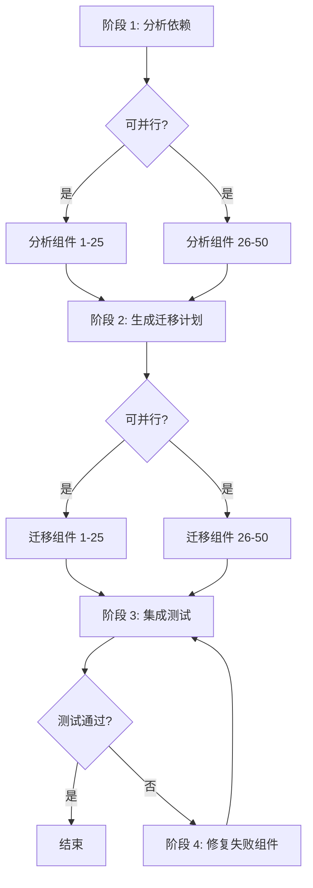

# 第 3 课：如何拆解复杂任务为工作流

> 学习目标：
> - 掌握任务分解的三种策略
> - 识别任务间的依赖关系
> - 将分解结果转化为可执行的工作流
>
> 前置要求：[第 2 课：工作流的基本组成](./02-workflow-building-blocks.md) | 下一课 [第 4 课 >>](./04-state-and-context.md)

## 从"不知道怎么开始"到清晰的步骤

你接到任务："将我们的单体 Rails 应用拆分成微服务架构"。这是个复杂任务。你不知道从哪里开始、有多少步骤、每步做什么。

**任务分解(Task Decomposition)就是把这种模糊的大任务，拆解成清晰的小步骤。**[^S16]

好的分解有三个标准:

1. **每个子任务足够小**，可以在一个 Agent 调用或函数中完成
2. **子任务间的依赖关系明确**，知道哪些必须顺序执行、哪些可以并行
3. **子任务的输入输出清晰**，上一步的输出能直接作为下一步的输入

分解得好，工作流写起来就像拼乐高。分解得不好，你会在执行时发现步骤遗漏、顺序错乱、数据传不下去。[^S17]

## 策略 1：顺序分解(Sequential Decomposition)

**适用场景:** 任务有明显的先后顺序，每步依赖前一步的结果。

**方法:** 从终点倒推，问"这一步需要什么输入？那个输入从哪里来？"

### 示例：生成技术文档

**任务:** 为一个 API 生成用户文档

**倒推分解:**

```
最终输出: Markdown 文档
  ↑ 需要什么？
步骤 4: 生成 Markdown(需要：结构化的文档内容)
  ↑ 从哪里来？
步骤 3: 组织内容(需要：端点列表 + 示例代码 + 说明)
  ↑ 从哪里来？
步骤 2: 为每个端点生成示例(需要：端点列表)
  ↑ 从哪里来？
步骤 1: 从代码提取端点列表(需要：源代码)
  ↑
起点: 源代码目录
```

**转化为工作流:**

```javascript
async function generateAPIDocsWorkflow(sourceDir) {
  // 步骤 1: 提取端点
  const endpoints = await extractEndpoints(sourceDir);
  
  // 步骤 2: 生成示例(依赖步骤 1)
  const examples = await Promise.all(
    endpoints.map(ep => generateExample(ep))
  );
  
  // 步骤 3: 组织内容(依赖步骤 1 和 2)
  const content = await agent({
    task: '组织文档结构',
    prompt: '将端点和示例组织成用户友好的文档结构',
    context: { endpoints, examples }
  });
  
  // 步骤 4: 生成 Markdown(依赖步骤 3)
  const markdown = await renderMarkdown(content);
  
  return markdown;
}
```

**依赖链:**
```
步骤 1 → 步骤 2
   ↓         ↓
   └─→ 步骤 3 → 步骤 4
```

步骤 2 可以和步骤 1 并行吗？不能，因为步骤 2 需要步骤 1 的 `endpoints`。

步骤 3 可以和步骤 2 并行吗？不能，因为步骤 3 需要步骤 2 的 `examples`。

**顺序分解的特点:** 依赖链长，并行机会少，但逻辑清晰。[^S18]

## 策略 2：并行分解(Parallel Decomposition)

**适用场景:** 任务可以拆解为多个独立的子任务，它们不互相依赖。

**方法:** 识别"对每个 X 做 Y"模式，每个 X 都可以并行处理。

### 示例：代码库安全审计

**任务:** 审计 100 个文件的安全问题

**并行分解:**

```javascript
async function securityAuditWorkflow(files) {
  // 阶段 1: 并行审计每个文件(无依赖)
  const audits = await Promise.all(
    files.map(file => auditFile(file))
  );
  
  // 阶段 2: 汇总结果(依赖阶段 1)
  const summary = await agent({
    task: '汇总安全审计',
    prompt: `分析 ${audits.length} 个文件的审计结果，
             按严重性排序问题，生成执行摘要`,
    context: audits
  });
  
  return summary;
}

async function auditFile(file) {
  return await agent({
    task: `审计 ${file.path}`,
    prompt: `检查 SQL 注入、XSS、硬编码密钥、不安全的加密。
             返回 JSON: { file, issues: [{ type, line, severity }] }`
  });
}
```

**结构:**
```
          ┌─→ auditFile(1) ─┐
          ├─→ auditFile(2) ─┤
files ───→├─→ auditFile(3) ─┼─→ summary
          ├─→   ...         ─┤
          └─→ auditFile(100)─┘
```

**扇出-汇总(Fan-out-Reduce)模式:** 这是并行分解最常见的模式。[^S4]

1. **扇出:** 将任务分散给多个并行的 Agent
2. **汇总:** 将所有结果合并成最终输出

**并行分解的威力:** 100 个文件，每个审计 2 分钟。顺序执行需要 200 分钟，并行执行只需 2 分钟(假设无资源限制)。

```agentmentor-check
{
  "id": "workflows-zh-03-decomposition-strategy",
  "label": "选择合适的分解策略",
  "prompt": "任务：生成 10 个微服务的集成测试报告。每个服务需要：(1) 启动服务 (2) 运行测试 (3) 收集日志 (4) 分析结果。最后汇总所有服务的测试状态。这个任务应该用顺序分解还是并行分解？",
  "whyHere": "刚学完顺序分解和并行分解两种策略，需要检查学习者能否根据任务特征(是否有依赖、是否可独立执行)选择合适的分解方式",
  "mode": "single",
  "choices": [
    {
      "id": "a",
      "text": "顺序分解，因为需要按步骤执行：启动 → 测试 → 收集 → 分析",
      "correct": false,
      "feedback": "注意题目是 10 个微服务，而不是一个服务的 4 个步骤。每个服务的 4 个步骤确实是顺序的，但 10 个服务之间是独立的(一个服务的测试不依赖另一个服务)，所以应该并行处理 10 个服务，每个服务内部顺序执行 4 个步骤，最后汇总。这是混合分解。"
    },
    {
      "id": "b",
      "text": "并行分解，10 个服务独立测试，每个服务内部顺序执行 4 个步骤，最后汇总",
      "correct": true,
      "feedback": "正确。这是扇出-汇总模式的混合分解：外层并行(10 个服务可以同时测试)，内层顺序(每个服务的启动→测试→收集→分析必须按顺序)。最后一个汇总步骤依赖所有服务的结果。这种混合分解充分利用了并行性，同时保持了每个服务内部的逻辑顺序。"
    }
  ]
}
```

## 策略 3：混合分解(Hybrid Decomposition)

**适用场景:** 大部分真实任务。有些部分可以并行，有些部分必须顺序。

**方法:** 先识别高层阶段(必须顺序执行)，然后在每个阶段内识别并行机会。

### 示例：大规模代码重构

**任务:** 将 50 个组件从 Vue 2 升级到 Vue 3

**混合分解:**



**转化为工作流:**

```javascript
async function vue2to3MigrationWorkflow(components) {
  // 阶段 1: 并行分析所有组件
  const analyses = await Promise.all(
    components.map(c => analyzeComponent(c))
  );
  
  // 阶段 2: 顺序生成迁移计划(依赖阶段 1)
  const plan = await agent({
    task: '生成迁移计划',
    prompt: '基于分析结果，确定迁移顺序和潜在冲突',
    context: analyses
  });
  
  // 阶段 3: 按计划并行迁移组件
  const migrated = await Promise.all(
    plan.batches.map(batch => 
      Promise.all(batch.map(c => migrateComponent(c)))
    )
  );
  
  // 阶段 4: 顺序运行集成测试
  let testResult = await runIntegrationTests();
  
  // 阶段 5: 如果测试失败，修复并重测(循环)
  let attempts = 0;
  while (!testResult.passed && attempts < 3) {
    const failures = testResult.failures;
    await Promise.all(
      failures.map(f => fixComponent(f))
    );
    testResult = await runIntegrationTests();
    attempts++;
  }
  
  if (!testResult.passed) {
    throw new Error('迁移失败，3 次修复尝试均未通过测试');
  }
  
  return { plan, migrated, testResult };
}
```

**混合分解的依赖图:**

```
阶段 1 (并行)           阶段 2 (顺序)
analyze(1..50) ────→ generatePlan
                              ↓
阶段 3 (并行)                 ↓
migrate(1..50) ←────────────┘
       ↓
阶段 4 (顺序)
runTests ←─────┐
   ↓           │
   ├─通过→ 结束 │
   └─失败→ 阶段 5 (并行 + 循环)
          fix(failures) ─┘
```

**混合分解的关键:** 在保持必要顺序的同时，最大化并行机会。[^S18]

## 使用 LLM 辅助分解

你也可以让 LLM 帮你做任务分解，零样本提示、链式思考提示、示例引导提示三种方式都行:[^S16]

### 零样本提示(Zero-Shot)

```
任务: 将一个包含 100 个 API 端点的 REST API 文档从 Swagger 2.0 升级到 OpenAPI 3.0

请将这个任务分解为 5-8 个清晰的步骤，每个步骤说明:
1. 做什么
2. 需要什么输入
3. 输出什么
4. 是否可以并行执行
```

### 链式思考提示(Chain-of-Thought)

```
任务: 重构一个 5000 行的 Python 类，将它拆分成多个小类

让我们一步步思考如何分解这个任务:

第一步应该做什么？为什么？
第二步依赖第一步的什么输出？
哪些步骤可以并行执行？
如何验证每一步都正确完成？

请给出详细的分解方案。
```

### 示例引导提示(Few-Shot)

```
我会给你一个复杂任务，请参考示例将它分解为工作流步骤。

示例任务: 批量处理 50 张图片(调整大小、添加水印)
示例分解:
1. 读取图片列表 (输入: 目录路径, 输出: 文件列表)
2. 并行处理每张图片:
   2a. 调整大小 (输入: 原图, 输出: 调整后的图)
   2b. 添加水印 (输入: 调整后的图, 输出: 最终图)
3. 保存结果 (输入: 处理后的图片列表, 输出: 保存路径列表)

现在分解这个任务: 为 20 个 Git 仓库生成贡献者统计报告
```

**LLM 分解的优势:** 快速生成初始方案，识别你可能遗漏的步骤。

**LLM 分解的劣势:** 可能过于抽象(如"分析数据"而不是"计算每个文件的圈复杂度")，需要人工细化。[^S16]

## 识别依赖关系的实用技巧

**技巧 1: 问"这一步能不能在第一步之前做？"**

如果答案是"可以"，说明它们可以并行。如果答案是"不行，需要等第一步的结果"，说明有依赖。

**技巧 2: 画依赖图**

```
用箭头表示依赖: A → B 表示"B 依赖 A 的输出"

步骤 1 → 步骤 2 → 步骤 4
         ↓
       步骤 3 ↗
```

步骤 2 和步骤 3 可以并行吗？可以，它们都只依赖步骤 1。

步骤 3 和步骤 4 可以并行吗？不能，步骤 4 依赖步骤 2。

这种「箭头表示依赖、不会绕回起点」的图有个正式名字，叫 DAG(有向无环图)。步骤 1 不依赖任何其他步骤，是图里最先能跑的叶子节点；把所有步骤按依赖关系排出一条不违反箭头方向的顺序，这个排序方法就叫拓扑排序。

**技巧 3: 检查数据流**

列出每一步的输入和输出:

| 步骤 | 输入 | 输出 |
|------|------|------|
| 1. 读取文件 | 文件路径 | 文件内容 |
| 2. 解析代码 | 文件内容 | AST |
| 3. 提取函数 | AST | 函数列表 |
| 4. 生成文档 | 函数列表 | Markdown |

如果步骤 X 的输入来自步骤 Y 的输出，X 依赖 Y。

## 常见分解错误

**错误 1: 步骤太大**

```
❌ 不好:
1. 准备数据
2. 执行迁移
3. 验证结果
```

"准备数据"包括什么？读取文件？解析配置？连接数据库？太模糊了。

```
✓ 好:
1. 读取配置文件
2. 连接数据库
3. 读取源数据表
4. 转换数据格式
5. 写入目标数据表
6. 运行验证查询
```

**错误 2: 遗漏错误处理步骤**

```
❌ 不好:
1. 部署服务 A
2. 部署服务 B
3. 更新负载均衡器
```

如果步骤 2 失败怎么办？服务 A 已经部署了，但 B 没有，系统处于不一致状态。

```
✓ 好:
1. 备份当前配置
2. 部署服务 A
3. 健康检查服务 A
4. 如果步骤 3 失败 → 回滚服务 A
5. 部署服务 B
6. 健康检查服务 B
7. 如果步骤 6 失败 → 回滚服务 A 和 B
8. 更新负载均衡器
```

**错误 3: 忽视并行机会**

```
❌ 不好(顺序执行):
for (const service of services) {
  await buildService(service);
  await testService(service);
  await deployService(service);
}
```

这会顺序处理每个服务，很慢。

```
✓ 好(混合并行):
// 并行构建所有服务
await Promise.all(services.map(s => buildService(s)));

// 并行测试所有服务
await Promise.all(services.map(s => testService(s)));

// 并行部署所有服务
await Promise.all(services.map(s => deployService(s)));
```

<!-- exercises -->


## 练习

### Level 1: 分解一个真实任务

选择下面的任务之一，将它分解为 5-8 个步骤:

**任务 A:** 为一个 Web 应用生成性能报告(加载时间、资源大小、Core Web Vitals)

**任务 B:** 清理一个 Git 仓库(删除未使用的依赖、移除废弃代码、更新过时注释)

**要求:**
- 每个步骤写清楚：做什么、输入、输出
- 标注哪些步骤可以并行
- 画出依赖关系图(用文字或箭头)
- 说明是顺序、并行还是混合分解

<!-- rubric -->
步骤数量合理(5-8 个，不是 3 个大步骤也不是 15 个碎片步骤)；每个步骤的输入输出明确；正确识别并行机会(如任务 A 中加载时间、资源大小、Core Web Vitals 可以并行测量)；依赖关系图正确；分解策略选择合理

<!-- answer -->
(任务 A 示例) 步骤 1: 启动应用服务器(输入: 应用代码，输出: 运行中的服务 URL) → 步骤 2/3/4 并行执行: 步骤 2: 测量加载时间(输入: URL，输出: 加载时间数据)，步骤 3: 分析资源大小(输入: URL，输出: 资源列表和大小)，步骤 4: 测量 Core Web Vitals(输入: URL，输出: LCP/FID/CLS 数据) → 步骤 5: 生成报告(输入: 步骤 2/3/4 的所有输出，输出: Markdown 报告)。依赖图: 步骤 1 → {步骤 2, 步骤 3, 步骤 4} → 步骤 5。这是混合分解(步骤 1 和 5 必须顺序，步骤 2/3/4 可以并行)。

<!-- hint -->
从终点(最终输出的报告或结果)开始倒推：报告需要什么数据？那些数据从哪里来？哪些数据的获取不依赖其他数据？

<!-- hint -->
任务 A 的三种性能指标(加载时间、资源大小、Core Web Vitals)可以同时测量，它们都只依赖一个共同输入(运行中的应用 URL)，这是典型的并行机会。

### Level 2: 修复错误的分解

下面是一个"批量 API 端点迁移"任务的分解，有 3 个严重问题。找出这些问题并给出修正方案。

```
原分解:
1. 读取所有 API 端点配置
2. 生成新的端点定义
3. 部署到生产环境
```

**要求:**
- 找出 3 个问题(提示: 步骤太大、遗漏错误处理、忽视并行机会)
- 给出修正后的完整分解(5-8 步)

<!-- rubric -->
正确识别 3 个关键问题(步骤 2 太模糊没说明如何生成、缺少测试和验证步骤、没有回滚机制、没有并行处理多个端点)；修正方案包含至少 6 个步骤；包含测试/验证步骤；包含错误处理或回滚步骤；识别并行机会

<!-- answer -->
三个问题: (1) 步骤 2"生成新的端点定义"太模糊，没说明是转换格式、更新配置还是重写代码 (2) 缺少测试和验证步骤，直接从生成跳到生产部署很危险 (3) 如果有多个端点，没有并行处理它们。修正方案: 步骤 1: 读取所有端点配置 → 步骤 2: 并行转换每个端点的定义(输入: 旧端点，输出: 新端点定义) → 步骤 3: 在测试环境部署新端点 → 步骤 4: 运行集成测试 → 步骤 5: 如果测试失败，修复问题并回到步骤 3 → 步骤 6: 备份生产环境配置 → 步骤 7: 部署到生产环境 → 步骤 8: 健康检查，如果失败回滚到步骤 6 的备份。

<!-- hint -->
一个好的分解应该能回答: 如果某一步失败了怎么办？如何知道这一步成功了？有多个相似对象时，是一个个处理还是并行处理？

<!-- hint -->
生产环境部署前必须有测试步骤。部署到生产环境后必须有验证步骤。任何写操作前最好有备份步骤。

<!-- /exercises -->

---

**下一课:** [第 4 课:状态管理和上下文传递](./04-state-and-context.md) — 学习如何在工作流的步骤间正确传递和管理数据
