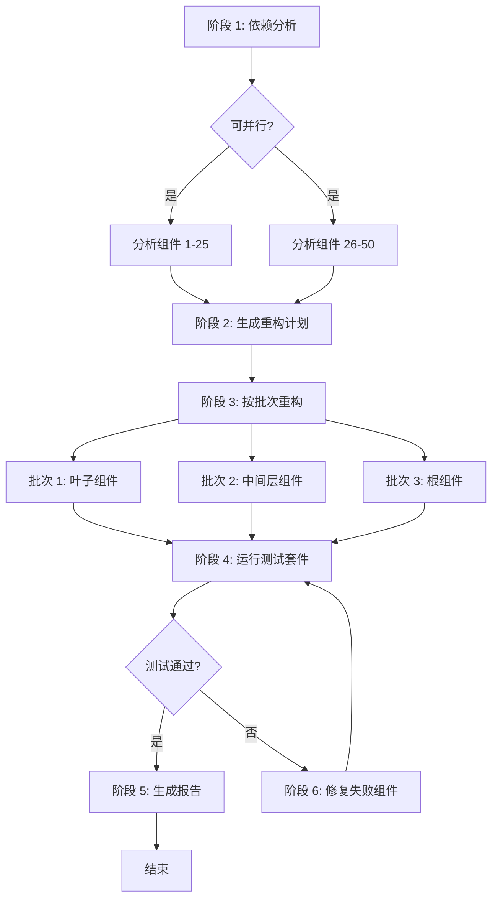

# 第 6 课：真实场景工作流实战

> 学习目标：
> - 综合运用任务分解、状态管理、错误处理设计完整工作流
> - 理解三个生产级场景的工作流模式
> - 掌握工作流的可观察性和调试技巧
>
> 前置要求：[第 5 课：错误处理和重试策略](./05-error-handling-retry.md)

## 从理论到实践

前五课我们学习了工作流的构建块：步骤、状态、分解、错误处理。现在让我们把这些知识组合起来，构建三个真实场景的生产级工作流。

**这一课的三个工作流:**

1. **代码重构管道**: 将遗留代码重构为现代模式，包括分析、规划、执行、测试、验证
2. **文档生成管道**: 从代码自动生成 API 文档，包括提取、生成示例、渲染、发布
3. **测试自动化流程**: 端到端的测试工作流，包括环境准备、并行测试、结果汇总、报告生成

**每个工作流都会展示:**
- 完整的任务分解
- 状态管理和检查点设计
- 错误处理和恢复策略
- 可观察性和调试支持[^S20]

## 场景 1: 代码重构管道

### 需求

将一个包含 50 个组件的遗留前端项目从 class 组件重构为 function 组件 + Hooks。

**挑战:**
- 组件间有依赖关系，不能随意重构顺序
- 重构可能破坏功能，需要测试验证
- 50 个组件无法在单次对话中完成，需要并行处理[^S21]

### 任务分解

工作流分为 6 个阶段，前两个阶段可以并行处理组件，后续阶段按依赖顺序执行：



### 完整实现

```javascript
// 工作流状态定义
const createInitialState = (components) => ({
  phase: 'init',
  input: { components, total: components.length },
  analysis: null,
  plan: null,
  refactored: [],
  testResults: null,
  errors: [],
  startTime: Date.now()
});

// 主工作流
async function refactoringWorkflow(componentPaths) {
  const workflowId = `refactor-${Date.now()}`;
  const store = new WorkflowStateStore();
  
  // 加载或创建状态
  let state = await store.load(workflowId) || 
              createInitialState(componentPaths);
  
  console.log(`🚀 开始重构工作流 (${state.input.total} 个组件)`);
  
  try {
    // 阶段 1: 依赖分析
    if (state.phase === 'init') {
      console.log('\n📊 阶段 1: 分析组件依赖关系...');
      
      state.analysis = await analyzeComponentsInParallel(
        state.input.components
      );
      
      state.phase = 'analyzed';
      await store.save(workflowId, state);
      console.log(`✓ 分析完成: 发现 ${state.analysis.dependencies.length} 个依赖`);
    }
    
    // 阶段 2: 生成重构计划
    if (state.phase === 'analyzed') {
      console.log('\n📋 阶段 2: 生成重构计划...');
      
      state.plan = await agent({
        task: '生成重构计划',
        prompt: `
          基于依赖分析结果，生成组件重构顺序：
          1. 先重构叶子组件(没有依赖其他组件的)
          2. 再重构中间层(依赖已重构组件的)
          3. 最后重构根组件
          
          返回 JSON: {
            batches: [
              { name: "叶子组件", components: [...] },
              { name: "中间层", components: [...] },
              { name: "根组件", components: [...] }
            ]
          }
        `,
        context: state.analysis
      });
      
      state.phase = 'planned';
      await store.save(workflowId, state);
      console.log(`✓ 计划生成: ${state.plan.batches.length} 个批次`);
    }
    
    // 阶段 3: 按批次重构
    if (state.phase === 'planned') {
      console.log('\n🔧 阶段 3: 执行重构...');
      
      for (const batch of state.plan.batches) {
        console.log(`\n  批次: ${batch.name} (${batch.components.length} 个组件)`);
        
        // 并行重构当前批次的组件
        const results = await Promise.allSettled(
          batch.components.map(async (component) => {
            return await retryWithBackoffAndJitter(
              async () => refactorComponent(component),
              3,
              2000
            );
          })
        );
        
        // 处理结果
        for (let i = 0; i < results.length; i++) {
          const result = results[i];
          const component = batch.components[i];
          
          if (result.status === 'fulfilled') {
            state.refactored.push({
              component,
              code: result.value,
              batch: batch.name
            });
          } else {
            state.errors.push({
              component,
              error: result.reason.message,
              batch: batch.name
            });
          }
        }
        
        // 批次完成后保存检查点
        await store.save(workflowId, state);
        console.log(`  ✓ ${batch.name} 完成`);
      }
      
      state.phase = 'refactored';
      await store.save(workflowId, state);
      console.log(`\n✓ 重构完成: ${state.refactored.length}/${state.input.total}`);
    }
    
    // 阶段 4: 运行测试
    if (state.phase === 'refactored') {
      console.log('\n🧪 阶段 4: 运行测试套件...');
      
      state.testResults = await runTestSuite({
        timeout: 300000,  // 5 分钟
        parallel: true
      });
      
      state.phase = 'tested';
      await store.save(workflowId, state);
      
      if (state.testResults.passed) {
        console.log(`✓ 测试通过: ${state.testResults.passedCount}/${state.testResults.totalCount}`);
      } else {
        console.log(`✗ 测试失败: ${state.testResults.failedTests.length} 个失败`);
      }
    }
    
    // 阶段 5: 修复失败(如果需要)
    if (state.phase === 'tested' && !state.testResults.passed) {
      console.log('\n🔨 阶段 5: 修复失败的组件...');
      
      const failedComponents = identifyFailedComponents(
        state.testResults,
        state.refactored
      );
      
      console.log(`  需要修复 ${failedComponents.length} 个组件`);
      
      for (const component of failedComponents) {
        try {
          const fixed = await agent({
            task: `修复组件 ${component.name}`,
            prompt: `
              组件重构后测试失败。
              失败的测试: ${component.failedTests.join(', ')}
              错误信息: ${component.errors.join('\n')}
              
              分析问题并修复代码。
            `,
            context: {
              originalCode: component.originalCode,
              refactoredCode: component.refactoredCode,
              tests: component.tests
            }
          });
          
          // 更新重构结果
          const index = state.refactored.findIndex(r => r.component === component.path);
          state.refactored[index].code = fixed;
          
        } catch (error) {
          state.errors.push({
            component: component.path,
            error: `修复失败: ${error.message}`,
            phase: 'fix'
          });
        }
      }
      
      // 重新测试
      state.phase = 'refactored';
      await store.save(workflowId, state);
      
      // 递归调用自己(带限制)
      state.fixAttempts = (state.fixAttempts || 0) + 1;
      if (state.fixAttempts < 3) {
        return await refactoringWorkflow(componentPaths);
      } else {
        console.log('✗ 3 次修复尝试均未通过测试');
      }
    }
    
    // 阶段 6: 生成报告
    if (state.phase === 'tested' && state.testResults.passed) {
      console.log('\n📄 阶段 6: 生成重构报告...');
      
      const report = await agent({
        task: '生成重构报告',
        prompt: `
          生成重构项目报告，包括:
          - 重构统计(多少组件、按批次分布)
          - 测试结果摘要
          - 遇到的问题和解决方案
          - 重构前后的代码对比示例
          
          返回 Markdown 格式。
        `,
        context: {
          total: state.input.total,
          refactored: state.refactored.length,
          batches: state.plan.batches.map(b => b.name),
          testResults: state.testResults,
          errors: state.errors,
          duration: Date.now() - state.startTime
        }
      });
      
      await fs.writeFile('refactoring-report.md', report);
      
      state.phase = 'completed';
      state.completedAt = Date.now();
      await store.save(workflowId, state);
      
      console.log('\n✅ 重构工作流完成!');
      console.log(`   报告已保存: refactoring-report.md`);
    }
    
    return state;
    
  } catch (error) {
    console.error('\n❌ 工作流失败:', error.message);
    state.phase = 'failed';
    state.error = error.message;
    await store.save(workflowId, state);
    throw error;
  }
}

// 辅助函数: 并行分析组件
async function analyzeComponentsInParallel(components) {
  const analyses = await Promise.all(
    components.map(async (path) => {
      return await agent({
        task: `分析 ${path}`,
        prompt: `
          分析这个组件:
          1. 是 class 还是 function 组件
          2. 依赖哪些其他组件(import 语句)
          3. 使用了哪些生命周期方法或 hooks
          
          返回 JSON: { type, dependencies: [], hooks: [] }
        `,
        context: { file: await fs.readFile(path, 'utf-8') }
      });
    })
  );
  
  // 构建依赖图
  const dependencies = [];
  for (let i = 0; i < components.length; i++) {
    const component = components[i];
    const analysis = analyses[i];
    
    for (const dep of analysis.dependencies) {
      dependencies.push({ from: component, to: dep });
    }
  }
  
  return { components: analyses, dependencies };
}

// 辅助函数: 重构单个组件
async function refactorComponent(componentPath) {
  return await agent({
    task: `重构 ${componentPath}`,
    prompt: `
      将这个 class 组件重构为 function 组件 + Hooks:
      1. 移除 class 和 constructor
      2. 用 useState 替换 state
      3. 用 useEffect 替换生命周期方法
      4. 保持相同的 props 接口和功能
      
      返回重构后的完整代码。
    `,
    context: {
      code: await fs.readFile(componentPath, 'utf-8')
    }
  });
}
```

### 关键设计点

**1. 检查点策略**: 每个批次完成后保存，避免重复重构

**2. 并行执行**: 同一批次的组件可以并行重构(它们不互相依赖)

**3. 重试机制**: 单个组件重构失败不影响其他组件，用 `Promise.allSettled` 收集所有结果

**4. 修复循环**: 测试失败时自动尝试修复，最多 3 次

**5. 可观察性**: 每个阶段都有清晰的日志输出，状态持久化到外部存储[^S22]

## 场景 2: 文档生成管道

### 需求

为一个包含 30 个 REST API 端点的服务生成完整的 API 文档，包括端点描述、请求/响应示例、错误码说明。

### 任务分解(扇出-汇总模式)

```javascript
async function apiDocGenerationWorkflow(servicePath) {
  console.log('📚 API 文档生成工作流');
  
  // 步骤 1: 提取所有端点
  console.log('\n1️⃣ 提取 API 端点...');
  const endpoints = await extractAPIEndpoints(servicePath);
  console.log(`   发现 ${endpoints.length} 个端点`);
  
  // 步骤 2: 并行生成每个端点的文档
  console.log('\n2️⃣ 生成端点文档 (并行)...');
  const docs = await Promise.all(
    endpoints.map(async (endpoint, index) => {
      console.log(`   [${index + 1}/${endpoints.length}] ${endpoint.method} ${endpoint.path}`);
      
      return await agent({
        task: `为 ${endpoint.method} ${endpoint.path} 生成文档`,
        prompt: `
          为这个 API 端点生成文档:
          
          ## ${endpoint.method} ${endpoint.path}
          
          包括:
          1. 功能描述(一段话)
          2. 请求参数说明(path params, query params, body)
          3. 请求示例(curl 和 JavaScript)
          4. 响应示例(成功和常见错误)
          5. 错误码说明
          
          返回 Markdown。
        `,
        context: {
          code: endpoint.handlerCode,
          schema: endpoint.schema,
          examples: endpoint.existingTests || []
        }
      });
    })
  );
  
  // 步骤 3: 生成目录和概述
  console.log('\n3️⃣ 生成文档目录...');
  const toc = await agent({
    task: '生成文档目录',
    prompt: `
      为这些 API 端点生成文档目录:
      - 按功能分组(用户管理、订单管理等)
      - 每组列出端点(带锚点链接)
      - 生成服务概述(一段话介绍这个服务做什么)
      
      返回 Markdown。
    `,
    context: {
      endpoints: endpoints.map(e => ({ method: e.method, path: e.path, summary: e.summary }))
    }
  });
  
  // 步骤 4: 组装完整文档
  console.log('\n4️⃣ 组装完整文档...');
  const fullDoc = [
    '# API 文档\n',
    toc,
    '\n---\n',
    ...docs.map((doc, i) => `\n## ${endpoints[i].method} ${endpoints[i].path}\n\n${doc}`)
  ].join('\n');
  
  // 步骤 5: 保存和发布
  console.log('\n5️⃣ 保存文档...');
  await fs.writeFile('api-docs.md', fullDoc);
  
  console.log('\n✅ 文档生成完成!');
  console.log(`   文件: api-docs.md`);
  console.log(`   端点数: ${endpoints.length}`);
  
  return { endpoints: endpoints.length, outputFile: 'api-docs.md' };
}
```

**关键特点:**
- **扇出-汇总模式**: 30 个端点并行生成文档，最后汇总
- **无状态**: 任务足够快(< 10 分钟)，不需要检查点
- **幂等性**: 可以随时重跑，覆盖输出文件[^S20]

## 场景 3: 测试自动化流程

### 需求

在多个环境(本地、staging、生产)运行端到端测试，收集测试结果和性能指标，生成对比报告。

### 完整实现

```javascript
async function e2eTestingWorkflow(config) {
  const workflowId = `e2e-test-${Date.now()}`;
  const state = {
    environments: config.environments,  // ['local', 'staging', 'production']
    results: {},
    phase: 'init',
    startTime: Date.now()
  };
  
  console.log(`🧪 E2E 测试工作流 (${state.environments.length} 个环境)`);
  
  try {
    // 阶段 1: 准备环境
    console.log('\n1️⃣ 准备测试环境...');
    for (const env of state.environments) {
      console.log(`   配置 ${env} 环境...`);
      await setupTestEnvironment(env);
    }
    state.phase = 'environments_ready';
    
    // 阶段 2: 并行运行所有环境的测试
    console.log('\n2️⃣ 运行测试 (并行)...');
    const testPromises = state.environments.map(async (env) => {
      console.log(`   [${env}] 开始测试...`);
      
      try {
        const result = await runTestsWithRetry(env, {
          maxRetries: 2,
          testSuites: config.testSuites,
          timeout: 600000  // 10 分钟
        });
        
        console.log(`   [${env}] ✓ 完成: ${result.passed}/${result.total} 通过`);
        return { env, result, status: 'success' };
        
      } catch (error) {
        console.log(`   [${env}] ✗ 失败: ${error.message}`);
        return { env, error: error.message, status: 'failed' };
      }
    });
    
    const testResults = await Promise.all(testPromises);
    
    // 保存结果到状态
    for (const { env, result, error, status } of testResults) {
      state.results[env] = status === 'success' ? result : { error };
    }
    
    state.phase = 'tests_completed';
    
    // 阶段 3: 生成对比报告
    console.log('\n3️⃣ 生成测试报告...');
    const report = await agent({
      task: '生成测试对比报告',
      prompt: `
        生成跨环境测试对比报告:
        
        对比维度:
        1. 测试通过率(每个环境)
        2. 性能指标(平均响应时间、P95、P99)
        3. 失败用例分析(哪些用例在哪些环境失败)
        4. 环境差异问题(只在某个环境失败的用例)
        
        返回 Markdown，包含表格和图表描述。
      `,
      context: state.results
    });
    
    await fs.writeFile('e2e-test-report.md', report);
    
    // 阶段 4: 如果有失败，生成修复建议
    const failedEnvs = Object.entries(state.results)
      .filter(([env, result]) => result.error || result.failedCount > 0);
    
    if (failedEnvs.length > 0) {
      console.log('\n4️⃣ 生成失败分析...');
      
      for (const [env, result] of failedEnvs) {
        const analysis = await agent({
          task: `分析 ${env} 环境的失败`,
          prompt: `
            分析测试失败原因并提供修复建议:
            
            失败测试: ${result.failedTests?.map(t => t.name).join(', ')}
            错误信息: ${result.failedTests?.map(t => t.error).join('\n')}
            
            可能的原因:
            - 环境配置问题
            - 数据不一致
            - 时间依赖的测试
            - 网络问题
            
            返回修复建议(Markdown)。
          `,
          context: { env, result }
        });
        
        await fs.writeFile(`fix-${env}.md`, analysis);
        console.log(`   ${env} 失败分析已保存: fix-${env}.md`);
      }
    }
    
    state.phase = 'completed';
    state.completedAt = Date.now();
    
    console.log('\n✅ 测试工作流完成!');
    console.log(`   报告: e2e-test-report.md`);
    console.log(`   总耗时: ${((state.completedAt - state.startTime) / 1000).toFixed(1)}s`);
    
    return state;
    
  } catch (error) {
    console.error('\n❌ 工作流失败:', error);
    throw error;
  }
}

// 辅助函数: 带重试的测试运行
async function runTestsWithRetry(env, options) {
  const { maxRetries, testSuites, timeout } = options;
  
  for (let attempt = 1; attempt <= maxRetries + 1; attempt++) {
    try {
      const result = await runTests(env, testSuites, timeout);
      return result;
      
    } catch (error) {
      if (attempt <= maxRetries) {
        console.log(`   [${env}] 重试 ${attempt}/${maxRetries}...`);
        await sleep(5000 * attempt);  // 递增延迟
      } else {
        throw error;
      }
    }
  }
}
```

**关键特点:**
- **并行测试**: 多个环境同时运行测试，大幅缩短总时间
- **容错**: 一个环境失败不影响其他环境
- **智能重试**: 测试失败自动重试(网络波动、临时故障常见)
- **失败分析**: 自动生成失败的修复建议[^S20]

## 工作流的可观察性

**好的工作流应该随时能回答:**

- 当前进度如何？(X/Y 完成)
- 预计还需要多久？
- 遇到了哪些错误？
- 性能瓶颈在哪里？

答不上来这几个问题，说明日志和状态记录得不够——工作流调试靠的就是这些记录，不是靠猜。

### 实现可观察性

```javascript
class ObservableWorkflow {
  constructor(name, totalSteps) {
    this.name = name;
    this.totalSteps = totalSteps;
    this.currentStep = 0;
    this.startTime = Date.now();
    this.stepTimes = [];
    this.errors = [];
  }
  
  async step(name, fn) {
    this.currentStep++;
    const stepNum = this.currentStep;
    const progress = ((stepNum / this.totalSteps) * 100).toFixed(1);
    
    console.log(`\n[${this.name}] 步骤 ${stepNum}/${this.totalSteps} (${progress}%): ${name}`);
    
    const stepStart = Date.now();
    
    try {
      const result = await fn();
      const duration = Date.now() - stepStart;
      this.stepTimes.push({ name, duration });
      
      console.log(`  ✓ 完成 (${(duration / 1000).toFixed(1)}s)`);
      
      return result;
      
    } catch (error) {
      const duration = Date.now() - stepStart;
      this.errors.push({ step: name, error: error.message, duration });
      
      console.log(`  ✗ 失败: ${error.message}`);
      throw error;
    }
  }
  
  summary() {
    const totalDuration = Date.now() - this.startTime;
    const avgStepTime = this.stepTimes.reduce((sum, s) => sum + s.duration, 0) / this.stepTimes.length;
    
    console.log(`\n━━━ ${this.name} 总结 ━━━`);
    console.log(`总耗时: ${(totalDuration / 1000).toFixed(1)}s`);
    console.log(`步骤数: ${this.currentStep}/${this.totalSteps}`);
    console.log(`平均每步: ${(avgStepTime / 1000).toFixed(1)}s`);
    
    if (this.errors.length > 0) {
      console.log(`\n错误 (${this.errors.length}):`);
      for (const err of this.errors) {
        console.log(`  - ${err.step}: ${err.error}`);
      }
    }
    
    console.log(`\n最慢的步骤:`);
    const sorted = [...this.stepTimes].sort((a, b) => b.duration - a.duration);
    for (const step of sorted.slice(0, 3)) {
      console.log(`  - ${step.name}: ${(step.duration / 1000).toFixed(1)}s`);
    }
  }
}

// 使用示例
async function myWorkflow() {
  const wf = new ObservableWorkflow('代码重构', 5);
  
  await wf.step('分析依赖', async () => {
    return await analyzeDependencies();
  });
  
  await wf.step('生成计划', async () => {
    return await generatePlan();
  });
  
  // ...
  
  wf.summary();
}
```

`summary()` 里那段按耗时排序、只挑最慢三步打印出来的逻辑，就是最简单的性能分析:先测量每一步花了多久，再从数据里找瓶颈，而不是凭感觉猜哪一步慢。

<!-- exercises -->


## 练习

### Level 1: 设计你的工作流

选择你工作中的一个真实任务，设计一个完整的工作流。

**要求:**
1. 描述任务(2-3 句话)
2. 画出工作流图(阶段、分支、并行)
3. 列出状态字段(至少 5 个)
4. 说明在哪里设置检查点
5. 列出可能的错误和处理策略

<!-- rubric -->
任务描述清晰；工作流图包含至少 4 个阶段、至少 1 个分支或并行点；状态设计合理(包括阶段标识、进度、结果、错误)；检查点位置合理(耗时操作后、不可逆操作前)；识别至少 3 种错误并提供处理策略

<!-- answer -->
(示例略，应根据学习者自己的工作场景设计)

<!-- hint -->
从你最近花了 2 小时以上的重复性任务开始，想想如果让 Agent 做，会分成哪几个大步骤。

<!-- hint -->
好的工作流通常有明确的输入(文件、配置、数据)和输出(报告、修改后的代码、部署结果)。从输入和输出倒推中间需要哪些转换。

### Level 2: 调试失败的工作流

一个"批量图片处理"工作流在处理第 47 张图片时失败，错误信息是 `Error: EMFILE: too many open files`。

**问题:**
1. 这是什么类型的错误(瞬态/永久)？
2. 为什么会在第 47 张时失败而不是第 1 张？
3. 应该如何修复工作流？(给出代码修改建议)

<!-- rubric -->
正确识别错误类型(资源耗尽类的瞬态错误，但根本原因是代码设计问题)；理解错误原因(并行打开了太多文件句柄，超过系统限制)；提供合理修复方案(限制并发数、处理完后及时关闭文件、使用流式处理)

<!-- answer -->
(1) 这是瞬态错误(资源耗尽)，但根本原因是代码问题。(2) 工作流可能使用 `Promise.all(images.map(...))` 并行处理所有图片，每张图片打开文件句柄，第 47 张时超过系统限制(通常是 1024 或 4096)。(3) 修复方法: 限制并发数，每次只处理 10 张图片，批次间等待。代码: `for (let i = 0; i < images.length; i += 10) { const batch = images.slice(i, i + 10); await Promise.all(batch.map(processImage)); }`。或者使用流式处理，每处理完一张立即关闭文件。

<!-- hint -->
EMFILE 错误表示打开的文件太多。想想工作流是一次性打开所有 100 张图片，还是处理完一张关闭一张？

<!-- hint -->
如果用 `Promise.all(array.map(...))` 并行处理 100 个文件，会同时打开 100 个文件句柄。解决方法是限制并发数(如每次只处理 10 个)。

<!-- /exercises -->

---

**恭喜你完成了《Agent 工作流设计》课程！**

你现在掌握了:
- 工作流的核心概念和适用场景
- 任务分解的三种策略
- 状态管理和检查点机制
- 错误处理和重试策略
- 三个真实场景的生产级工作流

**下一步:**
1. 在你的项目中实践一个简单工作流(< 5 个步骤)
2. 逐步增加复杂度(并行、检查点、错误处理)
3. 分享你的工作流设计，从社区获得反馈
4. 探索更高级的话题(分布式工作流、工作流编排框架、可视化工作流编辑器)
