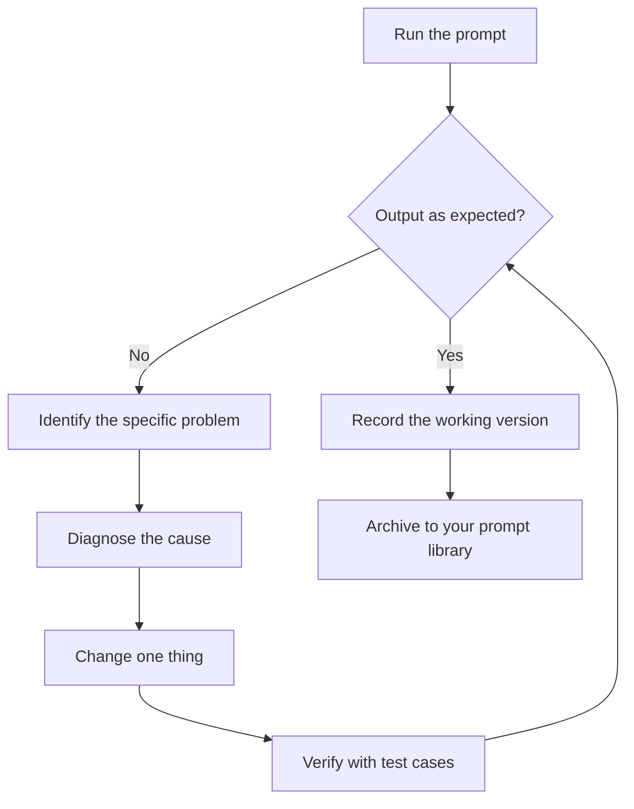

# Lesson 5: Debugging and Improving Prompts

> Learning goals:
> - Learn to spot prompt problems systematically
> - Build a method for diagnosing why a prompt fails
> - Set up a repeatable loop for improving prompts
>
> Prerequisites: [<< Lesson 4: Chain-of-Thought: Making AI Show Its Reasoning](./04-chain-of-thought.md) | Next: [Lesson 6 >>](./06-task-specific-strategies.md)

## What to do when a prompt doesn't work

You wrote a careful prompt with a role, a task, a format, and examples, and the AI still gets it wrong. Maybe the format is off, the content drifted, or a key piece of information is missing. Now what?

Change a few words at random and hope the next run is luckier? Or track down the problem and fix it on purpose? This lesson teaches the second approach: debug a prompt the way you debug code. Spot the symptom, diagnose the cause, make a small change, and check the result.[^S8]

## The three-step debugging loop

Debugging a prompt works a lot like debugging code.[^S8]

1. **Identify the problem**: what exactly is wrong with the output?
2. **Diagnose the cause**: which part of the prompt produced that problem?
3. **Change and verify**: change one thing, then test whether it improved.

The rule that matters most: **change one variable at a time**. If you change three things at once, you won't know which change did the work.

### Step 1: Identify the specific problem

"The output is wrong" is too vague. Pin down what's actually wrong.[^S8]

**Common problem types**:

| Problem type | What it looks like | Likely cause |
|---------|---------|---------|
| Wrong format | JSON field names are off, a section is missing | Format instructions aren't specific enough, or examples disagree |
| Off-target content | Answers an unrelated question, wanders off topic | Task description is unclear, or constraints are thin |
| Missing information | Leaves out some key detail | You never listed everything you need |
| Overreach | Adds extra content you didn't ask for | No "output only X, not Y" constraint |
| Misunderstanding | The AI read your intent wrong | Ambiguous wording, or no example to clarify |
| Instability | Results vary a lot from run to run | Prompt is too loose and gives the AI too much freedom |

**Example: identifying the problem**

Your prompt:
```
Summarize the key points of this article.
```

The AI's output:
```
This article covers three key points. First... Second... Finally...
```

**Problem identified**: it isn't the list format you wanted, and you never said how many points.

### Step 2: Diagnose the cause

Find which part of the prompt (or which missing part) caused the problem.

**A diagnosis checklist**:

- **Is the task clear?** "Summarize the key points" is fuzzy. It never says how many points or how long each one should be.
- **Is there a format example?** No. The AI can only guess what shape you want.
- **Are the constraints enough?** Nothing says "output only the points, no lead-in."
- **Is anything ambiguous?** "Key points" could mean "core arguments" or "every claim."

Diagnosis: **the format spec and a count constraint are missing**.

### Step 3: Make a small change, then verify

Fix one problem at a time and test whether it improved.

**Change 1: state the count and format**
```
Summarize this article in three bullet points, one sentence each.
```

Test result: the format is right, but each point runs longer than a sentence.

**Change 2: add a length constraint**
```
Summarize this article in three bullet points.

Requirements:
- Each point is 15 words or fewer
- Use a bulleted (- ) list
- Output only the points, no lead-in like "Here are the key points"
```

Test result: matches what you wanted.

Write down the change that worked so you can reuse it next time you hit the same problem.

```agentmentor-check
{
  "id": "prompt-engineering-debugging-identify-fix",
  "label": "Diagnose the prompt problem",
  "prompt": "Your prompt is: \"Write Python code that sorts a list.\" The AI gives you a bubble sort, but you wanted it to use the built-in sorted() function. How should you change the prompt?\n\nA: \"Write Python code that sorts a list in the simplest way possible\"\nB: \"Write Python code that sorts a list using Python's built-in sorted() function; don't implement a sorting algorithm yourself\"\nC: \"Write Python code that sorts a list quickly and efficiently\"\nD: \"Write high-quality Python code that sorts a list\"",
  "whyHere": "This checks whether you got the core of debugging: state what you want and what you don't want, instead of leaning on vague adjectives.",
  "mode": "single",
  "choices": [
    {
      "id": "a",
      "text": "A - emphasize 'simplest'",
      "correct": false,
      "feedback": "'Simplest' is subjective. The AI may decide bubble sort is fewer lines and simpler logic, so you still get bubble sort. Adjectives like simple, fast, and efficient are usually not specific enough."
    },
    {
      "id": "b",
      "text": "B - name sorted() and rule out writing the algorithm",
      "correct": true,
      "feedback": "Correct. This does two things: it names sorted() explicitly, and it rules out hand-writing the algorithm. You said what you want and what you don't, so there's nothing left to guess."
    },
    {
      "id": "c",
      "text": "C - emphasize 'quick and efficient'",
      "correct": false,
      "feedback": "'Quick and efficient' is still vague. The AI might hand you a quicksort implementation, which is genuinely fast, instead of calling sorted(). You need a specific instruction, not a performance goal."
    },
    {
      "id": "d",
      "text": "D - emphasize 'high-quality'",
      "correct": false,
      "feedback": "'High-quality' is too broad and doesn't solve anything. The AI might give you a well-commented bubble sort with error handling and call that high-quality. The issue isn't quality, it's that you want a built-in function, not a hand-written algorithm."
    }
  ]
}
```

## Diagnosing and fixing common problems

### Problem 1: unstable format

**Symptom**: sometimes JSON, sometimes plain text; sometimes a colon, sometimes an equals sign.

**Diagnosis**: no format example, or examples that don't match each other.

**Fix**:
- Give 2-3 examples that all use exactly the same format
- Or state it in the constraints: "Follow this JSON format exactly and output nothing else."

### Problem 2: missing information

**Symptom**: the output has only part of the data and always drops certain fields.

**Diagnosis**: you never listed the information you need.

**Fix**:
```
Extract all of the following fields (all required):
1. Title
2. Author
3. Publication date
4. Summary

If a field isn't in the source, output "not provided" rather than omitting the field.
```

The key is to **list every required field** and say what to do when one is missing.

### Problem 3: over-explaining

**Symptom**: you asked for code and got code plus a wall of explanation; you asked for a list and got an intro and a summary wrapped around it.

**Diagnosis**: no "output only X" constraint.

**Fix**:
```
Output runnable code only. No explanation, comments, or notes.
```

Or:
```
Output the list only. No lead-in like "Here is the list" and no summary.
```

### Problem 4: misread intent

**Symptom**: the AI misread what you meant and answered a related but wrong question.

**Diagnosis**: ambiguous wording, or missing context.

**Example**:
```
Analyze the problems in this code.
```

The AI might analyze:
- Style problems
- Performance problems
- Security problems
- Logic errors

You wanted logic errors, but the prompt never said so.

**Fix**:
```
Analyze the logic errors in this code. Ignore style and performance; focus only on logic bugs that would produce wrong output.
```

Name the dimension you want and rule out the rest.

## Best practices for iterating

### Practice 1: build a set of test cases

Prepare 3-5 representative inputs and run every change against all of them.[^S8]

**Example**: you're tuning a prompt that extracts sentiment from product reviews.

Test cases:
1. Clearly positive: "Very happy with it, highly recommend."
2. Clearly negative: "Completely unusable, waste of money."
3. Neutral / mixed: "Works fine, but a bit pricey."
4. Edge case: "It's okay I guess."
5. Complex: "Support was great, but the product quality is mediocre."

After each change to the prompt, run all five and check whether they all classify correctly.

### Practice 2: track versions and results

Manage prompt versions the way you manage code versions.[^S8]

**A simple log**:
```
v1 (2024-01-15):
Extract the sentiment of the review.

Result:
- Clear cases OK
- Edge cases unstable

---

v2 (2024-01-15):
Classify the review as "positive", "negative", or "neutral".
Examples: [3 examples]

Result:
- Edge cases improved
- But output format isn't consistent (sometimes "positive", sometimes "Positive")

---

v3 (2024-01-15):
[v2 content] + constraint: output exactly one of the lowercase words positive, negative, or neutral.

Result: passes all test cases
```

Now you know what each change bought you, and if a new version turns out worse you can roll back to the last good one.

### Practice 3: A/B test the changes you're unsure about

Not sure a change actually helps? Keep both versions, run each one 10 times, and compare the success rate. That's an A/B test: change one factor at a time and let the data decide.

**Example**: you're not sure whether adding "let's think step by step" really helps.

- Version A (without): 10 runs, 7 correct
- Version B (with CoT): 10 runs, 9 correct

The data speaks. B is better.

### Practice 4: start from a simple version

Don't open with a 500-word monster prompt. Start with the simplest version and add constraints as you go.[^S8]

**An iteration path**:
```
v1: Summarize this article.
   -> too vague

v2: Summarize the core points of this article in three bullets.
   -> bullets run too long

v3: Summarize the core points in three bullets, each 15 words or fewer.
   -> format still inconsistent

v4: [v3] + use a bulleted list, output only the points with no lead-in.
   -> works well
```

Each step fixes exactly one problem, and you end up with a prompt that's just enough, with no filler.

## The debugging loop, end to end

The full loop is a cycle: run the prompt, check the output, and if it doesn't match, identify the problem, diagnose the cause, change one thing, verify with your test cases, repeat until it matches, then record the working version.

The diagram below shows each step of that loop:



**Core principles**:
- Change one thing at a time
- Verify every change with test cases
- Track versions and their results
- Start simple and add constraints as needed

## When to stop tuning

Prompt tuning has no natural end, but it has a good-enough bar:

**Signs you can stop**:
- Success rate on your test cases is 90% or higher
- Output format is stable
- You can explain what every part of the prompt does
- The next improvement would cost more time than it's worth

**Signs you should keep going**:
- Success rate below 70%
- The same input gives wildly different output each run
- You're not sure some parts of the prompt do anything
- It keeps failing on edge cases

A pragmatic rule: **good enough is good enough, don't chase perfect**. If it works well 90% of the time, a human can step in for the remaining 10% of edge cases.

## Recap

The prompt debugging loop is: identify the specific problem, diagnose the cause, make a small change, verify. The key is to change one variable at a time, verify every change with test cases, and track versions and results.

Common problems include unstable format, missing information, over-explaining, and misread intent. Each has a matching fix: add examples, list the fields, add an "output only" constraint, and rule out ambiguity.

Start from a simple version and add constraints until your success rate on the test cases clears 90%. Record the prompt versions that work so you can reuse them next time.

The next lesson covers prompt strategies for different task types: what's specific to code generation, document writing, and data analysis.

**Next lesson** [Prompt Strategies for Different Tasks >>](./06-task-specific-strategies.md)

<!-- exercises -->

## 💻 Exercises

### Level 1: Diagnose a prompt problem

Below is a broken prompt and the AI's output. Identify the problem and propose a fix.

**Prompt**:
```
Summarize the key points of this article.
```

**AI output** (three separate runs):
- Run 1: a 200-word prose summary
- Run 2: 5 bullet points
- Run 3: a one-line summary plus three paragraphs of detail

**Problem**: the output format is unstable and different every run.

<!-- rubric -->
- Correctly identifies the root cause (no format constraint)
- The fix includes an explicit format requirement
- The fix specifies concrete constraints like count and length
- Considers an exclusion constraint ("output only X, not Y")
- The fixed prompt removes the instability

<!-- answer -->
**Diagnosis**:
1. **Root cause**: the prompt never specifies an output format, so the AI decides how to summarize each time
2. **What's missing specifically**:
   - Never says how many points
   - Never says how long each point should be
   - Never says which format (list, paragraph, table)
   - Never says whether to include a lead-in

**Fix**:

```
Summarize the core points of this article in three bullet points.

Requirements:
- Exactly 3 points, in a bulleted (- ) list
- Each point is 1 sentence, 20 words or fewer
- Output only the points, no lead-in like "The key points are:"
- Order from most to least important

Article:
[paste article]
```

**Why this works**:
- "Exactly 3 points" removes the count uncertainty
- "In a bulleted list" fixes the format
- "1 sentence, 20 words or fewer" controls length
- "Output only the points" rules out the lead-in
- Every run now produces the same shape (a list of 3 short lines)

<!-- hint -->
Unstable output usually means the prompt gives the AI too many choices. Ask yourself: where in your prompt can the AI improvise? Then pin those places down.
<!-- hint -->
Use an "output only X, not Y" constraint to rule out what you don't want. For instance: no lead-in, no explanation, no examples.

### Level 2: Iterate on a real prompt

Pick a prompt you've written yourself (or use the scenario below) and improve it over 3 rounds of iteration.

**Scenario**: have the AI extract action items from meeting notes.

**Requirements**:
1. Write v1 (the first prompt)
2. Test it, find a problem, write v2 (fix one main issue)
3. Test again, find a new problem, write v3 (final version)
4. Explain what each change fixed

<!-- rubric -->
- v1 is a reasonable first attempt, not deliberately bad
- v2 makes a specific improvement to a real v1 problem (not a full rewrite)
- v3 improves further and reaches a usable standard
- Each iteration states: the problem found, what changed, why you changed it that way
- The final version accounts for format, completeness, and edge cases

<!-- answer -->
**v1: first version**

```
Extract the action items from these meeting notes.
```

**Test problems**:
- The AI pulled every task mentioned, including ones already done and ones only discussed
- No owner or due date
- Inconsistent format (sometimes a list, sometimes paragraphs)

---

**v2: add format and fields**

```
Extract the action items from the meeting notes. Include for each: task, owner, due date.

Output format:
- [task description] | Owner: [name] | Due: [date]

Meeting notes:
[paste notes]
```

**Test problems**:
- The AI pulled undecided items like "discuss whether to do X"
- Some action items had no owner in the notes and the AI invented one
- Some due dates were "next week" and the AI didn't convert them to a date

---

**v3: final version (with explicit rules)**

```
Extract the confirmed action items from the meeting notes.

Extraction rules:
- Only extract tasks that were clearly decided (words like "decided", "confirmed", "action item")
- Exclude: still under discussion, already done, rejected
- If a field (owner or due date) isn't in the notes, output "TBD" and don't guess

Output format:
One action item per line, in this format:
- [task description, one sentence] | Owner: [name/TBD] | Due: [YYYY-MM-DD/TBD]

Meeting notes:
[paste notes]
```

**Iteration summary**:

| Version | Main problem | What changed | What it fixed |
|------|---------|---------|-----------|
| v1 | Messy output, incomplete info | Added output format and required fields | Consistent format, key info included |
| v2 | Extracted the wrong items, invented info | Added extraction rules and missing-value handling | Only confirmed tasks, no fabricated data |
| v3 | - | Final usable version | Accurate, complete, consistent format |

**Key takeaways**:
1. First version pins down the format instead of letting the AI decide
2. Second version adds rules that spell out what you want and don't want
3. Third version handles edge cases (missing values, fuzzy phrasing)
4. Change one main problem at a time and test before the next change

<!-- hint -->
Real tuning is: write the prompt, test, find a problem, change one thing, test again. Don't change three things at once or you won't know which change worked.
<!-- hint -->
Log each version's results (success rate, common errors) so you know whether you're improving or backsliding. If v3 is worse than v2, roll back to v2 and try a different angle.

<!-- /exercises -->

