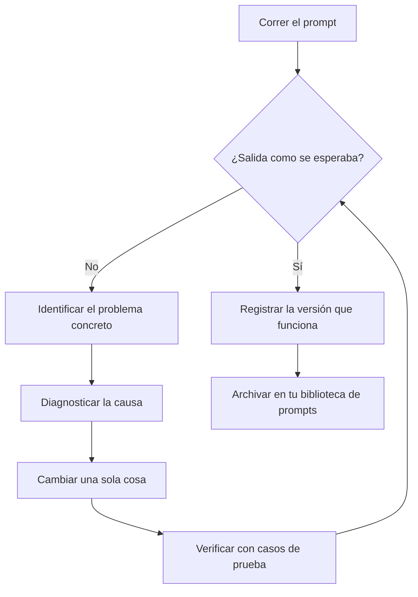

# Lección 5: Depuración y mejora de prompts

> Objetivos de aprendizaje:
> - Aprender a detectar problemas de prompt de forma sistemática
> - Construir un método para diagnosticar por qué falla un prompt
> - Montar un ciclo repetible para mejorar prompts
>
> Requisitos: [<< Lección 4: Chain-of-thought: hacer que la IA muestre su razonamiento](./04-chain-of-thought.md) | Siguiente: [Lección 6 >>](./06-task-specific-strategies.md)

## Qué hacer cuando un prompt no funciona

Escribiste un prompt cuidadoso con un rol, una tarea, un formato y ejemplos, y la IA se sigue equivocando. Puede que el formato esté mal, que el contenido se haya desviado o que falte una pieza clave de información. ¿Y ahora qué?

¿Cambiar unas palabras al azar y esperar que la próxima corrida tenga más suerte? ¿O rastrear el problema y corregirlo a propósito? Esta lección enseña el segundo enfoque: depurar un prompt como depuras código. Detecta el síntoma, diagnostica la causa, haz un cambio pequeño y revisa el resultado.[^S8]

## El ciclo de depuración en tres pasos

Depurar un prompt se parece bastante a depurar código.[^S8]

1. **Identifica el problema**: ¿qué está mal exactamente en la salida?
2. **Diagnostica la causa**: ¿qué parte del prompt produjo ese problema?
3. **Cambia y verifica**: cambia una sola cosa y después prueba si mejoró.

La regla que más importa: **cambia una variable a la vez**. Si cambias tres cosas de golpe, no vas a saber cuál hizo el trabajo.

### Paso 1: Identifica el problema concreto

«La salida está mal» es demasiado vago. Precisa qué está mal realmente.[^S8]

**Tipos de problema habituales**:

| Tipo de problema | Cómo se ve | Causa probable |
|---------|---------|---------|
| Formato incorrecto | Los nombres de campo del JSON no coinciden, falta una sección | Las instrucciones de formato no son lo bastante específicas, o los ejemplos se contradicen |
| Contenido fuera de objetivo | Responde una pregunta que no venía al caso, se va por las ramas | La descripción de la tarea no es clara, o las restricciones son escasas |
| Información faltante | Deja fuera algún detalle clave | Nunca enumeraste todo lo que necesitas |
| Exceso de alcance | Agrega contenido extra que no pediste | Falta una restricción de «devuelve solo X, no Y» |
| Malentendido | La IA leyó mal tu intención | Redacción ambigua, o ningún ejemplo que aclare |
| Inestabilidad | Los resultados varían mucho de una corrida a otra | El prompt es demasiado laxo y le da a la IA demasiada libertad |

**Ejemplo: identificar el problema**

Tu prompt:
```
Resume los puntos clave de este artículo.
```

La salida de la IA:
```
Este artículo cubre tres puntos clave. Primero... Segundo... Por último...
```

**Problema identificado**: no es el formato de lista que querías, y nunca dijiste cuántos puntos.

### Paso 2: Diagnostica la causa

Encuentra qué parte del prompt (o qué parte faltante) causó el problema.

**Una lista de verificación para el diagnóstico**:

- **¿La tarea es clara?** «Resume los puntos clave» es difuso. Nunca dice cuántos puntos ni qué tan largo debería ser cada uno.
- **¿Hay un ejemplo de formato?** No. La IA solo puede adivinar qué forma quieres.
- **¿Las restricciones alcanzan?** Nada dice «devuelve solo los puntos, sin preámbulo».
- **¿Hay algo ambiguo?** «Puntos clave» podría significar «argumentos centrales» o «todas las afirmaciones».

Diagnóstico: **faltan la especificación de formato y una restricción de cantidad**.

### Paso 3: Haz un cambio pequeño y después verifica

Corrige un problema a la vez y prueba si mejoró.

**Cambio 1: declarar la cantidad y el formato**
```
Resume este artículo en tres viñetas, de una oración cada una.
```

Resultado de la prueba: el formato es correcto, pero cada punto se extiende más de una oración.

**Cambio 2: agregar una restricción de longitud**
```
Resume este artículo en tres viñetas.

Requisitos:
- Cada punto tiene 15 palabras o menos
- Usa una lista con viñetas (- )
- Devuelve solo los puntos, sin preámbulos como «Estos son los puntos clave»
```

Resultado de la prueba: coincide con lo que querías.

Anota el cambio que funcionó para poder reutilizarlo la próxima vez que te topes con el mismo problema.

```agentmentor-check
{
  "id": "prompt-engineering-debugging-identify-fix",
  "label": "Diagnóstico del problema del prompt",
  "prompt": "Tu prompt es: «Escribe código Python que ordene una lista». La IA te devuelve un bubble sort, pero tú querías que usara la función integrada sorted(). ¿Cómo deberías cambiar el prompt?\n\nA: «Escribe código Python que ordene una lista de la forma más simple posible»\nB: «Escribe código Python que ordene una lista usando la función integrada sorted() de Python; no implementes tú mismo un algoritmo de ordenamiento»\nC: «Escribe código Python que ordene una lista de forma rápida y eficiente»\nD: «Escribe código Python de alta calidad que ordene una lista»",
  "whyHere": "Esto verifica si captaste el núcleo de la depuración: declarar qué quieres y qué no quieres, en vez de apoyarte en adjetivos vagos.",
  "mode": "single",
  "choices": [
    {
      "id": "a",
      "text": "A - enfatizar «lo más simple»",
      "correct": false,
      "feedback": "«Lo más simple» es subjetivo. La IA puede decidir que el bubble sort tiene menos líneas y una lógica más simple, así que te sigue devolviendo bubble sort. Adjetivos como simple, rápido y eficiente suelen no ser lo bastante específicos."
    },
    {
      "id": "b",
      "text": "B - nombrar sorted() y descartar escribir el algoritmo",
      "correct": true,
      "feedback": "Correcto. Esto hace dos cosas: nombra sorted() de forma explícita y descarta escribir el algoritmo a mano. Dijiste qué quieres y qué no, así que no queda nada por adivinar."
    },
    {
      "id": "c",
      "text": "C - enfatizar «rápido y eficiente»",
      "correct": false,
      "feedback": "«Rápido y eficiente» sigue siendo vago. La IA podría entregarte una implementación de quicksort, que es genuinamente rápida, en vez de llamar a sorted(). Necesitas una instrucción específica, no un objetivo de rendimiento."
    },
    {
      "id": "d",
      "text": "D - enfatizar «alta calidad»",
      "correct": false,
      "feedback": "«Alta calidad» es demasiado amplio y no resuelve nada. La IA podría darte un bubble sort bien comentado y con manejo de errores, y llamarlo de alta calidad. El problema no es la calidad: es que quieres una función integrada, no un algoritmo escrito a mano."
    }
  ]
}
```

## Diagnosticar y corregir problemas habituales

### Problema 1: formato inestable

**Síntoma**: a veces JSON, a veces texto plano; a veces dos puntos, a veces un signo de igual.

**Diagnóstico**: no hay ejemplo de formato, o hay ejemplos que no concuerdan entre sí.

**Corrección**:
- Da 2-3 ejemplos que usen exactamente el mismo formato
- O decláralo en las restricciones: «Sigue este formato JSON al pie de la letra y no devuelvas nada más».

### Problema 2: información faltante

**Síntoma**: la salida tiene solo una parte de los datos y siempre deja fuera ciertos campos.

**Diagnóstico**: nunca enumeraste la información que necesitas.

**Corrección**:
```
Extrae todos los siguientes campos (todos obligatorios):
1. Título
2. Autor
3. Fecha de publicación
4. Resumen

Si un campo no está en la fuente, devuelve «no disponible» en vez de omitir el campo.
```

La clave es **enumerar cada campo obligatorio** y decir qué hacer cuando falte uno.

### Problema 3: explicar de más

**Síntoma**: pediste código y recibiste código más un muro de explicación; pediste una lista y la recibiste envuelta en una introducción y un resumen.

**Diagnóstico**: falta una restricción de «devuelve solo X».

**Corrección**:
```
Devuelve únicamente código ejecutable. Sin explicaciones, comentarios ni notas.
```

O bien:
```
Devuelve únicamente la lista. Sin preámbulos como «Aquí está la lista» y sin resumen.
```

### Problema 4: intención mal leída

**Síntoma**: la IA leyó mal lo que querías decir y respondió una pregunta relacionada pero equivocada.

**Diagnóstico**: redacción ambigua, o falta de contexto.

**Ejemplo**:
```
Analiza los problemas de este código.
```

La IA podría analizar:
- Problemas de estilo
- Problemas de rendimiento
- Problemas de seguridad
- Errores de lógica

Tú querías errores de lógica, pero el prompt nunca lo dijo.

**Corrección**:
```
Analiza los errores de lógica de este código. Ignora el estilo y el rendimiento; concéntrate solo en bugs de lógica que producirían una salida incorrecta.
```

Nombra la dimensión que quieres y descarta el resto.

## Buenas prácticas para iterar

### Práctica 1: arma un conjunto de casos de prueba

Prepara 3-5 entradas representativas y corre cada cambio contra todas ellas.[^S8]

**Ejemplo**: estás ajustando un prompt que extrae el sentimiento de reseñas de producto.

Casos de prueba:
1. Claramente positivo: «Muy buen producto, lo recomiendo mucho».
2. Claramente negativo: «Totalmente inservible, dinero tirado a la basura».
3. Neutro / mixto: «Funciona bien, pero está algo caro».
4. Caso límite: «Está bien, supongo».
5. Complejo: «La atención fue excelente, pero la calidad del producto es mediocre».

Después de cada cambio al prompt, corre los cinco y revisa si todos se clasifican correctamente.

### Práctica 2: lleva registro de versiones y resultados

Gestiona las versiones de tus prompts como gestionas las versiones de tu código.[^S8]

**Una bitácora simple**:
```
v1 (2024-01-15):
Extrae el sentimiento de la reseña.

Resultado:
- Casos claros OK
- Casos límite inestables

---

v2 (2024-01-15):
Clasifica la reseña como «positivo», «negativo» o «neutro».
Ejemplos: [3 ejemplos]

Resultado:
- Los casos límite mejoraron
- Pero el formato de salida no es consistente (a veces «positivo», a veces «Positivo»)

---

v3 (2024-01-15):
[contenido de v2] + restricción: devuelve exactamente una de las palabras en minúscula positivo, negativo o neutro.

Resultado: pasa todos los casos de prueba
```

Ahora sabes qué ganaste con cada cambio, y si una versión nueva resulta peor puedes volver a la última buena.

### Práctica 3: haz una prueba A/B con los cambios que te generan duda

¿No estás seguro de que un cambio ayude de verdad? Conserva las dos versiones, corre cada una 10 veces y compara la tasa de acierto. Eso es una prueba A/B: cambiar un factor a la vez y dejar que los datos decidan.

**Ejemplo**: no estás seguro de que agregar «pensemos paso a paso» ayude realmente.

- Versión A (sin): 10 corridas, 7 correctas
- Versión B (con CoT): 10 corridas, 9 correctas

Los datos hablan. B es mejor.

### Práctica 4: parte de una versión simple

No arranques con un prompt monstruoso de 500 palabras. Empieza con la versión más simple y agrega restricciones sobre la marcha.[^S8]

**Un camino de iteración**:
```
v1: Resume este artículo.
   -> demasiado vago

v2: Resume los puntos centrales de este artículo en tres viñetas.
   -> las viñetas salen demasiado largas

v3: Resume los puntos centrales en tres viñetas, de 15 palabras o menos cada una.
   -> el formato sigue siendo inconsistente

v4: [v3] + usa una lista con viñetas, devuelve solo los puntos sin preámbulo.
   -> funciona bien
```

Cada paso corrige exactamente un problema, y terminas con un prompt que es justo lo necesario, sin relleno.

## El ciclo de depuración, de principio a fin

El ciclo completo es un bucle: corre el prompt, revisa la salida y, si no coincide, identifica el problema, diagnostica la causa, cambia una cosa, verifica con tus casos de prueba, repite hasta que coincida y después registra la versión que funciona.

El diagrama de abajo muestra cada paso de ese ciclo:



**Principios centrales**:
- Cambia una cosa a la vez
- Verifica cada cambio con casos de prueba
- Lleva registro de las versiones y sus resultados
- Empieza simple y agrega restricciones según haga falta

## Cuándo dejar de ajustar

Ajustar prompts no tiene un final natural, pero sí tiene un umbral de «suficientemente bueno»:

**Señales de que puedes parar**:
- La tasa de acierto en tus casos de prueba es de 90% o más
- El formato de salida es estable
- Puedes explicar qué hace cada parte del prompt
- La siguiente mejora costaría más tiempo del que vale

**Señales de que deberías seguir**:
- Tasa de acierto por debajo de 70%
- La misma entrada da salidas muy distintas en cada corrida
- No estás seguro de que algunas partes del prompt hagan algo
- Sigue fallando en los casos límite

Una regla pragmática: **suficientemente bueno es suficientemente bueno, no persigas lo perfecto**. Si funciona bien el 90% de las veces, una persona puede intervenir en el 10% restante de casos límite.

## Resumen

El ciclo de depuración de prompts es: identificar el problema concreto, diagnosticar la causa, hacer un cambio pequeño, verificar. La clave está en cambiar una variable a la vez, verificar cada cambio con casos de prueba y llevar registro de las versiones y sus resultados.

Entre los problemas habituales están el formato inestable, la información faltante, explicar de más y la intención mal leída. Cada uno tiene su corrección correspondiente: agregar ejemplos, enumerar los campos, agregar una restricción de «devuelve solo» y descartar la ambigüedad.

Parte de una versión simple y agrega restricciones hasta que tu tasa de acierto en los casos de prueba supere el 90%. Registra las versiones de prompt que funcionan para poder reutilizarlas la próxima vez.

La siguiente lección cubre estrategias de prompt para distintos tipos de tarea: qué es específico de la generación de código, la redacción de documentos y el análisis de datos.

**Próxima lección** [Estrategias de prompt para distintas tareas >>](./06-task-specific-strategies.md)

<!-- exercises -->

## 💻 Ejercicios

### Nivel 1: Diagnosticar un problema de prompt

Abajo hay un prompt roto y la salida de la IA. Identifica el problema y propón una corrección.

**Prompt**:
```
Resume los puntos clave de este artículo.
```

**Salida de la IA** (tres corridas distintas):
- Corrida 1: un resumen en prosa de 200 palabras
- Corrida 2: 5 viñetas
- Corrida 3: un resumen de una línea más tres párrafos de detalle

**Problema**: el formato de salida es inestable y distinto en cada corrida.

<!-- rubric -->
- Identificación correcta de la causa raíz (falta de restricción de formato)
- La corrección incluye un requisito de formato explícito
- La corrección especifica restricciones concretas como cantidad y longitud
- Consideración de una restricción de exclusión («devuelve solo X, no Y»)
- El prompt corregido elimina la inestabilidad

<!-- answer -->
**Diagnóstico**:
1. **Causa raíz**: el prompt nunca especifica un formato de salida, así que la IA decide cada vez cómo resumir
2. **Qué falta concretamente**:
   - Nunca dice cuántos puntos
   - Nunca dice qué tan largo debería ser cada punto
   - Nunca dice qué formato (lista, párrafo, tabla)
   - Nunca dice si incluir un preámbulo

**Corrección**:

```
Resume los puntos centrales de este artículo en tres viñetas.

Requisitos:
- Exactamente 3 puntos, en una lista con viñetas (- )
- Cada punto es 1 oración, de 20 palabras o menos
- Devuelve solo los puntos, sin preámbulos como «Los puntos clave son:»
- Ordénalos de más a menos importante

Artículo:
[pega el artículo]
```

**Por qué funciona**:
- «Exactamente 3 puntos» elimina la incertidumbre de cantidad
- «En una lista con viñetas» fija el formato
- «1 oración, de 20 palabras o menos» controla la longitud
- «Devuelve solo los puntos» descarta el preámbulo
- Ahora cada corrida produce la misma forma (una lista de 3 líneas cortas)

<!-- hint -->
Una salida inestable suele significar que el prompt le da demasiadas opciones a la IA. Pregúntate: ¿en qué lugares de tu prompt puede improvisar la IA? Después fija esos lugares.
<!-- hint -->
Usa una restricción de «devuelve solo X, no Y» para descartar lo que no quieres. Por ejemplo: sin preámbulo, sin explicación, sin ejemplos.

### Nivel 2: Iterar sobre un prompt real

Elige un prompt que hayas escrito tú (o usa el escenario de abajo) y mejóralo a lo largo de 3 rondas de iteración.

**Escenario**: hacer que la IA extraiga tareas accionables de las notas de una reunión.

**Requisitos**:
1. Escribe v1 (el primer prompt)
2. Pruébalo, encuentra un problema, escribe v2 (corrige un problema principal)
3. Prueba de nuevo, encuentra un problema nuevo, escribe v3 (versión final)
4. Explica qué corrigió cada cambio

<!-- rubric -->
- v1 es un primer intento razonable, no deliberadamente malo
- v2 hace una mejora específica sobre un problema real de v1 (no una reescritura completa)
- v3 mejora todavía más y alcanza un estándar usable
- Cada iteración declara: el problema encontrado, qué cambió, por qué se cambió así
- La versión final contempla formato, completitud y casos límite

<!-- answer -->
**v1: primera versión**

```
Extrae las tareas accionables de estas notas de reunión.
```

**Problemas en la prueba**:
- La IA sacó todas las tareas mencionadas, incluidas las ya hechas y las que solo se discutieron
- Sin responsable ni fecha límite
- Formato inconsistente (a veces una lista, a veces párrafos)

---

**v2: agregar formato y campos**

```
Extrae las tareas accionables de las notas de reunión. Incluye para cada una: tarea, responsable, fecha límite.

Formato de salida:
- [descripción de la tarea] | Responsable: [nombre] | Fecha límite: [fecha]

Notas de reunión:
[pega las notas]
```

**Problemas en la prueba**:
- La IA sacó elementos sin decidir, como «discutir si hacemos X»
- Algunas tareas accionables no tenían responsable en las notas y la IA se lo inventó
- Algunas fechas límite eran «la semana que viene» y la IA no las convirtió a una fecha

---

**v3: versión final (con reglas explícitas)**

```
Extrae las tareas accionables confirmadas de las notas de reunión.

Reglas de extracción:
- Extrae solo las tareas que se decidieron con claridad (palabras como «se decidió», «confirmado», «tarea accionable»)
- Excluye: en discusión, ya hechas, rechazadas
- Si un campo (responsable o fecha límite) no está en las notas, devuelve «por definir» y no adivines

Formato de salida:
Una tarea accionable por línea, con este formato:
- [descripción de la tarea, una oración] | Responsable: [nombre/por definir] | Fecha límite: [AAAA-MM-DD/por definir]

Notas de reunión:
[pega las notas]
```

**Resumen de la iteración**:

| Versión | Problema principal | Qué cambió | Qué corrigió |
|------|---------|---------|-----------|
| v1 | Salida desordenada, información incompleta | Se agregó formato de salida y campos obligatorios | Formato consistente, información clave incluida |
| v2 | Extrajo los elementos equivocados, inventó información | Se agregaron reglas de extracción y manejo de valores faltantes | Solo tareas confirmadas, sin datos fabricados |
| v3 | - | Versión final usable | Precisa, completa, de formato consistente |

**Aprendizajes clave**:
1. La primera versión fija el formato en vez de dejar que la IA decida
2. La segunda versión agrega reglas que detallan qué quieres y qué no
3. La tercera versión maneja casos límite (valores faltantes, redacción difusa)
4. Cambia un problema principal a la vez y prueba antes del siguiente cambio

<!-- hint -->
El ajuste real es: escribe el prompt, prueba, encuentra un problema, cambia una cosa, prueba de nuevo. No cambies tres cosas de golpe o no vas a saber cuál funcionó.
<!-- hint -->
Registra los resultados de cada versión (tasa de acierto, errores habituales) para saber si estás mejorando o retrocediendo. Si v3 es peor que v2, vuelve a v2 y prueba otro ángulo.

<!-- /exercises -->
