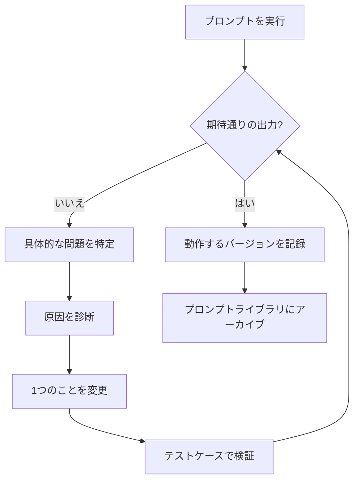

# レッスン5: プロンプトのデバッグと改善

> 学習目標:
> - プロンプトの問題を体系的に発見する方法を学ぶ
> - プロンプトが失敗する理由を診断する手法を身につける
> - プロンプトを改善するための反復可能なループを構築する
>
> 前提: [<< レッスン4: Chain-of-Thought: AIに推論を示させる](./04-chain-of-thought.md) | 次: [レッスン6 >>](./06-task-specific-strategies.md)

## プロンプトがうまくいかないときにすべきこと

役割、タスク、形式、例を含む丁寧なプロンプトを書いたのに、AIがまだ間違える。形式がずれていたり、内容がそれていたり、重要な情報が抜けていたりする。どうすればいいのか?

ランダムに数語を変えて、次の実行が幸運であることを願うのか? それとも問題を突き止めて意図的に修正するのか? このレッスンでは2つ目のアプローチを教える。コードをデバッグするようにプロンプトをデバッグする。症状を見つけ、原因を診断し、小さな変更を加え、結果を確認する。[^S8]

## 3ステップのデバッグループ

プロンプトのデバッグはコードのデバッグと非常に似ている。[^S8]

1. **問題を特定する**: 出力の何が具体的に間違っているのか?
2. **原因を診断する**: プロンプトのどの部分がその問題を引き起こしたのか?
3. **変更して検証する**: 1つのことを変更し、改善されたかどうかをテストする。

最も重要なルール: **一度に1つの変数を変更する**。3つのことを一度に変更すると、どの変更が効果をもたらしたのかわからなくなる。

### ステップ1: 具体的な問題を特定する

「出力が間違っている」では曖昧すぎる。実際に何が間違っているのかを正確に特定する。[^S8]

**よくある問題タイプ**:

| 問題タイプ | 症状 | 考えられる原因 |
|---------|---------|---------|
| 形式の誤り | JSONフィールド名がずれている、セクションが欠けている | 形式の指示が十分に具体的でない、または例が一致していない |
| 的外れな内容 | 無関係な質問に答えたり、トピックから逸れたりする | タスクの説明が不明確、または制約が薄い |
| 情報の欠落 | 重要な詳細が抜けている | 必要なものをすべてリストアップしていない |
| 過剰な内容 | 要求していない余分な内容を追加する | 「Xのみを出力し、Yは出力しない」という制約がない |
| 誤解 | AIがあなたの意図を誤って読み取った | 曖昧な表現、または明確化する例がない |
| 不安定性 | 実行ごとに結果が大きく変わる | プロンプトが緩すぎてAIに自由を与えすぎている |

**例: 問題の特定**

あなたのプロンプト:
```
この記事の重要なポイントを要約してください。
```

AIの出力:
```
この記事は3つの重要なポイントをカバーしています。第一に... 第二に... 最後に...
```

**特定された問題**: あなたが望んでいたリスト形式ではなく、何ポイントにするかも指定していない。

### ステップ2: 原因を診断する

プロンプトのどの部分(またはどの欠けている部分)が問題を引き起こしたかを見つける。

**診断チェックリスト**:

- **タスクは明確か?** 「重要なポイントを要約する」は曖昧。何ポイントにするか、各ポイントをどのくらいの長さにするかを言っていない。
- **形式の例はあるか?** ない。AIはあなたが望む形を推測するしかない。
- **制約は十分か?** 「ポイントのみを出力し、導入文は不要」とは言っていない。
- **曖昧な部分はあるか?** 「重要なポイント」は「核心的な主張」を意味するかもしれないし、「すべての主張」を意味するかもしれない。

診断: **形式の仕様と数の制約が欠けている**。

### ステップ3: 小さな変更を加え、検証する

一度に1つの問題を修正し、改善されたかどうかをテストする。

**変更1: 数と形式を明示する**
```
この記事を3つの箇条書きで要約してください。各ポイントは1文で。
```

テスト結果: 形式は正しいが、各ポイントが1文より長くなっている。

**変更2: 長さの制約を追加する**
```
この記事を3つの箇条書きで要約してください。

要件:
- 各ポイントは15語以内
- 箇条書き(- )リストを使用する
- ポイントのみを出力し、「重要なポイントは以下の通りです」のような導入文は不要
```

テスト結果: あなたが望んでいたものと一致する。

次回同じ問題に遭遇したときに再利用できるように、うまくいった変更を記録しておく。

```agentmentor-check
{
  "id": "prompt-engineering-debugging-identify-fix",
  "label": "プロンプトの問題を診断する",
  "prompt": "あなたのプロンプトは「リストをソートするPythonコードを書いてください」です。AIはバブルソートを提供しますが、あなたは組み込みのsorted()関数を使用してほしかった。プロンプトをどのように変更すべきですか?\n\nA: 「リストをソートするPythonコードを最もシンプルな方法で書いてください」\nB: 「Pythonの組み込みsorted()関数を使用してリストをソートするPythonコードを書いてください。ソートアルゴリズムを自分で実装しないでください」\nC: 「リストを迅速かつ効率的にソートするPythonコードを書いてください」\nD: 「リストをソートする高品質なPythonコードを書いてください」",
  "whyHere": "これは、デバッグの核心を理解しているかどうかを確認します。曖昧な形容詞に頼るのではなく、何が欲しいか、何が欲しくないかを明示することです。",
  "mode": "single",
  "choices": [
    {
      "id": "a",
      "text": "A - 「シンプル」を強調する",
      "correct": false,
      "feedback": "「シンプル」は主観的です。AIはバブルソートの方が行数が少なくロジックがシンプルだと判断し、依然としてバブルソートを提供するかもしれません。シンプル、速い、効率的などの形容詞は通常、十分に具体的ではありません。"
    },
    {
      "id": "b",
      "text": "B - sorted()を指名し、アルゴリズムを書くことを除外する",
      "correct": true,
      "feedback": "正解です。これは2つのことを行います。sorted()を明示的に指名し、アルゴリズムを手書きすることを除外します。何が欲しいか、何が欲しくないかを言ったので、推測する余地がありません。"
    },
    {
      "id": "c",
      "text": "C - 「迅速かつ効率的」を強調する",
      "correct": false,
      "feedback": "「迅速かつ効率的」は依然として曖昧です。AIは、sorted()を呼び出す代わりに、genuinely fastなクイックソート実装を提供するかもしれません。パフォーマンス目標ではなく、具体的な指示が必要です。"
    },
    {
      "id": "d",
      "text": "D - 「高品質」を強調する",
      "correct": false,
      "feedback": "「高品質」は広範すぎて何も解決しません。AIは、エラーハンドリング付きのよくコメントされたバブルソートを提供し、それを高品質と呼ぶかもしれません。問題は品質ではなく、手書きのアルゴリズムではなく組み込み関数が欲しいということです。"
    }
  ]
}
```

## よくある問題の診断と修正

### 問題1: 不安定な形式

**症状**: 時々JSON、時々プレーンテキスト。時々コロン、時々イコール記号。

**診断**: 形式の例がない、または例が互いに一致していない。

**修正**:
- すべてが全く同じ形式を使用する2〜3の例を提供する
- または制約で明示する: 「このJSON形式に正確に従い、それ以外は何も出力しないでください。」

### 問題2: 情報の欠落

**症状**: 出力にデータの一部のみがあり、常に特定のフィールドが抜けている。

**診断**: 必要な情報をリストアップしていない。

**修正**:
```
以下のすべてのフィールドを抽出してください(すべて必須):
1. タイトル
2. 著者
3. 公開日
4. 要約

フィールドがソースにない場合は、フィールドを省略するのではなく「提供されていません」と出力してください。
```

重要なのは、**すべての必須フィールドをリストアップし**、1つが欠けているときに何をすべきかを言うことです。

### 問題3: 過剰な説明

**症状**: コードを要求したのにコードと大量の説明が返ってきた。リストを要求したのに導入文と要約が周りに付いてきた。

**診断**: 「Xのみを出力する」という制約がない。

**修正**:
```
実行可能なコードのみを出力してください。説明、コメント、注記は不要です。
```

または:
```
リストのみを出力してください。「これがリストです」のような導入文や要約は不要です。
```

### 問題4: 意図の誤読

**症状**: AIがあなたの意図を誤読し、関連しているが間違った質問に答えた。

**診断**: 曖昧な表現、または文脈の欠落。

**例**:
```
このコードの問題を分析してください。
```

AIは以下を分析するかもしれない:
- スタイルの問題
- パフォーマンスの問題
- セキュリティの問題
- ロジックエラー

あなたはロジックエラーが欲しかったが、プロンプトはそう言っていなかった。

**修正**:
```
このコードのロジックエラーを分析してください。スタイルとパフォーマンスは無視し、間違った出力を生成するロジックバグのみに焦点を当ててください。
```

欲しい次元を指名し、残りを除外する。

## 反復のベストプラクティス

### プラクティス1: テストケースのセットを構築する

3〜5の代表的な入力を準備し、すべての変更に対してそれらすべてを実行する。[^S8]

**例**: 製品レビューから感情を抽出するプロンプトを調整している。

テストケース:
1. 明らかにポジティブ: 「とても満足しています。強くお勧めします。」
2. 明らかにネガティブ: 「完全に使用不可能、お金の無駄。」
3. 中立/混合: 「問題なく動作しますが、少し高価です。」
4. エッジケース: 「まあ大丈夫だと思います。」
5. 複雑: 「サポートは素晴らしかったですが、製品品質は平凡です。」

プロンプトを変更するたびに、5つすべてを実行し、すべてが正しく分類されるかどうかを確認する。

### プラクティス2: バージョンと結果を追跡する

コードのバージョンを管理するように、プロンプトのバージョンを管理する。[^S8]

**シンプルなログ**:
```
v1 (2024-01-15):
レビューの感情を抽出してください。

結果:
- 明確なケースはOK
- エッジケースは不安定

---

v2 (2024-01-15):
レビューを「ポジティブ」、「ネガティブ」、または「中立」に分類してください。
例: [3つの例]

結果:
- エッジケースは改善
- しかし出力形式が一貫していない(時々「ポジティブ」、時々「Positive」)

---

v3 (2024-01-15):
[v2の内容] + 制約: 小文字のpositive、negative、neutralのいずれか1つを正確に出力してください。

結果: すべてのテストケースをパス
```

これで、各変更が何をもたらしたかがわかり、新しいバージョンが悪化した場合は最後の良いバージョンにロールバックできる。

### プラクティス3: 確信が持てない変更をA/Bテストする

変更が実際に役立つかどうか確信が持てない? 両方のバージョンを保持し、それぞれを10回実行して、成功率を比較する。これがA/Bテスト: 一度に1つの要因を変更し、データに決めさせる。

**例**: 「段階的に考えましょう」を追加することが本当に役立つかどうか確信が持てない。

- バージョンA(なし): 10回実行、7回正解
- バージョンB(CoTあり): 10回実行、9回正解

データが物語る。Bの方が良い。

### プラクティス4: シンプルなバージョンから始める

500語の巨大なプロンプトから始めない。最もシンプルなバージョンから始め、進むにつれて制約を追加する。[^S8]

**反復パス**:
```
v1: この記事を要約してください。
   -> 曖昧すぎる

v2: この記事の核心的なポイントを3つの箇条書きで要約してください。
   -> 箇条書きが長すぎる

v3: 核心的なポイントを3つの箇条書きで要約してください。各15語以内。
   -> 形式がまだ一貫していない

v4: [v3] + 箇条書きリストを使用し、導入文なしでポイントのみを出力してください。
   -> うまくいく
```

各ステップは正確に1つの問題を修正し、フィラーのない、ちょうど十分なプロンプトになる。

## デバッグループ、最初から最後まで

完全なループはサイクルです: プロンプトを実行し、出力を確認し、一致しない場合は、問題を特定し、原因を診断し、1つのことを変更し、テストケースで検証し、一致するまで繰り返し、次に動作するバージョンを記録します。

以下の図は、そのループの各ステップを示しています:



**核心原則**:
- 一度に1つのことを変更する
- すべての変更をテストケースで検証する
- バージョンとその結果を追跡する
- シンプルから始め、必要に応じて制約を追加する

## チューニングをいつ止めるか

プロンプトのチューニングには自然な終わりはないが、十分な良さのバーがある:

**止めても良い兆候**:
- テストケースでの成功率が90%以上
- 出力形式が安定している
- プロンプトのすべての部分が何をするか説明できる
- 次の改善にかかる時間がその価値を超える

**続けるべき兆候**:
- 成功率が70%未満
- 同じ入力が実行ごとに大きく異なる出力を生成する
- プロンプトの一部が何をするかわからない
- エッジケースで失敗し続ける

実用的なルール: **十分良ければ十分、完璧を追求しない**。90%の時間でうまくいくなら、残りの10%のエッジケースには人間が介入できる。

## まとめ

プロンプトのデバッグループは: 具体的な問題を特定し、原因を診断し、小さな変更を加え、検証する。重要なのは、一度に1つの変数を変更し、すべての変更をテストケースで検証し、バージョンと結果を追跡することです。

よくある問題には、不安定な形式、情報の欠落、過剰な説明、意図の誤読が含まれます。それぞれに対応する修正があります: 例を追加し、フィールドをリストアップし、「のみを出力」制約を追加し、曖昧さを除外します。

シンプルなバージョンから始め、テストケースでの成功率が90%を超えるまで制約を追加します。うまくいくプロンプトのバージョンを記録して、次回再利用できるようにします。

次のレッスンでは、異なるタスクタイプのプロンプト戦略を扱います: コード生成、ドキュメント作成、データ分析に特有なものは何か。

**次のレッスン** [異なるタスクのプロンプト戦略 >>](./06-task-specific-strategies.md)

<!-- exercises -->

## 💻 演習

### レベル1: プロンプトの問題を診断する

以下は壊れたプロンプトとAIの出力です。問題を特定し、修正を提案してください。

**プロンプト**:
```
この記事の重要なポイントを要約してください。
```

**AIの出力**(3回の別々の実行):
- 実行1: 200語の散文要約
- 実行2: 5つの箇条書き
- 実行3: 1行の要約と3段落の詳細

**問題**: 出力形式が不安定で、実行ごとに異なる。

<!-- rubric -->
- 根本原因を正しく特定している(形式制約がない)
- 修正に明示的な形式要件が含まれている
- 修正に数や長さなどの具体的な制約が指定されている
- 除外制約(「Xのみを出力し、Yは出力しない」)を考慮している
- 修正されたプロンプトが不安定性を取り除いている

<!-- answer -->
**診断**:
1. **根本原因**: プロンプトは出力形式を指定していないため、AIは毎回要約方法を決定する
2. **具体的に欠けているもの**:
   - 何ポイントにするか言っていない
   - 各ポイントをどのくらいの長さにするか言っていない
   - どの形式(リスト、段落、表)か言っていない
   - 導入文を含めるかどうか言っていない

**修正**:

```
この記事の核心的なポイントを3つの箇条書きで要約してください。

要件:
- 正確に3つのポイント、箇条書き(- )リストで
- 各ポイントは1文、20語以内
- ポイントのみを出力し、「重要なポイントは:」のような導入文は不要
- 重要度の高い順に並べる

記事:
[記事を貼り付け]
```

**なぜこれがうまくいくか**:
- 「正確に3つのポイント」が数の不確実性を取り除く
- 「箇条書きリストで」が形式を固定する
- 「1文、20語以内」が長さをコントロールする
- 「ポイントのみを出力」が導入文を除外する
- すべての実行が同じ形(3つの短い行のリスト)を生成するようになる

<!-- hint -->
不安定な出力は通常、プロンプトがAIに多くの選択肢を与えすぎていることを意味します。自問してください: プロンプトのどこでAIが即興できるか? 次にそれらの場所を固定します。
<!-- hint -->
「Xのみを出力し、Yは出力しない」制約を使用して、欲しくないものを除外します。例えば: 導入文なし、説明なし、例なし。

### レベル2: 実際のプロンプトを反復する

自分で書いたプロンプトを選び(または以下のシナリオを使用し)、3ラウンドの反復で改善してください。

**シナリオ**: 会議メモからアクションアイテムを抽出するようAIに依頼する。

**要件**:
1. v1を書く(最初のプロンプト)
2. テストし、問題を見つけ、v2を書く(1つの主要な問題を修正)
3. 再度テストし、新しい問題を見つけ、v3を書く(最終版)
4. 各変更が何を修正したかを説明する

<!-- rubric -->
- v1は妥当な最初の試みであり、意図的に悪くはない
- v2は実際のv1の問題に対する具体的な改善を行う(完全な書き直しではない)
- v3はさらに改善し、使用可能な基準に達する
- 各反復で次を述べている: 見つかった問題、何を変更したか、なぜそのように変更したか
- 最終版は形式、完全性、エッジケースを考慮している

<!-- answer -->
**v1: 最初のバージョン**

```
会議メモからアクションアイテムを抽出してください。
```

**テストの問題**:
- AIはすでに完了したものや議論のみされたものを含め、言及されたすべてのタスクを抽出した
- 担当者や期日がない
- 一貫性のない形式(時々リスト、時々段落)

---

**v2: 形式とフィールドを追加**

```
会議メモからアクションアイテムを抽出してください。各項目について以下を含めてください: タスク、担当者、期日。

出力形式:
- [タスクの説明] | 担当者: [名前] | 期日: [日付]

会議メモ:
[メモを貼り付け]
```

**テストの問題**:
- AIは「Xをするかどうか議論する」のような未決定の項目を抽出した
- 一部のアクションアイテムにはメモに担当者がなく、AIが発明した
- 一部の期日は「来週」であり、AIは日付に変換しなかった

---

**v3: 最終版(明示的なルール付き)**

```
会議メモから確認されたアクションアイテムを抽出してください。

抽出ルール:
- 明確に決定されたタスクのみを抽出(「決定」、「確認」、「アクションアイテム」などの言葉)
- 除外: まだ議論中、すでに完了、却下
- フィールド(担当者または期日)がメモにない場合は、「未定」を出力し、推測しない

出力形式:
1行に1つのアクションアイテム、この形式で:
- [タスクの説明、1文] | 担当者: [名前/未定] | 期日: [YYYY-MM-DD/未定]

会議メモ:
[メモを貼り付け]
```

**反復の要約**:

| バージョン | 主な問題 | 何を変更したか | 何を修正したか |
|------|---------|---------|-----------|
| v1 | 乱雑な出力、不完全な情報 | 出力形式と必須フィールドを追加 | 一貫した形式、重要な情報を含む |
| v2 | 間違った項目を抽出、情報を発明 | 抽出ルールと欠損値処理を追加 | 確認されたタスクのみ、捏造データなし |
| v3 | - | 最終使用可能版 | 正確、完全、一貫した形式 |

**重要なポイント**:
1. 最初のバージョンは、AIに決めさせるのではなく、形式を固定する
2. 2番目のバージョンは、欲しいものと欲しくないものを明確にするルールを追加する
3. 3番目のバージョンは、エッジケース(欠損値、曖昧な表現)を処理する
4. 一度に1つの主要な問題を変更し、次の変更の前にテストする

<!-- hint -->
実際のチューニングは: プロンプトを書き、テストし、問題を見つけ、1つのことを変更し、再びテストする。3つのことを一度に変更しないでください。どの変更がうまくいったかわからなくなります。
<!-- hint -->
各バージョンの結果(成功率、よくあるエラー)をログに記録して、改善しているか後退しているかを知ることができます。v3がv2より悪い場合は、v2にロールバックして別の角度を試してください。

<!-- /exercises -->
