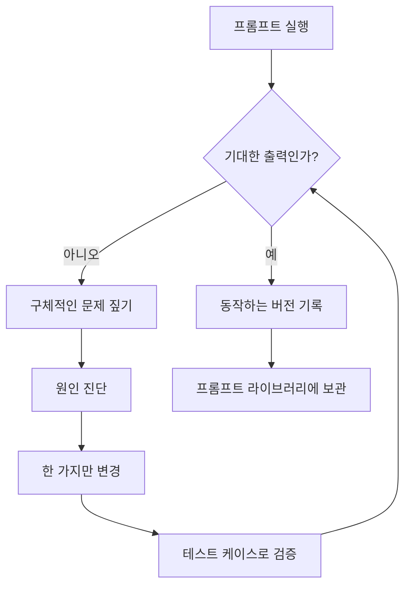

# 레슨 5: 프롬프트 디버깅과 개선

> 학습 목표:
> - 프롬프트의 문제를 체계적으로 짚어내기
> - 프롬프트가 실패하는 원인을 진단하는 방법 세우기
> - 프롬프트를 개선하는 반복 루프 만들기
>
> 전제: [<< 레슨 4: Chain-of-Thought: AI가 추론 과정을 보여주게 하기](./04-chain-of-thought.md) | 다음: [레슨 6 >>](./06-task-specific-strategies.md)

## 프롬프트가 통하지 않을 때 할 일

역할, 작업, 형식, 예시까지 꼼꼼히 넣어 프롬프트를 썼는데도 AI가 여전히 엉뚱한 결과를 냅니다. 형식이 어긋났거나, 내용이 옆길로 샜거나, 핵심 정보가 빠졌을 수도 있습니다. 이제 어떻게 해야 할까요?

단어 몇 개를 아무렇게나 바꾸고 다음번엔 운이 따르기를 바랄까요? 아니면 문제를 추적해 의도적으로 고칠까요? 이 레슨은 두 번째 방법을 다룹니다. 코드를 디버깅하듯 프롬프트를 디버깅하는 것입니다. 증상을 짚고, 원인을 진단하고, 작게 바꾸고, 결과를 확인합니다.[^S8]

## 3단계 디버깅 루프

프롬프트를 디버깅하는 일은 코드를 디버깅하는 일과 상당히 닮았습니다.[^S8]

1. **문제 짚기**: 출력의 정확히 무엇이 잘못됐는가?
2. **원인 진단**: 프롬프트의 어느 부분이 그 문제를 만들었는가?
3. **변경과 검증**: 한 가지만 바꾸고, 나아졌는지 테스트한다.

가장 중요한 규칙: **한 번에 변수 하나씩만 바꾼다**. 세 가지를 한꺼번에 바꾸면 어느 변경이 효과를 냈는지 알 수 없습니다.

### 1단계: 구체적인 문제 짚기

'출력이 잘못됐다'는 너무 막연합니다. 실제로 무엇이 잘못됐는지 못박으세요.[^S8]

**흔한 문제 유형**:

| 문제 유형 | 어떻게 나타나는가 | 유력한 원인 |
|---------|---------|---------|
| 형식 오류 | JSON 필드명이 어긋남, 한 섹션이 통째로 빠짐 | 형식 지시가 충분히 구체적이지 않거나, 예시끼리 어긋남 |
| 내용 이탈 | 상관없는 질문에 답함, 주제에서 벗어남 | 작업 설명이 불분명하거나, 제약이 빈약함 |
| 정보 누락 | 핵심 세부 정보를 빠뜨림 | 필요한 것을 빠짐없이 나열하지 않음 |
| 과잉 생성 | 요청하지 않은 내용을 덧붙임 | 'Y가 아니라 X만 출력' 제약이 없음 |
| 의도 오해 | AI가 의도를 잘못 읽음 | 표현이 모호하거나, 분명히 해 줄 예시가 없음 |
| 불안정 | 실행할 때마다 결과가 크게 달라짐 | 프롬프트가 너무 헐거워 AI에게 자유를 지나치게 많이 줌 |

**예시: 문제 짚기**

당신의 프롬프트:
```
이 글의 핵심을 요약해 줘.
```

AI의 출력:
```
이 글은 세 가지 핵심을 다룹니다. 첫째... 둘째... 마지막으로...
```

**짚어낸 문제**: 원하던 목록 형식이 아니고, 핵심을 몇 개로 뽑을지도 말한 적이 없습니다.

### 2단계: 원인 진단

프롬프트의 어느 부분이(또는 빠진 어느 부분이) 그 문제를 일으켰는지 찾습니다.

**진단 체크리스트**:

- **작업이 명확한가?** '핵심을 요약해 줘'는 뭉뚱그려져 있습니다. 핵심을 몇 개로 뽑을지도, 각각을 얼마나 길게 쓸지도 말하지 않았습니다.
- **형식 예시가 있는가?** 없습니다. AI는 어떤 모양을 원하는지 추측할 수밖에 없습니다.
- **제약이 충분한가?** '도입부 없이 핵심만 출력'이라는 말이 어디에도 없습니다.
- **모호한 부분이 있는가?** '핵심'은 '핵심 주장'일 수도, '모든 주장'일 수도 있습니다.

진단: **형식 명세와 개수 제약이 빠졌습니다**.

### 3단계: 작게 바꾸고 검증하기

한 번에 문제 하나씩 고치고, 나아졌는지 테스트합니다.

**변경 1: 개수와 형식 명시**
```
이 글을 세 개의 불릿으로, 각각 한 문장씩 요약해 줘.
```

테스트 결과: 형식은 맞지만, 각 항목이 한 문장보다 길게 나옵니다.

**변경 2: 길이 제약 추가**
```
이 글을 세 개의 불릿으로 요약해 줘.

요구사항:
- 각 항목은 30자 이내
- 불릿(- ) 목록 사용
- '핵심은 다음과 같습니다' 같은 도입부 없이 항목만 출력
```

테스트 결과: 원하던 대로 나옵니다.

효과가 있었던 변경은 기록해 두세요. 다음에 같은 문제를 만났을 때 다시 쓸 수 있습니다.

```agentmentor-check
{
  "id": "prompt-engineering-debugging-identify-fix",
  "label": "프롬프트 문제 진단",
  "prompt": "당신의 프롬프트는 '리스트를 정렬하는 파이썬 코드를 작성해 줘'입니다. AI는 버블 정렬을 내놓았지만, 당신이 원한 것은 내장 sorted() 함수를 쓰는 코드였습니다. 프롬프트를 어떻게 바꿔야 할까요?\n\nA: '리스트를 가능한 한 가장 단순한 방법으로 정렬하는 파이썬 코드를 작성해 줘'\nB: '파이썬 내장 sorted() 함수를 사용해 리스트를 정렬하는 코드를 작성해 줘. 정렬 알고리즘을 직접 구현하지 마'\nC: '리스트를 빠르고 효율적으로 정렬하는 파이썬 코드를 작성해 줘'\nD: '리스트를 정렬하는 고품질 파이썬 코드를 작성해 줘'",
  "whyHere": "디버깅의 핵심을 잡았는지 점검합니다. 모호한 형용사에 기대는 대신 원하는 것과 원하지 않는 것을 말하는 것입니다.",
  "mode": "single",
  "choices": [
    {
      "id": "a",
      "text": "A - '가장 단순한'을 강조",
      "correct": false,
      "feedback": "아닙니다. '가장 단순한'은 주관적입니다. AI는 버블 정렬이 줄 수도 적고 로직도 단순하다고 판단할 수 있고, 그러면 여전히 버블 정렬을 받게 됩니다. 단순하다, 빠르다, 효율적이다 같은 형용사는 대개 충분히 구체적이지 않습니다."
    },
    {
      "id": "b",
      "text": "B - sorted()를 지정하고 알고리즘 직접 작성을 배제",
      "correct": true,
      "feedback": "정답입니다. 이 프롬프트는 두 가지를 합니다. sorted()를 명시적으로 지정하고, 알고리즘을 손으로 짜는 선택지를 배제합니다. 원하는 것과 원하지 않는 것을 모두 말했으므로 추측할 여지가 남지 않습니다."
    },
    {
      "id": "c",
      "text": "C - '빠르고 효율적'을 강조",
      "correct": false,
      "feedback": "아닙니다. '빠르고 효율적'도 여전히 모호합니다. AI는 sorted()를 호출하는 대신 실제로 빠른 퀵 정렬 구현을 건네줄 수도 있습니다. 성능 목표가 아니라 구체적인 지시가 필요합니다."
    },
    {
      "id": "d",
      "text": "D - '고품질'을 강조",
      "correct": false,
      "feedback": "아닙니다. '고품질'은 너무 넓어서 아무것도 해결하지 못합니다. AI는 주석이 잘 달리고 에러 처리까지 갖춘 버블 정렬을 건네주면서 그것을 고품질이라 할 수도 있습니다. 문제는 품질이 아니라, 손으로 짠 알고리즘이 아닌 내장 함수를 원한다는 점입니다."
    }
  ]
}
```

## 흔한 문제의 진단과 해결

### 문제 1: 형식이 불안정함

**증상**: 어떨 때는 JSON, 어떨 때는 평문. 어떨 때는 콜론, 어떨 때는 등호.

**진단**: 형식 예시가 없거나, 예시끼리 서로 맞지 않습니다.

**해결**:
- 완전히 같은 형식을 쓰는 예시를 2~3개 제공하세요
- 또는 제약에 명시하세요: '이 JSON 형식을 정확히 따르고 그 밖의 것은 출력하지 마세요.'

### 문제 2: 정보 누락

**증상**: 출력에 데이터의 일부만 담기고, 특정 필드가 늘 빠집니다.

**진단**: 필요한 정보를 나열한 적이 없습니다.

**해결**:
```
다음 필드를 모두 추출하세요(전부 필수):
1. 제목
2. 저자
3. 게시일
4. 요약

원문에 없는 필드는 생략하지 말고 '미제공'이라고 출력하세요.
```

핵심은 **필요한 필드를 빠짐없이 나열하고**, 빠졌을 때 어떻게 할지를 말해 주는 것입니다.

### 문제 3: 과잉 설명

**증상**: 코드를 요청했더니 코드에 설명이 잔뜩 딸려 옵니다. 목록을 요청했더니 앞뒤로 도입부와 마무리가 감싸고 있습니다.

**진단**: 'X만 출력' 제약이 없습니다.

**해결**:
```
실행 가능한 코드만 출력하세요. 설명, 주석, 부연은 넣지 마세요.
```

또는:
```
목록만 출력하세요. '목록은 다음과 같습니다' 같은 도입부와 마무리 요약은 넣지 마세요.
```

### 문제 4: 의도 오해

**증상**: AI가 의도를 잘못 읽고, 관련은 있지만 엉뚱한 질문에 답했습니다.

**진단**: 표현이 모호하거나, 맥락이 빠졌습니다.

**예시**:
```
이 코드의 문제를 분석해 줘.
```

AI는 이런 것들을 분석할 수 있습니다:
- 스타일 문제
- 성능 문제
- 보안 문제
- 로직 오류

당신이 원한 것은 로직 오류인데, 프롬프트는 그렇게 말한 적이 없습니다.

**해결**:
```
이 코드의 로직 오류를 분석해 줘. 스타일과 성능은 무시하고, 잘못된 출력을 만들어 낼 로직 버그에만 집중해.
```

원하는 차원을 지목하고 나머지는 배제하세요.

## 반복 개선의 모범 사례

### 사례 1: 테스트 케이스 묶음 만들기

대표적인 입력을 3~5개 준비해 두고, 변경할 때마다 전부에 대해 돌려 보세요.[^S8]

**예시**: 제품 리뷰에서 감정을 추출하는 프롬프트를 다듬고 있다고 합시다.

테스트 케이스:
1. 명확한 긍정: '아주 만족합니다, 강력 추천해요.'
2. 명확한 부정: '완전히 못 쓰겠어요, 돈만 버렸습니다.'
3. 중립·혼합: '쓸 만한데 가격이 조금 비싸요.'
4. 엣지 케이스: '뭐 그럭저럭이네요.'
5. 복합: '고객 응대는 훌륭했지만 제품 품질은 그저 그렇습니다.'

프롬프트를 바꿀 때마다 다섯 개를 모두 돌려 전부 올바르게 분류되는지 확인하세요.

### 사례 2: 버전과 결과 기록하기

코드 버전을 관리하듯 프롬프트 버전을 관리하세요.[^S8]

**간단한 기록**:
```
v1 (2024-01-15):
리뷰의 감정을 추출해 줘.

결과:
- 명확한 케이스는 OK
- 엣지 케이스가 불안정

---

v2 (2024-01-15):
리뷰를 "positive", "negative", "neutral" 중 하나로 분류해 줘.
예시: [예시 3개]

결과:
- 엣지 케이스는 개선됨
- 그러나 출력 형식이 일관되지 않음(어떨 때는 "positive", 어떨 때는 "Positive")

---

v3 (2024-01-15):
[v2 내용] + 제약: 소문자 positive, negative, neutral 중 정확히 하나만 출력해 줘.

결과: 모든 테스트 케이스 통과
```

이제 각 변경이 무엇을 가져다주었는지 알 수 있고, 새 버전이 더 나빠지면 마지막으로 좋았던 버전으로 되돌릴 수 있습니다.

### 사례 3: 확신이 서지 않는 변경은 A/B 테스트하기

어떤 변경이 정말 도움이 되는지 확신이 서지 않나요? 두 버전을 모두 남겨 두고 각각 10번씩 돌린 뒤 성공률을 비교하세요. 그것이 A/B 테스트입니다. 한 번에 한 가지 요인만 바꾸고 데이터가 판단하게 하는 것입니다.

**예시**: "let's think step by step"을 추가하는 것이 정말 효과가 있는지 확신이 서지 않습니다.

- 버전 A(없이): 10회 실행, 7회 정답
- 버전 B(CoT 적용): 10회 실행, 9회 정답

데이터가 말해 줍니다. B가 더 낫습니다.

### 사례 4: 단순한 버전에서 출발하기

500단어짜리 괴물 프롬프트로 시작하지 마세요. 가장 단순한 버전에서 출발해 필요할 때마다 제약을 더하세요.[^S8]

**반복 개선 경로**:
```
v1: 이 글을 요약해 줘.
   -> 너무 막연함

v2: 이 글의 핵심을 세 개의 불릿으로 요약해 줘.
   -> 불릿이 너무 길어짐

v3: 핵심을 세 개의 불릿으로, 각각 30자 이내로 요약해 줘.
   -> 형식이 여전히 들쭉날쭉함

v4: [v3] + 불릿 목록을 사용하고, 도입부 없이 항목만 출력해 줘.
   -> 잘 동작함
```

각 단계가 정확히 문제 하나씩을 고치고, 결국 군더더기 없이 딱 필요한 만큼의 프롬프트가 남습니다.

## 디버깅 루프 전체 흐름

전체 흐름은 하나의 순환입니다. 프롬프트를 실행하고, 출력을 확인하고, 기대와 맞지 않으면 문제를 짚고, 원인을 진단하고, 한 가지를 바꾸고, 테스트 케이스로 검증하고, 맞을 때까지 반복한 뒤, 동작하는 버전을 기록합니다.

아래 다이어그램이 그 루프의 각 단계를 보여줍니다:



**핵심 원칙**:
- 한 번에 하나씩 바꾼다
- 모든 변경을 테스트 케이스로 검증한다
- 버전과 그 결과를 기록한다
- 단순하게 시작해 필요한 만큼 제약을 더한다

## 언제 다듬기를 멈출 것인가

프롬프트 다듬기에는 자연스러운 끝이 없지만, 충분히 좋다고 할 기준선은 있습니다:

**멈춰도 되는 신호**:
- 테스트 케이스 성공률이 90% 이상
- 출력 형식이 안정적
- 프롬프트의 각 부분이 무슨 일을 하는지 설명할 수 있음
- 다음 개선에 드는 시간이 그 값어치보다 큼

**계속해야 하는 신호**:
- 성공률이 70% 아래
- 같은 입력인데 실행할 때마다 출력이 크게 달라짐
- 프롬프트의 어떤 부분이 실제로 하는 일이 있는지 확신이 없음
- 엣지 케이스에서 계속 실패함

실용적인 규칙: **충분히 좋으면 충분하다. 완벽을 좇지 말자**. 90% 정도 잘 동작한다면, 남은 10%의 엣지 케이스는 사람이 손을 대면 됩니다.

## 정리

프롬프트 디버깅 루프는 구체적인 문제를 짚고, 원인을 진단하고, 작게 바꾸고, 검증하는 것이다. 핵심은 한 번에 변수 하나씩만 바꾸고, 모든 변경을 테스트 케이스로 검증하며, 버전과 결과를 기록하는 것이다.

흔한 문제로는 형식 불안정, 정보 누락, 과잉 설명, 의도 오해가 있다. 각각에는 대응하는 해법이 있다. 예시 추가, 필드 나열, '만 출력' 제약 추가, 모호함 배제다.

단순한 버전에서 출발해 테스트 케이스 성공률이 90%를 넘을 때까지 제약을 더해 나간다. 잘 통한 프롬프트 버전은 기록해 두었다가 다음에 다시 쓴다.

다음 레슨에서는 작업 유형별 프롬프트 전략을 다룹니다. 코드 생성, 문서 작성, 데이터 분석에는 각각 무엇이 다른지 살펴봅니다.

**다음 레슨** [작업 유형별 프롬프트 전략 >>](./06-task-specific-strategies.md)

<!-- exercises -->

## 💻 연습

### 레벨 1: 프롬프트 문제 진단하기

아래는 망가진 프롬프트와 AI의 출력입니다. 문제를 짚어내고 해결책을 제안하세요.

**프롬프트**:
```
이 글의 핵심을 요약해 줘.
```

**AI 출력**(세 번 따로 실행):
- 1회차: 200단어 분량의 산문 요약
- 2회차: 불릿 5개
- 3회차: 한 줄 요약에 세 문단짜리 상세 설명

**문제**: 출력 형식이 불안정하고 실행할 때마다 다릅니다.

<!-- rubric -->
- 근본 원인을 정확히 짚어냈다(형식 제약 없음)
- 해결책에 명시적인 형식 요구사항을 담았다
- 해결책이 개수와 길이 같은 구체적 제약을 지정했다
- 배제 제약('Y가 아니라 X만 출력')을 고려했다
- 고친 프롬프트가 불안정성을 없앤다

<!-- answer -->
**진단**:
1. **근본 원인**: 프롬프트가 출력 형식을 지정하지 않아, AI가 매번 요약 방식을 스스로 정합니다
2. **구체적으로 빠진 것**:
   - 핵심을 몇 개로 뽑을지 말하지 않음
   - 각 항목을 얼마나 길게 쓸지 말하지 않음
   - 어떤 형식인지(목록, 문단, 표) 말하지 않음
   - 도입부를 넣을지 말지 말하지 않음

**해결책**:

```
이 글의 핵심을 세 개의 불릿으로 요약해 줘.

요구사항:
- 정확히 3개 항목, 불릿(- ) 목록으로
- 각 항목은 1문장, 40자 이내
- '핵심은 다음과 같습니다:' 같은 도입부 없이 항목만 출력
- 중요한 순서대로 배열

글:
[글 붙여넣기]
```

**이 해결책이 통하는 이유**:
- '정확히 3개 항목'이 개수의 불확실성을 없앱니다
- '불릿 목록으로'가 형식을 고정합니다
- '1문장, 40자 이내'가 길이를 통제합니다
- '항목만 출력'이 도입부를 배제합니다
- 이제 실행할 때마다 같은 모양(짧은 세 줄의 목록)이 나옵니다

<!-- hint -->
출력이 불안정하다는 것은 대개 프롬프트가 AI에게 선택지를 너무 많이 준다는 뜻입니다. 스스로 물어보세요. 내 프롬프트의 어디에서 AI가 즉흥적으로 정할 수 있는가? 그런 자리를 못박으세요.
<!-- hint -->
'Y가 아니라 X만 출력' 제약으로 원하지 않는 것을 배제하세요. 예를 들면 도입부 없이, 설명 없이, 예시 없이입니다.

### 레벨 2: 실제 프롬프트 반복 개선하기

직접 쓴 프롬프트를 하나 고르거나(또는 아래 시나리오를 사용해) 3회에 걸쳐 개선하세요.

**시나리오**: AI가 회의록에서 액션 아이템을 추출하게 합니다.

**요구사항**:
1. v1(첫 프롬프트) 작성
2. 테스트하고 문제를 찾아 v2 작성(주요 문제 하나 해결)
3. 다시 테스트하고 새 문제를 찾아 v3 작성(최종 버전)
4. 각 변경이 무엇을 고쳤는지 설명

<!-- rubric -->
- v1이 일부러 나쁘게 쓴 것이 아니라 합리적인 첫 시도다
- v2가 v1의 실제 문제 하나를 구체적으로 개선했다(전면 재작성이 아니다)
- v3가 더 개선되어 쓸 만한 수준에 도달했다
- 각 반복마다 찾은 문제, 바꾼 것, 그렇게 바꾼 이유를 서술했다
- 최종 버전이 형식·완결성·엣지 케이스를 함께 고려했다

<!-- answer -->
**v1: 첫 버전**

```
이 회의록에서 액션 아이템을 추출해 줘.
```

**테스트에서 드러난 문제**:
- AI가 언급된 모든 작업을 끌어왔습니다. 이미 끝난 것과 논의만 한 것까지 포함해서요
- 담당자와 마감일이 없습니다
- 형식이 일관되지 않습니다(어떨 때는 목록, 어떨 때는 문단)

---

**v2: 형식과 필드 추가**

```
회의록에서 액션 아이템을 추출해 줘. 각 항목에 작업, 담당자, 마감일을 포함해.

출력 형식:
- [작업 설명] | 담당: [이름] | 마감: [날짜]

회의록:
[회의록 붙여넣기]
```

**테스트에서 드러난 문제**:
- AI가 'X를 할지 논의'처럼 결정되지 않은 항목까지 끌어왔습니다
- 회의록에 담당자가 없는 액션 아이템에 AI가 담당자를 지어냈습니다
- 마감일이 '다음 주'인 경우 AI가 날짜로 변환하지 않았습니다

---

**v3: 최종 버전(명시적 규칙 포함)**

```
회의록에서 확정된 액션 아이템을 추출해 줘.

추출 규칙:
- 명확히 결정된 작업만 추출('결정', '확정', '액션 아이템' 같은 표현)
- 제외: 아직 논의 중, 이미 완료, 기각된 것
- 회의록에 없는 필드(담당자 또는 마감일)는 'TBD'로 출력하고 추측하지 마

출력 형식:
액션 아이템 하나당 한 줄, 다음 형식으로:
- [작업 설명, 한 문장] | 담당: [이름/TBD] | 마감: [YYYY-MM-DD/TBD]

회의록:
[회의록 붙여넣기]
```

**반복 개선 요약**:

| 버전 | 주요 문제 | 바꾼 것 | 고쳐진 것 |
|------|---------|---------|-----------|
| v1 | 출력이 어수선하고 정보 불완전 | 출력 형식과 필수 필드 추가 | 형식 일관, 핵심 정보 포함 |
| v2 | 엉뚱한 항목 추출, 정보 지어냄 | 추출 규칙과 결측값 처리 추가 | 확정된 작업만, 지어낸 데이터 없음 |
| v3 | - | 쓸 만한 최종 버전 | 정확하고, 빠짐없고, 형식 일관 |

**핵심 교훈**:
1. 첫 버전은 AI가 알아서 정하게 두지 말고 형식을 못박습니다
2. 두 번째 버전은 원하는 것과 원하지 않는 것을 명시하는 규칙을 더합니다
3. 세 번째 버전은 엣지 케이스(결측값, 모호한 표현)를 처리합니다
4. 한 번에 주요 문제 하나씩 바꾸고, 다음 변경 전에 테스트합니다

<!-- hint -->
실제 다듬기란 프롬프트를 쓰고, 테스트하고, 문제를 찾고, 한 가지를 바꾸고, 다시 테스트하는 것입니다. 세 가지를 한꺼번에 바꾸면 어느 변경이 통했는지 알 수 없습니다.
<!-- hint -->
각 버전의 결과(성공률, 자주 나온 오류)를 기록해 두면 나아지고 있는지 뒷걸음질하고 있는지 알 수 있습니다. v3가 v2보다 나쁘면 v2로 되돌리고 다른 각도로 시도하세요.

<!-- /exercises -->

