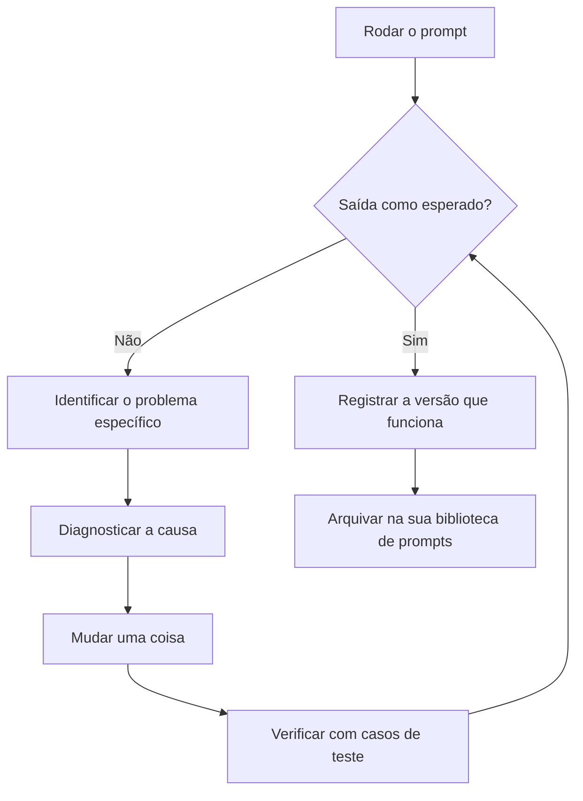

# Lição 5: Depuração e melhoria de prompts

> Objetivos de aprendizado:
> - Aprender a identificar problemas de prompt de forma sistemática
> - Construir um método para diagnosticar por que um prompt falha
> - Montar um ciclo repetível de melhoria de prompts
>
> Pré-requisitos: [<< Lição 4: Chain-of-Thought: fazendo a IA mostrar seu raciocínio](./04-chain-of-thought.md) | Próxima: [Lição 6 >>](./06-task-specific-strategies.md)

## O que fazer quando um prompt não funciona

Você escreveu um prompt caprichado, com papel, tarefa, formato e exemplos, e mesmo assim a IA erra. Talvez o formato saia torto, o conteúdo tenha desviado, ou falte uma informação essencial. E agora?

Mudar algumas palavras no chute e torcer para a próxima rodada dar mais sorte? Ou rastrear o problema e corrigi-lo de propósito? Esta lição ensina a segunda abordagem: depurar um prompt do mesmo jeito que você depura código. Identifique o sintoma, diagnostique a causa, faça uma mudança pequena e confira o resultado.[^S8]

## O ciclo de depuração em três passos

Depurar um prompt funciona muito parecido com depurar código.[^S8]

1. **Identificar o problema**: o que exatamente está errado na saída?
2. **Diagnosticar a causa**: qual parte do prompt produziu esse problema?
3. **Mudar e verificar**: mude uma coisa e depois teste se melhorou.

A regra que mais importa: **mude uma variável de cada vez**. Se você mudar três coisas de uma vez, não vai saber qual delas fez o trabalho.

### Passo 1: identificar o problema específico

“A saída está errada” é vago demais. Determine o que de fato está errado.[^S8]

**Tipos comuns de problema**:

| Tipo de problema | Como ele aparece | Causa provável |
|---------|---------|---------|
| Formato errado | Nomes de campo do JSON fora do padrão, falta uma seção | Instruções de formato pouco específicas, ou exemplos que se contradizem |
| Conteúdo fora do alvo | Responde a outra pergunta, foge do assunto | Descrição da tarefa pouco clara, ou restrições fracas |
| Informação faltando | Deixa de fora algum detalhe importante | Você nunca listou tudo o que precisa |
| Excesso | Acrescenta conteúdo que você não pediu | Falta a restrição “devolva só X, não Y” |
| Mal-entendido | A IA leu errado a sua intenção | Redação ambígua, ou nenhum exemplo para esclarecer |
| Instabilidade | Os resultados variam muito de execução para execução | Prompt frouxo demais, dando liberdade demais à IA |

**Exemplo: identificando o problema**

Seu prompt:
```
Resuma os pontos principais deste artigo.
```

A saída da IA:
```
Este artigo cobre três pontos principais. Primeiro... Segundo... Por fim...
```

**Problema identificado**: não é o formato de lista que você queria, e você nunca disse quantos pontos.

### Passo 2: diagnosticar a causa

Descubra qual parte do prompt (ou qual parte ausente) causou o problema.

**Um checklist de diagnóstico**:

- **A tarefa está clara?** “Resuma os pontos principais” é vago. Não diz quantos pontos nem qual o tamanho de cada um.
- **Existe um exemplo de formato?** Não. A IA só pode adivinhar o formato que você quer.
- **As restrições são suficientes?** Nada diz “devolva só os pontos, sem introdução”.
- **Há alguma ambiguidade?** “Pontos principais” pode significar “argumentos centrais” ou “todas as afirmações”.

Diagnóstico: **faltam a especificação de formato e uma restrição de quantidade**.

### Passo 3: fazer uma mudança pequena e verificar

Corrija um problema de cada vez e teste se melhorou.

**Mudança 1: declarar a quantidade e o formato**
```
Resuma este artigo em três tópicos, uma frase cada.
```

Resultado do teste: o formato está certo, mas cada ponto passa do tamanho de uma frase.

**Mudança 2: acrescentar uma restrição de tamanho**
```
Resuma este artigo em três tópicos.

Requisitos:
- Cada ponto com no máximo 15 palavras
- Use uma lista com marcadores (- )
- Devolva só os pontos, sem introdução do tipo “Aqui estão os pontos principais”
```

Resultado do teste: bate com o que você queria.

Anote a mudança que funcionou para reutilizá-la na próxima vez que esbarrar no mesmo problema.

```agentmentor-check
{
  "id": "prompt-engineering-debugging-identify-fix",
  "label": "Diagnóstico do problema no prompt",
  "prompt": "Seu prompt é: “Escreva código Python que ordene uma lista.” A IA devolve um bubble sort, mas você queria que ela usasse a função embutida sorted(). Como você deve mudar o prompt?\n\nA: “Escreva código Python que ordene uma lista da forma mais simples possível”\nB: “Escreva código Python que ordene uma lista usando a função embutida sorted() do Python; não implemente um algoritmo de ordenação por conta própria”\nC: “Escreva código Python que ordene uma lista de forma rápida e eficiente”\nD: “Escreva código Python de alta qualidade que ordene uma lista”",
  "whyHere": "Isto verifica se você pegou o cerne da depuração: dizer o que você quer e o que você não quer, em vez de se apoiar em adjetivos vagos.",
  "mode": "single",
  "choices": [
    {
      "id": "a",
      "text": "A - enfatizar “mais simples”",
      "correct": false,
      "feedback": "“Mais simples” é subjetivo. A IA pode decidir que bubble sort tem menos linhas e lógica mais simples, e você continua recebendo bubble sort. Adjetivos como simples, rápido e eficiente costumam não ser específicos o bastante."
    },
    {
      "id": "b",
      "text": "B - citar sorted() e descartar escrever o algoritmo",
      "correct": true,
      "feedback": "Correto. Isto faz duas coisas: cita sorted() explicitamente e descarta escrever o algoritmo à mão. Você disse o que quer e o que não quer, então não sobra nada para adivinhar."
    },
    {
      "id": "c",
      "text": "C - enfatizar “rápido e eficiente”",
      "correct": false,
      "feedback": "“Rápido e eficiente” continua vago. A IA pode te entregar uma implementação de quicksort, que é genuinamente rápida, em vez de chamar sorted(). Você precisa de uma instrução específica, não de uma meta de desempenho."
    },
    {
      "id": "d",
      "text": "D - enfatizar “alta qualidade”",
      "correct": false,
      "feedback": "“Alta qualidade” é amplo demais e não resolve nada. A IA pode te devolver um bubble sort bem comentado, com tratamento de erros, e chamar isso de alta qualidade. A questão não é qualidade, é que você quer uma função embutida, não um algoritmo escrito à mão."
    }
  ]
}
```

## Diagnosticando e corrigindo problemas comuns

### Problema 1: formato instável

**Sintoma**: às vezes JSON, às vezes texto puro; às vezes dois-pontos, às vezes sinal de igual.

**Diagnóstico**: nenhum exemplo de formato, ou exemplos que não combinam entre si.

**Correção**:
- Dê 2-3 exemplos que usem exatamente o mesmo formato
- Ou declare isso nas restrições: “Siga exatamente este formato JSON e não devolva mais nada.”

### Problema 2: informação faltando

**Sintoma**: a saída traz só parte dos dados e sempre omite certos campos.

**Diagnóstico**: você nunca listou a informação de que precisa.

**Correção**:
```
Extraia todos os campos a seguir (todos obrigatórios):
1. Título
2. Autor
3. Data de publicação
4. Resumo

Se um campo não estiver na fonte, devolva “não informado” em vez de omitir o campo.
```

O ponto é **listar cada campo obrigatório** e dizer o que fazer quando um deles faltar.

### Problema 3: explicação demais

**Sintoma**: você pediu código e recebeu código mais uma parede de explicação; pediu uma lista e recebeu uma introdução e um fechamento embrulhando tudo.

**Diagnóstico**: falta a restrição “devolva só X”.

**Correção**:
```
Devolva apenas código executável. Sem explicação, comentários ou observações.
```

Ou:
```
Devolva apenas a lista. Sem introdução do tipo “Aqui está a lista” e sem fechamento.
```

### Problema 4: intenção mal interpretada

**Sintoma**: a IA entendeu errado o que você quis dizer e respondeu a uma pergunta relacionada, mas errada.

**Diagnóstico**: redação ambígua, ou contexto faltando.

**Exemplo**:
```
Analise os problemas deste código.
```

A IA pode analisar:
- Problemas de estilo
- Problemas de desempenho
- Problemas de segurança
- Erros de lógica

Você queria erros de lógica, mas o prompt nunca disse isso.

**Correção**:
```
Analise os erros de lógica deste código. Ignore estilo e desempenho; foque apenas em bugs de lógica que produziriam uma saída errada.
```

Nomeie a dimensão que você quer e descarte o resto.

## Boas práticas de iteração

### Prática 1: monte um conjunto de casos de teste

Prepare 3-5 entradas representativas e rode toda mudança contra todas elas.[^S8]

**Exemplo**: você está ajustando um prompt que extrai o sentimento de avaliações de produtos.

Casos de teste:
1. Claramente positivo: “Gostei muito, recomendo demais.”
2. Claramente negativo: “Totalmente inutilizável, dinheiro jogado fora.”
3. Neutro / misto: “Funciona bem, mas é meio caro.”
4. Caso-limite: “Até que é ok, sei lá.”
5. Complexo: “O suporte foi ótimo, mas a qualidade do produto é mediana.”

Depois de cada mudança no prompt, rode os cinco e verifique se todos são classificados corretamente.

### Prática 2: acompanhe versões e resultados

Gerencie versões de prompt do mesmo jeito que você gerencia versões de código.[^S8]

**Um registro simples**:
```
v1 (2024-01-15):
Extraia o sentimento da avaliação.

Resultado:
- Casos claros OK
- Casos-limite instáveis

---

v2 (2024-01-15):
Classifique a avaliação como "positivo", "negativo" ou "neutro".
Exemplos: [3 exemplos]

Resultado:
- Casos-limite melhoraram
- Mas o formato de saída não é consistente (às vezes "positivo", às vezes "Positivo")

---

v3 (2024-01-15):
[conteúdo da v2] + restrição: devolva exatamente uma destas palavras em minúsculas: positivo, negativo ou neutro.

Resultado: passa em todos os casos de teste
```

Agora você sabe o que cada mudança rendeu e, se uma versão nova sair pior, dá para voltar para a última boa.

### Prática 3: faça teste A/B nas mudanças em que você tem dúvida

Não tem certeza se uma mudança ajuda de verdade? Mantenha as duas versões, rode cada uma 10 vezes e compare a taxa de acerto. Isso é um teste A/B: mude um fator por vez e deixe os dados decidirem.

**Exemplo**: você não tem certeza se acrescentar “vamos pensar passo a passo” ajuda mesmo.

- Versão A (sem): 10 execuções, 7 corretas
- Versão B (com CoT): 10 execuções, 9 corretas

Os dados falam por si. A B é melhor.

### Prática 4: comece por uma versão simples

Não abra com um prompt monstruoso de 500 palavras. Comece pela versão mais simples e vá acrescentando restrições conforme a necessidade.[^S8]

**Um caminho de iteração**:
```
v1: Resuma este artigo.
   -> vago demais

v2: Resuma os pontos centrais deste artigo em três tópicos.
   -> os tópicos ficam longos demais

v3: Resuma os pontos centrais em três tópicos, cada um com no máximo 15 palavras.
   -> o formato ainda é inconsistente

v4: [v3] + use uma lista com marcadores, devolva só os pontos, sem introdução.
   -> funciona bem
```

Cada passo corrige exatamente um problema, e você termina com um prompt que é apenas o suficiente, sem enchimento.

## O ciclo de depuração de ponta a ponta

O ciclo completo é uma volta fechada: rode o prompt, confira a saída e, se ela não bater, identifique o problema, diagnostique a causa, mude uma coisa, verifique com seus casos de teste, repita até bater e então registre a versão que funciona.

O diagrama abaixo mostra cada passo desse ciclo:



**Princípios centrais**:
- Mude uma coisa de cada vez
- Verifique cada mudança com casos de teste
- Acompanhe versões e seus resultados
- Comece simples e acrescente restrições conforme a necessidade

## Quando parar de ajustar

O ajuste de prompt não tem um fim natural, mas tem um patamar de “bom o bastante”:

**Sinais de que você pode parar**:
- Taxa de acerto nos seus casos de teste em 90% ou mais
- Formato de saída estável
- Você consegue explicar o que cada parte do prompt faz
- A próxima melhoria custaria mais tempo do que vale

**Sinais de que você deve continuar**:
- Taxa de acerto abaixo de 70%
- A mesma entrada gera saídas radicalmente diferentes a cada execução
- Você não tem certeza se algumas partes do prompt fazem alguma coisa
- Ele continua falhando em casos-limite

Uma regra pragmática: **bom o bastante é bom o bastante, não persiga o perfeito**. Se funciona bem em 90% das vezes, uma pessoa pode entrar em cena nos 10% de casos-limite restantes.

## Recapitulação

O ciclo de depuração de prompts é: identificar o problema específico, diagnosticar a causa, fazer uma mudança pequena, verificar. O essencial é mudar uma variável de cada vez, verificar cada mudança com casos de teste e acompanhar versões e resultados.

Os problemas comuns incluem formato instável, informação faltando, explicação demais e intenção mal interpretada. Cada um tem uma correção correspondente: acrescentar exemplos, listar os campos, acrescentar uma restrição de “devolva só” e eliminar a ambiguidade.

Comece por uma versão simples e acrescente restrições até que a taxa de acerto nos casos de teste passe de 90%. Registre as versões de prompt que funcionam para reutilizá-las na próxima vez.

A próxima lição trata de estratégias de prompt para tipos diferentes de tarefa: o que é específico de geração de código, escrita de documentos e análise de dados.

**Próxima lição** [Estratégias de prompt para tarefas diferentes >>](./06-task-specific-strategies.md)

<!-- exercises -->

## 💻 Exercícios

### Nível 1: Diagnosticar um problema de prompt

Abaixo estão um prompt quebrado e a saída da IA. Identifique o problema e proponha uma correção.

**Prompt**:
```
Resuma os pontos principais deste artigo.
```

**Saída da IA** (três execuções separadas):
- Execução 1: um resumo em prosa de 200 palavras
- Execução 2: 5 tópicos
- Execução 3: um resumo de uma linha mais três parágrafos de detalhamento

**Problema**: o formato de saída é instável e diferente a cada execução.

<!-- rubric -->
- Identificação correta da causa raiz (nenhuma restrição de formato)
- Correção incluindo um requisito explícito de formato
- Correção especificando restrições concretas como quantidade e tamanho
- Consideração de uma restrição de exclusão (“devolva só X, não Y”)
- Prompt corrigido eliminando a instabilidade

<!-- answer -->
**Diagnóstico**:
1. **Causa raiz**: o prompt nunca especifica um formato de saída, então a IA decide como resumir a cada vez
2. **O que falta especificamente**:
   - Nunca diz quantos pontos
   - Nunca diz o tamanho de cada ponto
   - Nunca diz qual formato (lista, parágrafo, tabela)
   - Nunca diz se deve incluir uma introdução

**Correção**:

```
Resuma os pontos centrais deste artigo em três tópicos.

Requisitos:
- Exatamente 3 pontos, em uma lista com marcadores (- )
- Cada ponto com 1 frase, no máximo 20 palavras
- Devolva só os pontos, sem introdução do tipo “Os pontos principais são:”
- Ordene do mais para o menos importante

Artigo:
[cole o artigo]
```

**Por que isso funciona**:
- “Exatamente 3 pontos” elimina a incerteza de quantidade
- “Em uma lista com marcadores” fixa o formato
- “1 frase, no máximo 20 palavras” controla o tamanho
- “Devolva só os pontos” descarta a introdução
- Toda execução agora produz o mesmo formato (uma lista de 3 linhas curtas)

<!-- hint -->
Saída instável costuma significar que o prompt dá opções demais à IA. Pergunte a si mesmo: em que pontos do seu prompt a IA pode improvisar? Depois amarre esses pontos.
<!-- hint -->
Use uma restrição “devolva só X, não Y” para descartar o que você não quer. Por exemplo: sem introdução, sem explicação, sem exemplos.

### Nível 2: Iterar sobre um prompt real

Pegue um prompt que você mesmo escreveu (ou use o cenário abaixo) e melhore-o ao longo de 3 rodadas de iteração.

**Cenário**: fazer a IA extrair itens de ação de anotações de reunião.

**Requisitos**:
1. Escreva a v1 (o primeiro prompt)
2. Teste, encontre um problema, escreva a v2 (corrija uma questão principal)
3. Teste de novo, encontre um problema novo, escreva a v3 (versão final)
4. Explique o que cada mudança corrigiu

<!-- rubric -->
- v1 como uma primeira tentativa razoável, não deliberadamente ruim
- v2 com uma melhoria específica para um problema real da v1 (não uma reescrita completa)
- v3 melhorando ainda mais e atingindo um padrão utilizável
- Cada iteração declarando: o problema encontrado, o que mudou, por que mudou assim
- Versão final contemplando formato, completude e casos-limite

<!-- answer -->
**v1: primeira versão**

```
Extraia os itens de ação destas anotações de reunião.
```

**Problemas no teste**:
- A IA puxou toda tarefa mencionada, inclusive as já concluídas e as apenas discutidas
- Sem responsável nem prazo
- Formato inconsistente (às vezes uma lista, às vezes parágrafos)

---

**v2: acrescentar formato e campos**

```
Extraia os itens de ação das anotações de reunião. Inclua para cada um: tarefa, responsável, prazo.

Formato de saída:
- [descrição da tarefa] | Responsável: [nome] | Prazo: [data]

Anotações da reunião:
[cole as anotações]
```

**Problemas no teste**:
- A IA puxou itens não decididos, como “discutir se vamos fazer X”
- Alguns itens de ação não tinham responsável nas anotações e a IA inventou um
- Alguns prazos eram “semana que vem” e a IA não os converteu em data

---

**v3: versão final (com regras explícitas)**

```
Extraia os itens de ação confirmados das anotações de reunião.

Regras de extração:
- Extraia apenas tarefas que foram claramente decididas (palavras como “decidido”, “confirmado”, “item de ação”)
- Exclua: ainda em discussão, já concluídas, rejeitadas
- Se um campo (responsável ou prazo) não estiver nas anotações, devolva "TBD" e não chute

Formato de saída:
Um item de ação por linha, neste formato:
- [descrição da tarefa, uma frase] | Responsável: [nome/TBD] | Prazo: [AAAA-MM-DD/TBD]

Anotações da reunião:
[cole as anotações]
```

**Resumo da iteração**:

| Versão | Problema principal | O que mudou | O que isso corrigiu |
|------|---------|---------|-----------|
| v1 | Saída bagunçada, informação incompleta | Acrescentado formato de saída e campos obrigatórios | Formato consistente, informação essencial incluída |
| v2 | Extraiu os itens errados, inventou informação | Acrescentadas regras de extração e tratamento de valores ausentes | Só tarefas confirmadas, sem dados fabricados |
| v3 | - | Versão final utilizável | Precisa, completa, formato consistente |

**Lições principais**:
1. A primeira versão amarra o formato em vez de deixar a IA decidir
2. A segunda versão acrescenta regras que explicitam o que você quer e o que não quer
3. A terceira versão trata casos-limite (valores ausentes, redação vaga)
4. Mude um problema principal de cada vez e teste antes da mudança seguinte

<!-- hint -->
O ajuste de verdade é assim: escreva o prompt, teste, encontre um problema, mude uma coisa, teste de novo. Não mude três coisas de uma vez, ou você não vai saber qual delas funcionou.
<!-- hint -->
Registre os resultados de cada versão (taxa de acerto, erros comuns) para saber se você está melhorando ou regredindo. Se a v3 for pior que a v2, volte para a v2 e tente outro ângulo.

<!-- /exercises -->

