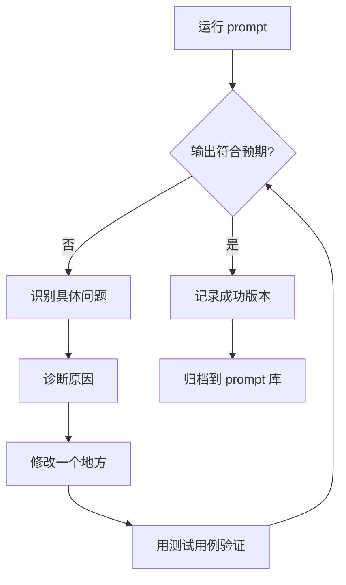

# 第 05 课：调试和改进 Prompt

> 本课目标：
> - 学会系统化地识别 prompt 问题
> - 掌握诊断问题原因的方法
> - 建立有效的迭代优化流程
>
> 前置知识：[<< 04 Chain-of-Thought](./04-chain-of-thought.md) | 下一课 [06 >>](./06-task-specific-strategies.md)

## 当 prompt 不管用时该怎么办

你精心写了一个 prompt，包含了角色、任务、格式、示例——然后 AI 输出的结果还是不对。可能是格式乱了、内容偏了、或者漏掉了关键信息。这时候该怎么办？

随机改几个词、祈祷下次运气好？还是系统化地找出问题、针对性地修正？本课教你后者——像调试代码一样调试 prompt：识别症状、诊断原因、小步修改、验证效果[^S8]。

## Prompt 调试的三步流程

Prompt 调试跟调试代码很像[^S8]：

1. **识别问题**：输出哪里不对？
2. **诊断原因**：prompt 的哪个部分导致了这个问题？
3. **修改验证**：改一个地方，测试是否改善

关键是**一次只改一个变量**。如果你同时改了三个地方，就不知道是哪个改动起了作用。

### 步骤 1：识别具体问题

"输出不对"太笼统，要具体到哪里不对[^S8]。

**常见问题类型**：

| 问题类型 | 具体表现 | 可能原因 |
|---------|---------|---------|
| 格式错误 | JSON 字段名不对、缺少某个部分 | 格式说明不够明确，或示例不一致 |
| 内容偏离 | 回答了不相关的问题、跑题了 | 任务描述不清楚，或约束条件不够 |
| 信息遗漏 | 漏掉了某些关键信息 | 没有明确列出所有需要的信息 |
| 过度发挥 | 输出了你不需要的额外内容 | 缺少"只输出 X，不要输出 Y"的约束 |
| 理解错误 | AI 误解了你的意图 | 用词歧义、或缺少示例澄清 |
| 不稳定 | 每次运行结果差异很大 | prompt 过于宽松、给了 AI 太多自由度 |

**示例：识别问题**

你的 prompt：
```
总结这篇文章的要点
```

AI 输出：
```
这篇文章讨论了三个要点：首先是……其次是……最后是……
```

**问题识别**：格式不是你要的列表格式，而且没有说是几个要点。

### 步骤 2：诊断原因

找出 prompt 的哪个部分（或缺失的部分）导致了问题。

**诊断问题的清单**：

- ✅ **任务描述清楚吗**？"总结要点"太模糊，没说几个要点、每个多长。
- ✅ **格式有示例吗**？没有，AI 只能猜你要什么格式。
- ✅ **约束条件够吗**？没有说"只输出要点，不要输出引导语"。
- ✅ **是否有歧义**？"要点"可能被理解为"核心观点"或"所有论点"。

诊断结果：**缺少格式说明和数量约束**。

### 步骤 3：小步修改，验证效果

一次只改一个问题，测试是否改善。

**修改 1：明确数量和格式**
```
用三个要点总结这篇文章，每个要点一句话，用项目符号列表格式。
```

测试结果：格式对了，但每个要点太长，超过一句话。

**修改 2：加入长度约束**
```
用三个要点总结这篇文章。

要求：
- 每个要点不超过 20 字
- 用项目符号（- ）列表
- 只输出要点，不要输出"要点如下"之类的引导语
```

测试结果：符合预期。

记录有效的修改，下次遇到类似问题可以复用。

```agentmentor-check
{
  "id": "prompt-engineering-debugging-identify-fix",
  "label": "诊断 prompt 问题",
  "prompt": "你的 prompt 是：\"写一段 Python 代码实现排序\"。AI 输出了一个冒泡排序，但你想要的是用内置函数 sorted()。应该怎么改？\n\nA: \"写一段 Python 代码，用最简单的方式实现排序\"\nB: \"写一段 Python 代码实现排序，使用 Python 内置的 sorted() 函数，不要自己实现排序算法\"\nC: \"写一段 Python 代码，要快速、高效的排序\"\nD: \"写一段高质量的 Python 排序代码\"",
  "whyHere": "检查你是否理解了调试的关键：明确说出你要的和不要的，而不是用模糊的形容词",
  "mode": "single",
  "choices": [
    {
      "id": "a",
      "text": "A - 强调'最简单'",
      "correct": false,
      "feedback": "❌ '最简单'是主观的。AI 可能认为冒泡排序代码行数少、逻辑简单，所以仍然给你冒泡排序。形容词（简单、快速、高效）通常不够明确。"
    },
    {
      "id": "b",
      "text": "B - 明确要 sorted() 且不要自己实现算法",
      "correct": true,
      "feedback": "✓ 正确。这个修改做到了两点：1) 明确指定用 sorted() 函数；2) 明确排除自己实现算法。既说了要什么，也说了不要什么，不给 AI 猜测的空间。"
    },
    {
      "id": "c",
      "text": "C - 强调'快速、高效'",
      "correct": false,
      "feedback": "❌ '快速、高效'仍然模糊。AI 可能给你快速排序算法的实现（确实快），而不是调用 sorted()。你需要的是明确的指令，不是性能要求。"
    },
    {
      "id": "d",
      "text": "D - 强调'高质量'",
      "correct": false,
      "feedback": "❌ '高质量'太笼统，没有解决问题。AI 可能给你一个注释完善、有错误处理的冒泡排序，认为这就是'高质量'。问题不在质量，在于你要的是调用内置函数而不是实现算法。"
    }
  ]
}
```

## 常见问题的诊断和修复

### 问题 1：格式不稳定

**症状**：有时输出 JSON，有时输出纯文本；有时用冒号，有时用等号。

**诊断**：缺少格式示例，或者示例之间格式不一致。

**修复**：
- 给出 2-3 个格式完全一致的示例
- 或者在约束中明确说："严格按照以下 JSON 格式，不要输出其他格式"

### 问题 2：遗漏信息

**症状**：输出只包含部分信息，总是漏掉某些字段。

**诊断**：你要求的信息没有明确列出来。

**修复**：
```
提取以下所有字段（必填）：
1. 标题
2. 作者
3. 发布日期
4. 摘要

如果某个字段在原文中找不到，输出"未提供"，不要省略该字段。
```

关键是**明确列出所有必填字段**，并说明找不到时该怎么办。

### 问题 3：过度解释

**症状**：你只要代码，AI 给了代码 + 一大段解释；你只要列表，AI 在列表前后加了介绍和总结。

**诊断**：缺少"只输出 X"的约束。

**修复**：
```
只输出可运行的代码，不要输出任何解释、注释或说明。
```

或者：
```
只输出列表，不要输出"以下是列表"之类的引导语或总结。
```

### 问题 4：理解偏差

**症状**：AI 理解错了你的意图，回答了相关但不对的问题。

**诊断**：用词有歧义，或者缺少上下文。

**示例**：
```
分析这段代码的问题
```

AI 可能分析：
- 代码风格问题
- 性能问题
- 安全问题
- 逻辑错误

你要的是逻辑错误，但 prompt 里没说。

**修复**：
```
分析这段代码中的逻辑错误。忽略代码风格和性能问题，只关注会导致输出错误的逻辑bug。
```

明确你要的维度，排除其他维度。

## 迭代优化的最佳实践

### 实践 1：建立测试用例

准备 3-5 个代表性的输入，每次修改后都用这些输入测试[^S8]。

**示例**：你在优化"提取产品评论的情感"这个 prompt。

测试用例：
1. 明显正面："非常满意，强烈推荐！"
2. 明显负面："完全不能用，浪费钱。"
3. 中性混合："功能还行，但价格有点贵。"
4. 边界情况："还可以吧。"
5. 复杂情况："客服态度很好，但产品质量一般。"

每次修改 prompt 后，用这 5 个输入测试，看是否都分类正确。

### 实践 2：记录版本和效果

像代码版本管理一样管理 prompt 版本[^S8]。

**简单的记录方式**：
```
版本 v1 (2024-01-15)：
提取评论情感

效果：
- 明显情况 OK
- 边界情况不稳定

---

版本 v2 (2024-01-15)：
将评论分类为"正面"、"负面"或"中性"。
示例：[3个示例]

效果：
- 边界情况改善
- 但输出格式不统一（有时输出"positive"、有时"正面"）

---

版本 v3 (2024-01-15)：
[v2 内容] + 约束：只输出中文"正面"、"负面"、"中性"三个词之一。

效果：✅ 通过所有测试用例
```

这样你知道每个改动带来了什么效果，如果新版本反而变差了，可以回退到上一个好版本。

### 实践 3：A/B 测试关键变化

不确定某个改动是否有效？同时保留两个版本，各测试 10 次，比较成功率。这就是 A/B 测试：一次只变一个因素，用数据判断优劣。

**示例**：你不确定加"让我们一步步思考"是否真的有帮助。

- 版本 A（不加）：10 次测试，7 次正确
- 版本 B（加 CoT）：10 次测试，9 次正确

数据说话，B 更好。

### 实践 4：从简单版本开始

不要一上来就写一个 500 字的复杂 prompt。从最简单的版本开始，逐步添加约束[^S8]。

**迭代路径**：
```
v1: 总结这篇文章
   → 不够具体

v2: 用三个要点总结这篇文章的核心观点
   → 要点太长

v3: 用三个要点总结这篇文章的核心观点，每个要点不超过 20 字
   → 格式不统一

v4: [v3] + 用项目符号列表，只输出要点不要输出引导语
   → ✅ 效果好
```

每一步只解决一个问题，最后得到一个刚好够用的 prompt，没有多余的废话。

## 调试流程总结

完整的调试流程是一个循环：运行 prompt → 检查输出 → 如果不符合预期就识别问题、诊断原因、修改一个地方、用测试用例验证 → 重复直到符合预期 → 记录成功版本。

下图展示了这个迭代循环的每个步骤：



**关键原则**：
- 一次只改一个地方
- 用测试用例验证每次改动
- 记录版本和效果
- 从简单开始逐步添加约束

## 何时停止优化

Prompt 优化没有终点，但有一个够用标准：

✅ **可以停止优化的信号**：
- 在测试用例上成功率 ≥ 90%
- 输出格式稳定
- 你能清楚解释 prompt 每个部分的作用
- 再优化的收益小于投入的时间

❌ **还需要继续的信号**：
- 成功率 < 70%
- 同样的输入每次输出差异很大
- 你不确定 prompt 的某些部分是否有用
- 在边界情况上经常出错

实用主义原则：**够用就行，别追求完美**。如果 90% 的情况下都工作良好，剩下 10% 的边界情况可以人工介入。

## 小结

调试 prompt 的流程是：识别具体问题 → 诊断原因 → 小步修改 → 验证效果。关键是一次只改一个变量，用测试用例验证每次改动，记录版本和效果。

常见问题包括格式不稳定、遗漏信息、过度解释、理解偏差。针对每种问题有对应的修复策略：加示例、明确字段、加"只输出"约束、排除歧义。

从简单版本开始，逐步添加约束，直到在测试用例上成功率达到 90% 以上。记录有效的 prompt 版本，下次可以复用。

下一课学习针对不同任务类型的 prompt 策略——代码生成、文档写作、数据分析各有什么特定技巧。

**下一课** [针对不同任务的 Prompt 策略 >>](./06-task-specific-strategies.md)

<!-- exercises -->

### Level 1：诊断 prompt 问题

下面是一个有问题的 prompt 和 AI 的输出。请识别问题并给出修复方案。

**Prompt**：
```
总结这篇文章的要点
```

**AI 输出**（三次运行的结果）：
- 第一次：一段 200 字的文字总结
- 第二次：5 个项目符号要点
- 第三次：一句话概括 + 三段详细说明

**问题**：输出格式不稳定，每次都不一样。

<!-- rubric -->
- 准确识别出问题的根本原因（缺少格式约束）
- 修复方案包含明确的格式要求
- 修复方案指定了数量、长度等具体约束
- 考虑了"只输出 X，不要输出 Y"的排除性约束
- 修复后的 prompt 能消除输出不稳定的问题
<!-- answer -->
**问题诊断**：
1. **根本原因**：prompt 没有指定输出格式，AI 每次自己决定用什么方式总结
2. **具体缺失**：
   - 没说要几个要点
   - 没说每个要点多长
   - 没说用什么格式（列表、段落、表格等）
   - 没说要不要引导语

**修复方案**：

```
用三个要点总结这篇文章的核心观点。

要求：
- 恰好 3 个要点，用项目符号（- ）列表
- 每个要点 1 句话，不超过 30 字
- 只输出要点本身，不要输出"文章要点如下："之类的引导语
- 按重要性从高到低排序

文章内容：
[粘贴文章]
```

**为什么这样能解决问题**：
- "恰好 3 个要点" → 消除数量不确定性
- "用项目符号列表" → 明确格式
- "1 句话，不超过 30 字" → 控制长度
- "只输出要点" → 排除引导语
- 每次运行都会得到相同格式的输出（3 个短句列表）

<!-- hint -->
输出不稳定通常是因为 prompt 给了 AI 太多选择空间。想想：你的 prompt 中哪些地方 AI 可以"自由发挥"？然后把这些地方明确下来。
<!-- hint -->
用"只输出 X，不要输出 Y"的约束来排除你不想要的内容。比如不要引导语、不要解释、不要举例。

### Level 2：迭代优化真实 prompt

选择你自己写过的一个 prompt（或使用下面的场景），通过 3 轮迭代优化它。

**场景**：让 AI 从会议记录中提取待办事项。

**要求**：
1. 写出 v1 版本（最初的 prompt）
2. 测试后发现问题，写出 v2（修复一个主要问题）
3. 再次测试发现新问题，写出 v3（最终版本）
4. 说明每次改动解决了什么问题

<!-- rubric -->
- v1 是一个合理的初始尝试，不是故意写差的
- v2 针对 v1 的具体问题做了明确改进（不是全盘重写）
- v3 进一步优化，达到可用标准
- 每次迭代都说明了：发现的问题、改动内容、为什么这样改
- 最终版本考虑了格式、完整性、边界情况
<!-- answer -->
**v1：最初版本**

```
从这段会议记录中提取待办事项
```

**测试问题**：
- AI 提取了所有提到的任务，包括已完成的和只是讨论的
- 没有负责人和截止日期信息
- 格式混乱（有时是列表，有时是段落）

---

**v2：添加格式和字段要求**

```
从会议记录中提取待办事项，每项包含：任务、负责人、截止日期。

输出格式：
- [任务描述] | 负责人：[姓名] | 截止：[日期]

会议记录：
[粘贴记录]
```

**测试问题**：
- AI 提取了"讨论是否要做 X"这种未决定的事项
- 有些待办事项记录里没有明确负责人，AI 编造了一个
- 截止日期有些是"下周"，AI 没有转换为具体日期

---

**v3：最终版本（加入明确规则）**

```
从会议记录中提取已确定的待办事项。

提取规则：
- 只提取明确决定要做的任务（有"决定"、"确认"、"行动项"等词）
- 不包含：正在讨论的、已完成的、被否决的
- 如果某个字段（负责人或截止日期）在记录中找不到，输出"待定"，不要猜测

输出格式：
每行一个待办事项，格式如下：
- [任务描述，一句话] | 负责人：[姓名/待定] | 截止：[YYYY-MM-DD/待定]

会议记录：
[粘贴记录]
```

**迭代总结**：

| 版本 | 主要问题 | 改进内容 | 解决的问题 |
|------|---------|---------|-----------|
| v1 | 输出混乱、信息不全 | 添加了输出格式和必需字段 | 格式统一、包含关键信息 |
| v2 | 提取了不该提取的、编造信息 | 添加了提取规则和缺失值处理 | 只提取确定的任务、不编造数据 |
| v3 | - | 最终可用版本 | 准确、完整、格式一致 |

**关键经验**：
1. 第一版先把格式定下来，不要让 AI 自己决定
2. 第二版加规则，说清楚"要什么、不要什么"
3. 第三版处理边界情况（缺失值、模糊表述）
4. 每次只改一个主要问题，测试效果后再改下一个

<!-- hint -->
真实的优化过程是：写 prompt → 测试 → 发现问题 → 改一个地方 → 再测试。不要一次改三个地方，否则不知道哪个改动起作用了。
<!-- hint -->
记录每个版本的效果（成功率、常见错误），这样你知道优化是在进步还是在倒退。如果 v3 比 v2 差，回退到 v2 再从另一个角度改。

<!-- /exercises -->
